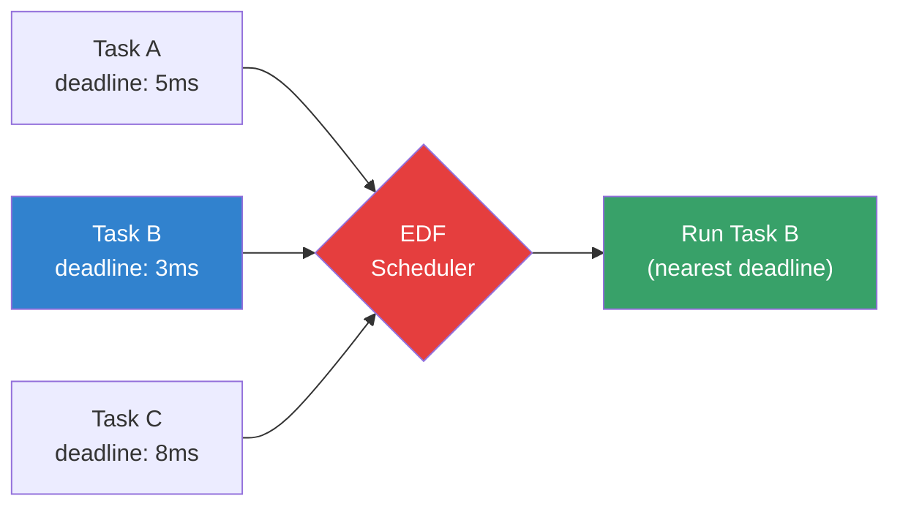
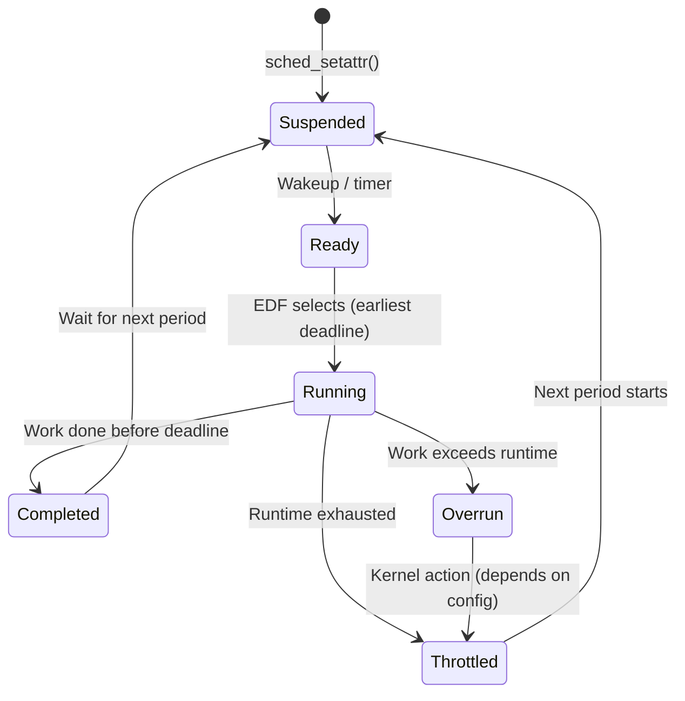

# Deadline Scheduling (SCHED_DEADLINE)

## Introduction

Linux's `SCHED_DEADLINE` scheduler, merged in Linux 3.14 (2013), implements the **Earliest Deadline First (EDF)** scheduling algorithm with **Constant Bandwidth Server (CBS)** admission control. It is designed for real-time workloads with hard or soft timing constraints—tasks that must complete their work within specific time windows.

Unlike `SCHED_FIFO` and `SCHED_RR` which use fixed priorities, `SCHED_DEADLINE` uses a task's deadline as the scheduling criterion: **the task with the nearest absolute deadline runs first**. This provides optimal CPU utilization for real-time workloads (up to 100% for periodic task sets, versus the theoretical ~69% limit of rate-monotonic scheduling).

`SCHED_DEADLINE` tasks are always scheduled **before** any `SCHED_FIFO`, `SCHED_RR`, or `SCHED_NORMAL` tasks.

## Core Concepts

### The Three Parameters

Every `SCHED_DEADLINE` task is characterized by three temporal parameters:

| Parameter | Description | Example |
|-----------|-------------|---------|
| **Runtime** (`sched_runtime`) | Maximum CPU time needed per period | 4ms |
| **Deadline** (`sched_deadline`) | Maximum time from period start to completion | 8ms |
| **Period** (`sched_period`) | Minimum time between successive activations | 10ms |

**Intuitive explanation:** "Every 10ms, I need at most 4ms of CPU time, and I need it finished within 8ms of when my period starts."

### CBS (Constant Bandwidth Server)

CBS is the admission control mechanism that prevents deadline tasks from starving other work. It acts as a "bandwidth reservation" system:

1. Each task is assigned a **server** with bandwidth = runtime/period
2. The kernel tracks each task's remaining runtime within its current period
3. When runtime is exhausted, the task is **throttled** until the next period
4. **Admission control** checks whether the total bandwidth of all deadline tasks on a CPU exceeds the CPU's capacity before accepting a new task

```
Bandwidth = Runtime / Period
Example: 4ms / 10ms = 0.4 (40% CPU)

Total deadline bandwidth on a CPU must be ≤ 1.0 (100%)
In practice, the kernel uses a default of 95% to leave room for interrupts
```

### EDF Scheduling Algorithm



The scheduler always picks the task with the **earliest (smallest) absolute deadline**. When multiple tasks have the same deadline, tie-breaking uses FIFO order.

## Setting Up SCHED_DEADLINE

### Using `sched_setattr()` System Call

```c
#define _GNU_SOURCE
#include <linux/sched.h>
#include <linux/sched/types.h>
#include <sys/syscall.h>
#include <unistd.h>
#include <stdio.h>

struct sched_attr {
    uint32_t size;
    uint32_t sched_policy;
    uint64_t sched_flags;
    int32_t  sched_nice;
    uint32_t sched_priority;
    /* SCHED_DEADLINE fields */
    uint64_t sched_runtime;
    uint64_t sched_deadline;
    uint64_t sched_period;
};

static int sched_setattr(pid_t pid, struct sched_attr *attr, unsigned int flags) {
    return syscall(SYS_sched_setattr, pid, attr, flags);
}

int main() {
    struct sched_attr attr = {
        .size           = sizeof(attr),
        .sched_policy   = SCHED_DEADLINE,  /* 6 */
        .sched_flags    = 0,
        .sched_nice     = 0,
        .sched_priority = 0,
        .sched_runtime  = 4 * 1000 * 1000,    /* 4ms in nanoseconds */
        .sched_deadline = 8 * 1000 * 1000,    /* 8ms */
        .sched_period   = 10 * 1000 * 1000,   /* 10ms */
    };

    if (sched_setattr(0, &attr, 0) < 0) {
        perror("sched_setattr");
        return 1;
    }

    /* This process now runs as SCHED_DEADLINE */
    while (1) {
        /* Do real-time work */
        /* ... */
        /* Sleep until next period */
        struct timespec ts = {.tv_sec = 0, .tv_nsec = 10 * 1000 * 1000};
        clock_nanosleep(CLOCK_MONOTONIC, 0, &ts, NULL);
    }
    return 0;
}
```

### Using `chrt` Command

```bash
# Set a process to SCHED_DEADLINE
# chrt --deadline <runtime_us> <deadline_us> <period_us> <command>
chrt --deadline 4000 8000 10000 ./my_rt_app

# Set an existing process
chrt --deadline --pid 4000 8000 10000 12345

# View deadline parameters
chrt -p 12345
# pid 12345's current scheduling policy: SCHED_DEADLINE
# pid 12345's current scheduling attributes:
#   runtime=4000000, deadline=8000000, period=10000000

# View all deadline tasks
ps -eo pid,cls,rtprio,comm | grep DL
#   PID CLS RTPRIO COMMAND
#   456  DL      - my_rt_app
```

### Using `sched_setparam()` with `struct sched_param_ex`

```c
#include <sched.h>

struct sched_param_ex {
    int sched_priority;
    struct timespec sched_runtime;
    struct timespec sched_deadline;
    struct timespec sched_period;
};

struct sched_param_ex param = {
    .sched_priority = 0,
    .sched_runtime  = {.tv_sec = 0, .tv_nsec = 4000000},   /* 4ms */
    .sched_deadline = {.tv_sec = 0, .tv_nsec = 8000000},   /* 8ms */
    .sched_period   = {.tv_sec = 0, .tv_nsec = 10000000},  /* 10ms */
};

sched_setscheduler(pid, SCHED_DEADLINE, &param);
```

## Admission Control

The kernel's admission control test determines whether a new deadline task can be accepted without violating existing guarantees.

### The Bandwidth Test

```
For each CPU i:
    sum(runtime_j / period_j) for all deadline tasks on CPU i ≤ 0.95

Global cap (default):
    /proc/sys/kernel/sched_rt_runtime_us = 950000 (for RT classes)
    /proc/sys/kernel/sched_rt_period_us  = 1000000

Deadline-specific:
    /proc/sys/kernel/sched_deadline_period_max_us
    /proc/sys/kernel/sched_deadline_period_min_us
```

```bash
# Check admission control
cat /proc/sys/kernel/sched_rt_runtime_us
# 950000  (950ms per 1000ms period = 95%)

# Modify (careful!)
echo -1 > /proc/sys/kernel/sched_rt_runtime_us  # Disable RT throttling
echo 950000 > /proc/sys/kernel/sched_rt_runtime_us  # Restore

# Check deadline period bounds
cat /proc/sys/kernel/sched_deadline_period_max_us
# 4194304  (4.19 seconds max period)
cat /proc/sys/kernel/sched_deadline_period_min_us
# 100      (100μs min period)

# Admission failure shows in dmesg
dmesg | grep -i deadline
# [sched_setattr] dl admission control failed, rejected
```

### Multi-CPU Admission

```bash
# Pin deadline task to specific CPU
taskset -c 0 chrt --deadline 4000 8000 10000 ./app1
taskset -c 0 chrt --deadline 3000 6000 10000 ./app2
# Total bandwidth on CPU 0: 40% + 50% = 90% ✓ Accepted

taskset -c 0 chrt --deadline 4000 8000 10000 ./app3
# Total: 40% + 50% + 50% = 140% ✗ Admission control rejects
```

## Runtime Behavior and Throttling

### The Deadline Task Lifecycle



### Monitoring Deadline Tasks

```bash
# /proc/<pid>/sched shows deadline info
cat /proc/456/sched
# my_rt_app (456, #threads: 1)
# ---------------------------------------------------------
# se.exec_start                      :     1234567.890123
# se.vruntime                        :           0.000000
# se.sum_exec_runtime                :        3456.789012
# nr_switches                        :              1234
# nr_voluntary_switches              :               890
# nr_involuntary_switches            :                344
# dl.runtime                         :        4000000
# dl.deadline                        :     1234567890123
# dl.dl_new                          :               0
# dl.dl_boosted                      :               0
# dl.dl_throttled                    :               0

# trace-cmd for deadline events
trace-cmd record -e sched -e sched_switch -e sched_wakeup
# Look for SCHED_DEADLINE events
trace-cmd report | grep -i deadline
```

### Deadline Overruns

When a task exceeds its runtime budget, the kernel handles it via the CBS mechanism:

```bash
# Check for overruns (kernel 5.10+)
cat /proc/456/sched | grep dl_overrun
# dl_overrun: 3  ← task exceeded its runtime 3 times

# dmesg can show overrun warnings
dmesg | grep -i "dl_throttle\|overrun"
```

## Use Cases

### Audio Processing

```c
/*
 * Audio callback: needs to run every 1ms, consuming max 0.5ms CPU
 * Period: 1ms, Runtime: 0.5ms, Deadline: 1ms
 */
struct sched_attr audio_attr = {
    .size           = sizeof(audio_attr),
    .sched_policy   = SCHED_DEADLINE,
    .sched_runtime  = 500000,      /* 0.5ms */
    .sched_deadline = 1000000,     /* 1ms */
    .sched_period   = 1000000,     /* 1ms */
};

void audio_callback(void) {
    sched_setattr(0, &audio_attr, 0);
    while (running) {
        process_audio_buffer();
        /* Sleep until next period via clock_nanosleep */
    }
}
```

### Industrial Control Loop

```bash
# Control loop: runs every 10ms, needs max 2ms CPU, deadline 5ms
chrt --deadline 2000 5000 10000 ./control_loop

# Video frame processing: 33ms period (30fps), 20ms max work
chrt --deadline 20000 30000 33333 ./video_encoder
```

### Mixed Criticality

```bash
# High-criticality: tight deadline, guaranteed runtime
taskset -c 0 chrt --deadline 1000 2000 5000 ./safety_monitor

# Low-criticality: longer deadline, can be deferred
taskset -c 1 chrt --deadline 5000 20000 50000 ./data_logger

# Both coexist on the system without interference
# (safety_monitor always has priority due to earlier deadline)
```

## Deadline Scheduling vs Other Policies

| Feature | SCHED_FIFO | SCHED_RR | SCHED_DEADLINE |
|---------|-----------|----------|----------------|
| Algorithm | Fixed priority | Fixed priority + time slice | EDF |
| Admission control | No | No | Yes (CBS) |
| Bandwidth guarantee | No | No | Yes |
| Optimal utilization | ~69% (RMS bound) | ~69% | Up to 100% |
| Starvation risk | High | Medium | None (per-task) |
| Temporal guarantee | None | None | Yes |
| Complexity | Low | Low | Medium |

## Troubleshooting

```bash
# Task rejected by admission control?
# Check current bandwidth usage
cat /proc/sched_debug 2>/dev/null || cat /sys/kernel/debug/sched/debug
# Look for "dl_rq" sections

# Common errors:
# EINVAL: runtime > deadline, or deadline > period
# EBUSY:  admission control failure (bandwidth exceeded)
# EPERM:  insufficient privileges (needs CAP_SYS_NICE)

# Grant capability
sudo setcap cap_sys_nice+ep ./my_rt_app

# Or use systemd service
# [Service]
# AmbientCapabilities=CAP_SYS_NICE
```

## References

- [The Linux Kernel Documentation](https://docs.kernel.org/)
- [LWN.net - Linux and free software news](https://lwn.net/)
- [GNU Project Documentation](https://www.gnu.org/doc/doc.html)
- [GNU Manuals](https://www.gnu.org/manual/manual.html)
- [Free Software Directory](https://directory.fsf.org/wiki/Main_Page)
- [Planet GNU](https://planet.gnu.org/)
- [Free Software Books](https://www.gnu.org/doc/other-free-books.html)

- [SCHED_DEADLINE design document](https://www.kernel.org/doc/sched/deadline-design.txt) — Original design notes
- [sched(7) man page](https://man7.org/linux/man-pages/man7/sched.7.html) — Scheduling overview
- [chrt(1) man page](https://man7.org/linux/man-pages/man1/chrt.1.html) — Command-line tool
- [EDF and CBS Linux kernel documentation](https://www.kernel.org/doc/Documentation/scheduler/sched-deadline.txt)
- [Real-Time Linux Wiki](https://wiki.linuxfoundation.org/realtime/start) — RT Linux resources

## Related Topics

- [Process Priorities](./priorities.md) — Nice values and RT priorities
- [NUMA Scheduling](./numa-scheduling.md) — Memory-aware scheduling
- [Completion Variables](../sync/completions.md) — Kernel synchronization
