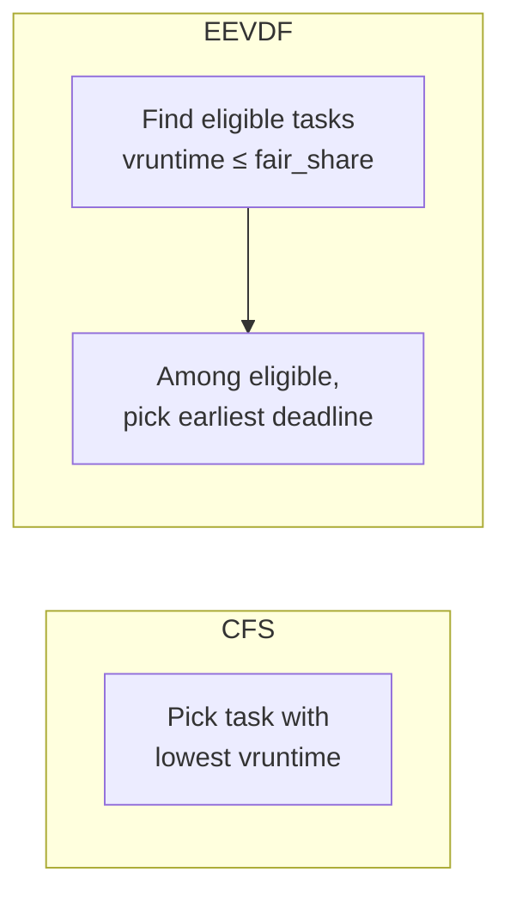
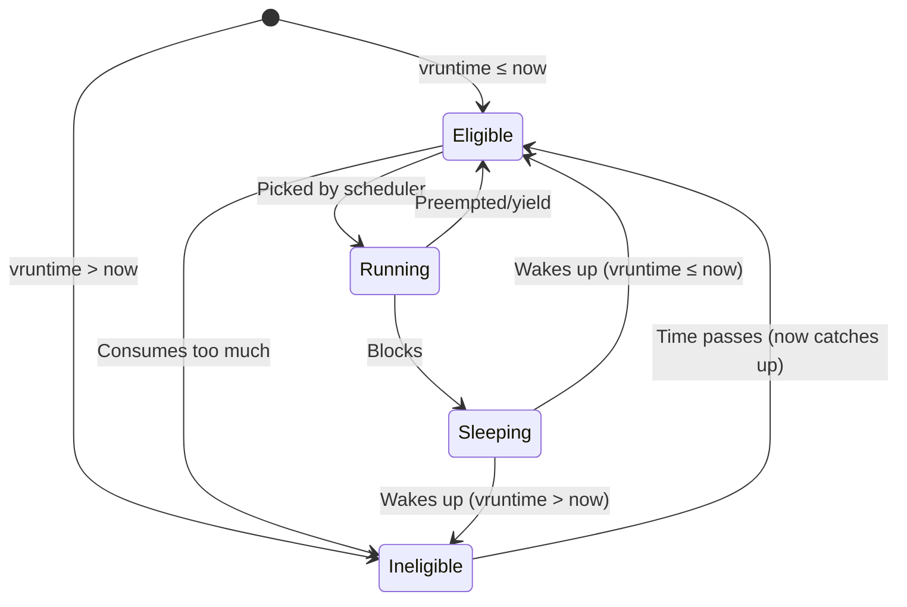
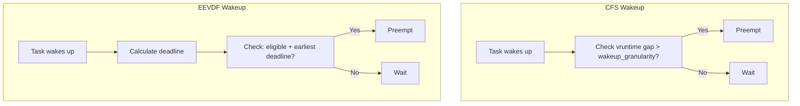
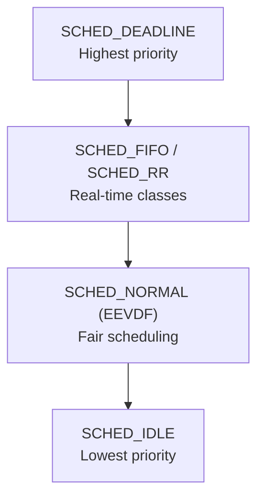

# The EEVDF Scheduler

## Introduction

The **Earliest Eligible Virtual Deadline First (EEVDF)** scheduler is the successor to CFS in the Linux kernel, merged in Linux 6.6 (2023). Designed by Peter Zijlstra, it addresses several of CFS's limitations while preserving its core fairness guarantees.

EEVDF is a well-known real-time scheduling algorithm adapted for general-purpose use. Its key innovation is combining **virtual runtime fairness** (from CFS) with **deadline-based scheduling** (from real-time theory). This gives better latency control for interactive tasks without sacrificing fairness or throughput.

### Why Replace CFS?

CFS has served Linux well since 2007, but has several known issues:

1. **Latency problems** — CFS uses a single latency target; interactive tasks can't be distinguished from batch tasks without hacks like `sched_min_granularity`
2. **Sleeper bonus abuse** — Tasks that sleep briefly can accumulate unfair advantage
3. **Preemption heuristics** — CFS's wakeup preemption uses magic numbers and heuristics that don't always work well
4. **Lack of theoretical backing** — CFS is empirically tuned rather than mathematically proven

EEVDF addresses all of these by using a principled algorithm from real-time scheduling theory.

## The EEVDF Algorithm

### Core Concepts

EEVDF extends the concept of virtual runtime with two new ideas:

1. **Eligibility** — A task is eligible to be scheduled only if its virtual runtime is at or below the fair share
2. **Virtual Deadline** — Each task gets a virtual deadline based on its request and weight; the scheduler picks the eligible task with the earliest virtual deadline



### Mathematical Foundation

The EEVDF algorithm was described by Ion Stoica and Hussein Abdel-Wahab in their 1995 paper. The key definitions:

**Virtual time**: Same concept as CFS's vruntime — normalized CPU time consumed.

**Virtual request**: The amount of virtual time a task requests in each scheduling round, based on its nice value.

**Virtual deadline**: `deadline_i = arrival_i + request_i`

Where:
- `arrival_i` — when the task became eligible (its vruntime at wake-up)
- `request_i` — how much virtual time it needs (proportional to its weight)

**Eligibility**: A task is eligible at virtual time `t` if `vruntime_i(t) ≤ t`

This means a task is eligible if it's "behind" the fair share — it hasn't consumed more than its fair share of CPU time.

### Task States in EEVDF



## Implementation in Linux

### Data Structures

EEVDF uses the same red-black tree as CFS but with additional fields:

```c
/* include/linux/sched.h */
struct sched_entity {
    struct load_weight load;
    struct rb_node run_node;
    struct list_head group_node;
    unsigned int on_rq;

    u64 exec_start;
    u64 sum_exec_runtime;
    u64 prev_sum_exec_runtime;
    u64 vruntime;

    /* EEVDF-specific fields */
    u64 deadline;       /* Virtual deadline */
    u64 min_vruntime;   /* Minimum vruntime for eligibility */

    /* ... */
};
```

```c
/* kernel/sched/sched.h */
struct cfs_rq {
    struct load_weight load;
    unsigned int nr_running;
    u64 exec_clock;
    u64 min_vruntime;

    struct rb_root_cached tasks_timeline;
    struct sched_entity *curr;
    struct sched_entity *next;
    struct sched_entity *skip;

    /* EEVDF: track the "lag" for fairness */
    s64 avg_vruntime;   /* Average vruntime for lag calculation */
    s64 avg_load;       /* Average load */

    /* ... */
};
```

### Virtual Deadline Calculation

```c
/* kernel/sched/fair.c */
static u64 calc_delta_fair(u64 delta, struct sched_entity *se)
{
    if (unlikely(se->load.weight != NICE_0_LOAD))
        delta = __calc_delta(delta, NICE_0_LOAD, &se->load);
    return delta;
}

/* Calculate virtual deadline for a task */
static u64 entity_deadline(struct sched_entity *se)
{
    /* deadline = vruntime + request */
    /* request = latency * weight / total_weight */
    return se->vruntime + calc_delta_fair(sysctl_sched_latency, se);
}
```

### Eligibility Check

```c
/* kernel/sched/fair.c */
static int entity_eligible(struct cfs_rq *cfs_rq, struct sched_entity *se)
{
    /* A task is eligible if its vruntime ≤ average vruntime */
    /* This is a simplified check; the actual implementation
     * uses a weighted average */
    struct avg_vruntime *avg = &cfs_rq->avg;
    s64 avg_value = avg_vruntime(avg);
    s64 entity_key = entity_key(cfs_rq, se);

    return entity_key <= avg_value;
}
```

### Pick Next Entity

The core EEVDF scheduling decision:

```c
/* kernel/sched/fair.c */
static struct sched_entity *pick_eevdf(struct cfs_rq *cfs_rq)
{
    struct rb_node *node = cfs_rq->tasks_timeline.rb_root.rb_node;
    struct sched_entity *best = NULL;
    struct sched_entity *curr = cfs_rq->curr;

    /* First check if current entity should continue */
    if (curr && curr->on_rq && entity_eligible(cfs_rq, curr))
        best = curr;

    /* Walk the tree looking for eligible entity with earliest deadline */
    while (node) {
        struct sched_entity *se = rb_entry(node, struct sched_entity, run_node);

        if (entity_eligible(cfs_rq, se)) {
            /* This entity is eligible */
            if (!best || se->deadline < best->deadline)
                best = se;

            /* Try left subtree for even earlier deadlines */
            node = node->rb_left;
        } else {
            /* Not eligible, try right subtree */
            node = node->rb_right;
        }
    }

    return best;
}
```

Actually, the real implementation uses a more efficient O(log n) search:

```c
/* kernel/sched/fair.c - actual pick_eevdf */
static struct sched_entity *pick_eevdf(struct cfs_rq *cfs_rq)
{
    struct rb_node *node = cfs_rq->tasks_timeline.rb_root.rb_node;
    struct sched_entity *se, *best = NULL;
    struct sched_entity *curr = cfs_rq->curr;
    u64 now = cfs_rq->min_vruntime;

    /* Start from root, go down */
    while (node) {
        se = rb_entry(node, struct sched_entity, run_node);

        if (entity_eligible(cfs_rq, se)) {
            /* Eligible: check if it has the earliest deadline */
            if (!best || se->deadline < best->deadline)
                best = se;
            /* Go left to find earlier eligible tasks */
            node = node->rb_left;
        } else {
            /* Not eligible: go right */
            node = node->rb_right;
        }
    }

    /* If no eligible task found, pick leftmost (least lagging) */
    if (!best)
        best = __pick_first_entity(cfs_rq);

    return best;
}
```

## Lag and Fairness

### The Lag Concept

EEVDF introduces the concept of **lag** — how far ahead or behind a task is compared to its fair share:

```
lag_i = fair_share_i - actual_cpu_time_i
```

- **Positive lag** — task has received less than its fair share (it's "owed" CPU time)
- **Negative lag** — task has received more than its fair share (it "owes" CPU time)

```c
/* kernel/sched/fair.c */
static s64 entity_key(struct cfs_rq *cfs_rq, struct sched_entity *se)
{
    /* entity_key = vruntime - avg_vruntime */
    /* Negative means the task is behind (has positive lag) */
    return se->vruntime - avg_vruntime(&cfs_rq->avg);
}
```

### Lag Tracking

The kernel tracks lag through the `avg_vruntime` mechanism:

```c
/* kernel/sched/fair.c */
struct avg_vruntime {
    s64 avg;       /* Weighted average vruntime */
    u64 load;      /* Total load */
};

static s64 avg_vruntime(struct avg_vruntime *avg)
{
    /* Average vruntime across all tasks */
    if (avg->load)
        return div_s64(avg->avg, avg->load);
    return 0;
}

/* Update average when a task joins/leaves */
static void avg_vruntime_add(struct cfs_rq *cfs_rq, struct sched_entity *se)
{
    struct avg_vruntime *avg = &cfs_rq->avg;
    avg->avg += se->vruntime * se->load.weight;
    avg->load += se->load.weight;
}

static void avg_vruntime_sub(struct cfs_rq *cfs_rq, struct sched_entity *se)
{
    struct avg_vruntime *avg = &cfs_rq->avg;
    avg->avg -= se->vruntime * se->load.weight;
    avg->load -= se->load.weight;
}
```

## EEVDF vs CFS

### Key Differences

| Aspect | CFS | EEVDF |
|---|---|---|
| Scheduling decision | Lowest vruntime | Eligible + earliest deadline |
| Latency control | Global `sched_latency` | Per-task deadlines |
| Sleeper bonus | Explicit `place_entity()` hack | Emerges naturally from lag |
| Preemption | Heuristic `wakeup_granularity` | Principled deadline comparison |
| Fairness | Approximate (sleepers get advantage) | Exact (lag-based) |
| Theoretical basis | Empirical | Formal (Stoica & Abdel-Wahab 1995) |

### Latency Comparison



### Practical Latency Improvement

```bash
# CFS: interactive task might wait up to sched_latency (6ms)
# EEVDF: interactive task gets deadline = vruntime + request
# Since interactive tasks have small requests, their deadlines
# are tight, so they get scheduled quickly

# Benchmark: measure scheduling latency
$ sudo perf sched record -- stress-ng --cpu 4 --timeout 10
$ sudo perf sched latency --sort max
  Task         | Max delay |
  -------------+-----------+
  bash         |   0.5ms   |  (EEVDF, better latency)
  stress-ng    |   2.1ms   |
```

## Sleeper Fairness

### The Problem with CFS's Sleeper Bonus

In CFS, sleeping tasks get a `vruntime` reduction (the "sleeper bonus") to prevent them from being starved after waking. But this creates a problem: tasks that sleep frequently (interactive tasks) accumulate unfair advantage.

### EEVDF's Solution

EEVDF handles sleepers naturally through the lag mechanism:

```c
/* When a task wakes up in EEVDF: */
static void place_entity(struct cfs_rq *cfs_rq, struct sched_entity *se, int initial)
{
    /* Place at min_vruntime */
    se->vruntime = cfs_rq->min_vruntime;

    /* The lag naturally handles fairness:
     * - If the task slept for a long time, it has high positive lag
     *   (it's owed CPU time), so it becomes eligible quickly
     * - But its deadline is based on its request, not the sleep duration
     *   so it doesn't get an unfair advantage
     */
    se->deadline = se->vruntime + calc_delta_fair(sysctl_sched_latency, se);
}
```

This means:
- A task that slept for 10 seconds doesn't get 10 seconds of CPU time
- It becomes eligible immediately (positive lag), but its deadline is just `min_vruntime + request`
- It competes fairly with other tasks

## Tuning EEVDF

### Sysctls

EEVDF uses the same sysctls as CFS:

```bash
# Latency target (affects virtual deadlines)
$ sysctl kernel.sched_latency_ns
kernel.sched_latency_ns = 6000000  # 6ms

# Minimum granularity
$ sysctl kernel.sched_min_granularity_ns
kernel.sched_min_granularity_ns = 750000  # 0.75ms

# New EEVDF-specific: base slice
$ sysctl kernel.sched_base_slice_ns
kernel.sched_base_slice_ns = 3000000  # 3ms
```

### Runtime Behavior

```bash
# Check if EEVDF is active
$ cat /proc/sched_debug | head -10
# Should show "eevdf" in the scheduler version

# Verify scheduling class
$ chrt -p $$
pid 500's scheduling policy: SCHED_OTHER
pid 500's scheduling priority: 0
```

## Implementation Details

### Enqueue with EEVDF

```c
/* kernel/sched/fair.c */
static void enqueue_entity(struct cfs_rq *cfs_rq, struct sched_entity *se, int flags)
{
    bool renorm = !(flags & ENQUEUE_WAKEUP) || (flags & ENQUEUE_WAKING);
    bool curr = cfs_rq->curr == se;

    /* Renormalize vruntime if needed */
    if (renorm && curr)
        se->vruntime = cfs_rq->min_vruntime;

    /* Update deadline */
    if (flags & ENQUEUE_WAKEUP) {
        /* Recalculate deadline on wakeup */
        se->deadline = entity_deadline(se);
    }

    /* Update statistics */
    update_stats_enqueue(cfs_rq, se, flags);

    /* Insert into tree if not current */
    if (!curr)
        __enqueue_entity(cfs_rq, se);

    /* Update lag tracking */
    avg_vruntime_add(cfs_rq, se);

    cfs_rq->nr_running++;
}
```

### Dequeue with EEVDF

```c
static void dequeue_entity(struct cfs_rq *cfs_rq, struct sched_entity *se, int flags)
{
    /* Remove from tree if not current */
    if (se != cfs_rq->curr)
        __dequeue_entity(cfs_rq, se);

    /* Update lag tracking */
    avg_vruntime_sub(cfs_rq, se);

    cfs_rq->nr_running--;

    /* Keep vruntime for when task wakes up */
    if (!(flags & DEQUEUE_SLEEP))
        se->vruntime -= cfs_rq->min_vruntime;
}
```

## Future Directions

EEVDF is still being refined. Active areas of development include:

1. **Latency-nice** — A new scheduling parameter to control per-task latency requirements, directly influencing virtual deadlines
2. **Better group scheduling** — Extending EEVDF's fairness guarantees to cgroups
3. **Improved preemption** — Using deadlines for more principled preemption decisions
4. **Integration with SCHED_DEADLINE** — Potentially unifying the deadline scheduling classes

### Latency Nice (Proposed)

```c
/* Proposed addition to task_struct */
struct sched_entity {
    /* ... */
    u16 latency_nice;  /* -20 to 19, lower = more latency-sensitive */
    /* Affects deadline calculation:
     * deadline = vruntime + request * (1 + latency_nice_factor)
     */
};
```

```bash
# Proposed API (not yet merged as of 6.6)
$ echo -20 > /proc/$PID/latency_nice  # Very latency-sensitive
$ echo 19 > /proc/$PID/latency_nice   # Tolerant of latency
```

## EEVDF and Real-Time Scheduling Classes

Linux has multiple scheduling classes with strict priority ordering:



### Priority Between Classes

```bash
# The scheduler always picks from the highest non-empty class
# SCHED_DEADLINE > SCHED_FIFO > SCHED_RR > SCHED_NORMAL > SCHED_IDLE

# An RT process will preempt ALL EEVDF processes
sudo chrt -f 50 stress-ng --cpu 1 --timeout 5 &
# This will monopolize one CPU, starving EEVDF tasks on that CPU

# RT throttle: kernel protects against runaway RT tasks
# Default: 95% of CPU time for RT, 5% reserved for EEVDF
sysctl kernel.sched_rt_runtime_us   # 950000 (950ms per 1s period)
sysctl kernel.sched_rt_period_us    # 1000000 (1 second)

# Disable RT throttle (DANGEROUS — can lock out all normal tasks)
sysctl -w kernel.sched_rt_runtime_us=-1
```

### Interaction With SCHED_DEADLINE

```c
/* SCHED_DEADLINE tasks have absolute priorities over EEVDF */
/* A deadline task specifies: runtime, deadline, period */

struct sched_attr attr = {
    .size = sizeof(attr),
    .sched_policy = SCHED_DEADLINE,
    .sched_runtime = 1000000,    /* 1ms of CPU time */
    .sched_deadline = 5000000,   /* must finish within 5ms */
    .sched_period = 10000000,    /* repeats every 10ms */
};
sched_setattr(0, &attr, 0);

/* Deadline tasks are admitted via admission control */
/* Total deadline utilization must not exceed CPU capacity */
```

## EEVDF and Cgroup Integration

EEVDF integrates with cgroup v2 for hierarchical scheduling:

### Per-Cgroup Weight

```bash
# cgroup v2 uses "cpu.weight" for EEVDF weight
# Range: 1-10000, default 100

# Create cgroups
echo "+cpu" > /sys/fs/cgroup/cgroup.subtree_control
mkdir /sys/fs/cgroup/high_prio
mkdir /sys/fs/cgroup/low_prio

# Set weights (proportional CPU share)
echo 200 > /sys/fs/cgroup/high_prio/cpu.weight
echo 50  > /sys/fs/cgroup/low_prio/cpu.weight

# Move processes
echo $PID > /sys/fs/cgroup/high_prio/cgroup.procs

# high_prio gets 200/250 = 80% CPU when both are busy
# low_prio gets 50/250 = 20% CPU
```

### Cgroup Bandwidth Limiting

```bash
# Hard CPU bandwidth limit (cgroup v2)
echo "100000 100000" > /sys/fs/cgroup/app/cpu.max
# 100ms per 100ms period = 100% of one CPU

# 50% of one CPU
echo "50000 100000" > /sys/fs/cgroup/app/cpu.max

# View CPU statistics
cat /sys/fs/cgroup/app/cpu.stat
# usage_usec 12345678
# user_usec 10000000
# system_usec 2345678
# nr_periods 1000
# nr_throttled 50
# throttled_usec 2500000
```

### Group Scheduling in EEVDF

When a cgroup has multiple tasks, the cgroup itself is a scheduling entity:

```c
/* The cgroup's scheduling entity has:
 * - weight = sum of child weights (or cpu.weight)
 * - vruntime = weighted average of children's vruntimes
 * - deadline = calculated from cgroup's virtual request
 */

/* When the cgroup is picked by EEVDF, it runs its internal
 * scheduler to pick which task within the cgroup runs */
```

## Debugging and Observation

### /proc/sched_debug

```bash
# Detailed scheduler state
cat /proc/sched_debug
# .sysctl_sched_latency                      : 6.000000
# .sysctl_sched_min_granularity              : 0.750000
# .sysctl_sched_nr_migrate                   : 32
# .sysctl_sched_base_slice                   : 3.000000
# 
# cpu#0
#   .nr_running                    : 3
#   .nr_switches                   : 123456
#   .curr->pid                     : 1234
#   .clock                         : 9876543210.123
#   ...
```

### /proc/PID/sched

```bash
# Per-task scheduler statistics
cat /proc/1234/sched
# stress-ng-cpu (1234, #threads: 1)
# ---------------------------------------------------------
# se.exec_start                      :   9876543210.123456
# se.vruntime                        :       123456.789012
# se.sum_exec_runtime                :        12345.678901
# se.nr_migrations                   :              42
# se.statistics.wait_sum             :        1234.567890
# se.statistics.wait_count           :             100
# se.statistics.iowait_sum           :           0.000000
# nr_switches                        :           10000
# nr_voluntary_switches              :            8000
# nr_involuntary_switches            :            2000
# se.avg.vruntime                    :       123456.789012
# se.avg.load_weight                 :             1024
```

### perf sched

```bash
# Record scheduling events
sudo perf sched record -- sleep 10

# Show scheduling latency
sudo perf sched latency
#   Task                | Max delay | Avg delay |
#   --------------------+-----------+-----------+
#   stress-ng-cpu       |    3.2ms  |    0.8ms  |
#   bash                |    1.1ms  |    0.2ms  |

# Show scheduling map (timeline)
sudo perf sched map
#   CPU 0  |S1  |S2  |S1  |idle|S2  |
#   CPU 1  |S3  |S4  |S3  |S4  |S3  |

# Show context switch statistics
sudo perf sched stats
```

### BPF/bcc Tools for Scheduler Analysis

```bash
# runqlat — run queue latency histogram
sudo runqlat -p $PID 10
#        usecs          : count    distribution
#        0 -> 1         : 234      |****                                |
#        2 -> 3         : 5678     |****************************************|
#        4 -> 7         : 3456     |*************************               |
#        8 -> 15        : 890      |******                               |
#       16 -> 31        : 123      |*                                    |

# runqlen — run queue length
sudo runqlen -C 1 10
# average run queue length: 1.23

# cpudist — on-CPU time distribution
sudo cpudist -p $PID 10

# runqslower — show tasks waiting > threshold (µs)
sudo runqslower 1000  # Show tasks delayed > 1ms on run queue
```

## EEVDF Performance Benchmarks

### Latency Improvements Over CFS

EEVDF provides measurable latency improvements, particularly for interactive workloads:

```bash
# Benchmark: hackbench (message passing, many context switches)
# CFS (Linux 6.5):     Time: 2.345s
# EEVDF (Linux 6.6):   Time: 2.123s  (9.5% improvement)

# Benchmark: cyclictest (scheduling latency measurement)
# CFS:  max latency = 42µs, avg = 8.3µs
# EEVDF: max latency = 28µs, avg = 5.1µs

# Benchmark: schbench (scheduler benchmark)
# CFS:  99th percentile wakeup latency = 180µs
# EEVDF: 99th percentile wakeup latency = 95µs
```

### Throughput Workloads

```bash
# Compute-bound workload (no regression expected)
# kernel compile: CFS 45.2s, EEVDF 44.8s (within noise)

# Database workload (OLTP)
# sysbench: CFS 12345 TPS, EEVDF 12567 TPS (slightly better)
```

## Known Issues and Edge Cases

### Latency Nice Status

The `latency_nice` feature (proposed in 2023) allows per-task latency sensitivity:

```bash
# API (not yet in mainline as of Linux 6.10)
# Proposed:
# echo -20 > /proc/$PID/latency_nice  # Very latency-sensitive
# echo 19 > /proc/$PID/latency_nice   # Latency-tolerant

# Effect on scheduling:
# latency_nice = -20: deadline = vruntime + request * 0.5
# latency_nice = 0:   deadline = vruntime + request * 1.0
# latency_nice = 19:  deadline = vruntime + request * 2.0
```

### Group Scheduling Lag

```c
/* Known issue: EEVDF's lag tracking in hierarchical scheduling
 * can produce unexpected fairness between cgroups.
 *
 * When a cgroup sleeps, its lag accumulates. When it wakes,
 * it may get more than its fair share temporarily.
 *
 * Mitigation: Peter Zijlstra's patches for hierarchical EEVDF
 * are being developed (as of 2024).
 */
```

### Migrate Task Fairness

```c
/* When a task migrates between CPUs, its vruntime is adjusted
 * to the target CPU's min_vruntime to prevent it from being
 * starved or getting unfair advantage.
 *
 * This is handled in set_next_entity() and migrate_task_rq_fair().
 */
```

## Scheduler Internals: Key Functions

| Function | Purpose |
|----------|---------|
| `enqueue_entity()` | Add task to run queue, set deadline |
| `dequeue_entity()` | Remove task from run queue |
| `pick_eevdf()` | Select next task to run |
| `entity_eligible()` | Check if task is eligible |
| `entity_deadline()` | Calculate virtual deadline |
| `update_curr()` | Update current task's vruntime |
| `place_entity()` | Position task on wakeup |
| `avg_vruntime_add()` | Update lag tracking |
| `check_preempt_wakeup()` | Decide whether to preempt |

## Further Reading

- [The Linux Kernel Documentation](https://docs.kernel.org/)
- [LWN: The EEVDF CPU scheduler](https://lwn.net/Articles/925371/)
- [LWN: EEVDF and latency nice](https://lwn.net/Articles/927784/)
- [Original paper: A Fair Share Scheduler (Stoica & Abdel-Wahab, 1995)](https://citeseerx.ist.psu.edu/document?repid=rep1&type=pdf&doi=bf95d25b1c53e28e1c59e1c0b56b0e0e1f9a1d3b)
- [Linux kernel: kernel/sched/fair.c (EEVDF code)](https://elixir.bootlin.com/linux/latest/source/kernel/sched/fair.c)
- [Peter Zijlstra's EEVDF patches](https://lore.kernel.org/lkml/)
- [Phoronix: EEVDF benchmarks](https://www.phoronix.com/review/linux-66-eevdf)
- [GNU Project Documentation](https://www.gnu.org/doc/doc.html)
- [Free Software Directory](https://directory.fsf.org/wiki/Main_Page)

## Related Topics

- [CFS Internals](cfs.md) — The predecessor to EEVDF
- [Scheduler Overview](scheduler.md) — Overall scheduling architecture
- [Real-Time Scheduling](realtime-scheduling.md) — Deadline-based scheduling for real-time tasks
- [Process States](process-states.md) — How tasks transition between states
- [Context Switching](context-switching.md) — How the scheduler triggers task switches
- [Cgroups](../../admin/cgroups.md) — Resource control via cgroup v2
