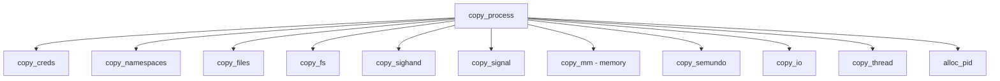
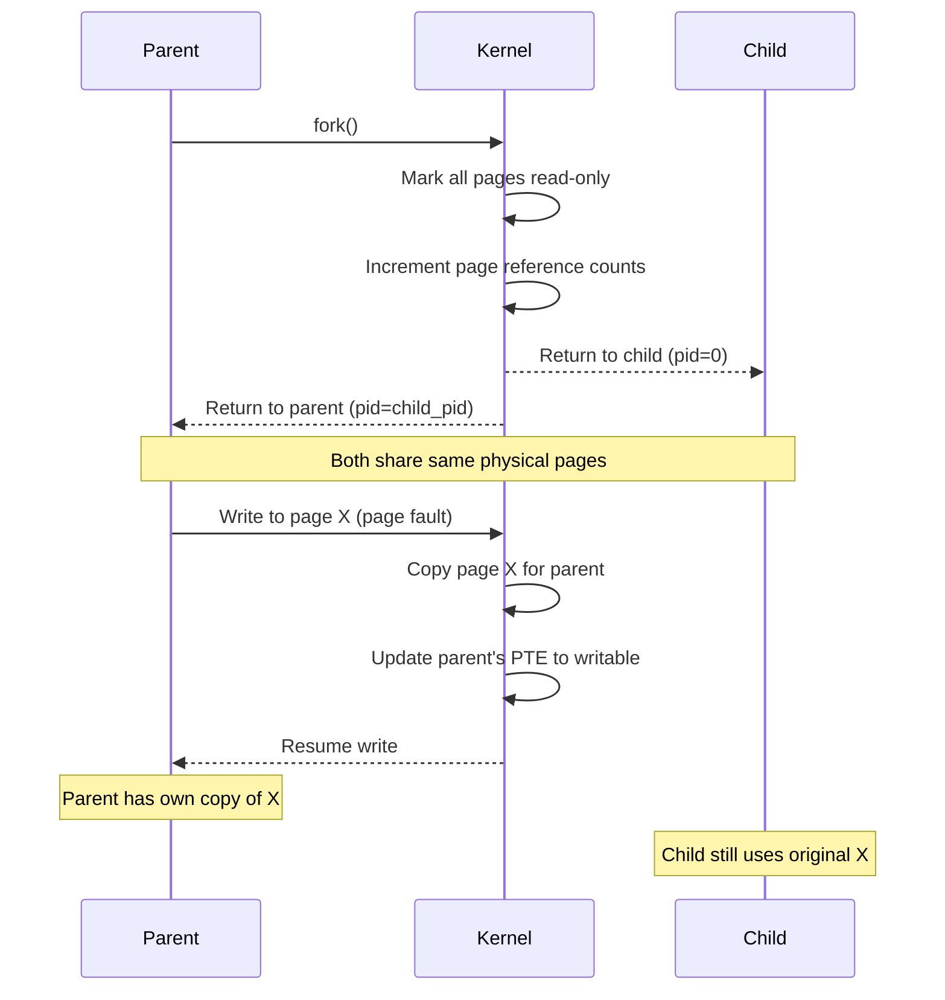
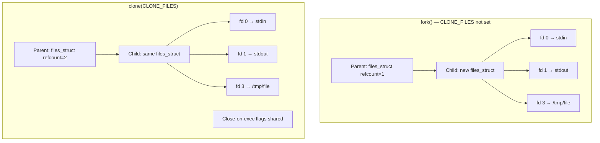
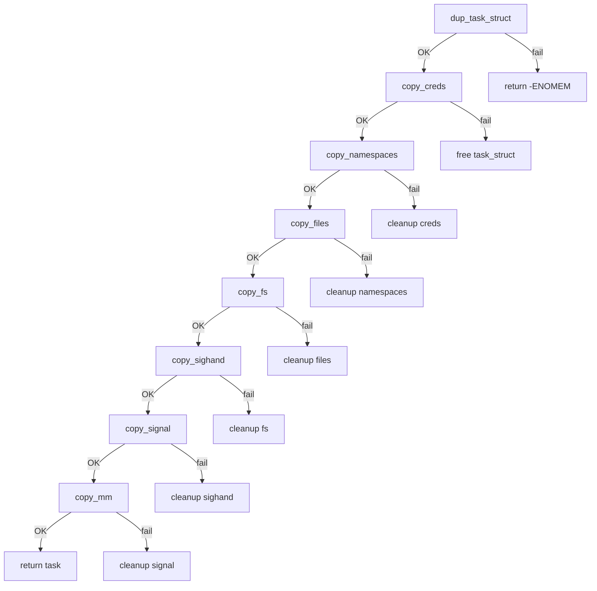

# fork() Deep Dive

## Introduction

The `fork()` system call is one of the most fundamental process creation mechanisms in Unix and Linux.
It creates a new process by duplicating the calling process, producing a near-identical copy.
Understanding `fork()` internals reveals how the kernel manages process creation efficiently
through copy-on-write semantics, page table manipulation, and careful resource accounting.

## The fork() Family

Linux provides three related system calls:

| System Call | Description |
|-------------|-------------|
| `fork()`    | Creates a child process that is a copy of the parent |
| `vfork()`   | Creates a child that shares the parent's memory until `exec()` |
| `clone()`   | Fine-grained control over what is shared between parent and child |

```mermaid
graph TD
    A[Parent Process] -->|fork()| B[Child Process]
    A -->|vfork()| C[Child shares memory]
    A -->|clone| D[Configurable sharing]
    B --> E[Independent address space]
    C --> F[Exec or exit triggers resume]
    D --> G[Threads, namespaces, etc.]
```

## System Call Entry

When a user-space program calls `fork()`, the glibc wrapper invokes the `clone()` system call
with flags that replicate traditional `fork()` behavior:

```c
/* glibc internals (simplified) */
pid_t fork(void)
{
    return clone(SIGCHLD, 0, 0, 0, 0);
}
```

In the kernel, the entry point is `kernel/fork.c`, specifically `kernel_clone()`:

```c
/* kernel/fork.c - simplified */
pid_t kernel_clone(struct kernel_clone_args *args)
{
    u64 clone_flags = args->flags;
    struct task_struct *p;
    int trace = 0;
    pid_t nr;

    /* ... tracepoint and permission checks ... */

    /* Allocate and initialize the new task_struct */
    p = copy_process(NULL, trace, NUMA_NO_NODE, args);

    if (!IS_ERR(p)) {
        struct pid *pid;

        /* Get the PID namespace pid */
        pid = get_task_pid(p, PIDTYPE_PID);
        nr = pid_vnr(pid);

        /* Wake up the new process */
        wake_up_new_task(p);

        put_pid(pid);
    }

    return nr;
}
```

## copy_process(): The Heart of fork()

`copy_process()` performs the bulk of the work. It duplicates nearly every aspect of the parent:



### Key Steps in copy_process()

```c
/* Simplified flow of copy_process() */
static struct task_struct *copy_process(...)
{
    struct task_struct *p;
    int retval;

    /* Allocate a new task_struct and kernel stack */
    p = dup_task_struct(current, node);
    if (!p)
        return ERR_PTR(-ENOMEM);

    /* Copy credentials (uid, gid, capabilities) */
    retval = copy_creds(p, clone_flags);

    /* Copy namespace references based on clone_flags */
    retval = copy_namespaces(clone_flags, p);

    /* Copy file descriptor table (or share it) */
    retval = copy_files(clone_flags, p);

    /* Copy filesystem context */
    retval = copy_fs(clone_flags, p);

    /* Copy signal handlers (or share them for threads) */
    retval = copy_sighand(clone_flags, p);
    retval = copy_signal(clone_flags, p);

    /* Copy or share the address space */
    retval = copy_mm(clone_flags, p);

    /* Copy I/O context */
    retval = copy_io(clone_flags, p);

    /* Architecture-specific thread state */
    retval = copy_thread(p, args);

    /* Allocate a PID */
    pid = alloc_pid(p->nsproxy->pid_ns_for_children, ...);
    p->pid = pid_nr(pid);

    /* Set up parent/child relationships */
    p->real_parent = current;
    p->parent = current;

    return p;
}
```

## Copy-on-Write (COW)

The most critical optimization in `fork()` is **copy-on-write**. Rather than immediately
duplicating all memory pages, the kernel marks them as read-only in both parent and child.
When either process attempts to write to a page, a page fault occurs, and the kernel
allocates a private copy for the writing process.

### COW Mechanism



### Implementation: copy_page_range()

```c
/* mm/memory.c - simplified COW setup */
static inline int
copy_pte_range(struct vm_area_struct *dst_vma,
               struct vm_area_struct *src_vma,
               pmd_t *dst_pmd, pmd_t *src_pmd,
               unsigned long addr, unsigned long end)
{
    pte_t *src_pte, *dst_pte;
    struct page *page;

    dst_pte = pte_alloc_map(dst_mm, dst_pmd, addr);
    src_pte = pte_offset_map(src_pmd, addr);

    for (; addr < end; addr += PAGE_SIZE) {
        pte_t pte = *src_pte;

        if (!pte_present(pte))
            continue;

        page = pte_page(pte);
        get_page(page);         /* Increment reference count */

        /* Clear write permission for COW */
        pte = pte_wrprotect(pte);

        set_pte_at(dst_mm, addr, dst_pte, pte);
        set_pte_at(src_mm, addr, src_pte, pte_wrprotect(*src_pte));
    }

    return 0;
}
```

### COW Page Fault Handling

When a write fault occurs on a COW page:

```c
/* mm/memory.c - do_wp_page() simplified */
static vm_fault_t do_wp_page(struct vm_fault *vmf)
{
    struct page *old_page = vmf->page;

    /* If only one reference and anonymous, just make it writable */
    if (page_mapcount(old_page) == 1 && PageAnon(old_page)) {
        pte_t pte = pte_mkdirty(*vmf->pte);
        set_pte_at(vmf->vma->vm_mm, vmf->address, vmf->pte, pte_mkyoung(pte));
        return 0;  /* No copy needed */
    }

    /* Multiple references - must copy */
    struct page *new_page = alloc_page_vma(GFP_HIGHUSER_MOVABLE, vmf->vma, addr);
    copy_user_highpage(new_page, old_page, addr, vmf->vma);

    /* Update page tables */
    set_pte_at_notify(vmf->vma->vm_mm, addr, vmf->pte,
                      mk_pte(new_page, vma->vm_page_prot));

    put_page(old_page);  /* Drop reference to old page */
    return 0;
}
```

## Page Table Duplication

During `fork()`, the kernel must duplicate the parent's page tables. This is done
hierarchically through the multi-level page table structure:

```
PGD → P4D → PUD → PMD → PTE → Page Frame
```

Each level is allocated and populated in `copy_page_range()` → `copy_pud_range()` →
`copy_pmd_range()` → `copy_pte_range()`.

### TLB Considerations

After modifying page tables (marking pages read-only), the kernel must flush TLBs:

```c
/* After COW setup in fork */
flush_tlb_mm(src_mm);  /* Invalidate all TLB entries for parent */
```

Modern kernels use **batched TLB invalidation** to reduce the overhead:

```c
struct tlb_gather {
    struct mm_struct *mm;
    unsigned long start;
    unsigned long end;
    /* ... */
};

tlb_gather_mmu(&tlb, src_mm);
/* ... perform page table modifications ... */
tlb_finish_mmu(&tlb);
```

## vfork(): Shared Address Space

`vfork()` creates a child that shares the parent's address space completely. The parent
is suspended until the child calls `exec()` or `_exit()`. This avoids even the COW overhead:

```c
/* Using vfork() */
#include <unistd.h>
#include <stdio.h>

int main(void)
{
    pid_t pid = vfork();

    if (pid == 0) {
        /* Child shares parent's memory - do NOT modify variables */
        printf("Child: exec'ing ls\n");
        execlp("ls", "ls", NULL);
        _exit(1);  /* Must use _exit(), not exit() */
    }

    printf("Parent: child finished\n");
    return 0;
}
```

> **Warning:** The child must not modify any variables or return from the function
> that called `vfork()`. Doing so results in undefined behavior.

## clone(): Fine-Grained Control

`clone()` allows specifying exactly which resources to share with the child:

```c
/* Creating a thread using clone() */
#define _GNU_SOURCE
#include <sched.h>
#include <stdio.h>

#define STACK_SIZE (1024 * 1024)

static int child_func(void *arg)
{
    printf("Child thread: pid=%d, arg=%s\n", getpid(), (char *)arg);
    return 0;
}

int main(void)
{
    char *stack = malloc(STACK_SIZE);
    char *child_stack = stack + STACK_SIZE;
    char *arg = "hello";

    /* CLONE_VM: share memory, CLONE_FS: share filesystem info */
    /* CLONE_FILES: share file descriptors, CLONE_SIGHAND: share signal handlers */
    pid_t pid = clone(child_func, child_stack,
                      CLONE_VM | CLONE_FS | CLONE_FILES | CLONE_SIGHAND | SIGCHLD,
                      arg);

    waitpid(pid, NULL, 0);
    free(stack);
    return 0;
}
```

### clone() Flag Categories

| Flag | Resource | Shared When Set |
|------|----------|-----------------|
| `CLONE_VM` | Address space | Threads |
| `CLONE_FS` | Filesystem info | Threads |
| `CLONE_FILES` | File descriptor table | Threads |
| `CLONE_SIGHAND` | Signal handlers | Threads |
| `CLONE_THREAD` | Thread group | Threads |
| `CLONE_NEWNS` | Mount namespace | Container |
| `CLONE_NEWPID` | PID namespace | Container |
| `CLONE_NEWNET` | Network namespace | Container |
| `CLONE_NEWUSER` | User namespace | Unprivileged containers |

## Fork Bomb

A **fork bomb** is a denial-of-service attack that rapidly spawns processes until
system resources are exhausted:

```bash
# Classic fork bomb - DO NOT RUN
:(){ :|:& };:
```

This defines a function `:` that calls itself twice (piped to background), then executes it.

### Mitigation

```bash
# Limit processes per user in /etc/security/limits.conf
username  hard  nproc  256

# Or use cgroups to limit PIDs
mkdir /sys/fs/cgroup/pids/mygroup
echo 100 > /sys/fs/cgroup/pids/mygroup/pids.max
echo $$ > /sys/fs/cgroup/pids/mygroup/cgroup.procs

# systemd approach
# In a service unit file:
# [Service]
# TasksMax=100
```

### Kernel Protections

```c
/* kernel/fork.c - pid_max check */
static int alloc_pid(struct pid_namespace *pid_ns, ...)
{
    /* Check against pid_max */
    if (nr >= pid_max)
        return -EAGAIN;

    /* Check against pids.max cgroup limit */
    if (unlikely(!cgroup_can_fork(current)))
        return -EAGAIN;
}
```

## Performance Characteristics

### fork() Timing

| Scenario | Time (typical) |
|----------|---------------|
| Small process (few pages) | ~100-200 µs |
| Large process (1 GB RSS) | ~500 µs - 2 ms |
| After COW pages fault | Per-page cost on write |

### fork() vs posix_spawn()

For programs that immediately `exec()` after `fork()`, `posix_spawn()` can be faster
since it avoids copying certain parent state:

```c
/* Efficient process creation */
posix_spawnattr_t attr;
posix_spawn_file_actions_t actions;

posix_spawnattr_init(&attr);
posix_spawn_file_actions_init(&actions);

posix_spawn(&pid, "/usr/bin/program", &actions, &attr, argv, envp);
```

## Modern Alternatives

### clone3() System Call

Linux 5.3 introduced `clone3()` with an extensible struct-based interface:

```c
struct clone_args {
    __aligned_u64 flags;        /* Flags bit mask */
    __aligned_u64 pidfd;        /* Where to store PID file descriptor */
    __aligned_u64 child_tid;    /* Where to store child TID */
    __aligned_u64 parent_tid;   /* Where to store parent TID */
    __aligned_u64 exit_signal;  /* Signal to deliver on exit */
    __aligned_u64 stack;        /* Pointer to stack */
    __aligned_u64 stack_size;   /* Size of stack */
    __aligned_u64 tls;          /* Location of new TLS */
    /* New in later versions */
    __aligned_u64 set_tid;      /* Array of TIDs to set */
    __aligned_u64 set_tid_size; /* Number of elements in set_tid */
    __aligned_u64 cgroup;       /* File descriptor for target cgroup */
};
```

```c
/* Using clone3() */
struct clone_args args = {
    .flags = CLONE_VM | CLONE_FILES | SIGCHLD,
    .exit_signal = SIGCHLD,
};
pid_t pid = syscall(SYS_clone3, &args, sizeof(args));
```

## PID Allocation

The kernel allocates PIDs from a bitmap to ensure uniqueness within
a PID namespace.

### PID Bitmap

```c
/* kernel/pid.c */
struct pid_namespace {
    struct kref kref;
    struct pidmap pidmap[PIDMAP_ENTRIES]; /* bitmap of allocated PIDs */
    int last_pid;                         /* last allocated PID (for search hint) */
    unsigned int level;                   /* nesting depth */
    struct pid_namespace *parent;
    /* ... */
};

struct pidmap {
    atomic_t nr_free;
    void *page;  /* Bitmap page — each bit represents one PID */
};

/* Allocate a PID */
static int alloc_pidmap(struct pid_namespace *pid_ns, int pid)
{
    /* Search bitmap for a free bit starting from last_pid */
    /* Uses find_next_zero_bit() for efficiency */
    /* Returns -EAGAIN if pid_max reached */
}
```

### PID Limits and Tuning

```bash
# View system-wide PID limit
$ cat /proc/sys/kernel/pid_max
32768

# Increase PID limit (allows more concurrent processes)
$ echo 65536 > /proc/sys/kernel/pid_max

# Maximum PID value (32-bit systems: 32768, 64-bit: 4194304)
$ cat /proc/sys/kernel/pid_max
32768

# Thread ID limit
$ cat /proc/sys/kernel/threads-max
# Maximum threads system-wide

# View PID namespace info
$ cat /proc/1/status | grep NSpid
# NSpid:  1
```

### PID Allocation Race Condition Prevention

```c
/* kernel/pid.c — PID allocation uses a spinlock */
static DEFINE_SPINLOCK(pidmap_lock);

struct pid *alloc_pid(struct pid_namespace *pid_ns,
                      pid_t *set_tid, size_t set_tid_size)
{
    struct pid *pid;
    int i, nr;

    pid = kmem_cache_alloc(ns_cachep, GFP_KERNEL);
    if (!pid)
        return ERR_PTR(-ENOMEM);

    /* Allocate one PID per namespace level */
    for (i = pid_ns->level; i >= 0; i--) {
        nr = alloc_pidmap(pid_ns);
        if (nr < 0)
            goto out_free;
        pid->numbers[i].nr = nr;
        pid->numbers[i].ns = pid_ns;
        pid_ns = pid_ns->parent;
    }

    /* PID is visible in all ancestor namespaces */
    /* E.g., PID 42 in container maps to PID 12345 on host */
    return pid;

out_free:
    /* Rollback already-allocated PIDs */
    for (i++; i <= pid_ns->level; i++)
        free_pidmap(pid->numbers[i].ns, pid->numbers[i].nr);
    kmem_cache_free(ns_cachep, pid);
    return ERR_PTR(nr);
}
```

---

## Signal Handling During Fork

When `fork()` creates a child, signal handling follows specific rules:

### Signal Inheritance Rules

| Signal Property | Behavior on fork() |
|---|---|
| Pending signals | **Cleared** in child (not inherited) |
| Signal handlers | **Shared** (CLONE_SIGHAND) or **copied** |
| Signal mask | **Inherited** from parent |
| Signal queue | **Cleared** (no queued signals) |
| SIGCHLD | **Not delivered** for the fork itself |

```c
/* kernel/signal.c — copy_signal() */
static int copy_signal(unsigned long clone_flags, struct task_struct *tsk)
{
    struct signal_struct *sig;

    if (clone_flags & CLONE_THREAD) {
        /* Threads share signal_struct */
        tsk->signal = current->signal;
        atomic_inc(&tsk->signal->live);
        return 0;
    }

    /* fork(): allocate new signal_struct */
    sig = kmem_cache_alloc(signal_cachep, GFP_KERNEL);
    tsk->signal = sig;

    /* Initialize: no pending signals */
    init_sigpending(&sig->shared_pending);
    sig->notify_count = 0;

    return 0;
}
```

### copy_sighand() — Signal Handler Table

```c
/* kernel/fork.c */
static int copy_sighand(unsigned long clone_flags, struct task_struct *tsk)
{
    struct sighand_struct *sig;

    if (clone_flags & CLONE_SIGHAND) {
        /* Threads share the same signal handlers */
        atomic_inc(&current->sighand->count);
        tsk->sighand = current->sighand;
        return 0;
    }

    /* fork(): copy all signal handlers */
    sig = kmem_cache_alloc(sighand_cachep, GFP_KERNEL);
    if (!sig)
        return -ENOMEM;

    /* Copy handler table */
    memcpy(sig->action, current->sighand->action, sizeof(sig->action));
    tsk->sighand = sig;
    return 0;
}
```

---

## copy_files() — File Descriptor Table

```c
/* kernel/fork.c */
static int copy_files(unsigned long clone_flags, struct task_struct *tsk)
{
    struct files_struct *oldf, *newf;

    oldf = current->files;

    if (clone_flags & CLONE_FILES) {
        /* Threads share file descriptor table */
        atomic_inc(&oldf->count);
        tsk->files = oldf;
        return 0;
    }

    /* fork(): duplicate the file descriptor table */
    newf = dup_fd(oldf, &error);
    if (!newf)
        return -ENOMEM;

    tsk->files = newf;
    return 0;
}
```



---

## copy_fs() — Filesystem Context

```c
/* kernel/fork.c */
static int copy_fs(unsigned long clone_flags, struct task_struct *tsk)
{
    struct fs_struct *fs = current->fs;

    if (clone_flags & CLONE_FS) {
        /* Threads share: cwd, root, umask */
        spin_lock(&fs->lock);
        if (fs->in_exec) {
            spin_unlock(&fs->lock);
            return -EAGAIN;
        }
        fs->users++;
        spin_unlock(&fs->lock);
        tsk->fs = fs;
        return 0;
    }

    /* fork(): copy filesystem context */
    tsk->fs = copy_fs_struct(fs);
    return 0;
}
```

---

## Error Handling in copy_process()

If any step in `copy_process()` fails, the kernel must clean up
previously allocated resources:

```c
/* kernel/fork.c — simplified error path */
static struct task_struct *copy_process(...)
{
    p = dup_task_struct(current, node);
    if (!p)
        goto fork_out;

    retval = copy_creds(p, clone_flags);
    if (retval < 0)
        goto bad_fork_cleanup_count;

    retval = copy_namespaces(clone_flags, p);
    if (retval < 0)
        goto bad_fork_cleanup_creds;

    retval = copy_files(clone_flags, p);
    if (retval < 0)
        goto bad_fork_cleanup_namespaces;

    retval = copy_fs(clone_flags, p);
    if (retval < 0)
        goto bad_fork_cleanup_files;

    retval = copy_sighand(clone_flags, p);
    if (retval < 0)
        goto bad_fork_cleanup_fs;

    retval = copy_signal(clone_flags, p);
    if (retval < 0)
        goto bad_fork_cleanup_sighand;

    retval = copy_mm(clone_flags, p);
    if (retval < 0)
        goto bad_fork_cleanup_signal;

    /* ... more allocations ... */
    return p;

bad_fork_cleanup_signal:
    cleanup_signal(p);
bad_fork_cleanup_sighand:
    cleanup_sighand(p);
bad_fork_cleanup_fs:
    cleanup_fs(p);
bad_fork_cleanup_files:
    cleanup_files(p);
bad_fork_cleanup_namespaces:
    cleanup_namespaces(p);
bad_fork_cleanup_creds:
    cleanup_creds(p);
bad_fork_cleanup_count:
    atomic_dec(&p->cred->user->processes);
    put_cred(p->cred);
fork_out:
    return ERR_PTR(retval);
}
```



---

## /proc Interface for Fork Information

The `/proc` filesystem exposes fork-related information:

```bash
# Process status showing fork details
$ cat /proc/self/status
# Name:   bash
# Pid:    1234
# PPid:   789         ← parent PID
# TracerPid: 0       ← ptrace parent
# NSpid:  1 1234     ← PID in each namespace
# NStgid: 1 1234     ← Thread group ID
# NSpgid: 1 1234     ← Process group ID
# NSsid:  789 789    ← Session ID

# File descriptor count
$ ls /proc/self/fd | wc -l
3

# Memory layout (shows COW status)
$ cat /proc/self/smaps | head -20
# Shows: Shared_Clean, Shared_Dirty, Private_Clean, Private_Dirty
# After fork(): most pages become Shared until written

# Clone flags used to create this process
$ cat /proc/self/status | grep CapEff
# CapEff: 0000003fffffffff
```

---

## Performance Monitoring

### Tracing fork() with ftrace

```bash
# Trace all fork events
$ echo 1 > /sys/kernel/debug/tracing/events/task/task_newtask/enable
$ cat /sys/kernel/debug/tracing/trace_pipe
# bash-1234  [001] ....  1234.567890: task_newtask:
#   pid=5678 comm=bash clone_flags=0x1200011

# Trace clone flags specifically
$ echo 1 > /sys/kernel/debug/tracing/events/syscalls/sys_enter_clone/enable
$ cat /sys/kernel/debug/tracing/trace_pipe
# bash-1234  [001] ....  1234.567890: sys_enter_clone:
#   flags: 0x1200011
#   newsp: 0x7ffd...
#   parent_tidptr: 0x0
#   child_tidptr: 0x0
```

### perf stat for fork()

```bash
# Measure fork() overhead
$ perf stat -e 'sched:sched_process_fork' -- bash -c 'for i in $(seq 1 1000); do true; done'

# Count forks system-wide
$ perf stat -e 'task:task_newtask' -- sleep 10
# Shows total new tasks created in 10 seconds
```

---

## Cross-References

- [Process Creation Overview](process-creation.md) - High-level process creation mechanisms
- [Task Struct](task-struct.md) - The kernel's process descriptor
- [Copy-on-Write and Memory Management](../memory/mmap.md) - mmap and page fault handling
- [Namespaces](namespaces.md) - Resource isolation via namespaces
- [Cgroups](cgroups.md) - Resource accounting and limiting
- [Signals](signals.md) - Signal delivery to parent and child
- [Context Switching](context-switching.md) - Scheduling the new process

## Further Reading

- [Linux kernel fork.c source](https://git.kernel.org/pub/scm/linux/kernel/git/torvalds/linux.git/tree/kernel/fork.c)
- [man 2 fork - Linux manual page](https://man7.org/linux/man-pages/man2/fork.2.html)
- [man 2 clone - Linux manual page](https://man7.org/linux/man-pages/man2/clone.2.html)
- [Copy-on-Write in Linux (LWN.net)](https://lwn.net/Articles/830934/)
- [The Linux Programming Interface - Process Creation (Michael Kerrisk)](https://man7.org/tlpi/)
- [Understanding the Linux Virtual Memory Manager (Mel Gorman)](https://www.kernel.org/doc/gorman/)
- [clone3() system call (LWN.net)](https://lwn.net/Articles/792628/)
