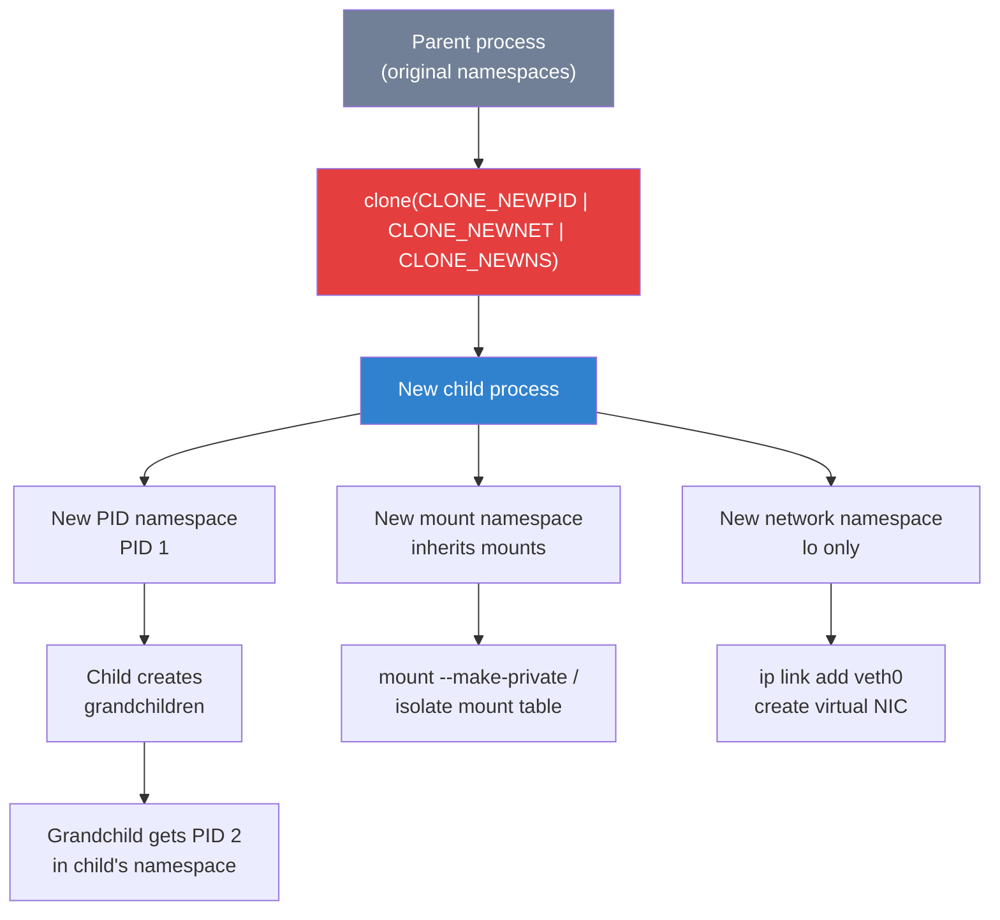
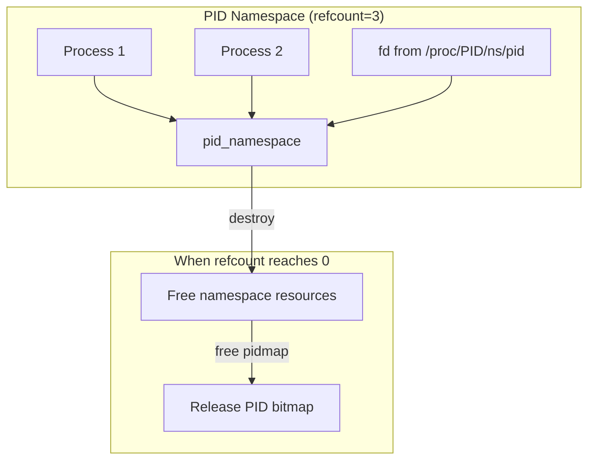
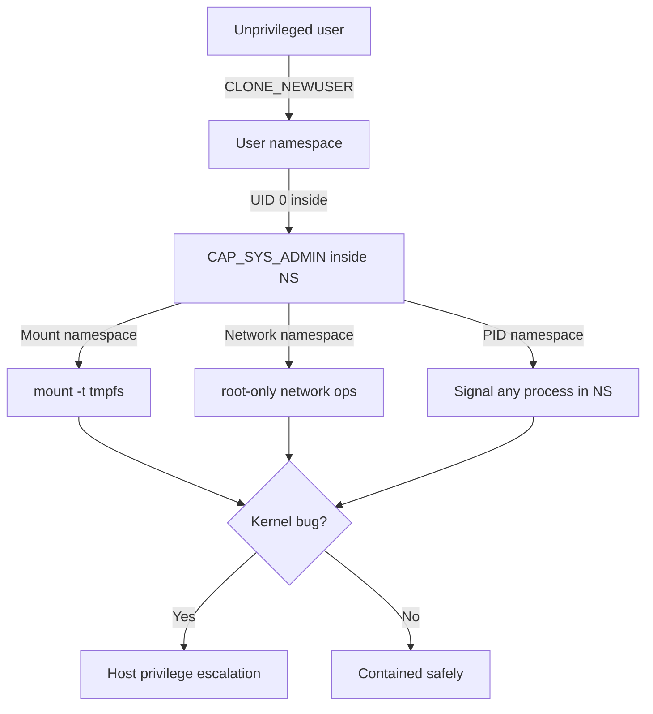
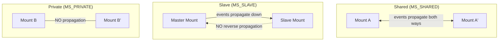
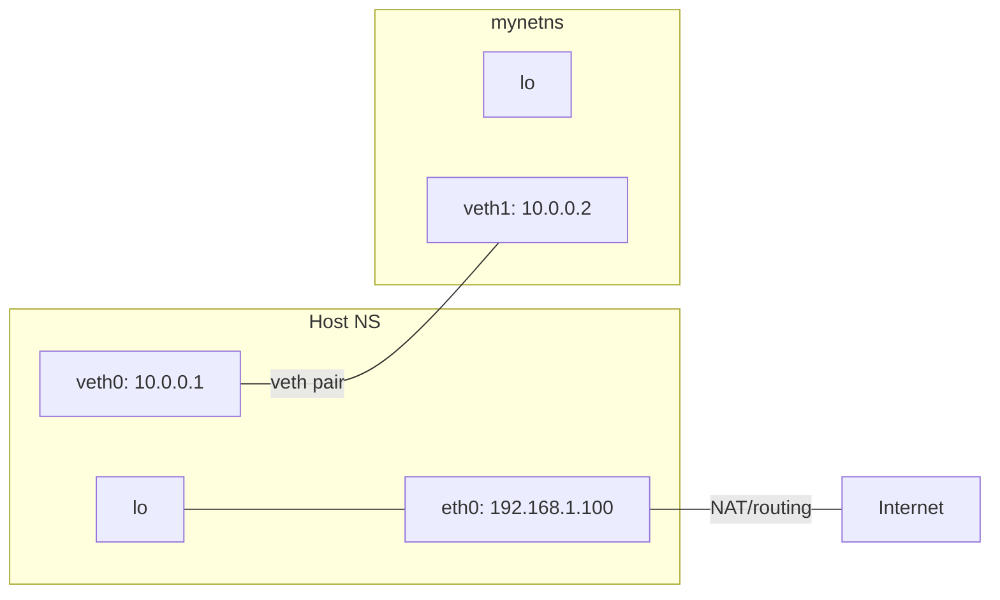
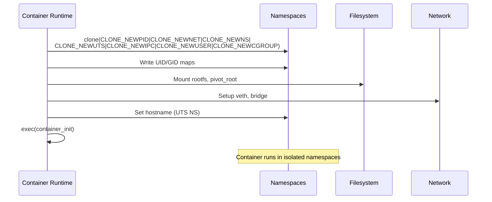

# Linux Namespaces

## Introduction

Namespaces are the fundamental kernel mechanism for **resource isolation** in Linux. They provide processes with an isolated view of system resources, making each process (or group of processes) believe they have their own dedicated instance of a global resource. Combined with [cgroups](./cgroups.md) for resource limits, namespaces form the foundation of Linux containers.

The concept is deceptively simple: wrap a global resource so that processes inside the namespace see one version, while processes outside see another. But the implications are profound—a single Linux kernel can safely host multiple isolated environments, each with its own PID tree, network stack, mount points, hostname, and more.

As of Linux 6.1, there are **8 namespace types**. This page covers each in detail.

## The Eight Namespace Types

### 1. PID Namespace (`CLONE_NEWPID`)

The PID namespace isolates the process ID number space. Processes in different PID namespaces can have the same PID. The first process in a new PID namespace gets PID 1 and acts as an init process, inheriting responsibility for reaping orphaned children.

```c
#define _GNU_SOURCE
#include <sched.h>
#include <stdio.h>
#include <stdlib.h>
#include <unistd.h>
#include <sys/wait.h>

static int child_func(void *arg) {
    printf("Child PID (inside namespace): %d\n", getpid());
    printf("Parent PID (inside namespace): %d\n", getppid());
    return 0;
}

int main() {
    const int STACK_SIZE = 1024 * 1024;
    char *stack = malloc(STACK_SIZE);

    // Clone with new PID namespace
    pid_t pid = clone(child_func, stack + STACK_SIZE,
                      CLONE_NEWPID | SIGCHLD, NULL);

    printf("Child PID (from parent): %d\n", pid);
    waitpid(pid, NULL, 0);
    free(stack);
    return 0;
}
```

```bash
# Output:
# Child PID (from parent): 42
# Child PID (inside namespace): 1    ← PID 1 inside the namespace!
# Parent PID (inside namespace): 0   ← parent is "outside"
```

**Key rules:**
- The first process gets PID 1 (namespace init)
- If PID 1 dies, the entire namespace is killed (unless a subreaper is configured)
- `/proc/sys/kernel/pid_max` applies per namespace
- PID namespaces are hierarchical—child namespaces see parent PIDs

### 2. Network Namespace (`CLONE_NEWNET`)

Network namespaces provide isolated network stacks—each with its own interfaces, routing tables, firewall rules, and port numbers. This is the most commonly used namespace type after PID.

```bash
# Create a network namespace
ip netns add mynetns

# List namespaces
ip netns list
# mynetns

# Run a command inside the namespace
ip netns exec mynetns ip addr
# 1: lo: <LOOPBACK> mtu 65536 qdisc noop state DOWN
#     link/loopback 00:00:00:00:00:00 brd 00:00:00:00:00:00

# Bring up loopback
ip netns exec mynetns ip link set lo up

# Create a veth pair (virtual ethernet cable)
ip link add veth0 type veth peer name veth1

# Move one end into the namespace
ip link set veth1 netns mynetns

# Configure both ends
ip addr add 10.0.0.1/24 dev veth0
ip link set veth0 up

ip netns exec mynetns ip addr add 10.0.0.2/24 dev veth1
ip netns exec mynetns ip link set veth1 up

# Test connectivity
ip netns exec mynetns ping 10.0.0.1
# PING 10.0.0.1 (10.0.0.1) 56(84) bytes of data.
# 64 bytes from 10.0.0.1: icmp_seq=1 ttl=64 time=0.045 ms
```

### 3. Mount Namespace (`CLONE_NEWNS`)

Mount namespaces isolate the set of filesystem mount points seen by a group of processes. Changes to the mount table in one namespace don't affect others.

```bash
# Create an isolated mount view
unshare --mount -- bash

# Inside: mount a tmpfs
mount -t tmpfs tmpfs /mnt
echo "secret data" > /mnt/data.txt

# This mount is invisible outside this namespace!
exit
ls /mnt/data.txt 2>&1
# ls: cannot access '/mnt/data.txt': No such file or directory
```

**Mount propagation types** control whether mount events cross namespace boundaries:

| Type | Description |
|------|-------------|
| `MS_SHARED` | Events propagate to and from peer groups |
| `MS_PRIVATE` | No propagation |
| `MS_SLAVE` | Receives from master, doesn't propagate back |
| `MS_BIND` | Bind mount, propagation inherited |

```bash
# Check mount propagation
findmnt -o TARGET,PROPAGATION /
# TARGET PROPAGATION
# /      shared

# Make a mount point private (prevents leaks)
mount --make-private /my/mount

# Or at mount time
mount --bind --make-private /source /target
```

### 4. UTS Namespace (`CLONE_NEWUTS`)

The UTS namespace isolates the hostname and NIS domain name. ("UTS" comes from the Unix Timesharing System, from which the `uname` struct originates.)

```bash
# Create UTS namespace
unshare --uts -- bash

# Change hostname inside namespace
hostname isolated-host
hostname
# isolated-host

# Original host is unchanged
exit
hostname
# myserver
```

### 5. IPC Namespace (`CLONE_NEWIPC`)

IPC namespaces isolate System V IPC objects and POSIX message queues. Processes in different IPC namespaces cannot communicate via shared memory, semaphores, or message queues.

```bash
# Create IPC namespace
unshare --ipc -- bash

# Inside: create a shared memory segment
ipcmk -M 1024
# Shared memory id: 0

# Outside the namespace: cannot see it
ipcs -m | grep "$(whoami)"
# (nothing from the namespace)
```

### 6. User Namespace (`CLONE_NEWUSER`)

User namespaces isolate user and group ID mappings. A process can have UID 0 inside a user namespace while having a completely different UID outside. This is a critical security feature for unprivileged containers.

```bash
# Create user namespace (unprivileged!)
unshare --user --map-root-user -- bash

# Inside: we're root
id
# uid=0(root) gid=0(root)

# Outside: still our normal user
# (check from another terminal)
ps -o pid,user,comm -p $(pgrep bash)
#   PID USER     COMMAND
# 12345 myuser   bash
```

```c
/* Mapping UIDs: write to /proc/PID/uid_map */
/* Format: ns_id outside_id count */
#include <stdio.h>
#include <fcntl.h>
#include <unistd.h>

int main() {
    // Map UID 0 inside to UID 1000 outside
    int fd = open("/proc/self/uid_map", O_WRONLY);
    dprintf(fd, "0 1000 1\n");
    close(fd);

    // Deny setgroups (required before writing gid_map)
    fd = open("/proc/self/setgroups", O_WRONLY);
    dprintf(fd, "deny\n");
    close(fd);

    // Map GID similarly
    fd = open("/proc/self/gid_map", O_WRONLY);
    dprintf(fd, "0 1000 1\n");
    close(fd);
    return 0;
}
```

### 7. Cgroup Namespace (`CLONE_NEWCGROUP`)

Cgroup namespaces (Linux 4.6+) virtualize the view of the cgroup hierarchy. A process inside a cgroup namespace sees its cgroup as the root, hiding the real path.

```bash
# Without cgroup namespace:
cat /proc/self/cgroup
# 0::/system.slice/docker-abc123.scope

# With cgroup namespace:
unshare --cgroup -- bash
cat /proc/self/cgroup
# 0::/                    ← appears as root!
```

### 8. Time Namespace (`CLONE_NEWTIME`)

Time namespaces (Linux 5.6+) allow per-namespace offsets for `CLOCK_MONOTONIC` and `CLOCK_BOOTTIME`. This is useful for checkpoint/restore and containers that need different boot times.

```bash
# Check time namespace support
ls /proc/self/ns/time
# /proc/self/ns/time

# Create time namespace with offsets
# (requires writing to /proc/PID/timens_offsets)
unshare --time -- bash
# Format: clockid secs nanosecs
echo "monotonic 7200 0" > /proc/self/timens_offsets
# Adds 2 hours to monotonic clock inside this namespace
```

## Clone Flags

Namespaces are created using clone flags passed to `clone()`, `clone3()`, `unshare()`, or `setns()`:

```c
/* All namespace clone flags */
#define CLONE_NEWCGROUP   0x02000000  /* New cgroup namespace */
#define CLONE_NEWIPC      0x08000000  /* New IPC namespace */
#define CLONE_NEWNET      0x40000000  /* New network namespace */
#define CLONE_NEWNS       0x00020000  /* New mount namespace */
#define CLONE_NEWPID      0x20000000  /* New PID namespace */
#define CLONE_NEWUSER     0x10000000  /* New user namespace */
#define CLONE_NEWUTS      0x04000000  /* New UTS namespace */
#define CLONE_NEWTIME     0x00000080  /* New time namespace */
```

**Multiple namespaces can be combined:**

```bash
# Create a process with ALL namespaces isolated
unshare --pid --net --mount --uts --ipc --user --cgroup --time \
    --fork --mount-proc -- bash

# Inside: completely isolated environment
ps aux
# USER       PID %CPU %MEM    VSZ   RSS TTY      STAT START   TIME COMMAND
# root         1  0.0  0.0  7236  4024 pts/0    S    10:00   0:00 bash
# root         2  0.0  0.0 10068  3364 pts/0    R+   10:00   0:00 ps aux
```

## Using `unshare` and `nsenter`

### `unshare` — Run Programs in New Namespaces

```bash
# Basic usage
unshare [options] [program [arguments]]

# Common flags
--pid      New PID namespace (use with --fork)
--net      New network namespace
--mount    New mount namespace
--uts      New UTS namespace
--ipc      New IPC namespace
--user     New user namespace
--cgroup   New cgroup namespace
--time     New time namespace
--fork     Fork before executing (required for --pid)
--mount-proc  Mount new /proc (required for --pid to show correct PIDs)
--map-root-user  Map current user to root in new user namespace

# Example: isolated build environment
unshare --mount --pid --fork --mount-proc -- bash -c "
    mount -t proc proc /proc
    mount -t tmpfs tmpfs /tmp
    echo 'Build environment ready'
    make
"
```

### `nsenter` — Enter Existing Namespaces

```bash
# Enter a process's namespaces
nsenter [options] [program [arguments]]

# Enter all namespaces of PID 1234
nsenter --target 1234 --all -- bash

# Enter specific namespaces
nsenter --target 1234 --net --pid -- bash

# Enter by file descriptor
nsenter --net=/var/run/netns/mynetns -- bash

# Common flags
-t, --target PID     Target process
-m, --mount[=FILE]   Mount namespace
-u, --uts[=FILE]     UTS namespace
-i, --ipc[=FILE]     IPC namespace
-n, --net[=FILE]     Network namespace
-p, --pid[=FILE]     PID namespace
-C, --cgroup[=FILE]  Cgroup namespace
-U, --user[=FILE]    User namespace
-T, --time[=FILE]    Time namespace
-a, --all            Enter all namespaces
```

**Practical example — debugging a container:**

```bash
# Get the container's init PID
CONTAINER_PID=$(docker inspect --format '{{.State.Pid}}' mycontainer)

# Enter the container's namespaces
nsenter --target $CONTAINER_PID --all -- bash

# Now you're "inside" the container with full host tools
ip addr        # Container's network
ps aux         # Container's processes
mount          # Container's mounts
```

## `/proc/[pid]/ns/` — Namespace File Descriptors

Each process exposes its namespace references as files under `/proc/[pid]/ns/`:

```bash
ls -la /proc/self/ns/
# lrwxrwxrwx 1 root root 0 ... cgroup -> 'cgroup:[4026531835]'
# lrwxrwxrwx 1 root root 0 ... ipc -> 'ipc:[4026531839]'
# lrwxrwxrwx 1 root root 0 ... mnt -> 'mnt:[4026531840]'
# lrwxrwxrwx 1 root root 0 ... net -> 'net:[4026531969]'
# lrwxrwxrwx 1 root root 0 ... pid -> 'pid:[4026531836]'
# lrwxrwxrwx 1 root root 0 ... pid_for_children -> 'pid:[4026531836]'
# lrwxrwxrwx 1 root root 0 ... time -> 'time:[4026531834]'
# lrwxrwxrwx 1 root root 0 ... time_for_children -> 'time:[4026531834]'
# lrwxrwxrwx 1 root root 0 ... user -> 'user:[4026531837]'
# lrwxrwxrwx 1 root root 0 ... uts -> 'uts:[4026531838]'
```

**The inode numbers** (e.g., `4026531835`) uniquely identify a namespace. Two processes with the same inode number are in the same namespace.

```bash
# Compare namespaces of two processes
readlink /proc/1234/ns/net
# net:[4026531969]
readlink /proc/5678/ns/net
# net:[4026531969]
# Same namespace!

# Keep a namespace alive by holding a file descriptor
exec 3</proc/1234/ns/net
# The namespace persists even if PID 1234 exits
```

## Namespace Lifecycle Diagram



## Combining Namespaces with cgroups

The full container recipe uses both together:

```bash
#!/bin/bash
# Create a minimal container

# 1. Create namespaces
unshare --pid --net --mount --uts --ipc --user \
    --map-root-user --fork --mount-proc -- bash -c '
    # 2. Set hostname
    hostname my-container

    # 3. Mount minimal filesystem
    mount -t tmpfs tmpfs /tmp
    mount -t proc proc /proc

    # 4. (In production: mount rootfs, pivot_root, etc.)

    # 5. Apply cgroup limits (from outside, before pivot)
    # (done by the container runtime)

    exec /bin/bash
'
```

```bash
# Verify isolation
hostname          # my-container
ps aux            # only container processes
ip link show      # only container interfaces
cat /proc/cgroups # container cgroup view
```

## Kernel Configuration

```bash
# Verify namespace support
grep -E 'CONFIG_(UTS|IPC|USER|PID|NET|NS|CGROUP)_NS' /boot/config-$(uname -r)
# CONFIG_UTS_NS=y
# CONFIG_IPC_NS=y
# CONFIG_USER_NS=y
# CONFIG_PID_NS=y
# CONFIG_NET_NS=y
# CONFIG_NS=y
# CONFIG_CGROUP_NS=y

# Time namespace
grep CONFIG_TIME_NS /boot/config-$(uname -r)
# CONFIG_TIME_NS=y
```

## Namespace Lifecycle and Reference Counting

Namespaces are reference-counted kernel objects. A namespace persists
as long as at least one process or file descriptor references it.

### Kernel Data Structure

```c
/* include/linux/nsproxy.h */
struct nsproxy {
    struct uts_namespace  *uts_ns;     /* hostname */
    struct ipc_namespace  *ipc_ns;     /* IPC */
    struct mnt_namespace  *mnt_ns;     /* mount points */
    struct pid_namespace  *pid_ns_for_children; /* child PID ns */
    struct net            *net_ns;     /* network */
    struct time_namespace *time_ns;    /* time */
    struct time_namespace *time_ns_for_children;
    struct cgroup_namespace *cgroup_ns; /* cgroup */
    refcount_t count;
};

/* include/linux/namespace.h */
struct mnt_namespace {
    atomic_t count;               /* reference count */
    struct ns_common ns;          /* common namespace fields */
    struct mount *root;           /* root mount */
    struct list_head list;        /* list of mounts */
    struct user_namespace *user_ns;
    struct ucounts *ucounts;
    /* ... */
};
```

### Reference Counting



### Keeping Namespaces Alive

```bash
# Open a namespace file descriptor to keep it alive
$ exec 3</proc/1234/ns/net

# The namespace persists even after PID 1234 exits
$ ls -la /proc/self/fd/3
# lrwx------ 1 user user 64 ... 3 -> net:[4026531969]

# Use the fd with nsenter
$ nsenter --net=/proc/self/fd/3 -- bash
# Now inside the preserved namespace

# Pin namespace to a bind mount (survives process exit)
$ touch /var/run/netns/my_netns
$ mount --bind /proc/1234/ns/net /var/run/netns/my_netns
$ ip netns list
# my_netns
```

---

## User Namespace Security Model

User namespaces are the most security-sensitive namespace type because
they grant CAP_SYS_ADMIN inside the namespace to unprivileged users.
This has been a frequent source of kernel CVEs.

### Privilege Escalation Risks



### Kernel Hardening

```bash
# Disable user namespaces (if not needed)
$ sysctl -w user.max_user_namespaces=0

# Check current limit
$ cat /proc/sys/user/max_user_namespaces
# 0 = disabled, >0 = max user namespaces

# Limit nested namespaces
$ sysctl -w user.max_user_namespaces=10

# Kernel config: USER_NS
$ grep CONFIG_USER_NS /boot/config-$(uname -r)
# CONFIG_USER_NS=y  ← can be disabled at compile time

# seccomp: block CLONE_NEWUSER
# In containers, filter the clone syscall:
# {
#   "names": ["clone"],
#   "action": "SCMP_ACT_ALLOW",
#   "args": [
#     {"index": 0, "value": CLONE_NEWUSER, "op": "SCMP_CMP_MASKED_EQ", "valueTwo": 0}
#   ]
# }
```

### UID/GID Mapping Internals

```c
/* kernel/user_namespace.c */
struct user_namespace {
    struct uid_gid_map uid_map;   /* UID mapping */
    struct uid_gid_map gid_map;   /* GID mapping */
    struct uid_gid_map projid_map; /* Project ID mapping */
    struct user_namespace *parent;
    int level;                     /* Nesting depth */
    kuid_t owner;                  /* Owner UID in parent NS */
    kgid_t group;
    struct ns_common ns;
    unsigned long flags;
    /* ... */
};

struct uid_gid_map {
    struct uid_gid_extent {
        u32 first;        /* First ID in this range */
        u32 lower_first;  /* First ID in parent namespace */
        u32 count;        /* Number of IDs */
    } *extent;
    unsigned int nr_extents;
};
```

### UID Map Example

```bash
# View current UID mapping
$ cat /proc/self/uid_map
#          0       1000          1
# Format: ns_uid host_uid count
# This maps UID 0 inside to UID 1000 outside

# Complex mapping
$ cat /proc/1234/uid_map
#          0     100000      65536
# Maps UID 0-65535 inside to 100000-165535 outside

# Write mapping (requires CAP_SETUID in parent namespace)
$ echo "0 1000 1" > /proc/self/uid_map

# Before writing gid_map, must deny setgroups
$ echo deny > /proc/self/setgroups
$ echo "0 1000 1" > /proc/self/gid_map
```

---

## Mount Namespace Internals

Mount namespaces use copy-on-write for mount propagation:

### Mount Propagation

```c
/* fs/namespace.c */
struct mount {
    struct hlist_node mnt_hash;     /* Hash table linkage */
    struct mount *mnt_parent;       /* Parent mount */
    struct dentry *mnt_mountpoint;  /* Mount point dentry */
    struct vfsmount mnt;            /* VFS mount */
    struct mnt_namespace *mnt_ns;   /* Owning namespace */

    /* Propagation */
    struct list_head mnt_share;     /* Shared mounts */
    struct list_head mnt_slave_list; /* Slave mounts */
    struct list_head mnt_slave;     /* Slave linkage */
    struct mount *mnt_master;       /* Master mount */
    struct list_head mnt_expire;    /* Expiration list */
    /* ... */
};
```

### Propagation Types



### Practical Mount Namespace Usage

```bash
# Create isolated mount namespace for testing
$ unshare --mount -- bash

# Inside: mount is private by default in new namespace
$ mount -t tmpfs tmpfs /mnt
$ echo "test" > /mnt/data.txt

# Verify isolation (from another terminal)
$ ls /mnt/data.txt
# ls: cannot access '/mnt/data.txt': No such file or directory

# Bind mount a specific config for one process
$ unshare --mount -- bash -c '
    mount --bind /etc/alternatives/resolv.conf /etc/resolv.conf
    exec my_network_app
'
```

---

## Network Namespace Internals

Network namespaces are the most complex namespace type, providing
a full network stack isolation:

### Net Namespace Structure

```c
/* include/net/net_namespace.h */
struct net {
    refcount_t passive;         /* Reference count */
    refcount_t count;           /* User count */
    spinlock_t rules_mod_lock;

    unsigned int dev_base_seq;  /* Device sequence number */
    int ifindex;                /* Loopback ifindex */
    struct list_head dev_base_head;
    struct net_device *loopback_dev; /* Loopback device */

    /* Per-namespace proc/net */
    struct proc_dir_entry *proc_net;
    struct proc_dir_entry *proc_net_stat;

    /* Network namespaces can have different sysctls */
    struct netns_ipv4 ipv4;
    struct netns_ipv6 ipv6;
    struct netns_mib mib;
    /* ... */
};
```

### Network Namespace Creation and Management

```bash
# Create network namespace
$ ip netns add mynetns
# Internally: CLONE_NEWNET + mount /var/run/netns/mynetns

# List all network namespaces
$ ip netns list
# mynetns

# Execute in namespace
$ ip netns exec mynetns ip link show
# 1: lo: <LOOPBACK> mtu 65536 qdisc noop state DOWN

# Create veth pair and connect namespaces
$ ip link add veth0 type veth peer name veth1
$ ip link set veth1 netns mynetns
$ ip addr add 10.0.0.1/24 dev veth0
$ ip link set veth0 up
$ ip netns exec mynetns ip addr add 10.0.0.2/24 dev veth1
$ ip netns exec mynetns ip link set veth1 up

# Test connectivity
$ ip netns exec mynetns ping -c1 10.0.0.1
# PING 10.0.0.1 (10.0.0.1) 56(84) bytes of data.
# 64 bytes from 10.0.0.1: icmp_seq=1 ttl=64 time=0.045 ms
```

### Bridge Between Namespaces



---

## PID Namespace Deep Dive

### PID Namespace Hierarchy

```c
/* kernel/pid_namespace.c */
struct pid_namespace {
    struct kref kref;
    struct pidmap pidmap[PIDMAP_ENTRIES];
    int last_pid;
    unsigned int level;        /* 0 = host, 1 = first container, etc. */
    struct pid_namespace *parent;
    struct proc_dir_entry *proc_mnt;
    struct dentry *proc_self;
    /* ... */
};
```

### PID Translation

```bash
# View PID in all namespace levels
$ cat /proc/1234/status | grep NSpid
# NSpid:  1 1234
# Format: PID at each namespace level (inside → outside)

# For nested namespaces (container in container):
$ cat /proc/1234/status | grep NSpid
# NSpid:  1 42 1234
# Level 0 (innermost): PID 1
# Level 1 (container): PID 42
# Level 2 (host): PID 1234
```

### PID 1 (Init) Behavior in PID Namespace

The first process in a PID namespace has special responsibilities:

```c
/* kernel/pid_namespace.c */
static int pid_ns_ctl_handler(struct ctl_table *table, int write,
                              void *buffer, size_t *lenp, loff_t *ppos)
{
    /* ... */
    /* When PID 1 exits, all processes in namespace get SIGKILL */
}

/* Reaping orphans */
static struct task_struct *find_alive_thread(struct task_struct *p)
{
    /* ... */
}

/* If PID 1 dies, namespace is destroyed */
void zap_pid_ns_processes(struct pid_namespace *pid_ns)
{
    /* Send SIGKILL to all processes in the namespace */
    /* ... */
}
```

```bash
# Run init-like process in new PID namespace
$ unshare --pid --fork --mount-proc -- /sbin/init
# PID 1 inside namespace
# Must handle SIGCHLD and reap zombies

# Or use a minimal init
$ unshare --pid --fork --mount-proc -- cat
# cat becomes PID 1 (but won't reap zombies!)
```

---

## Cgroup Namespace Internals

Cgroup namespaces virtualize the view of the cgroup hierarchy:

```c
/* kernel/cgroup/namespace.c */
struct cgroup_namespace {
    struct ns_common ns;
    struct user_namespace *user_ns;
    struct ucounts *ucounts;
    struct css_set *root_cset;    /* CSS set for this namespace root */
};
```

```bash
# Without cgroup namespace:
$ cat /proc/self/cgroup
# 0::/system.slice/docker-abc123.scope

# With cgroup namespace:
$ unshare --cgroup -- bash
$ cat /proc/self/cgroup
# 0::/                    ← appears as root!

# The real path is hidden
# This prevents container escape via cgroup path manipulation
```

---

## Time Namespace Deep Dive

Time namespaces (Linux 5.6+) allow per-namespace offsets for
`CLOCK_MONOTONIC` and `CLOCK_BOOTTIME`.

### Use Cases

```bash
# Checkpoint/restore (CRIU): adjust timestamps after restore
# Containers: different boot times for different containers
# Testing: simulate time passage

# Create time namespace with offset
$ unshare --time -- bash
$ cat /proc/self/timens_offsets
# monotonic 0 0
# boottime 0 0

# Set offset: 1 hour forward for monotonic clock
$ echo "monotonic 3600 0" > /proc/self/timens_offsets

# Verify
$ python3 -c "import time; print(time.clock_gettime(time.CLOCK_MONOTONIC))"
# Shows time + 3600 seconds
```

### Time Namespace Kernel Structure

```c
/* include/linux/time_namespace.h */
struct timens_offsets {
    struct timespec64 monotonic;
    struct timespec64 boottime;
};

struct time_namespace {
    struct ns_common ns;
    struct user_namespace *user_ns;
    struct timens_offsets offsets;
    struct vfsmount *vaddr;      /* /proc/PID/ns/time */
    /* ... */
};
```

---

## Namespace Interaction with Containers

### Container Runtime Namespace Setup



### Docker Container Namespaces

```bash
# Inspect container namespaces
$ docker inspect mycontainer --format '{{.State.Pid}}'
# 12345

$ ls -la /proc/12345/ns/
# cgroup -> cgroup:[4026532835]
# ipc -> ipc:[4026532833]
# mnt -> mnt:[4026532831]
# net -> net:[4026532832]
# pid -> pid:[4026532834]
# uts -> uts:[4026532830]
# user -> user:[4026531837]
# time -> time:[4026531834]

# Compare with host
$ ls -la /proc/1/ns/
# pid -> pid:[4026531836]  ← different from container!
```

---

## /proc Namespace Interface Summary

| Path | Description |
|---|---|
| `/proc/[pid]/ns/*` | Namespace symlinks (unique inode = unique NS) |
| `/proc/[pid]/uid_map` | UID mapping for user namespace |
| `/proc/[pid]/gid_map` | GID mapping for user namespace |
| `/proc/[pid]/setgroups` | Write `deny` before gid_map |
| `/proc/[pid]/ns/` | All namespace file descriptors |
| `/proc/[pid]/timens_offsets` | Time namespace offsets |
| `/proc/sys/user/max_user_namespaces` | Max user NS per user |
| `/proc/sys/user/max_pid_namespaces` | Max PID namespaces |
| `/proc/sys/user/max_net_namespaces` | Max network namespaces |
| `/proc/sys/user/max_mnt_namespaces` | Max mount namespaces |
| `/proc/sys/user/max_ipc_namespaces` | Max IPC namespaces |
| `/proc/sys/user/max_uts_namespaces` | Max UTS namespaces |
| `/proc/sys/user/max_cgroup_namespaces` | Max cgroup namespaces |
| `/proc/sys/kernel/ns_last_pid` | Last allocated PID (for predictability) |

---

## References

- [The Linux Kernel Documentation](https://docs.kernel.org/)
- [LWN.net - Linux and free software news](https://lwn.net/)
- [GNU Project Documentation](https://www.gnu.org/doc/doc.html)
- [GNU Manuals](https://www.gnu.org/manual/manual.html)
- [Free Software Directory](https://directory.fsf.org/wiki/Main_Page)
- [Planet GNU](https://planet.gnu.org/)
- [Free Software Books](https://www.gnu.org/doc/other-free-books.html)

- [namespaces(7) man page](https://man7.org/linux/man-pages/man7/namespaces.7.html) — Comprehensive reference
- [Linux kernel namespace docs](https://www.kernel.org/doc/Documentation/networking/net_namespace.txt)
- [User namespaces and security](https://man7.org/linux/man-pages/man7/user_namespaces.7.html)
- [Introducing Linux Network Namespaces](https://blog.scottlowe.org/2013/09/04/introducing-linux-network-namespaces/)
- [unshare(1) man page](https://man7.org/linux/man-pages/man1/unshare.1.html)
- [nsenter(1) man page](https://man7.org/linux/man-pages/man1/nsenter.1.html)

## Related Topics

- [Control Groups (cgroups)](./cgroups.md) — Resource limits paired with namespaces
- [Process Groups](./process-groups.md) — Process grouping mechanisms
- [Systemd Services](../../admin/process-management.md) — systemd's use of namespaces
