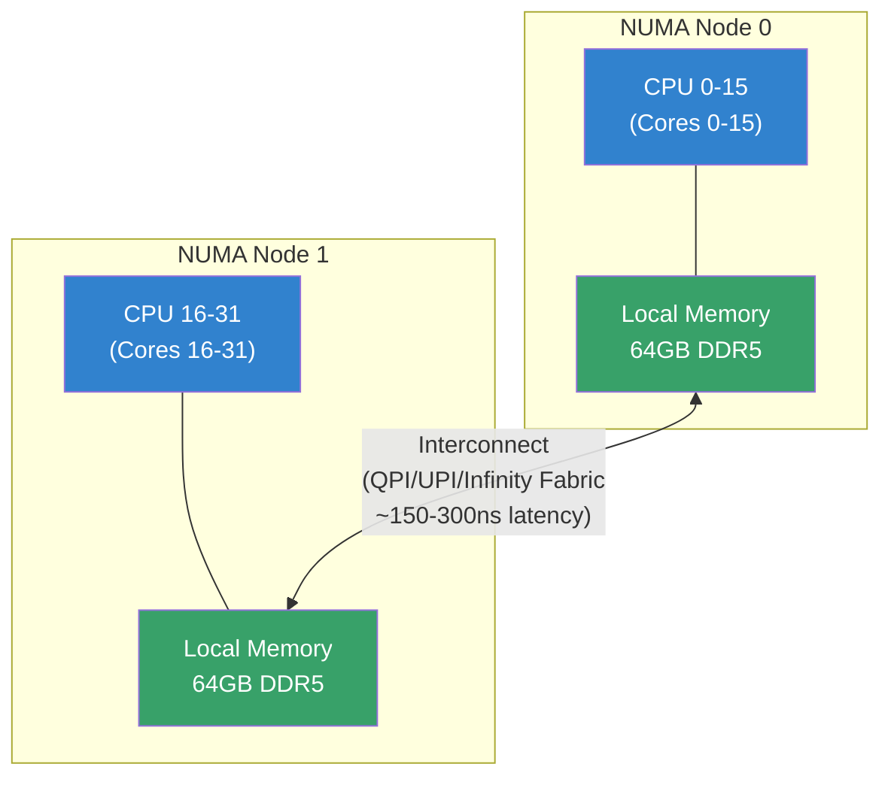
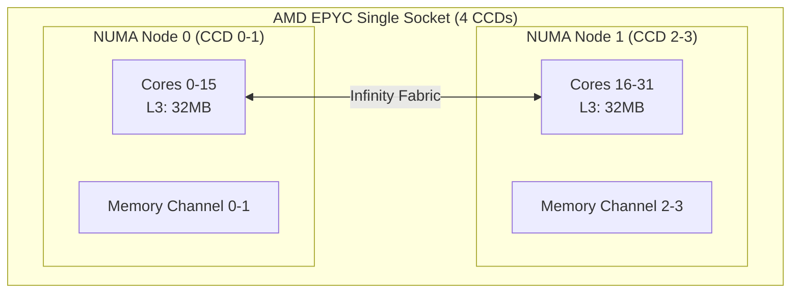
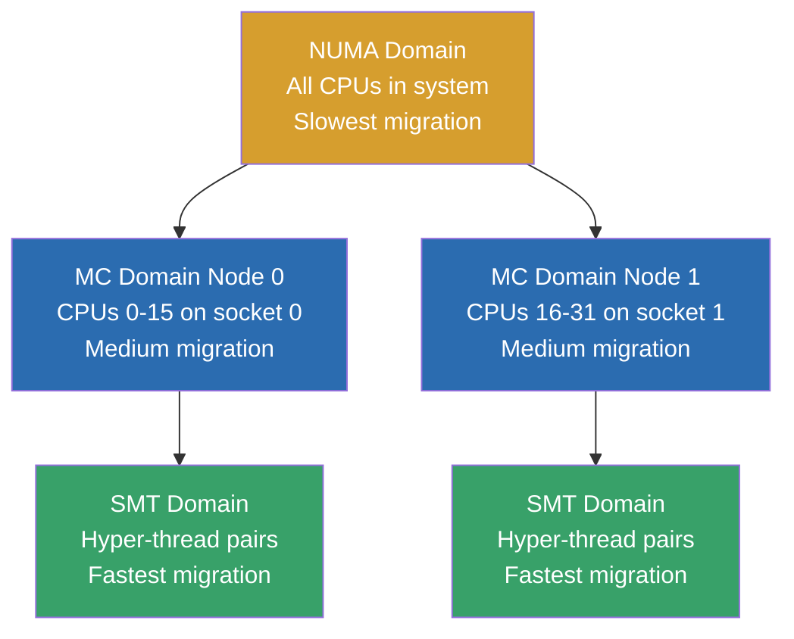
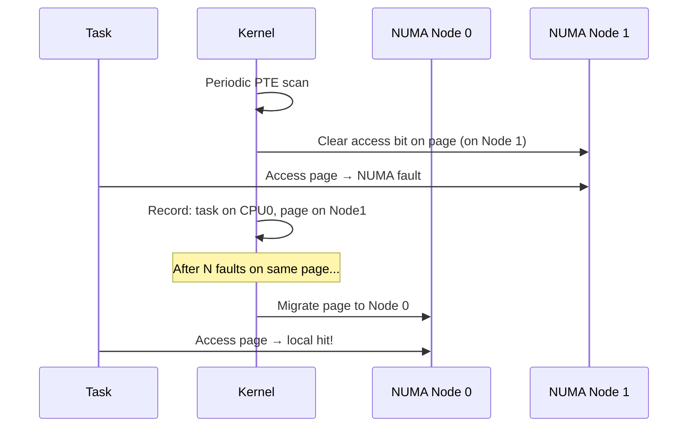
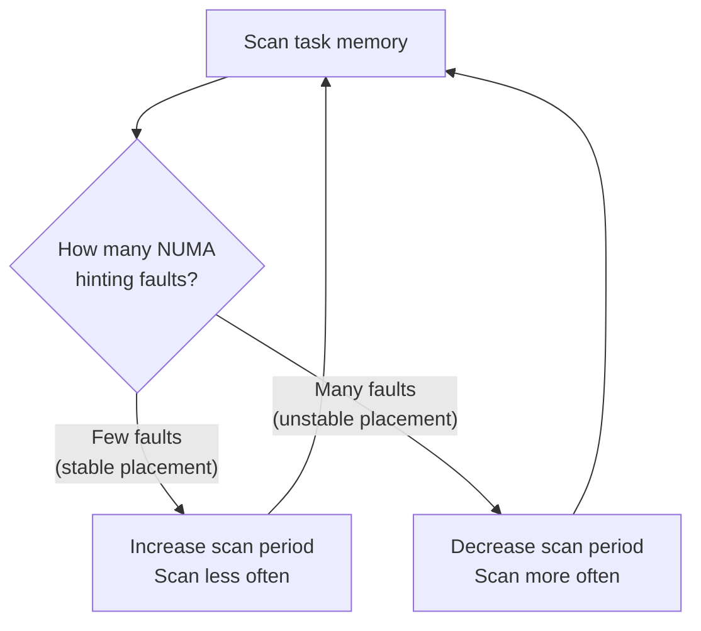
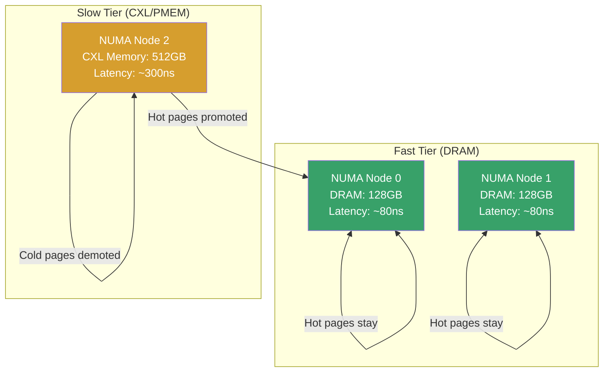
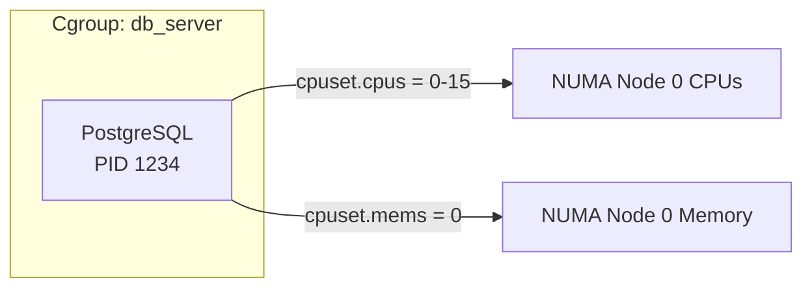
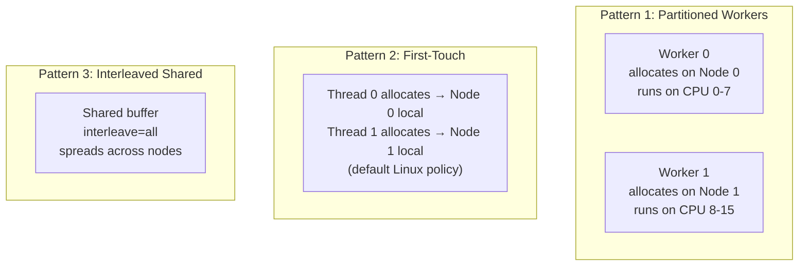
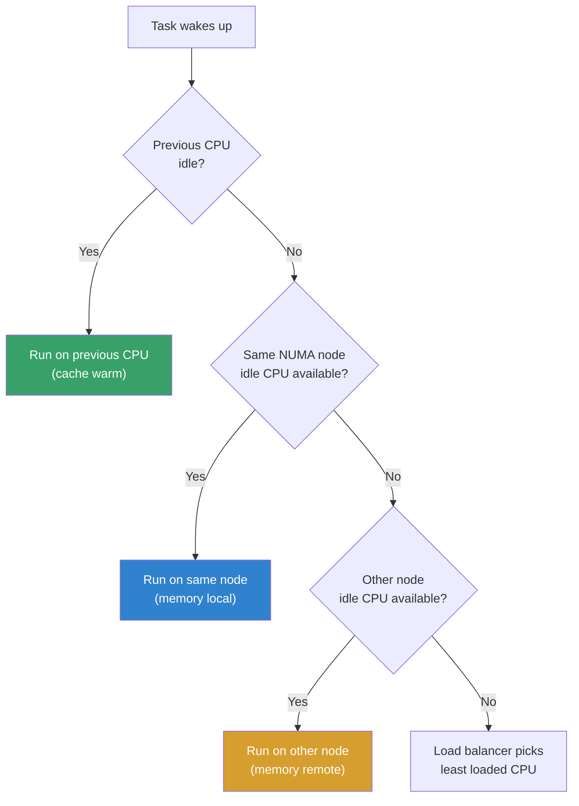

# NUMA Scheduling

## Introduction

On NUMA (Non-Uniform Memory Access) architectures, the time to access memory depends on **which CPU** accesses **which memory**. Memory directly attached to a CPU's node is "local" (fast, ~100ns), while memory on another node is "remote" (slower, ~150-300ns). The NUMA-aware scheduler in Linux ensures that tasks run on CPUs close to their memory, dramatically improving performance on multi-socket and chiplet-based systems.

Modern servers with multiple CPU sockets, AMD EPYC chiplets, and even Intel's hybrid architectures all exhibit NUMA characteristics. Without NUMA-aware scheduling, performance can degrade by **20-40%** for memory-intensive workloads.

## NUMA Architecture

### Hardware Topology



### NUMA Distance Matrix

The **SLIT (System Locality Information Table)** from ACPI defines the relative distance between NUMA nodes. The kernel reads this at boot:

```c
/* arch/x86/kernel/acpi/numa.c (simplified) */
void __init acpi_numa_slit_init(struct acpi_table_slit *slit)
{
    int i, j;
    for (i = 0; i < slit->locality_count; i++) {
        for (j = 0; j < slit->locality_count; j++) {
            /* Distance from node i to node j */
            int d = slit->entry[i * slit->locality_count + j];
            /* Store in numa_distance[] matrix */
            numa_distance[i][j] = d;
        }
    }
}
```

The distance is relative: 10 = local (same node), higher values = proportionally slower. The kernel uses this for fallback allocation decisions.

```bash
# Show NUMA nodes
numactl --hardware
# available: 2 nodes (0-1)
# node 0 cpus: 0 1 2 3 4 5 6 7 8 9 10 11 12 13 14 15
# node 0 size: 65536 MB
# node 0 free: 32768 MB
# node 1 cpus: 16 17 18 19 20 21 22 23 24 25 26 27 28 29 30 31
# node 1 size: 65536 MB
# node 1 free: 48000 MB
# node distances:
# node   0   1
#   0:  10  21
#   1:  21  10

# Detailed topology
lstopo --no-io --of txt
# Or:
lscpu | grep -i numa
# NUMA node(s):        2
# NUMA node0 CPU(s):   0-15
# NUMA node1 CPU(s):   16-31

# Show distance matrix
cat /sys/devices/system/node/node*/distance
# 10 21
# 21 10

# Check NUMA memory info per node
cat /sys/devices/system/node/node0/meminfo
# Node 0 MemTotal:    67108864 kB
# Node 0 MemFree:     33554432 kB
# Node 0 MemUsed:     33554432 kB
```

### Multi-Socket vs Chiplet NUMA

Modern CPUs exhibit NUMA characteristics even within a single socket:



```bash
# Check if NPS (NUMA nodes per socket) is configured
# AMD EPYC: NPS setting in BIOS determines topology
# NPS1: All cores in one NUMA node (flat)
# NPS2: 2 NUMA nodes per socket
# NPS4: 4 NUMA nodes per socket

# Detect actual topology
numactl --hardware | head -3
# NPS1: available: 1 nodes (0)
# NPS2: available: 2 nodes (0-1)
# NPS4: available: 4 nodes (0-3)
```

## Scheduling Domains

The Linux scheduler organizes CPUs into a hierarchy of **scheduling domains**. Each domain represents a set of CPUs that share certain properties (caches, NUMA nodes, physical packages). The scheduler uses this hierarchy for load balancing decisions.

### Domain Hierarchy



### Scheduling Domain Kernel Structures

```c
/* include/linux/sched/sd_flags.h — domain flags */
#define SD_SHARE_CPUCAPACITY   0x0001  /* SMT: share CPU capacity */
#define SD_SHARE_PKG_RESOURCES 0x0002  /* MC: share package resources */
#define SD_NUMA                0x0004  /* NUMA domain */
#define SD_SHARE_POWERDOMAIN   0x0008  /* Share power domain */

/* kernel/sched/topology.c — domain build */
struct sched_domain *build_sched_domain(struct sched_domain_topology_level *tl,
                                         const struct cpumask *cpu_map,
                                         struct sched_domain_attr *attr,
                                         struct sched_domain *child,
                                         int cpu)
{
    struct sched_domain *sd;

    sd = *per_cpu_ptr(d.sd, cpu);
    sd->flags = tl->flags;
    sd->span_weight = cpumask_weight(tl->mask(cpu));

    /* NUMA domains have higher imbalance tolerance */
    if (sd->flags & SD_NUMA)
        sd->imbalance_pct = 125;  /* Allow 25% imbalance before migrating */

    return sd;
}
```

### Inspecting Scheduling Domains

```bash
# View scheduling domain information
cat /proc/sys/kernel/sched_domain/cpu0/domain0/name
# SMT
cat /proc/sys/kernel/sched_domain/cpu0/domain1/name
# MC
cat /proc/sys/kernel/sched_domain/cpu0/domain2/name
# NUMA

# Domain parameters
ls /proc/sys/kernel/sched_domain/cpu0/domain0/
# busy_factor        cache_nice_tries  imbalance_pct
# max_interval       min_interval      name
# newidle_idx        wake_idx          forkexec_idx

# Balance interval (ms)
cat /proc/sys/kernel/sched_domain/cpu0/domain0/min_interval
# 4
cat /proc/sys/kernel/sched_domain/cpu0/domain0/max_interval
# 400

# Imbalance percentage (higher = less eager to migrate)
cat /proc/sys/kernel/sched_domain/cpu0/domain2/imbalance_pct
# 125  (NUMA domain: more tolerant of imbalance)
```

### Domain Load Balancing Intervals

Each domain level has different balance intervals:

| Domain | min_interval | max_interval | Behavior |
|--------|-------------|-------------|----------|
| SMT | 1ms | 4ms | Very frequent balancing |
| MC | 4ms | 64ms | Moderate balancing |
| NUMA | 8ms | 400ms | Infrequent, expensive balancing |

The scheduler uses exponential backoff: if a balance attempt finds nothing to migrate, the interval doubles up to `max_interval`.

## NUMA Balancing

Linux implements **Automatic NUMA Balancing** (since Linux 3.8) using a mechanism called **NUMA hinting faults**. The kernel periodically unmaps pages and notes which CPU faults on them, building a picture of which nodes access which memory.

### How NUMA Balancing Works



The NUMA balancing mechanism uses **PROT_NONE** PTE entries to detect page access patterns:

1. **Scan phase**: The kernel periodically changes PTE permissions to `PROT_NONE` (no access) on random pages
2. **Fault phase**: When the task accesses the page, a **NUMA hinting fault** occurs (not a real fault — the page is valid)
3. **Accounting**: The kernel records which NUMA node faulted and which node the page is on
4. **Migration decision**: If the page is accessed frequently from a remote node, it's migrated locally
5. **Task migration**: If most of a task's memory is on another node, the task may be migrated

```c
/* mm/mprotect.c — simplified NUMA hinting fault */
static vm_fault_t do_numa_page(struct vm_fault *vmf)
{
    struct page *page = vmf->page;
    int nid = page_to_nid(page);           /* Node where page lives */
    int cpu = smp_processor_id();          /* CPU that faulted */
    int last_nid = numa_pages_allocated[nid];

    /* Record the fault for later migration decisions */
    task_numa_fault(vmf->vma, vmf->address, nid, cpu);

    /* Restore proper PTE permissions */
    /* ... */

    return 0;
}
```

### NUMA Balancing Scan Algorithm

The kernel scans a task's memory at a rate proportional to its working set size:

```c
/* kernel/sched/fair.c — task_numa_work() */
static void task_numa_work(struct callback_head *work)
{
    struct task_struct *p = current;
    struct mm_struct *mm = p->mm;
    unsigned long nr_pte_updates = 0;
    long runtime = p->se.sum_exec_runtime;

    /* Scan rate: proportional to task's memory footprint */
    /* Scan size: numa_balancing_scan_size_mb (default 256MB) */
    unsigned long pages_to_scan = numa_balancing_scan_size_mb *
                                   (1024 * 1024 / PAGE_SIZE);

    /* Walk VMAs and mark pages for NUMA hinting */
    walk_page_range(mm, start, end, &numa_walk_ops, &nr_pte_updates);

    /* Re-arm the scan timer with adaptive period */
    /* Period adapts based on how many faults were observed */
}
```

### Configuring NUMA Balancing

```bash
# Enable/disable NUMA balancing (enabled by default)
cat /proc/sys/kernel/numa_balancing
# 1

echo 0 > /proc/sys/kernel/numa_balancing  # Disable
echo 1 > /proc/sys/kernel/numa_balancing  # Enable

# NUMA balancing settings (Linux 5.8+)
# Scan delay in milliseconds
cat /proc/sys/kernel/numa_balancing_scan_delay_ms
# 1000

# Scan period range
cat /proc/sys/kernel/numa_balancing_scan_period_min_ms
# 1000
cat /proc/sys/kernel/numa_balancing_scan_period_max_ms
# 60000

# Scan size (MB per scan)
cat /proc/sys/kernel/numa_balancing_scan_size_mb
# 256

# Promote/demote thresholds
cat /proc/sys/kernel/numa_balancing_promote_rate_limit_MBps
# 65536
```

### Adaptive Scan Period

The scan period adapts based on observed NUMA behavior:



- **Few faults** → memory is well-placed → scan less often (save CPU)
- **Many faults** → memory is misplaced → scan more often (migrate faster)

### Monitoring NUMA Balancing

```bash
# NUMA event counters
grep -i numa /proc/vmstat
# numa_hit 12345678          ← Local allocation succeeded
# numa_miss 234567           ← Had to allocate on another node
# numa_foreign 123456        ← Another node's local memory used
# numa_interleave 8901       ← Interleaved allocations
# numa_local 12000000        ← Pages allocated locally
# numa_other 567890          ← Pages allocated remotely

# NUMA balancing stats
cat /proc/vmstat | grep numa_
# numa_pte_updates 45678     ← PTEs updated for NUMA
# numa_hint_faults 12345     ← Total hint faults
# numa_hint_faults_local 10000  ← Faults on local pages
# numa_pages_migrated 2345   ← Pages migrated between nodes

# Per-task NUMA stats
cat /proc/<pid>/numa_maps
# 00400000 default file=/usr/bin/myapp mapped=100 N0=80 N1=20
# 7f1234000000 anon dirty=50 active=45 N0=45 N1=5
# N0=80 means 80 pages on node 0, N1=20 means 20 pages on node 1

# Detailed per-VMA info
cat /proc/<pid>/numa_maps | column -t
```

### Interpreting numa_maps

```bash
# numa_maps output format:
# <address> <policy> <anon>=<pages> <dirty>=<pages> <active>=<pages> N0=<p> N1=<p> ...

# Example analysis:
cat /proc/$(pidof postgres)/numa_maps
# 00400000 default file=/usr/lib/postgresql/14/bin/postgres mapped=100 N0=90 N1=10
# → 90% local, 10% remote — good placement

# 7f1234000000 anon dirty=500 N0=100 N1=400
# → 80% remote — might need migration or numactl pinning

# Policy field values:
# default    → MPOL_DEFAULT (use process default)
# bind:0     → MPOL_BIND (pinned to node 0)
# interleave → MPOL_INTERLEAVE (spread across nodes)
# preferred:1 → MPOL_PREFER (prefer node 1, fallback allowed)
```

## Memory Placement Policies

### Using `numactl`

```bash
# Run with memory interleaved across all nodes
numactl --interleave=all ./myapp

# Bind to node 0 (CPU and memory)
numactl --cpunodebind=0 --membind=0 ./myapp

# Bind to specific CPUs
numactl --cpubind=0-7 --membind=0 ./myapp

# Preferred node (fallback allowed)
numactl --preferred=0 ./myapp

# Local allocation (default)
numactl --localalloc ./myapp

# Complex: bind CPUs, interleave memory
numactl --cpunodebind=0 --interleave=0,1 ./myapp

# Check NUMA policy of running process
cat /proc/<pid>/numa_maps | head -5
# Shows memory layout and which nodes pages are on
```

### Memory Policies in Code

```c
#include <numaif.h>
#include <numa.h>
#include <stdlib.h>

int main() {
    /* Initialize libnuma */
    if (numa_available() < 0) {
        fprintf(stderr, "NUMA not available\n");
        return 1;
    }

    /* Set memory policy for the process */
    unsigned long nodemask = 1 << 0;  /* Node 0 */
    set_mempolicy(MPOL_BIND, &nodemask, sizeof(nodemask) * 8);

    /* Allocate memory — now goes to node 0 */
    void *ptr = malloc(1024 * 1024 * 512);  /* 512MB */
    memset(ptr, 0, 1024 * 1024 * 512);

    /* Or per-allocation policy */
    unsigned long target_node = 1;
    void *ptr2 = numa_alloc_onnode(1024 * 1024, target_node);

    /* Interleave allocation across nodes */
    set_mempolicy(MPOL_INTERLEAVE, NULL, 0);
    /* All subsequent allocations are interleaved */

    numa_free(ptr2, 1024 * 1024);
    return 0;
}
# Compile: gcc -lnuma numademo.c -o numademo
```

### Memory Policy Kernel Implementation

```c
/* mm/mempolicy.c — simplified set_mempolicy() */
SYSCALL_DEFINE3(set_mempolicy, int, mode, unsigned long __user *, nmask,
                unsigned long, maxnode)
{
    struct mempolicy *new;

    switch (mode) {
    case MPOL_DEFAULT:
        new = NULL;  /* Remove explicit policy */
        break;
    case MPOL_BIND:
        /* Only allocate from specified nodes */
        new = mpol_new(mode, nmask);
        break;
    case MPOL_PREFER:
        /* Prefer specified node, fallback to others */
        new = mpol_new(mode, nmask);
        break;
    case MPOL_INTERLEAVE:
        /* Round-robin page allocation across nodes */
        new = mpol_new(mode, nmask);
        break;
    }

    /* Apply to all future allocations */
    current->mempolicy = new;
    return 0;
}
```

### Memory Tiering (Linux 5.15+)

Modern systems with multiple memory tiers (DRAM + CXL/persistent memory) use NUMA-based tiering:



```bash
# Check memory tiers
cat /sys/devices/system/node/node*/meminfo | grep -i tier

# Node 0: Fast tier (DRAM)
# Node 1: Slow tier (CXL/persistent memory)

# Auto-promotion settings
echo 1 > /proc/sys/kernel/numa_balancing  # Enable

# Migration threshold (pages accessed more than this get promoted)
cat /proc/sys/kernel/numa_balancing_promote_rate_limit_MBps
```

## NUMA and Cgroup cpuset

Cgroups v2's `cpuset` controller can pin tasks to specific NUMA nodes:

```bash
# Create a cpuset cgroup pinned to NUMA node 0
mkdir /sys/fs/cgroup/numa_node0
echo "0-15" > /sys/fs/cgroup/numa_node0/cpuset.cpus
echo "0" > /sys/fs/cgroup/numa_node0/cpuset.mems

# Move a process into the cgroup
echo $PID > /sys/fs/cgroup/numa_node0/cgroup.procs

# The process can only use CPUs 0-15 and memory from node 0
```



## Practical Performance Tuning

### Case Study: Database Server

```bash
# Bad: Database processes scattered across nodes
pg_start  # Runs on whatever CPU the scheduler picks

# Good: Pin PostgreSQL to node 0
numactl --cpunodebind=0 --membind=0 pg_start

# Or for specific shared_buffers allocation
numactl --interleave=all pg_start  # Better for shared buffers

# Check current NUMA distribution
numastat -p postgres
# Per-node process memory usage (MB)
#                  Node 0   Node 1    Total
# ---------------  ------   ------   ------
# postgres           4096        0     4096
```

### Case Study: In-Memory Database (Redis/Memcached)

```bash
# Redis: single-threaded, pin to one NUMA node
numactl --cpunodebind=0 --membind=0 redis-server

# For multi-instance: one instance per NUMA node
numactl --cpunodebind=0 --membind=0 redis-server --port 6379
numactl --cpunodebind=1 --membind=1 redis-server --port 6380
```

### Identifying NUMA Issues

```bash
# Watch for NUMA misses in real-time
watch -n 1 'grep -E "numa_(hit|miss|local|other)" /proc/vmstat'

# High miss ratio indicates problem
# numa_miss / (numa_hit + numa_miss) > 0.1 = investigate!

# Check which processes have remote memory
for pid in $(pgrep myapp); do
    echo "PID $pid:"
    numastat -p $pid 2>/dev/null | grep -E "Total|Other"
done

# Find processes with significant remote allocation
numastat | grep -E "numa_miss|numa_foreign"
```

### System-wide NUMA Statistics

```bash
# Per-node summary
numastat
# node0           node1
# numa_hit      12345678    11234567
# numa_miss       234567      345678
# numa_foreign     345678      234567
# interleave_hit    8901        8901
# local_node     12000000    10900000
# other_node       567890      678901

# Per-process NUMA hit/miss
numastat -c | head -20
```

### NUMA-Aware Application Design Patterns



## NUMA and the Scheduler

The scheduler's NUMA placement decisions are influenced by several tunables:

```bash
# Scheduler migration cost (nanoseconds)
cat /proc/sys/kernel/sched_migration_cost_ns
# 500000  (0.5ms — includes cache warm-up time)

# NUMA balance interval
cat /proc/sys/kernel/sched_numa_balancing_period_min_ms
# 1000

# Threshold for task migration
cat /proc/sys/kernel/sched_numa_balancing_migrate_deferred
# 1  (defer migration to avoid bouncing)

# Preferred node for new tasks
cat /proc/sys/kernel/sched_numa_prefer_sibling
# 0
```

### NUMA Task Placement Decision

When a task wakes up, the scheduler considers NUMA topology:



### Preventing NUMA Bouncing

NUMA "bouncing" occurs when a task or page frequently migrates between nodes:

```bash
# Increase imbalance tolerance (less eager migration)
echo 150 > /proc/sys/kernel/sched_domain/cpu0/domain2/imbalance_pct

# Defer migrations
echo 1 > /proc/sys/kernel/sched_numa_balancing_migrate_deferred

# Increase migration cost estimate
echo 1000000 > /proc/sys/kernel/sched_migration_cost_ns  # 1ms

# Disable automatic NUMA balancing entirely (if using manual pinning)
echo 0 > /proc/sys/kernel/numa_balancing
```

## References

- [The Linux Kernel Documentation](https://docs.kernel.org/)
- [GNU Project Documentation](https://www.gnu.org/doc/doc.html)
- [GNU Manuals](https://www.gnu.org/manual/manual.html)
- [Free Software Directory](https://directory.fsf.org/wiki/Main_Page)
- [Planet GNU](https://planet.gnu.org/)
- [Free Software Books](https://www.gnu.org/doc/other-free-books.html)

- [NUMA-aware scheduling documentation](https://www.kernel.org/doc/Documentation/scheduler/sched-numa-balancing.txt)
- [numactl(8) man page](https://man7.org/linux/man-pages/man8/numactl.8.html)
- [set_mempolicy(2) man page](https://man7.org/linux/man-pages/man2/set_mempolicy.2.html)
- [Linux NUMA memory policy](https://www.kernel.org/doc/Documentation/admin-guide/mm/numa_memory_policy.rst)
- [Mel Gorman's NUMA balancing patches](https://lwn.net/Articles/524977/)
- [NUMA Automatic Balancing — Linux Kernel Internals](https://kernel-internals.org/sched/numa-balancing/) — Detailed internals
- [CXL Memory Tiering](https://docs.kernel.org/mm/cxl_memory_hotplug.html) — Linux CXL tiering documentation

## Related Topics

- [Process Priorities](./priorities.md) — CPU scheduling priority
- [Deadline Scheduling](./deadline-scheduling.md) — Real-time scheduling
- [Cgroups](./cgroups.md) — cpuset controller for NUMA pinning
- [Scheduling Domains](./sched-domains.md) — Domain hierarchy details
- [Memory Tiering](../mm/memory-tiering.md) — Hot/cold page migration
