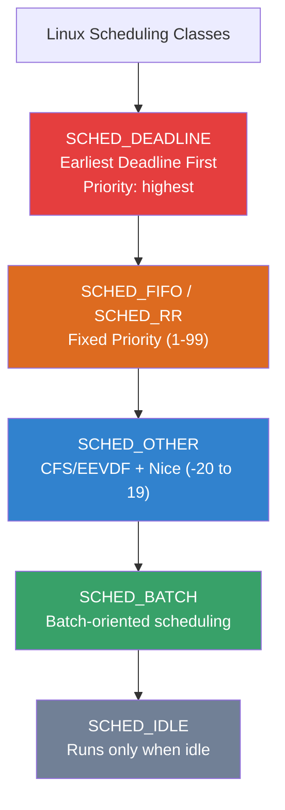
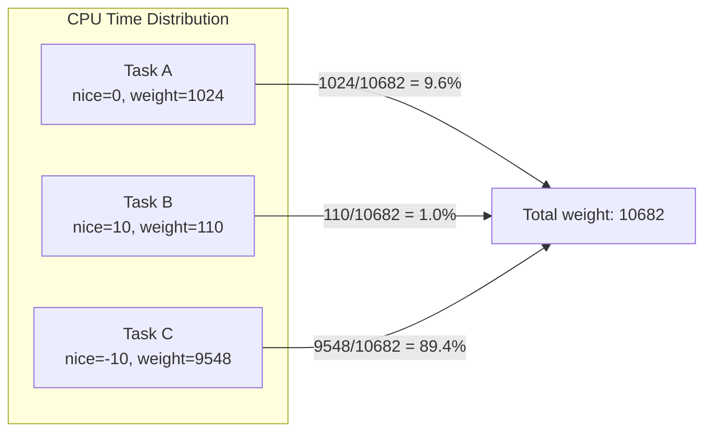
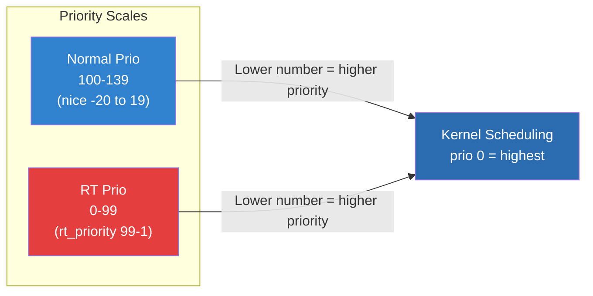
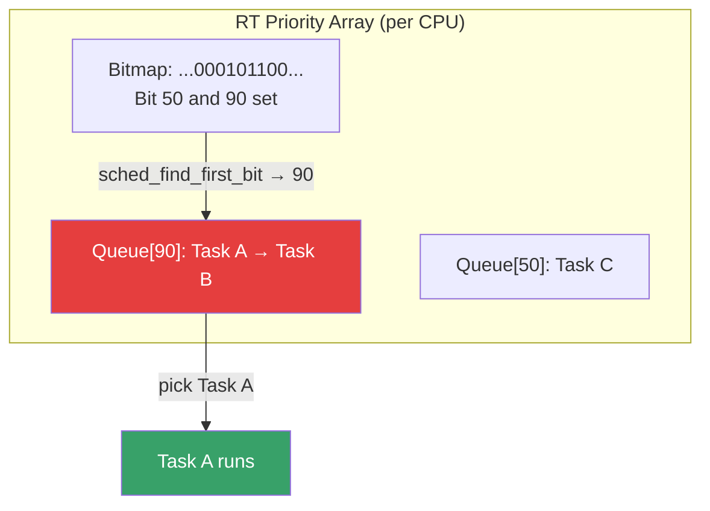
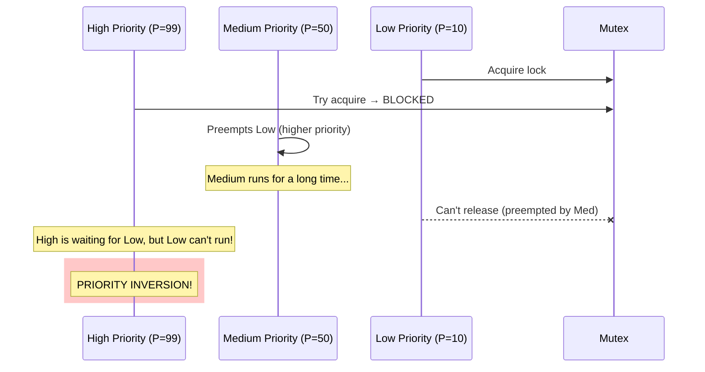
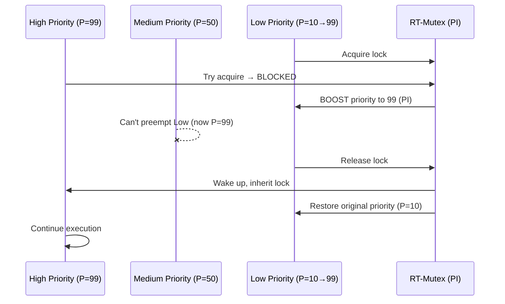
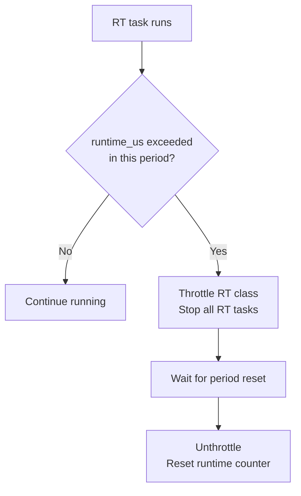
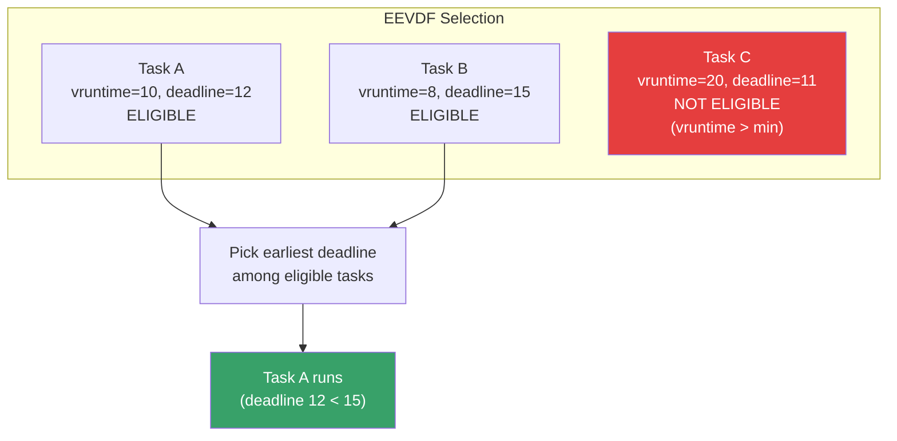

# Process Priorities

## Introduction

Linux provides multiple mechanisms to control how much CPU time and I/O bandwidth processes receive. Understanding these priority systems is essential for system administrators managing mixed workloads—ensuring that interactive applications remain responsive while batch jobs consume leftover capacity.

The Linux scheduler supports three broad classes of scheduling, each with its own priority scheme:

- **Normal (SCHED_OTHER/SCHED_BATCH/SCHED_IDLE)**: Uses `nice` values (-20 to 19)
- **Real-time (SCHED_FIFO/SCHED_RR)**: Uses `rt_priority` (1 to 99)
- **Deadline (SCHED_DEADLINE)**: Uses temporal parameters (see [Deadline Scheduling](./deadline-scheduling.md))

Additionally, the I/O scheduler has its own priority system via `ionice`.

## Scheduling Class Hierarchy



The kernel always picks the highest-priority non-empty class. Within each class, different rules apply. SCHED_DEADLINE tasks always preempt SCHED_FIFO/RR, which always preempt normal tasks.

## Nice Values

The `nice` value is the most common way to influence process scheduling. Named after the "be nice to other users" concept from Unix, it ranges from **-20** (highest priority, least nice) to **19** (lowest priority, most nice).

### How Nice Values Work

The Linux CFS (Completely Fair Scheduler) and its successor EEVDF use nice values to calculate a **weight** that determines the proportion of CPU time a process receives:

```bash
# Nice value to weight mapping (approximate)
# Each step of nice ≈ 1.25x more CPU time
# nice -20 → weight 88761
# nice   0 → weight 1024
# nice  19 → weight 15

# The actual weight table (from kernel/sched/core.c):
# static const int prio_to_weight[40] = {
#  /* -20 */     88761,     71755,     56483,     46273,     36291,
#  /* -15 */     29154,     23254,     18705,     14949,     11916,
#  /* -10 */      9548,      7620,      6100,      4904,      3906,
#  /*  -5 */      3121,      2501,      1991,      1586,      1277,
#  /*   0 */      1024,       820,       655,       526,       423,
#  /*   5 */       335,       272,       215,       172,       137,
#  /*  10 */       110,        87,        70,        56,        45,
#  /*  15 */        36,        29,        23,        18,        15,
# };
```

The weight table follows a geometric progression where each nice step represents approximately a 1.25× change in CPU share. This is derived from the formula:

```
weight(nice) = 1024 × 1.25^(-nice)
```

The kernel stores this as a lookup table to avoid floating-point math.

### Nice-to-Weight Kernel Implementation

```c
/* kernel/sched/core.c — nice_to_weight conversion */
static inline int nice_to_weight(int nice)
{
    /* Scale nice from [-20, 19] to [0, 39] index */
    return prio_to_weight[nice + 20];
}

static inline int weight_to_nice(int weight)
{
    /* Inverse lookup — used for load balancing calculations */
    /* ... approximation using bit shifts ... */
}
```

### How the Scheduler Uses Weights



The scheduler divides CPU time proportionally:

```
CPU_share(task) = weight(task) / Σ weight(all_runnable_tasks)
```

### Setting Nice Values

```bash
# Start a process with a specific nice value
nice -n 10 ./cpu_intensive_job      # Lower priority
nice -n -5 ./critical_service        # Higher priority (needs root)

# Change nice value of running process
renice 15 -p 1234                    # Set PID 1234 to nice 15
renice -5 -p 1234                    # Set to -5 (needs root)
renice 10 -u myuser                  # All processes of myuser

# View nice values
ps -eo pid,ni,comm | head -10
#   PID  NI COMMAND
#     1   0 systemd
#     2   0 kthreadd
#   456  10 cpu_job
#   789 -10 rt_service

# In top: press 'r' to renice a process
# In htop: select process, press F7/F8 to adjust
```

### CPU Time Distribution Example

```bash
# Two processes with different nice values
nice -n 0  ./job_a &    # Normal priority (weight 1024)
nice -n 10 ./job_b &    # Lower priority (weight 110)

# Job A gets: 1024 / (1024 + 110) ≈ 90.3% CPU
# Job B gets:  110 / (1024 + 110) ≈  9.7% CPU

# Verify with top
top -bn1 | grep -E "job_a|job_b"
# 1234 user  20   0  ... 90.3  0.1  job_a
# 1235 user  30   0  ...  9.7  0.1  job_b
```

### The Kernel Nice Implementation

The nice value maps to `task_struct->static_prio`:

```c
/* include/linux/sched.h */
#define MAX_NICE        19
#define MIN_NICE        -20
#define NICE_WIDTH      (MAX_NICE - MIN_NICE + 1)

/* nice → static_prio conversion */
#define NICE_TO_PRIO(nice)      ((nice) + 120)
#define PRIO_TO_NICE(prio)      ((prio) - 120)

/* static_prio ranges from 100 (nice -20) to 139 (nice 19) */
/* Normal tasks: static_prio = 120 + nice */
/* RT tasks: rt_priority 1-99, prio = 99 - rt_priority */
```

The relationship between priority values:



## Real-Time Priorities

Real-time scheduling classes (`SCHED_FIFO` and `SCHED_RR`) use a separate priority scale from 1 (lowest) to 99 (highest). These always preempt normal tasks.

### SCHED_FIFO vs SCHED_RR

| Property | SCHED_FIFO | SCHED_RR |
|----------|-----------|----------|
| Preemption | Same priority: no preemption | Same priority: time-slice round-robin |
| Time quantum | None (runs until voluntary yield) | Default 100ms (configurable) |
| Behavior | First-in, first-out among equal priority | Round-robin among equal priority |
| Use case | Deterministic, short critical sections | Fair sharing among same-priority RT tasks |

### RT Scheduling Internals

The kernel stores RT tasks in a per-CPU bitmap array:

```c
/* kernel/sched/sched.h */
struct rt_prio_array {
    DECLARE_BITMAP(bitmap, MAX_RT_PRIO + 1);  /* 100 bits */
    struct list_head queue[MAX_RT_PRIO];       /* One list per priority */
};
```

The scheduler finds the highest-priority RT task by finding the first set bit in the bitmap, then picking the first task from that priority's queue:

```c
/* kernel/sched/rt.c — pick_next_task_rt() */
static struct task_struct *pick_next_task_rt(struct rq *rq)
{
    struct rt_prio_array *array = &rq->rt.active;
    struct rt_rq *rt_rq = &rq->rt;
    struct task_struct *p;

    /* Find highest priority with runnable tasks */
    int idx = sched_find_first_bit(array->bitmap);
    struct list_head *queue = &array->queue[idx];

    /* Pick first task from that queue */
    p = list_first_entry(queue, struct task_struct, rt.run_list);
    return p;
}
```



### Setting Real-Time Priority

```bash
# Start as SCHED_FIFO with priority 50
chrt -f 50 ./realtime_app

# Start as SCHED_RR with priority 30
chrt -r 30 ./realtime_app

# Change priority of running process
chrt -f -p 60 1234      # Change PID 1234 to SCHED_FIFO priority 60
chrt -r -p 40 1234      # Change to SCHED_RR priority 40
chrt -o -p 0 1234       # Back to SCHED_OTHER (normal)

# View real-time processes
ps -eo pid,cls,rtprio,comm | grep -E "FF|RR"
#   PID CLS RTPRIO COMMAND
#   456  FF     50 realtime_app
#   789  RR     30 rt_worker

# Check your system's RT limits
ulimit -r                # Max RT priority for this user
# 0 (default: no RT access)
# Set in /etc/security/limits.conf:
# myuser - rtprio 50
```

### Real-Time Priority in Code

```c
#include <sched.h>
#include <stdio.h>

int main() {
    struct sched_param param;
    
    /* Set SCHED_FIFO priority 50 */
    param.sched_priority = 50;
    if (sched_setscheduler(0, SCHED_FIFO, &param) < 0) {
        perror("sched_setscheduler");
        /* Needs CAP_SYS_NICE or root */
        return 1;
    }
    
    /* Lock memory to prevent page faults */
    mlockall(MCL_CURRENT | MCL_FUTURE);
    
    /* Real-time work loop */
    while (1) {
        do_critical_work();
        /* Sleep until next period */
        clock_nanosleep(CLOCK_MONOTONIO, TIMER_ABSTIME, &next_wakeup, NULL);
    }
    return 0;
}
```

### SCHED_RR Time Quantum

The round-robin time quantum for SCHED_RR defaults to 100ms but can be configured:

```bash
# View default RR quantum
chrt -r -p 1234
# pid 1234's current scheduling policy: SCHED_RR
# pid 1234's current scheduling attributes: priority = 30

# The quantum is stored in /proc/sys/kernel/sched_rr_timeslice_ms
cat /proc/sys/kernel/sched_rr_timeslice_ms
# 100

# Modify (in milliseconds, or -1 for default)
echo 25 > /proc/sys/kernel/sched_rr_timeslice_ms   # 25ms quantum
echo -1 > /proc/sys/kernel/sched_rr_timeslice_ms   # Reset to default
```

## Priority Inversion and Priority Inheritance

**Priority inversion** occurs when a high-priority task blocks on a resource held by a low-priority task, while a medium-priority task preempts the low-priority task—effectively making the high-priority task wait for the medium-priority one.



**Priority inheritance** solves this by temporarily boosting the low-priority task's priority:



```bash
# Linux uses priority inheritance for RT mutexes automatically
# In user space, use pthread_mutex with PTHREAD_PRIO_INHERIT

# Check if PI is in use
grep RTM /proc/locks 2>/dev/null
```

```c
#include <pthread.h>

pthread_mutex_t mutex;
pthread_mutexattr_t attr;

pthread_mutexattr_init(&attr);
pthread_mutexattr_setprotocol(&attr, PTHREAD_PRIO_INHERIT);
pthread_mutex_init(&mutex, &attr);

/* Now mutex uses priority inheritance */
pthread_mutex_lock(&mutex);   /* If blocked by lower-prio, it gets boosted */
/* critical section */
pthread_mutex_unlock(&mutex);
```

### The Kernel RT-Mutex PI Chain

The kernel's RT-mutex subsystem maintains a **priority inheritance chain**. When task A blocks on a mutex held by task B, which is blocked on a mutex held by task C, the kernel boosts C's priority to A's level:

```c
/* kernel/locking/rtmutex.c (simplified) */
static int rt_mutex_adjust_prio_chain(struct task_struct *task,
                                       struct rt_mutex_waiter *waiter,
                                       struct rt_mutex *lock)
{
    /* Walk the PI chain: task → lock → owner → lock → owner ... */
    /* Boost each owner to the highest waiter's priority */
    while (waiter) {
        struct task_struct *owner = rt_mutex_owner(waiter->lock);
        if (owner->prio < task->prio)
            break;  /* Already higher, stop */
        rt_mutex_setprio(owner, task->prio);  /* Boost */
        waiter = owner->pi_blocked_on;
    }
}
```

## The Linux RT Throttling

The kernel limits how much CPU real-time tasks can consume to prevent starving the entire system:

```bash
# RT bandwidth control
cat /proc/sys/kernel/sched_rt_period_us
# 1000000  (1 second period)

cat /proc/sys/kernel/sched_rt_runtime_us
# 950000   (950ms per second = 95% for RT tasks)

# Disable RT throttling (DANGEROUS — can lock out all non-RT tasks)
echo -1 > /proc/sys/kernel/sched_rt_runtime_us

# Restore safe default
echo 950000 > /proc/sys/kernel/sched_rt_runtime_us
```

### How RT Throttling Works



The throttling applies to **all RT tasks collectively** on a CPU, not individually. If multiple RT tasks share a CPU, their combined runtime is tracked.

```c
/* kernel/sched/rt.c */
static int sched_rt_runtime_exceeded(struct rq *rq, struct rt_rq *rt_rq)
{
    u64 runtime = rt_rq->rt_time;

    if (runtime >= rt_rq->rt_runtime) {
        /* Throttle the RT runqueue */
        rt_rq->rt_throttled = 1;
        /* Schedule the unthrottle timer */
        start_rt_bandwidth(rt_rq);
        return 1;
    }
    return 0;
}
```

## I/O Priority (ionice)

Separate from CPU scheduling, I/O priority controls disk I/O bandwidth. The CFQ (Completely Fair Queuing) and BFQ (Budget Fair Queuing) I/O schedulers support I/O priority.

### I/O Priority Classes

| Class | Value | Description |
|-------|-------|-------------|
| `IOPRIO_CLASS_NONE` | 0 | Best-effort (default) |
| `IOPRIO_CLASS_RT` | 1 | Real-time I/O (highest) |
| `IOPRIO_CLASS_BE` | 2 | Best-effort (default for most processes) |
| `IOPRIO_CLASS_IDLE` | 3 | I/O only when no other class is active |

Within each class (RT and BE), priority levels range from 0 (highest) to 7 (lowest).

### Using `ionice`

```bash
# Start with real-time I/O class, priority 0
ionice -c 1 -n 0 ./io_intensive_job    # Highest I/O priority
ionice -c 2 -n 0 ./normal_job           # Best-effort, level 0
ionice -c 3 ./background_job            # Idle I/O class

# Change I/O priority of running process
ionice -c 3 -p 1234                      # Set PID 1234 to idle class
ionice -p 1234                           # View current I/O class

# Combine with CPU nice
nice -n 19 ionice -c 3 ./batch_job      # Low CPU AND I/O priority

# Check I/O priority
ionice -p 1234
# idle

# View all processes' I/O classes
ps -eo pid,cls,ni,comm | head -5
# Note: I/O class isn't shown by default; use iotop instead
sudo iotop -aoP
```

### I/O Priority in Code

```c
#include <sys/syscall.h>
#include <unistd.h>

/* ioprio_set syscall */
#define IOPRIO_WHO_PROCESS 1
#define IOPRIO_CLASS_SHIFT 13
#define IOPRIO_CLASS_IDLE  3

int ioprio_set(int which, int who, int ioprio) {
    return syscall(SYS_ioprio_set, which, who, ioprio);
}

int main() {
    /* Set current process to idle I/O class */
    int ioprio = IOPRIO_CLASS_IDLE << IOPRIO_CLASS_SHIFT;
    ioprio_set(IOPRIO_WHO_PROCESS, 0, ioprio);
    
    /* Now do I/O-intensive work */
    do_background_io();
    return 0;
}
```

## EEVDF: The New Scheduler (Linux 6.6+)

Linux 6.6 replaced CFS with **EEVDF (Earliest Eligible Virtual Deadline First)** as the default scheduler for normal tasks. EEVDF improves on CFS by providing better latency guarantees while maintaining fairness.

### How EEVDF Differs from CFS

| Feature | CFS | EEVDF |
|---------|-----|-------|
| Selection criterion | Lowest `vruntime` | Earliest virtual deadline among eligible tasks |
| Latency guarantee | Approximate (sleeper bonus) | Precise (virtual deadline) |
| Fairness | Proportional share | Proportional share + deadline |
| Nice interaction | Same weight table | Same weight table |
| Starvation prevention | Natural (vruntime converges) | Eligibility check |

### Virtual Deadline in EEVDF

Each task gets a **virtual deadline** based on its fair share and request time:

```
virtual_deadline = arrival_time + (slice / weight)
```

A task is **eligible** when its `vruntime` ≤ the minimum `vruntime` of the runqueue. Among eligible tasks, the one with the earliest virtual deadline is selected.



## Practical Examples

### Example: Database Server Tuning

```bash
# Give the database higher CPU and I/O priority
renice -10 -p $(pidof postgres)         # Higher CPU priority
ionice -c 2 -n 0 -p $(pidof postgres)   # Best-effort I/O, level 0

# Background backup gets lowest priority
nice -n 19 ionice -c 3 ./run_backup.sh

# Verify
ps -eo pid,ni,comm | grep -E "postgres|backup"
# 1234 -10 postgres
# 5678  19 backup
```

### Example: Preventing a Build from Impacting Production

```bash
# Build system with combined low priority
nice -n 19 ionice -c 3 make -j$(nproc)

# Or limit entirely with cgroups (better approach)
systemd-run --scope -p CPUQuota=25% -p IOWeight=10 make -j$(nproc)
```

### Example: Checking All Priorities

```bash
# Comprehensive priority view
ps -eo pid,cls,rtprio,ni,comm --sort=-cls | head -20
#   PID CLS RTPRIO  NI COMMAND
#     1  TS      -   0 systemd
#   456  FF     50   - irq/45-nvidia
#   789  RR     30   - rt_worker
#  1024  TS      -  10 batch_job
#  2048  TS      - -10 critical_svc

# CLS values: TS=Time-Sharing, FF=FIFO, RR=Round-Robin,
#             DL=Deadline, ID=Idle, BR=Batch
```

### Example: Real-Time Application Setup

```bash
#!/bin/bash
# Complete RT application launch script

APP=./my_rt_app

# 1. Set memory limits (must lock all memory)
ulimit -l unlimited

# 2. Set RT priority limit
ulimit -r 99

# 3. Disable THP (reduces latency spikes)
echo never > /sys/kernel/mm/transparent_hugepage/enabled

# 4. Isolate CPUs 2-3 from kernel scheduling
# (add isolcpus=2,3 to kernel boot params)
# Or use cgroup cpuset:
mkdir -p /sys/fs/cgroup/cpuset/rt
echo 2-3 > /sys/fs/cgroup/cpuset/rt/cpuset.cpus
echo 0 > /sys/fs/cgroup/cpuset/rt/cpuset.mems

# 5. Launch the application
chrt -f 80 taskset -c 2-3 $APP
```

## Priority Summary Table

| Mechanism | Range | Scope | Effect |
|-----------|-------|-------|--------|
| nice | -20 to 19 | Per-process | CPU share proportion |
| RT priority | 1 to 99 | Per-process | Preempts all normal tasks |
| ionice class | RT/BE/IDLE | Per-process | I/O scheduling priority |
| ionice level | 0-7 | Per-class | I/O priority within class |
| cgroup CPU weight | 1-10000 | Per-group | Group CPU share |
| cgroup CPU quota | µs/period | Per-group | Hard CPU bandwidth limit |

## References

- [The Linux Kernel Documentation](https://docs.kernel.org/)
- [LWN.net - Linux and free software news](https://lwn.net/)
- [GNU Project Documentation](https://www.gnu.org/doc/doc.html)
- [GNU Manuals](https://www.gnu.org/manual/manual.html)
- [Free Software Directory](https://directory.fsf.org/wiki/Main_Page)
- [Planet GNU](https://planet.gnu.org/)
- [Free Software Books](https://www.gnu.org/doc/other-free-books.html)

- [sched(7) man page](https://man7.org/linux/man-pages/man7/sched.7.html) — Complete scheduling reference
- [nice(1) man page](https://man7.org/linux/man-pages/man1/nice.1.html)
- [renice(1) man page](https://man7.org/linux/man-pages/man1/renice.1.html)
- [chrt(1) man page](https://man7.org/linux/man-pages/man1/chrt.1.html)
- [ionice(1) man page](https://man7.org/linux/man-pages/man1/ionice.1.html)
- [CFS scheduler documentation](https://www.kernel.org/doc/Documentation/scheduler/sched-design-CFS.txt)
- [Priority inheritance in Linux](https://www.kernel.org/doc/Documentation/rt-mutex-design.txt)
- [EEVDF scheduler design](https://docs.kernel.org/scheduler/sched-eevdf.html) — EEVDF documentation
- [RT throttling documentation](https://docs.kernel.org/scheduler/sched-rt-group.html) — RT bandwidth control

## Related Topics

- [Deadline Scheduling](./deadline-scheduling.md) — SCHED_DEADLINE details
- [NUMA Scheduling](./numa-scheduling.md) — NUMA-aware scheduling
- [Cgroups](./cgroups.md) — Modern resource control alternative
- [Process Management](../../admin/process-management.md) — Administrative tools
- [RT-Mutexes](../sync/rt-mutex.md) — Priority inheritance implementation
