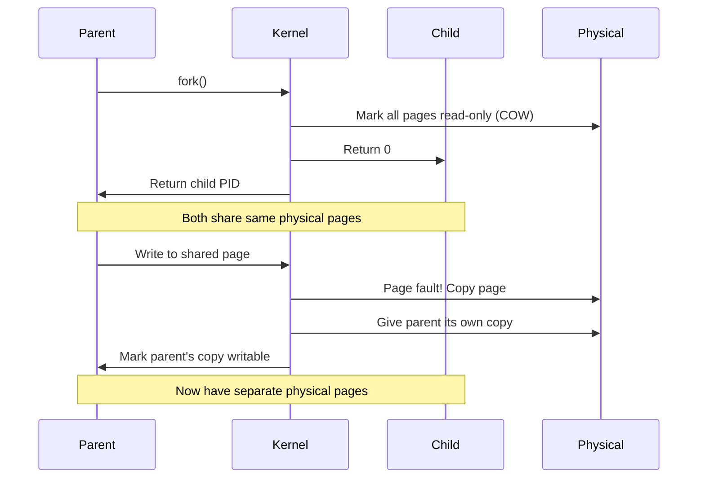
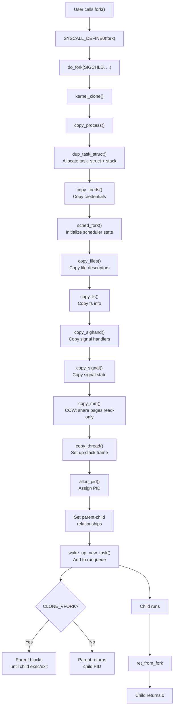

# Process Creation: fork, vfork, clone, clone3

## Introduction

Process creation is one of the most fundamental operations in Unix/Linux. The original Unix `fork()` system call creates a nearly exact copy of the calling process. Over time, Linux has added several variations — `vfork()` for performance, `clone()` for threads, and `clone3()` for a modern extensible interface.

All of these ultimately funnel into the kernel's `copy_process()` function, which does the heavy lifting of duplicating a task. This page explains each system call, how Copy-on-Write (COW) makes `fork()` efficient, and the internals of `do_fork()` / `copy_process()`.

## The System Calls

### fork()

`fork()` is the classic Unix process creation mechanism. It creates a child process that is an almost exact copy of the parent:

```c
/* Userspace API */
pid_t fork(void);
pid_t vfork(void);

/* Both are implemented in the kernel as: */
SYSCALL_DEFINE0(fork)
{
    return do_fork(SIGCHLD, 0, 0, NULL, NULL);
}

SYSCALL_DEFINE0(vfork)
{
    return do_fork(CLONE_VFORK | CLONE_VM | SIGCHLD, 0, 0, NULL, NULL);
}
```

Key properties of `fork()`:
- **Independent address space** — the child gets a copy of the parent's memory (via COW)
- **Same file descriptors** — but with independent file descriptor table entries pointing to the same underlying `struct file`
- **Same signal handlers** — copied to the child
- **Returns twice** — once in the parent (child's PID), once in the child (0)

```bash
# fork() creates a nearly identical process
$ cat /proc/self/status | grep -E '^(Pid|PPid|VmSize|VmRSS)'
Pid:    12345
PPid:   500
VmSize:    12340 kB
VmRSS:      5120 kB

# After fork, child has similar memory layout
$ cat /proc/12346/status | grep -E '^(Pid|PPid|VmSize|VmRSS)'
Pid:    12346
PPid:   12345
VmSize:    12340 kB  # Same virtual size
VmRSS:       320 kB  # Much less physical memory (COW)
```

### vfork()

`vfork()` is a performance optimization for the common case where the child immediately calls `exec()`:

```c
SYSCALL_DEFINE0(vfork)
{
    return do_fork(CLONE_VFORK | CLONE_VM | SIGCHLD, 0, 0, NULL, NULL);
}
```

Key properties:
- **Parent blocks** until the child calls `exec()` or `_exit()`
- **Shared address space** — `CLONE_VM` means the child runs in the parent's memory
- **Dangerous** — if the child modifies memory or returns from the function, behavior is undefined

```c
/* Example: vfork usage */
#include <unistd.h>
#include <stdio.h>
#include <sys/wait.h>

int main(void) {
    int x = 42;
    pid_t pid = vfork();

    if (pid == 0) {
        /* Child: must NOT modify memory or return
         * Must call _exit() or exec() */
        execl("/bin/echo", "echo", "Hello from child", NULL);
        _exit(1);  /* Only if exec fails */
    }

    /* Parent resumes after child calls exec or _exit */
    printf("x = %d\n", x);  /* x is guaranteed to be 42 */
    waitpid(pid, NULL, 0);
    return 0;
}
```

### clone()

`clone()` is the most flexible process creation syscall. It allows fine-grained control over what is shared between parent and child:

```c
/* Prototype */
int clone(int (*fn)(void *), void *stack, int flags, void *arg,
          pid_t *parent_tid, void *tls, pid_t *child_tid);

/* Kernel implementation */
SYSCALL_DEFINE5(clone, unsigned long, clone_flags,
                unsigned long, newsp, int __user *, parent_tidptr,
                int __user *, child_tidptr, unsigned long, tls)
{
    return do_fork(clone_flags, newsp, 0, parent_tidptr, child_tidptr);
}
```

The `flags` parameter uses the `CLONE_*` constants:

```c
/* Typical pthread_create flags */
#define THREAD_FLAGS (CLONE_VM | CLONE_FS | CLONE_FILES | \
                      CLONE_SIGHAND | CLONE_THREAD | CLONE_SYSVSEM | \
                      CLONE_SETTLS | CLONE_PARENT_SETTID | \
                      CLONE_CHILD_CLEARTID)
```

### clone3()

`clone3()` is the modern replacement, using a extensible struct-based interface:

```c
/* include/uapi/linux/sched.h */
struct clone_args {
    __aligned_u64 flags;        /* Flags bit mask */
    __aligned_u64 pidfd;        /* Where to store PID file descriptor */
    __aligned_u64 child_tid;    /* Where to store child TID */
    __aligned_u64 parent_tid;   /* Where to store parent TID */
    __aligned_u64 exit_signal;  /* Signal to send to parent on exit */
    __aligned_u64 stack;        /* Stack pointer for child */
    __aligned_u64 stack_size;   /* Stack size */
    __aligned_u64 tls;          /* TLS address */
    /* Added in later kernel versions: */
    __aligned_u64 set_tid;          /* Set child TID in specific PID ns */
    __aligned_u64 set_tid_size;     /* Number of elements in set_tid */
    __aligned_u64 cgroup;           /* Move child to cgroup */
};

/* Kernel implementation */
SYSCALL_DEFINE2(clone3, struct clone_args __user *, uargs, size_t, size)
{
    struct clone_args args;
    /* Copy args from userspace */
    if (copy_from_user(&args, uargs, size))
        return -EFAULT;
    /* ... */
    return kernel_clone(&kargs);
}
```

Advantages of `clone3()`:
- **Extensible** — new fields can be added without breaking compatibility
- **Size-delimited** — the `size` parameter indicates which fields are valid
- **PID file descriptors** — `pidfd` for race-free PID tracking
- **Cgroup placement** — directly move child to a specific cgroup

```c
/* Example: clone3() usage */
#define _GNU_SOURCE
#include <linux/sched.h>
#include <sys/syscall.h>
#include <unistd.h>
#include <stdio.h>

int child_func(void *arg) {
    printf("Child PID: %d\n", getpid());
    return 0;
}

int main(void) {
    struct clone_args args = {
        .flags = CLONE_VM | CLONE_THREAD | CLONE_SIGHAND,
        .stack = (unsigned long)malloc(1024*1024) + 1024*1024,
        .stack_size = 1024*1024,
        .exit_signal = 0,
    };

    pid_t pid = syscall(SYS_clone3, &args, sizeof(args));
    if (pid == 0) {
        /* In child */
        return child_func(NULL);
    }
    printf("Created thread with pid %d\n", pid);
    return 0;
}
```

## Copy-on-Write (COW)

### How COW Works

When `fork()` is called, the kernel doesn't actually copy the parent's memory. Instead, both parent and child share the same physical pages, marked as read-only. When either process tries to write to a page, a **page fault** occurs, and the kernel allocates a new physical page and copies the data:



### COW Implementation

```c
/* mm/memory.c - simplified COW handler */
static vm_fault_t do_wp_page(struct vm_fault *vmf)
{
    /* If only one reference, just make it writable */
    if (page_mapcount(vmf->page) == 1) {
        /* Only one mapping, can safely make writable */
        ptep_set_access_flags(vma, vmf->address,
                              vmf->pte, pte_mkdirty(pte), 1);
        return VM_FAULT_WRITE;
    }

    /* Multiple references: need to copy */
    struct page *new_page = alloc_page_vma(GFP_HIGHUSER_MOVABLE, vma, address);
    copy_user_highpage(new_page, vmf->page, vmf->address, vma);

    /* Update page table to point to new page */
    ptep_clear_flush(vma, address, vmf->pte);
    set_pte_at_notify(mm, address, vmf->pte,
                      mk_pte(new_page, vma->vm_page_prot));

    return VM_FAULT_WRITE;
}
```

### COW Optimization in Modern Kernels

Modern kernels optimize COW further:

```c
/* Since Linux 4.x: lazy COW for fork() */
/* Pages are not immediately marked read-only during fork.
 * Instead, the kernel uses the "page_mapcount" to detect
 * shared pages and only copies on actual write faults. */
```

```bash
# Observe COW in action
$ python3 -c "
import os
# Allocate 100MB
data = bytearray(100 * 1024 * 1024)
print(f'Parent RSS: {os.popen(\"cat /proc/self/statm\").read().split()[1]} pages')

pid = os.fork()
if pid == 0:
    import time
    print(f'Child RSS (before write): {os.popen(\"cat /proc/self/statm\").read().split()[1]} pages')
    data[0] = 42  # Trigger COW
    print(f'Child RSS (after write): {os.popen(\"cat /proc/self/statm\").read().split()[1]} pages')
    os._exit(0)
os.waitpid(pid, 0)
"
```

## do_fork() Internals

### The Main Path

All fork-family calls eventually reach `kernel_clone()` (or the older `do_fork()`):

```c
/* kernel/fork.c - simplified */
pid_t kernel_clone(struct kernel_clone_args *args)
{
    u64 clone_flags = args->flags;
    struct task_struct *p;
    pid_t pid;
    int trace = 0;

    /* ... security checks, tracepoint setup ... */

    /* The core: create the new task */
    p = copy_process(NULL, trace, NUMA_NO_NODE, args);

    if (!IS_ERR(p)) {
        /* Wake up the new task */
        struct pid *pid_type = task_pid_type(p, PIDTYPE_PID);
        pid = pid_vnr(pid_type);

        /* Start the child running */
        wake_up_new_task(p);

        /* For vfork: parent waits here */
        if (clone_flags & CLONE_VFORK) {
            if (!wait_for_vfork_done(p, &vfork))
                ptrace_event_pid(PTRACE_EVENT_VFORK_DONE, pid_type);
        }
    } else {
        pid = PTR_ERR(p);
    }
    return pid;
}
```

### copy_process() — The Heavy Lifter

`copy_process()` is the heart of process creation. It duplicates everything:

```c
/* kernel/fork.c - simplified, ~500 lines in real kernel */
static struct task_struct *copy_process(struct pid *pid,
                                        int trace,
                                        int node,
                                        struct kernel_clone_args *args)
{
    int pidfd = -1, retval;
    struct task_struct *p;
    u64 clone_flags = args->flags;

    /* 1. Validate flags */
    if ((clone_flags & (CLONE_NEWNS|CLONE_FS)) == (CLONE_NEWNS|CLONE_FS))
        return ERR_PTR(-EINVAL);

    /* 2. Allocate new task_struct */
    p = dup_task_struct(current, node);
    if (!p)
        return ERR_PTR(-ENOMEM);

    /* 3. Copy credentials */
    retval = copy_creds(p, clone_flags);
    if (retval < 0)
        goto bad_fork_free;

    /* 4. Set up scheduling */
    p->sched_reset_on_fork = 0;
    sched_fork(clone_flags, p);

    /* 5. Copy all resource subsystems */
    retval = copy_files(clone_flags, p);     /* File descriptors */
    retval = copy_fs(clone_flags, p);        /* Filesystem info */
    retval = copy_sighand(clone_flags, p);   /* Signal handlers */
    retval = copy_signal(clone_flags, p);    /* Signal state */
    retval = copy_mm(clone_flags, p);        /* Memory (COW) */
    retval = copy_namespaces(clone_flags, p);/* Namespaces */
    retval = copy_io(clone_flags, p);        /* I/O context */
    retval = copy_thread(p, args);           /* Architecture-specific state */

    /* 6. Assign PID */
    pid = alloc_pid(p->nsproxy->pid_ns_for_children);
    p->pid = pid_nr(pid);

    /* 7. Set up parent-child relationship */
    p->real_parent = current;
    p->parent = current;

    /* Add to parent's children list */
    list_add_tail(&p->sibling, &p->real_parent->children);

    /* 8. Set up thread group if CLONE_THREAD */
    if (clone_flags & CLONE_THREAD) {
        p->group_leader = current->group_leader;
        list_add_tail_rcu(&p->thread_node, &p->signal->thread_head);
    }

    /* 9. Copy seccomp filters */
    copy_seccomp(p);

    /* 10. Set up cgroup */
    cgroup_fork(p);

    /* 11. Security module setup */
    security_task_alloc(p, clone_flags);

    /* 12. Performance events */
    perf_event_init_task(p);

    return p;

bad_fork_free:
    free_task(p);
    return ERR_PTR(retval);
}
```

### dup_task_struct()

This function creates a copy of the task structure:

```c
/* kernel/fork.c */
static struct task_struct *dup_task_struct(struct task_struct *orig, int node)
{
    struct task_struct *tsk;
    unsigned long *stack;

    /* Allocate task_struct from slab */
    tsk = alloc_task_struct_node(node);
    if (!tsk)
        return NULL;

    /* Allocate kernel stack */
    stack = alloc_thread_stack_node(tsk, node);
    if (!stack)
        goto free_tsk;

    /* Copy the entire task_struct */
    *tsk = *orig;
    tsk->stack = stack;

    /* Clear thread_info at the bottom of the stack */
    threadinfo_init(task_stack_page(tsk));

    /* Reference counting */
    refcount_set(&tsk->usage, 1);

    /* Clear sensitive fields */
    tsk->flags &= ~(PF_SUPERPRIV | PF_WQ_WORKER | PF_NO_SETAFFINITY);
    tsk->flags |= PF_FORKNOEXEC;

    return tsk;
}
```

### copy_mm() — Memory Duplication

```c
/* kernel/fork.c */
static int copy_mm(unsigned long clone_flags, struct task_struct *tsk)
{
    struct mm_struct *mm, *oldmm;

    tsk->min_flt = tsk->maj_flt = 0;
    tsk->nvcsw = tsk->nivcsw = 0;

    oldmm = current->mm;
    if (!oldmm)
        return 0;  /* Kernel thread, no user mm */

    /* CLONE_VM: share the mm (threads) */
    if (clone_flags & CLONE_VM) {
        mmget(oldmm);       /* Increment refcount */
        mm = oldmm;
        goto set_mm;
    }

    /* Otherwise: duplicate the mm with COW */
    mm = dup_mm(tsk, current->mm);
    if (!mm)
        return -ENOMEM;

set_mm:
    tsk->mm = mm;
    tsk->active_mm = mm;
    return 0;
}
```

### copy_thread() — Architecture-Specific

```c
/* arch/x86/kernel/process.c */
int copy_thread(struct task_struct *p, struct kernel_clone_args *args)
{
    struct inactive_task_frame *frame;
    struct pt_regs *childregs;
    unsigned long sp = args->stack;

    /* Set up the kernel stack frame for the child */
    childregs = task_pt_regs(p);
    frame = (struct inactive_task_frame *)childregs - 1;

    if (unlikely(args->flags & CLONE_SETTLS)) {
        /* Set TLS for the child */
        if (do_arch_prctl_64(p, ARCH_SET_FS, args->tls))
            return -EINVAL;
    }

    /* For user-mode return: child returns 0 from fork */
    p->thread.sp = (unsigned long) frame;
    p->thread.sp0 = (unsigned long) (childregs + 1);
    frame->ret_addr = (unsigned long) ret_from_fork;
    p->thread.ip = (unsigned long) ret_from_fork;

    /* Child sees 0 from fork */
    childregs->ax = 0;

    return 0;
}
```

### wake_up_new_task()

After the child is created, it needs to be scheduled:

```c
/* kernel/sched/core.c */
void wake_up_new_task(struct task_struct *p)
{
    struct rq_flags rf;
    struct rq *rq;

    /* Set task state to TASK_RUNNING */
    p->state = TASK_RUNNING;

    /* Select a CPU for the new task */
    select_task_rq(p, task_cpu(p), 0);

    /* Add to runqueue */
    rq = __task_rq_lock(p, &rf);
    activate_task(rq, p, ENQUEUE_NOCLOCK);

    /* Check if we should preempt current task */
    check_preempt_curr(rq, p, 0);

    __task_rq_unlock(rq, &rf);
}
```

## Complete Flow Diagram



## Process Creation Performance

### fork() Cost

The cost of `fork()` depends on:
1. **Number of memory mappings** — more VMAs = more work
2. **Number of file descriptors** — each FD is duplicated
3. **Page table size** — the page table must be copied

```bash
# Benchmark fork() performance
$ time for i in $(seq 1 10000); do /bin/true; done
real    0m12.345s
user    0m2.345s
sys     0m8.123s

# That's ~1.2ms per fork+exec

# Compare with vfork+exec
$ time for i in $(seq 1 10000); do /bin/true; done
# Similar time in modern kernels (COW is fast)
```

### posix_spawn() vs fork()+exec()

Modern glibc's `posix_spawn()` can use `vfork()` + `exec()` or even `clone()` internally for better performance:

```c
/* Example of posix_spawn usage */
#include <spawn.h>
#include <sys/wait.h>

extern char **environ;

int main(void) {
    pid_t pid;
    char *argv[] = {"ls", "-la", NULL};

    posix_spawn(&pid, "/bin/ls", NULL, NULL, argv, environ);
    waitpid(pid, NULL, 0);
    return 0;
}
```

## Practical Examples

### fork() in C

```c
#include <unistd.h>
#include <stdio.h>
#include <sys/wait.h>
#include <stdlib.h>

int main(void) {
    pid_t pid;

    printf("Before fork: PID=%d\n", getpid());

    pid = fork();
    if (pid == -1) {
        perror("fork");
        exit(1);
    }

    if (pid == 0) {
        /* Child process */
        printf("Child: PID=%d, PPID=%d\n", getpid(), getppid());
        sleep(1);
        _exit(42);
    } else {
        /* Parent process */
        int status;
        printf("Parent: created child PID=%d\n", pid);
        waitpid(pid, &status, 0);

        if (WIFEXITED(status))
            printf("Child exited with status %d\n", WEXITSTATUS(status));
    }
    return 0;
}
```

### Tracking Fork with strace

```bash
# Watch fork() system calls
$ strace -f -e trace=clone,clone3,fork,vfork ./myprogram
clone(child_stack=NULL, flags=CLONE_CHILD_CLEARTID|CLONE_CHILD_SETTID|SIGCHLD,
      child_tidptr=0x7f1234567890) = 12345

# See the child's first instructions
$ strace -f -e trace=execve,write ./myprogram
```

## Further Reading

- [The Linux Kernel Documentation](https://docs.kernel.org/)
- [GNU Project Documentation](https://www.gnu.org/doc/doc.html)
- [GNU Manuals](https://www.gnu.org/manual/manual.html)
- [Free Software Directory](https://directory.fsf.org/wiki/Main_Page)
- [Planet GNU](https://planet.gnu.org/)
- [Free Software Books](https://www.gnu.org/doc/other-free-books.html)

- [Linux man pages: fork(2)](https://man7.org/linux/man-pages/man2/fork.2.html)
- [Linux man pages: clone(2)](https://man7.org/linux/man-pages/man2/clone.2.html)
- [Linux man pages: clone3(2)](https://man7.org/linux/man-pages/man2/clone3.2.html)
- [Linux kernel: kernel/fork.c](https://elixir.bootlin.com/linux/latest/source/kernel/fork.c)
- [LWN: A fork() in the road](https://lwn.net/Articles/789027/) — Discussion of fork() problems
- [Linux Insides: fork()](https://0xax.gitbooks.io/linux-insides/content/SysCall/)
- [The Linux Programming Interface: Process Creation](https://man7.org/tlpi/)

## Related Topics

- [Processes and Threads](processes-and-threads.md) — Conceptual overview of tasks in Linux
- [task_struct Deep Dive](task-struct.md) — The structure being duplicated
- [Process States](process-states.md) — States a new process transitions through
- [Scheduler Overview](scheduler.md) — How `wake_up_new_task()` places the child on a runqueue
- [Context Switching](context-switching.md) — What happens when the child first runs
