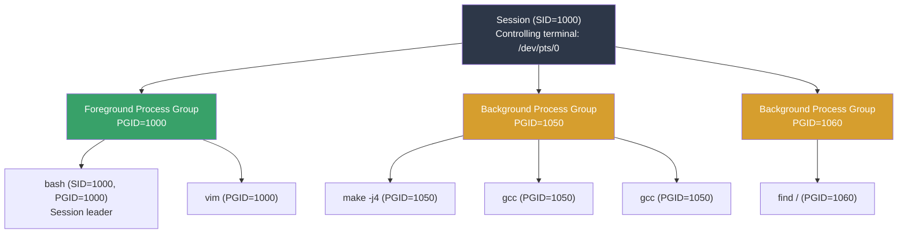
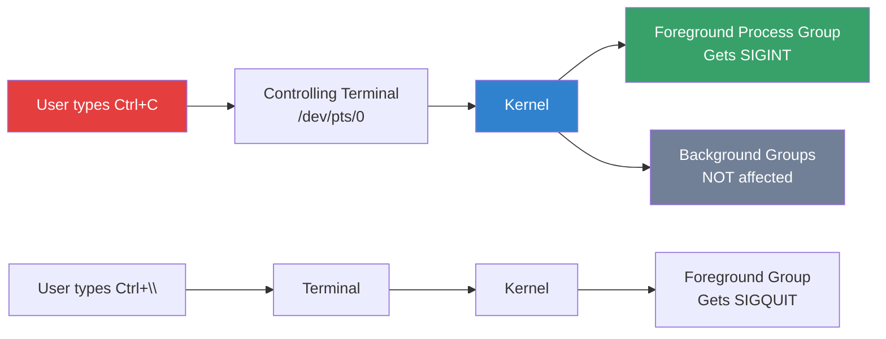
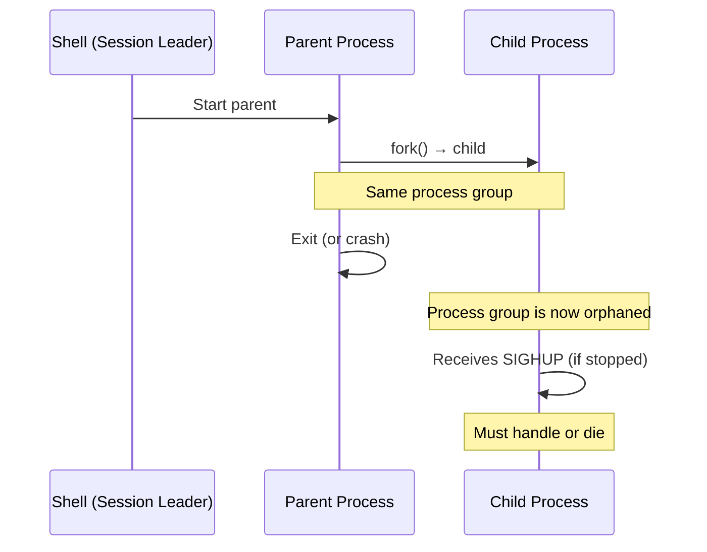
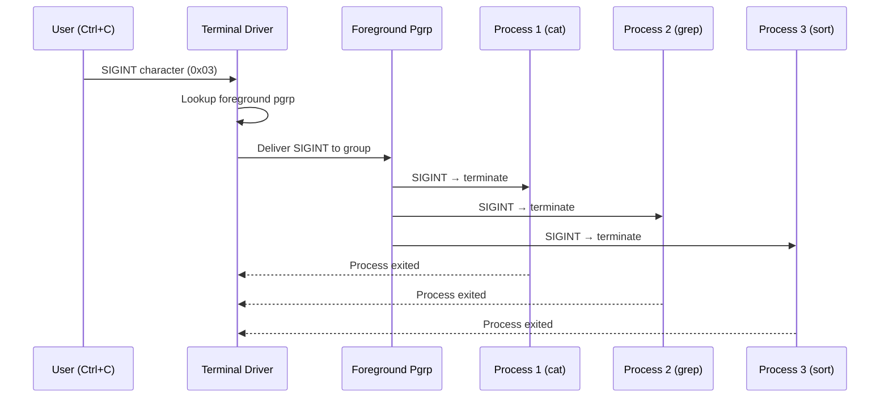

# Process Groups, Sessions, and Job Control

## Introduction

Unix process groups and sessions are the mechanisms that underpin **job control**—the ability to suspend, resume, and manage multiple commands from a single terminal. Every process belongs to a process group, and every process group belongs to a session. These relationships determine which processes receive signals like `SIGINT` (Ctrl+C) and `SIGTSTP` (Ctrl+Z), and which process "owns" a terminal.

Understanding process groups is essential for:
- Shell job control (fg, bg, jobs, Ctrl+Z)
- Daemon processes that need to detach from terminals
- Signal delivery (which processes get interrupted)
- Container and process management

## Sessions

A **session** is a collection of process groups, typically associated with a login terminal. A session is created when a user logs in, and the session leader is usually the login shell.

### Session Structure



### Session System Calls

```c
#include <unistd.h>

/* Get session ID of a process */
pid_t getsid(pid_t pid);

/* Create a new session (caller becomes session leader) */
pid_t setsid(void);

/* Returns 0 on success, fails if caller is a process group leader */
```

**Key rules:**
- A session has exactly one **controlling terminal** (or none for daemons)
- A session has at most one **foreground process group**
- The session leader is the process that called `setsid()`
- If the session leader dies, all processes in the session receive `SIGHUP`

### Creating a New Session (Daemonization)

```c
#include <unistd.h>
#include <sys/types.h>
#include <sys/stat.h>
#include <fcntl.h>

int daemonize(void) {
    pid_t pid;
    
    /* Fork and exit parent */
    pid = fork();
    if (pid < 0) return -1;
    if (pid > 0) _exit(0);  /* Parent exits */
    
    /* Create new session — detach from terminal */
    if (setsid() < 0) return -1;
    
    /* Fork again to prevent acquiring a controlling terminal */
    pid = fork();
    if (pid < 0) return -1;
    if (pid > 0) _exit(0);
    
    /* Close standard file descriptors */
    close(STDIN_FILENO);
    close(STDOUT_FILENO);
    close(STDERR_FILENO);
    
    /* Redirect to /dev/null */
    open("/dev/null", O_RDONLY);  /* stdin  */
    open("/dev/null", O_WRONLY);  /* stdout */
    open("/dev/null", O_WRONLY);  /* stderr */
    
    /* Set working directory */
    chdir("/");
    
    /* Reset umask */
    umask(0);
    
    return 0;
}
```

```bash
# Modern approach: use systemd instead of manual daemonization
# systemd handles all session/terminal management automatically
```

## Process Groups

A **process group** is a set of one or more processes, typically the processes created by a single shell pipeline. The first process in the group is the **process group leader**, and its PID becomes the **process group ID (PGID)**.

### Process Group Operations

```c
#include <unistd.h>

/* Get process group ID */
pid_t getpgrp(void);                  /* Of calling process */
pid_t getpgid(pid_t pid);            /* Of specified process */

/* Set process group ID */
int setpgid(pid_t pid, pid_t pgid);  /* Move process to group */
int setpgrp(void);                    /* Equivalent to setpgid(0, 0) */
```

### Shell Pipeline Example

```bash
# This pipeline creates a single process group
cat file.txt | grep pattern | sort | head -10

# All four processes share the same PGID (the PID of 'cat')
ps -eo pid,pgid,comm | grep -E "cat|grep|sort|head"
#   PID  PGID COMMAND
#  5001  5001 cat
#  5002  5001 grep
#  5003  5001 sort
#  5004  5001 head
```

### Verifying Process Groups

```bash
# Show process group and session info
ps -eo pid,pgid,sid,tty,comm | head -10
#   PID  PGID   SID TT       COMMAND
#     1     1     1 ?        systemd
#   456   456   456 ?        sshd
#   789   789   789 pts/0    bash
#  1024  1024   789 pts/0    vim
#  2048  2048   789 pts/0    make

# Show session leader
ps -eo pid,sid,comm | awk '$1 == $2 {print "Session leader:", $0}'
# Session leader:     1     1 systemd
# Session leader:   789   789 bash

# Check which process groups exist
ps -eo pgid --no-headers | sort -un
```

## Controlling Terminal

The **controlling terminal** is the terminal device associated with a session. It's the mechanism through which the user sends signals to foreground and background processes.

### Terminal and Signal Delivery



### Signals from the Terminal

| Key | Signal | Action | Target |
|-----|--------|--------|--------|
| Ctrl+C | `SIGINT` | Interrupt | Foreground process group |
| Ctrl+\\ | `SIGQUIT` | Quit + core dump | Foreground process group |
| Ctrl+Z | `SIGTSTP` | Suspend | Foreground process group |
| Ctrl+Y | `SIGTSTP` | Suspend on read | Foreground process group |
| `kill -SIGINT -PGID` | `SIGINT` | Interrupt | Specific process group |

```bash
# Send signal to entire process group (negative PID)
kill -INT -2048     # Send SIGINT to PGID 2048 and all members
kill -TERM -- -2048 # Same with explicit --

# Background process that still reads terminal
cat &
# [1]+ Stopped    cat
# It stopped because it tried to read from terminal
# Background processes that don't read terminal continue running
```

## Job Control

Job control is the shell feature that lets you manage multiple commands interactively. It relies entirely on process groups and sessions.

### Shell Job Control Commands

```bash
# Run in background
./long_running_job &
# [1] 12345

# List jobs
jobs
# [1]+  Running    ./long_running_job &
# [2]-  Stopped    vim

# Bring to foreground
fg %1
# Brings job 1 to foreground, sends SIGCONT

# Send to background
bg %2
# Resumes job 2 in background

# Suspend current foreground (Ctrl+Z)
# Then:
bg              # Resume in background
fg              # Bring back to foreground

# Job specifications
%1              # Job number 1
%+ or %%        # Current job (most recently bg/fg'd)
%-              # Previous job
%string         # Job whose command starts with "string"
%?string        # Job whose command contains "string"
```

### Job Control Internals

```bash
# Behind the scenes of "cat file | grep pattern &"

# 1. Shell creates a new process group
setpgid(0, 0)  # cat becomes process group leader

# 2. Pipeline processes join the group
setpgid(pid_grep, pgid_cat)

# 3. For foreground job: shell gives terminal to the group
tcsetpgrp(terminal_fd, pgid_cat)

# 4. For background job: shell keeps terminal
#    Background group can't read from terminal

# 5. When foreground job exits/is suspended:
tcsetpgrp(terminal_fd, shell_pgid)  # Shell takes terminal back
```

### Job Control in Practice

```bash
# Multiple background jobs
$ sleep 300 &
[1] 1001
$ sleep 400 &
[2] 1002
$ sleep 500 &
[3] 1003

# View jobs
$ jobs -l
[1]  1001 Running    sleep 300 &
[2]- 1002 Running    sleep 400 &
[3]+ 1003 Running    sleep 500 &

# Kill a background job
$ kill %2
[2]-  Terminated  sleep 400

# Disown: detach job from shell (won't get SIGHUP on logout)
$ disown %1
# Job 1 now survives shell exit

# nohup: similar effect
$ nohup ./long_job &
# Redirects output to nohup.out, ignores SIGHUP
```

## Process Group and Session Inspection

### Using `/proc`

```bash
# Detailed process info from /proc
cat /proc/1234/status | grep -E "^(Pid|PPid|Tgid|TracerPid|NSpgid|NStgid)"
# Pid:    1234
# PPid:   789
# Tgid:   1234
# TracerPid:  0

# Session and process group
cat /proc/1234/stat | awk '{print "PGID:", $5, "SID:", $6}'
# PGID: 1234 SID: 789

# Controlling terminal
cat /proc/1234/stat | awk '{print "TTY:", $7}'
# TTY: 34816  (major 136, minor 0 = /dev/pts/0)
```

### Using `ps` for Complete View

```bash
# Full process hierarchy with groups and sessions
ps -eo pid,ppid,pgid,sid,tty,stat,comm --forest
#   PID  PPID  PGID   SID TT       STAT COMMAND
#     1     0     1     1 ?        Ss   systemd
#   456     1   456   456 ?        Ss   sshd
#   789   456   789   789 pts/0    Ss   bash
#  1024   789  1024   789 pts/0    T    vim
#  2048   789  2048   789 pts/0    Sl   make
#  2049  2048  2048   789 pts/0    S    gcc
#  2050  2048  2048   789 pts/0    S    gcc

# State codes:
# Ss = session leader, sleeping
# T  = stopped (traced or Ctrl+Z)
# Sl = sleeping, multi-threaded
```

## Orphaned Process Groups

When a process group's parent exits, the process group becomes **orphaned**. The kernel sends `SIGHUP` to orphaned process groups that have stopped members:



```c
/* Demonstrate orphaned process group */
#include <unistd.h>
#include <signal.h>
#include <stdio.h>

void sighup_handler(int sig) {
    printf("Received SIGHUP — process group orphaned!\n");
}

int main() {
    signal(SIGHUP, sighup_handler);
    
    if (fork() == 0) {
        /* Child: pause and wait for signals */
        printf("Child PID=%d, PGID=%d\n", getpid(), getpgrp());
        pause();
    } else {
        /* Parent exits immediately, orphaning the child's process group */
        _exit(0);
    }
    return 0;
}
```

## Daemon Process Management

### The Classic Daemon Double-Fork

```bash
# Modern daemon approach with systemd (preferred)
# /etc/systemd/system/mydaemon.service
[Unit]
Description=My Daemon
After=network.target

[Service]
Type=forking
ExecStart=/usr/bin/mydaemon
PIDFile=/var/run/mydaemon.pid
Restart=on-failure

[Install]
WantedBy=multi-user.target

# The double-fork pattern in shell
daemonize() {
    (
        # First fork
        if fork; then exit 0; fi
        
        # New session (detach from terminal)
        setsid
        
        # Second fork (prevent re-acquiring terminal)
        if fork; then exit 0; fi
        
        # Redirect I/O
        exec > /var/log/mydaemon.log 2>&1
        exec < /dev/null
        
        # Run the actual daemon
        exec "$@"
    )
}
```

### Detecting Detached Processes

```bash
# Find processes with no controlling terminal (TT = ?)
ps -eo pid,sid,tty,comm | awk '$3 == "?" {print}'
#   PID   SID TT       COMMAND
#     1     1 ?        systemd
#   456   456 ?        sshd
#   890   890 ?        dockerd

# Find session leaders
ps -eo pid,sid,comm | awk '$1 == $2 {print "Leader:", $0}'

# Find orphaned processes (parent is init/systemd)
ps -eo pid,ppid,comm | awk '$2 == 1 {print "Orphan:", $0}'
```

## Advanced: Process Groups and `tcsetpgrp()`

```c
#include <unistd.h>
#include <fcntl.h>

/* tcsetpgrp sets the foreground process group of a terminal */
int tcsetpgrp(int fd, pid_t pgrp);

/* tcgetpgrp gets the foreground process group */
pid_t tcgetpgrp(int fd);

/* Example: custom shell-like job control */
int terminal_fd = open("/dev/tty", O_RDWR);

/* Give terminal to job */
pid_t job_pgid = 1234;
tcsetpgrp(terminal_fd, job_pgid);

/* Wait for job to finish or suspend */
waitpid(-job_pgid, &status, WUNTRACED);

/* Take terminal back */
tcsetpgrp(terminal_fd, getpgrp());
```

## setpgid() Race Condition Prevention

When a shell creates a pipeline (e.g., `cat | grep`), there's a race
between the parent calling `setpgid()` and the child starting. The
kernel handles this:

```c
/* kernel/sys.c — setpgid() implementation */
SYSCALL_DEFINE2(setpgid, pid_t, pid, pid_t, pgid)
{
    struct task_struct *p;
    struct pid *pgrp;
    int err = -EINVAL;

    if (!pid)
        pid = task_pid_vnr(current);
    if (!pgid)
        pgid = pid;
    if (pgid < 0)
        return -EINVAL;

    rcu_read_lock();
    p = find_task_by_vpid(pid);
    if (!p) {
        rcu_read_unlock();
        return -ESRCH;
    }

    /* Permission check: can only set own pgid or child's */
    if (p->real_parent == current ||
        p->real_parent->tgid == current->tgid) {
        /* ... additional checks ... */

        /* Only if child hasn't done exec() yet */
        if (task_session_vnr(p) != task_session_vnr(current))
            err = -EPERM;
        else if (pid == task_pid_vnr(current) &&
                 pgid != pid &&
                 !session_of_pgrp(pgrp))
            err = -EPERM;
        /* ... */
    }
    rcu_read_unlock();
    return err;
}
```

### Shell's Double-Setpgid Pattern

```c
/* Parent (shell) creates child */
pid_t pid = fork();
if (pid == 0) {
    /* Child: set own pgid (may race with parent's setpgid) */
    setpgid(0, target_pgid);
    execvp(...);
} else {
    /* Parent: also set child's pgid (guarantees one succeeds) */
    setpgid(pid, target_pgid);
}
```

Both parent and child call `setpgid()` to avoid a race where the child
executes before the parent sets its group. The kernel serializes both
calls via `tasklist_lock`.

---

## Kernel Process Group Data Structures

```c
/* include/linux/sched/signal.h */
struct signal_struct {
    /* Session and process group information */
    struct pid *leader_pid;        /* Session leader PID */
    struct pid *tty_old_pgrp;     /* Previous foreground pgrp */
    struct tty_struct *tty;        /* Controlling terminal */
    /* ... */
};

struct pid {
    refcount_t count;
    unsigned int level;            /* PID namespace level */
    /* One struct hlist_head per PID type */
    struct hlist_head tasks[PIDTYPE_MAX];
    struct rcu_head rcu;
    struct upid numbers[];         /* One per namespace level */
};

/* PID types relevant to process groups */
enum pid_type {
    PIDTYPE_PID,      /* Process ID */
    PIDTYPE_TGID,     /* Thread group ID */
    PIDTYPE_PGID,     /* Process group ID */
    PIDTYPE_SID,      /* Session ID */
    PIDTYPE_MAX
};
```

### Session and Group Lookup

```c
/* kernel/pid.c — looking up process groups */
struct pid *task_pgrp(struct task_struct *task)
{
    return task->signal->pids[PIDTYPE_PGID];
}

struct pid *task_session(struct task_struct *task)
{
    return task->signal->pids[PIDTYPE_SID];
}

/* Get the task_struct of the session leader */
struct task_struct *session_of_pgrp(struct pid *pgrp)
{
    struct task_struct *task;
    /* ... find session leader via pgrp->tasks[PIDTYPE_SID] ... */
    return task;
}
```

---

## Terminal Signal Delivery Internals

When a terminal key generates a signal (e.g., Ctrl+C), the kernel
delivers it to the entire foreground process group:

```c
/* drivers/tty/tty_jobctrl.c */
void tty_signal_session_leader(struct tty_struct *tty, int sig)
{
    struct task_struct *p;
    struct pid *session;

    session = tty->session;
    if (!session)
        return;

    /* Send signal to session leader */
    p = pid_task(session, PIDTYPE_PID);
    if (p)
        group_send_sig_info(sig, SEND_SIG_PRIV, p, PIDTYPE_TGID);
}

/* Send signal to foreground process group */
int tty_send_xchar(struct tty_struct *tty, char ch)
{
    /* ... sends character to foreground pgrp ... */
}

static int tiocspgrp(struct tty_struct *tty, pid_t __user *p)
{
    /* tcsetpgrp() implementation */
    /* Sets the foreground process group for the terminal */
}
```

### Signal Delivery Sequence



---

## /proc Session and Process Group Info

### Detailed /proc Fields

```bash
# Full /proc/PID/stat fields (relevant to groups)
$ cat /proc/1234/stat
# Field 5 (pgrp): Process group ID
# Field 6 (session): Session ID
# Field 7 (tty_nr): Controlling terminal (device number)
# Field 8 (tpgid): Foreground process group ID

# Extract specific fields
$ awk '{print "PGID:", $5, "SID:", $6, "TTY:", $7, "FGPGRP:", $8}' /proc/1234/stat
# PGID: 1234 SID: 789 TTY: 34816 FGPGRP: 1234

# Decode TTY device number
$ awk '{printf "TTY: %d:%d\n", rshift($7,8), and($7,255)}' /proc/1234/stat
# TTY: 136:0  (= /dev/pts/0)

# Namespace-aware session info
$ cat /proc/1234/status | grep -E '^(NSpgid|NStgid|NSsid|NSpid)'
# NStgid: 1234
# NSpid:  1234
# NSpgid: 1234
# NSsid:  789
```

### Finding All Members of a Process Group

```bash
# Find all processes in PGID 1234
$ ps -eo pid,pgid,comm | awk '$2 == 1234'
#  PID  PGID COMMAND
# 1234  1234 bash
# 1235  1234 cat
# 1236  1234 grep

# Find all process groups in a session
$ ps -eo pid,pgid,sid,comm | awk '$3 == 789' | sort -k2 -n
#  PID  PGID   SID COMMAND
#  789   789   789 bash
# 1024   789   789 vim
# 2048  2048   789 make
# 2049  2048   789 gcc
```

### Counting Process Groups and Sessions

```bash
# Count unique process groups
$ ps -eo pgid --no-headers | sort -un | wc -l
# 42

# Count unique sessions
$ ps -eo sid --no-headers | sort -un | wc -l
# 15

# Find session leaders
$ ps -eo pid,sid,comm | awk '$1 == $2' | head -5
# Session leaders: PID == SID

# Find process group leaders
$ ps -eo pid,pgid,comm | awk '$1 == $2' | head -5
# Group leaders: PID == PGID
```

---

## Zombie Processes and wait()

When a process exits, it becomes a zombie until its parent calls
`wait()`. Process groups affect which processes get notified:

```c
/* include/linux/wait.h — waitpid options */
#define WNOHANG     0x00000001  /* Don't block */
#define WUNTRACED   0x00000002  /* Report stopped children */
#define WCONTINUED  0x00000004  /* Report continued children */
#define WEXITED     0x00000008  /* Report exited children (waitid) */
#define __WNOTHREAD 0x20000000  /* Don't wait on children of other threads */

/* waitpid(-pgid, ...) waits for any child in the process group */
pid_t pid = waitpid(-pgid, &status, WUNTRACED);
```

### Zombie Cleanup on Process Group Exit

```c
/* kernel/exit.c — exit_notify() */
static void exit_notify(struct task_struct *tsk, int group_dead)
{
    /* ... */

    /* If we're the last in our process group, notify parent */
    if (group_dead && tsk->signal->notify_count < 0) {
        /* Wake parent with __WALL */
        wake_up_process(tsk->real_parent);
    }

    /* ... */
}
```

---

## Nohup and Disown Internals

### nohup

```c
/* nohup.c — what nohup does internally */
int main(int argc, char *argv[])
{
    /* Ignore SIGHUP */
    signal(SIGHUP, SIG_IGN);

    /* Redirect stdout to nohup.out if it's a terminal */
    if (isatty(STDOUT_FILENO)) {
        int fd = open("nohup.out", O_WRONLY | O_CREAT | O_APPEND, 0644);
        dup2(fd, STDOUT_FILENO);
    }

    execvp(argv[1], argv + 1);
    return 1;
}
```

### disown (shell builtin)

When you `disown %1`:
1. Shell removes the job from its job table
2. Child process's SIGHUP handler remains default (terminate)
3. But shell won't send SIGHUP to the child on exit
4. Child becomes orphan → adopted by init/systemd

```bash
# View disowned processes
$ ps -eo pid,ppid,sid,tty,comm | awk '$3 == 1 || $2 == 1'
# Shows processes adopted by init (orphaned)
```

---

## References

- [The Linux Kernel Documentation](https://docs.kernel.org/)
- [LWN.net - Linux and free software news](https://lwn.net/)
- [GNU Project Documentation](https://www.gnu.org/doc/doc.html)
- [GNU Manuals](https://www.gnu.org/manual/manual.html)
- [Free Software Directory](https://directory.fsf.org/wiki/Main_Page)
- [Planet GNU](https://planet.gnu.org/)
- [Free Software Books](https://www.gnu.org/doc/other-free-books.html)

- [credentials(7) man page](https://man7.org/linux/man-pages/man7/credentials.7.html) — Process IDs and groups
- [session leader in Linux](https://man7.org/linux/man-pages/man2/setsid.2.html) — Session management
- [tcsetpgrp(3) man page](https://man7.org/linux/man-pages/man3/tcsetpgrp.3.html) — Terminal control
- [The Linux Programming Interface](https://man7.org/tlpi/) — Comprehensive coverage of sessions and process groups
- [GNU libc manual: Job Control](https://www.gnu.org/software/libc/manual/html_node/Job-Control.html)

## Related Topics

- [Namespaces](./namespaces.md) — PID namespace isolation extends process groups
- [Cgroups](./cgroups.md) — Process grouping for resource control
- [Process Management](../../admin/process-management.md) — Administrative tools
- [Process Priorities](./priorities.md) — Scheduling priority
