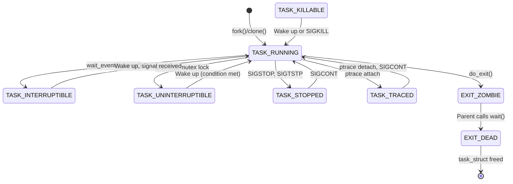

# Process States

## Introduction

Every process in Linux exists in one of several **states** at any given time. The state determines what the scheduler can do with the process — whether it can be run, must wait for an event, or is being terminated. Understanding process states is essential for debugging (interpreting `ps` output), performance analysis (identifying blocked processes), and kernel development (knowing when state transitions occur).

The state is stored in the `state` field of `task_struct`:

```c
/* include/linux/sched.h */
struct task_struct {
    /* -1 unrunnable, 0 runnable, >0 stopped */
    volatile long __state;
    /* ... */
};
```

## The States

### TASK_RUNNING (0)

A task in `TASK_RUNNING` state is either:
- **Currently executing** on a CPU, or
- **On the run queue** (ready to run, waiting for a CPU)

This is the only state where a task can actually execute. All runnable tasks are in this state.

```c
/* include/linux/sched.h */
#define TASK_RUNNING            0x0000
```

**Key insight**: `TASK_RUNNING` doesn't mean the task is actually using the CPU — it means the task is *ready* to use it. On a 4-core system with 8 runnable tasks, 4 are on CPUs and 4 are waiting in the run queue, but all 8 are in `TASK_RUNNING`.

```bash
# TASK_RUNNING shows as 'R' in ps
$ ps -eo pid,stat,comm | grep R
  PID STAT COMMAND
    1 Ss   systemd
  500 Ss   bash
  600 R    gcc        ← Currently running or on run queue
  601 R+   stress-ng  ← Running, foreground process
```

### TASK_INTERRUPTIBLE (1)

A task in `TASK_INTERRUPTIBLE` state is **sleeping**, waiting for some condition to become true (e.g., I/O completion, timer expiry, signal arrival). It can be woken by:
- The condition becoming true
- Receiving a signal

```c
#define TASK_INTERRUPTIBLE      0x0001
```

**When a task enters this state**:
- Waiting for I/O (`read()`, `write()`, `select()`, `poll()`)
- Waiting on a condition variable or semaphore
- Sleeping (`sleep()`, `nanosleep()`)
- Waiting for a child process (`wait()`)

```bash
# TASK_INTERRUPTIBLE shows as 'S' in ps
$ ps -eo pid,stat,comm | grep S
  PID STAT COMMAND
    1 Ss   systemd     ← Sleeping, interruptible
  500 Ss   bash        ← Waiting for input
  700 S    sshd        ← Waiting for connection
```

```c
/* Example: sleeping in kernel */
static ssize_t my_read(struct file *file, char __user *buf,
                        size_t count, loff_t *ppos)
{
    struct my_device *dev = file->private_data;

    /* Set state to TASK_INTERRUPTIBLE */
    set_current_state(TASK_INTERRUPTIBLE);

    /* Wait for data */
    while (!data_available(dev)) {
        /* Check for signals */
        if (signal_pending(current))
            return -ERESTARTSYS;

        /* Sleep until woken or signal */
        schedule();
        set_current_state(TASK_INTERRUPTIBLE);
    }

    /* We have data, set state back to TASK_RUNNING */
    set_current_state(TASK_RUNNING);

    /* Read data */
    return read_data(dev, buf, count);
}
```

### TASK_UNINTERRUPTIBLE (2)

A task in `TASK_UNINTERRUPTIBLE` state is sleeping but **cannot be interrupted by signals**. It's used when the task must wait for a condition that will happen very soon, and waking up for a signal would be counterproductive.

```c
#define TASK_UNINTERRUPTIBLE    0x0002
```

**When a task enters this state**:
- Disk I/O (waiting for hardware completion)
- Some locks (mutexes in certain configurations)
- Memory page faults (waiting for page to be read from disk)

```bash
# TASK_UNINTERRUPTIBLE shows as 'D' in ps
$ ps -eo pid,stat,comm | grep D
  PID STAT COMMAND
  800 D    dd          ← Waiting for disk I/O
  801 D+   sync        ← Flushing filesystem buffers
```

**D state problems**: A process stuck in `TASK_UNINTERRUPTIBLE` for too long is a common source of system hangs. This can happen with:
- Unresponsive NFS servers (NFS mounts with `hard` option)
- Stuck storage devices
- Deadlocked kernel code

```bash
# Find processes stuck in D state
$ ps aux | awk '$8 ~ /D/'
root  800  0.0  0.0  0  0 ?  D  10:00  0:00 [kworker]

# Check for blocked processes
$ cat /proc/$PID/status | grep State
State:  D (disk sleep)

# View blocked process stack
$ cat /proc/$PID/stack
[<0>] call_rwsem_down_read_slowpath+0x123/0x456
[<0>] __do_fault+0x78/0x340
[<0>] handle_mm_fault+0x123/0x456
```

### TASK_STOPPED (4)

A task in `TASK_STOPPED` state has been stopped by a signal (`SIGSTOP`, `SIGTSTP`, `SIGTTIN`, `SIGTTOU`). It can only be continued by `SIGCONT`.

```c
#define TASK_STOPPED            0x0004
```

```bash
# Stop a process
$ kill -STOP 1234

# TASK_STOPPED shows as 'T' in ps
$ ps -eo pid,stat,comm | grep T
  PID STAT COMMAND
 1234 T    myapp       ← Stopped by signal

# Continue the process
$ kill -CONT 1234
```

### TASK_TRACED (8)

A task in `TASK_TRACED` state is being traced by a debugger (ptrace). It's similar to `TASK_STOPPED` but indicates the stop is due to a ptrace event.

```c
#define TASK_TRACED             0x0008
```

```bash
# Traced processes show as 't' in ps
$ ps -eo pid,stat,comm | grep t
  PID STAT COMMAND
 1234 t+   myapp       ← Traced by debugger
```

### EXIT_ZOMBIE (32) / EXIT_DEAD (128)

```c
#define EXIT_ZOMBIE             0x0020
#define EXIT_DEAD               0x0080
```

**Zombie** (`EXIT_ZOMBIE`): A process that has exited but whose parent hasn't called `wait()` yet. The kernel retains the `task_struct` so the parent can read the exit status.

**EXIT_DEAD**: The final state — the parent has called `wait()`, and the `task_struct` is about to be freed.

```bash
# Zombie processes show as 'Z' in ps
$ ps -eo pid,stat,comm | grep Z
  PID STAT COMMAND
 1234 Z    myapp       ← Zombie (parent hasn't waited)

# Find zombies
$ ps aux | awk '$8 ~ /Z/'
```

```c
/* How a process becomes a zombie */
/* kernel/exit.c */
void __noreturn do_exit(long code)
{
    /* ... cleanup ... */

    /* Notify parent */
    exit_notify(tsk, group_dead);

    /* Become a zombie */
    tsk->exit_state = EXIT_ZOMBIE;

    /* Wait for parent to call wait() */
    do_task_dead();
}
```

## Extended States

### __TASK_KILLABLE

A combination of `TASK_UNINTERRUPTIBLE` and a fatal signal check:

```c
#define TASK_KILLABLE           (TASK_WAKEKILL | TASK_UNINTERRUPTIBLE)
#define TASK_WAKEKILL           0x0020
```

A task in `TASK_KILLABLE` is uninterruptible except for fatal signals (`SIGKILL`). This is used for operations that must complete but shouldn't make the system unkillable:

```c
/* Waiting for I/O that can be interrupted by SIGKILL */
long io_schedule_killable(void)
{
    set_current_state(TASK_KILLABLE);
    return io_schedule();
}
```

### TASK_IDLE

```c
#define TASK_IDLE               0x0002  /* Same as TASK_UNINTERRUPTIBLE in older kernels */
```

Used for idle tasks that shouldn't contribute to load average:

```bash
# Idle tasks show in kernel log
$ dmesg | grep "idle"
```

### TASK_PARKED / TASK_NOLOAD

```c
#define TASK_PARKED             0x0040
#define TASK_NOLOAD             0x0400
```

- `TASK_PARKED`: Used for parked kernel threads
- `TASK_NOLOAD`: Task doesn't count toward load average

## State Transitions

### Complete State Diagram



### Transition Code

The state is set using helper functions:

```c
/* include/linux/sched.h */

/* Set state (memory barrier ensures visibility) */
#define set_current_state(state_value)                      \
    do {                                                    \
        debug_normal_state_change(state_value);             \
        smp_store_mb(current->__state, (state_value));      \
    } while (0)

/* Set state without memory barrier (faster, use when already protected) */
#define __set_current_state(state_value)                    \
    do {                                                    \
        debug_normal_state_change(state_value);             \
        current->__state = (state_value);                   \
    } while (0)

/* Special version for TASK_RUNNING (no barrier needed) */
#define __set_task_state(tsk, state_value)                  \
    do {                                                    \
        debug_task_state_change((tsk), (state_value));      \
        (tsk)->__state = (state_value);                     \
    } while (0)
```

### The Wait Queue Pattern

Wait queues are the standard mechanism for sleeping and waking:

```c
/* include/linux/wait.h */
struct wait_queue_head {
    spinlock_t lock;
    struct list_head task_list;
};

/* Typical wait queue usage */
DECLARE_WAIT_QUEUE_HEAD(my_wq);
int data_ready = 0;

/* Producer (waker) */
void produce_data(void) {
    data_ready = 1;
    wake_up_interruptible(&my_wq);
}

/* Consumer (waiter) */
int consume_data(void) {
    wait_event_interruptible(my_wq, data_ready);
    if (signal_pending(current))
        return -ERESTARTSYS;

    data_ready = 0;
    return 0;
}
```

### Wait Queue Internals

```c
/* kernel/sched/wait.c */
int __wait_event_interruptible(struct wait_queue_head *wq_head,
                                int condition)
{
    int ret = 0;
    DEFINE_WAIT(wait);

    for (;;) {
        prepare_to_wait(&wq_head, &wait, TASK_INTERRUPTIBLE);
        if (condition)
            break;
        if (!signal_pending(current)) {
            schedule();
            continue;
        }
        ret = -ERESTARTSYS;
        break;
    }
    finish_wait(&wq_head, &wait);
    return ret;
}

void prepare_to_wait(struct wait_queue_head *wq_head,
                     struct wait_queue_entry *wq_entry, int state)
{
    unsigned long flags;

    wq_entry->flags &= ~WQ_FLAG_EXCLUSIVE;
    spin_lock_irqsave(&wq_head->lock, flags);
    if (list_empty(&wq_entry->entry))
        __add_wait_queue(wq_head, wq_entry);
    set_current_state(state);
    spin_unlock_irqrestore(&wq_head->lock, flags);
}
```

## Load Average and Process States

### How Load Average Is Calculated

The Linux load average counts tasks in `TASK_RUNNING` and `TASK_UNINTERRUPTIBLE`:

```c
/* kernel/sched/core.c */
void calc_global_load(void)
{
    /* Count runnable tasks + uninterruptible tasks */
    long nr_active = atomic_long_read(&calc_load_tasks);

    /* Exponential moving average */
    avenrun[0] = calc_load(avenrun[0], EXP_1, nr_active);
    avenrun[1] = calc_load(avenrun[1], EXP_5, nr_active);
    avenrun[2] = calc_load(avenrun[2], EXP_15, nr_active);
}
```

```bash
$ cat /proc/loadavg
0.50 0.40 0.35 2/500 12345
# ^^^^^^^^^^^^^^^^^  ^^^  ^^^^^
# 1min 5min 15min   2 running / 500 total  PID
```

**Implication**: Tasks stuck in `TASK_UNINTERRUPTIBLE` (D state) increase the load average, even though they're not using the CPU. This is why a system with stuck NFS mounts shows high load.

## Process State Inspection

```bash
# Detailed state information
$ cat /proc/$PID/status
Name:   myapp
State:  S (sleeping)
Tgid:   1234
Pid:    1234
PPid:   500

# State field in /proc/PID/stat
$ cat /proc/$PID/stat | awk '{print $3}'
S

# Symbol table for states
# R = TASK_RUNNING
# S = TASK_INTERRUPTIBLE
# D = TASK_UNINTERRUPTIBLE (disk sleep)
# T = TASK_STOPPED
# t = TASK_TRACED
# Z = EXIT_ZOMBIE
# X = EXIT_DEAD
# x = TASK_DEAD (old)
# K = TASK_WAKEKILL
# W = TASK_WAKING
# P = TASK_PARKED
```

### Process State Monitoring Script

```bash
#!/bin/bash
# Monitor process states over time
# Usage: ./monitor-states.sh [interval] [count]

INTERVAL=${1:-1}
COUNT=${2:-60}

echo "Timestamp R S D T Z Total LoadAvg"
for i in $(seq 1 $COUNT); do
    TS=$(date +%H:%M:%S)
    R=$(ps -eo stat | grep -c '^R ')
    S=$(ps -eo stat | grep -c '^S ')
    D=$(ps -eo stat | grep -c '^D ')
    T=$(ps -eo stat | grep -c '^T ')
    Z=$(ps -eo stat | grep -c '^Z ')
    TOTAL=$((R + S + D + T + Z))
    LOAD=$(cat /proc/loadavg | awk '{print $1}')
    echo "$TS $R $S $D $T $Z $TOTAL $LOAD"
    sleep $INTERVAL
done
```

### Interpreting /proc/PID/stat Fields

```bash
# /proc/PID/stat has 52 fields. Key ones:
# Field 1: PID
# Field 2: Comm (process name in parentheses)
# Field 3: State (R/S/D/T/Z/X)
# Field 4: PPID
# Field 5: PGRP (process group)
# Field 6: Session
# Field 7: TTY (controlling terminal)
# Field 8: TPGID (foreground process group)
# Field 9: Flags
# Field 10: Minflt (minor faults)
# Field 11: Cminflt
# Field 12: Majflt (major faults)
# Field 13: Cmajflt
# Field 14: Utime (user mode ticks)
# Field 15: Stime (kernel mode ticks)
# Field 16: Cutime (children user ticks)
# Field 17: Cstime (children kernel ticks)
# Field 18: Priority
# Field 19: Nice
# Field 20: Num_threads
# Field 22: Starttime (ticks since boot)
# Field 23: Vsize (virtual memory bytes)
# Field 24: RSS (resident set size pages)

cat /proc/$PID/stat | awk '{print "PID:"$1, "State:"$3, "PPID:"$4, "Threads:"$20, "RSS:"$24" pages"}'
```

## Kernel Thread States

Kernel threads (kthreads) use the same state model but with some differences:

```bash
# Kernel threads show in brackets
$ ps -eo pid,stat,comm | grep '\['
    2 S    [kthreadd]
    3 I<   [rcu_gp]
    4 I<   [rcu_par_gp]
    5 I<   [slub_flushwq]
    7 I<   [kworker/0:1H]
    8 I    [kworker/0:0]

# I = TASK_IDLE (kernel-only state, same as D but not counted in load)
# < = Priority < 0 (high priority kernel thread)

# Count kernel threads by state
$ ps -eo stat,comm | grep '\[' | awk '{print $1}' | sort | uniq -c
  12 I
   5 I<
   3 S
   1 S<
```

### Key Kernel Threads and Their States

| Thread | Typical State | Purpose |
|--------|---------------|----------|
| `[kthreadd]` | S | PID 2, parent of all kernel threads |
| `[rcu_gp]` | I | RCU grace period processing |
| `[kworker/*]` | I or S | Workqueue workers |
| `[ksoftirqd/*]` | I | Soft IRQ processing (per-CPU) |
| `[migration/*]` | S | CPU migration (per-CPU) |
| `[watchdog/*]` | S | Lockup detection (per-CPU) |
| `[kswapd0]` | I or S | Memory reclaim |
| `[jbd2/sda1-*]` | D | Journal commit (filesystem) |
| `[nfsd]` | S | NFS server daemon |
| `[md_raid1]` | I | Software RAID management |

## Cgroups and Process States

Control groups (cgroups) affect process scheduling and resource allocation:

```bash
# View cgroup membership
$ cat /proc/$PID/cgroup
0::/system.slice/nginx.service

# cgroup v2 CPU controller affects scheduling
# Processes in different cgroups get different CPU time
# But all use the same TASK_RUNNING / TASK_INTERRUPTIBLE states

# When a cgroup hits its CPU limit:
# - Processes are throttled (removed from run queue)
# - They appear as TASK_RUNNING but aren't executing
# - /proc/$PID/schedstat shows throttle time

# View CPU pressure from cgroups
cat /sys/fs/cgroup/system.slice/cpu.pressure
# some avg10=0.50 avg60=0.30 avg300=0.25 total=123456
# full avg10=0.00 avg60=0.00 avg300=0.00 total=0

# cgroup freezer can freeze processes
# Frozen processes stay in TASK_RUNNING but don't execute
# (Used by cgroup v1 freezer, cgroup v2 has freeze controller)
```

## Process States and Performance Analysis

### Identifying Performance Bottlenecks

```bash
# High D-state count = I/O bottleneck
$ ps aux | awk '$8 ~ /D/' | wc -l
15
# 15 processes waiting for I/O — check disk health

# High R-state count = CPU saturation
$ ps aux | awk '$8 ~ /R/' | wc -l
12
# 12 runnable processes on 4 cores = 3x oversubscription

# Correlate with load average
$ cat /proc/loadavg
12.50 8.30 5.20 4/800 12345
# Load 12.5 on 4 cores = heavy contention
# 4/800 = 4 runnable out of 800 total threads

# Use vmstat to see state transitions over time
$ vmstat 1 5
procs -----------memory---------- ---swap-- -----io---- -system-- ------cpu-----
 r  b   swpd   free   buff  cache   si   so    bi    bo   in   cs us sy id wa st
 4  2      0 512000  64000 2048000    0    0     8  1024  500 1000 30 10 50  8  2
 ^  ^
 |  +-- D-state (blocked on I/O)
 +---- R-state (runnable)
```

### D-State Deep Dive

```bash
# Find all D-state processes and their kernel stacks
for pid in $(ps -eo pid,stat | awk '$2 ~ /D/ {print $1}'); do
    echo "=== PID $pid ==="
    cat /proc/$pid/comm
    cat /proc/$pid/stack 2>/dev/null || echo "(no stack access)"
    echo
done

# Common D-state causes:
# 1. NFS: hung NFS server with 'hard' mount option
#    Check: mount | grep nfs
#    Fix: mount -o remount,soft /mnt/nfs

# 2. Storage: failing disk or RAID rebuild
#    Check: dmesg | grep -i 'error\|fail\|timeout'
#    Check: smartctl -a /dev/sda

# 3. Filesystem: journal commit blocked
#    Check: cat /proc/$PID/comm  (look for jbd2/*)
#    Check: iostat -x 1

# 4. Memory: page fault waiting for swap
#    Check: vmstat 1 (look at 'si' and 'so' columns)
#    Check: /proc/zoneinfo for low free pages

# 5. cgroup: frozen cgroup
#    Check: cat /proc/$PID/cgroup
#    Check: cat /sys/fs/cgroup/.../cgroup.freeze
```

## Real-World Scenarios

### Scenario 1: High Load Average Despite Low CPU Usage

```bash
$ uptime
 14:30:00 up 10 days, load average: 45.00, 30.00, 15.00
$ mpstat 1 3
%idle = 85%

# Diagnosis: Load is from D-state processes, not CPU
$ ps aux | awk '$8 ~ /D/' | wc -l
42

# Root cause: NFS server went down
$ dmesg | tail -5
[12345.678] nfs: server nfs.example.com not responding, timed out
[12345.679] nfs: task nfs_client can't get a RPC slot

# Fix: Restart NFS or switch to soft mount
$ umount -f /mnt/nfs
```

### Scenario 2: Zombie Process Accumulation

```bash
# Hundreds of zombies accumulating
$ ps aux | awk '$8 ~ /Z/' | wc -l
500

# Find the parent that's not reaping
$ ps -eo pid,ppid,stat,comm | awk '$3 ~ /Z/' | awk '{print $2}' | sort | uniq -c | sort -rn
    500 1234

# PID 1234 is the parent
$ ps -p 1234 -o pid,stat,comm
  PID STAT COMMAND
 1234 S    myapp

# Check if parent has SIGCHLD handler
$ cat /proc/1234/status | grep SigCgt
SigCgt: 0000000000000000
# Empty = not catching SIGCHLD = zombies accumulate

# Fix: Fix the parent program, or:
# Temporary: reparent zombies to init
$ kill 1234  # init (PID 1) will reap the zombies
```

### Scenario 3: Stopped Process Holding Resources

```bash
# A stopped process holds file locks and memory
$ ps -eo pid,stat,comm | grep T
 1234 T    myapp

# Check what resources it holds
$ ls -la /proc/1234/fd/ | wc -l
150  # 150 open file descriptors

$ cat /proc/1234/status | grep VmRSS
VmRSS: 2048000 kB  # 2 GB of RAM held

# If it was stopped by SIGSTOP, resume with SIGCONT
$ kill -CONT 1234

# If it's traced by a debugger, detach the debugger
$ gdb -p 1234 -batch -ex 'detach'
```

## Further Reading

- [The Linux Kernel Documentation](https://docs.kernel.org/)
- [GNU Project Documentation](https://www.gnu.org/doc/doc.html)
- [GNU Manuals](https://www.gnu.org/manual/manual.html)
- [Free Software Directory](https://directory.fsf.org/wiki/Main_Page)
- [Planet GNU](https://planet.gnu.org/)
- [Free Software Books](https://www.gnu.org/doc/other-free-books.html)

- [Linux kernel: include/linux/sched.h](https://elixir.bootlin.com/linux/latest/source/include/linux/sched.h)
- [Linux kernel: kernel/sched/core.c](https://elixir.bootlin.com/linux/latest/source/kernel/sched/core.c)
- [Linux man pages: proc(5)](https://man7.org/linux/man-pages/man5/proc.5.html)
- [Linux man pages: ps(1)](https://man7.org/linux/man-pages/man1/ps.1.html)
- [Understanding the Linux Kernel, 3rd Edition - Chapter 3: Processes](https://www.oreilly.com/library/view/understanding-the-linux/0596005652/)
- [LWN: The states of a process](https://lwn.net/Articles/102686/)

## Related Topics

- [Processes and Threads](processes-and-threads.md) — What a process is in Linux
- [task_struct Deep Dive](task-struct.md) — The `state` field and its meaning
- [Scheduler Overview](scheduler.md) — How the scheduler uses process states
- [Context Switching](context-switching.md) — What happens during state transitions
- [Signals](signals.md) — How signals interact with process states
