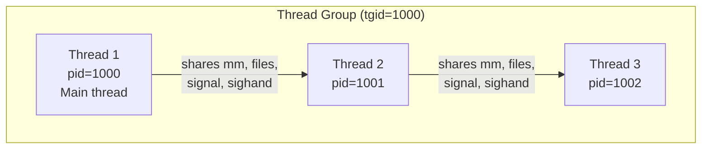
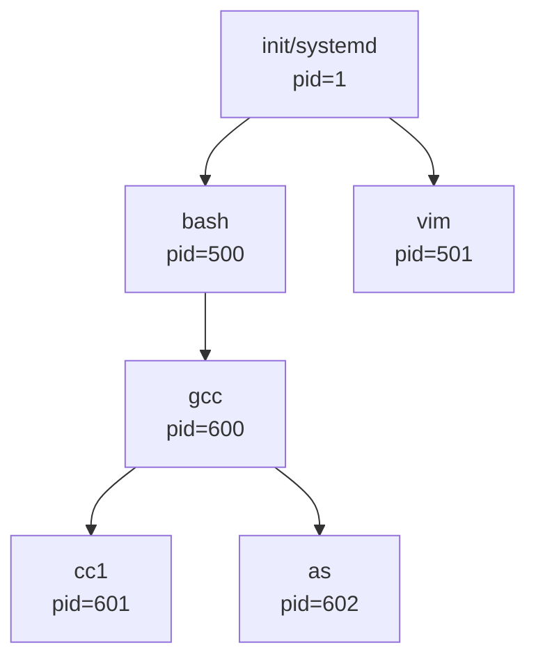
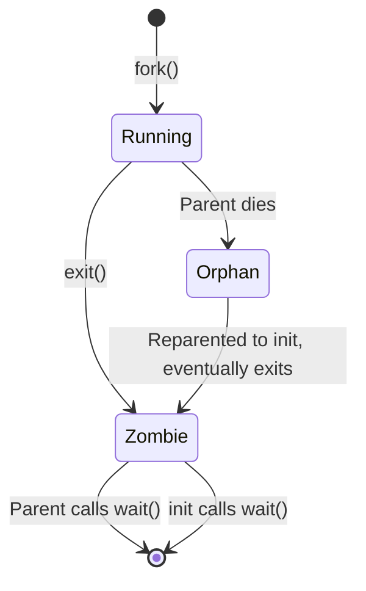
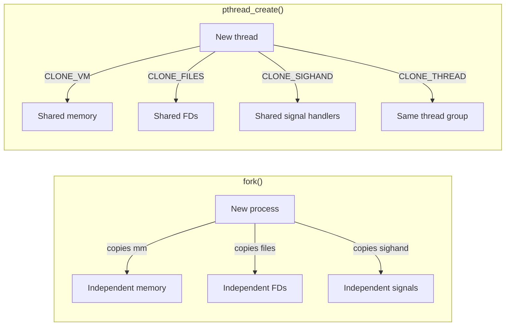
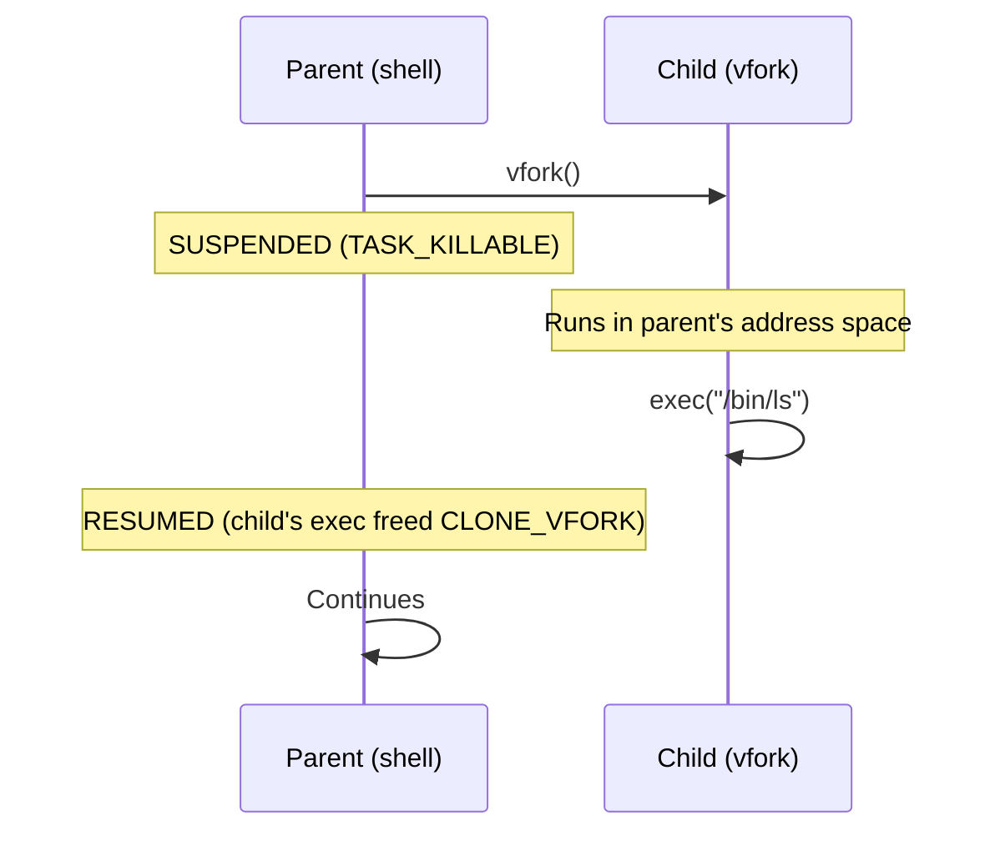
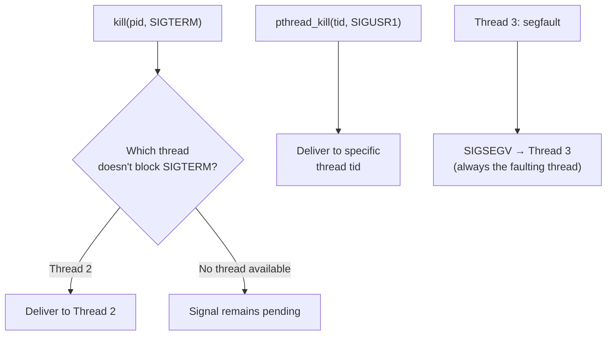
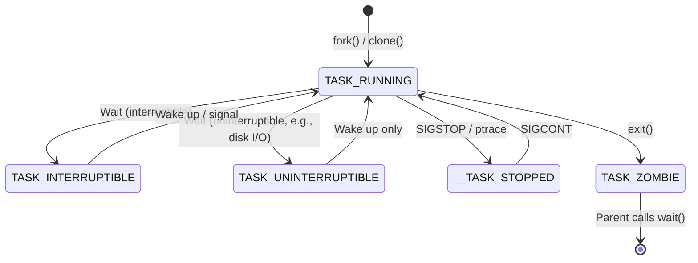

# Processes and Threads in Linux

## Introduction

In Linux, the boundary between a "process" and a "thread" is deliberately blurred. Unlike traditional Unix, where processes and threads are fundamentally different constructs, Linux treats both as **tasks** — schedulable entities represented by `struct task_struct`. The distinction between a process (an independent execution environment) and a thread (a lightweight execution unit sharing memory with peers) is implemented through the `clone()` system call and a set of flags that control what is shared and what is copied.

This unified model is one of Linux's most elegant design decisions. It means the kernel scheduler doesn't need separate code paths for processes and threads, and it enables a continuum of sharing configurations rather than a binary choice.

## The Unified Task Model

### Everything Is a Task

In the Linux kernel, every schedulable entity — whether you'd call it a process or a thread in userspace — is represented by a `task_struct`. The kernel doesn't have a separate "thread" data structure. Instead, the relationship between processes and threads is expressed through shared resources:

```c
/* Simplified view from include/linux/sched.h */
struct task_struct {
    /* ...hundreds of fields... */
    struct mm_struct *mm;           /* Memory descriptor (shared or private) */
    struct files_struct *files;     /* Open file table (shared or private) */
    struct signal_struct *signal;   /* Shared signal state */
    struct sighand_struct *sighand; /* Signal handlers (shared or private) */
    pid_t pid;                      /* Thread-level PID (kernel view) */
    pid_t tgid;                     /* Thread group ID (userspace PID) */
    /* ... */
};
```

When two tasks share the same `mm`, `files`, `signal`, and `sighand`, userspace sees them as threads of the same process. When they don't share these, userspace sees them as separate processes.

### PID vs TGID

This is a critical distinction that confuses many developers:

| Kernel Concept | Userspace Name | Scope |
|---|---|---|
| `pid` | Thread ID (TID) | Unique per thread |
| `tgid` | Process ID (PID) | Same for all threads in a group |
| `tgid` of parent | Parent PID (PPID) | The process that spawned us |

When you call `getpid()` from userspace, the kernel actually returns `current->tgid`. When you call `gettid()`, the kernel returns `current->pid`.

```
Process (userspace PID = 1000)
├── Thread 1: pid=1000, tgid=1000  ← main thread, gettid()==getpid()
├── Thread 2: pid=1001, tgid=1000  ← gettid()==1001, getpid()==1000
└── Thread 3: pid=1002, tgid=1000  ← gettid()==1002, getpid()==1000
```



## Process Hierarchy

### Parent-Child Relationships

Every process (except `init`, PID 1) has a parent. The `task_struct` maintains this relationship through `real_parent` and `parent` pointers:

```c
struct task_struct {
    struct task_struct __rcu *real_parent; /* biological parent */
    struct task_struct __rcu *parent;      /* recipient of SIGCHLD, may change with ptrace */
    struct list_head children;             /* list of my children */
    struct list_head sibling;              /* linkage in parent's children list */
};
```

The `real_parent` never changes (it's who actually created this task). The `parent` pointer can change if a debugger attaches via `ptrace()` — this is how GDB intercepts signals meant for the debuggee.



### The Init Process

PID 1 is special. It's the ancestor of all processes and is responsible for:

- Adopting orphaned processes (when a parent dies, the child is reparented to `init`)
- Reaping zombie processes (calling `wait()` on children that have exited)
- On modern systems, PID 1 is typically `systemd` (replacing the traditional SysV `init`)

```c
/* In kernel/exit.c - find_new_reaper() */
static struct task_struct *find_new_reaper(struct task_struct *father,
                                           struct task_struct *child_reaper)
{
    struct task_struct *thread;
    /* Try to find a sibling in the same thread group */
    thread = find_alive_thread(father);
    if (thread)
        return thread;
    /* Otherwise, reparent to init */
    if (child_reaper == father)
        return &init_task;
    return child_reaper;
}
```

### Zombie and Orphan Processes

When a process exits, it becomes a **zombie** until its parent calls `wait()`. If the parent dies first, the child becomes an **orphan** and is reparented to `init`.



```c
/* kernel/exit.c — do_exit() */
void __noreturn do_exit(long code)
{
    struct task_struct *tsk = current;

    /* Release resources */
    exit_signals(tsk);
    exit_mm(tsk);           /* Release memory */
    exit_files(tsk);        /* Close files */

    /* Notify parent via SIGCHLD */
    tsk->exit_code = code;
    tsk->exit_state = EXIT_ZOMBIE;

    /* Wake parent if waiting */
    do_notify_parent(tsk, tsk->exit_signal);

    /* Schedule away — this task is now a zombie */
    schedule();
    /* Never returns */
}
```

### Process Tree Inspection

```bash
# View process tree
$ pstree -p
systemd(1)─┬─accounts-daemon(641)
            ├─agetty(738)
            ├─bash(500)───vim(501)
            ├─cron(660)
            ├─dbus-daemon(540)
            └─sshd(680)───sshd(1234)───bash(1235)

# View process hierarchy in /proc
$ ls -la /proc/self/
$ cat /proc/self/status | grep -E '^(Pid|PPid|Tgid|Threads)'
Pid:    1234
PPid:   500
Tgid:   1234
Threads:    1

# See all threads of a process
$ ls /proc/500/task/
1000  1001  1002
```

## The Linux Thread Model: clone()

### Historical Context

Linux didn't always have threads. The original approach was to use separate processes communicating via shared memory segments. The first "thread" implementation was **LinuxThreads** (1996), which used `clone()` but had limitations — each thread had a different PID, and signals were poorly handled.

The POSIX threads standard was properly met with **NPTL** (Native POSIX Threads Library, 2003), which also uses `clone()` but with better kernel support. NPTL is the threading library used by glibc today.

### clone() System Call

The `clone()` system call is the foundation of both `fork()` and `pthread_create()`. The key difference is which resources are shared:

```c
/* Simplified prototype */
int clone(int (*fn)(void *), void *stack, int flags, void *arg, ...);
```

The `flags` parameter controls sharing:

```c
/* From include/uapi/linux/sched.h */
#define CSIGNAL              0x000000ff  /* signal mask to be sent at exit */
#define CLONE_VM             0x00000100  /* share VM space */
#define CLONE_FS             0x00000200  /* share fs info (cwd, root) */
#define CLONE_FILES          0x00000400  /* share file descriptor table */
#define CLONE_SIGHAND        0x00000800  /* share signal handlers */
#define CLONE_PIDFD          0x00001000  /* create pidfd */
#define CLONE_PTRACE         0x00002000  /* continue being traced */
#define CLONE_VFORK          0x00004000  /* parent waits until child calls exec */
#define CLONE_PARENT         0x00008000  /* same parent as caller */
#define CLONE_THREAD         0x00010000  /* same thread group */
#define CLONE_NEWNS          0x00020000  /* new mount namespace */
#define CLONE_SYSVSEM        0x00040000  /* share System V SEM_UNDO */
#define CLONE_SETTLS         0x00080000  /* set TLS descriptor */
#define CLONE_PARENT_SETTID  0x00100000  /* set parent TID */
#define CLONE_CHILD_CLEARTID 0x00200000  /* clear child TID on exit */
#define CLONE_DETACHED        0x00400000  /* unused, ignored */
#define CLONE_UNTRACED        0x00800000  /* can't be forced-traced */
#define CLONE_NEWUSER         0x10000000  /* new user namespace */
#define CLONE_NEWPID          0x20000000  /* new PID namespace */
```

### What fork(), pthread_create(), and clone() Share



| Resource | fork() | pthread_create() | Typical clone() flags |
|---|---|---|---|
| Memory (mm) | Copied (COW) | Shared | `CLONE_VM` |
| File descriptors | Copied | Shared | `CLONE_FILES` |
| Signal handlers | Copied | Shared | `CLONE_SIGHAND` |
| Filesystem info | Copied | Shared | `CLONE_FS` |
| Thread group | New | Same | `CLONE_THREAD` |
| PID namespace | Same | Same | `CLONE_NEWPID` (if new) |

### fork() Implementation

When `fork()` is called, the kernel uses `clone()` internally:

```c
/* kernel/fork.c — kernel_clone() (simplified) */
pid_t kernel_clone(struct kernel_clone_args *args)
{
    struct task_struct *p;
    pid_t pid;

    /* Copy the task structure and resources */
    p = copy_process(NULL, args);

    /* Wake up the new task */
    wake_up_new_task(p);

    return pid;
}

/* fork() uses these flags */
/* CSIGNAL = SIGCHLD, all other CLONE flags = 0 */
```

The `copy_process()` function performs the heavy lifting:

```c
/* kernel/fork.c — copy_process() (simplified) */
static struct task_struct *copy_process(struct pid *pid,
                                        struct kernel_clone_args *args)
{
    struct task_struct *p;

    /* Allocate new task_struct */
    p = dup_task_struct(current);

    /* Copy or share resources based on flags */
    if (args->flags & CLONE_VM)
        p->mm = get_mm(current->mm);    /* Share: just increment refcount */
    else
        p->mm = dup_mm(current->mm);    /* Copy: COW copy of page tables */

    if (args->flags & CLONE_FILES)
        p->files = get_files_struct(current->files);  /* Share FD table */
    else
        p->files = dup_fd(current->files);            /* Copy FD table */

    if (args->flags & CLONE_THREAD) {
        p->tgid = current->tgid;         /* Same thread group */
        p->signal = current->signal;     /* Share signal struct */
    } else {
        p->tgid = p->pid;               /* New thread group */
        p->signal = copy_signal();       /* Copy signal struct */
    }

    /* Set up PID namespace */
    copy_pid_ns_flags(p, args);

    return p;
}
```

### vfork() and CLONE_VFORK

`vfork()` is an optimization where the parent **suspends** until the child calls `exec()` or `_exit()`. The child shares the parent's memory without copying:

```c
/* vfork flags */
/* CLONE_VFORK | CLONE_VM — parent waits, child shares memory */
```

This is used by shells for command execution where the child immediately `exec()`s a new program:



### Modern clone3() System Call

Linux 5.3 introduced `clone3()`, which uses a structured argument instead of variadic flags:

```c
/* include/uapi/linux/sched.h */
struct clone_args {
    __aligned_u64 flags;        /* Flags bit mask */
    __aligned_u64 pidfd;        /* Where to store pidfd */
    __aligned_u64 child_tid;    /* Where to store child TID */
    __aligned_u64 parent_tid;   /* Where to store parent TID */
    __aligned_u64 exit_signal;  /* Signal to deliver on exit */
    __aligned_u64 stack;        /* Stack pointer for child */
    __aligned_u64 stack_size;   /* Stack size */
    __aligned_u64 tls;          /* TLS descriptor */
    /* New in 5.5+: */
    __aligned_u64 set_tid;      /* Specify exact PID for child */
    __aligned_u64 set_tid_size; /* Number of elements in set_tid */
    /* New in 5.7+: */
    __aligned_u64 cgroup;       /* Cgroup to place child in */
};

/* Usage */
struct clone_args args = {
    .flags       = CLONE_VM | CLONE_THREAD | CLONE_SIGHAND,
    .exit_signal = 0,
    .stack       = (u64)child_stack,
    .stack_size  = STACK_SIZE,
    .tls         = (u64)tls_area,
};
pid_t pid = syscall(SYS_clone3, &args, sizeof(args));
```

### clone3() vs clone()

| Feature | clone() | clone3() |
|---------|---------|----------|
| Argument passing | Variadic (va_args) | Structured struct |
| Extensibility | Limited (flag bits run out) | Struct can grow |
| PID specification | Not supported | `set_tid` field |
| Cgroup placement | Not supported | `cgroup` field |
| Available since | Linux 2.0 | Linux 5.3 |

## Thread Group Signal Delivery

When a signal is sent to a process (identified by `tgid`), the kernel must choose which thread receives it:

```c
/* kernel/signal.c - simplified */
struct task_struct *signal_wake_up(struct task_struct *t, int resume)
{
    /* For process-directed signals, any thread that isn't blocking
     * the signal can receive it */
    if (resume)
        wake_up_state(t, TASK_WAKEKILL);
    return t;
}
```

Rules for signal delivery to threads:
1. **Process-directed signals** (`kill(pid, sig)`) — delivered to any one thread in the group that doesn't block the signal
2. **Thread-directed signals** (`pthread_kill(tid, sig)`) — delivered to the specific thread
3. **SIGSEGV, SIGFPE, SIGILL** — always delivered to the thread that caused the fault
4. **SIGSTOP, SIGCONT** — affect the entire thread group



## Thread-Local Storage (TLS)

Each thread maintains its own TLS area, set via `CLONE_SETTLS`:

```c
/* On x86-64, TLS is stored in the FS base register */
/* arch/x86/kernel/process_64.c */
static inline void switch_to_new_gdt(struct task_struct *t)
{
    /* Set FS base to point to thread-local storage */
    wrmsrl(MSR_FS_BASE, t->thread.fsbase);
}
```

In userspace, glibc allocates TLS via the `arch_prctl()` syscall or through `CLONE_SETTLS` during `clone()`.

```bash
# Inspect TLS for a multi-threaded process
$ cat /proc/500/task/1000/maps | grep -i tls
7f8c1c000000-7f8c1c020000 rw-p 00000000 00:00 0  [stack:1001]
7f8c1c020000-7f8c1c040000 rw-p 00000000 00:00 0  [stack:1002]
```

### TLS on Different Architectures

| Architecture | TLS Register | Mechanism |
|-------------|-------------|-----------|
| x86-64 | FS base | `arch_prctl(ARCH_SET_FS, addr)` |
| i386 | GS segment | `set_thread_area()` syscall |
| ARM64 | TPIDR_EL0 | `prctl(PR_SET_TLS, addr)` |
| RISC-V | tp register | Direct register set |

## Namespace Awareness

Modern Linux adds **namespaces** to the process model, allowing containerization:

```c
/* From include/linux/nsproxy.h */
struct nsproxy {
    struct uts_namespace *uts_ns;    /* hostname */
    struct ipc_namespace *ipc_ns;   /* System V IPC */
    struct mnt_namespace *mnt_ns;   /* mount points */
    struct pid_namespace *pid_ns_for_children; /* PID namespace for children */
    struct net *net_ns;             /* network */
    struct cgroup_namespace *cgroup_ns; /* cgroup namespace */
};
```

A process in a PID namespace sees a completely different set of PIDs. The "real" PID (in the root namespace) is only visible from outside.

```bash
# Inside a container, PID 1 is not the host's init
$ docker run --rm alpine cat /proc/1/status | grep ^Pid
Pid:    1
# From host, the same process has a different PID
$ ps aux | grep nginx
root  12345  ... nginx: master process
```

### Namespace Types

| Namespace | Flag | Isolates |
|-----------|------|----------|
| PID | `CLONE_NEWPID` | Process ID space |
| Network | `CLONE_NEWNET` | Network stack, interfaces, routing |
| Mount | `CLONE_NEWNS` | Filesystem mount points |
| UTS | `CLONE_NEWUTS` | Hostname, domain name |
| IPC | `CLONE_NEWIPC` | System V IPC, POSIX message queues |
| User | `CLONE_NEWUSER` | UID/GID mappings |
| Cgroup | `CLONE_NEWCGROUP` | Cgroup root directory |

## Thread Count and Resource Limits

```bash
# System-wide thread limit
$ cat /proc/sys/kernel/threads-max
15000

# Per-user thread limit (RLIMIT_NPROC)
$ ulimit -u
4096

# Check current thread count
$ cat /proc/loadavg
0.50 0.40 0.35 2/500 12345
#                     ^^^ - 2 running, 500 total threads

# Per-process thread limit
$ cat /proc/sys/kernel/pid_max
32768
```

### Kernel Thread Accounting

The kernel tracks threads via `struct pid` (one per PID namespace) and `struct task_struct`:

```c
/* include/linux/pid.h */
struct pid {
    atomic_t count;
    unsigned int level;           /* PID namespace depth */
    struct hlist_head tasks[PIDTYPE_MAX]; /* Tasks using this PID */
    struct rcu_head rcu;
    struct upid numbers[];        /* One per namespace level */
};

/* PID type enum */
enum pid_type {
    PIDTYPE_PID,      /* Process ID */
    PIDTYPE_TGID,     /* Thread group ID */
    PIDTYPE_PGID,     /* Process group ID */
    PIDTYPE_SID,      /* Session ID */
};
```

## Process States

A task can be in one of several states:



```c
/* include/linux/sched.h — task states */
#define TASK_RUNNING            0x0000
#define TASK_INTERRUPTIBLE      0x0001
#define TASK_UNINTERRUPTIBLE    0x0002
#define __TASK_STOPPED          0x0004
#define __TASK_TRACED           0x0008
#define EXIT_DEAD               0x0020
#define EXIT_ZOMBIE             0x0040
#define TASK_KILLABLE           (TASK_WAKEKILL | TASK_UNINTERRUPTIBLE)
```

## Practical Examples

### Creating Threads in C

```c
#define _GNU_SOURCE
#include <sched.h>
#include <stdio.h>
#include <stdlib.h>
#include <unistd.h>
#include <sys/wait.h>
#include <sys/syscall.h>

#define STACK_SIZE (1024 * 1024)

static int thread_func(void *arg) {
    printf("Child thread: pid=%d, tgid=%d, tid=%ld\n",
           getpid(), getppid(), syscall(SYS_gettid));
    sleep(1);
    return 0;
}

int main(void) {
    char *stack = malloc(STACK_SIZE);
    if (!stack) { perror("malloc"); exit(1); }

    /* clone with CLONE_VM | CLONE_THREAD to create a thread */
    int flags = CLONE_VM | CLONE_FS | CLONE_FILES | CLONE_SIGHAND
              | CLONE_THREAD | CLONE_SYSVSEM | CLONE_SETTLS
              | CLONE_PARENT_SETTID | CLONE_CHILD_CLEARTID;

    pid_t child_tid;
    pid_t pid = clone(thread_func, stack + STACK_SIZE,
                      flags, NULL, &child_tid, NULL, &child_tid);

    if (pid == -1) { perror("clone"); exit(1); }

    printf("Parent: created thread with kernel pid %d\n", pid);
    printf("Parent: pid=%d, tgid=%d, tid=%ld\n",
           getpid(), getppid(), syscall(SYS_gettid));

    waitpid(pid, NULL, __WCLONE);
    free(stack);
    return 0;
}
```

### Viewing Thread Information

```bash
# Show all threads of a process with ps
$ ps -T -p 500
  PID  SPID TTY          TIME CMD
  500  500 pts/0    00:00:00 bash
  500  501 pts/0    00:00:00 bash
  500  502 pts/0    00:00:00 bash

# /proc view of threads
$ cat /proc/500/task/*/status | grep -E '^(Name|Pid|Tgid|Threads)'
Name:   bash
Pid:    500
Tgid:   500
Threads:    3
Name:   bash
Pid:    501
Tgid:   500
Threads:    3
Name:   bash
Pid:    502
Tgid:   500
Threads:    3
```

## Differences from Other Operating Systems

| Feature | Linux | Windows | macOS |
|---|---|---|---|
| Thread representation | `task_struct` (same as process) | ETHREAD/KTHREAD | thread_t (kernel thread) |
| Thread creation | `clone()` | `NtCreateThread()` | `bsdthread_create()` |
| Thread groups | Thread group (`tgid`) | Process object | Mach task |
| TLS mechanism | `arch_prctl` / `CLONE_SETTLS` | TEB (Thread Environment Block) | Mach thread-specific data |
| Scheduling | Per-thread | Per-thread | Per-thread (MIG-aware) |

## Further Reading

- [The Linux Kernel Documentation](https://docs.kernel.org/)
- [GNU Project Documentation](https://www.gnu.org/doc/doc.html)
- [GNU Manuals](https://www.gnu.org/manual/manual.html)
- [Free Software Directory](https://directory.fsf.org/wiki/Main_Page)
- [Planet GNU](https://planet.gnu.org/)
- [Free Software Books](https://www.gnu.org/doc/other-free-books.html)

- [Linux man pages: clone(2)](https://man7.org/linux/man-pages/man2/clone.2.html)
- [Linux man pages: pthread_create(3)](https://man7.org/linux/man-pages/man3/pthread_create.3.html)
- [NPTL Design document (Ulrich Drepper)](https://www.akkadia.org/drepper/nptl-design.pdf)
- [Linux kernel: include/linux/sched.h](https://elixir.bootlin.com/linux/latest/source/include/linux/sched.h)
- [LWN: A (not so) short overview of the Linux kernel threading model](https://lwn.net/Articles/651785/)
- [The Linux Programming Interface - Chapter 28: Process Creation](https://man7.org/tlpi/)
- [clone3(2) man page](https://man7.org/linux/man-pages/man2/clone3.2.html) — Modern clone interface

## Related Topics

- [Process Creation](process-creation.md) — How `fork()`, `vfork()`, and `clone()` are implemented
- [task_struct Deep Dive](task-struct.md) — The data structure representing every task
- [Process States](process-states.md) — The lifecycle of a process
- [Context Switching](context-switching.md) — How the kernel switches between tasks
- [Scheduler Overview](scheduler.md) — How tasks are selected to run
