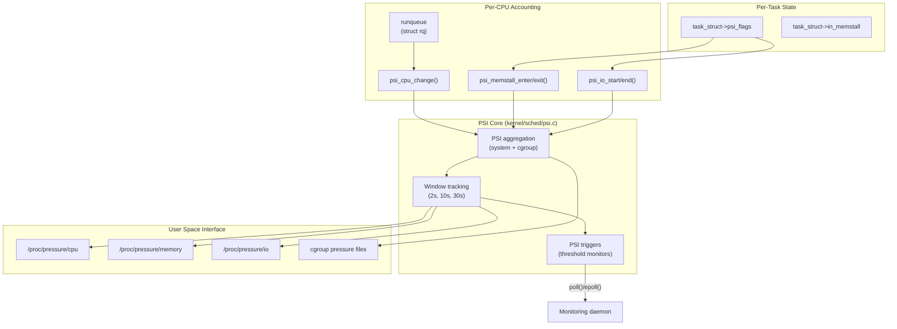
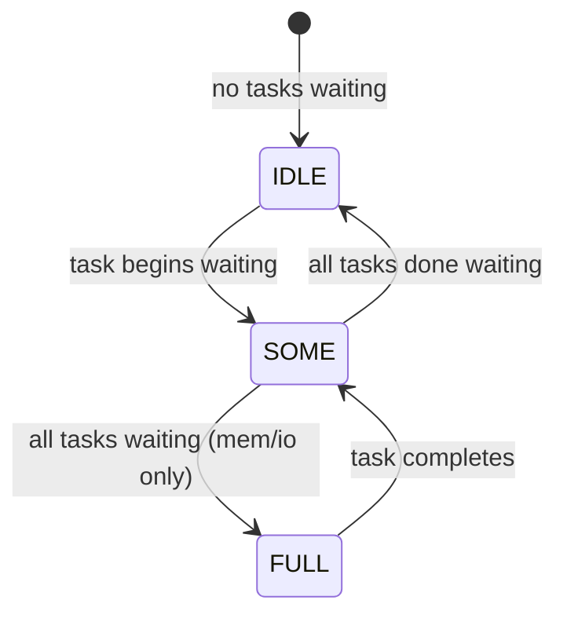

# Pressure Stall Information (PSI)

## Introduction

Pressure Stall Information (PSI) is a Linux kernel feature that quantifies
the amount of time tasks spend waiting for resources — CPU, memory, or I/O.
Introduced in Linux 4.20 (December 2018) by Facebook engineer Johannes Weiner,
PSI provides a single, interpretable metric for resource contention that
answers the question: *"How much productive time is being lost to resource
scarcity?"*

Before PSI, administrators relied on indirect signals — load averages, CPU
utilization percentages, `vmstat` columns — none of which directly measure
*stall time*. A system at 100% CPU utilization might be perfectly healthy
(all cores doing useful work) or completely thrashing (all cores stalled on
memory). PSI distinguishes these cases.

## Architecture



## What PSI Measures

PSI tracks two distinct types of stalls:

### "some" — Partial Stall

Time during which **at least one** task is stalled on a resource while other
CPUs may still be doing useful work. This indicates contention but not
necessarily system-wide impact.

### "full" — Complete Stall

Time during which **all non-idle tasks** are stalled simultaneously. No
productive work is happening. This is the "thrashing" state that has severe
performance impact.

> **Note**: CPU "full" is undefined at the system level (there's always an
> idle task running) but is reported as zero since Linux 5.13 for backward
> compatibility. It *is* meaningful for cgroup-level PSI.

### Per-Resource Semantics

| Resource | "some" means | "full" means |
|----------|-------------|-------------|
| **CPU** | At least one runnable task waiting for a CPU | *(undefined at system level)* |
| **Memory** | At least one task stalled on memory (reclaim, swap, compaction) | All non-idle tasks stalled on memory |
| **I/O** | At least one task waiting on disk I/O | All non-idle tasks blocked on I/O |

## Kernel Implementation

### Data Structures

The core tracking structure is `struct psi_group`:

```c
/* Simplified from kernel/sched/psi.c */
struct psi_group {
    struct psi_group_cpu __percpu *pcpu;
    u64 poll_total[PSI_NR_STATES];
    u64 poll_end;
    u64 poll_start;

    /* Tracking windows */
    u64 total[PSI_NR_STATES][PSI_NR_WINDOWS];
    unsigned long state_mask[PSI_NR_STATES];
    unsigned long states;

    /* Triggers */
    struct list_head triggers;
    u64 poll_states;
    u64 poll_min_period;
    struct psi_trigger *poll_task;
    /* ... */
};

/* Per-CPU accounting */
struct psi_group_cpu {
    unsigned int tasks[PSI_NR_STATES];
    u64 state_start;
    u64 state_end;
    u32 state_mask;
};
```

### State Machine

PSI tracks four states per resource:



### Accounting Hooks

PSI accounting is integrated into the scheduler and memory management:

**CPU accounting** (`psi_sched_switch()`):
```c
/* Called from scheduler on context switch */
void psi_sched_switch(struct task_struct *prev,
                      struct task_struct *next, bool sleep)
{
    /* prev going to sleep = potential CPU stall start */
    /* next waking up = potential CPU stall end */
}
```

**Memory accounting** (`psi_memstall_enter()` / `psi_memstall_exit()`):
```c
/* Called from page allocator, compaction, swap, reclaim */
void psi_memstall_enter(unsigned long *flags)
{
    struct task_struct *task = current;

    if (task->in_memstall)
        return;  /* already tracked */
    task->in_memstall = true;
    *flags = TSK_MEMSTALL;
    psi_task_change(task, TSK_MEMSTALL, 1);
}

void psi_memstall_leave(unsigned long *flags)
{
    struct task_struct *task = current;

    if (!task->in_memstall)
        return;
    task->in_memstall = false;
    psi_task_change(task, TSK_MEMSTALL, 0);
    *flags = 0;
}
```

**I/O accounting** (`psi_io_start()` / `psi_io_end()`):
```c
/* Called from block layer, file system writeback */
void psi_io_start(int reason)
{
    psi_task_change(current, TSK_IOWAIT, 1);
}

void psi_io_end(void)
{
    psi_task_change(current, TSK_IOWAIT, 0);
}
```

### Window Tracking Algorithm

PSI uses a **sliding window** approach to compute averages over three
time periods (10s, 60s, 300s). The algorithm maintains a fixed set of
events and calculates the fraction of time spent in each state.

The window sizes correspond to the `avg10`, `avg60`, and `avg300` fields
in the `/proc/pressure/` output. Each window is divided into 10 time slots,
and the oldest slot expires as time advances:

```text
Time ──────────────────────────────────────────►

10s window:  [slot0][slot1][slot2]...[slot9]
              └── expires ──┘         └─ current

Each slot records: time_in_state during that sub-window
Average = sum(time_in_state across all active slots) / total_window_time
```

The `total` field is an absolute counter of stall time (in microseconds)
since boot, allowing custom averaging windows.

### PSI Triggers (Threshold Monitoring)

Users can register triggers that fire when stall time exceeds a threshold
within a time window. The kernel implementation:

```c
struct psi_trigger {
    enum psi_states     state;       /* PSI_SOME or PSI_FULL */
    u64                 threshold;   /* stall time in us */
    u64                 window;      /* window size in us */
    struct list_head    node;
    struct psi_group    *group;
    wait_queue_head_t   event_wait;
    int                 event;       /* pending event count */
    /* ... */
};
```

The kernel checks triggers at a rate of 10 times per tracking window
(minimum 50ms, maximum 1s between checks). The window size must be
between 500ms and 10s.

## User Space Interface

### `/proc/pressure/cpu`

```bash
$ cat /proc/pressure/cpu
some avg10=0.50 avg60=0.30 avg300=0.20 total=12345678
full avg10=0.00 avg60=0.00 avg300=0.00 total=0
```

### `/proc/pressure/memory`

```bash
$ cat /proc/pressure/memory
some avg10=0.00 avg60=0.00 avg300=0.00 total=456789
full avg10=0.00 avg60=0.00 avg300=0.00 total=123456
```

### `/proc/pressure/io`

```bash
$ cat /proc/pressure/io
some avg10=2.30 avg60=1.50 avg300=0.80 total=98765432
full avg10=0.10 avg60=0.05 avg300=0.02 total=54321098
```

### Output Format

Each line contains:

| Field | Meaning |
|-------|---------|
| `some`/`full` | Stall type |
| `avg10` | Moving average over 10 seconds (%) |
| `avg60` | Moving average over 60 seconds (%) |
| `avg300` | Moving average over 300 seconds (%) |
| `total` | Cumulative stall time (microseconds) |

### Cgroup v2 PSI

PSI is available per-cgroup when `CONFIG_PSI_CGROUP` is enabled:

```bash
# System-wide
$ cat /proc/pressure/cpu
some avg10=0.50 avg60=0.30 avg300=0.20 total=12345678

# Per-cgroup
$ cat /sys/fs/cgroup/my-app/cpu.pressure
some avg10=1.20 avg60=0.80 avg300=0.50 total=5678901

$ cat /sys/fs/cgroup/my-app/memory.pressure
some avg10=0.00 avg60=0.00 avg300=0.00 total=0
full avg10=0.00 avg60=0.00 avg300=0.00 total=0

$ cat /sys/fs/cgroup/my-app/io.pressure
some avg10=5.00 avg60=3.00 avg300=1.50 total=34567890
full avg10=0.50 avg60=0.20 avg300=0.10 total=12345678
```

## Using PSI Triggers (Programmatic Monitoring)

### C Example

```c
#include <errno.h>
#include <fcntl.h>
#include <stdio.h>
#include <poll.h>
#include <string.h>
#include <unistd.h>

/*
 * Monitor memory partial stall: trigger when 150ms of stall
 * accumulates within any 1-second window.
 */
int main(void)
{
    const char trig[] = "some 150000 1000000";
    struct pollfd fds;
    int n;

    fds.fd = open("/proc/pressure/memory", O_RDWR | O_NONBLOCK);
    if (fds.fd < 0) {
        fprintf(stderr, "open: %s\n", strerror(errno));
        return 1;
    }
    fds.events = POLLPRI;

    if (write(fds.fd, trig, strlen(trig) + 1) < 0) {
        fprintf(stderr, "write trigger: %s\n", strerror(errno));
        return 1;
    }

    printf("Monitoring memory pressure (150ms/1s threshold)...\n");
    while (1) {
        n = poll(&fds, 1, -1);
        if (n < 0) {
            perror("poll");
            return 1;
        }
        if (fds.revents & POLLERR) {
            printf("Trigger source gone\n");
            return 0;
        }
        if (fds.revents & POLLPRI) {
            printf("Memory pressure event triggered!\n");
            /* Re-read /proc/pressure/memory for current values */
        }
    }
}
```

### Shell Monitoring

```bash
# Check for any memory pressure
cat /proc/pressure/memory

# Threshold monitoring via bash
exec 3<>/proc/pressure/memory
echo "some 100000 1000000" >&3
# Use select/poll on fd 3

# Simple alerting
while true; do
    mem_some=$(awk '/^some/ {print $2}' /proc/pressure/memory \
               | cut -d= -f2)
    if (( $(echo "$mem_some > 5.0" | bc -l) )); then
        echo "WARNING: Memory pressure at ${mem_some}%"
    fi
    sleep 10
done
```

## Kernel Configuration

PSI requires the following kernel config options:

```
CONFIG_PSI=y                    # Core PSI support
CONFIG_PSI_CGROUP=y             # Per-cgroup PSI (optional)
CONFIG_PSI_DEFAULT_DISABLED=n   # Enable by default
```

### Kernel Command Line

```bash
# Enable PSI (if CONFIG_PSI_DEFAULT_DISABLED=y)
psi=1

# Disable PSI
psi=0
```

### Runtime Check

```bash
# Check if PSI is enabled
test -d /proc/pressure && echo "PSI enabled" || echo "PSI disabled"

# Check cgroup PSI
test -f /sys/fs/cgroup/cgroup.pressure && echo "Cgroup PSI enabled"
```

## Real-World Use Cases

### Facebook's OOM Killer (oomd)

Facebook developed `oomd` (Out-of-Memory Daemon) as a userspace OOM killer
that uses PSI triggers to make smarter decisions than the kernel OOM killer:

```bash
# oomd configuration: kill when memory pressure exceeds threshold
[...]
memory_pressure = {
    some = { threshold = 50000, window = 1000000 }
    full = { threshold = 10000, window = 1000000 }
}
```

### Kubernetes Integration

Kubernetes uses PSI to make eviction decisions. The kubelet can be configured
to monitor PSI signals for pod eviction:

```yaml
# kubelet feature gate
--feature-gates=KubeletPSI=true
```

### systemd Resource Control

systemd v254+ supports PSI-based triggers for resource management:

```ini
[Service]
MemoryPressureWatch=on
MemoryPressureThresholdSec=1s
CPUQuota=200%
IOPressureWatch=on
```

### Load Shedding

Web servers can use PSI to implement graceful load shedding:

```python
import os

def should_shed_load(threshold=5.0):
    with open('/proc/pressure/cpu') as f:
        line = f.readline()
        some = float(line.split('avg10=')[1].split()[0])
        return some > threshold
```

## Comparison with Other Metrics

| Metric | What it Measures | PSI Advantage |
|--------|-----------------|---------------|
| Load Average | Runnable + uninterruptible tasks | PSI measures *time lost*, not task count |
| CPU Utilization % | Time CPU is busy | PSI distinguishes useful vs. stalled work |
| `vmstat` si/so | Swap activity | PSI covers all memory stalls, not just swap |
| `iostat` await | I/O wait time | PSI measures *task-level* impact, not device latency |
| Memory free/used | Available memory | PSI detects when low memory causes stalls |

### Example: Why CPU Utilization is Misleading

```text
Scenario A: 4 CPUs, all doing useful computation
  CPU utilization: 100%
  PSI some: 0% (no one is waiting)
  → System is healthy, fully utilized

Scenario B: 4 CPUs, tasks constantly context-switching due to memory pressure
  CPU utilization: 100%
  PSI some: 45% (nearly half the time is wasted)
  PSI full: 10% (periods where nothing productive happens)
  → System is thrashing despite "100% utilization"
```

## Scheduler Interaction

### CPU PSI Accounting

CPU PSI is computed differently from memory and I/O. The scheduler tracks
whether there are **more runnable tasks than available CPUs**:

```c
/* From kernel/sched/psi.c */
static void psi_update_work(struct psi_group *group, bool cpu, bool clear)
{
    /* If there are more runnable tasks than CPUs, we have CPU pressure */
    if (cpu) {
        if (clear)
            group->state_mask &= ~PSI_CPU_SOME;
        else
            group->state_mask |= PSI_CPU_SOME;
    }
}
```

The scheduler's `psi_account_irqtime()` function also accounts for
interrupt and softirq time, preventing IRQ overhead from being miscounted
as productive CPU time.

### Tick-Based Updates

PSI state is updated on each scheduler tick (typically every 1-10ms depending
on `CONFIG_HZ`). The per-CPU state is aggregated periodically (every 2 seconds
for the tracking windows).

## Kernel Source Map

| File | Purpose |
|------|---------|
| `kernel/sched/psi.c` | Core PSI implementation (~800 lines) |
| `include/linux/psi.h` | PSI data structures and API declarations |
| `include/linux/psi_types.h` | `psi_group`, `psi_group_cpu` types |
| `kernel/cgroup/cgroup.c` | Cgroup PSI integration |
| `fs/proc/base.c` | `/proc/pressure/` file creation |
| `mm/vmscan.c` | Memory PSI hooks (`psi_memstall_enter/exit`) |
| `mm/page_alloc.c` | Allocator PSI hooks |
| `mm/compaction.c` | Compaction PSI hooks |
| `block/blk-core.c` | I/O PSI hooks (`psi_io_start/end`) |
| `kernel/sched/core.c` | CPU PSI hooks (`psi_sched_switch`) |
| `tools/testing/selftests/psi/` | PSI self-tests |

## Troubleshooting

### PSI Always Shows Zero

```bash
# Check if PSI is compiled in
grep CONFIG_PSI /boot/config-$(uname -r)

# Check if disabled via command line
cat /proc/cmdline | grep -o 'psi=[01]'

# Check if the interface exists
ls -la /proc/pressure/
```

### High "full" Memory Pressure

```bash
# Find which cgroup is causing memory pressure
for cg in /sys/fs/cgroup/*/memory.pressure; do
    echo "=== $(dirname $cg | xargs basename) ==="
    cat "$cg" 2>/dev/null
done

# Check reclaim activity
grep -E 'pgsteal|pgscan|kswapd|direct' /proc/vmstat
```

### Trigger Not Firing

```bash
# Verify trigger registration (check dmesg)
dmesg | grep psi

# Check kernel rate limiting
# Minimum window is 500ms, maximum is 10s
# Unprivileged users: window must be multiple of 2s
```

## PSI vs. Load Average

The traditional Unix load average counts the number of runnable + uninterruptible
processes. PSI measures the *fraction of time* tasks are stalled. This difference
is significant:

```text
Scenario: 8 CPUs, 4 tasks constantly waiting on I/O

Load average:     ~4.0  (just a count, hard to interpret)
PSI io some:      50%   (half the time, at least one task is stalled)
PSI io full:      0%    (CPUs still doing other work)

→ Load average says "moderate load"
→ PSI says "you're losing 50% of potential I/O throughput"
```

```text
Scenario: 8 CPUs, 8 tasks all waiting on memory reclaim

Load average:     ~8.0  (seems "fully loaded")
PSI mem some:     100%  (always some task waiting)
PSI mem full:     95%   (almost all time, everyone is stalled)

→ Load average says "fully loaded" (misleading — it's thrashing)
→ PSI says "95% of time is wasted on memory stalls" (actionable)
```

## Performance Overhead

PSI accounting adds minimal overhead:

- **Per-task**: ~8 bytes in `task_struct` (`psi_flags`, `in_memstall`)
- **Per-CPU**: ~64 bytes for `psi_group_cpu` state
- **CPU time**: <0.1% on typical workloads
- **Trigger checking**: 10Hz per window (negligible)

The overhead is so low that PSI is enabled by default in most distributions.

## Version History

| Kernel | Changes |
|--------|---------|
| 4.20 | PSI introduced (system-wide, CPU/memory/IO) |
| 5.2 | Cgroup v2 PSI support |
| 5.13 | CPU "full" line added (always zero at system level) |
| 5.14 | PSI trigger improvements, reduced overhead |
| 6.1 | PSI accounting in tickless mode improvements |
| 6.6 | `/proc/pressure/` header improvements |

## References

1. **Kernel documentation**: https://docs.kernel.org/accounting/psi.html
2. **PSI design paper**: Facebook Engineering blog, "Understanding and managing pressure stall information"
3. **Kernel source**: https://github.com/torvalds/linux/blob/master/kernel/sched/psi.c
4. **LWN: Pressure stalls in real time**: https://lwn.net/Articles/759781/
5. **LWN: A psi update and a new resource-pressure API**: https://lwn.net/Articles/793427/
6. **oomd (Facebook's userspace OOM killer)**: https://facebookincubator.github.io/oomd/
7. **PSI documentation**: https://facebookmicrosites.github.io/psi/docs/overview
8. **Kubernetes PSI proposal**: https://github.com/kubernetes/enhancements/tree/master/keps/sig-node/3058-psi
