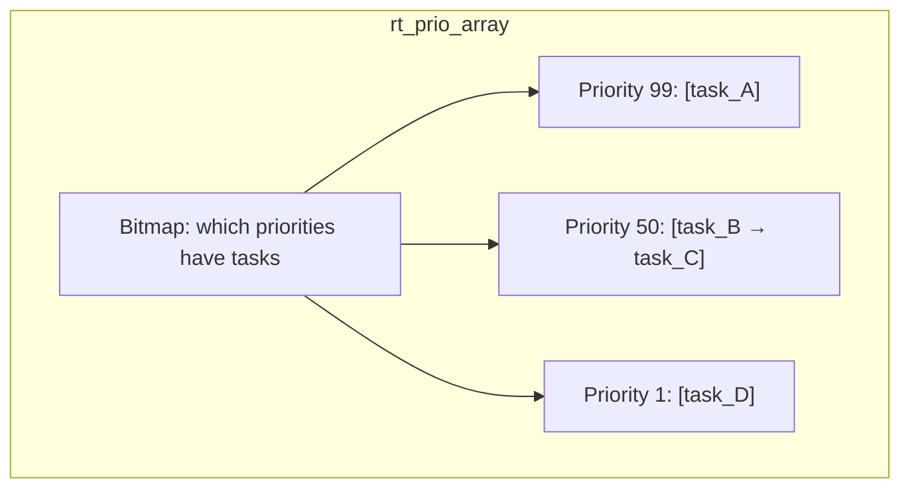
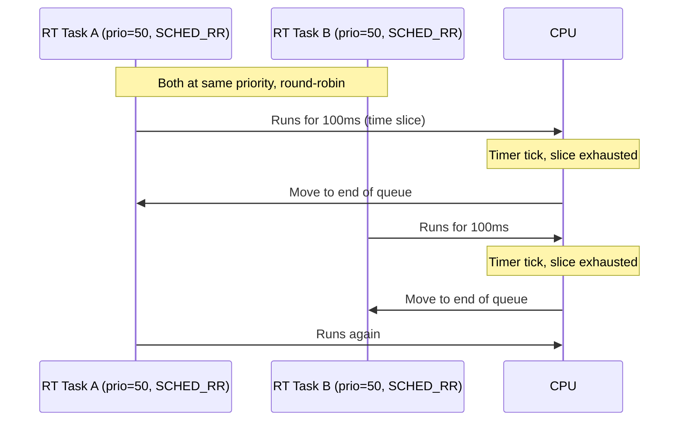
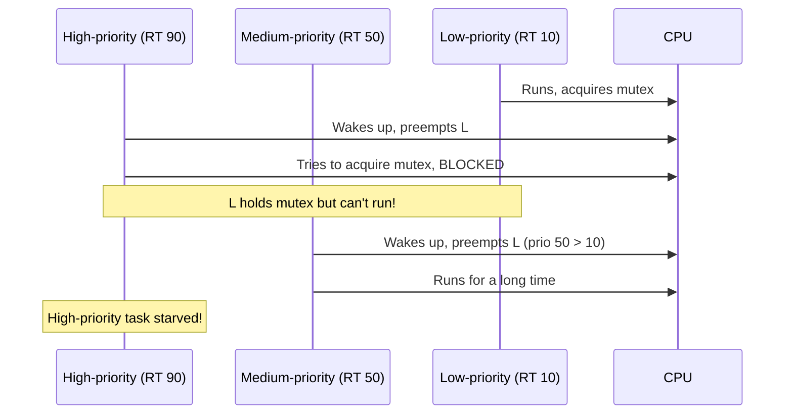
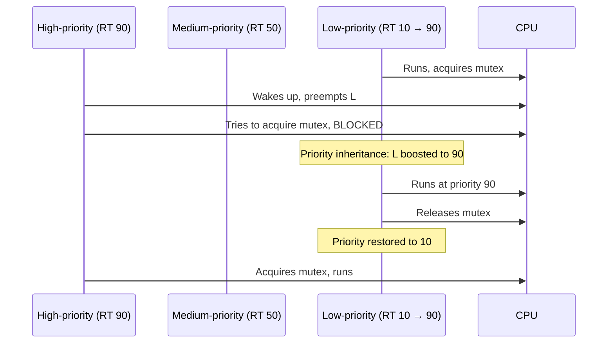
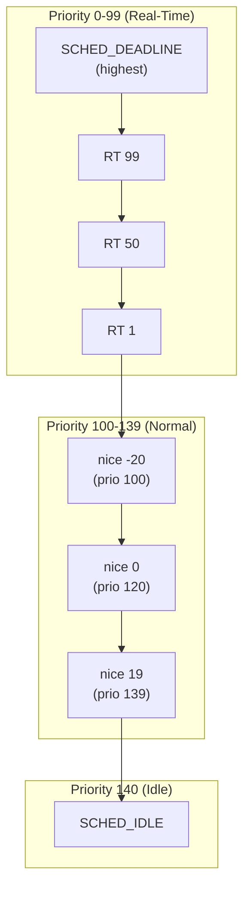

# Real-Time Scheduling in Linux

## Introduction

Real-time scheduling in Linux provides deterministic, low-latency scheduling for tasks with strict timing requirements. Linux implements three real-time scheduling policies: **SCHED_FIFO** (first-in-first-out), **SCHED_RR** (round-robin), and **SCHED_DEADLINE** (earliest deadline first). These policies are handled by the `rt_sched_class` and `dl_sched_class` scheduling classes, which always have higher priority than the fair scheduling class (CFS/EEVDF).

It's important to note that Linux is a **soft real-time** operating system by default. While it provides real-time scheduling policies, it doesn't guarantee hard deadlines. The `PREEMPT_RT` patchset makes Linux suitable for hard real-time workloads by making most kernel code preemptible.

## SCHED_FIFO

### How It Works

`SCHED_FIFO` is a simple real-time scheduling policy. Tasks run until they voluntarily yield, block, or are preempted by a higher-priority real-time task. There is no time slicing — a `SCHED_FIFO` task will run forever if it doesn't block.

```c
/* kernel/sched/rt.c */
static void enqueue_task_rt(struct rq *rq, struct task_struct *p, int flags)
{
    struct sched_rt_entity *rt_se = &p->rt;

    /* Add to the per-priority linked list */
    enqueue_rt_entity(rt_se, flags);

    /* If highest priority, need to reschedule */
    if (!task_current(rq, p) && p->prio < rq->curr->prio)
        resched_curr(rq);
}

static struct task_struct *pick_next_task_rt(struct rq *rq)
{
    struct sched_rt_entity *rt_se;
    struct rt_rq *rt_rq = &rq->rt;
    struct task_struct *p;

    /* Find highest priority RT task */
    rt_se = pick_next_rt_entity(rt_rq);
    if (!rt_se)
        return NULL;

    p = rt_task_of(rt_se);
    return p;
}
```

### Priority Levels

Real-time priorities range from 1 to 99 (higher number = higher priority):

```bash
# View RT priority range
$ chrt -m
SCHED_FIFO max priority is 99
SCHED_RR max priority is 99
SCHED_DEADLINE min priority is 0

# Set SCHED_FIFO priority
$ chrt -f -p 50 1234

# View all RT tasks
$ ps -eo pid,cls,ni,rtprio,comm | grep -E "(FF|RR)"
  PID CLS  NI RTPRIO COMMAND
    3  FF   -     99 migration/0
   12  FF   -     99 watchdog/0
  500  FF   -     50 my_rt_app
```

### RT Run Queue

Each priority level has its own queue (a linked list):

```c
/* kernel/sched/sched.h */
struct rt_prio_array {
    DECLARE_BITMAP(bitmap, MAX_RT_PRIO + 1);  /* Bitmap for non-empty queues */
    struct list_head queue[MAX_RT_PRIO];       /* Per-priority queues */
};

struct rt_rq {
    struct rt_prio_array active;    /* Active RT tasks */
    unsigned int rt_nr_running;
    unsigned int rr_nr_running;     /* SCHED_RR tasks specifically */
    /* ... */
};
```



The bitmap allows O(1) finding of the highest priority with a runnable task:

```c
/* Find highest priority RT task */
static struct sched_rt_entity *pick_next_rt_entity(struct rt_rq *rt_rq)
{
    struct rt_prio_array *array = &rt_rq->active;
    int idx;

    /* Find first set bit (highest priority with tasks) */
    idx = sched_find_first_bit(array->bitmap);
    BUG_ON(idx >= MAX_RT_PRIO);

    /* Return first task in that priority's queue */
    return list_first_entry(&array->queue[idx],
                            struct sched_rt_entity, run_list);
}
```

## SCHED_RR

### Round-Robin Among Equals

`SCHED_RR` is identical to `SCHED_FIFO` except it adds **time slicing** between tasks of equal priority. Each `SCHED_RR` task gets a time quantum (default 100ms), after which it's moved to the end of its priority queue.

```c
/* kernel/sched/rt.c */
static void task_tick_rt(struct rq *rq, struct task_struct *p, int queued)
{
    struct sched_rt_entity *rt_se = &p->rt;

    /* Only SCHED_RR gets time slicing */
    if (p->policy != SCHED_RR)
        return;

    /* Decrement time slice */
    if (--p->rt.time_slice)
        return;  /* Still has time */

    /* Reset time slice */
    p->rt.time_slice = sched_rr_timeslice;

    /* Move to end of priority queue */
    list_move_tail(&rt_se->run_list, &rq->rt.active.queue[p->prio]);

    /* Reschedule */
    set_tsk_need_resched(p);
}
```

```bash
# Default RR time slice
$ cat /proc/sys/kernel/sched_rr_timeslice_ms
100

# Change RR time slice (in milliseconds)
$ sysctl -w kernel.sched_rr_timeslice_ms=50
```



## SCHED_DEADLINE

### Earliest Deadline First

`SCHED_DEADLINE` implements **Earliest Deadline First (EDF)** scheduling with **Constant Bandwidth Server (CBS)**. It's the most sophisticated real-time scheduling policy in Linux, suitable for tasks with periodic deadlines.

Each `SCHED_DEADLINE` task specifies three parameters:
- **Runtime** (`runtime`) — Maximum CPU time needed per period
- **Deadline** (`deadline`) — Time by which the task must complete
- **Period** (`period`) — Repetition interval

```c
/* include/uapi/linux/sched/types.h */
struct sched_attr {
    __u32 size;
    __u32 sched_policy;
    __u64 sched_flags;
    __s32 sched_nice;
    __u32 sched_priority;
    /* SCHED_DEADLINE fields: */
    __u64 sched_runtime;
    __u64 sched_deadline;
    __u64 sched_period;
};
```

### Admissibility Test

Before accepting a `SCHED_DEADLINE` task, the kernel checks if the system can meet all deadlines:

```
∑(runtime_i / period_i) ≤ n_CPUs
```

This is the **Liu & Layland utilization bound** test:

```c
/* kernel/sched/deadline.c */
static int dl_overflow(struct task_struct *p, int policy,
                       struct sched_attr *attr)
{
    struct dl_bw *dl_b = dl_bw_of(task_cpu(p));
    u64 new_bw = attr->sched_runtime * SCHED_CAPACITY_SCALE /
                  attr->sched_period;

    /* Check if adding this task would exceed CPU capacity */
    if (dl_b->bw + new_bw > dl_b->total_bw)
        return -1;  /* Not admissible */

    return 0;  /* Admissible */
}
```

### Deadline Run Queue

```c
/* kernel/sched/sched.h */
struct dl_rq {
    /* Ordered by deadline (earliest first) */
    struct rb_root_cached root;
    unsigned long dl_nr_migratory;
    unsigned long dl_nr_total;

    /* Bandwidth management */
    struct dl_bw dl_bw;
    struct dl_bw this_bw;  /* This CPU's bandwidth */
};

struct sched_dl_entity {
    struct rb_node rb_node;         /* Run queue node */
    u64 dl_runtime;                  /* Maximum runtime per period */
    u64 dl_deadline;                 /* Relative deadline */
    u64 dl_period;                   /* Absolute period */
    u64 dl_bw;                       /* Bandwidth (runtime/period) */

    u64 runtime;                     /* Remaining runtime in this period */
    u64 deadline;                    /* Absolute deadline */

    /* ... */
};
```

```bash
# Set SCHED_DEADLINE policy
# (runtime=1ms, deadline=5ms, period=10ms)
$ chrt -d --sched-runtime 1000000 --sched-deadline 5000000 \
         --sched-period 10000000 0 ./my_deadline_task

# View deadline tasks
$ cat /proc/$PID/sched
my_deadline_task (1234, #threads: 1)
-------------------------------------------------------------------
policy : SCHED_DEADLINE
prio : 98
dl_runtime : 1000000
dl_deadline : 5000000
dl_period : 10000000
```

### EDF Scheduling Decision

```c
/* kernel/sched/deadline.c */
static struct task_struct *pick_next_task_dl(struct rq *rq)
{
    struct dl_rq *dl_rq = &rq->dl;
    struct sched_dl_entity *dl_se;
    struct task_struct *p;

    /* Pick the task with the earliest deadline */
    dl_se = __pick_first_dl_entity(dl_rq);
    if (!dl_se)
        return NULL;

    p = dl_task_of(dl_se);
    set_next_task_dl(rq, p, true);

    return p;
}
```

## Priority Inversion

### The Problem

Priority inversion occurs when a high-priority task is blocked waiting for a resource held by a low-priority task, while a medium-priority task preempts the low-priority task:



### Priority Inheritance

Linux implements **priority inheritance** to solve priority inversion. When a high-priority task blocks on a mutex held by a low-priority task, the low-priority task temporarily inherits the high priority:

```c
/* kernel/locking/rtmutex.c */
static int rt_mutex_adjust_prio_chain(struct task_struct *task,
                                       int reason,
                                       struct rt_mutex *lock,
                                       struct rt_mutex_waiter *waiter,
                                       struct task_struct *top_task)
{
    /* Walk the chain of lock dependencies */
    /* If task is blocked by lower-priority owner,
     * boost the owner's priority */

    if (task->prio > top_task->prio) {
        /* Boost: set task's priority to top_task's priority */
        rt_mutex_setprio(task, top_task->prio);
    }
    /* ... */
}
```



### The `PREEMPT_RT` Patch

The `PREEMPT_RT` patchset makes Linux fully preemptible, which is essential for hard real-time:

```bash
# Check if PREEMPT_RT is enabled
$ uname -v
# Look for "PREEMPT_RT" in version string

$ cat /sys/kernel/realtime
1

# Check preemption model
$ cat /sys/kernel/debug/sched_debug | grep "preempt"
```

Key changes in `PREEMPT_RT`:
- **Spinlocks become mutexes** — Most spinlocks are converted to sleeping locks
- **Interrupt handlers run as threads** — IRQ handlers are preemptible
- **Priority inheritance for all locks** — Including spinlocks and RCU

## Priority Range and Inheritance

### Full Priority Picture



### Priority Mapping

```c
/* include/linux/sched/prio.h */
#define MAX_RT_PRIO         100
#define MAX_PRIO            (MAX_RT_PRIO + NICE_WIDTH)  /* 140 */
#define DEFAULT_PRIO        (MAX_RT_PRIO + NICE_WIDTH / 2)  /* 120 */

/* Convert nice to priority */
#define NICE_TO_PRIO(nice)  ((nice) + DEFAULT_PRIO)

/* Convert priority to nice */
#define PRIO_TO_NICE(prio)  ((prio) - DEFAULT_PRIO)

/* Check if a task is real-time */
static inline int rt_policy(int policy)
{
    return policy == SCHED_FIFO || policy == SCHED_RR || policy == SCHED_DEADLINE;
}

static inline int task_has_rt_policy(struct task_struct *p)
{
    return rt_policy(p->policy);
}
```

## RT Bandwidth Management

### Limiting RT Task CPU Usage

By default, real-time tasks can consume 95% of CPU time, leaving 5% for system management:

```bash
# RT bandwidth (default: 950000us per 1000000us period = 95%)
$ cat /proc/sys/kernel/sched_rt_period_us
1000000
$ cat /proc/sys/kernel/sched_rt_runtime_us
950000

# Allow RT tasks to use 100% (dangerous!)
$ sysctl -w kernel.sched_rt_runtime_us=-1

# Limit RT tasks to 50% CPU
$ sysctl -w kernel.sched_rt_runtime_us=500000
```

```c
/* kernel/sched/rt.c */
static int do_sched_rt_period_timer(struct rt_bandwidth *rt_b, int overrun)
{
    /* Refill RT bandwidth */
    /* Throttle/unthrottle RT tasks as needed */
}
```

## Practical Examples

### Creating a Real-Time Task

```c
#define _GNU_SOURCE
#include <sched.h>
#include <stdio.h>
#include <stdlib.h>
#include <unistd.h>
#include <sys/mman.h>

int main(void) {
    struct sched_param param;
    struct sched_attr attr;

    /* Lock memory to prevent page faults */
    mlockall(MCL_CURRENT | MCL_FUTURE);

    /* Set SCHED_FIFO with priority 80 */
    param.sched_priority = 80;
    if (sched_setscheduler(0, SCHED_FIFO, &param) == -1) {
        perror("sched_setscheduler");
        return 1;
    }

    printf("Running as SCHED_FIFO, priority %d\n", param.sched_priority);

    /* Verify */
    printf("Policy: %d (FIFO=%d, RR=%d)\n",
           sched_getscheduler(0), SCHED_FIFO, SCHED_RR);

    /* Run real-time loop */
    while (1) {
        /* Do time-critical work */
        /* ... */
        usleep(1000);  /* Sleep 1ms */
    }

    return 0;
}
```

### Using SCHED_DEADLINE

```c
#define _GNU_SOURCE
#include <linux/sched.h>
#include <sys/syscall.h>
#include <unistd.h>
#include <stdio.h>

int main(void) {
    struct sched_attr attr = {
        .size = sizeof(attr),
        .sched_policy = SCHED_DEADLINE,
        .sched_runtime = 1000000,    /* 1ms */
        .sched_deadline = 5000000,   /* 5ms */
        .sched_period = 10000000,    /* 10ms */
    };

    if (syscall(SYS_sched_setattr, 0, &attr, 0) == -1) {
        perror("sched_setattr");
        return 1;
    }

    /* This task now runs as SCHED_DEADLINE
     * It will get 1ms of CPU every 10ms period,
     * guaranteed to finish by the 5ms deadline */

    while (1) {
        /* Deadline-driven work */
        /* ... */
    }
    return 0;
}
```

### Monitoring Real-Time Tasks

```bash
# Watch RT task behavior
$ sudo cyclictest -p 90 -i 1000 -l 10000
# Measures scheduling latency for RT task

# Trace RT scheduling events
$ sudo perf trace -e 'sched:sched_switch' --filter 'prev_prio < 100 || next_prio < 100'

# Show RT throttling
$ cat /proc/sched_debug | grep -A 5 "rt_rq"
rt_rq[0]:
  rt_nr_running: 1
  rt_throttled: 0
  rt_time: 0.000000
  rt_runtime: 950.000000
```

## Limitations and Caveats

1. **Not hard real-time** — Without `PREEMPT_RT`, Linux can't guarantee hard deadlines
2. **RT throttling** — Default 95% cap prevents RT tasks from starving the system
3. **Priority inversion** — While mitigated, it can still occur with complex lock chains
4. **Non-preemptible kernel sections** — Long non-preemptible sections can cause latency spikes
5. **Interrupt handling** — IRQ handlers can delay RT tasks (mitigated by `PREEMPT_RT`)

## Further Reading

- [Linux man pages: sched(7)](https://man7.org/linux/man-pages/man7/sched.7.html)
- [Linux kernel: kernel/sched/rt.c](https://elixir.bootlin.com/linux/latest/source/kernel/sched/rt.c)
- [Linux kernel: kernel/sched/deadline.c](https://elixir.bootlin.com/linux/latest/source/kernel/sched/deadline.c)
- [PREEMPT_RT wiki](https://wiki.linuxfoundation.org/realtime/start)
- [LWN: Deadline scheduling](https://lwn.net/Articles/575497/)
- [Linux kernel documentation: Real-Time group scheduling](https://www.kernel.org/doc/html/latest/scheduler/sched-rt-group.html)
- [Robert Love: Linux Kernel Development - Process Scheduling](https://www.oreilly.com/library/view/linux-kernel-development/9780768696974/)

## Related Topics

- [Scheduler Overview](scheduler.md) — Overall scheduling architecture
- [CFS Internals](cfs.md) — Fair scheduling for normal tasks
- [EEVDF Scheduler](eevdf.md) — The new fair scheduler
- [Context Switching](context-switching.md) — How task switches work
- [Process States](process-states.md) — How RT tasks transition between states
- [Signals](signals.md) — Signal delivery to real-time tasks
