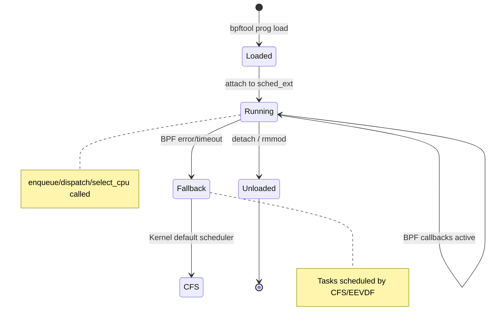
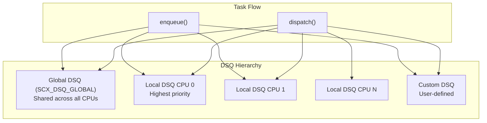
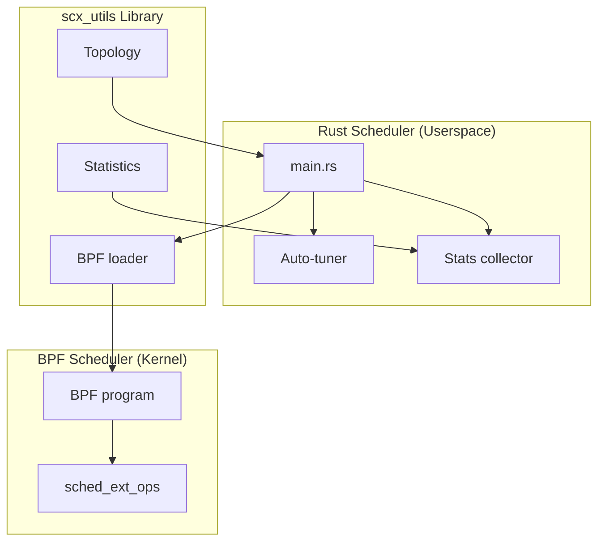
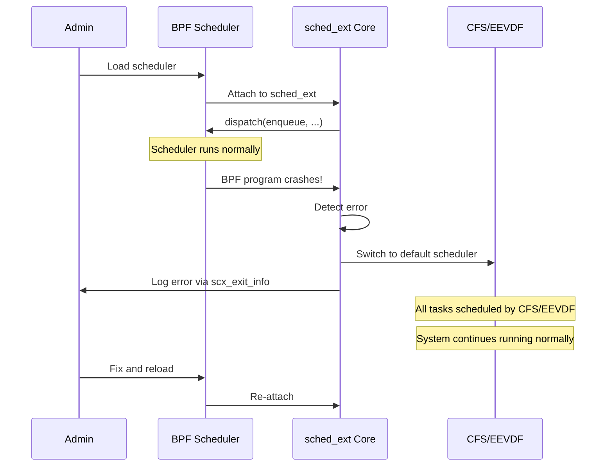

# sched_ext Practical Guide: BPF Scheduler Development

## Introduction

This guide covers practical development of BPF-based CPU schedulers using the sched_ext framework. It builds on the [sched_ext overview](./sched-ext.md) with hands-on programming patterns, real scheduler architectures, and deployment strategies.

sched_ext allows you to write CPU schedulers as BPF programs, load them at runtime, and fall back to the kernel default if the BPF scheduler crashes or is unloaded. This makes it possible to iterate on scheduling policies for specific workloads — gaming, databases, microservices, real-time — without recompiling or rebooting the kernel.

> **Kernel version:** Linux 6.12+  
> **Source:** `kernel/sched/ext.c`, `tools/sched_ext/`  
> **Repo:** [github.com/sched-ext/scx](https://github.com/sched-ext/scx)

---

## Development Environment Setup

### Prerequisites

```bash
# Kernel requirements
CONFIG_SCHED_CLASS_EXT=y
CONFIG_BPF=y
CONFIG_BPF_SYSCALL=y
CONFIG_BPF_JIT=y
CONFIG_DEBUG_INFO_BTF=y

# Userspace tools
sudo apt install clang llvm libbpf-dev linux-headers-$(uname -r)

# Rust-based schedulers (scx_rusty, scx_lavd, etc.)
curl --proto '=https' --tlsv1.2 -sSf https://sh.rustup.rs | sh
sudo apt install libelf-dev

# Clone the scx repository
git clone https://github.com/sched-ext/scx.git
cd scx
cargo build --release
```

### Verify sched_ext Support

```bash
# Check kernel support
$ cat /proc/config.gz | gunzip | grep SCHED_CLASS_EXT
CONFIG_SCHED_CLASS_EXT=y

# Check BTF (required for CO-RE)
$ bpftool feature probe kernel | grep btf
btf: yes

# Check if sched_ext is available
$ ls /sys/kernel/sched_ext/
enable  root

# Enable sched_ext
$ echo 1 > /sys/kernel/sched_ext/enable
```

---

## Core BPF Scheduler Structure

### Minimal Scheduler Template

```c
// SPDX-License-Identifier: GPL-2.0
/* minimal_sched.bpf.c — Minimal sched_ext scheduler */

#include <scx/common.bpf.h>

char _license[] SEC("license") = "GPL";

/*
 * Called when a task becomes runnable (e.g., wake up, fork).
 * Dispatch it to a dispatch queue (DSQ).
 */
void BPF_STRUCT_OPS(minimal_enqueue, struct task_struct *p, u64 enq_flags)
{
    scx_bpf_dispatch(p, SCX_DSQ_GLOBAL, SCX_SLICE_DFL, enq_flags);
}

/*
 * Called when a CPU needs a new task to run.
 * Consume from the CPU's local DSQ first, then global.
 */
void BPF_STRUCT_OPS(minimal_dispatch, s32 cpu, struct task_struct *prev)
{
    scx_bpf_consume(SCX_DSQ_LOCAL);
}

/*
 * Called to select which CPU a task should run on.
 * Default: use the built-in CPU selection.
 */
s32 BPF_STRUCT_OPS(minimal_select_cpu, struct task_struct *p,
                    s32 prev_cpu, u64 wake_flags)
{
    return scx_bpf_select_cpu_dfl(p, prev_cpu, wake_flags);
}

/*
 * Called when the scheduler is loaded.
 * Return 0 on success.
 */
s32 BPF_STRUCT_OPS_SLEEPABLE(minimal_init)
{
    return 0;
}

/*
 * Called when the scheduler is unloaded.
 */
void BPF_STRUCT_OPS(minimal_exit, struct scx_exit_info *ei)
{
}

SCX_OPS_DEFINE(minimal_ops,
               .enqueue   = (void *)minimal_enqueue,
               .dispatch  = (void *)minimal_dispatch,
               .select_cpu = (void *)minimal_select_cpu,
               .init      = (void *)minimal_init,
               .exit      = (void *)minimal_exit,
               .name      = "minimal");
```

### Scheduler Lifecycle



---

## Dispatch Queue (DSQ) Architecture

### DSQ Types and Usage



### DSQ Operations

```c
/* Dispatch task to a specific DSQ */
scx_bpf_dispatch(p, SCX_DSQ_GLOBAL, SCX_SLICE_DFL, enq_flags);

/* Dispatch to CPU-local DSQ */
scx_bpf_dispatch(p, SCX_DSQ_LOCAL, SCX_SLICE_DFL, enq_flags);

/* Dispatch to custom DSQ (by DSQ ID) */
scx_bpf_dispatch(p, my_dsq_id, SCX_SLICE_DFL, enq_flags);

/* Consume from a DSQ (in dispatch callback) */
scx_bpf_consume(SCX_DSQ_LOCAL);
scx_bpf_consume(SCX_DSQ_GLOBAL);
scx_bpf_consume(my_dsq_id);

/* Create custom DSQ (in init callback) */
scx_bpf_create_dsq(my_dsq_id, numa_node);
```

### DSQ Selection Strategy

```c
/*
 * Typical dispatch priority:
 * 1. Try local DSQ (fastest, no lock contention)
 * 2. Try custom per-cgroup/per-priority DSQ
 * 3. Fall back to global DSQ
 */
void BPF_STRUCT_OPS(my_dispatch, s32 cpu, struct task_struct *prev)
{
    /* Local first */
    if (scx_bpf_consume(SCX_DSQ_LOCAL))
        return;

    /* Custom DSQ for this CPU's cgroup */
    if (scx_bpf_consume(cpu_to_dsq[cpu]))
        return;

    /* Global fallback */
    scx_bpf_consume(SCX_DSQ_GLOBAL);
}
```

---

## CPU Selection Strategies

### Built-in Selection

```c
/*
 * scx_bpf_select_cpu_dfl() implements the default strategy:
 * 1. If task is pinned to a CPU, use that CPU
 * 2. If task has idle sibling, prefer it
 * 3. Use previous CPU if idle
 * 4. Use any idle CPU in same LLC domain
 * 5. Fall back to previous CPU
 */
s32 BPF_STRUCT_OPS(my_select_cpu, struct task_struct *p,
                    s32 prev_cpu, u64 wake_flags)
{
    return scx_bpf_select_cpu_dfl(p, prev_cpu, wake_flags);
}
```

### Custom CPU Selection

```c
/* NUMA-aware CPU selection */
s32 BPF_STRUCT_OPS(numa_select_cpu, struct task_struct *p,
                    s32 prev_cpu, u64 wake_flags)
{
    s32 cpu;

    /* Try to keep task on same NUMA node as its memory */
    int node = bpf_get_numa_node(p);

    /* Find idle CPU on preferred NUMA node */
    cpu = scx_bpf_select_cpu_dfl(p, prev_cpu, wake_flags);
    if (cpu >= 0)
        return cpu;

    /* Fall back to any idle CPU */
    return prev_cpu;
}

/* Per-task CPU affinity hint */
struct {
    __uint(type, BPF_MAP_TYPE_HASH);
    __uint(max_entries, 1024);
    __type(key, u32);           /* PID */
    __type(value, s32);         /* Preferred CPU */
} cpu_hint SEC(".maps");

s32 BPF_STRUCT_OPS(hint_select_cpu, struct task_struct *p,
                    s32 prev_cpu, u64 wake_flags)
{
    u32 pid = p->pid;
    s32 *hint = bpf_map_lookup_elem(&cpu_hint, &pid);

    if (hint && *hint >= 0) {
        /* Check if preferred CPU is idle */
        if (scx_bpf_test_and_clear_cpu_idle(*hint))
            return *hint;
    }

    return scx_bpf_select_cpu_dfl(p, prev_cpu, wake_flags);
}
```

---

## Scheduler Patterns

### Pattern 1: Priority-Based Scheduler

```c
/* Priority scheduler with per-priority DSQs */
#include <scx/common.bpf.h>

#define NUM_PRIORITIES 8
#define MAX_TASKS 65536

/* Per-priority dispatch queues */
u64 prio_dsq[NUM_PRIORITIES];

/* Task priority map */
struct {
    __uint(type, BPF_MAP_TYPE_HASH);
    __uint(max_entries, MAX_TASKS);
    __type(key, u32);       /* PID */
    __type(value, u32);     /* Priority (0=highest) */
} task_prio SEC(".maps");

char _license[] SEC("license") = "GPL";

s32 BPF_STRUCT_OPS(prio_init)
{
    for (int i = 0; i < NUM_PRIORITIES; i++) {
        prio_dsq[i] = i + 1;  /* DSQ IDs start at 1 */
        scx_bpf_create_dsq(prio_dsq[i], -1);
    }
    return 0;
}

void BPF_STRUCT_OPS(prio_enqueue, struct task_struct *p, u64 enq_flags)
{
    u32 pid = p->pid;
    u32 *prio = bpf_map_lookup_elem(&task_prio, &pid);
    u32 dsq_idx = prio ? *prio : NUM_PRIORITIES - 1;

    if (dsq_idx >= NUM_PRIORITIES)
        dsq_idx = NUM_PRIORITIES - 1;

    /* Higher priority (lower number) → longer time slice */
    u64 slice = SCX_SLICE_DFL * (NUM_PRIORITIES - dsq_idx);

    scx_bpf_dispatch(p, prio_dsq[dsq_idx], slice, enq_flags);
}

void BPF_STRUCT_OPS(prio_dispatch, s32 cpu, struct task_struct *prev)
{
    /* Consume from highest priority DSQ first */
    for (int i = 0; i < NUM_PRIORITIES; i++) {
        if (scx_bpf_consume(prio_dsq[i]))
            return;
    }
}

SCX_OPS_DEFINE(prio_ops,
               .init      = (void *)prio_init,
               .enqueue   = (void *)prio_enqueue,
               .dispatch  = (void *)prio_dispatch,
               .name      = "priority");
```

### Pattern 2: Latency-Aware Scheduler

```c
/* Latency-sensitive scheduler: short tasks get priority */
#include <scx/common.bpf.h>

#define LATENCY_DSQ  1
#define NORMAL_DSQ   2
#define LATENCY_THRESHOLD_NS  1000000  /* 1ms */

char _license[] SEC("license") = "GPL";

/* Track task runtime */
struct {
    __uint(type, BPF_MAP_TYPE_TASK_STORAGE);
    __uint(map_flags, BPF_F_NO_PREALLOC);
    __type(key, int);
    __type(value, u64);
} task_runtime SEC(".maps");

s32 BPF_STRUCT_OPS(latency_init)
{
    scx_bpf_create_dsq(LATENCY_DSQ, -1);
    scx_bpf_create_dsq(NORMAL_DSQ, -1);
    return 0;
}

void BPF_STRUCT_OPS(latency_enqueue, struct task_struct *p, u64 enq_flags)
{
    u64 *runtime = bpf_task_storage_get(&task_runtime, p, 0, 0);
    u64 run_ns = runtime ? *runtime : 0;

    if (run_ns < LATENCY_THRESHOLD_NS) {
        /* Short task: prioritize */
        scx_bpf_dispatch(p, LATENCY_DSQ, SCX_SLICE_DFL / 4, enq_flags);
    } else {
        /* Long task: normal scheduling */
        scx_bpf_dispatch(p, NORMAL_DSQ, SCX_SLICE_DFL, enq_flags);
    }
}

void BPF_STRUCT_OPS(latency_dispatch, s32 cpu, struct task_struct *prev)
{
    /* Always try latency queue first */
    if (scx_bpf_consume(LATENCY_DSQ))
        return;
    scx_bpf_consume(NORMAL_DSQ);
}

void BPF_STRUCT_OPS(latency_running, struct task_struct *p)
{
    u64 *runtime = bpf_task_storage_get(&task_runtime, p,
                                         BPF_LOCAL_STORAGE_GET_F_CREATE, 0);
    if (runtime)
        *runtime = 0;  /* Reset on schedule-in */
}

void BPF_STRUCT_OPS(latency_stopping, struct task_struct *p)
{
    u64 *runtime = bpf_task_storage_get(&task_runtime, p, 0, 0);
    if (runtime)
        *runtime += SCX_SLICE_DFL;  /* Accumulate runtime */
}

SCX_OPS_DEFINE(latency_ops,
               .init      = (void *)latency_init,
               .enqueue   = (void *)latency_enqueue,
               .dispatch  = (void *)latency_dispatch,
               .running   = (void *)latency_running,
               .stopping  = (void *)latency_stopping,
               .name      = "latency-aware");
```

### Pattern 3: Cgroup-Aware Scheduler

```c
/* Per-cgroup scheduling with weighted fairness */
#include <scx/common.bpf.h>

#define MAX_CGROUPS 256

char _license[] SEC("license") = "GPL";

/* Per-cgroup DSQs */
u64 cgroup_dsq[MAX_CGROUPS];

/* Cgroup weights (higher = more CPU) */
struct {
    __uint(type, BPF_MAP_TYPE_HASH);
    __uint(max_entries, MAX_CGROUPS);
    __type(key, u32);       /* cgroup ID */
    __type(value, u64);     /* weight (1-10000, default 100) */
} cgroup_weight SEC(".maps");

/* Per-cgroup vruntime tracking */
struct {
    __uint(type, BPF_MAP_TYPE_HASH);
    __uint(max_entries, MAX_CGROUPS);
    __type(key, u32);
    __type(value, u64);
} cgroup_vruntime SEC(".maps");

s32 BPF_STRUCT_OPS(cgrp_init)
{
    for (int i = 0; i < MAX_CGROUPS; i++) {
        cgroup_dsq[i] = i + 1;
        scx_bpf_create_dsq(cgroup_dsq[i], -1);
    }
    return 0;
}

void BPF_STRUCT_OPS(cgrp_enqueue, struct task_struct *p, u64 enq_flags)
{
    u32 cgid = scx_bpf_task_cgroup_id(p);
    if (cgid >= MAX_CGROUPS)
        cgid = 0;

    /* Weighted time slice */
    u64 *weight = bpf_map_lookup_elem(&cgroup_weight, &cgid);
    u64 w = weight ? *weight : 100;
    u64 slice = SCX_SLICE_DFL * 100 / w;

    scx_bpf_dispatch(p, cgroup_dsq[cgid], slice, enq_flags);
}

void BPF_STRUCT_OPS(cgrp_dispatch, s32 cpu, struct task_struct *prev)
{
    /* Find cgroup with lowest vruntime */
    u32 best_cgid = 0;
    u64 min_vruntime = U64_MAX;

    for (int i = 0; i < MAX_CGROUPS; i++) {
        u64 *vr = bpf_map_lookup_elem(&cgroup_vruntime, &i);
        if (vr && *vr < min_vruntime) {
            min_vruntime = *vr;
            best_cgid = i;
        }
    }

    if (scx_bpf_consume(cgroup_dsq[best_cgid]))
        return;

    scx_bpf_consume(SCX_DSQ_GLOBAL);
}

SCX_OPS_DEFINE(cgrp_ops,
               .init      = (void *)cgrp_init,
               .enqueue   = (void *)cgrp_enqueue,
               .dispatch  = (void *)cgrp_dispatch,
               .name      = "cgroup-aware");
```

---

## Rust-Based Schedulers (scx_utils)

### Architecture



### scx_rusty: NUMA-Aware Scheduler

```rust
// Simplified scx_rusty architecture
use scx_utils::ScxOps;

struct RustyScheduler {
    // Per-domain (NUMA node) state
    domains: Vec<Domain>,
    // BPF skeleton
    skel: RustySkel,
}

struct Domain {
    id: u32,
    cpus: Vec<u32>,
    load: AtomicU64,
    dsq_id: u64,
}

impl ScxOps for RustyScheduler {
    fn enqueue(&mut self, task: &TaskInfo) -> Action {
        // Select domain based on task's NUMA affinity
        let domain = self.select_domain(task);
        // Dispatch to domain's DSQ
        Action::Dispatch(domain.dsq_id, task.weight_to_slice())
    }

    fn dispatch(&mut self, cpu: u32) -> Option<u32> {
        // Try local domain first
        let local_domain = self.cpu_to_domain(cpu);
        if self.consume_dsq(local_domain.dsq_id) {
            return Some(cpu);
        }
        // Steal from busiest domain
        let busiest = self.find_busiest_domain();
        self.consume_dsq(busiest.dsq_id)
    }

    fn select_cpu(&mut self, task: &TaskInfo) -> i32 {
        // Find idle CPU in preferred domain
        let domain = self.select_domain(task);
        domain.find_idle_cpu().unwrap_or(task.prev_cpu)
    }
}
```

### Building a Rust Scheduler

```toml
# Cargo.toml for a custom scheduler
[package]
name = "scx_custom"
version = "0.1.0"
edition = "2021"

[dependencies]
scx-utils = { path = "../rust/scx_utils" }
scx-rustflake = { path = "../rust/scx_rustflake" }
anyhow = "1.0"
clap = { version = "4.0", features = ["derive"] }
libbpf-rs = "0.22"
```

```rust
// src/main.rs
use anyhow::Result;
use clap::Parser;
use scx_utils::ScxBuilder;

#[derive(Parser)]
struct Args {
    /// Enable verbose logging
    #[arg(short, long)]
    verbose: bool,

    /// Time slice in microseconds
    #[arg(short, long, default_value = "5000")]
    slice_us: u64,
}

fn main() -> Result<()> {
    let args = Args::parse();

    // Load BPF skeleton
    let mut skel = ScxBuilder::new()
        .ops_name("custom_sched")
        .slice_us(args.slice_us)
        .build()?;

    // Attach and run
    println!("Starting custom scheduler...");
    skel.attach()?;

    loop {
        // Monitor and auto-tune
        std::thread::sleep(std::time::Duration::from_secs(1));
        if args.verbose {
            skel.print_stats();
        }
    }
}
```

---

## Advanced Topics

### Timer-Based Preemption

```c
/* Implement cooperative preemption via timers */
#include <scx/common.bpf.h>

char _license[] SEC("license") = "GPL";

/* Timer for periodic preemption check */
struct {
    __uint(type, BPF_MAP_TYPE_HASH);
    __uint(max_entries, 4096);
    __type(key, u32);       /* CPU ID */
    __type(value, u64);     /* Timer expiry */
} preempt_timers SEC(".maps");

void BPF_STRUCT_OPS(preempt_running, struct task_struct *p)
{
    /* Record when task started running */
    u32 cpu = bpf_get_smp_processor_id();
    u64 now = bpf_ktime_get_ns();
    bpf_map_update_elem(&preempt_timers, &cpu, &now, BPF_ANY);
}

void BPF_STRUCT_OPS(preempt_dispatch, s32 cpu, struct task_struct *prev)
{
    u64 *start = bpf_map_lookup_elem(&preempt_timers, &cpu);
    if (start) {
        u64 elapsed = bpf_ktime_get_ns() - *start;
        if (elapsed > 10000000) {  /* 10ms */
            /* Task has run long enough, check for higher-priority tasks */
            scx_bpf_dispatch(prev, SCX_DSQ_GLOBAL, SCX_SLICE_DFL, 0);
        }
    }
    scx_bpf_consume(SCX_DSQ_LOCAL);
}
```

### Load Balancing

```c
/* Cross-CPU load balancing via shared DSQs */
#include <scx/common.bpf.h>

#define MAX_CPUS 256

char _license[] SEC("license") = "GPL";

/* Per-CPU load counter */
struct {
    __uint(type, BPF_MAP_TYPE_PERCPU_ARRAY);
    __uint(max_entries, 1);
    __type(key, u32);
    __type(value, u64);
} cpu_load SEC(".maps");

/* Busy DSQ: overloaded CPUs push tasks here */
u64 busy_dsq;

s32 BPF_STRUCT_OPS(lb_init)
{
    busy_dsq = MAX_CPUS + 1;
    scx_bpf_create_dsq(busy_dsq, -1);
    return 0;
}

void BPF_STRUCT_OPS(lb_enqueue, struct task_struct *p, u64 enq_flags)
{
    u32 cpu = bpf_get_smp_processor_id();
    u32 key = 0;
    u64 *load = bpf_map_lookup_elem(&cpu_load, &key);

    if (load && *load > 100) {
        /* CPU overloaded: push to busy DSQ for other CPUs to steal */
        scx_bpf_dispatch(p, busy_dsq, SCX_SLICE_DFL, enq_flags);
        __sync_fetch_and_sub(load, 1);
    } else {
        scx_bpf_dispatch(p, SCX_DSQ_GLOBAL, SCX_SLICE_DFL, enq_flags);
        if (load)
            __sync_fetch_and_add(load, 1);
    }
}

void BPF_STRUCT_OPS(lb_dispatch, s32 cpu, struct task_struct *prev)
{
    /* Try local first */
    if (scx_bpf_consume(SCX_DSQ_LOCAL))
        return;

    /* Steal from busy queue */
    if (scx_bpf_consume(busy_dsq))
        return;

    scx_bpf_consume(SCX_DSQ_GLOBAL);
}

SCX_OPS_DEFINE(lb_ops,
               .init      = (void *)lb_init,
               .enqueue   = (void *)lb_enqueue,
               .dispatch  = (void *)lb_dispatch,
               .name      = "load-balancer");
```

---

## Deployment and Operations

### Loading a BPF Scheduler

```bash
# Method 1: Using bpftool directly
sudo bpftool prog load my_sched.bpf.o /sys/fs/bpf/my_sched
echo my_sched > /sys/kernel/sched_ext/ops

# Method 2: Using the scx_loader
sudo scx_loader --scheduler my_sched --args "--verbose"

# Method 3: Using a systemd service
sudo systemctl enable --now scx-custom.service
```

### Systemd Service Template

```ini
# /etc/systemd/system/scx-custom.service
[Unit]
Description=sched_ext Custom Scheduler
After=multi-user.target

[Service]
Type=simple
ExecStart=/usr/local/bin/scx_custom --verbose
Restart=on-failure
RestartSec=5

# Required capabilities
AmbientCapabilities=CAP_SYS_ADMIN CAP_BPF CAP_PERFMON
CapabilityBoundingSet=CAP_SYS_ADMIN CAP_BPF CAP_PERFMON

[Install]
WantedBy=multi-user.target
```

### Fallback Behavior



### Monitoring

```bash
# Check current scheduler
$ cat /sys/kernel/sched_ext/ops
# (empty = default, "my_sched" = custom)

# View sched_ext exit info (errors, crashes)
$ cat /sys/kernel/sched_ext/exit_info
# Shows: exit_code, exit_msg, flags

# sched_ext statistics
$ cat /proc/sched_ext/stats
nr_enqueued: 12345
nr_dispatched: 12340
nr_retries: 5

# Per-task scheduler info
$ cat /proc/1/sched
my_sched (0, 0)

# Trace sched_ext events
$ sudo trace-cmd record -e sched_ext
$ trace-cmd report

# BPF program stats
$ bpftool prog show name my_sched
```

---

## Real-World Schedulers

### scx_lavd (Gaming)

```bash
# Optimized for gaming/VR workloads
$ sudo scx_lavd

# Features:
# - Virtual deadline scheduling
# - Prioritizes latency-sensitive (foreground) tasks
# - Minimizes frame-time variance
# - Auto-detects interactive vs batch workloads
```

### scx_rusty (General Purpose)

```bash
# NUMA-aware, cgroup-aware scheduler
$ sudo scx_rusty

# Features:
# - Per-NUMA-node scheduling domains
# - Automatic load balancing across nodes
# - cgroup weight support
# - Written in Rust with userspace auto-tuner
```

### scx_layered (Multi-Workload)

```bash
# Layer-based scheduler for mixed workloads
$ sudo scx_layered --config layered.json

# Configurable layers:
# - Foreground (interactive): low latency
# - Background (batch): high throughput
# - System (kernel threads): minimal interference
```

---

## Debugging BPF Schedulers

### Verifier Errors

```bash
# Common BPF verifier issues:
# - Unbounded loops → use bounded loops or bpf_loop
# - Stack overflow → reduce stack usage, use maps
# - Invalid memory access → check bounds before access

# Load with verbose verifier output
$ sudo bpftool prog load my_sched.bpf.o /sys/fs/bpf/my_sched 2>&1
# Verifier errors shown with line numbers

# Check BPF program stats
$ bpftool prog show name my_sched
```

### Runtime Debugging

```c
/* Add debug tracing to BPF scheduler */
#include <scx/common.bpf.h>

/* Ring buffer for debug messages */
struct {
    __uint(type, BPF_MAP_TYPE_RINGBUF);
    __uint(max_entries, 256 * 1024);
} debug_ring SEC(".maps");

struct debug_event {
    u32 pid;
    u32 cpu;
    u64 ts;
    char comm[16];
};

void BPF_STRUCT_OPS(debug_enqueue, struct task_struct *p, u64 enq_flags)
{
    struct debug_event *evt;

    evt = bpf_ringbuf_reserve(&debug_ring, sizeof(*evt), 0);
    if (evt) {
        evt->pid = p->pid;
        evt->cpu = bpf_get_smp_processor_id();
        evt->ts = bpf_ktime_get_ns();
        bpf_probe_read_kernel_str(evt->comm, sizeof(evt->comm), p->comm);
        bpf_ringbuf_submit(evt, 0);
    }

    scx_bpf_dispatch(p, SCX_DSQ_GLOBAL, SCX_SLICE_DFL, enq_flags);
}
```

```bash
# Read debug events from userspace
$ sudo cat /sys/kernel/debug/tracing/trace_pipe
# Or use a custom reader for the ring buffer
```

---

## Best Practices

1. **Always handle fallback** — BPF schedulers can fail; the kernel falls back to CFS/EEVDF
2. **Test with realistic workloads** — synthetic benchmarks don't capture real scheduling patterns
3. **Monitor exit info** — check `/sys/kernel/sched_ext/exit_info` for errors
4. **Keep BPF programs simple** — verifier has complexity limits
5. **Use per-CPU maps** — avoid cross-CPU contention in hot paths
6. **Profile before optimizing** — use `perf` to identify scheduling bottlenecks
7. **Consider NUMA topology** — cross-NUMA scheduling is expensive
8. **Use time slices wisely** — too short = overhead, too long = latency
9. **Test fallback paths** — ensure graceful degradation when scheduler is unloaded
10. **Start with scx_utils** — the Rust framework handles BPF boilerplate

---

## References

- **sched_ext repository** — [github.com/sched-ext/scx](https://github.com/sched-ext/scx)
- **Kernel documentation** — `Documentation/scheduler/sched-ext.rst`
- **LWN: sched_ext** — [lwn.net/Articles/922405/](https://lwn.net/Articles/922405/)
- **LPC talks** — sched_ext design presentations
- **BPF documentation** — `Documentation/bpf/`
- **libbpf** — [libbpf.readthedocs.io](https://libbpf.readthedocs.io/)

## Related Topics

- [sched_ext Overview](./sched-ext.md) — Architecture and concepts
- [CFS](./cfs.md) — Completely Fair Scheduler
- [EEVDF](./eevdf.md) — EEVDF scheduler
- [eBPF](../debugging/ebpf.md) — BPF subsystem overview
- [NUMA Scheduling](./numa-scheduling.md) — NUMA-aware scheduling
- [Process Priorities](./priorities.md) — Nice values and scheduling priorities
