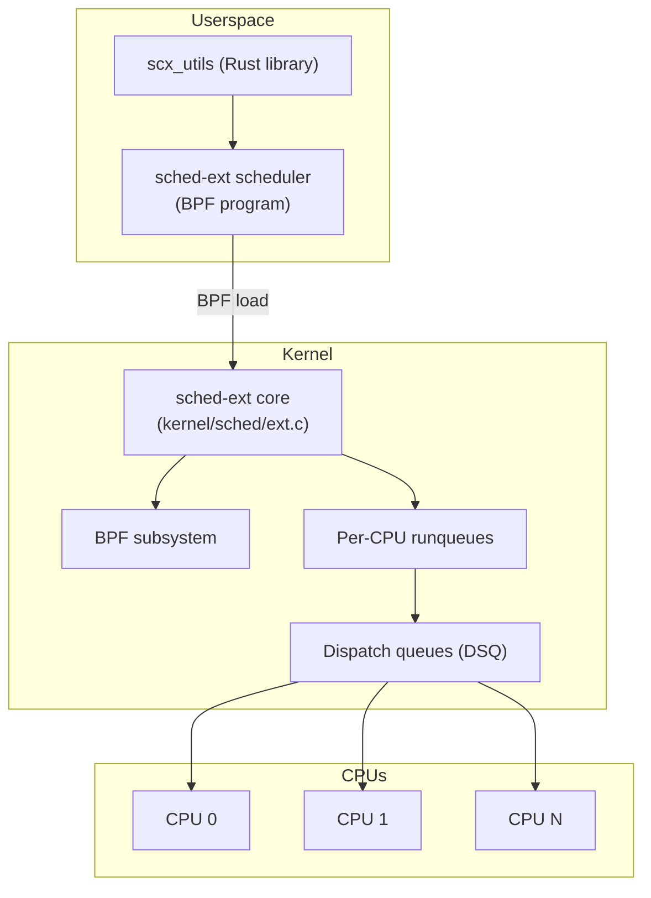
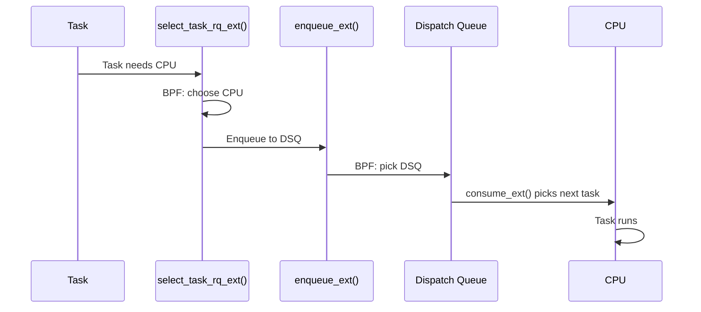

# sched-ext: Extensible Scheduler

## Overview

sched-ext is a Linux kernel feature that allows writing CPU schedulers as BPF programs. It enables userspace developers to implement custom scheduling policies without modifying the kernel, deploy them at runtime, and iterate rapidly. sched-ext is designed for specialized workloads (gaming, real-time, data center) that need scheduling policies beyond CFS/EEVDF.

> **Introduced:** Linux 6.12 (commit `829e589`)  
> **Source:** `kernel/sched/ext.c`  
> **Kconfig:** `CONFIG_SCHED_CLASS_EXT=y`

---

## Architecture



---

## Core Concepts

### Dispatch Queues (DSQ)

sched-ext uses **dispatch queues** as an intermediary between the scheduler and CPUs:

| DSQ Type | Description |
|----------|-------------|
| **Global DSQ** | Shared queue, any CPU can consume |
| **Per-CPU DSQ** | Local to a CPU, highest priority |
| **Custom DSQ** | User-defined (e.g., per-cgroup, per-priority) |

### Scheduling Flow



---

## BPF Scheduler Callbacks

A sched-ext scheduler implements these callbacks:

```c
/* kernel/sched/ext.h — scheduler ops */
struct sched_ext_ops {
    /* Called when task is enqueued */
    void (*enqueue)(struct task_struct *p, u64 enq_flags);

    /* Called when task is dequeued */
    void (*dequeue)(struct task_struct *p, u64 deq_flags);

    /* Called to pick next task for CPU */
    struct task_struct *(*dispatch)(s32 cpu, struct task_struct *prev);

    /* Called to select CPU for task */
    s32 (*select_cpu)(struct task_struct *p, s32 prev_cpu, u64 wake_flags);

    /* Enable/disable task */
    void (*enable)(struct task_struct *p);
    void (*disable)(struct task_struct *p);

    /* ... */
};
```

### Example: Simple FIFO Scheduler

```c
// SPDX-License-Identifier: GPL-2.0
#include <scx/common.bpf.h>

char _license[] SEC("license") = "GPL";

/* Enqueue task to global DSQ */
void BPF_STRUCT_OPS(fifo_enqueue, struct task_struct *p, u64 enq_flags)
{
    scx_bpf_dispatch(p, SCX_DSQ_GLOBAL, SCX_SLICE_DFL, enq_flags);
}

/* Pick next task from CPU's local DSQ */
void BPF_STRUCT_OPS(fifo_dispatch, s32 cpu, struct task_struct *prev)
{
    scx_bpf_consume(SCX_DSQ_LOCAL);
}

s32 BPF_STRUCT_OPS(fifo_select_cpu, struct task_struct *p, s32 prev_cpu, u64 wake_flags)
{
    return scx_bpf_select_cpu_dfl(p, prev_cpu, wake_flags);
}

SCX_OPS_DEFINE(fifo_ops,
               .enqueue   = (void *)fifo_enqueue,
               .dispatch  = (void *)fifo_dispatch,
               .select_cpu = (void *)fifo_select_cpu,
               .name      = "fifo");
```

---

## Scheduler Examples

### scx_rusty (Rust-based)

A production-ready scheduler written in Rust using the `scx_utils` library:

```bash
# Build and run scx_rusty
cargo build --release
sudo ./target/release/scx_rusty

# Features:
# - Per-node scheduling (NUMA-aware)
# - cgroup-aware scheduling
# - Automatic load balancing
```

### scx_lavd (Latency-Aware Virtual Deadline)

Optimized for interactive/gaming workloads:

```bash
# Run lavd scheduler
sudo scx_lavd

# Features:
# - Virtual deadline scheduling
# - Prioritizes latency-sensitive tasks
# - Gaming/VR optimized
```

### Custom Scheduler Deployment

```bash
# Load a BPF scheduler
bpftool prog load my_sched.bpf.o /sys/fs/bpf/my_sched

# Switch to sched-ext
echo enabled > /sys/kernel/sched_ext/root/ops

# Check current scheduler
cat /sys/kernel/sched_ext/root/ops

# Switch back to default
echo disabled > /sys/kernel/sched_ext/root/ops
```

---

## Use Cases

| Use Case | Scheduler | Benefit |
|----------|-----------|---------|
| Gaming/VR | scx_lavd | Low frame-time variance |
| Data center | scx_rusty | NUMA-aware, cgroup support |
| Real-time | Custom | Deterministic latency |
| Batch processing | Custom | Throughput optimization |
| Container isolation | Custom | Per-cgroup scheduling |

---

## Monitoring

```bash
# Check if sched-ext is active
cat /sys/kernel/sched_ext/root/ops
# (empty = not active, name = active scheduler)

# sched-ext statistics
cat /proc/sched_ext/stats

# Per-task scheduler info
cat /proc/<pid>/sched
# Shows: policy=SCHED_EXT

# Trace sched-ext events
echo 1 > /sys/kernel/debug/tracing/events/sched_ext/enable
cat /sys/kernel/debug/tracing/trace_pipe
```

---

## Source Files

| File | Contents |
|------|----------|
| `kernel/sched/ext.c` | sched-ext core |
| `kernel/sched/ext.h` | sched-ext header |
| `include/linux/sched/ext.h` | Task struct extensions |
| `tools/sched_ext/` | Example schedulers |

---

## Further Reading

- **Kernel documentation**: `Documentation/scheduler/sched-ext.rst`
- **LWN**: ["An extensible scheduler class"](https://lwn.net/Articles/922405/)
- **sched-ext GitHub**: [github.com/sched-ext/scx](https://github.com/sched-ext/scx)
- **LPC talks**: sched-ext design presentations

---

## See Also

- [Scheduler](./scheduler.md) — main scheduler overview
- [CFS](./cfs.md) — Completely Fair Scheduler
- [EEVDF](./eevdf.md) — EEVDF scheduler
- [eBPF](../debugging/ebpf.md) — BPF subsystem
- [Scheduling Domains](./scheduling-domains.md) — CPU topology
