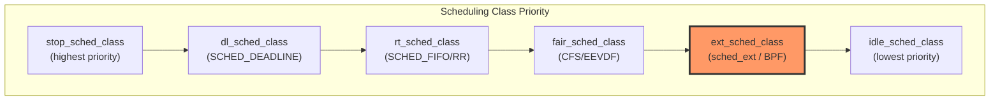
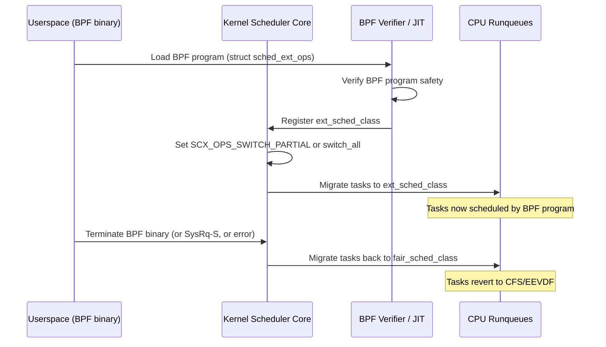
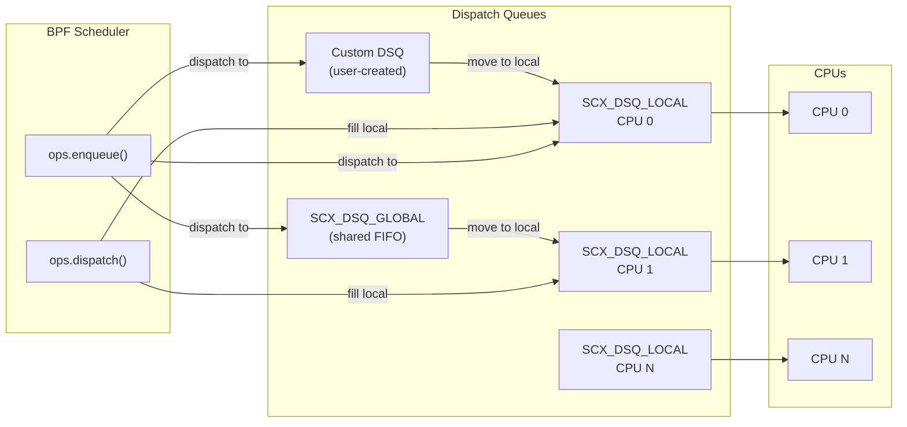
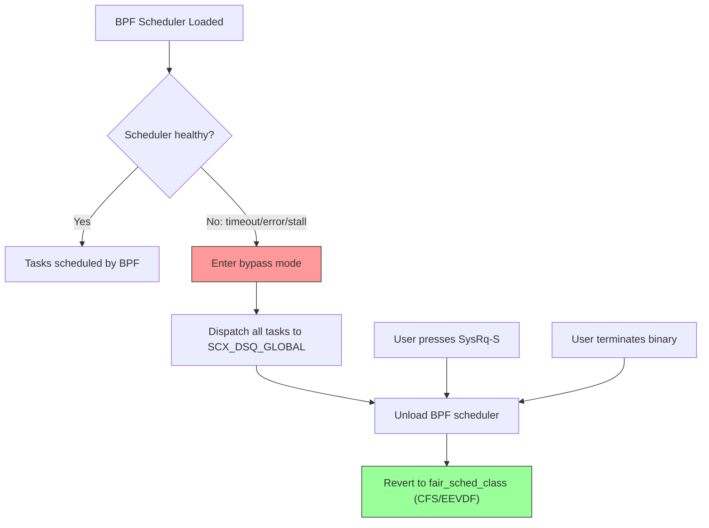

# sched_ext: Extensible Scheduler Class

## Introduction

**sched_ext** is a Linux kernel scheduler class (introduced in Linux 6.12) whose
behavior is defined by **BPF programs**. It exports a full scheduling interface,
enabling any scheduling algorithm to be implemented as a BPF program and loaded
dynamically — without recompiling or rebooting the kernel.

sched_ext sits between the `fair_sched_class` (CFS/EEVDF) and `idle_sched_class`
in the scheduling class hierarchy. When a BPF scheduler is loaded, it handles all
`SCHED_NORMAL`, `SCHED_BATCH`, `SCHED_IDLE`, and `SCHED_EXT` tasks.

```text
stop_sched_class  (highest priority)
dl_sched_class
rt_sched_class
fair_sched_class
ext_sched_class   ← sched_ext (BPF-defined)
idle_sched_class  (lowest priority)
```

### Motivation

The modern scheduling landscape has changed dramatically since CFS was introduced.
Chiplet-based CPUs with non-uniform L3 caches, heterogeneous cores (big.LITTLE,
Intel hybrid), latency-sensitive VR/mobile workloads, and massive datacenter
deployments all create scheduling challenges that a single general-purpose
scheduler cannot optimally address. sched_ext enables:

1. **Rapid experimentation** — test scheduling algorithms without recompiling or
   rebooting the kernel
2. **Workload-specific customization** — deploy specialized schedulers for gaming,
   real-time audio, datacenter workloads, or container orchestration
3. **Safe deployment** — the kernel guarantees system integrity; a buggy BPF
   scheduler cannot crash or lock up the system
4. **Fast iteration** — loading/unloading a BPF scheduler is as simple as
   running/terminating a userspace binary

## Key Properties

| Property | Description |
|----------|-------------|
| **BPF-defined behavior** | The scheduling algorithm is implemented entirely in a BPF program attached to sched_ext |
| **Flexible CPU grouping** | A BPF scheduler can group CPUs however it sees fit (per-core, per-cluster, per-NUMA-node, etc.) |
| **Dynamic on/off** | Can be turned on and off at any time without rebooting |
| **System integrity guaranteed** | On error, stall, or SysRq-S, the kernel falls back to the default scheduler automatically |
| **Full task coverage** | Handles SCHED_NORMAL, SCHED_BATCH, SCHED_IDLE, and SCHED_EXT tasks when active |
| **Partial switching** | With `SCX_OPS_SWITCH_PARTIAL`, only handle explicitly opted-in tasks |

## Kernel Configuration

sched_ext requires these kernel config options:

```text
CONFIG_BPF=y
CONFIG_SCHED_CLASS_EXT=y
CONFIG_BPF_SYSCALL=y
CONFIG_BPF_JIT=y
CONFIG_DEBUG_INFO_BTF=y
CONFIG_BPF_JIT_ALWAYS_ON=y
CONFIG_BPF_JIT_DEFAULT_ON=y
```

The primary config option is `CONFIG_SCHED_CLASS_EXT`. Without it, the sched_ext
scheduling class does not exist in the kernel.

## Architecture Overview

### Scheduling Class Hierarchy

sched_ext integrates into the existing Linux scheduling class hierarchy. Each
`sched_class` defines a set of callbacks (`.enqueue_task`, `.dequeue_task`,
`.pick_next_task`, etc.) that the scheduler core invokes. sched_ext implements
these callbacks and delegates the actual decisions to BPF programs.



### BPF Scheduler Loading Flow



## BPF Scheduler Interface

A BPF scheduler implements callbacks via `struct sched_ext_ops`. The key
callbacks are:

| Callback | Purpose | Blocking? |
|----------|---------|-----------|
| `select_cpu()` | Choose which CPU a task should run on (optimization hint) | No |
| `enqueue()` | Called when a task becomes runnable | No |
| `dequeue()` | Called when a task is no longer runnable | No |
| `dispatch()` | Fill a CPU's local DSQ when it's empty | No |
| `running()` | A task has started executing on a CPU | No |
| `stopping()` | A task has stopped executing on a CPU | No |
| `runnable()` | A task became runnable (transition from sleeping) | No |
| `quiescent()` | A task became non-runnable (transition to sleeping) | No |
| `init_task()` | Initialize per-task scheduling state | No |
| `exit_task()` | Clean up per-task scheduling state | No |
| `cpu_acquire()` | A CPU became available to the BPF scheduler | No |
| `cpu_release()` | A CPU is being taken away (e.g., by RT class) | No |
| `init()` | Called when the scheduler is loaded | Yes |
| `exit()` | Called when the scheduler is unloaded | Yes |
| `prep_enable()` | Prepare for a task entering sched_ext (may allocate) | Yes |
| `enable()` | Enable scheduling for a new task | No |
| `disable()` | A task is leaving sched_ext | No |
| `update_idle()` | Inform scheduler when a CPU enters/exits idle | No |
| `set_weight()` | Notification that a task's weight changed | No |
| `set_cpumask()` | Notification that a task's CPU affinity changed | No |
| `cgroup_init()` | Initialize cgroup scheduling state | Yes |
| `cgroup_move()` | A task moved to a different cgroup | No |
| `cgroup_set_weight()` | Cgroup weight changed | No |

### Dispatch Queues (DSQs)

sched_ext uses **dispatch queues** (DSQs) as the interface between the BPF
scheduler and the kernel. DSQs serve as the impedance matching layer — the BPF
scheduler decides which DSQ a task goes into, and the kernel consumes tasks from
DSQs to actually execute them.

- **`SCX_DSQ_GLOBAL`**: A global FIFO queue shared by all CPUs. When a CPU's
  local DSQ is empty, it checks here before calling `ops.dispatch()`.
- **`SCX_DSQ_LOCAL`**: Per-CPU local queues (highest priority). A CPU always
  executes from its local DSQ first.
- **Custom DSQs**: Created by the BPF scheduler via `scx_bpf_create_dsq()` for
  arbitrary CPU grouping and priority management. Can operate as FIFO or
  priority queues (using vtime).



### Scheduling Cycle

The following describes how a waking task is scheduled and executed:

1. **`ops.select_cpu()`** — First callback invoked when a task wakes up. Serves
   two purposes: CPU selection optimization hint, and waking an idle CPU. The
   selected CPU is a hint, not a binding. If the BPF scheduler inserts the task
   directly into `SCX_DSQ_LOCAL` from here, `ops.enqueue()` is skipped.

2. **`ops.enqueue()`** — Invoked if the task wasn't directly dispatched from
   `select_cpu()`. The BPF scheduler can:
   - Dispatch immediately to `SCX_DSQ_GLOBAL`, `SCX_DSQ_LOCAL`, or a custom DSQ
   - Queue the task in BPF-internal data structures for later dispatch
   - Use `SCX_SLICE_INF` to give a task unlimited time slice (triggers tickless)

3. **`ops.dispatch()`** — Called when a CPU's local DSQ is empty. The BPF
   scheduler should dispatch tasks to fill it. If the local DSQ remains empty,
   the kernel falls back to `SCX_DSQ_GLOBAL`.

4. **`ops.running()` / `ops.stopping()`** — Notifications when a task begins or
   ends its time slice. Useful for tracking actual CPU usage.

5. **`ops.update_idle()`** — Informs the scheduler when a CPU enters or exits
   idle state, enabling the BPF scheduler to proactively dispatch work.

### Task Custody Model

A task is in "BPF scheduler custody" when the BPF scheduler is responsible for
managing its lifecycle. This model determines when `ops.dequeue()` is called:

- **Direct dispatch to terminal DSQs** (`SCX_DSQ_LOCAL`, `SCX_DSQ_GLOBAL`): The
  task never enters BPF custody. `ops.dequeue()` will NOT be called.
- **Dispatch to custom DSQs**: The task enters BPF custody. `ops.dequeue()` IS
  called when the task is dequeued (e.g., it sleeps).
- **Held in BPF data structures**: The task is in BPF custody. The BPF scheduler
  must eventually dispatch it or the watchdog timer will fire.

### Partial Switching

The `SCX_OPS_SWITCH_PARTIAL` flag allows a BPF scheduler to opt into
**partial switching** — it only handles tasks it explicitly cares about. Tasks
it doesn't handle fall through to the default fair scheduler (CFS/EEVDF)
automatically. Without this flag, ALL `SCHED_NORMAL`/`SCHED_BATCH`/`SCHED_IDLE`
tasks are routed through sched_ext.

```c
SEC(".struct_ops")
struct sched_ext_ops my_ops = {
    /* ... callbacks ... */
    .name          = "my_scheduler",
    .timeout_ms    = 5000,
    .flags         = SCX_OPS_SWITCH_PARTIAL,
};
```

With `SCX_OPS_SWITCH_PARTIAL`, only tasks that explicitly set `SCHED_EXT` via
`sched_setscheduler()` are handled by the BPF scheduler. All other tasks
continue using the fair class.

## The scx_bpf Helper API

The kernel exposes a rich set of BPF helpers that schedulers can call:

| Helper | Purpose |
|--------|---------|
| `scx_bpf_dispatch(p, dsq, slice, flags)` | Dispatch task to a DSQ |
| `scx_bpf_dsq_insert(p, dsq, slice, flags)` | Insert task into a DSQ (newer API) |
| `scx_bpf_dsq_insert_vtime(p, dsq, slice, vtime, flags)` | Insert with virtual time for priority ordering |
| `scx_bpf_create_dsq(dsq_id, node)` | Create a custom DSQ |
| `scx_bpf_destroy_dsq(dsq_id)` | Destroy a custom DSQ |
| `scx_bpf_kick_cpu(cpu, flags)` | Kick a CPU to reschedule (preempt current task) |
| `scx_bpf_dsq_move_to_local(dsq_id)` | Move a task from a DSQ to the current CPU's local DSQ |
| `scx_bpf_dsq_peek(dsq_id)` | Peek at the next task in a DSQ without removing it |
| `scx_bpf_test_and_clear_cpu_idle(cpu)` | Test if a CPU is idle and clear its idle state |
| `scx_bpf_pick_idle_cpu(cpumask, flags)` | Find an idle CPU from a cpumask |
| `scx_bpf_select_cpu_dfl(p, prev_cpu, wake_flags, direct)` | Default CPU selection logic |

### Flags

**Dispatch flags:**
- `SCX_ENQ_HEAD` — Insert at the head of the DSQ instead of the tail
- `SCX_ENQ_PREEMPT` — Preempt the currently running task on the target CPU
- `SCX_ENQ_REENQ` — Re-enqueue a task (used in `ops.enqueue()` for deferred dispatch)
- `SCX_ENQ_LAST` — Dispatch as the last task before going idle

**Kick flags:**
- `SCX_KICK_IDLE` — Only kick if the CPU is currently idle
- `SCX_KICK_PREEMPT` — Preempt the current task on the kicked CPU
- `SCX_KICK_WAIT` — Wait until the kicked CPU has rescheduled

## Example: Minimal Global FIFO Scheduler

The kernel source tree includes example sched_ext schedulers under
`tools/sched_ext/`. The simplest is `scx_simple.bpf.c`:

```c
/* tools/sched_ext/scx_simple.bpf.c — Minimal global FIFO/vtime scheduler */
#include <scx/common.bpf.h>

char _license[] SEC("license") = "GPL";

/* Called to select a CPU for a task — uses default CPU selection */
s32 BPF_STRUCT_OPS(simple_select_cpu, struct task_struct *p, s32 prev_cpu,
                   u64 wake_flags)
{
    bool direct = false;
    s32 cpu;

    cpu = scx_bpf_select_cpu_dfl(p, prev_cpu, wake_flags, &direct);
    if (direct)
        scx_bpf_dsq_insert(p, SCX_DSQ_LOCAL, SCX_SLICE_DFL, 0);
    return cpu;
}

/* Called when a task becomes runnable — dispatch to global DSQ */
void BPF_STRUCT_OPS(simple_enqueue, struct task_struct *p, u64 enq_flags)
{
    scx_bpf_dsq_insert(p, SCX_DSQ_GLOBAL, SCX_SLICE_DFL, enq_flags);
}

/* Called when CPU's local DSQ is empty — pull from global */
void BPF_STRUCT_OPS(simple_dispatch, s32 cpu, struct task_struct *prev)
{
    scx_bpf_dsq_move_to_local(SCX_DSQ_GLOBAL);
}

s32 BPF_STRUCT_OPS_SLEEPABLE(simple_init)
{
    return 0; /* Use defaults: all SCHED_NORMAL/BATCH/IDLE/EXT tasks */
}

void BPF_STRUCT_OPS(simple_exit, struct scx_exit_info *ei)
{
    /* Cleanup on exit */
}

SEC(".struct_ops")
struct sched_ext_ops simple_ops = {
    .select_cpu    = (void *)simple_select_cpu,
    .enqueue       = (void *)simple_enqueue,
    .dispatch      = (void *)simple_dispatch,
    .init          = (void *)simple_init,
    .exit          = (void *)simple_exit,
    .name          = "simple",
    .timeout_ms    = 0,
};
```

## Real-World Schedulers

The [sched-ext/scx](https://github.com/sched-ext/scx) repository contains
production-quality schedulers. The following are the most notable:

### scx_rusty — NUMA-Aware Load-Balancing Scheduler

`scx_rusty` is a weighted vtime scheduler with a **userspace load-balancing
component written in Rust**. The BPF side handles per-CPU scheduling decisions
(vtime ordering within domains), while the Rust userspace daemon performs
cross-domain load balancing and NUMA-aware task placement.

**Architecture:**
- BPF side: simple weighted vtime scheduling per-domain
- Rust userspace: reads BPF maps, computes load balancing, updates task
  assignments via BPF maps
- Supports NUMA topology, LLC domain awareness, and greedy idle CPU selection

**Use case:** General-purpose desktop and server workloads, especially on
multi-NUMA or chiplet-based systems.

### scx_lavd — Latency-Aware Virtual Deadline Scheduler

`scx_lavd` implements a **latency-aware virtual deadline** scheduling policy.
It assigns virtual deadlines to tasks based on their latency sensitivity and
interactivity, then schedules tasks with the earliest deadlines first.

**Key features:**
- Automatic detection of latency-sensitive (interactive) vs. throughput-oriented
  (batch) tasks
- Per-task latency boost based on wakeup frequency
- Adaptive time slicing based on system load
- Performance/balanced/power-saving modes

**Use case:** Desktop systems, gaming, and mixed interactive/batch workloads.

### scx_bpfland — BPF-Powered Performance Scheduler

`scx_bpfland` is designed for **general-purpose performance** with a focus on
responsiveness. It uses a combination of direct dispatch for latency-sensitive
tasks and priority-based scheduling for the rest.

**Key features:**
- Direct dispatch for tasks that can run immediately on an idle CPU
- Priority-aware scheduling using task weights
- Built-in monitoring via `--monitor` flag
- Simple and effective for single-NUMA desktop systems

### scx_rustland — Userspace-Driven Scheduler

`scx_rustland` makes **most scheduling decisions in userspace Rust code**. The
BPF side acts as a thin shim that reports scheduling events to userspace and
dispatches tasks as instructed.

**Key features:**
- Userspace scheduling logic (easy to modify, no BPF compilation needed)
- Demonstrated better gaming FPS during kernel compilation (Terraria benchmark)
- Shows that even a userspace-driven scheduler can outperform CFS in specific
  scenarios

### scx_flatcg — Flat Cgroup Scheduler

`scx_flatcg` implements **flat cgroup hierarchy** scheduling. It flattens the
cgroup tree into a single level for scheduling purposes, avoiding the overhead
of hierarchical weight propagation.

**Use case:** Container orchestration (Kubernetes) where cgroup hierarchies can
be deep but scheduling needs to be fast.

### scx_central — Central Scheduler

`scx_central` dedicates **one CPU to all scheduling decisions**, leaving all
others free to run tasks without scheduler overhead. This is useful for
benchmarking and latency-sensitive workloads where scheduler jitter is
unacceptable.

## Comparison with CFS/EEVDF

| Aspect | CFS/EEVDF | sched_ext |
|--------|-----------|-----------|
| **Algorithm** | Fixed in kernel: virtual runtime with earliest eligible deadline | Arbitrary: defined by loaded BPF program |
| **Fairness** | Strict fairness via vtime tracking | BPF scheduler's choice (can be fair, FIFO, priority, or custom) |
| **Latency** | Balanced, not optimized for specific workloads | Can be optimized per-workload (e.g., gaming, real-time) |
| **CPU topology** | Aware of NUMA, but limited topology-specific optimization | BPF scheduler can implement arbitrary topology-aware policies |
| **Cgroup support** | Full hierarchical cgroup support | BPF scheduler decides cgroup semantics |
| **Safety** | Kernel-guaranteed fairness | Kernel-guaranteed system integrity (no crashes/lockups), but fairness is the BPF scheduler's responsibility |
| **Performance** | Good general-purpose | Can be better for specific workloads, worse for others |
| **Deployment** | Always active | Dynamically loaded/unloaded; requires kernel config support |
| **Complexity** | ~15,000 lines of C (kernel/sched/fair.c) | BPF programs can be 50-500 lines for simple schedulers |

### When sched_ext Outperforms CFS/EEVDF

- **Gaming**: Direct dispatch of game threads to idle cores, minimizing scheduler
  latency and jitter
- **Datacenter**: Custom isolation between tenants, NUMA-aware placement
- **Mixed workloads**: Interactive tasks get priority over batch jobs without
  cgroup configuration
- **Chiplet CPUs**: Custom domain-aware scheduling that understands L3 cache
  boundaries (e.g., AMD CCD/CCX)

### When CFS/EEVDF is Better

- **General-purpose**: CFS provides good-enough performance for most workloads
  without any configuration
- **Guaranteed fairness**: CFS mathematically guarantees fair CPU time allocation
- **No maintenance**: CFS doesn't require loading or managing a BPF scheduler
- **Stability**: CFS has decades of testing and refinement

## Debug and Diagnostics

sched_ext exposes several sysfs files for monitoring:

| File | Description |
|------|-------------|
| `/sys/kernel/sched_ext/state` | Current sched_ext state (enabled/disabled) |
| `/sys/kernel/sched_ext/root/ops` | Name of the currently loaded BPF scheduler ops |
| `/sys/kernel/sched_ext/enable_seq` | Monotonically increasing sequence number for enable/disable events |
| `/sys/kernel/sched_ext/<name>/events` | Per-scheduler diagnostic counters |

### Diagnostic Event Counters

Each loaded scheduler exposes event counters under
`/sys/kernel/sched_ext/<scheduler-name>/events`:

| Counter | Description |
|---------|-------------|
| `SCX_EV_SELECT_CPU_FALLBACK` | `select_cpu()` returned unusable CPU; core picked fallback |
| `SCX_EV_DISPATCH_LOCAL_DSQ_OFFLINE` | Local DSQ dispatch redirected to global (CPU went offline) |
| `SCX_EV_DISPATCH_KEEP_LAST` | Task continued running (no other task available) |
| `SCX_EV_ENQ_SKIP_EXITING` | Exiting task bypassed `enqueue()` |
| `SCX_EV_ENQ_SKIP_MIGRATION_DISABLED` | Migration-disabled task bypassed `enqueue()` |
| `SCX_EV_REENQ_IMMED` | Re-enqueue due to `SCX_ENQ_IMMED` on unavailable CPU |
| `SCX_EV_REENQ_LOCAL_REPEAT` | Recurring reenqueue of local DSQ (indicates BPF bug) |
| `SCX_EV_REFILL_SLICE_DFL` | Time slice refilled with default value |
| `SCX_EV_BYPASS_DURATION` | Total nanoseconds spent in bypass mode |
| `SCX_EV_BYPASS_DISPATCH` | Tasks dispatched in bypass mode |
| `SCX_EV_BYPASS_ACTIVATE` | Bypass mode activation count |
| `SCX_EV_INSERT_NOT_OWNED` | Attempted insert of unowned task (silently ignored) |

### Bypass Mode

When the BPF scheduler misbehaves (e.g., tasks stall), the kernel enters
**bypass mode**:
- All tasks are dispatched to `SCX_DSQ_GLOBAL` directly
- The BPF scheduler's callbacks are still called but bypassed for dispatch
- Bypass mode is temporary; the scheduler is eventually unloaded if the problem
  persists

```bash
# Check if sched_ext is active
$ cat /sys/kernel/sched_ext/state
enabled

# See which scheduler is loaded
$ cat /sys/kernel/sched_ext/root/ops
scx_bpfland

# View diagnostic counters
$ cat /sys/kernel/sched_ext/scx_bpfland/events

# Check if a specific task uses sched_ext
$ grep ext /proc/self/sched
ext.enabled : 1
```

### drgn Script for Detailed State

The kernel tree includes `tools/sched_ext/scx_show_state.py`, a drgn script
that shows detailed scheduler state:

```bash
$ tools/sched_ext/scx_show_state.py
ops : simple
enabled : 1
switching_all : 1
switched_all : 1
enable_state : enabled (2)
bypass_depth : 0
nr_rejected : 0
enable_seq : 1
```

## Building and Loading

```bash
# Build (from kernel source tree)
$ make -C tools/sched_ext

# Load the scheduler
$ sudo ./scx_simple

# Verify it's active
$ cat /sys/kernel/sched_ext/state
enabled
$ cat /sys/kernel/sched_ext/root/ops
simple

# Monitor statistics
$ scx_bpfland --monitor 0.5

# Unload (Ctrl+C or kill) — tasks revert to CFS/EEVDF automatically
```

### Building Rust Schedulers (from scx repository)

```bash
$ cd scx
$ cargo build --release                    # Build all
$ cargo build --release -p scx_rusty       # Build specific

# Or install from crates.io
$ cargo install scx_rusty
```

## Error Handling and Safety

sched_ext is designed for safety — no matter what the BPF scheduler does, the
system remains functional:

1. **Timeout**: If a BPF scheduler doesn't dispatch a task within `timeout_ms`
   milliseconds (configurable, default 30s), the scheduler is unloaded and all
   tasks revert to the fair class.
2. **Error on BPF program crash**: If the BPF program traps or errors, the
   scheduler is unloaded gracefully.
3. **SysRq-S**: Pressing SysRq-S forces sched_ext off and restores the default
   scheduler.
4. **SysRq-D**: Triggers a debug dump without terminating the scheduler.
5. **No lockups**: The kernel guarantees that even a buggy BPF scheduler cannot
   lock up the system. BPF verification ensures the program cannot corrupt memory
   or enter infinite loops.
6. **Stall detection**: The kernel monitors for runnable tasks that aren't being
   dispatched and enters bypass mode.

### Safety Architecture



## Integration with cgroups

sched_ext supports **control group (cgroup)** integration through dedicated
callbacks:

- `ops.cgroup_init()` — Initialize scheduling state for a new cgroup
- `ops.cgroup_move()` — A task moved between cgroups
- `ops.cgroup_set_weight()` — Cgroup weight changed

The BPF scheduler decides how to interpret cgroup hierarchies. It can:
- Flatten the hierarchy (like `scx_flatcg`)
- Respect hierarchical weights
- Implement custom resource distribution policies

## Use Cases

### Gaming and Desktop Interactivity

Gaming schedulers benefit from:
- Direct dispatch of game render threads to idle high-performance cores
- Boosting interactive tasks over background compilation/indexing
- Avoiding scheduler jitter that causes frame drops
- Example: `scx_rustland` demonstrated better FPS in Terraria during kernel
  compilation

### Datacenter and Cloud

Datacenter schedulers can implement:
- Per-tenant CPU isolation
- NUMA-aware task placement for cache efficiency
- Latency-sensitive vs. throughput workload separation
- Custom cgroup policies for container orchestration

### Real-Time Audio/Video

Media workloads benefit from:
- Predictable scheduling latency
- Priority boosting for audio callback threads
- Avoiding priority inversion with background tasks

### Research and Academia

sched_ext enables:
- Testing novel scheduling algorithms on real hardware
- A/B comparison of scheduling policies without reboots
- Safe experimentation in production-like environments

## Source Files

| File | Purpose |
|------|---------|
| `kernel/sched/ext.c` | Main sched_ext implementation |
| `kernel/sched/ext.h` | Internal header |
| `kernel/sched/ext_internal.h` | Internal data structures |
| `include/linux/sched/ext.h` | Public header (struct sched_ext_ops) |
| `kernel/sched/ext.c` (`scx_enable`, `scx_disable`) | Enable/disable logic |
| `tools/sched_ext/` | Example schedulers (in kernel tree) |

## References

- [sched_ext Kernel Documentation](https://docs.kernel.org/scheduler/sched-ext.html)
- [sched-ext/scx Repository](https://github.com/sched-ext/scx)
- [sched_ext Overview Document](https://github.com/sched-ext/scx/blob/main/OVERVIEW.md)
- [BPF and sched_ext (LWN, Feb 2023)](https://lwn.net/Articles/922405/)
- [sched_ext v2 patch series (LKML)](https://lore.kernel.org/lkml/20230128001639.3510083-1-tj@kernel.org/)
- [Kernel source: kernel/sched/ext.c](https://elixir.bootlin.com/linux/latest/source/kernel/sched/ext.c)
- [Kernel source: tools/sched_ext/](https://elixir.bootlin.com/linux/latest/source/tools/sched_ext)
- [Kernel source: include/linux/sched/ext.h](https://elixir.bootlin.com/linux/latest/source/include/linux/sched/ext.h)
- [Google ghOSt (precedent)](https://dl.acm.org/doi/pdf/10.1145/3477132.3483542)

## Related Topics

- [Scheduler Overview](scheduler.md) — Linux scheduler architecture and scheduling classes
- [CFS Internals](cfs.md) — The default scheduling class for normal tasks
- [EEVDF Scheduler](eevdf.md) — The successor to CFS
- [BPF / eBPF](../bpf/overview.md) — The BPF subsystem used by sched_ext
