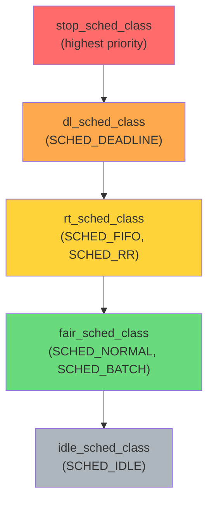
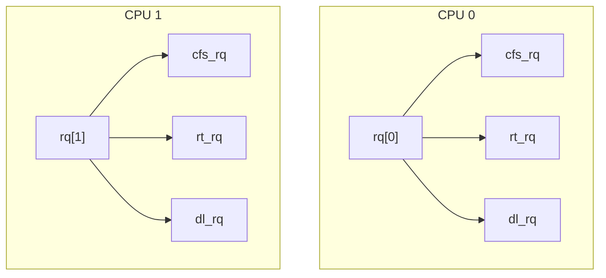
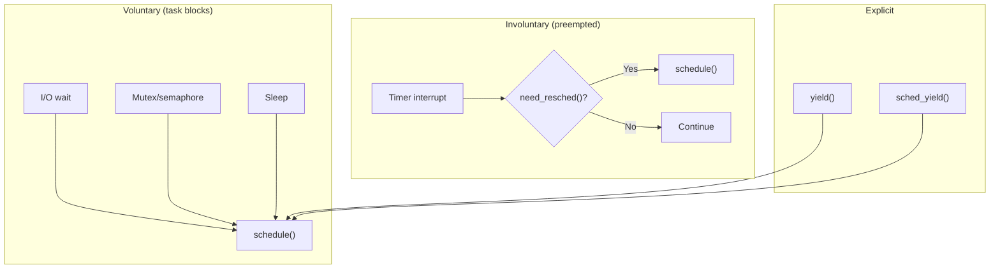
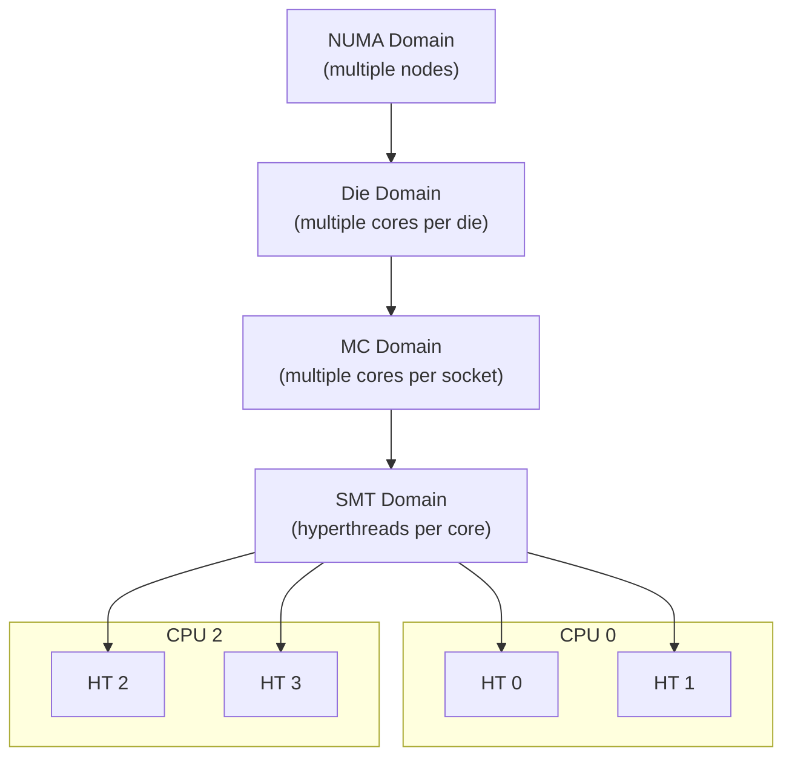
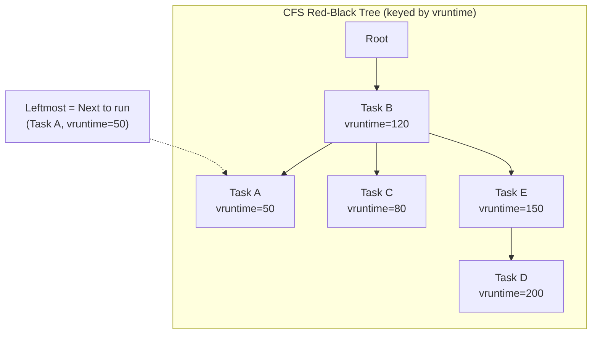
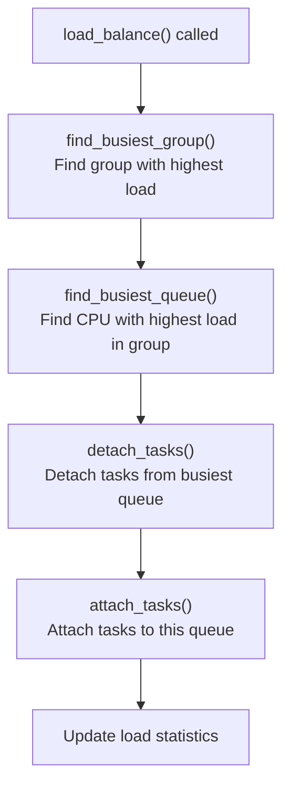

# Linux Scheduler Overview

## Introduction

The Linux scheduler is the subsystem responsible for deciding which task runs on which CPU at any given moment. It must balance competing goals: maximize throughput, minimize latency, ensure fairness, respect priorities, and efficiently use multi-core hardware.

Linux uses a **modular scheduler architecture** with pluggable scheduling classes. The default class for normal processes is **CFS** (Completely Fair Scheduler) or its successor **EEVDF**, while real-time tasks use dedicated scheduling classes. The scheduler is invoked at every timer tick, on every wake-up, and at every voluntary sleep — making it one of the most performance-critical pieces of the kernel.

## Scheduling Classes

Linux implements a hierarchy of scheduling classes. Each class implements a common interface (`struct sched_class`), and the scheduler picks the highest-priority class that has a runnable task:

```c
/* include/linux/sched.h */
struct sched_class {
    void (*enqueue_task)(struct rq *rq, struct task_struct *p, int flags);
    void (*dequeue_task)(struct rq *rq, struct task_struct *p, int flags);
    void (*yield_task)(struct rq *rq);
    void (*check_preempt_curr)(struct rq *rq, struct task_struct *p, int flags);
    struct task_struct *(*pick_next_task)(struct rq *rq);
    void (*put_prev_task)(struct rq *rq, struct task_struct *p);
    void (*set_next_task)(struct rq *rq, struct task_struct *p, bool first);
    int  (*select_task_rq)(struct task_struct *p, int task_cpu, int flags);
    void (*task_tick)(struct rq *rq, struct task_struct *p, int queued);
    void (*task_fork)(struct task_struct *p);
    void (*switched_to)(struct rq *rq, struct task_struct *p);
    void (*prio_changed)(struct rq *rq, struct task_struct *p, int oldprio);
    /* ... */
};
```

### Class Priority Order



The scheduling classes are checked in order. `pick_next_task()` in the core scheduler first checks if the highest-priority class has any runnable tasks:

```c
/* kernel/sched/core.c - simplified */
static inline struct task_struct *
pick_next_task(struct rq *rq, struct task_struct *prev, struct rq_flags *rf)
{
    /* Fast path: if only fair class tasks, go directly */
    if (likely(prev->sched_class <= &fair_sched_class &&
               rq->nr_running == rq->cfs.h_nr_running)) {
        return pick_next_task_fair(rq, prev, rf);
    }

    /* Slow path: check all classes in priority order */
    for_each_class(class) {
        p = class->pick_next_task(rq);
        if (p)
            return p;
    }

    /* Nothing runnable, run the idle task */
    return idle_sched_class.pick_next_task(rq);
}
```

### Scheduling Policies

Userspace selects a scheduling class via `sched_setscheduler()`:

| Policy | Class | Description |
|---|---|---|
| `SCHED_NORMAL` (0) | `fair_sched_class` | Normal time-sharing (CFS/EEVDF) |
| `SCHED_FIFO` (1) | `rt_sched_class` | Real-time, first-in-first-out |
| `SCHED_RR` (2) | `rt_sched_class` | Real-time, round-robin |
| `SCHED_BATCH` (3) | `fair_sched_class` | Batch processing, less interactive |
| `SCHED_IDLE` (5) | `fair_sched_class` | Lowest priority, runs when system is idle |
| `SCHED_DEADLINE` (6) | `dl_sched_class` | Earliest Deadline First (EDF) |

```bash
# View scheduling policy of a process
$ chrt -p 1
pid 1's scheduling policy: SCHED_OTHER
pid 1's scheduling priority: 0

# Set real-time priority
$ chrt -f -p 50 1234  # SCHED_FIFO, priority 50
$ chrt -r -p 50 1234  # SCHED_RR, priority 50

# Run a command with real-time priority
$ chrt -f 99 stress-ng --cpu 1
```

## The Run Queue

### Per-CPU Run Queues

Each CPU has its own run queue (`struct rq`), reducing lock contention:

```c
/* kernel/sched/sched.h */
struct rq {
    raw_spinlock_t lock;
    unsigned int nr_running;        /* Total runnable tasks */

    struct cfs_rq cfs;              /* CFS run queue */
    struct rt_rq rt;                /* RT run queue */
    struct dl_rq dl;                /* Deadline run queue */

    struct task_struct *curr;       /* Currently running task */
    struct task_struct *idle;       /* Idle task for this CPU */
    struct task_struct *stop;       /* Highest priority stop task */

    u64 clock;                      /* Per-CPU clock */
    u64 clock_task;                 /* Task execution clock */

    /* Load balancing */
    unsigned long cpu_capacity;
    unsigned long cpu_load;
    struct sched_avg avg;

    /* ... many more fields ... */
};
```



### The `schedule()` Function

The main scheduler entry point is `schedule()`:

```c
/* kernel/sched/core.c - simplified */
asmlinkage __visible void __sched schedule(void)
{
    struct task_struct *tsk = current;

    /* Don't schedule in atomic context (unless forced) */
    sched_submit_work(tsk);

    do {
        preempt_disable();
        __schedule(SM_NONE);
        sched_preempt_enable_no_resched();
    } while (need_resched());
}

static void __sched __schedule(unsigned int sched_mode)
{
    struct task_struct *prev, *next;
    struct rq *rq;
    int cpu;

    cpu = smp_processor_id();
    rq = cpu_rq(cpu);
    prev = rq->curr;

    /* ... */

    /* Pick the next task to run */
    next = pick_next_task(rq, prev, &rf);

    if (likely(prev != next)) {
        /* Context switch! */
        rq->nr_switches++;
        rq->curr = next;
        context_switch(rq, prev, next, &rf);
    }
}
```

### When Is schedule() Called?



## Scheduling Domains and Load Balancing

### Scheduling Domains

On multi-core and NUMA systems, the kernel organizes CPUs into **scheduling domains** for load balancing:

```c
/* include/linux/sched/sched.h - simplified */
struct sched_domain {
    struct sched_domain *parent;    /* Topologically superior domain */
    struct sched_domain *child;     /* Topologically inferior domain */
    struct sched_group *groups;     /* Groups of CPUs */
    unsigned long min_interval;     /* Minimum balance interval */
    unsigned long max_interval;     /* Maximum balance interval */
    unsigned int busy_factor;       /* Balance less when busy */
    unsigned int imbalance_pct;     /* Balance when imbalance > this % */
    int flags;                      /* SD_* flags */

    /* Load balance statistics */
    unsigned long last_balance;
    int balance_interval;
    int nr_balance_failed;
};
```

The hierarchy typically looks like:



```bash
# View scheduling domains
$ ls /sys/kernel/debug/domains/
cpu0/  cpu1/  cpu2/  cpu3/

# View domain details for CPU 0
$ cat /sys/kernel/debug/domains/cpu0/domain0/name
SMT
$ cat /sys/kernel/debug/domains/cpu0/domain1/name
MC
$ cat /sys/kernel/debug/domains/cpu0/domain2/name
DIE
```

### Load Balancing

The kernel periodically balances load across CPUs:

```c
/* kernel/sched/fair.c */
static int load_balance(int this_cpu, struct rq *this_rq,
                        struct sched_domain *sd, enum cpu_idle_type idle,
                        int *continue_balancing)
{
    struct lb_env env = {
        .sd = sd,
        .dst_cpu = this_cpu,
        .dst_rq = this_rq,
    };

    /* Find the busiest group */
    struct sched_group *sg = find_busiest_group(&env);
    if (!sg)
        return 0;

    /* Find the busiest queue in that group */
    struct rq *busiest = find_busiest_queue(&env, sg);
    if (!busiest)
        return 0;

    /* Calculate how many tasks to move */
    env.loop_max = min(sysctl_sched_nr_migrate, busiest->nr_running);

    /* Migrate tasks */
    cur_ld_moved = detach_tasks(&env);
    if (cur_ld_moved) {
        attach_tasks(&env);
        /* ... */
    }
    return cur_ld_moved;
}
```

### Active vs Passive Balancing

```c
/* Two types of load balancing: */

/* 1. Active balancing: initiated by the CPU that wants work */
/* Triggered when a CPU goes idle or has very low load */

/* 2. Passive balancing: push work away from overloaded CPUs */
/* Triggered by periodic load_balance() calls */

/* Active balancing uses stop_machine to force migration */
static int active_load_balance_cpu_stop(void *data)
{
    struct rq *busiest = data;
    /* ... migrate task from busiest to this CPU ... */
    return 0;
}
```

### NUMA Balancing

For NUMA systems, the kernel also balances memory placement:

```c
/* kernel/sched/fair.c */
static void task_numa_work(struct callback_head *work)
{
    /* Scan the task's memory and check NUMA locality */
    /* Migrate pages to the node where the task is running */
    /* Migrate the task to the node where its memory is */
}
```

```bash
# NUMA statistics
$ numastat -p $(pidof myapp)
Per-node process memory usage (in MBs)
PID             Node 0  Node 1    Total
-----------  --------  ------  -------
1234 (myapp)     256.1   128.3    384.4

# NUMA balancing tunables
$ cat /proc/sys/kernel/numa_balancing
1
$ cat /proc/sys/kernel/numa_balancing_scan_delay_ms
1000
```

## CPU Affinity

Tasks can be restricted to run on specific CPUs:

```c
/* include/linux/sched.h */
struct task_struct {
    int nr_cpus_allowed;
    cpumask_t cpus_mask;    /* CPUs this task may run on */
};
```

```bash
# View CPU affinity
$ taskset -p 1234
pid 1234's current affinity mask: f

# Restrict to CPUs 0 and 1
$ taskset -c 0,1 ./myprogram

# Change affinity of running process
$ taskset -pc 2,3 1234

# Cgroup cpuset (for containers)
$ cat /sys/fs/cgroup/cpuset/mygroup/cpuset.cpus
0-3
```

### Affinity Selection in the Scheduler

```c
/* kernel/sched/core.c */
static int select_task_rq(struct task_struct *p, int prev_cpu, int sd_flag, int wake_flags)
{
    /* Select the best CPU considering:
     * 1. Task's CPU affinity (cpus_mask)
     * 2. Cache warmth (prefer previous CPU)
     * 3. NUMA locality
     * 4. Load balancing
     */
    if (p->nr_cpus_allowed == 1)
        return task_cpu(p);  /* Pinned to single CPU */

    return p->sched_class->select_task_rq(p, prev_cpu, sd_flag, wake_flags);
}
```

## Preemption

### Kernel Preemption Modes

Linux supports several preemption modes:

```bash
# Check current preemption model
$ cat /sys/kernel/debug/sched_debug | head -5
# Look for "preempt" in kernel config
$ grep PREEMPT /boot/config-$(uname -r)
CONFIG_PREEMPT=y
CONFIG_PREEMPT_RT=y
```

| Mode | Description |
|---|---|
| `PREEMPT_NONE` | No preemption in kernel (server default) |
| `PREEMPT_VOLUNTARY` | Explicit preemption points |
| `PREEMPT` | Full kernel preemption (desktop default) |
| `PREEMPT_RT` | Real-time preemption (PREEMPT_RT patch) |

### Preemption Points

```c
/* kernel/sched/core.c */
asmlinkage __visible void __sched preempt_schedule(void)
{
    if (likely(!preemptible()))
        return;
    preempt_schedule_common();
}

/* Called from various points: */
static inline void preempt_check_resched(void)
{
    if (unlikely(test_thread_flag(TIF_NEED_RESCHED)))
        preempt_schedule();
}
```

### The `TIF_NEED_RESCHED` Flag

The scheduler communicates the need to reschedule through a per-task flag:

```c
/* The scheduler sets this flag when a higher-priority task becomes runnable */
static void resched_curr(struct rq *rq)
{
    struct task_struct *curr = rq->curr;

    if (test_tsk_need_resched(curr))
        return;  /* Already set */

    set_tsk_need_resched(curr);
    set_preempt_need_resched();

    /* Send IPI to target CPU if not current CPU */
    if (cpu != smp_processor_id())
        smp_send_reschedule(cpu);
}
```

## Scheduler Tuning

### Nice Values

```bash
# Set nice value (range: -20 to 19, lower = higher priority)
$ nice -n 10 ./myprogram
$ renice 10 -p 1234

# View nice values
$ ps -eo pid,ni,comm | head
  PID  NI COMMAND
    1   0 systemd
  500   0 bash
  600  10 gcc
```

### Scheduler Debug

```bash
# Full scheduler debug info
$ cat /proc/sched_debug
runnable tasks:
 S           task   PID         tree-key  switches  prio     wait-time     sum-exec        sum-sleep
----------------------------------------------------------------------------------------------------------
 I         cat     1234      45.678ms       123   120      0.000ms      0.123ms         0.000ms
 R         gcc     600       12.345ms        56   130      0.000ms      2.345ms         0.000ms

# Per-CPU scheduler statistics
$ cat /proc/schedstat
cpu0 0 0 0 0 0 0 12345 67890
```

## Scheduler Domains Configuration

### Domain Flags

Each scheduling domain has flags that control its behavior:

```c
/* include/linux/sched/topology.h */
#define SD_SHARE_CPUCAPACITY   0x0001  /* SMT: share CPU core */
#define SD_SHARE_PKG_RESOURCES 0x0002  /* MC: share package resources */
#define SD_NUMA                0x0004  /* NUMA domain */
#define SD_SHARE_POWERDOMAIN   0x0008  /* Share power domain */
#define SD_ASYM_PACKING        0x0010  /* Asymmetric packing */
#define SD_SHARE_LL            0x0020  /* Share last-level cache */
#define SD_SERIALIZE           0x0040  /* Serialize balancing */
#define SD_ASYM_CPUCAPACITY    0x0080  /* Asymmetric CPU capacity */
```

### Domain Construction

Domains are built during boot from topology information:

```c
/* kernel/sched/topology.c */
static void build_sched_domains(const struct cpumask *cpu_map)
{
    /* 1. Detect CPU topology (SMT, MC, DIE, NUMA) */
    /* 2. Build domain hierarchy bottom-up */
    /* 3. Set domain flags and balance intervals */
    /* 4. Attach to each CPU's rq->sd */
}
```

```bash
# View complete domain hierarchy for CPU 0
$ cat /sys/kernel/debug/domains/cpu0/domain0/flags
00000041  (SD_SHARE_CPUCAPACITY | SD_SHARE_LL)

$ cat /sys/kernel/debug/domains/cpu0/domain0/min_interval
4
$ cat /sys/kernel/debug/domains/cpu0/domain0/max_interval
4096
$ cat /sys/kernel/debug/domains/cpu0/domain0/imbalance_pct
117  # Balance when imbalance > 17%

# View domain balance intervals
$ for d in /sys/kernel/debug/domains/cpu0/domain*/; do
    echo "$(basename $d): min=$(cat $d/min_interval) max=$(cat $d/max_interval)"
done
# domain0: min=4 max=4096
# domain1: min=8 max=8192
# domain2: min=16 max=16384
```

### NUMA Distance and Balancing

The NUMA distance table affects balancing decisions — the kernel prefers local memory:

```bash
# View NUMA distances
$ numactl --hardware
available: 2 nodes (0-1)
node 0 cpus: 0 1 2 3
node 1 cpus: 4 5 6 7
node 0 size: 16384 MB
node 1 size: 16384 MB
node distances:
node   0   1
  0:  10  21
  1:  21  10
# Distance 10 = local, 21 = remote (2.1x slower)

# NUMA balancing tunables
$ cat /proc/sys/kernel/numa_balancing
1
$ cat /proc/sys/kernel/numa_balancing_promote_rate_limit_MBps
65536
```

## Practical Examples

### Setting Scheduling Policy

```c
#include <sched.h>
#include <stdio.h>
#include <stdlib.h>

int main(void) {
    struct sched_param param;

    /* Get current policy */
    int policy = sched_getscheduler(0);
    printf("Current policy: %d\n", policy);

    /* Set SCHED_FIFO with priority 50 */
    param.sched_priority = 50;
    if (sched_setscheduler(0, SCHED_FIFO, &param) == -1) {
        perror("sched_setscheduler");
        return 1;
    }

    printf("Set to SCHED_FIFO, priority 50\n");

    /* Restore to SCHED_OTHER */
    param.sched_priority = 0;
    sched_setscheduler(0, SCHED_OTHER, &param);

    return 0;
}
```

### Monitoring Scheduler

```bash
# Watch scheduler decisions in real-time
$ sudo perf sched record -- sleep 10
$ sudo perf sched latency
  Task              |  Runtime ms  |  Count  |  Average delay
  ------------------+--------------+---------+----------------
  bash              |    1234.56   |   500   |    0.024 ms
  gcc               |    5678.90   |   200   |    0.156 ms

# Trace scheduler events
$ sudo perf trace -e 'sched:*' -- sleep 5
```

## CFS vruntime Calculation in Detail

The Completely Fair Scheduler (CFS) uses **virtual runtime (vruntime)** to track how much CPU time each task has received. The key insight is that vruntime advances faster for lower-priority tasks and slower for higher-priority tasks, ensuring fairness across nice levels.

### The Fairness Equation

```
vruntime += actual_runtime * NICE_0_WEIGHT / task_weight
```

Where:
- `actual_runtime` is the wall-clock time the task ran
- `NICE_0_WEIGHT` is the weight for nice level 0 (1024)
- `task_weight` is the weight for the task's nice level

### Nice-to-Weight Mapping

The kernel uses a precomputed weight table. Each step of nice difference corresponds to a ~25% change in CPU share:

```c
/* kernel/sched/core.c */
const int sched_prio_to_weight[40] = {
 /* -20 */     88761,     71755,     56483,     46273,     36291,
 /* -15 */     29154,     23254,     18705,     14949,     11916,
 /* -10 */      9548,      7620,      6100,      4904,      3906,
 /*  -5 */      3121,      2501,      1991,      1586,      1277,
 /*   0 */      1024,       820,       655,       526,       423,
 /*   5 */       335,       272,       215,       172,       137,
 /*  10 */       110,        87,        70,        56,        45,
 /*  15 */        36,        29,        23,        18,        15,
};
```

### vruntime Calculation Example

```
Task A: nice 0,  weight 1024
Task B: nice 5,  weight  335
Task C: nice -5, weight 3121

Both run for 10ms of real time:

Task A: vruntime += 10ms * 1024/1024 = 10.00ms
Task B: vruntime += 10ms * 1024/335  = 30.57ms  (advances 3x faster)
Task C: vruntime += 10ms * 1024/3121 =  3.28ms  (advances 3x slower)

CFS always picks the task with the LOWEST vruntime.
Over time, this ensures proportional fairness:
  Task C gets ~3x more CPU than Task A
  Task A gets ~3x more CPU than Task B
```

### Minimum Granularity and Scheduling Latency

CFS enforces a minimum time slice to avoid excessive context switches:

```c
/* kernel/sched/fair.c */
unsigned int sysctl_sched_min_granularity = 750000;  /* 0.75ms */
unsigned int sysctl_sched_latency = 6000000;         /* 6ms */

/* Time slice per task = max(latency / nr_running, min_granularity) */
```

```bash
# View CFS tunables
$ cat /proc/sys/kernel/sched_min_granularity_ns
750000
$ cat /proc/sys/kernel/sched_latency_ns
6000000
$ cat /proc/sys/kernel/sched_wakeup_granularity_ns
1000000

# For latency-sensitive workloads, reduce latency:
$ echo 4000000 > /proc/sys/kernel/sched_latency_ns

# For throughput workloads, increase min granularity:
$ echo 1000000 > /proc/sys/kernel/sched_min_granularity_ns
```

### The CFS Run Queue (Red-Black Tree)

CFS uses a red-black tree keyed by vruntime. The leftmost node is always the next task to run:

```c
/* kernel/sched/sched.h */
struct cfs_rq {
    struct load_weight load;
    unsigned int nr_running;
    u64 exec_clock;          /* Total execution time */
    u64 min_vruntime;        /* Minimum vruntime (monotonic) */
    struct rb_root_cached tasks_timeline;  /* Red-black tree */
    struct sched_entity *curr;  /* Currently running entity */
    struct sched_entity *next;  /* Next to run (picked) */
    struct sched_entity *last;  /* Last to run */
    /* ... */
};
```



### Updating vruntime on Wakeup

When a task wakes up after sleeping, its vruntime is adjusted to prevent it from monopolizing the CPU:

```c
/* kernel/sched/fair.c - simplified */
static void place_entity(struct cfs_rq *cfs_rq, struct sched_entity *se, int flags)
{
    u64 vruntime = cfs_rq->min_vruntime;

    if (se->vruntime < vruntime) {
        /* Task was sleeping — give it a bonus */
        /* SCHED_WAKEUP_PREEMPTION: place at min_vruntime */
        se->vruntime = vruntime;
    }
}
```

## Load Balancing Deep Dive

### Load Balancing Algorithm

The load balancer runs periodically and on idle transitions. The algorithm has three phases:



### Load Metrics

CFS uses multiple load metrics for balancing decisions:

```c
/* kernel/sched/fair.c */
struct sched_avg {
    u64 last_update_time;   /* Last update */
    u64 load_sum;           /* Time weighted by load */
    u64 runnable_sum;       /* Time weighted by runnable */
    u64 util_sum;           /* Time weighted by utilization */
    unsigned long load_avg; /* Load contribution */
    unsigned long runnable_avg; /* Runnable contribution */
    unsigned long util_avg; /* Utilization (0-1024 per CPU) */
};
```

The **PELT (Per-Entity Load Tracking)** mechanism exponentially decays old load samples:

```
new_avg = old_avg * decay_factor + new_sample

Decay factor for 1 second: 0.3499  (retains ~35% of old value)
Decay factor for 10 seconds: ~0.00003 (essentially zero)
```

### Balancer Invocation Points

```c
/* 1. Timer tick (every 1-4ms) */
scheduler_tick() → trigger_load_balance()

/* 2. CPU goes idle */
idle_balance() → run_rebalance_domains()

/* 3. Task wakes up */
select_task_rq_fair() → find_idlest_group()

/* 4. Fork */
task_fork_fair() → select_task_rq_fair()
```

### Migration Cost

Migrating a task has costs: cache warmth is lost, and the task must reload its working set. The kernel tracks per-task migration cost:

```c
/* Avoid migrating tasks that recently ran on current CPU */
if (task_cpu(p) == this_cpu && time_since_last_run < migration_threshold)
    /* Don't migrate — cache is still warm */
```

## sched_ext: Extensible Scheduler Class

Linux 6.12 introduced **sched_ext**, a scheduler class whose behavior can be defined by **BPF programs** at runtime. sched_ext exports a full scheduling interface, allowing any scheduling algorithm to be implemented as a BPF program and loaded dynamically — without recompiling or rebooting the kernel.

### Key Properties

- **BPF-defined behavior**: The scheduling algorithm is implemented entirely in a BPF program attached to the sched_ext class.
- **Flexible CPU grouping**: A BPF scheduler can group CPUs however it sees fit (e.g., per-core, per-cluster, per-NUMA-node).
- **Dynamic on/off**: sched_ext can be turned on and off at any time. When disabled or when a BPF scheduler is unloaded, all tasks revert to the default scheduling class (CFS/EEVDF).
- **System integrity guaranteed**: If the BPF scheduler errors, stalls, or the user presses **SysRq-S**, the system automatically falls back to the default scheduler. No lockups, no panics.
- **Task coverage**: When a sched_ext scheduler is loaded, it handles all `SCHED_NORMAL`, `SCHED_BATCH`, `SCHED_IDLE`, and `SCHED_EXT` tasks.

### Kernel Configuration

sched_ext requires the following kernel config options:

```text
CONFIG_BPF=y
CONFIG_SCHED_CLASS_EXT=y
CONFIG_BPF_SYSCALL=y
CONFIG_BPF_JIT=y
CONFIG_DEBUG_INFO_BTF=y
```

The primary config option is `CONFIG_SCHED_CLASS_EXT`. Without it, the sched_ext scheduling class does not exist in the kernel.

### How It Works

sched_ext registers a new scheduling class (`ext_sched_class`) that sits between `fair_sched_class` and `idle_sched_class` in the priority hierarchy:

```text
stop_sched_class  (highest)
dl_sched_class
rt_sched_class
fair_sched_class
ext_sched_class   ← sched_ext
idle_sched_class  (lowest)
```

When a BPF scheduler is loaded, `ext_sched_class` handles all eligible tasks. The BPF program implements callbacks such as:

- `select_cpu()` — choose which CPU a task should run on
- `enqueue()` — a task becomes runnable
- `dequeue()` — a task is no longer runnable
- `dispatch()` — dispatch a task to a specific CPU
- `running()` / `stopping()` — task starts/stops executing
- `init_task()` / `exit_task()` — task lifecycle

### Partial Switching

The `SCX_OPS_SWITCH_PARTIAL` flag allows a BPF scheduler to opt into **partial switching** — it only needs to handle tasks it explicitly cares about. Tasks it doesn't handle fall through to the default fair scheduler automatically.

### Debug and Diagnostics

sched_ext exposes several sysfs files for monitoring:

| File | Description |
|------|-------------|
| `/sys/kernel/sched_ext/state` | Current sched_ext state (enabled/disabled) |
| `/sys/kernel/sched_ext/root/ops` | Name of the currently loaded BPF scheduler ops |
| `/sys/kernel/sched_ext/enable_seq` | Monotonically increasing sequence number for enable/disable events |
| `/sys/kernel/sched_ext/<name>/events` | Per-scheduler diagnostic counters |

```bash
# Check if sched_ext is active
$ cat /sys/kernel/sched_ext/state
enabled

# See which scheduler is loaded
$ cat /sys/kernel/sched_ext/root/ops
scx_simple

# View diagnostic counters
$ cat /sys/kernel/sched_ext/scx_simple/events
```

### Example: Minimal Global FIFO Scheduler

The kernel source tree includes example sched_ext schedulers under `tools/sched_ext/`. The simplest is `scx_simple.bpf.c` — a minimal global FIFO scheduler:

```c
/* tools/sched_ext/scx_simple.bpf.c */
#include <scx/common.bpf.h>

char _license[] SEC("license") = "GPL";

/* Called when a task becomes runnable */
void BPF_STRUCT_OPS(simple_enqueue, struct task_struct *p, u64 enq_flags)
{
    /* Dispatch directly to the global FIFO queue */
    scx_bpf_dispatch(p, SCX_DSQ_GLOBAL, SCX_SLICE_DFL, enq_flags);
}

/* Called to select a CPU for a task */
s32 BPF_STRUCT_OPS(simple_select_cpu, struct task_struct *p, s32 prev_cpu,
                   u64 wake_flags)
{
    /* Use the previous CPU if available, otherwise any CPU */
    if (scx_bpf_test_and_clear_cpu_idle(prev_cpu))
        return prev_cpu;
    return prev_cpu;
}

s32 BPF_STRUCT_OPS_SLEEPABLE(simple_init)
{
    /* Set the dispatch timeout */
    return scx_bpf_create_dsq(SCX_DSQ_GLOBAL, -1);
}

void BPF_STRUCT_OPS(simple_exit, struct scx_exit_info *ei)
{
    /* Cleanup on exit */
}

SEC(".struct_ops")
struct sched_ext_ops simple_ops = {
    .enqueue       = (void *)simple_enqueue,
    .select_cpu    = (void *)simple_select_cpu,
    .init          = (void *)simple_init,
    .exit          = (void *)simple_exit,
    .name          = "simple",
    .timeout_ms    = 0,
};
```

To build and load a sched_ext scheduler:

```bash
# Build (from kernel source tree)
$ make -C tools/sched_ext

# Load the scheduler
$ sudo ./scx_simple

# Verify it's active
$ cat /sys/kernel/sched_ext/state
enabled
$ cat /sys/kernel/sched_ext/root/ops
simple

# Unload (Ctrl+C or kill) — tasks revert to CFS/EEVDF automatically
```

### Use Cases

sched_ext is particularly useful for:

- **Rapid prototyping**: Test new scheduling algorithms without recompiling the kernel.
- **Workload-specific tuning**: Deploy specialized schedulers for gaming, real-time audio, server workloads, etc.
- **Research**: Experiment with scheduling policies in production-like environments safely.
- **Container orchestration**: Custom schedulers that understand container boundaries.

### Dispatch Queues (DSQs)

sched_ext uses **Dispatch Queues (DSQs)** to bridge the scheduler core and the BPF scheduler. DSQs can operate as both FIFO and priority queues:

- **`SCX_DSQ_GLOBAL`**: A global FIFO queue shared by all CPUs.
- **`SCX_DSQ_LOCAL`**: A per-CPU local DSQ. A CPU always executes tasks from its local DSQ.
- **Custom DSQs**: Created by the BPF scheduler via `scx_bpf_create_dsq()` for arbitrary grouping.

A task is "inserted" into a DSQ and "moved" from a non-local DSQ into a CPU's local DSQ. When a CPU needs the next task: local DSQ → global DSQ → `ops.dispatch()` callback.

### Scheduling Cycle

The sched_ext scheduling cycle for a waking task:

1. **`ops.select_cpu()`** — First callback. Selects a target CPU (optimization hint, not binding). Can immediately insert into `SCX_DSQ_LOCAL` to skip `ops.enqueue()`. Side-effect: wakes the selected CPU from idle.
2. **`ops.enqueue()`** — Called unless the task was directly inserted from `select_cpu()`. Can: insert into global/local/custom DSQ, or queue internally in BPF.
3. **`ops.dispatch()`** — Called when the local DSQ is empty and the global DSQ has no tasks. Lets the BPF scheduler move tasks to the local DSQ.
4. **`ops.running()`** / **`ops.stopping()`** — Notified when a task starts/stops executing on a CPU.

### Diagnostic Counters

Each loaded scheduler exposes diagnostic counters via `/sys/kernel/sched_ext/<name>/events`:

| Counter | Description |
|---------|-------------|
| `SCX_EV_SELECT_CPU_FALLBACK` | `select_cpu()` returned unusable CPU; core picked fallback |
| `SCX_EV_DISPATCH_LOCAL_DSQ_OFFLINE` | Local DSQ dispatch redirected to global (CPU offline) |
| `SCX_EV_DISPATCH_KEEP_LAST` | Task continued running (no other task available) |
| `SCX_EV_ENQ_SKIP_EXITING` | Exiting task bypassed `ops.enqueue()` |
| `SCX_EV_REFILL_SLICE_DFL` | Time slice refilled with `SCX_SLICE_DFL` default |
| `SCX_EV_BYPASS_DURATION` | Total nanoseconds in bypass mode |
| `SCX_EV_BYPASS_ACTIVATE` | Number of times bypass mode activated |

### Bypass Mode

When the BPF scheduler encounters issues, the kernel enters **bypass mode** — temporarily reverting to default scheduling behavior while keeping the BPF scheduler loaded. This allows recovery without full unloading.

### Task State Tracking

A task enters "BPF scheduler custody" when dispatched to a user DSQ or stored in BPF-internal data structures from `ops.enqueue()`. Tasks dispatched directly to terminal DSQs (`SCX_DSQ_LOCAL`, `SCX_DSQ_GLOBAL`) never enter BPF custody.

### Further Reading

- [sched_ext Kernel Documentation](https://docs.kernel.org/scheduler/sched-ext.html)
- [sched_ext GitHub Repository](https://sched-ext.github.io/)
- [BPF and sched_ext (LWN)](https://lwn.net/Articles/922405/)
- [sched_ext dispatch queues and scheduling cycle](https://docs.kernel.org/scheduler/sched-ext.html)

---

## Completions — "Wait for Completion" Barrier APIs

The kernel provides a synchronization primitive called **completions** that allows one thread to signal another that a task has finished. This is commonly used in the scheduler subsystem for coordinating initialization and shutdown sequences.

```c
#include <linux/completion.h>

DECLARE_COMPLETION(my_completion);

/* Thread A: wait for completion */
wait_for_completion(&my_completion);

/* Thread B: signal completion */
complete(&my_completion);
```

Completions are preferred over semaphores for one-shot signaling because they are more efficient and avoid the "missed wakeup" problem. The scheduler uses completions internally for CPU hotplug and subsystem initialization.

## membarrier() — Memory Barrier System Call

The `membarrier()` system call helps user-space applications issue memory barriers across CPUs with reduced overhead. It is particularly useful for implementing user-space RCU (Read-Copy-Update) and other lock-free data structures.

```c
#include <sys/syscall.h>
#include <linux/membarrier.h>

/* Register the process for membarrier */
syscall(__NR_membarrier, MEMBARRIER_CMD_REGISTER_PRIVATE_EXPEDITED, 0, 0);

/* Issue a memory barrier across all CPUs running threads of this process */
syscall(__NR_membarrier, MEMBARRIER_CMD_PRIVATE_EXPEDITED, 0, 0);
```

The scheduler supports `membarrier` by issuing the necessary memory barriers during context switches, allowing user-space to piggyback on the scheduler's existing barrier operations.

## CFS Bandwidth Control

CFS bandwidth control allows administrators to limit the CPU bandwidth consumed by groups of tasks (cgroups). This uses the `cpu.max` interface in cgroup v2:

```bash
# Limit group to 50% of one CPU (50ms per 100ms period)
echo "50000 100000" > /sys/fs/cgroup/mygroup/cpu.max

# Unlimited (default)
echo "max 100000" > /sys/fs/cgroup/mygroup/cpu.max
```

Internally, the scheduler tracks bandwidth consumption per-cfs_rq and throttles tasks when their quota is exhausted. Tasks are unthrottled at the start of each new period.

## Schedutil — Scheduler-Driven CPU Frequency

`schedutil` is a CPUFreq governor that uses scheduler utilization data (PELT) to select CPU frequency. Unlike traditional governors (`ondemand`, `conservative`), schedutil has direct access to scheduler metrics and can react faster to load changes.

```bash
# Set schedutil as the governor
echo schedutil > /sys/devices/system/cpu/cpu0/cpufreq/scaling_governor
```

Key advantage: schedutil can change frequency at scheduler tick granularity rather than relying on periodic timer-based sampling, reducing latency between load changes and frequency adjustments.

## Utilization Clamping

Utilization clamping allows setting min/max utilization bounds for tasks or task groups, influencing the frequency selected by schedutil:

```bash
# Set via cgroup v2 (uclamp.min and uclamp.max)
echo 256 > /sys/fs/cgroup/mygroup/cpu.uclamp.min   # 25% min utilization
echo 768 > /sys/fs/cgroup/mygroup/cpu.uclamp.max   # 75% max utilization
```

This is useful for latency-sensitive workloads that need guaranteed minimum frequency, or background tasks that should not trigger high-frequency operation.

---

## Further Reading

- [The Linux Kernel Documentation](https://docs.kernel.org/)
- [GNU Project Documentation](https://www.gnu.org/doc/doc.html)
- [GNU Manuals](https://www.gnu.org/manual/manual.html)
- [Free Software Directory](https://directory.fsf.org/wiki/Main_Page)
- [Planet GNU](https://planet.gnu.org/)
- [Free Software Books](https://www.gnu.org/doc/other-free-books.html)

- [Scheduler Documentation — docs.kernel.org](https://docs.kernel.org/scheduler/index.html) — Official kernel scheduler documentation index
- [CFS Scheduler Design](https://docs.kernel.org/scheduler/sched-design-CFS.html) — CFS design document
- [EEVDF Scheduler](https://docs.kernel.org/scheduler/sched-eevdf.html) — EEVDF scheduling algorithm
- [Deadline Task Scheduling](https://docs.kernel.org/scheduler/sched-deadline.html) — SCHED_DEADLINE documentation
- [Scheduler Domains](https://docs.kernel.org/scheduler/sched-domains.html) — CPU topology and domain construction
- [Capacity Aware Scheduling](https://docs.kernel.org/scheduler/sched-capacity.html) — Asymmetric CPU capacity handling
- [Energy Aware Scheduling](https://docs.kernel.org/scheduler/sched-energy.html) — Energy-efficient scheduling
- [Schedutil](https://docs.kernel.org/scheduler/schedutil.html) — Scheduler-driven CPU frequency
- [CFS Bandwidth Control](https://docs.kernel.org/scheduler/sched-bwc.html) — CPU bandwidth control
- [Completions API](https://docs.kernel.org/scheduler/completion.html) — Completion barrier primitives
- [membarrier() System Call](https://docs.kernel.org/scheduler/membarrier.html) — Memory barrier system call
- [Linux kernel: kernel/sched/core.c](https://elixir.bootlin.com/linux/latest/source/kernel/sched/core.c)
- [Linux kernel: kernel/sched/sched.h](https://elixir.bootlin.com/linux/latest/source/kernel/sched/sched.h)
- [Linux man pages: sched(7)](https://man7.org/linux/man-pages/man7/sched.7.html)
- [LWN: The Linux scheduler](https://lwn.net/Articles/531853/)
- [Linux Insides: Linux kernel scheduling](https://0xax.gitbooks.io/linux-insides/content/SysCall/)
- [Robert Love: Linux Kernel Development, Chapter 4 - Process Scheduling](https://www.oreilly.com/library/view/linux-kernel-development/9780768696974/)

## Related Topics

- [CFS Internals](cfs.md) — The default scheduling class for normal tasks
- [EEVDF Scheduler](eevdf.md) — The successor to CFS
- [Real-Time Scheduling](realtime-scheduling.md) — SCHED_FIFO, SCHED_RR, SCHED_DEADLINE
- [Context Switching](context-switching.md) — What happens during a task switch
- [Process States](process-states.md) — How tasks move between states
