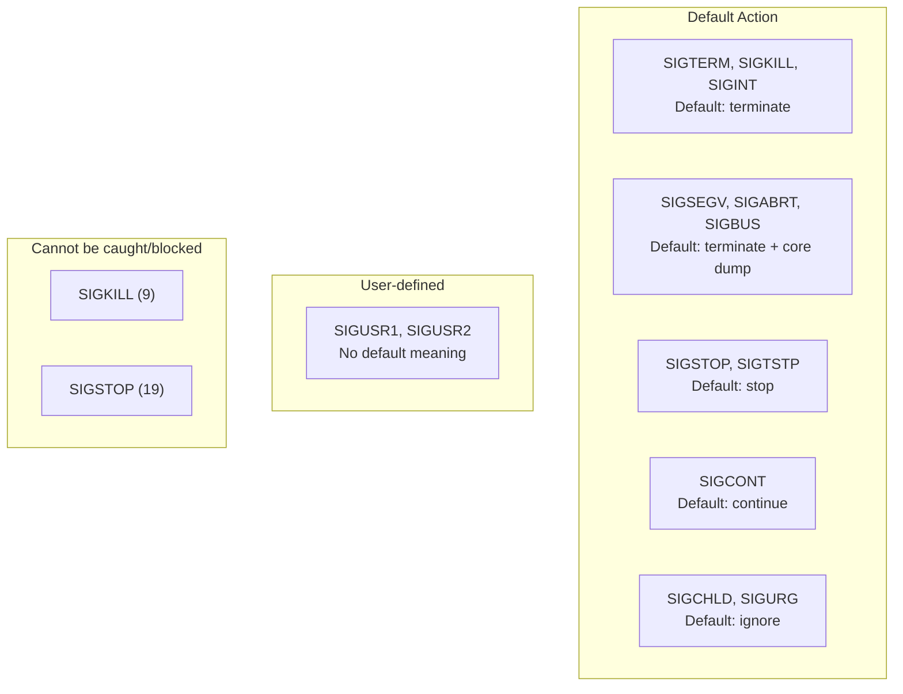
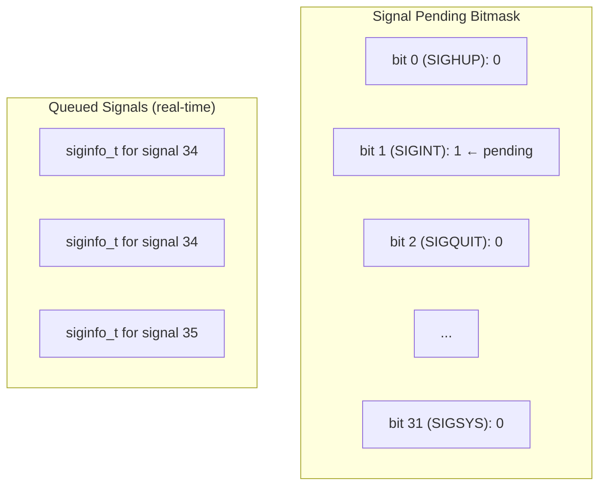

# Signals in Linux

## Introduction

Signals are a form of **inter-process communication (IPC)** in Unix/Linux. They are software interrupts delivered to a process to notify it of events like illegal memory access, user input, child process termination, or timer expiry. Signals are the oldest form of IPC in Unix, dating back to the earliest versions.

Signals have several unique properties:
- **Asynchronous** — a signal can arrive at any time
- **No payload** — only a signal number is delivered (though real-time signals can carry data)
- **Can be caught, blocked, or ignored** — except `SIGKILL` and `SIGSTOP`
- **One bit of information** — the signal is either pending or not

## Standard Signals

Linux defines 31 standard signals (1-31) and real-time signals (32-64):

```c
/* include/uapi/asm-generic/signal.h */
#define SIGHUP           1      /* Hangup */
#define SIGINT           2      /* Interrupt (Ctrl+C) */
#define SIGQUIT          3      /* Quit (Ctrl+\) */
#define SIGILL           4      /* Illegal instruction */
#define SIGTRAP          5      /* Trace/breakpoint trap */
#define SIGABRT          6      /* Abort */
#define SIGBUS           7      /* Bus error */
#define SIGFPE           8      /* Floating-point exception */
#define SIGKILL          9      /* Kill (cannot be caught) */
#define SIGUSR1         10      /* User-defined 1 */
#define SIGSEGV         11      /* Segmentation fault */
#define SIGUSR2         12      /* User-defined 2 */
#define SIGPIPE         13      /* Broken pipe */
#define SIGALRM         14      /* Timer alarm */
#define SIGTERM         15      /* Termination */
#define SIGSTKFLT       16      /* Stack fault */
#define SIGCHLD         17      /* Child stopped/terminated */
#define SIGCONT         18      /* Continue (cannot be blocked) */
#define SIGSTOP         19      /* Stop (cannot be caught) */
#define SIGTSTP         20      /* Terminal stop (Ctrl+Z) */
#define SIGTTIN         21      /* Background read from tty */
#define SIGTTOU         22      /* Background write to tty */
#define SIGURG          23      /* Urgent data on socket */
#define SIGXCPU         24      /* CPU time limit exceeded */
#define SIGXFSZ         25      /* File size limit exceeded */
#define SIGVTALRM       26      /* Virtual timer expired */
#define SIGPROF         27      /* Profiling timer expired */
#define SIGWINCH        28      /* Window size change */
#define SIGIO           29      /* I/O possible */
#define SIGPWR          30      /* Power failure */
#define SIGSYS          31      /* Bad system call */
```

### Signal Classification



## Signal Delivery

### How Signals Are Sent

```c
/* Sending a signal from userspace */
kill(pid, sig)           /* Send to process or process group */
killpg(pgrp, sig)        /* Send to process group */
tgkill(tgid, tid, sig)   /* Send to specific thread */
raise(sig)               /* Send to current thread */
```

### Kernel Signal Sending

```c
/* kernel/signal.c */
int kill_something_info(int sig, struct kernel_siginfo *info, pid_t pid)
{
    if (pid > 0)
        return kill_pid_info(sig, info, find_vpid(pid));
    else if (pid == 0)
        return kill_pgrp_info(sig, info, task_pgrp(current));
    else if (pid == -1)
        return kill_info(sig, info, NULL);  /* Send to all processes */
    else
        return kill_pgrp_info(sig, info, find_vpid(-pid));
}

int kill_pid_info(int sig, struct kernel_siginfo *info, struct pid *pid)
{
    struct task_struct *p;
    int ret;

    rcu_read_lock();
    for_each_task_in_pid(p, pid) {
        ret = group_send_sig_info(sig, info, p, PIDTYPE_TGID);
        if (ret)
            break;
    }
    rcu_read_unlock();
    return ret;
}
```

### Signal Queuing

Standard signals are **not queued** — if multiple instances of the same signal are pending, only one is delivered. Real-time signals (32-64) are queued.

```c
/* include/linux/sched/signal.h */
struct sigpending {
    struct list_head list;    /* List of queued signals */
    sigset_t signal;          /* Bitmask of pending signals */
};

struct signal_struct {
    sigset_t shared_pending;  /* Process-directed signals */
    /* ... */
};

struct task_struct {
    struct sigpending pending; /* Thread-directed signals */
    sigset_t blocked;          /* Blocked signal mask */
    /* ... */
};
```



## Signal Handling

### Default Actions

Every signal has a default action:

```c
/* kernel/signal.c */
static int sig_task_ignored(struct task_struct *t, int sig, bool force)
{
    /* SIGKILL and SIGSTOP can never be ignored */
    if (sig_kernel_only(sig))
        return 0;

    /* Check if signal is blocked */
    if (sigismember(&t->blocked, sig) || sigismember(&t->real_blocked, sig))
        return 0;

    /* Check if signal has a handler */
    if (sig_handler_ignored(sig_handler(t, sig), sig))
        return 1;

    return 0;
}
```

Default actions:
- **Term** — Terminate the process
- **Core** — Terminate and dump core
- **Stop** — Stop the process
- **Cont** — Continue a stopped process
- **Ign** — Ignore the signal

### Signal Handlers with `sigaction()`

```c
#include <signal.h>
#include <stdio.h>
#include <stdlib.h>
#include <unistd.h>

void handler(int sig, siginfo_t *info, void *context) {
    printf("Received signal %d from pid %d\n",
           sig, info->si_pid);
}

int main(void) {
    struct sigaction sa;

    /* Set up signal handler */
    sa.sa_sigaction = handler;
    sa.sa_flags = SA_SIGINFO;  /* Use sa_sigaction, not sa_handler */
    sigemptyset(&sa.sa_mask);

    if (sigaction(SIGUSR1, &sa, NULL) == -1) {
        perror("sigaction");
        return 1;
    }

    printf("PID: %d\n", getpid());

    /* Wait for signals */
    while (1) {
        pause();  /* Sleep until signal */
    }
    return 0;
}
```

### Signal Action Structure

```c
/* include/uapi/asm-generic/signal.h */
struct sigaction {
    __sighandler_t sa_handler;      /* Default handler */
    unsigned long sa_flags;         /* Flags */
    __sigrestore_t sa_restorer;     /* Signal restorer */
    sigset_t sa_mask;               /* Signals to block during handler */
};

/* For SA_SIGINFO, use sa_sigaction instead of sa_handler */
typedef void (*__sighandler_t)(int);
typedef void (*__signalfn_t)(int, siginfo_t *, void *);
```

### Signal Flags

```c
/* include/uapi/asm-generic/signal.h */
#define SA_NOCLDSTOP    0x00000001  /* Don't send SIGCHLD when children stop */
#define SA_NOCLDWAIT    0x00000002  /* Don't create zombies */
#define SA_SIGINFO      0x00000004  /* Use sa_sigaction (3 args) */
#define SA_ONSTACK      0x08000000  /* Use alternate signal stack */
#define SA_RESTART      0x10000000  /* Restart system calls */
#define SA_NODEFER      0x40000000  /* Don't block signal in handler */
#define SA_RESETHAND    0x80000000  /* Reset handler after delivery */
```

## Signal Delivery Internals

### When Signals Are Checked

Signals are checked at specific points:
1. **Returning from system calls**
2. **Returning from interrupt handlers**
3. **Before returning to userspace**

```c
/* arch/x86/entry/entry_64.S */
ret_from_sys_call:
    /* Check for pending signals */
    movl    $_TIF_WORK_SYSCALL_ENTRY, %edi
    /* ... */
    call    do_signal

/* kernel/signal.c */
void do_signal(struct pt_regs *regs)
{
    struct ksignal ksig;

    if (get_signal(&ksig)) {
        /* Signal found — deliver it */
        handle_signal(&ksig, regs);
    } else {
        /* No signal — restart syscall or return */
        restart_syscall(regs);
    }
}
```

### get_signal() — Finding a Pending Signal

```c
/* kernel/signal.c */
bool get_signal(struct ksignal *ksig)
{
    struct sighand_struct *sighand = current->sighand;
    struct signal_struct *signal = current->signal;
    sigset_t *mask = &current->blocked;
    int signr;

    /* Check for group stop */
    if (unlikely(signal->group_stop_count > 0)) {
        /* Handle group stop */
        /* ... */
    }

    /* Check for fatal signals */
    if (unlikely(fatal_signal_pending(current))) {
        /* Handle fatal signal */
        /* ... */
    }

    /* Check shared pending signals (process-directed) */
    for (;;) {
        struct k_sigaction *ka;
        signr = dequeue_sigs(&current->pending, mask, ksig);

        /* If no thread-directed signal, check process-directed */
        if (!signr)
            signr = dequeue_sigs(&signal->shared_pending, mask, ksig);

        if (!signr)
            break;  /* No signal pending */

        /* Get the action for this signal */
        ka = &sighand->action[signr - 1];

        /* Check if we should deliver it */
        if (sig_handler_ignored(ka->sa_handler, signr))
            continue;  /* Signal is ignored */

        if (ka->sa_handler == SIG_DFL) {
            /* Default action */
            switch (sig_default_action(current, signr)) {
            case SIGNAL_DUMP_CORE:
                /* Core dump */
                do_coredump(ksig);
                /* Fall through to terminate */
            case SIGNAL_TERMINATE:
                do_group_exit(signr);
                break;
            case SIGNAL_STOP:
                do_signal_stop(signr);
                break;
            case SIGNAL_CONTINUE:
                /* Continue */
                break;
            }
            continue;
        }

        /* Deliver the signal */
        ksig->sig = signr;
        ksig->info = ksig->info;
        return true;
    }
    return false;
}
```

### handle_signal() — Delivering to Userspace

```c
/* kernel/signal.c */
static void handle_signal(struct ksignal *ksig, struct pt_regs *regs)
{
    /* Set up the stack frame for the signal handler */
    /* Architecture-specific: sets up return address, arguments */

    /* Block signals specified in sa_mask */
    sigset_t blocked;
    sigorsets(&blocked, &current->blocked, &current->sighand->action[ksig->sig-1].sa_mask);

    /* Also block the current signal unless SA_NODEFER */
    if (!(current->sighand->action[ksig->sig-1].sa_flags & SA_NODEFER))
        sigaddset(&blocked, ksig->sig);

    set_current_blocked(&blocked);

    /* Set up registers to call the handler */
    signal_setup_done(ksig, regs, 0);
}
```

### Signal Stack Frame (x86-64)

```c
/* arch/x86/kernel/signal_64.c */
static int __setup_rt_frame(int sig, struct ksignal *ksig,
                            sigset_t *set, struct pt_regs *regs)
{
    struct rt_sigframe __user *frame;

    /* Allocate frame on user stack */
    frame = get_sigframe(ksig, regs, sizeof(struct rt_sigframe));

    /* Set up handler arguments */
    /* RDI = signal number */
    /* RSI = siginfo_t pointer */
    /* RDX = ucontext_t pointer */
    regs->di = sig;
    regs->si = (unsigned long)&frame->info;
    regs->dx = (unsigned long)&frame->uc;

    /* Set up return address (sigreturn trampoline) */
    regs->ip = (unsigned long)ksig->ka.sa.sa_handler;

    /* Save current context */
    if (copy_to_user(&frame->uc, &uc, sizeof(uc)))
        return -EFAULT;

    /* Set up restorer */
    regs->sp = (unsigned long)frame;
    regs->cx = (unsigned long)ksig->ka.sa.sa_restorer;

    return 0;
}
```

## Blocked Signals

### Signal Mask

Each thread has a **signal mask** — a set of signals that are currently blocked:

```c
/* Include signal mask manipulation */
#include <signal.h>

sigset_t mask;
sigemptyset(&mask);
sigaddset(&mask, SIGINT);       /* Block SIGINT */
sigaddset(&mask, SIGTERM);      /* Block SIGTERM */
sigprocmask(SIG_BLOCK, &mask, NULL);  /* Add to current mask */

/* Unblock */
sigprocmask(SIG_UNBLOCK, &mask, NULL);

/* Set mask */
sigprocmask(SIG_SETMASK, &mask, NULL);
```

### `sigsuspend()` — Atomically Wait for Signal

```c
/* Atomically replace mask and wait for signal */
sigset_t mask;
sigemptyset(&mask);
sigaddset(&mask, SIGUSR1);

/* Temporarily unblock SIGUSR1 and wait */
sigsuspend(&mask);
/* Signal delivered, mask restored */
```

## Real-Time Signals

### Standard vs. Real-Time Signals

| Feature | Standard (1-31) | Real-Time (32-64) |
|---|---|---|
| Queued | No (lost if multiple) | Yes (all delivered) |
| Payload | No (just signal number) | Yes (siginfo_t with data) |
| Order | Undefined | Delivered in order sent |
| Default action | Varies | Terminate |

### Sending Real-Time Signals with Data

```c
#include <signal.h>
#include <stdio.h>
#include <stdlib.h>
#include <unistd.h>

void rt_handler(int sig, siginfo_t *info, void *context) {
    printf("Received RT signal %d\n", sig);
    printf("  si_signo: %d\n", info->si_signo);
    printf("  si_errno: %d\n", info->si_errno);
    printf("  si_code:  %d\n", info->si_code);
    printf("  si_pid:   %d\n", info->si_pid);
    printf("  si_uid:   %d\n", info->si_uid);
    printf("  si_int:   %d\n", info->si_int);  /* User data */
    printf("  si_ptr:   %p\n", info->si_ptr);   /* User data pointer */
}

int main(void) {
    struct sigaction sa;
    sigset_t mask;

    /* Set up handler for real-time signal */
    sa.sa_sigaction = rt_handler;
    sa.sa_flags = SA_SIGINFO;
    sigemptyset(&sa.sa_mask);
    sigaction(SIGRTMIN + 1, &sa, NULL);

    /* Send signal with data */
    union sigval value;
    value.sival_int = 42;
    sigqueue(getpid(), SIGRTMIN + 1, value);

    pause();
    return 0;
}
```

### Signal Queuing

```c
/* kernel/signal.c */
static int __send_signal_locked(int sig, struct kernel_siginfo *info,
                                 struct task_struct *t, int type)
{
    struct sigpending *pending;
    struct sigqueue *q;

    /* Determine which queue */
    if (type == PIDTYPE_PID)
        pending = &t->pending;     /* Thread-directed */
    else
        pending = &t->signal->shared_pending;  /* Process-directed */

    /* For real-time signals: queue a siginfo_t */
    if (sig >= SIGRTMIN && sig_nr_qlimited(sig)) {
        q = __sigqueue_alloc(sig, t, GFP_ATOMIC, sig_rt_mask(sig), 0);
        if (q) {
            list_add_tail(&q->list, &pending->list);
            copy_siginfo(&q->info, info);
        }
    }

    /* Set the signal bit in the pending mask */
    sigaddset(&pending->signal, sig);

    /* Wake up the target */
    complete_signal(sig, t, type);

    return 0;
}
```

## Alternate Signal Stack

### Why It's Needed

If a signal arrives while the stack is corrupted (e.g., stack overflow), the signal handler can't use the normal stack. An **alternate signal stack** provides a safe place:

```c
#include <signal.h>
#include <stdio.h>
#include <stdlib.h>
#include <string.h>

void handler(int sig) {
    /* Running on alternate stack */
    printf("Caught signal %d on alternate stack\n", sig);
    _exit(1);
}

int main(void) {
    stack_t ss;

    /* Allocate alternate stack */
    ss.ss_sp = malloc(SIGSTKSZ);
    ss.ss_size = SIGSTKSZ;
    ss.ss_flags = 0;
    sigaltstack(&ss, NULL);

    /* Set handler with SA_ONSTACK */
    struct sigaction sa;
    sa.sa_handler = handler;
    sa.sa_flags = SA_ONSTACK;
    sigemptyset(&sa.sa_mask);
    sigaction(SIGSEGV, &sa, NULL);

    /* Trigger stack overflow */
    char buf[1];
    buf[1000000] = 'x';  /* Stack smash → SIGSEGV on alt stack */

    return 0;
}
```

## Signal Interaction with System Calls

### Interrupted System Calls

When a signal arrives during a blocking system call, the syscall may be interrupted:

```c
/* Without SA_RESTART: syscall returns -EINTR */
ssize_t n = read(fd, buf, sizeof(buf));
if (n == -1 && errno == EINTR) {
    /* Interrupted by signal, retry */
}

/* With SA_RESTART: syscall automatically restarts */
struct sigaction sa;
sa.sa_flags = SA_RESTART;
sigaction(SIGALRM, &sa, NULL);
```

### `sigwaitinfo()` — Synchronous Signal Handling

```c
#include <signal.h>
#include <stdio.h>

int main(void) {
    sigset_t mask;
    siginfo_t info;

    /* Block SIGUSR1 */
    sigemptyset(&mask);
    sigaddset(&mask, SIGUSR1);
    sigprocmask(SIG_BLOCK, &mask, NULL);

    /* Synchronously wait for the signal */
    while (1) {
        int sig = sigwaitinfo(&mask, &info);
        if (sig == -1)
            continue;

        printf("Received signal %d from pid %d\n",
               info.si_signo, info.si_pid);
    }
    return 0;
}
```

## Signal-Related `ptrace()` Operations

Debuggers use `ptrace()` to intercept signals:

```c
#include <sys/ptrace.h>
#include <sys/wait.h>

/* Parent traces child */
ptrace(PTRACE_SEIZE, child_pid, NULL, NULL);

while (1) {
    int status;
    waitpid(child_pid, &status, 0);

    if (WIFSTOPPED(status)) {
        int sig = WSTOPSIG(status);
        printf("Child stopped by signal %d\n", sig);

        /* Forward the signal to the child */
        ptrace(PTRACE_CONT, child_pid, NULL, (void *)(long)sig);
    }
}
```

## Practical Examples

### Signal Statistics

```bash
# View pending signals
$ cat /proc/$PID/status | grep -i sig
SigPnd: 0000000000000000
SigBlk: 0000000000000000
SigIgn: 0000000000000004
SigCgt: 0000000180000000

# Decode signal mask
$ python3 -c "
mask = 0x0000000180000000
for i in range(1, 65):
    if mask & (1 << (i-1)):
        print(f'Signal {i}')
"
# Shows which signals are caught/ignored/blocked
```

### Sending Signals Programmatically

```bash
# From shell
$ kill -SIGUSR1 1234
$ kill -9 1234          # SIGKILL
$ kill -STOP 1234       # SIGSTOP
$ kill -CONT 1234       # SIGCONT

# To a process group
$ kill -SIGTERM -500     # Negative PID = process group

# All processes (dangerous!)
$ kill -SIGTERM -1
```

## Further Reading

- [The Linux Kernel Documentation](https://docs.kernel.org/)
- [GNU Project Documentation](https://www.gnu.org/doc/doc.html)
- [GNU Manuals](https://www.gnu.org/manual/manual.html)
- [Free Software Directory](https://directory.fsf.org/wiki/Main_Page)
- [Planet GNU](https://planet.gnu.org/)
- [Free Software Books](https://www.gnu.org/doc/other-free-books.html)

- [Linux man pages: signal(7)](https://man7.org/linux/man-pages/man7/signal.7.html)
- [Linux man pages: sigaction(2)](https://man7.org/linux/man-pages/man2/sigaction.2.html)
- [Linux man pages: kill(2)](https://man7.org/linux/man-pages/man2/kill.2.html)
- [Linux kernel: kernel/signal.c](https://elixir.bootlin.com/linux/latest/source/kernel/signal.c)
- [The Linux Programming Interface: Signals](https://man7.org/tlpi/)
- [LWN: Signal handling in the kernel](https://lwn.net/Articles/332974/)
- [Linux kernel documentation: Signal](https://www.kernel.org/doc/html/latest/process/adding-syscalls.html)

## Related Topics

- [Process States](process-states.md) — How signals affect process states
- [Processes and Threads](processes-and-threads.md) — Signal delivery to threads
- [Real-Time Scheduling](realtime-scheduling.md) — Real-time signals and scheduling
- [task_struct Deep Dive](task-struct.md) — Signal-related fields
- [Process Creation](process-creation.md) — Signal handling inheritance
