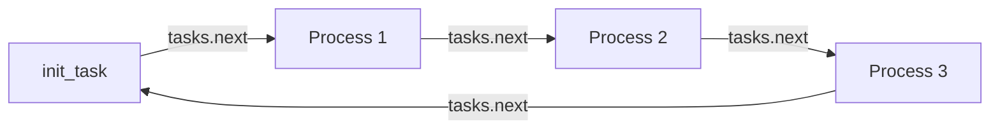
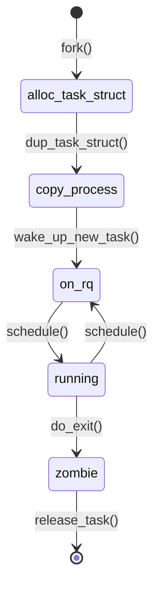

# task_struct Deep Dive

## Introduction

The `task_struct` is the most important data structure in the Linux kernel. Every schedulable entity — process, thread, kernel thread — is represented by one instance. It's a massive structure (over 5 KB on x86-64) that contains everything the kernel needs to manage a task: scheduling state, memory mappings, open files, signal handling, credentials, cgroup membership, and much more.

Understanding `task_struct` is essential for anyone working with the Linux kernel at a systems level. This chapter dissects its major fields, explains how it's allocated and organized, and shows how the kernel uses it.

## Allocation and Layout

### Historical Evolution

The allocation strategy for `task_struct` has evolved significantly:

| Era | Strategy | Details |
|---|---|---|
| Linux 2.4 and earlier | Embedded in kernel stack | `task_struct` lived at the bottom of the 8KB kernel stack |
| Linux 2.6+ | Slab-allocated + `thread_info` | `task_struct` on slab cache, `thread_info` on kernel stack |
| Linux 3.10+ | `thread_info` reduced | Minimal `thread_info` on stack, most data in `task_struct` |
| Linux 4.9+ (x86) | Stack-based `thread_info` removed | `thread_info` embedded in `task_struct` |

Modern Linux allocates `task_struct` via the **SLAB/SLUB allocator** and keeps only a small `thread_info` (or nothing, on some architectures) on the kernel stack.

```c
/* include/linux/sched.h - simplified */
struct task_struct {
    struct thread_info      thread_info;  /* must be first */
    volatile long           state;        /* -1 unrunnable, 0 runnable, >0 stopped */
    int                     on_cpu;
    int                     on_rq;
    int                     prio;
    int                     static_prio;
    int                     normal_prio;
    unsigned int            rt_priority;
    const struct sched_class *sched_class;
    struct sched_entity     se;
    struct sched_rt_entity  rt;
    struct sched_dl_entity  dl;
    struct sched_info       sched_info;

    /* ... hundreds more fields ... */
};
```

### Allocation with SLUB

```c
/* kernel/fork.c */
struct task_struct *alloc_task_struct_node(int node)
{
    return kmem_cache_alloc(task_struct_cachep, GFP_KERNEL);
}

/* During kernel boot, the cache is created: */
void __init fork_init(void)
{
    /* Create a slab cache for task_struct objects */
    task_struct_cachep = kmem_cache_create("task_struct",
        arch_task_struct_size, align,
        SLAB_PANIC|SLAB_ACCOUNT, NULL);
}
```

The `arch_task_struct_size` allows architectures to extend `task_struct` with architecture-specific fields (e.g., `struct thread_struct` for FPU state, debug registers).

### The Kernel Stack

Each task has a kernel stack, typically 8KB (2 pages) on most architectures, or 16KB on some:

```
┌─────────────────────────┐ High address
│                         │
│   Kernel Stack          │  ← stack grows downward
│   (8KB / 16KB)         │
│                         │
├─────────────────────────┤
│   thread_info            │  (on architectures that still use it)
│   (embedded at bottom)  │
└─────────────────────────┘ Low address
```

```c
/* For x86-64, THREAD_SIZE is 16KB (4 pages) */
#define THREAD_SIZE  (4096 * 4)

/* The stack is allocated in fork */
static struct task_struct *dup_task_struct(struct task_struct *orig, int node)
{
    struct task_struct *tsk;
    unsigned long *stack;

    tsk = alloc_task_struct_node(node);
    stack = alloc_thread_stack_node(tsk, node);
    tsk->stack = stack;
    /* ... */
}
```

## Key Field Groups

### 1. Identity Fields

```c
struct task_struct {
    pid_t pid;                  /* Process ID (thread ID in kernel terms) */
    pid_t tgid;                 /* Thread group ID (userspace PID) */

    /* Parent-child relationships */
    struct task_struct __rcu *real_parent;
    struct task_struct __rcu *parent;
    struct list_head children;
    struct list_head sibling;

    /* Names */
    char comm[TASK_COMM_LEN];   /* Executable name (16 chars max) */

    /* Credentials */
    const struct cred __rcu *cred;      /* Effective credentials */
    const struct cred __rcu *real_cred; /* Objective credentials */

    /* Session/Process group (for job control) */
    pid_t session;
    pid_t pgrp;
};
```

```bash
# View identity fields from /proc
$ cat /proc/self/status | grep -E '^(Name|Pid|PPid|Tgid|Uid|Gid|NStgid|NSpid)'
Name:   cat
Pid:    12345
PPid:   500
Tgid:   12345
Uid:    1000    1000    1000    1000
Gid:    1000    1000    1000    1000
NStgid: 12345
NSpid:  12345
```

### 2. Scheduling Fields

These fields control how the task is scheduled:

```c
struct task_struct {
    int prio;                    /* Dynamic priority (lower = higher priority) */
    int static_prio;             /* Set by user (nice value converted) */
    int normal_prio;             /* Priority based on scheduling policy */
    unsigned int rt_priority;    /* Real-time priority (0-99) */

    const struct sched_class *sched_class; /* Scheduling class (fair, rt, dl) */
    struct sched_entity se;      /* CFS/EEVDF scheduling entity */
    struct sched_rt_entity rt;   /* RT scheduling entity */
    struct sched_dl_entity dl;   /* Deadline scheduling entity */

    unsigned int policy;         /* SCHED_NORMAL, SCHED_FIFO, etc. */
    int nr_cpus_allowed;
    cpumask_t cpus_mask;         /* CPUs this task may run on */

    unsigned long wake_entry;    /* Used by scheduler for wake-up */
    int on_rq;                   /* Is it on a run queue? */
    int on_cpu;                  /* Currently running on a CPU? */
    int cpu;                     /* Which CPU? */
    int recent_used_cpu;         /* Last CPU used (for cache affinity) */
};
```

### 3. Memory Management Fields

```c
struct task_struct {
    struct mm_struct *mm;        /* Memory descriptor (user space) */
    struct mm_struct *active_mm; /* Active mm (for kernel threads borrowing user mm) */

    /* For kernel threads: mm is NULL, active_mm is borrowed */
    /* For user tasks: mm == active_mm */
};
```

The `mm_struct` (see [Memory Management](../memory/)) contains:
- Page table root (`pgd`)
- Virtual memory areas (`vm_area_struct` linked list and red-black tree)
- Code, data, heap, and stack segment boundaries
- `mmap_lock` (read-write semaphore protecting the address space)

```bash
# View memory layout
$ cat /proc/self/maps
55a8f4000000-55a8f4020000 r-xp 00000000 08:01 131074  /usr/bin/cat
55a8f4220000-55a8f4221000 r--p 00020000 08:01 131074  /usr/bin/cat
55a8f4221000-55a8f4222000 rw-p 00021000 08:01 131074  /usr/bin/cat
7f8c1c000000-7f8c1c021000 rw-p 00000000 00:00 0       [heap]
7f8c1c021000-7f8c1c200000 ---p 00000000 00:00 0
7ffc12340000-7ffc12361000 rw-p 00000000 00:00 0       [stack]
```

### 4. File System and Files

```c
struct task_struct {
    /* Filesystem info */
    struct fs_struct *fs;        /* CWD, root directory, umask */

    /* Open file descriptors */
    struct files_struct *files;  /* File descriptor table */
};
```

```c
/* include/linux/fs_struct.h */
struct fs_struct {
    int users;
    spinlock_t lock;
    seqcount_t seq;
    int umask;
    int in_exec;
    struct path root;     /* Root filesystem path */
    struct path pwd;      /* Current working directory */
};
```

Threads in the same group share `fs` and `files` (set by `CLONE_FS` and `CLONE_FILES`).

### 5. Signal Handling

```c
struct task_struct {
    struct signal_struct *signal;     /* Shared by all threads in group */
    struct sighand_struct *sighand;   /* Signal handlers (may be shared) */
    sigset_t blocked;                 /* Blocked signals (per-thread) */
    sigset_t real_blocked;
    struct sigpending pending;        /* Per-thread pending signals */
    unsigned long sas_ss_sp;          /* Alternate signal stack pointer */
    size_t sas_ss_size;               /* Alternate signal stack size */
};
```

```c
/* include/linux/sched/signal.h */
struct signal_struct {
    sigset_t shared_pending;    /* Shared pending signals (process-directed) */
    /* ... */
    int group_exit_code;        /* Exit code for the group */
    int group_stop_count;       /* For SIGSTOP/SIGCONT */
    /* ... */
};

struct sighand_struct {
    spinlock_t siglock;
    struct k_sigaction action[_NSIG];  /* Signal handler table */
};
```

### 6. Credentials and Security

```c
struct task_struct {
    const struct cred __rcu *cred;       /* Effective credentials */
    const struct cred __rcu *real_cred;  /* Objective credentials */
};

struct cred {
    kuid_t uid;      /* User ID */
    kgid_t gid;      /* Group ID */
    kuid_t suid;     /* Saved UID */
    kgid_t sgid;     /* Saved GID */
    kuid_t euid;     /* Effective UID */
    kgid_t egid;     /* Effective GID */
    kuid_t fsuid;    /* UID for filesystem checks */
    kgid_t fsgid;    /* GID for filesystem checks */
    unsigned securebits;  /* Security bits */
    kernel_cap_t cap_inheritable;
    kernel_cap_t cap_permitted;
    kernel_cap_t cap_effective;
    kernel_cap_t cap_bset;     /* Capability bounding set */
    kernel_cap_t cap_ambient;
    /* ... */
};
```

### 7. Namespace and Cgroup Fields

```c
struct task_struct {
    /* Namespaces */
    struct nsproxy *nsproxy;

    /* Cgroup */
    struct css_set __rcu *cgroups;
    struct list_head cg_list;
};
```

### 8. Debugging and Tracing

```c
struct task_struct {
    unsigned ptrace;            /* Ptrace flags */
    struct list_head ptraced;
    struct list_head ptrace_entry;

    /* Performance events */
    struct perf_event_context *perf_event_ctxp;
    struct list_head perf_event_list;

    /* Audit */
    struct audit_context *audit_context;
};
```

## The `current` Macro

The kernel frequently needs to access the `task_struct` of the currently running task. This is done via the `current` macro, which is architecture-specific:

```c
/* x86-64: include/asm-generic/current.h */
/* The per-CPU variable 'current_task' is maintained by the scheduler */
DECLARE_PER_CPU(struct task_struct *, current_task);

static __always_inline struct task_struct *get_current(void)
{
    return this_cpu_read_stable(current_task);
}

#define current get_current()
```

On x86-64, the GS base register points to the per-CPU area, making `current` a fast per-CPU variable read. On some architectures (like older ARM), `current` is derived from the kernel stack pointer:

```c
/* ARM32: deriving current from stack pointer */
#define current (struct task_struct *)(thread_info->task)
/* where thread_info is at the bottom of the kernel stack */
```

## Process List Traversal

The kernel provides several macros for iterating over task lists:

```c
/* Iterate over all processes in the system */
struct task_struct *p;

for_each_process(p) {
    printk(KERN_INFO "PID: %d, CMD: %s\n", p->pid, p->comm);
}

/* Iterate over all threads of a thread group */
struct task_struct *t;
for_each_thread(p, t) {
    printk(KERN_INFO "TID: %d\n", t->pid);
}
```

The `for_each_process` macro walks the `init_task.tasks` list:

```c
/* include/linux/sched/signal.h */
#define for_each_process(p) \
    for (p = &init_task; (p = next_task(p)) != &init_task; )

#define next_task(p) \
    list_entry_rcu((p)->tasks.next, struct task_struct, tasks)
```



### Finding Tasks by PID

The kernel uses a hash table for PID-to-task lookups:

```c
/* kernel/pid.c */
struct task_struct *find_task_by_vpid(pid_t vnr)
{
    return find_task_by_pid_ns(vnr, current->nsproxy->pid_ns_for_children);
}

struct task_struct *find_task_by_pid_ns(pid_t nr, struct pid_namespace *ns)
{
    return pid_task(find_pid_ns(nr, ns), PIDTYPE_PID);
}
```

```bash
# Userspace PID lookup via /proc
$ ls /proc/1/
attr/    cgroup   comm     cwd@     exe@     fd/      ...
$ cat /proc/1/comm
systemd
```

## Reference Counting and Lifecycle

### `task_struct` Lifecycle



The `task_struct` is reference-counted. When a task exits:

1. `do_exit()` is called — the task becomes a zombie
2. The parent receives `SIGCHLD`
3. The parent calls `wait()` → `release_task()`
4. `release_task()` frees the `task_struct` and kernel stack

```c
/* kernel/exit.c - simplified */
void release_task(struct task_struct *p)
{
    /* ... */
    /* Decrement reference count, free if zero */
    put_task_struct(p);
}

/* include/linux/sched/task.h */
static inline void put_task_struct(struct task_struct *t)
{
    refcount_dec_and_test(&t->usage);
    if (unlikely(refcount_read(&t->usage) == 0))
        __put_task_struct(t);
}

void __put_task_struct(struct task_struct *tsk)
{
    /* ... cleanup ... */
    free_task(tsk);  /* Frees task_struct and kernel stack */
}
```

## Practical Examples

### Reading `task_struct` from `/proc`

```bash
# Get comprehensive task information
$ cat /proc/self/status
Name:   bash
Umask:  0022
State:  S (sleeping)
Tgid:   500
Ngid:   0
Pid:    500
PPid:   1
TracerPid:  0
Uid:    1000    1000    1000    1000
Gid:    1000    1000    1000    1000
FDSize: 256
Groups: 27 1000
NStgid: 500
NSpid:  500
NSpgid: 500
NSsid:  500
VmPeak:    12340 kB
VmSize:    12340 kB
VmLck:         0 kB
VmPin:         0 kB
VmHWM:      5120 kB
VmRSS:      5120 kB
RssAnon:        2048 kB
RssFile:        3072 kB
RssShmem:          0 kB
Threads:    1
```

### Inspecting `task_struct` with `crash` (kernel debugger)

```bash
# Start crash on a live system or vmcore
$ crash /usr/lib/debug/boot/vmlinux-$(uname -r) /proc/kcore

# Display current task_struct
crash> struct task_struct
struct task_struct {
    struct thread_info thread_info;
    volatile long state;
    ...
}

# Look at a specific task
crash> task 1
PID: 1      TASK: ffff888001234500  COMMAND: "systemd"
struct task_struct {
  thread_info = {
    flags = 0,
    cpu = 0
  },
  state = 1,
  stack = 0xffffc90000000000,
  ...
}

# Show all tasks in a thread group
crash> task -t 500
PID: 500  TASK: ffff888006789000  COMMAND: "bash"
PID: 501  TASK: ffff888006789200  COMMAND: "bash"
PID: 502  TASK: ffff888006789400  COMMAND: "bash"
```

### Programmatic Access via `/proc`

```bash
# Get open files
$ ls -la /proc/self/fd
lrwx------ 1 user user 64 Jan  1 00:00 0 -> /dev/pts/0
lrwx------ 1 user user 64 Jan  1 00:00 1 -> /dev/pts/0
lrwx------ 1 user user 64 Jan  1 00:00 2 -> /dev/pts/0

# Get memory maps
$ cat /proc/self/maps | head -5
55a8f4000000-55a8f4020000 r-xp 00000000 08:01 131074  /usr/bin/cat

# Get cgroup membership
$ cat /proc/self/cgroup
0::/user.slice/user-1000.slice/session-1.scope

# Get namespace information
$ ls -la /proc/self/ns/
lrwxrwxrwx 1 user user 0 Jan  1 00:00 cgroup -> 'cgroup:[4026531835]'
lrwxrwxrwx 1 user user 0 Jan  1 00:00 ipc -> 'ipc:[4026531839]'
lrwxrwxrwx 1 user user 0 Jan  1 00:00 mnt -> 'mnt:[4026531840]'
lrwxrwxrwx 1 user user 0 Jan  1 00:00 net -> 'net:[4026531840]'
lrwxrwxrwx 1 user user 0 Jan  1 00:00 pid -> 'pid:[4026531836]'
lrwxrwxrwx 1 user user 0 Jan  1 00:00 user -> 'user:[4026531837]'
lrwxrwxrwx 1 user user 0 Jan  1 00:00 uts -> 'uts:[4026531838]'
```

## Size and Performance Considerations

The `task_struct` is large, and its layout matters for cache performance:

```bash
# Check actual size on your kernel
$ pahole -C task_struct /usr/lib/debug/boot/vmlinux-$(uname -r) | wc -l
# Typically 500+ lines

# The structure is > 5KB on most configurations
$ pahole -C task_struct /usr/lib/debug/boot/vmlinux-$(uname -r) | tail -1
/* size: 5120, cachelines: 80, members: 200+ */
```

The kernel developers carefully organize frequently-accessed fields into the same cache lines:

```c
/*
 * Fields accessed during scheduling (hot path) are grouped at the top:
 * - state, prio, sched_class, on_rq, on_cpu
 * These are accessed every time schedule() runs.
 */
```

## Further Reading

- [The Linux Kernel Documentation](https://docs.kernel.org/)
- [GNU Project Documentation](https://www.gnu.org/doc/doc.html)
- [GNU Manuals](https://www.gnu.org/manual/manual.html)
- [Free Software Directory](https://directory.fsf.org/wiki/Main_Page)
- [Planet GNU](https://planet.gnu.org/)
- [Free Software Books](https://www.gnu.org/doc/other-free-books.html)

- [Linux man pages: proc(5)](https://man7.org/linux/man-pages/man5/proc.5.html)
- [Linux kernel source: include/linux/sched.h](https://elixir.bootlin.com/linux/latest/source/include/linux/sched.h)
- [Linux kernel source: kernel/fork.c](https://elixir.bootlin.com/linux/latest/source/kernel/fork.c)
- [Understanding the Linux Kernel, 3rd Edition - Chapter 3: Processes](https://www.oreilly.com/library/view/understanding-the-linux/0596005652/)
- [Linux Insides - Chapter 2: The Linux Kernel](https://0xax.gitbooks.io/linux-insides/content/)
- [LWN: task_struct and its allocation](https://lwn.net/Articles/182711/)

## Related Topics

- [Processes and Threads](processes-and-threads.md) — The conceptual model
- [Process Creation](process-creation.md) — How `task_struct` is created during `fork()`
- [Process States](process-states.md) — The `state` field and its transitions
- [Scheduler Overview](scheduler.md) — How scheduling fields are used
- [Context Switching](context-switching.md) — How `task_struct` is swapped during context switches
