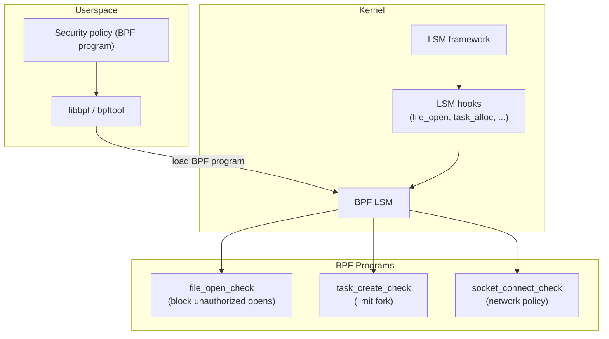

# BPF LSM

## Overview

BPF LSM (Linux Security Module) allows attaching eBPF programs to LSM hooks, enabling dynamic, programmable security policies without writing kernel modules. Merged in Linux 5.7, BPF LSM lets you implement security checks (file access, task creation, network operations) as BPF programs that run at LSM hook points.

BPF LSM complements SELinux and AppArmor by allowing custom, per-pod or per-container security policies that can be deployed and updated without rebooting.

> **Introduced:** Linux 5.7 (commit `fc61143`)  
> **Source:** `security/bpf/`  
> **Kconfig:** `CONFIG_BPF_LSM=y`

---

## Architecture



---

## LSM Hooks

BPF LSM programs attach to existing LSM hooks:

| Hook | Called When | Use Case |
|------|------------|----------|
| `file_open` | File opened | Access control |
| `file_permission` | Permission check | Read/write control |
| `task_alloc` | Process created | Fork limiting |
| `task_kill` | Signal sent | Signal filtering |
| `socket_connect` | TCP/UDP connect | Network policy |
| `socket_bind` | Socket bind | Port restriction |
| `bprm_check_security` | Exec | Exec policy |
| `inode_create` | File created | Creation policy |
| `inode_unlink` | File deleted | Deletion policy |

### BPF LSM Program Structure

```c
// SPDX-License-Identifier: GPL-2.0
#include <linux/bpf.h>
#include <bpf/bpf_helpers.h>
#include <bpf/bpf_tracing.h>

SEC("lsm/file_open")
int BPF_PROG(restrict_open, struct file *file)
{
    /* Get current task's cgroup */
    u64 cgroup_id = bpf_get_current_cgroup_id();

    /* Check if file path matches blocked pattern */
    char path[256];
    bpf_d_path(&file->f_path, path, sizeof(path));

    /* Block access to /etc/shadow for non-root */
    if (bpf_strncmp(path, 11, "/etc/shadow") == 0) {
        u32 uid = bpf_get_current_uid_gid();
        if (uid != 0)
            return -EACCES;  /* Deny access */
    }

    return 0;  /* Allow */
}

char LICENSE[] SEC("license") = "GPL";
```

---

## BPF LSM Helpers

```c
/* Task information */
u64 bpf_get_current_pid_tgid(void);    /* PID + TID */
u64 bpf_get_current_uid_gid(void);     /* UID + GID */
int bpf_get_current_comm(void *buf, u32 size); /* Process name */

/* Cgroup */
u64 bpf_get_current_cgroup_id(void);   /* Cgroup ID */

/* Path operations */
int bpf_d_path(struct path *path, char *buf, u32 sz); /* Path to string */

/* String operations */
int bpf_strncmp(const char *s1, u32 s1_size, const char *s2); /* Compare */

/* Override return value */
int bpf_override_return(void *regs, unsigned long rc); /* Override */
```

---

## Loading BPF LSM Programs

### Using libbpf

```c
#include <bpf/libbpf.h>
#include <bpf/bpf.h>

int main(void)
{
    struct bpf_object *obj;
    struct bpf_link *link;

    /* Open and load BPF object */
    obj = bpf_object__open_file("restrict_open.bpf.o", NULL);
    bpf_object__load(obj);

    /* Attach to LSM hook */
    struct bpf_program *prog = bpf_object__find_program_by_name(obj, "restrict_open");
    link = bpf_program__attach_lsm(prog);

    /* Program is now active */
    pause();
    bpf_link__destroy(link);
    return 0;
}
```

### Using bpftool

```bash
# Load BPF LSM program
bpftool prog load restrict_open.bpf.o /sys/fs/bpf/restrict_open

# Attach to LSM
bpftool net attach lsm name restrict_open

# List loaded BPF LSM programs
bpftool prog list | grep lsm

# Detach
bpftool net detach lsm name restrict_open
```

---

## Use Cases

### Container Security Policy

```c
SEC("lsm/socket_connect")
int BPF_PROG(container_network_policy, struct socket *sock,
             struct sockaddr *address, int addrlen)
{
    u64 cgroup_id = bpf_get_current_cgroup_id();

    /* Block containers from connecting to metadata service */
    if (address->sa_family == AF_INET) {
        struct sockaddr_in *addr = (struct sockaddr_in *)address;
        if (addr->sin_addr.s_addr == htonl(0xC0A80001)) /* 192.168.0.1 */
            return -ECONNREFUSED;
    }

    return 0;
}
```

### Exec Restriction

```c
SEC("lsm/bprm_check_security")
int BPF_PROG(restrict_exec, struct linux_binprm *bprm)
{
    char filename[256];
    bpf_probe_read_str(filename, sizeof(filename), bprm->filename);

    /* Block execution of specific binaries */
    if (bpf_strncmp(filename, 15, "/usr/bin/sudo") == 0)
        return -EPERM;

    return 0;
}
```

---

## Security Considerations

```bash
# BPF LSM requires CAP_BPF + CAP_LSM
# Or privileged container

# Check if BPF LSM is available
cat /sys/kernel/security/lsm
# lockdown,capability,landlock,bpf

# BPF LSM ordering (last checked first)
# Programs run in reverse attach order
```

---

## Source Files

| File | Contents |
|------|----------|
| `security/bpf/hooks.c` | BPF LSM hook registration |
| `security/bpf/lsm.c` | BPF LSM core |
| `include/linux/bpf_lsm.h` | BPF LSM header |

---

## Further Reading

- **Kernel documentation**: `Documentation/bpf/prog_lsm.rst`
- **LWN**: ["BPF and security modules"](https://lwn.net/Articles/808048/)
- **libbpf**: [BPF LSM examples](https://github.com/libbpf/libbpf-bootstrap)

---

## See Also

- [eBPF](./ebpf.md) — BPF subsystem overview
- [LSM](./lsm.md) — LSM framework
- [SELinux](./selinux.md) — SELinux LSM
- [Landlock](./landlock.md) — Landlock LSM
- [seccomp](./seccomp.md) — seccomp-bpf
