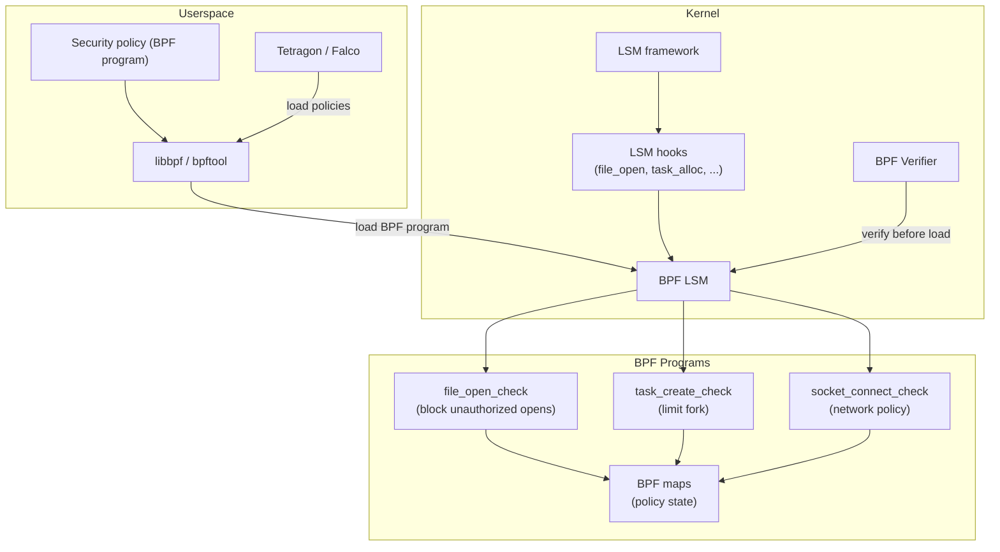
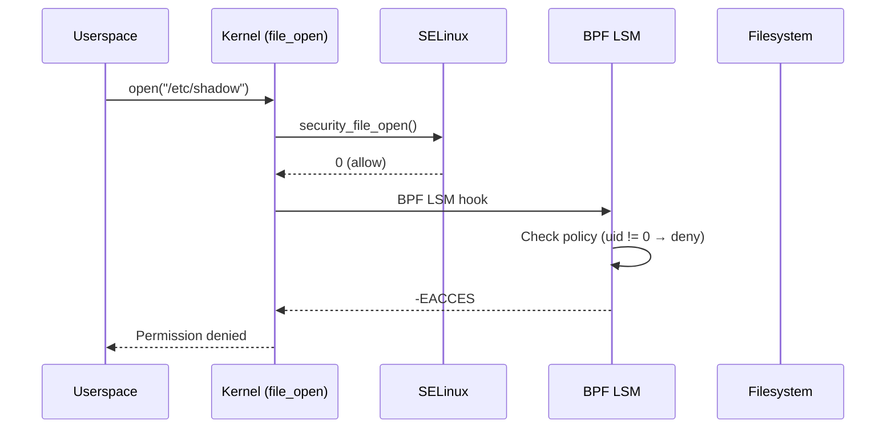
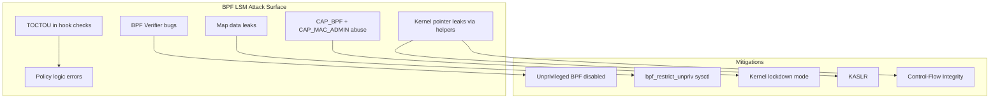
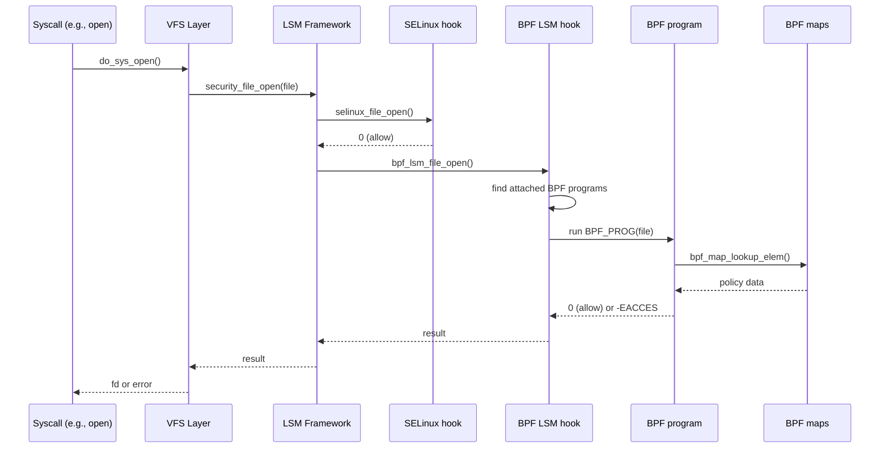

# BPF LSM

## Overview

BPF LSM (Linux Security Module) allows attaching eBPF programs to LSM hooks, enabling dynamic, programmable security policies without writing kernel modules. Merged in Linux 5.7 (commit `fc61143`), BPF LSM lets you implement security checks (file access, task creation, network operations) as BPF programs that run at LSM hook points.

BPF LSM complements SELinux and AppArmor by allowing custom, per-pod or per-container security policies that can be deployed and updated without rebooting.

> **Introduced:** Linux 5.7 (commit `fc61143`)
> **Source:** `security/bpf/`
> **Kconfig:** `CONFIG_BPF_LSM=y`

---

## Architecture



---

## LSM Hooks

BPF LSM programs attach to existing LSM hooks:

| Hook | Called When | Use Case |
|------|------------|----------|
| `file_open` | File opened | Access control |
| `file_permission` | Permission check | Read/write control |
| `task_alloc` | Process created | Fork limiting |
| `task_kill` | Signal sent | Signal filtering |
| `socket_connect` | TCP/UDP connect | Network policy |
| `socket_bind` | Socket bind | Port restriction |
| `bprm_check_security` | Exec | Exec policy |
| `inode_create` | File created | Creation policy |
| `inode_unlink` | File deleted | Deletion policy |
| `capable` | Capability check | Capability restriction |
| `ptrace_access_check` | ptrace attach | Anti-debugging |
| `bpf` | BPF syscall | BPF self-protection |
| `cred_prepare` | Credential copy | Credential policy |

### BPF LSM Program Structure

```c
// SPDX-License-Identifier: GPL-2.0
#include <linux/bpf.h>
#include <bpf/bpf_helpers.h>
#include <bpf/bpf_tracing.h>

SEC("lsm/file_open")
int BPF_PROG(restrict_open, struct file *file)
{
    /* Get current task's cgroup */
    u64 cgroup_id = bpf_get_current_cgroup_id();

    /* Check if file path matches blocked pattern */
    char path[256];
    bpf_d_path(&file->f_path, path, sizeof(path));

    /* Block access to /etc/shadow for non-root */
    if (bpf_strncmp(path, 11, "/etc/shadow") == 0) {
        u32 uid = bpf_get_current_uid_gid();
        if (uid != 0)
            return -EACCES;  /* Deny access */
    }

    return 0;  /* Allow */
}

char LICENSE[] SEC("license") = "GPL";
```

### LSM Hook Execution Order

The LSM framework calls hooks in registration order. When multiple LSMs are active (e.g., SELinux + BPF LSM), each gets a chance to deny:



The `ret` parameter in BPF LSM programs carries the return value from previous LSMs. If a prior LSM already denied, the BPF program should propagate that denial:

```c
SEC("lsm/file_open")
int BPF_PROG(extra_check, struct file *file, int ret)
{
    if (ret != 0)
        return ret;  /* Already denied by prior LSM */
    /* Additional check */
    return 0;
}
```

---

## BPF LSM Helpers

```c
/* Task information */
u64 bpf_get_current_pid_tgid(void);    /* PID + TID */
u64 bpf_get_current_uid_gid(void);     /* UID + GID */
int bpf_get_current_comm(void *buf, u32 size); /* Process name */

/* Cgroup */
u64 bpf_get_current_cgroup_id(void);   /* Cgroup ID */

/* Path operations */
int bpf_d_path(struct path *path, char *buf, u32 sz); /* Path to string */

/* String operations */
int bpf_strncmp(const char *s1, u32 s1_size, const char *s2); /* Compare */

/* Override return value */
int bpf_override_return(void *regs, unsigned long rc); /* Override */

/* Time */
u64 bpf_ktime_get_ns(void);           /* Monotonic timestamp */

/* BPF map operations */
void *bpf_map_lookup_elem(struct bpf_map *map, const void *key);
int bpf_map_update_elem(struct bpf_map *map, const void *key,
                        const void *value, u64 flags);
int bpf_map_delete_elem(struct bpf_map *map, const void *key);

/* Task credentials */
struct cred *bpf_get_task_cred(struct task_struct *task);

/* CO-RE (Compile Once, Run Everywhere) */
void *bpf_core_read(void *dst, int size, const void *src);
```

---

## Loading BPF LSM Programs

### Using libbpf

```c
#include <bpf/libbpf.h>
#include <bpf/bpf.h>

int main(void)
{
    struct bpf_object *obj;
    struct bpf_link *link;

    /* Open and load BPF object */
    obj = bpf_object__open_file("restrict_open.bpf.o", NULL);
    bpf_object__load(obj);

    /* Attach to LSM hook */
    struct bpf_program *prog = bpf_object__find_program_by_name(obj, "restrict_open");
    link = bpf_program__attach_lsm(prog);

    /* Program is now active */
    pause();
    bpf_link__destroy(link);
    return 0;
}
```

### Using Skeleton (Recommended)

```c
#include "restrict_open.skel.h"

int main(void)
{
    struct restrict_open *skel;
    int err;

    skel = restrict_open__open_and_load();
    if (!skel) {
        fprintf(stderr, "Failed to open/load\n");
        return 1;
    }

    err = restrict_open__attach(skel);
    if (err) {
        fprintf(stderr, "Failed to attach\n");
        restrict_open__destroy(skel);
        return 1;
    }

    printf("BPF LSM active. Ctrl+C to exit.\n");
    while (1) sleep(1);

    restrict_open__destroy(skel);
    return 0;
}
```

### Using bpftool

```bash
# Load BPF LSM program
bpftool prog load restrict_open.bpf.o /sys/fs/bpf/restrict_open type lsm

# Attach to LSM hook
bpftool link create /sys/fs/bpf/restrict_open_link \
    prog /sys/fs/bpf/restrict_open \
    target lsm/file_open

# List loaded BPF LSM programs
bpftool prog list type lsm

# Show attached links
bpftool link list

# Detach
bpftool link detach id <link_id>
bpftool prog detach id <prog_id> type lsm
```

---

## Use Cases

### Container Security Policy

```c
SEC("lsm/socket_connect")
int BPF_PROG(container_network_policy, struct socket *sock,
             struct sockaddr *address, int addrlen)
{
    u64 cgroup_id = bpf_get_current_cgroup_id();

    /* Block containers from connecting to metadata service */
    if (address->sa_family == AF_INET) {
        struct sockaddr_in *addr = (struct sockaddr_in *)address;
        if (addr->sin_addr.s_addr == htonl(0xC0A80001)) /* 192.168.0.1 */
            return -ECONNREFUSED;
    }

    return 0;
}
```

### Exec Restriction

```c
SEC("lsm/bprm_check_security")
int BPF_PROG(restrict_exec, struct linux_binprm *bprm)
{
    char filename[256];
    bpf_probe_read_str(filename, sizeof(filename), bprm->filename);

    /* Block execution of specific binaries */
    if (bpf_strncmp(filename, 15, "/usr/bin/sudo") == 0)
        return -EPERM;

    return 0;
}
```

### Rate-Limiting Syscalls

```c
struct {
    __uint(type, BPF_MAP_TYPE_HASH);
    __uint(max_entries, 1024);
    __type(key, u32);    /* PID */
    __type(value, u64);  /* Last kill timestamp */
} kill_rate SEC(".maps");

SEC("lsm/task_kill")
int BPF_PROG(rate_limit_kill, struct task_struct *p,
             struct kernel_siginfo *info, int sig, int ret)
{
    if (ret != 0) return ret;

    u32 pid = bpf_get_current_pid_tgid() >> 32;
    u64 now = bpf_ktime_get_ns();
    u64 *last = bpf_map_lookup_elem(&kill_rate, &pid);

    if (last) {
        if (now - *last < 100000000ULL)  /* 100ms */
            return -EPERM;
    }

    bpf_map_update_elem(&kill_rate, &pid, &now, BPF_ANY);
    return 0;
}
```

### Capability-Based Restrictions

```c
SEC("lsm/capable")
int BPF_PROG(restrict_cap, const struct cred *cred,
             struct user_namespace *targ_ns,
             int cap, int audit, int ret)
{
    if (ret != 0) return ret;

    /* Deny CAP_SYS_ADMIN for specific processes */
    if (cap == CAP_SYS_ADMIN) {
        char comm[16];
        bpf_get_current_comm(comm, sizeof(comm));
        char target[] = "untrusted_app";
        if (bpf_strncmp(comm, sizeof(target), target) == 0)
            return -EPERM;
    }

    return 0;
}
```

---

## Threat Model

### What BPF LSM Protects Against

| Threat | Mitigation |
|--------|------------|
| Unauthorized file access | Path-based allow/deny lists |
| Container escape | Cgroup-scoped policies on `task_alloc`, `bprm_check_security` |
| Privilege escalation | Capability restrictions via `capable` hook |
| Network exfiltration | `socket_connect` filtering by destination |
| Malicious binary execution | Exec allowlists via `bprm_check_security` |
| Signal abuse | Rate-limiting via `task_kill` |

### What BPF LSM Does NOT Protect Against

| Limitation | Explanation |
|------------|-------------|
| Kernel exploits | BPF LSM runs inside the kernel; a kernel bug can bypass it |
| BPF verifier bypass | If the BPF verifier has bugs, malicious programs can be loaded |
| Denial of service | A buggy BPF LSM program can block legitimate operations |
| Hardware attacks | No protection against cold-boot, DMA, or physical access |
| Policy bypass via `CAP_BPF` | Users with `CAP_BPF` + `CAP_MAC_ADMIN` can load/replace policies |

### Attack Surface of BPF LSM Itself



**Key mitigations in the kernel:**
- **BPF verifier** (`kernel/bpf/verifier.c`): Ensures programs terminate, don't access arbitrary memory, and don't leak pointers.
- **Unprivileged BPF restriction**: `kernel.unprivileged_bpf_disabled=1` prevents unprivileged BPF usage.
- **Kernel lockdown mode**: Prevents BPF programs from accessing kernel memory even with `CAP_BPF`.
- **KASLR**: Makes kernel address guessing harder for BPF-based exploits.

---

## Kernel Internals

### BPF LSM Hook Registration

When `CONFIG_BPF_LSM=y`, the kernel registers BPF as an LSM during boot:

```c
/* security/bpf/hooks.c */
static struct security_hook_list bpf_lsm_hooks[] __lsm_ro_after_init = {
    LSM_HOOK_INIT(file_open, bpf_lsm_file_open),
    LSM_HOOK_INIT(file_permission, bpf_lsm_file_permission),
    LSM_HOOK_INIT(task_alloc, bpf_lsm_task_alloc),
    LSM_HOOK_INIT(task_kill, bpf_lsm_task_kill),
    LSM_HOOK_INIT(socket_connect, bpf_lsm_socket_connect),
    /* ... many more hooks ... */
};

static int __init bpf_lsm_init(void)
{
    security_add_hooks(bpf_lsm_hooks, ARRAY_SIZE(bpf_lsm_hooks), "bpf");
    pr_info("LSM: BPF LSM initialized\n");
    return 0;
}
```

### BPF Program Invocation Path



### BPF LSM Internal Structures

```c
/* kernel/bpf/bpf_lsm.c */
struct bpf_lsm_link {
    struct bpf_link link;        /* Base BPF link */
    struct bpf_prog *prog;      /* Attached BPF program */
    struct hlist_node tramp_link;/* Trampoline linkage */
};

/* Programs are attached via BPF trampoline */
/* kernel/bpf/trampoline.c */
struct bpf_trampoline {
    struct hlist_node hlist;
    struct btf_func_model model;
    void *func;
    struct bpf_prog *progs[BPF_TRAMP_MAX];
    /* ... */
};
```

### BPF Verifier Checks for LSM Programs

The BPF verifier performs additional checks for `BPF_PROG_TYPE_LSM`:

```c
/* kernel/bpf/verifier.c */
static int check_lsm_prog(struct bpf_verifier_env *env,
                          struct bpf_prog *prog)
{
    /* LSM programs must return int */
    if (prog->type == BPF_PROG_TYPE_LSM) {
        /* Verify return type is int */
        /* Verify first argument matches hook signature */
        /* Verify BTF IDs are valid for attachment */
        /* Ensure program doesn't modify hook arguments */
    }
    return 0;
}
```

---

## Production Use: Tetragon and Falco

### Tetragon (Cilium)

Tetragon uses BPF LSM for real-time enforcement in Kubernetes:

```yaml
# Tetragon TracingPolicy for file access enforcement
apiVersion: cilium.io/v1alpha1
kind: TracingPolicy
metadata:
  name: restrict-sensitive-files
spec:
  kprobes:
  - call: "fd_install"
    syscall: false
    args:
    - index: 0
      type: int
    - index: 1
      type: "file"
  lsmhooks:
  - hook: "file_open"
    args:
    - index: 0
      type: "file"
    selectors:
    - matchBinaries:
      - operator: NotIn
        values:
        - "/usr/bin/kubectl"
        - "/usr/bin/systemctl"
      matchActions:
      - action: Sigkill
```

### Falco with BPF LSM

Falco can use BPF LSM for syscall interception:

```yaml
# Falco rule using BPF LSM
- rule: Detect Shell in Container
  desc: Detect shell spawning in container
  condition: >
    spawned_process and container and
    proc.name in (bash, sh, zsh)
  output: >
    Shell spawned in container
    (user=%user.name container=%container.name
     shell=%proc.name parent=%proc.pname)
  priority: WARNING
  tags: [container, shell]
```

---

## Security Considerations

```bash
# BPF LSM requires CAP_BPF + CAP_LSM
# Or privileged container

# Check if BPF LSM is available
cat /sys/kernel/security/lsm
# lockdown,capability,landlock,bpf

# BPF LSM ordering (last checked first)
# Programs run in reverse attach order
```

### Hardening BPF LSM Deployments

```bash
# 1. Disable unprivileged BPF
sysctl -w kernel.unprivileged_bpf_disabled=1

# 2. Enable kernel lockdown
echo integrity > /sys/kernel/security/lockdown

# 3. Pin BPF programs to prevent removal
bpftool prog load policy.bpf.o /sys/fs/bpf/policy type lsm

# 4. Use BPF token for delegated loading (Linux 6.9+)
# Mount bpffs with delegation
mount -t bpf bpffs /sys/fs/bpf -o delegate_cmds=PROG_LOAD

# 5. Audit BPF program loads
# Enable audit for BPF syscalls
auditctl -a always,exit -F arch=b64 -S bpf -k bpf_load
```

### Common Pitfalls

| Pitfall | Description | Solution |
|---------|-------------|----------|
| Missing LSM entry | BPF LSM not in `/sys/kernel/security/lsm` | Add `bpf` to `lsm=` boot parameter |
| No BTF | Kernel lacks BTF data | Enable `CONFIG_DEBUG_INFO_BTF=y` |
| Program detached | Process exit removes programs | Pin to bpffs |
| Verifier rejection | Program too complex | Simplify logic, use tail calls |
| TOCTOU races | Path changes between check and use | Use inode-based checks instead of path-based |

---

## Configuration Examples

### Boot Parameter Setup

```bash
# Enable BPF LSM via kernel command line
# Edit /etc/default/grub or bootloader config
GRUB_CMDLINE_LINUX="lsm=lockdown,capability,yama,apparmor,bpf"

# Update bootloader
update-grub

# Verify after reboot
cat /sys/kernel/security/lsm
# lockdown,capability,yama,apparmor,bpf
```

### Kconfig Requirements

```
# Required kernel config
CONFIG_BPF_LSM=y              # BPF LSM support
CONFIG_BPF_SYSCALL=y          # BPF syscall
CONFIG_DEBUG_INFO_BTF=y       # BTF for CO-RE
CONFIG_BPF_JIT=y              # BPF JIT compiler
CONFIG_CGROUP_BPF=y           # BPF cgroup support
CONFIG_NET=y                  # For network hooks
CONFIG_BPF_EVENTS=y           # For tracing integration
```

### Delegated BPF Loading (Linux 6.9+)

```bash
# Create delegated BPF filesystem
mkdir -p /sys/fs/bpf/delegated

# Mount with delegation
mount -t bpf bpffs /sys/fs/bpf/delegated \
    -o delegate_cmds=PROG_LOAD,MAP_CREATE

# Non-root users with CAP_BPF can now load programs
# to /sys/fs/bpf/delegated/
```

### Integration with systemd

```ini
# /etc/systemd/system/bpf-policy.service
[Unit]
Description=Load BPF LSM security policy
After=network.target

[Service]
Type=oneshot
ExecStart=/usr/local/bin/bpf-lsm-loader /etc/bpf-lsm/policy.bpf.o
RemainAfterExit=yes

[Install]
WantedBy=multi-user.target
```

---

## BPF Maps for Policy State

BPF maps provide persistent state for BPF LSM programs:

### Map Types Used in BPF LSM

| Map Type | Use Case | Example |
|----------|----------|----------|
| `BPF_MAP_TYPE_HASH` | Allow/deny lists | Blocked inodes, UIDs |
| `BPF_MAP_TYPE_RINGBUF` | Event logging | Audit trail of denials |
| `BPF_MAP_TYPE_ARRAY` | Counters | Denial counts per UID |
| `BPF_MAP_TYPE_LRU_HASH` | Bounded state | Rate-limiting timestamps |
| `BPF_MAP_TYPE_PERCPU_ARRAY` | Per-CPU counters | Lock-free statistics |

### Example: Policy Map with Userspace Update

```c
/* BPF side */
struct {
    __uint(type, BPF_MAP_TYPE_HASH);
    __uint(max_entries, 1024);
    __type(key, u32);      /* UID */
    __type(value, u64);    /* Bitmask of allowed operations */
} policy_map SEC(".maps");

SEC("lsm/file_open")
int BPF_PROG(check_open, struct file *file, int ret)
{
    if (ret != 0) return ret;

    u32 uid = bpf_get_current_uid_gid() & 0xFFFFFFFF;
    u64 *policy = bpf_map_lookup_elem(&policy_map, &uid);
    if (!policy)
        return -EACCES;  /* Default deny */

    if (!(*policy & ALLOW_FILE_OPEN))
        return -EACCES;

    return 0;
}
```

```bash
# Userspace: update policy via bpftool
bpftool map update pinned /sys/fs/bpf/policy_map \
    key 1000 0 0 0 \
    value 0x07 0 0 0 0 0 0 0
```

---

## Source Files

| File | Contents |
|------|----------|
| `security/bpf/hooks.c` | BPF LSM hook registration |
| `security/bpf/lsm.c` | BPF LSM core |
| `kernel/bpf/bpf_lsm.c` | BPF LSM program type |
| `kernel/bpf/trampoline.c` | BPF trampoline for hook attachment |
| `kernel/bpf/verifier.c` | BPF verifier (includes LSM checks) |
| `include/linux/bpf_lsm.h` | BPF LSM header |
| `include/linux/lsm_hooks.h` | LSM hook definitions |

---

## Further Reading

- **Kernel documentation**: `Documentation/bpf/prog_lsm.rst`
- **LWN**: ["BPF and security modules"](https://lwn.net/Articles/808048/)
- **libbpf**: [BPF LSM examples](https://github.com/libbpf/libbpf-bootstrap)
- **Tetragon**: [Cilium Tetragon](https://tetragon.io/)
- **Academic**: ["Detection and Mitigation of eBPF Security Risks"](https://webthesis.biblio.polito.it/37924/1/tesi.pdf)
- **USENIX**: ["TPM-Fail: TPM meets Timing and Lattice Attacks"](https://www.usenix.org/system/files/sec20-moghimi-tpm.pdf)

---

## See Also

- [eBPF](./ebpf.md) — BPF subsystem overview
- [LSM](./lsm.md) — LSM framework
- [SELinux](./selinux.md) — SELinux LSM
- [Landlock](./landlock.md) — Landlock LSM
- [seccomp](./seccomp.md) — seccomp-bpf
- [dm-verity](../drivers/dm-verity.md) — verified boot
