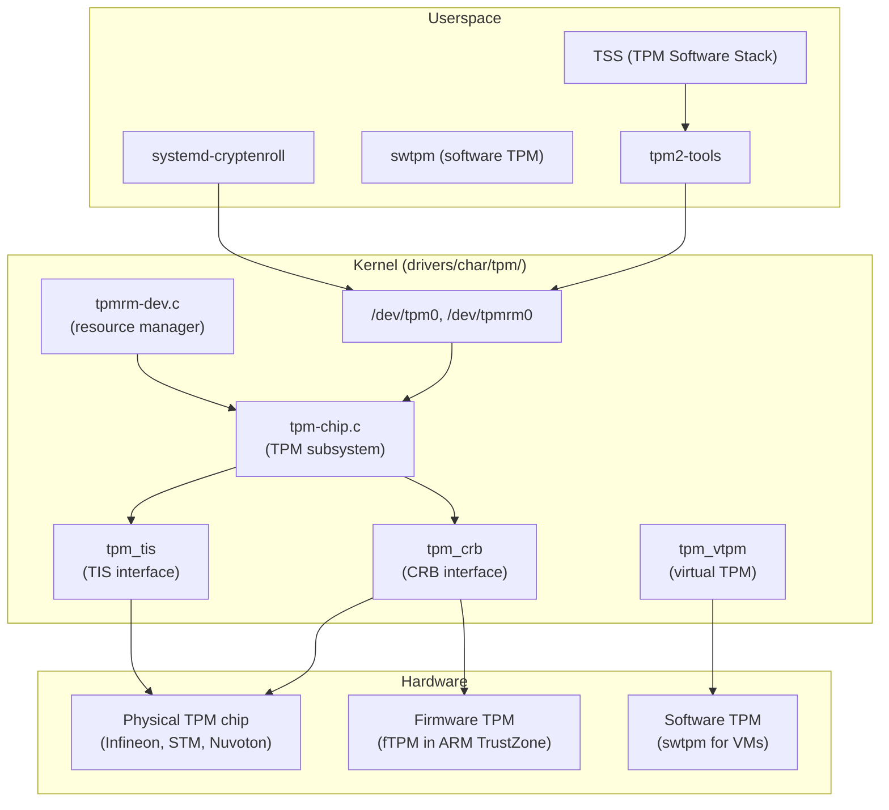
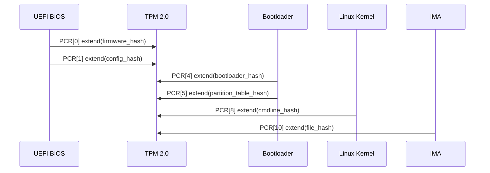
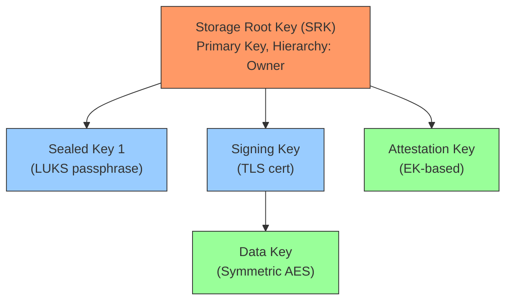
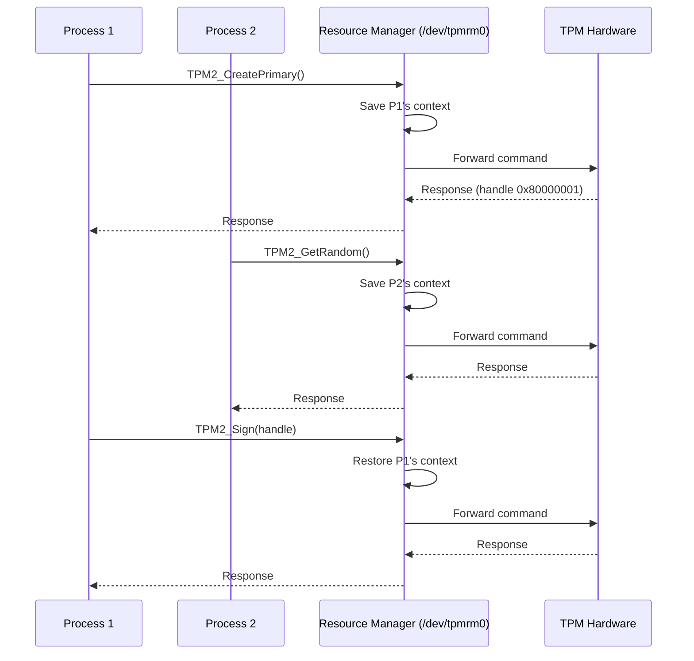
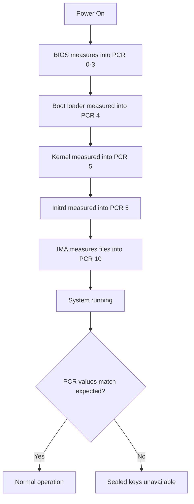
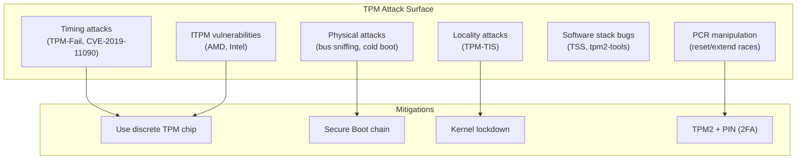
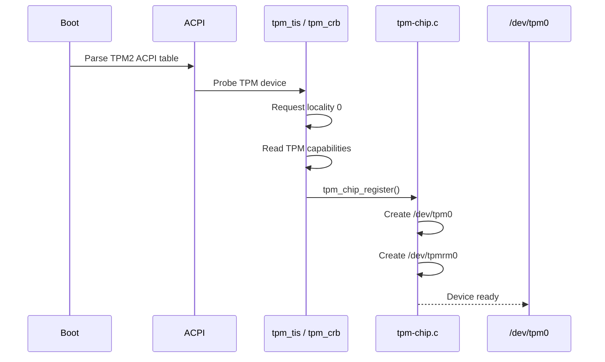

# TPM (Trusted Platform Module)

## Overview

A TPM (Trusted Platform Module) is a hardware security chip (or firmware implementation) that provides cryptographic functions: secure key generation, random number generation, PCR (Platform Configuration Register) measurements, and sealed storage. The Linux kernel TPM subsystem (`tpm.ko`, `tpm_crb`, `tpm_tis`) provides userspace access to TPM devices via `/dev/tpm0` and `/dev/tpmrm0`.

TPM is foundational for **Secure Boot**, **Measured Boot**, **dm-verity**, **IMA (Integrity Measurement Architecture)**, and **disk encryption key sealing** (LUKS + TPM2).

> **Source:** `drivers/char/tpm/`
> **Interfaces:** `/dev/tpm0` (legacy), `/dev/tpmrm0` (resource manager)
> **Subsystem:** `drivers/char/tpm/tpm-chip.c`

---

## TPM Versions

| Feature | TPM 1.2 | TPM 2.0 |
|---------|---------|---------|
| Algorithms | SHA-1, RSA | SHA-256/384/512, RSA, ECC |
| Slots | 24 PCR banks | Unlimited PCR banks |
| Hierarchy | Owner, SRK | Platform, Owner, Endorsement, Null |
| Commands | ~100 | ~80 (new API) |
| Authorization | HMAC sessions | Policy sessions |
| Kernel support | Legacy | Recommended (Linux 4.0+) |
| PCR banks | Single (SHA-1) | Multiple (SHA-256, SHA-384, etc.) |

---

## Architecture



---

## Key Data Structures

### struct tpm_chip

```c
/* include/linux/tpm.h */
struct tpm_chip {
    struct device dev;                /* Device model */
    struct cdev cdev;                 /* Character device */
    struct cdev cdev_rm;              /* Resource manager cdev */
    struct rw_semaphore ops_sem;      /* Operations semaphore */
    const struct tpm_class_ops *ops;  /* Driver operations */
    struct tpm_chip *chip;            /* Parent chip (for RM) */
    int dev_num;                      /* /dev/tpm<dev_num> */
    unsigned long flags;              /* TPM_CHIP_FLAG_* */
    int locality;                     /* Current locality */
    struct tpm_buf buf;               /* Command buffer */
    struct mutex buf_lock;            /* Buffer lock */
    struct tpm_space *work_space;     /* TPM space (for sessions) */
    /* ... */
};
```

### struct tpm_class_ops

```c
/* include/linux/tpm.h */
struct tpm_class_ops {
    unsigned int flags;
    int (*recv)(struct tpm_chip *chip, u8 *buf, size_t len);
    int (*send)(struct tpm_chip *chip, u8 *buf, size_t len);
    void (*cancel)(struct tpm_chip *chip);
    u8 (*status)(struct tpm_chip *chip);
    bool (*update_timeouts)(struct tpm_chip *chip, unsigned long *timeout_cap);
    int (*request_locality)(struct tpm_chip *chip, int locality);
    void (*relinquish_locality)(struct tpm_chip *chip, int locality);
    int (*req_canceled)(struct tpm_chip *chip, u8 status);
    /* ... */
};
```

---

## PCR (Platform Configuration Registers)

PCRs store measurements of boot components. Each PCR value is extended (not overwritten) — the new value is `SHA256(old_value || new_measurement)`.

| PCR | Content | Used By |
|-----|---------|---------|
| 0 | BIOS/UEFI firmware | Measured Boot |
| 1 | BIOS/UEFI configuration | Measured Boot |
| 2 | Option ROMs | Measured Boot |
| 3 | Option ROM data | Measured Boot |
| 4 | Boot loader (MBR/GPT) | Secure Boot |
| 5 | GPT partition table | Secure Boot |
| 6 | Resume from hibernate | Power management |
| 7 | Secure Boot state | Secure Boot |
| 8 | Boot loader (kernel cmdline) | Linux IMA |
| 10 | IMA runtime measurements | Linux IMA |
| 14 | Kernel command line (some distros) | Boot integrity |

### PCR Extension Mechanism



```bash
# Read PCR values (TPM 2.0)
tpm2_pcrread sha256

# Extend a PCR
tpm2_pcrextend 10 sha256=$(echo -n "measurement" | sha256sum | cut -d' ' -f1)

# Verify PCR values (remote attestation)
tpm2_quote -c 0x81010001 -l sha256:0,2,4,7 -q nonce

# Read specific PCR bank
tpm2_pcrread sha256:0,2,4,7,10
```

---

## TPM Operations

### Key Management

```bash
# Create a primary key (TPM 2.0)
tpm2_createprimary -C o -g sha256 -G rsa -c primary.ctx

# Create a child key
tpm2_create -C primary.ctx -g sha256 -G rsa -u key.pub -r key.priv

# Load key into TPM
tpm2_load -C primary.ctx -u key.pub -r key.priv -c key.ctx

# Use key for signing
tpm2_sign -c key.ctx -g sha256 -o sig.rss message.dat

# Evict persistent key
tpm2_evictcontrol -C o -c 0x81010001

# Create RSA key with specific attributes
tpm2_create -C primary.ctx -g sha256 -G rsa2048:rsassa \
    -u key.pub -r key.priv -p keypass
```

### Key Hierarchy



### Sealed Storage (Key Sealing)

```bash
# Seal data to specific PCR values
tpm2_createprimary -C o -c primary.ctx
tpm2_create -C primary.ctx -i secret.dat -u sealed.pub -r sealed.priv \
    -L pcr.policy

# Unseal (only succeeds if PCR values match)
tpm2_load -C primary.ctx -u sealed.pub -r sealed.priv -c sealed.ctx
tpm2_unseal -c sealed.ctx -p pcr:sha256:0,2,4,7
```

### Random Number Generation

```bash
# Generate random bytes
tpm2_getrandom 32 -o random.bin

# Use TPM RNG for system entropy
# Kernel automatically mixes TPM RNG into /dev/random
```

---

## Userspace Interfaces

### /dev/tpm0 vs /dev/tpmrm0

| Device | Description | Use Case |
|--------|-------------|----------|
| `/dev/tpm0` | Direct TPM access | Single-user, legacy |
| `/dev/tpmrm0` | Resource Manager | Multi-process, recommended |

The resource manager (`/dev/tpmrm0`) handles TPM context switching between processes, allowing concurrent access. It manages session slots and handle namespaces.



### Kernel Interfaces

```bash
# Check TPM device
ls /dev/tpm*
ls /sys/class/tpm/

# TPM device info
cat /sys/class/tpm/tpm0/device/description
cat /sys/class/tpm/tpm0/device/pcrs

# TPM version
cat /sys/class/tpm/tpm0/tpm_version_major

# TPM enabled state
cat /sys/class/tpm/tpm0/enabled

# TPM active PCR banks
cat /sys/class/tpm/tpm0/pcr-sha256
```

---

## TPM in Linux Security

### Secure Boot + Measured Boot



### IMA + TPM

IMA (Integrity Measurement Architecture) uses TPM to store file hashes:

```bash
# Check IMA measurements
cat /sys/kernel/security/ima/ascii_runtime_measurements

# IMA policy
cat /sys/kernel/security/ima/policy
# measure func=BPRM_CHECK
# measure func=FILE_MMAP mask=MAY_EXEC

# IMA appraisal (enforce integrity)
# appraise func=BPRM_CHECK appraise_type=imasig
```

### LUKS + TPM

Seal disk encryption key to TPM:

```bash
# Seal LUKS key to TPM
systemd-cryptenroll /dev/sda1 --tpm2-device=auto

# Unlock at boot (automatic, no passphrase)
# initrd uses TPM to unseal key

# Bind to specific PCR values
systemd-cryptenroll /dev/sda1 --tpm2-device=auto \
    --tpm2-pcrs=0+2+4+7

# With PIN (two-factor)
systemd-cryptenroll /dev/sda1 --tpm2-device=auto \
    --tpm2-with-pin=yes
```

---

## Threat Model

### What TPM Protects Against

| Threat | Mitigation |
|--------|------------|
| Boot chain tampering | PCR measurements detect modified firmware/bootloader |
| Disk key extraction | Keys sealed in TPM hardware, not extractable |
| Unauthorized key usage | Policy-bound keys require specific PCR state |
| Weak entropy | Hardware RNG provides true random numbers |
| Remote attestation | Quote operation proves system state |

### Attack Surface



### Known Vulnerabilities

| CVE | Year | Impact | Affected |
|-----|------|--------|----------|
| CVE-2019-11090 | 2019 | RSA key extraction via timing | Intel fTPM |
| CVE-2019-11091 | 2019 | Timing side-channel | Intel fTPM |
| CVE-2023-1017 | 2023 | Out-of-bounds read in TPM 2.0 | Reference TPM 2.0 spec |
| CVE-2023-1018 | 2023 | Out-of-bounds write in TPM 2.0 | Reference TPM 2.0 spec |

**TPM-Fail** (2019): Researchers demonstrated timing side-channel attacks against Intel fTPM and STMicroelectronics discrete TPM, extracting ECDSA signing keys. Mitigation: use constant-time operations, update firmware.

---

## Kernel Internals

### TPM Driver Initialization



### TPM-TIS (TPM Interface Specification)

TIS is the legacy hardware interface for discrete TPMs:

```c
/* drivers/char/tpm/tpm-tis-core.c */
struct tpm_tis_data {
    int irq;
    unsigned int locality;
    u16 manufacturer_id;
    int region_size;
    /* ... */
};

/* Locality access */
static int tpm_tis_request_locality(struct tpm_chip *chip, int l)
{
    /* Write ACCESS_REQUEST to locality register */
    /* Wait for ACCESS_ACTIVE bit */
    /* TPM-TIS supports localities 0-4 */
}
```

### TPM-CRB (Command Response Buffer)

CRB is the modern hardware interface, required for TPM 2.0:

```c
/* drivers/char/tpm/tpm-crb.c */
struct crb_priv {
    struct tpm_tis_data priv;
    u8 __iomem *cmd;
    u8 __iomem *rsp;
    u32 cmd_size;
    u32 smc_func_id;
    /* ... */
};

/* CRB uses memory-mapped registers */
/* cmd buffer: write TPM command */
/* rsp buffer: read TPM response */
/* No locality model (simpler than TIS) */
```

### Resource Manager Internals

```c
/* drivers/char/tpm/tpmrm-dev.c */
static ssize_t tpmrm_write(struct file *file, const char __user *buf,
                           size_t size, loff_t *off)
{
    struct tpm_chip *chip = file->private_data;
    struct tpm_space *space = &chip->work_space;

    /* Map virtual handles to physical handles */
    /* Swap context before sending to TPM */
    tpm2_flush_context_cmd(chip, space->context_tbl[i], 0);
    /* ... */
}
```

### Kernel TPM API

```c
/* include/linux/tpm.h */
int tpm_pcr_extend(struct tpm_chip *chip, u32 pcr_idx,
                   const u8 *hash);          /* Extend PCR */
int tpm_pcr_read(struct tpm_chip *chip, u32 pcr_idx,
                 u8 *res_buf);               /* Read PCR */
int tpm_get_random(struct tpm_chip *chip, u8 *out,
                   size_t max);               /* Get random */
int tpm_seal_trusted(struct tpm_chip *chip,
                     struct trusted_key_payload *payload,
                     struct trusted_key_options *options);
int tpm_unseal_trusted(struct tpm_chip *chip,
                       struct trusted_key_payload *payload,
                       struct trusted_key_options *options);
```

---

## Firmware TPM (fTPM)

fTPM implementations run in a trusted execution environment (TEE) rather than a discrete chip:

| Implementation | Platform | TEE | Notes |
|----------------|----------|-----|-------|
| Intel PTT | Intel CPUs (Haswell+) | Intel ME | Firmware-based, no discrete chip |
| AMD fTPM | AMD CPUs (Zen+) | AMD PSP/ASP | Vulnerable to timing attacks (CVE-2019-*) |
| ARM TrustZone fTPM | ARM SoCs | OP-TEE | Microsoft reference implementation |
| Google Titan | Pixel devices | Titan M | Custom hardware security chip |

### fTPM vs Discrete TPM

| Aspect | fTPM | Discrete TPM |
|--------|------|-------------|
| Cost | Free (in CPU) | $1-5 chip |
| Performance | Faster (on-die) | Slower (SPI/LPC bus) |
| Physical attack resistance | Lower (shared silicon) | Higher (dedicated chip) |
| Firmware updates | Via CPU microcode | Via TPM firmware |
| Side-channel resistance | Lower (timing) | Higher (constant-time) |
| FIPS certification | Rare | Common |

---

## TPM 2.0 Policy Sessions

TPM 2.0 uses policy sessions for complex authorization:

```bash
# Create a policy session requiring specific PCR values
tpm2_startauthsession -S session.ctx
tpm2_policypcr -S session.ctx -l sha256:0,2,4,7 -L pcr.policy
tpm2_policyauthvalue -S session.ctx
tpm2_flushcontext session.ctx

# Use policy to unseal
tpm2_startauthsession --policy-session -S session.ctx
tpm2_policypcr -S session.ctx -l sha256:0,2,4,7
tpm2_policyauthvalue -S session.ctx
tpm2_unseal -c sealed.ctx -p session:session.ctx
tpm2_flushcontext session.ctx
```

### Policy Types

| Policy | Command | Use Case |
|--------|---------|----------|
| PCR-based | `tpm2_policypcr` | Bind to boot state |
| Password | `tpm2_policyauthvalue` | Require passphrase |
| Counter | `tpm2_policycountersigned` | Anti-rollback |
| Locality | `tpm2_policylocality` | Restrict to specific locality |
| NV-based | `tpm2_policyor` | NV index conditions |
| Signed | `tpm2_policyauthorize` | Delegate authorization |

---

## Virtual TPM for VMs

```bash
# Create software TPM for QEMU/KVM
swtpm socket --tpmstate dir=/tmp/tpm \
    --ctrl type=unixio,path=/tmp/tpm.sock \
    --tpm2 --log level=20

# QEMU with vTPM
qemu-system-x86_64 \
    -chardev socket,id=chrtpm,path=/tmp/tpm.sock \
    -tpmdev emulator,id=tpm0,chardev=chrtpm \
    -device tpm-tis,tpmdev=tpm0 \
    -drive file=vm.qcow2,format=qcow2

# Verify inside VM
cat /sys/class/tpm/tpm0/tpm_version_major
# 2
```

---

## Troubleshooting

```bash
# Check if TPM is detected
dmesg | grep -i tpm

# Load TPM modules
modprobe tpm_crb  # CRB interface (modern)
modprobe tpm_tis  # TIS interface (older)

# Test TPM
tpm2_selftest

# TPM tools diagnostics
tpm2_getcap properties-fixed

# Check TPM errors
dmesg | grep -i "tpm.*error"

# Verify TPM is accessible
tpm2_getrandom 4 --hex

# Check TPM ownership
tpm2_getcap handles-persistent

# List loaded keys
tpm2_getcap handles-transient

# Measure boot chain
systemd-analyze security

# Check sealed key status
cryptsetup luksDump /dev/sda1 | grep -i tpm
```

### Performance Diagnostics

```bash
# Measure TPM command latency
time tpm2_getrandom 32 --hex

# Typical latency: 1-5ms for hardware TPM
# fTPM latency: <1ms (on-die)

# Check for TPM timeouts
dmesg | grep -i "tpm.*timeout"

# TPM command statistics (if available)
cat /sys/class/tpm/tpm0/ppi/version
```

---

## Kernel Configuration

```
# Required for TPM support
CONFIG_TCG_TPM=y               # Core TPM driver
CONFIG_TCG_TIS_CORE=y          # TIS core
CONFIG_TCG_TIS=y               # TIS interface (SPI)
CONFIG_TCG_TIS_SPI=y           # SPI-attached TPM
CONFIG_TCG_CRB=y               # CRB interface (ACPI)
CONFIG_TCG_VTPM_PROXY=y        # Virtual TPM proxy
CONFIG_TCG_TIS_ST33ZP24_SPI=y  # ST33ZP24 SPI TPM
CONFIG_TCG_XEN=y               # Xen vTPM
CONFIG_TCG_ATMEL=y             # Atmel TPM
CONFIG_TCG_INFINEON=y          # Infineon TPM
CONFIG_TCG_NUVOTON=y           # Nuvoton TPM
CONFIG_TCG_IBMVTPM=y           # IBM vTPM (Power)

# For trusted keys
CONFIG_TRUSTED_KEYS=y          # Kernel trusted key type
CONFIG_ENCRYPTED_KEYS=y        # Encrypted key type
CONFIG_KEYS=y                  # Key management subsystem
CONFIG_TPM_KEY_PARSER=y        # TPM key blob parser
```

---

## Source Files

| File | Contents |
|------|----------|
| `drivers/char/tpm/tpm-chip.c` | TPM subsystem core |
| `drivers/char/tpm/tpm-crb.c` | CRB (Command Response Buffer) interface |
| `drivers/char/tpm/tpm-tis.c` | TIS (TPM Interface Specification) |
| `drivers/char/tpm/tpm-tis-core.c` | TIS core logic |
| `drivers/char/tpm/tpmrm-dev.c` | Resource manager device |
| `drivers/char/tpm/tpm2-space.c` | TPM 2.0 session/context management |
| `drivers/char/tpm/tpm_vtpm.c` | Virtual TPM driver |
| `include/linux/tpm.h` | TPM API header |
| `security/keys/trusted-keys/` | Kernel trusted key subsystem |
| `security/keys/encrypted-keys/` | Encrypted key subsystem |

---

## Further Reading

- **Kernel documentation**: `Documentation/security/tpm/`
- **tpm2-tools**: [GitHub](https://github.com/tpm2-software/tpm2-tools)
- **TCG specification**: [trustedcomputinggroup.org](https://trustedcomputinggroup.org/)
- **Arch Wiki**: [TPM](https://wiki.archlinux.org/title/TPM)
- **USENIX**: ["TPM-Fail: TPM meets Timing and Lattice Attacks"](https://www.usenix.org/system/files/sec20-moghimi-tpm.pdf)
- **LWN**: ["Subverting TPM While You Are Sleeping"](https://www.usenix.org/system/files/conference/usenixsecurity18/sec18-han.pdf)
- **TPM.dev**: [TPM 2.0 tutorials and guides](https://tpm.dev/)

---

## See Also

- [Secure Boot](./secure-boot.md) — UEFI Secure Boot
- [IMA](./ima.md) — Integrity Measurement Architecture
- [dm-verity](../drivers/dm-verity.md) — verified boot
- [dm-crypt](../drivers/dm-crypt.md) — disk encryption with TPM
- [Keyring](./keyring.md) — kernel key management
