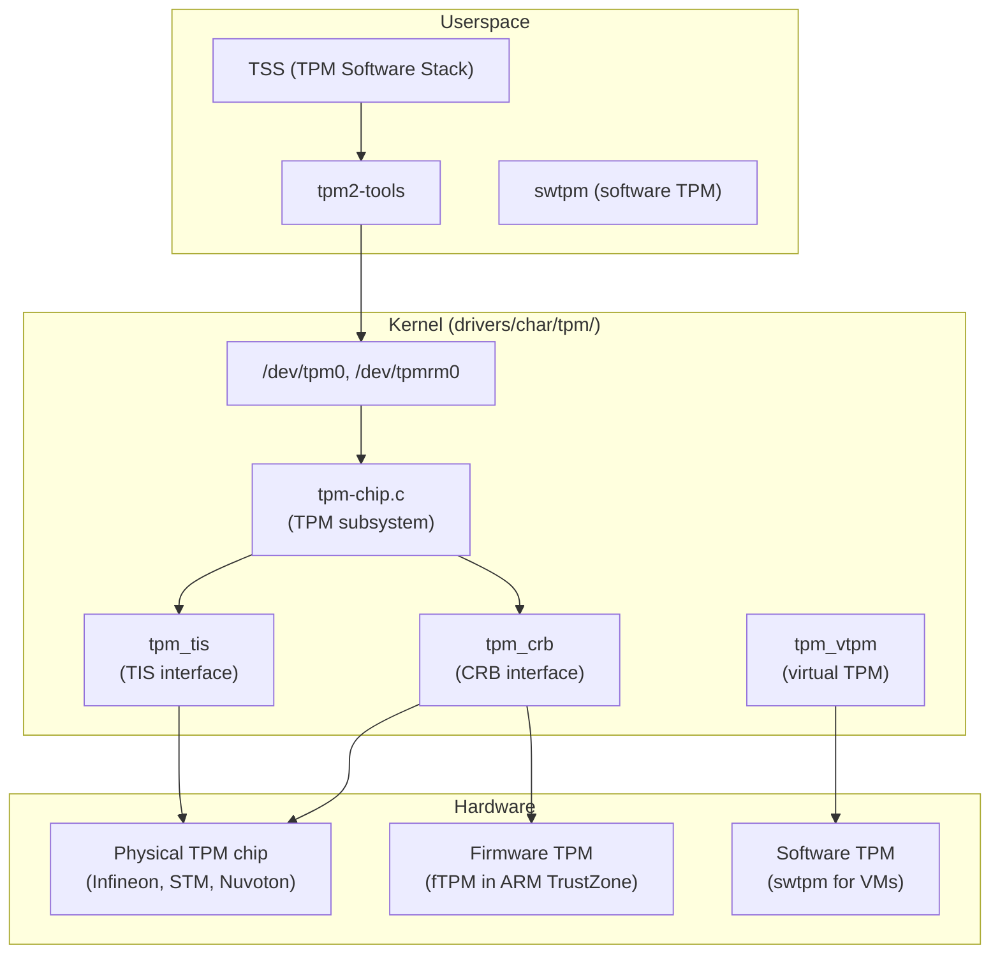
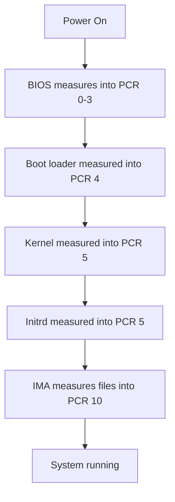

# TPM (Trusted Platform Module)

## Overview

A TPM (Trusted Platform Module) is a hardware security chip (or firmware implementation) that provides cryptographic functions: secure key generation, random number generation, PCR (Platform Configuration Register) measurements, and sealed storage. The Linux kernel TPM subsystem (`tpm.ko`, `tpm_crb`, `tpm_tis`) provides userspace access to TPM devices via `/dev/tpm0` and `/dev/tpmrm0`.

TPM is foundational for **Secure Boot**, **Measured Boot**, **dm-verity**, **IMA (Integrity Measurement Architecture)**, and **disk encryption key sealing** (LUKS + TPM2).

> **Source:** `drivers/char/tpm/`  
> **Interfaces:** `/dev/tpm0` (legacy), `/dev/tpmrm0` (resource manager)  
> **Subsystem:** `drivers/char/tpm/tpm-chip.c`

---

## TPM Versions

| Feature | TPM 1.2 | TPM 2.0 |
|---------|---------|---------|
| Algorithms | SHA-1, RSA | SHA-256/384/512, RSA, ECC |
| Slots | 24 PCR banks | Unlimited PCR banks |
| Hierarchy | Owner, SRK | Platform, Owner, Endorsement, Null |
| Commands | ~100 | ~80 (new API) |
| Authorization | HMAC sessions | Policy sessions |
| Kernel support | Legacy | Recommended (Linux 4.0+) |

---

## Architecture



---

## Key Data Structures

### struct tpm_chip

```c
/* include/linux/tpm.h */
struct tpm_chip {
    struct device dev;                /* Device model */
    struct cdev cdev;                 /* Character device */
    struct cdev cdev_rm;              /* Resource manager cdev */
    struct rw_semaphore ops_sem;      /* Operations semaphore */
    const struct tpm_class_ops *ops;  /* Driver operations */
    struct tpm_chip *chip;            /* Parent chip (for RM) */
    int dev_num;                      /* /dev/tpm<dev_num> */
    unsigned long flags;              /* TPM_CHIP_FLAG_* */
    int locality;                     /* Current locality */
    struct tpm_buf buf;               /* Command buffer */
    struct mutex buf_lock;            /* Buffer lock */
    /* ... */
};
```

### struct tpm_class_ops

```c
/* include/linux/tpm.h */
struct tpm_class_ops {
    unsigned int flags;
    int (*recv)(struct tpm_chip *chip, u8 *buf, size_t len);
    int (*send)(struct tpm_chip *chip, u8 *buf, size_t len);
    void (*cancel)(struct tpm_chip *chip);
    u8 (*status)(struct tpm_chip *chip);
    bool (*update_timeouts)(struct tpm_chip *chip, unsigned long *timeout_cap);
    int (*request_locality)(struct tpm_chip *chip, int locality);
    void (*relinquish_locality)(struct tpm_chip *chip, int locality);
};
```

---

## PCR (Platform Configuration Registers)

PCRs store measurements of boot components:

| PCR | Content | Used By |
|-----|---------|---------|
| 0 | BIOS/UEFI firmware | Measured Boot |
| 1 | BIOS/UEFI configuration | Measured Boot |
| 2 | Option ROMs | Measured Boot |
| 3 | Option ROM data | Measured Boot |
| 4 | Boot loader (MBR/GPT) | Secure Boot |
| 5 | GPT partition table | Secure Boot |
| 6 | Resume from hibernate | Power management |
| 7 | Secure Boot state | Secure Boot |
| 8 | Boot loader (kernel cmdline) | Linux IMA |
| 10 | IMA runtime measurements | Linux IMA |

```bash
# Read PCR values (TPM 2.0)
tpm2_pcrread sha256

# Extend a PCR
tpm2_pcrextend 10 sha256=$(echo -n "measurement" | sha256sum | cut -d' ' -f1)

# Verify PCR values (remote attestation)
tpm2_quote -c 0x81010001 -l sha256:0,2,4,7 -q nonce
```

---

## TPM Operations

### Key Management

```bash
# Create a primary key (TPM 2.0)
tpm2_createprimary -C o -g sha256 -G rsa -c primary.ctx

# Create a child key
tpm2_create -C primary.ctx -g sha256 -G rsa -u key.pub -r key.priv

# Load key into TPM
tpm2_load -C primary.ctx -u key.pub -r key.priv -c key.ctx

# Use key for signing
tpm2_sign -c key.ctx -g sha256 -o sig.rss message.dat

# Evict persistent key
tpm2_evictcontrol -C o -c 0x81010001
```

### Sealed Storage (Key Sealing)

```bash
# Seal data to specific PCR values
tpm2_createprimary -C o -c primary.ctx
tpm2_create -C primary.ctx -i secret.dat -u sealed.pub -r sealed.priv \
    -L pcr.policy

# Unseal (only succeeds if PCR values match)
tpm2_load -C primary.ctx -u sealed.pub -r sealed.priv -c sealed.ctx
tpm2_unseal -c sealed.ctx -p pcr:sha256:0,2,4,7
```

### Random Number Generation

```bash
# Generate random bytes
tpm2_getrandom 32 -o random.bin
```

---

## Userspace Interfaces

### /dev/tpm0 vs /dev/tpmrm0

| Device | Description | Use Case |
|--------|-------------|----------|
| `/dev/tpm0` | Direct TPM access | Single-user, legacy |
| `/dev/tpmrm0` | Resource Manager | Multi-process, recommended |

The resource manager (`/dev/tpmrm0`) handles TPM context switching between processes, allowing concurrent access.

### Kernel Interfaces

```bash
# Check TPM device
ls /dev/tpm*
ls /sys/class/tpm/

# TPM device info
cat /sys/class/tpm/tpm0/device/description
cat /sys/class/tpm/tpm0/device/pcrs

# TPM version
cat /sys/class/tpm/tpm0/tpm_version_major
```

---

## TPM in Linux Security

### Secure Boot + Measured Boot



### IMA + TPM

IMA (Integrity Measurement Architecture) uses TPM to store file hashes:

```bash
# Check IMA measurements
cat /sys/kernel/security/ima/ascii_runtime_measurements

# IMA policy
cat /sys/kernel/security/ima/policy
# measure func=BPRM_CHECK
# measure func=FILE_MMAP mask=MAY_EXEC
```

### LUKS + TPM

Seal disk encryption key to TPM:

```bash
# Seal LUKS key to TPM
systemd-cryptenroll /dev/sda1 --tpm2-device=auto

# Unlock at boot (automatic, no passphrase)
# initrd uses TPM to unseal key
```

---

## Troubleshooting

```bash
# Check if TPM is detected
dmesg | grep -i tpm

# Load TPM modules
modprobe tpm_crb  # CRB interface (modern)
modprobe tpm_tis  # TIS interface (older)

# Test TPM
tpm2_selftest

# TPM tools diagnostics
tpm2_getcap properties-fixed

# Check TPM errors
dmesg | grep -i "tpm.*error"
```

---

## Source Files

| File | Contents |
|------|----------|
| `drivers/char/tpm/tpm-chip.c` | TPM subsystem core |
| `drivers/char/tpm/tpm-crb.c` | CRB (Command Response Buffer) interface |
| `drivers/char/tpm/tpm-tis.c` | TIS (TPM Interface Specification) |
| `drivers/char/tpm/tpmrm-dev.c` | Resource manager device |
| `include/linux/tpm.h` | TPM API header |

---

## Further Reading

- **Kernel documentation**: `Documentation/security/tpm/`
- **tpm2-tools**: [GitHub](https://github.com/tpm2-software/tpm2-tools)
- **TCG specification**: [trustedcomputinggroup.org](https://trustedcomputinggroup.org/)
- **Arch Wiki**: [TPM](https://wiki.archlinux.org/title/TPM)

---

## See Also

- [Secure Boot](./secure-boot.md) — UEFI Secure Boot
- [IMA](./ima.md) — Integrity Measurement Architecture
- [dm-verity](../drivers/dm-verity.md) — verified boot
- [dm-crypt](../drivers/dm-crypt.md) — disk encryption with TPM
- [Keyring](./keyring.md) — kernel key management
