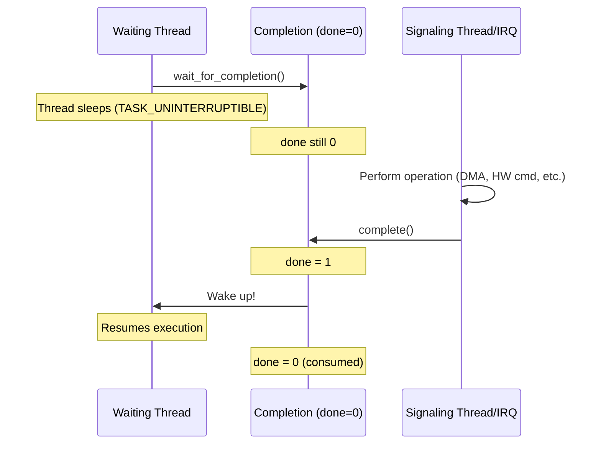
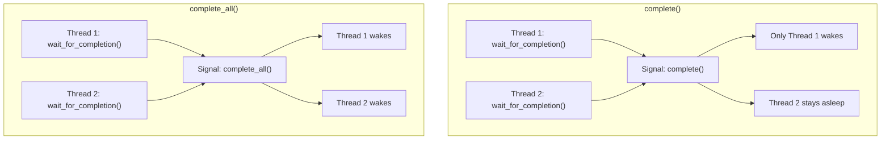

# Completion Variables

## Introduction

A **completion** is a Linux kernel synchronization primitive designed for the pattern: "one thread tells another that something is done." Unlike semaphores or mutexes, completions are purpose-built for signaling—they have minimal overhead and avoid the pitfalls of using other primitives for this use case.

Completions solve a common problem in kernel code: Thread A starts an operation (e.g., DMA transfer, hardware command) and needs to wait for Thread B (or an interrupt handler) to signal that the operation finished. Before completions existed, developers misused semaphores for this, which led to race conditions and subtle bugs. Completions were added by Ingo Molnár in Linux 2.4.7 specifically to address this.

## The `completion` Structure

```c
#include <linux/completion.h>

struct completion {
    unsigned int done;          /* Signaling state */
    wait_queue_head_t wait;     /* Wait queue */
};
```

The structure is deliberately simple: a counter (`done`) and a wait queue. When `done` is nonzero, the completion has been signaled.

## Declaring and Initializing Completions

### Static Declaration

```c
/* Statically declared, initialized at compile time */
DECLARE_COMPLETION(my_completion);

/* With a specific wait queue key (for lockdep) */
DECLARE_COMPLETION_ONSTACK(my_completion);  /* On stack, for function scope */
```

### Dynamic Initialization

```c
/* Dynamically initialize */
struct completion my_comp;
init_completion(&my_comp);

/* Or with reinit (for reuse) */
reinit_completion(&my_comp);
```

### Complete Initialization Macro

```c
/* DECLARE_COMPLETION expands to: */
struct completion my_completion = {
    .done = 0,
    .wait = __WAIT_QUEUE_HEAD_INITIALIZER(my_completion.wait),
};
```

## Waiting for Completion

### `wait_for_completion()`

The primary waiting function. Sleeps until the completion is signaled:

```c
void wait_for_completion(struct completion *x);

/* Usage */
wait_for_completion(&my_completion);
/* Execution resumes here after complete() is called */
```

**Important**: This function **cannot be interrupted by signals**. The task will sleep until `complete()` is called, period. Use `wait_for_completion_interruptible()` if signal handling is needed.

### Interruptible Variants

```c
/* Returns -ERESTARTSYS if interrupted by signal */
int wait_for_completion_interruptible(struct completion *x);

/* Returns 0 on success, -ERESTARTSYS on signal, -ETIMEOUT on timeout */
int wait_for_completion_interruptible_timeout(
    struct completion *x,
    unsigned long timeout    /* jiffies */
);

/* Returns 0 on timeout, >0 (remaining jiffies) on success */
unsigned long wait_for_completion_timeout(
    struct completion *x,
    unsigned long timeout    /* jiffies */
);

/* Killable: can be interrupted by fatal signals only */
int wait_for_completion_killable(struct completion *x);

/* Returns 0 on success, -ERESTARTSYS if killed */
int wait_for_completion_killable_timeout(
    struct completion *x,
    unsigned long timeout
);
```

### Waiting with Timeout

```c
unsigned long timeout = msecs_to_jiffies(5000);  /* 5 seconds */
unsigned long ret;

ret = wait_for_completion_timeout(&my_completion, timeout);
if (ret == 0) {
    /* Timeout — completion was NOT signaled */
    pr_err("Operation timed out!\n");
    return -ETIMEDOUT;
} else {
    /* Success — ret contains remaining jiffies */
    pr_info("Completed with %lu jiffies remaining\n", ret);
}
```

## Signaling Completion

### `complete()` — Wake One Waiter

```c
void complete(struct completion *x);

/* Wakes exactly ONE waiting thread.
 * If multiple threads are waiting, only one is woken.
 * The done counter is incremented.
 * Commonly used in interrupt handlers.
 */
```

### `complete_all()` — Wake All Waiters

```c
void complete_all(struct completion *x);

/* Wakes ALL waiting threads.
 * Sets done to UINT_MAX/2 to indicate "permanently done."
 * Use when the event is a one-time occurrence that all waiters
 * should know about (e.g., device removal, shutdown).
 */
```

### `try_wait_for_completion()` — Non-blocking Check

```c
/* Returns true if completion was consumed, false otherwise */
bool try_wait_for_completion(struct completion *x);

/* Useful for polling scenarios */
if (try_wait_for_completion(&my_completion)) {
    /* Got it! */
} else {
    /* Not ready yet */
}
```

### `completion_done()` — Check Without Consuming

```c
/* Returns true if completion is signaled, false otherwise.
 * Does NOT consume the completion (doesn't decrement done).
 */
bool completion_done(struct completion *x);
```

## Typical Usage Pattern

### Producer-Consumer Example

```c
#include <linux/module.h>
#include <linux/completion.h>
#include <linux/kthread.h>
#include <linux/delay.h>

static DECLARE_COMPLETION(data_ready);
static int shared_data;

/* Producer thread */
static int producer_thread(void *data) {
    pr_info("Producer: generating data...\n");
    msleep(2000);  /* Simulate work */
    
    shared_data = 42;
    
    pr_info("Producer: data ready, signaling completion\n");
    complete(&data_ready);  /* Signal the consumer */
    
    return 0;
}

/* Consumer (module init) */
static int __init comp_demo_init(void) {
    pr_info("Consumer: starting producer\n");
    kthread_run(producer_thread, NULL, "producer");
    
    pr_info("Consumer: waiting for data...\n");
    wait_for_completion(&data_ready);
    
    pr_info("Consumer: got data = %d\n", shared_data);
    return 0;
}

static void __exit comp_demo_exit(void) {
    pr_info("Module unloaded\n");
}

module_init(comp_demo_init);
module_exit(comp_demo_exit);
MODULE_LICENSE("GPL");
```

**Expected output:**
```
Consumer: starting producer
Consumer: waiting for data...
Producer: generating data...
Producer: data ready, signaling completion
Consumer: got data = 42
```

### DMA Transfer Completion

```c
#include <linux/completion.h>
#include <linux/dma-mapping.h>

struct dma_context {
    struct completion transfer_done;
    dma_addr_t dma_handle;
    void *buffer;
};

/* DMA completion callback (called from interrupt handler) */
static void dma_callback(void *data) {
    struct dma_context *ctx = data;
    complete(&ctx->transfer_done);  /* Signal completion from IRQ */
}

/* Initiate and wait for DMA transfer */
int do_dma_transfer(struct device *dev, struct dma_context *ctx) {
    init_completion(&ctx->transfer_done);
    
    /* Allocate DMA buffer */
    ctx->buffer = dma_alloc_coherent(dev, BUFFER_SIZE,
                                      &ctx->dma_handle, GFP_KERNEL);
    
    /* Start async DMA transfer */
    start_dma_transfer(dev, ctx->dma_handle, BUFFER_SIZE,
                       dma_callback, ctx);
    
    /* Wait for interrupt-driven completion */
    if (wait_for_completion_timeout(&ctx->transfer_done,
                                     msecs_to_jiffies(5000)) == 0) {
        dev_err(dev, "DMA transfer timed out!\n");
        return -ETIMEDOUT;
    }
    
    dev_info(dev, "DMA transfer complete\n");
    return 0;
}
```

### Device Probe Synchronization

```c
/* Common pattern: driver probe waits for firmware load */
static DECLARE_COMPLETION(fw_loaded);

static void firmware_cb(const struct firmware *fw, void *ctx) {
    if (fw) {
        process_firmware(fw);
        release_firmware(fw);
    }
    complete(&fw_loaded);
}

static int my_driver_probe(struct platform_device *pdev) {
    int ret;
    
    init_completion(&fw_loaded);
    
    ret = request_firmware_nowait(THIS_MODULE, true,
                                   "mydevice.bin",
                                   &pdev->dev, GFP_KERNEL,
                                   NULL, firmware_cb);
    if (ret)
        return ret;
    
    /* Wait for firmware to be loaded */
    if (!wait_for_completion_timeout(&fw_loaded,
                                      msecs_to_jiffies(10000))) {
        dev_err(&pdev->dev, "Firmware load timed out\n");
        return -ETIMEDOUT;
    }
    
    return 0;
}
```

## Completion Lifecycle Diagram



## complete() vs complete_all()



## Completion vs Semaphore vs Mutex

Choosing the right synchronization primitive is critical. Here's when to use each:

| Scenario | Use | Why |
|----------|-----|-----|
| "Wait for event/signal" | **Completion** | Purpose-built, no ownership issues |
| "Protect shared data" | **Mutex** | Has ownership, sleepable |
| "Protect shared data (atomic)" | **Spinlock** | No sleeping, fast |
| "Count resources" | **Semaphore** | Counting allows multiple holders |
| "Wait for condition" | **Wait queue** | More flexible, condition-based |

### Common Anti-pattern: Semaphore as Completion

```c
/* WRONG: Using semaphore for signaling (race condition!) */
struct semaphore sem;
sema_init(&sem, 0);

/* Thread A: */
down(&sem);  /* Wait for signal */

/* Thread B: */
up(&sem);    /* Signal */

/* Problem: if up() happens BEFORE down(),
 * the semaphore count is 1 and down() returns immediately.
 * This seems fine, but consider:
 * - What if you need to use it twice?
 * - What if multiple threads need to be signaled?
 * - The semantics are confusing and error-prone
 */

/* RIGHT: Use completion */
DECLARE_COMPLETION(done);
wait_for_completion(&done);   /* Always correct */
complete(&done);              /* Clear semantics */
```

### When NOT to Use Completions

```c
/* Don't use completions for mutual exclusion */
/* WRONG: Protecting a critical section with a completion */
wait_for_completion(&lock);  /* This doesn't make sense */
/* ... critical section ... */
complete(&lock);             /* Use a mutex instead! */

/* Don't use completions for counting/semaphore behavior */
/* WRONG: Multiple complete() calls to allow multiple entries */
complete(&comp);
complete(&comp);
complete(&comp);
/* Three waiters will be woken, but semantics are unclear */
/* Use a semaphore with count=3 instead */
```

## Reusing Completions

Completions can be reused by calling `reinit_completion()`:

```c
static DECLARE_COMPLETION(request_done);

void process_request(void) {
    reinit_completion(&request_done);  /* Reset done to 0 */
    
    submit_request();
    
    if (!wait_for_completion_timeout(&request_done,
                                      msecs_to_jiffies(1000))) {
        handle_timeout();
    }
}

/* Called from IRQ when request finishes */
void request_complete_irq(void) {
    complete(&request_done);
}
```

## Implementation Details

The completion implementation is efficient:

```c
/* Simplified kernel implementation */
void complete(struct completion *x) {
    unsigned long flags;
    spin_lock_irqsave(&x->wait.lock, flags);
    x->done++;
    __wake_up_locked(&x->wait, TASK_NORMAL, 1);
    spin_unlock_irqrestore(&x->wait.lock, flags);
}

void complete_all(struct completion *x) {
    unsigned long flags;
    spin_lock_irqsave(&x->wait.lock, flags);
    x->done += UINT_MAX / 2;
    __wake_up_locked(&x->wait, TASK_NORMAL, 0);  /* Wake all */
    spin_unlock_irqrestore(&x->wait.lock, flags);
}

void __sched wait_for_completion(struct completion *x) {
    might_sleep();
    spin_lock_irq(&x->wait.lock);
    if (x->done == 0) {
        DECLARE_WAITQUEUE(wait, current);
        __add_wait_queue_tail_exclusive(&x->wait, &wait);
        do {
            __set_current_state(TASK_UNINTERRUPTIBLE);
            spin_unlock_irq(&x->wait.lock);
            schedule();
            spin_lock_irq(&x->wait.lock);
        } while (!x->done);
        __remove_wait_queue(&x->wait, &wait);
    }
    x->done--;
    spin_unlock_irq(&x->wait.lock);
}
```

## References

- [The Linux Kernel Documentation](https://docs.kernel.org/)
- [GNU Project Documentation](https://www.gnu.org/doc/doc.html)
- [GNU Manuals](https://www.gnu.org/manual/manual.html)
- [Free Software Directory](https://directory.fsf.org/wiki/Main_Page)
- [Planet GNU](https://planet.gnu.org/)
- [Free Software Books](https://www.gnu.org/doc/other-free-books.html)

- [Linux kernel completion API](https://www.kernel.org/doc/Documentation/scheduler/completion.txt) — Official documentation
- [completions.h](https://git.kernel.org/pub/scm/linux/kernel/git/torvalds/linux.git/tree/include/linux/completion.h) — Kernel header source
- [completion.c](https://git.kernel.org/pub/scm/linux/kernel/git/torvalds/linux.git/tree/kernel/sched/completion.c) — Implementation
- [LWN: Completions](https://lwn.net/Articles/313685/) — LWN article on completions

## Related Topics

- [Semaphores](./semaphores.md) — Counting synchronization primitive
- [Read-Write Locks](./rwlocks.md) — Reader/writer synchronization
- [Per-CPU Variables](./per-cpu.md) — Lock-free per-CPU data
