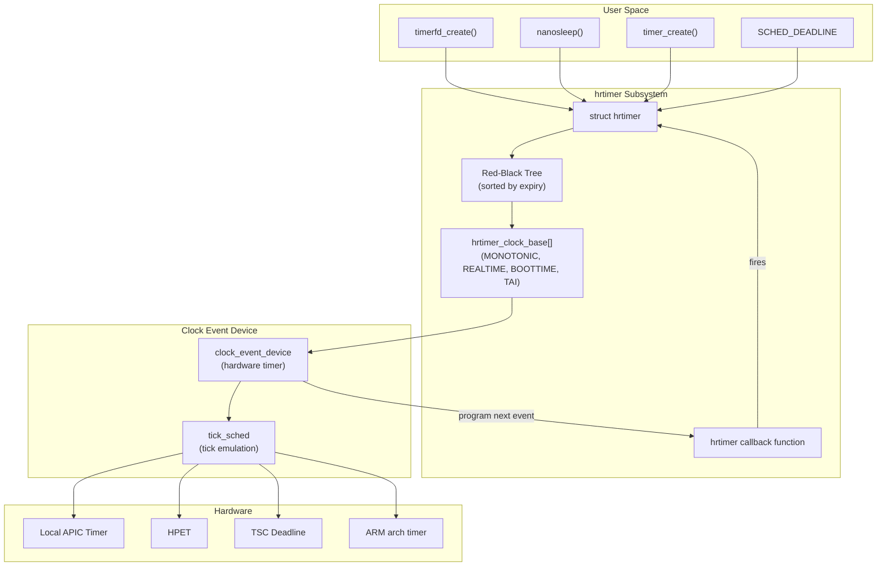
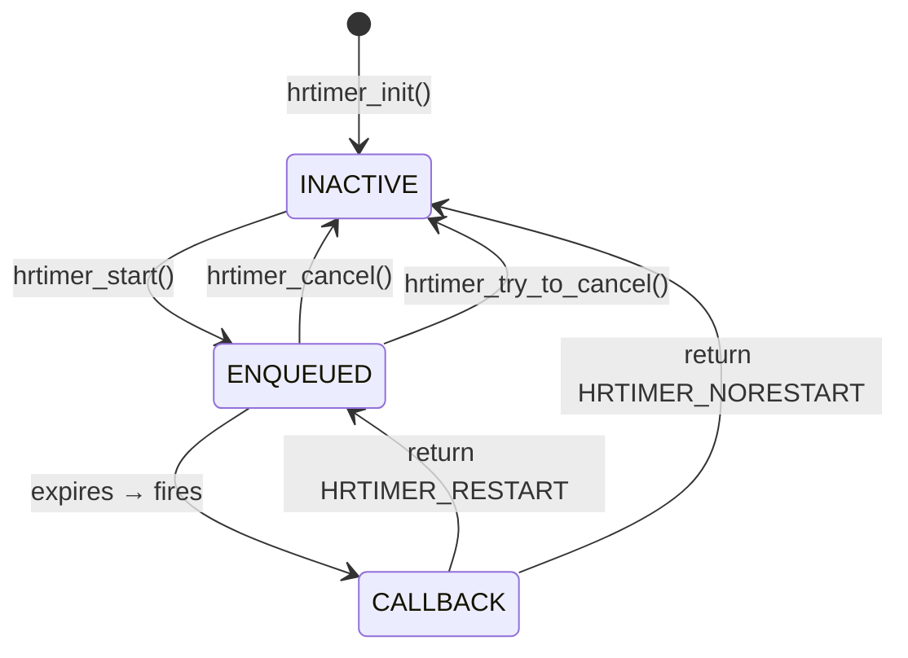

# High-Resolution Timers (hrtimers)

## Introduction

High-resolution timers (`hrtimers`) are a kernel subsystem that provides
nanosecond-precision timer events. Unlike the legacy timer wheel (which has
jiffie-level granularity, typically 1-10ms), hrtimers use a red-black tree
sorted by expiry time and can fire with sub-microsecond accuracy.

Introduced in Linux 2.6.16 (2006) by Thomas Gleixner, hrtimers replaced the
old `add_timer()` / `del_timer()` interface for time-critical operations.
Today they underpin POSIX timers (`timer_create`), `nanosleep()`, the
scheduler tick, `sched_deadline`, timerfd, and nanosleep-based delays.

## Architecture



## Core Data Structures

### `struct hrtimer`

Each high-resolution timer is represented by this structure:

```c
/* include/linux/hrtimer.h */
struct hrtimer {
    struct timerqueue_node      node;       /* rb-tree node + expiry */
    ktime_t                     _softexpires; /* soft expiry (for range) */
    enum hrtimer_restart        (*function)(struct hrtimer *);
    struct hrtimer_clock_base   *base;      /* which clock base */
    u8                          state;      /* HRTIMER_STATE_* */
    u8                          is_rel;     /* relative timer? */
    u8                          is_soft;    /* soft hrtimer (runs in softirq) */
    u8                          is_hard;    /* hard hrtimer (runs in IRQ) */
};
```

### `struct hrtimer_clock_base`

Timers are organized per-clock-type into clock bases:

```c
struct hrtimer_clock_base {
    struct hrtimer_cpu_base     *cpu_base;   /* per-CPU base */
    unsigned int                index;       /* clock type index */
    clockid_t                   clockid;     /* CLOCK_* id */
    seqcount_raw_spinlock_t     seq;
    struct hrtimer              *running;    /* currently running timer */
    struct timerqueue_head      active;      /* rb-tree of active timers */
    /* ... */
};
```

### `struct hrtimer_cpu_base`

Per-CPU state for the hrtimer subsystem:

```c
struct hrtimer_cpu_base {
    raw_spinlock_t              lock;
    unsigned int                cpu;
    unsigned int                active_bases;
    unsigned int                clock_was_set_seq;
    unsigned int                nr_events;
    unsigned short              in_hrtirq: 1,
                                hres_active: 1,
                                hang_detected: 1,
                                softirq_activated: 1;

    ktime_next_event;            /* next event for clock programming */
    struct hrtimer_clock_base    clock_base[HRTIMER_MAX_CLOCK_BASES];

    /* For high-resolution mode */
    struct hrtimer              *softirq_next_timer;
    struct hrtimer              *next_timer; /* next to expire */
    ktime_i                     expires_next;
    /* ... */
};
```

### Clock Base Types

| Index | Clock ID | Description |
|-------|----------|-------------|
| `HRTIMER_BASE_MONOTONIC` | `CLOCK_MONOTONIC` | Monotonic clock (no NTP adjustments) |
| `HRTIMER_BASE_REALTIME` | `CLOCK_REALTIME` | Wall clock (affected by `settimeofday`) |
| `HRTIMER_BASE_BOOTTIME` | `CLOCK_BOOTTIME` | Monotonic + suspend time |
| `HRTIMER_BASE_TAI` | `CLOCK_TAI` | International Atomic Time |

## Timer State Machine



### Timer States

| State | Meaning |
|-------|---------|
| `HRTIMER_STATE_INACTIVE` | Timer is not queued |
| `HRTIMER_STATE_ENQUEUED` | Timer is in the rb-tree, waiting to fire |
| `HRTIMER_STATE_CALLBACK` | Timer callback is currently executing |
| `HRTIMER_STATE_MIGRATE` | Timer is being migrated to another CPU |

## Enqueue and Dequeue

### `hrtimer_start_range_ns()`

The main API for starting a timer:

```c
void hrtimer_start_range_ns(struct hrtimer *timer, ktime_t tim,
                            u64 range_ns, const enum hrtimer_mode mode)
```

The enqueue path:

```c
static int __hrtimer_start_range_ns(struct hrtimer *timer, ktime_t tim,
                                    u64 range_ns,
                                    const enum hrtimer_mode mode,
                                    struct hrtimer_clock_base *base)
{
    /* 1. Remove timer from rb-tree if already active */
    /* 2. Calculate absolute expiry from relative + current time */
    /* 3. Set _softexpires = tim, node.expires = tim + range_ns */
    /* 4. Insert into rb-tree of the appropriate clock base */
    /* 5. Reprogram clock event device if this is the earliest timer */
}
```

### Red-Black Tree Ordering

Timers are sorted by absolute expiry time in a red-black tree:

```text
              [expires=1000]
             /              \
    [expires=500]      [expires=1500]
    /         \              \
[expires=200] [expires=800] [expires=2000]
```

The leftmost node (minimum expiry) is always the next timer to fire. The
`timerqueue` library (`lib/timerqueue.c`) provides the tree operations.

### Reprogramming the Hardware

After each enqueue/dequeue, the kernel checks if the clock event device
needs reprogramming:

```c
/* kernel/time/hrtimer.c */
static void hrtimer_reprogram(struct hrtimer *timer,
                              struct hrtimer_clock_base *base)
{
    ktime_t expires = ktime_sub(hrtimer_get_expires(timer),
                                base->offset);

    if (expires < 0)
        expires = 0;

    /* If this timer expires before the current programmed event,
       reprogram the clock event device */
    if (expires < base->cpu_base->expires_next)
        tick_program_event(expires, 1);
}
```

## Tickless Mode (NO_HZ)

In tickless kernels (`CONFIG_NO_HZ_FULL` or `CONFIG_NO_HZ_IDLE`), hrtimers
are crucial: the kernel programs the clock event device to fire only when
the next timer expires, rather than at a fixed frequency.

```text
Tick-based:     |tick|tick|tick|tick|tick|tick|tick|
                (1000 Hz = 1ms between ticks)

Tickless:       |timer1|          |timer2|                    |timer3|
                (wake only when needed)
```

This is implemented in `kernel/time/tick-sched.c`:

```c
static ktime_t tick_nohz_next_event(struct tick_sched *ts, int cpu)
{
    /* Find the earliest hrtimer expiry */
    /* Program the clock event device for that time */
    /* CPU can enter deep idle states until then */
}
```

## Hardware Clock Sources

### x86

| Timer | Resolution | Mode | Notes |
|-------|-----------|------|-------|
| **PIT (i8254)** | ~1μs | Periodic | Legacy, not used for hrtimers |
| **HPET** | ~100ns | One-shot | Multi-channel, reliable |
| **Local APIC** | ~1μs | Periodic/One-shot | Per-CPU, used in periodic mode |
| **TSC Deadline** | ~1ns | One-shot | Preferred for hrtimers (Intel) |

### ARM

| Timer | Resolution | Notes |
|-------|-----------|-------|
| **ARM Generic Timer** | ~10ns | Per-CPU, always present on ARMv7+ |
| **SP804** | ~1μs | Legacy dual-timer, used in some SoCs |

### Clock Event Device

The `clock_event_device` structure is the abstraction between hrtimers and
hardware:

```c
struct clock_event_device {
    const char              *name;
    unsigned int            features;    /* CLOCK_EVT_FEAT_* */
    unsigned long           max_delta_ns;
    unsigned long           min_delta_ns;
    unsigned long           mult;
    unsigned int            shift;
    int                     rating;
    int                     irq;
    cpumask_t               cpumask;

    /* Callbacks */
    int     (*set_next_event)(unsigned long evt,
                              struct clock_event_device *);
    void    (*set_state_periodic)(struct clock_event_device *);
    void    (*set_state_oneshot)(struct clock_event_device *);
    void    (*set_state_shutdown)(struct clock_event_device *);
    /* ... */
};
```

## Soft vs. Hard hrtimers

### Hard hrtimers (`is_hard = 1`)

Run in **interrupt context** (hardirq). Used for time-critical paths like
the scheduler deadline timer. The callback must be fast and non-blocking.

### Soft hrtimers (`is_soft = 1`)

Run in **softirq context** (`HRTIMER_SOFTIRQ`). Used for timers that don't
need hard-realtime precision (e.g., POSIX timers, nanosleep). This avoids
disabling interrupts for extended periods.

```c
/* Expire soft hrtimers in softirq */
static void hrtimer_run_softirq(struct softirq_action *h)
{
    /* Process all pending soft hrtimers */
    __hrtimer_run_queues(cpu_base, now, HRTIMER_SOFTIRQ);
}
```

The `is_hard` flag is for the `SCHED_DEADLINE` bandwidth enforcement timer,
which must fire with minimal jitter.

## User Space Interfaces

### `timerfd_create()` / `timerfd_settime()`

```c
#include <sys/timerfd.h>

int fd = timerfd_create(CLOCK_MONOTONIC, TFD_NONBLOCK | TFD_CLOEXEC);

struct itimerspec its = {
    .it_interval = { 0, 0 },           /* one-shot */
    .it_value    = { 1, 500000000 },   /* 1.5 seconds */
};
timerfd_settime(fd, 0, &its, NULL);

/* Block until timer fires */
uint64_t expirations;
read(fd, &expirations, sizeof(expirations));
```

### `clock_nanosleep()`

```c
struct timespec req = { .tv_sec = 0, .tv_nsec = 1000000 }; /* 1ms */
clock_nanosleep(CLOCK_MONOTONIC, 0, &req, NULL);
```

### `timer_create()` (POSIX Timers)

```c
timer_t timerid;
struct sigevent sev = {
    .sigev_notify = SIGEV_SIGNAL,
    .sigev_signo = SIGALRM,
};
timer_create(CLOCK_MONOTONIC, &sev, &timerid);

struct itimerspec its = {
    .it_value = { 0, 100000000 },  /* 100ms */
};
timer_settime(timerid, 0, &its, NULL);
```

### `/proc` and `/sys` Interfaces

```bash
# HRTimer statistics
$ cat /proc/timer_list | head -30
Timer List Version: v0.8
HRTIMER_MAX_CLOCK_BASES: 4
now at 1234567890123456 nsecs

cpu: 0
 clock 0:
  .base:       ffff88810021a000
  .index:      0
  .resolution: 1 nsecs
  .get_time:   ktime_get
  .offset:     0 nsecs
active timers:
 #6: <ffff888104567890>, hrtimer_wakeup, S:01, tick_sched_timer, ...
  # expires at 1234567891000000 nsecs [in 876543 nsecs]
 #12: <ffff888104567abc>, hrtimer_wakeup, S:01, posix_timer_fn, ...
  # expires at 1234567900000000 nsecs [in 1776543 nsecs]

# HRTimer statistics (if CONFIG_TIMER_STATS)
$ cat /proc/timer_stats
Timerstats is active, collection started at ...

# Clock source information
$ cat /sys/devices/system/clocksource/clocksource0/available_clocksource
tsc hpet acpi_pm
$ cat /sys/devices/system/clocksource/clocksource0/current_clocksource
tsc
```

### `timer_list` Format

Each timer in `/proc/timer_list` shows:

| Field | Meaning |
|-------|---------|
| `#N` | Timer number |
| `<address>` | `struct hrtimer` kernel address |
| `function` | Callback function name |
| `S:XX` | Timer state (00=INACTIVE, 01=ENQUEUED, 02=CALLBACK) |
| `expires at` | Absolute expiry time (nanoseconds) |
| `[in N nsecs]` | Time until expiry |

## HRTimer Hang Detection

The kernel monitors for hrtimer hangs (callbacks that take too long):

```c
/* kernel/time/hrtimer.c */
static void hrtimer_interrupt(struct clock_event_device *dev)
{
    /* If a callback has been running for > 2 * max_hang_time,
       mark it as hung and attempt recovery */
    if (ktime_after(ktime_get(), base->running->node.expires +
                            2 * sysctl_hung_task_timeout_secs)) {
        base->cpu_base->hang_detected = 1;
        /* ... */
    }
}
```

### Hang Detection Sysctl

```bash
# Check if hrtimer hang detection is active
$ cat /proc/sys/kernel/hung_task_timeout_secs
120

# HRTimer-specific stats
$ grep hrtimer /proc/stat
```

## Kernel Source Map

| File | Purpose |
|------|---------|
| `kernel/time/hrtimer.c` | Core hrtimer implementation (~1500 lines) |
| `kernel/time/hrtimer.c` | `hrtimer_interrupt()`, `run_hrtimer_softirq()` |
| `include/linux/hrtimer.h` | `struct hrtimer`, API declarations |
| `kernel/time/timer_list.c` | `/proc/timer_list` implementation |
| `kernel/time/tick-sched.c` | Tickless mode, `tick_nohz_*` functions |
| `kernel/time/clockevents.c` | Clock event device management |
| `kernel/time/clocksource.c` | Clock source abstraction |
| `lib/timerqueue.c` | Red-black tree for timer ordering |
| `arch/x86/kernel/apic/apic.c` | Local APIC timer as clock event device |
| `drivers/clocksource/` | Hardware timer drivers |
| `kernel/time/posix-timers.c` | POSIX timer implementation (uses hrtimers) |

## Performance Characteristics

### Enqueue/Dequeue Complexity

| Operation | Complexity | Notes |
|-----------|-----------|-------|
| Enqueue | O(log n) | rb-tree insertion |
| Dequeue | O(log n) | rb-tree removal |
| Get next timer | O(1) | `rb_first()` — leftmost node |
| Cancel | O(log n) | Find + remove from rb-tree |

### Overhead

- **Enqueue**: ~200-400ns (depends on tree depth)
- **Fire**: ~500ns-2μs (interrupt + callback)
- **Reprogram**: ~1μs (MMIO write to clock event device)

### `timer_list` Output Size

On a busy system with many timers:

```bash
$ wc -l /proc/timer_list
2847 /proc/timer_list
```

## Example: Using hrtimers in Kernel Code

```c
#include <linux/hrtimer.h>
#include <linux/module.h>
#include <linux/ktime.h>

static struct hrtimer my_timer;
static ktime_t interval;

static enum hrtimer_restart timer_callback(struct hrtimer *timer)
{
    pr_info("hrtimer fired at %lld ns\n", ktime_get_ns());

    /* Return HRTIMER_RESTART to restart, HRTIMER_NORESTART to stop */
    hrtimer_forward_now(timer, interval);
    return HRTIMER_RESTART;
}

static int __init hrtimer_example_init(void)
{
    /* 500ms interval */
    interval = ktime_set(0, 500 * NSEC_PER_MSEC);

    hrtimer_init(&my_timer, CLOCK_MONOTONIC, HRTIMER_MODE_REL);
    my_timer.function = &timer_callback;
    hrtimer_start(&my_timer, interval, HRTIMER_MODE_REL);

    return 0;
}

static void __exit hrtimer_example_exit(void)
{
    hrtimer_cancel(&my_timer);
}

module_init(hrtimer_example_init);
module_exit(hrtimer_example_exit);
MODULE_LICENSE("GPL");
```

## Comparison: hrtimers vs. Legacy Timers

| Feature | Legacy Timer Wheel | hrtimers |
|---------|-------------------|----------|
| Resolution | Jiffies (1-10ms) | Nanoseconds |
| Data structure | Hash table (timer wheel) | Red-black tree |
| Granularity | Coarse | Fine |
| Overhead | Lower | Slightly higher |
| Use cases | Timeouts, delayed work | POSIX timers, sleep, scheduler |
| Clock sources | Any | High-resolution clock event device |
| Expiry precision | ±1 jitter | ±μs or better |

### When to Use Which

- **Use hrtimers** when you need precise timing, sub-millisecond delays,
  or user-visible timer accuracy (POSIX compliance)
- **Use legacy timers** (`mod_timer`, `schedule_timeout`) for coarse
  timeouts where jiffie precision is sufficient and lower overhead is desired

## Version History

| Kernel | Changes |
|--------|---------|
| 2.6.16 | hrtimers introduced (Thomas Gleixner) |
| 2.6.21 | High-resolution mode enabled by default on supported hardware |
| 2.6.25 | `CLOCK_BOOTTIME` added |
| 3.10 | `CLOCK_TAI` support |
| 4.3 | Hrtimer hang detection |
| 4.8 | Tickless idle (`NO_HZ_IDLE`) improvements |
| 5.0 | Soft/hard hrtimer distinction (`is_soft`, `is_hard`) |
| 5.8 | `SCHED_DEADLINE` uses hard hrtimers |
| 6.1 | Timer migration improvements for CPU hotplug |

## References

1. **Kernel source**: https://github.com/torvalds/linux/blob/master/kernel/time/hrtimer.c
2. **Kernel documentation**: https://docs.kernel.org/timers/hrtimers.html
3. **LWN: A new approach to kernel timers**: https://lwn.net/Articles/152436/
4. **LWN: The tick broadcast framework**: https://lwn.net/Articles/574963/
5. **Thomas Gleixner's hrtimer paper**: https://kernel.org/pub/linux/kernel/people/gleixner/hrtimers.pdf
6. **clock_event_device documentation**: https://docs.kernel.org/timers/clockevents.html
7. **`/proc/timer_list` format**: `kernel/time/timer_list.c`
8. **POSIX timers**: https://man7.org/linux/man-pages/man2/timer_create.2.html
