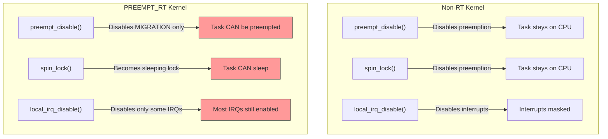
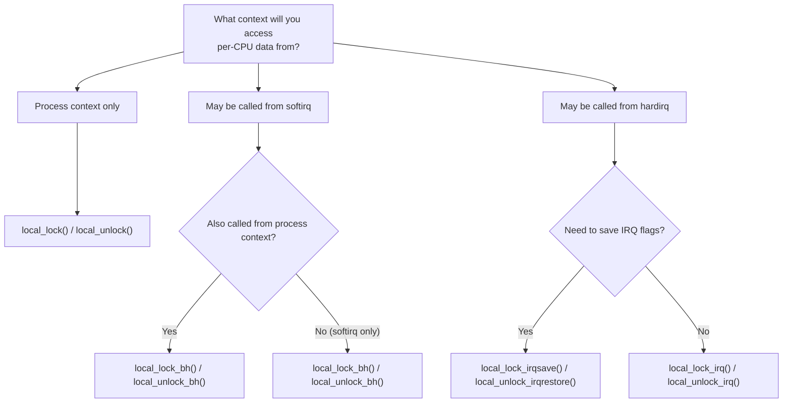
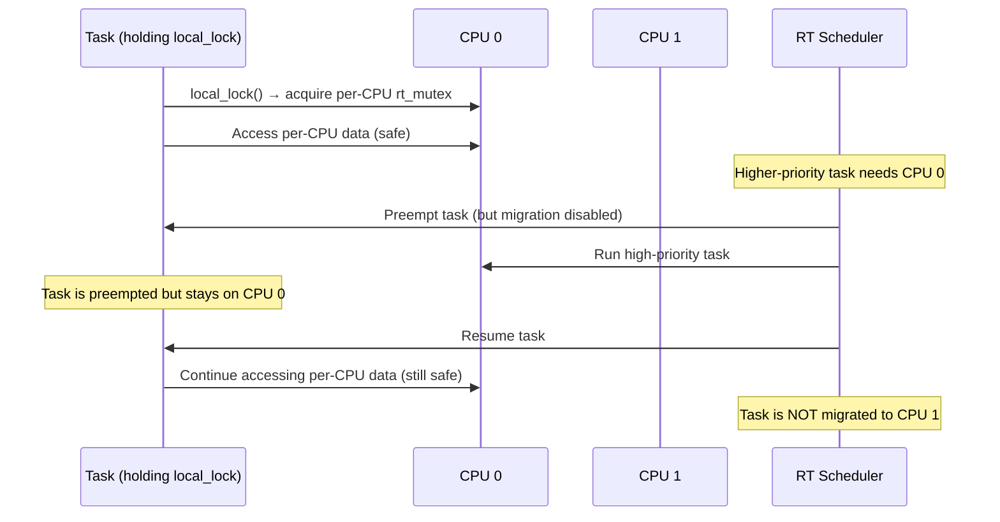

# local_lock — Per-CPU Locking for PREEMPT_RT

## Overview

`local_lock` is a kernel synchronization primitive designed to provide **per-CPU
mutual exclusion** with semantics compatible with the `PREEMPT_RT` (real-time
preemption) patch set. It replaces the traditional pattern of disabling
preemption or interrupts to protect per-CPU data, offering a unified API that
works correctly in both non-RT and RT kernels.

In a non-RT kernel, `local_lock` typically compiles to preemption or interrupt
disabling. In a `PREEMPT_RT` kernel, it becomes a **sleeping lock** (a per-CPU
`rt_mutex`), allowing the critical section to be preempted while still
preventing concurrent access from other CPUs to the same per-CPU data.

## The Problem It Solves

### Traditional Per-CPU Protection

Before `local_lock`, kernel code protected per-CPU data with:

```c
/* Disabling preemption ensures the task stays on the same CPU */
preempt_disable();
/* Access per-CPU variable */
this_cpu_write(per_cpu_var, value);
preempt_enable();
```

Or with interrupts disabled for interrupt-safe access:

```c
local_irq_disable();
this_cpu_write(per_cpu_var, value);
local_irq_enable();
```

Or with bottom-half disabling for softirq-safe access:

```c
local_bh_disable();
this_cpu_write(per_cpu_var, value);
local_bh_enable();
```

### The PREEMPT_RT Problem

`PREEMPT_RT` fundamentally changes the behavior of these primitives:



Specifically:

- **`preempt_disable()`** no longer prevents preemption — it becomes a
  **migration disable** (the task stays on the same CPU but can be preempted
  by higher-priority tasks)
- **`spin_lock()`** becomes a sleeping lock (an `rt_mutex` internally), so it
  **cannot be used in interrupt context**
- **Disabling interrupts** is still possible but defeats the purpose of RT by
  introducing unbounded latency
- **`local_bh_disable()`** on RT doesn't actually disable softirq processing —
  softirqs run as ksoftirqd threads that can preempt

This creates a gap: there was no clean way to protect per-CPU data in RT
kernels that works in all contexts (process, softirq, hardirq).

### local_lock as the Solution

`local_lock` provides a per-CPU lock that:

1. **In non-RT kernels**: compiles to `preempt_disable()` / `preempt_enable()` —
   zero overhead beyond what the kernel already does
2. **In RT kernels**: becomes a per-CPU `rt_mutex` — preemptible, priority-
   inheriting, and correct
3. **Works in all contexts**: process, softirq, and hardirq (with appropriate
   variants)

## API Reference

### Basic Usage

```c
#include <linux/local_lock.h>

DEFINE_LOCAL_LOCK(my_lock);

void update_per_cpu_data(void) {
    local_lock(&my_lock);
    /* Safe access to per-CPU data */
    this_cpu_write(my_counter, this_cpu_read(my_counter) + 1);
    local_unlock(&my_lock);
}
```

### Variants

| Function                      | Context     | Non-RT Behavior     | RT Behavior            |
|-------------------------------|-------------|---------------------|------------------------|
| `local_lock(&lock)`           | Process     | `preempt_disable()` | `rt_mutex_lock()`      |
| `local_unlock(&lock)`         | Process     | `preempt_enable()`  | `rt_mutex_unlock()`    |
| `local_lock_bh(&lock)`        | Softirq     | `local_bh_disable()`| `rt_mutex_lock()`      |
| `local_unlock_bh(&lock)`      | Softirq     | `local_bh_enable()` | `rt_mutex_unlock()`    |
| `local_lock_irq(&lock)`       | Hardirq     | `local_irq_disable()`| `rt_mutex_lock()`     |
| `local_unlock_irq(&lock)`     | Hardirq     | `local_irq_enable()` | `rt_mutex_unlock()`   |
| `local_lock_irqsave(&lock, f)`| Hardirq     | `local_irq_save()`  | `rt_mutex_lock()`      |
| `local_unlock_irqrestore(&lock, f)`| Hardirq | `local_irq_restore()`| `rt_mutex_unlock()` |

### Choosing the Right Variant



### Nested Bottom-Half Variant

The `local_lock_nested_bh` variant is specifically designed for code paths that
can be called from both process context and softirq (bottom-half) context, using
the **same** lock instance. It prevents deadlocks when a softirq interrupts a
process-context critical section that holds the same lock:

```c
DEFINE_LOCAL_LOCK(my_bh_lock);

void called_from_process(void) {
    local_lock_bh(&my_bh_lock);
    shared_bh_and_process_code();
    local_unlock_bh(&my_bh_lock);
}

void called_from_softirq(void) {
    /*
     * Must use local_lock_nested_bh() — not local_lock() — to safely
     * acquire a lock that may already be held by a process-context
     * caller that was interrupted by this softirq.
     *
     * Non-RT: disables bottom halves (prevents re-entrant softirq)
     * RT: acquires the per-CPU rt_mutex with a nested lockdep annotation
     */
    local_lock_nested_bh(&my_bh_lock);
    shared_bh_and_process_code();
    local_unlock_nested_bh(&my_bh_lock);
}
```

Using plain `local_lock()` from softirq context when the same lock is taken
with `local_lock_bh()` from process context will trigger **lockdep warnings**
because lockdep cannot establish the correct nesting relationship.
`local_lock_nested_bh()` provides the proper lockdep annotation to suppress
false positives while still detecting real deadlocks.

## Implementation Details

### Non-RT Kernel

In a standard kernel without `PREEMPT_RT`, `local_lock` is essentially a no-op
or maps directly to preemption control:

```c
/* include/linux/local_lock_internal.h (non-RT) */
typedef struct {
    /* empty — no actual lock needed */
} local_lock_t;

#define local_lock_init(_lock)  do { } while (0)

static inline void local_lock(local_lock_t *lock)
{
    preempt_disable();
}

static inline void local_unlock(local_lock_t *lock)
{
    preempt_enable();
}
```

This adds zero overhead beyond what `preempt_disable()` already costs. On most
architectures, this is a simple per-CPU counter increment:

```c
/* kernel/sched/core.c */
static inline void preempt_disable(void)
{
    preempt_count_inc();
    barrier();  /* Prevent compiler reordering */
}
```

Cost: **1-2 cycles** (a single memory increment on the per-CPU preempt count).

### RT Kernel

In a `PREEMPT_RT` kernel, `local_lock` becomes a per-CPU `rt_mutex`:

```c
/* include/linux/local_lock_internal.h (RT) */
typedef struct {
    struct rt_mutex_base __percpu *lock;
} local_lock_t;

static inline void local_lock(local_lock_t *l)
{
    rt_mutex_lock(this_cpu_ptr(l->lock));
}

static inline void local_unlock(local_lock_t *l)
{
    rt_mutex_unlock(this_cpu_ptr(l->lock));
}
```

The `rt_mutex` provides:

- **Priority inheritance**: if a high-priority task waits on a lock held by a
  low-priority task, the holder temporarily inherits the higher priority
- **Bounded wait time**: no unbounded spinning
- **Preemptibility**: the lock holder can be preempted by unrelated tasks

### Migration Disable

A critical detail: `local_lock` in RT kernels also disables **migration** — the
task cannot be moved to a different CPU while holding the lock. This ensures the
per-CPU data access remains on the correct CPU.

In non-RT kernels, `preempt_disable()` inherently prevents migration (a task
can't be migrated if it can't be preempted).

In RT kernels, migration disable is explicit — the task can still be preempted,
but when it resumes, it will be on the same CPU:



### The Per-CPU Guarantee

The fundamental invariant that `local_lock` maintains:

> **While holding a `local_lock`, the task is guaranteed to remain on the same
> CPU, and no other task on the same CPU can hold the same lock.**

This means:
- On non-RT: preemption is disabled → task stays on CPU, no other task runs
- On RT: migration is disabled + rt_mutex is per-CPU → task stays on CPU, and
  the per-CPU rt_mutex prevents other tasks on the same CPU from entering the
  critical section

## Real-World Usage in the Kernel

### Per-CPU Page Allocator

The kernel's per-CPU page allocator uses `local_lock` to protect per-CPU page
caches:

```c
/* mm/page_alloc.c (simplified) */
struct per_cpu_pages {
    local_lock_t lock;
    /* ... page lists, counters ... */
};

DEFINE_PER_CPU_ALIGNED(struct per_cpu_pages, boot_pages);

void free_unref_page(struct page *page)
{
    struct per_cpu_pages *pcp;
    unsigned long flags;

    local_lock_irqsave(&pcp_lock, flags);
    pcp = this_cpu_ptr(&boot_pages);
    /* Add page to per-CPU free list */
    pcp->count++;
    list_add(&page->lru, &pcp->lists[migratetype]);
    local_unlock_irqrestore(&pcp_lock, flags);
}
```

The `irqsave` variant is used because `free_unref_page()` can be called from
interrupt context (e.g., network buffer freeing).

### Network Statistics

Per-CPU network statistics use `local_lock_bh` for softirq-safe access:

```c
/* net/core/dev.c (simplified) */
void dev_sw_netstats_rx_add(struct net_device *dev, unsigned int len)
{
    struct pcpu_sw_netstats *tstats;

    local_lock_bh(&dev->pcpu_lock);
    tstats = this_cpu_ptr(dev->tstats);
    tstats->rx_bytes += len;
    tstats->rx_packets++;
    local_unlock_bh(&dev->pcpu_lock);
}
```

### Scheduler Run Queues

The scheduler uses local_lock variants to protect per-CPU run queue data
structures in an RT-compatible manner. The run queue lock is a per-CPU lock
that must be held while manipulating the queue.

### Slab Allocator

The SLUB allocator uses per-CPU freelists protected by `local_lock`:

```c
/* mm/slub.c (simplified) */
static inline unsigned long cpu_slab_free_count(struct kmem_cache_cpu *c)
{
    return c->freelist ? 1 : 0;
}

void *kmem_cache_alloc(struct kmem_cache *s, gfp_t gfpflags)
{
    void *object;
    local_lock_irqsave(&s->cpu_slab->lock, flags);
    object = cpu_slab_alloc(s, gfpflags, _RET_IP_);
    local_unlock_irqrestore(&s->cpu_slab->lock, flags);
    return object;
}
```

## Migration from Legacy Patterns

### Before local_lock

```c
/* Old pattern — broken on PREEMPT_RT */
DEFINE_SPINLOCK(per_cpu_lock);

void update_data(void) {
    spin_lock(&per_cpu_lock);
    __this_cpu_write(my_var, new_value);
    spin_unlock(&per_cpu_lock);
}
```

Problems on RT:
- `spin_lock()` becomes a sleeping lock → cannot use in hardirq/softirq
- `preempt_disable()` doesn't prevent preemption on RT
- Using `local_irq_disable()` adds unbounded latency

### After local_lock

```c
/* New pattern — works on all configurations */
DEFINE_LOCAL_LOCK(per_cpu_lock);

void update_data(void) {
    local_lock(&per_cpu_lock);
    __this_cpu_write(my_var, new_value);
    local_unlock(&per_cpu_lock);
}

/* Or for softirq context */
void update_data_bh(void) {
    local_lock_bh(&per_cpu_lock);
    __this_cpu_write(my_var, new_value);
    local_unlock_bh(&per_cpu_lock);
}
```

### Migration Checklist

When converting legacy per-CPU protection to `local_lock`:

1. **Identify the context**: Is the code called from process, softirq, or
   hardirq context?
2. **Choose the right variant**: Use `local_lock_bh` for softirq, `local_lock_irq`
   for hardirq
3. **Check for nested callers**: If the same lock is used from both process and
   softirq context, use `local_lock_nested_bh` in the softirq path
4. **Verify no sleep in critical section**: On non-RT, `local_lock` disables
   preemption, so sleeping is not allowed
5. **Test on both RT and non-RT**: The behavior is different; test both

## When to Use local_lock

### Appropriate Use Cases

1. **Per-CPU counters and statistics**: updating per-CPU performance counters
2. **Per-CPU caches**: managing per-CPU slab caches or object pools
3. **Per-CPU lists**: manipulating per-CPU linked lists
4. **Per-CPU timers**: managing per-CPU timer wheels
5. **Per-CPU freelists**: memory allocator per-CPU caches
6. **Any per-CPU data**: accessed from process context, softirq, or hardirq

### When NOT to Use local_lock

- **Shared data**: if data is accessed from multiple CPUs, use a regular
  spinlock, mutex, or RCU
- **Long critical sections**: in non-RT kernels, `local_lock` disables
  preemption, which increases scheduling latency
- **NMI context**: local_lock is not NMI-safe; use dedicated NMI protection
  (e.g., `rcu_read_lock` in NMI, or per-CPU data with `nmi_enter`/`nmi_exit`)
- **Data accessed from different CPUs**: `local_lock` only protects against
  same-CPU concurrency; cross-CPU access needs a different mechanism

## Interaction with Other Locks

### local_lock and spin_lock

```c
/* Lock ordering: spin_lock > local_lock */
spin_lock(&global_lock);        /* Outer */
local_lock(&per_cpu_lock);      /* Inner */
/* ... access both global and per-CPU data ... */
local_unlock(&per_cpu_lock);
spin_unlock(&global_lock);
```

### local_lock and mutex

```c
/* Lock ordering: mutex > local_lock */
mutex_lock(&sleepable_lock);    /* Outer (can sleep) */
local_lock(&per_cpu_lock);      /* Inner (non-RT: disables preempt) */
/* ... */
local_unlock(&per_cpu_lock);
mutex_unlock(&sleepable_lock);
```

### local_lock and RCU

```c
/* RCU read lock + local_lock is fine */
rcu_read_lock();
local_lock(&per_cpu_lock);
/* ... access per-CPU data and RCU-protected data ... */
local_unlock(&per_cpu_lock);
rcu_read_unlock();
```

## Debugging

### Lockdep Support

`local_lock` is fully integrated with lockdep. Common warnings include:

- **"BUG: sleeping function called from invalid context"**: using a sleeping
  local_lock variant in a non-sleeping context (e.g., `local_lock()` in
  interrupt context on RT)
- **"inconsistent lock state"**: mixing local_lock variants incorrectly (e.g.,
  using `local_lock()` when `local_lock_bh()` is needed)
- **Deadlock detection**: circular dependency between local_lock and other locks
- **"suspicious RCU usage"**: using RCU-protected data in a local_lock critical
  section without proper RCU read lock

### CONFIG_DEBUG_LOCK_ALLOC

Enable this config option to track lock ownership and nesting, which helps
identify incorrect local_lock usage patterns.

### Common Pitfalls

1. **Forgetting the context**: Using `local_lock()` when the code can be called
   from softirq → use `local_lock_bh()` instead
2. **Missing nested variant**: Using `local_lock_bh()` from softirq when the
   same lock is held from process context with `local_lock_bh()` → use
   `local_lock_nested_bh()` in the softirq path
3. **Sleeping in critical section**: On non-RT, `local_lock` disables preemption,
   so calling `kmalloc(GFP_KERNEL)`, `mutex_lock()`, or any sleeping function
   is a bug
4. **Cross-CPU access**: `local_lock` doesn't prevent other CPUs from accessing
   the same per-CPU data; use `this_cpu_*` accessors to ensure same-CPU access

## Performance Considerations

### Non-RT Kernels

`local_lock` compiles to `preempt_disable()`/`preempt_enable()`, which on most
architectures is a simple per-CPU counter increment/decrement. Cost is typically
**1–2 cycles** — essentially free.

### RT Kernels

`local_lock` becomes a per-CPU `rt_mutex`. The cost includes:

- Lock acquisition: **~50–200 ns** (depending on contention and priority
  inheritance overhead)
- Migration disable: included in the lock acquisition cost
- Memory: one `rt_mutex` per CPU per lock instance (typically 32-64 bytes each)
- Preemption latency: the lock holder can be preempted, so critical section
  duration is not bounded by the lock itself

### Contention

Because `local_lock` is per-CPU, contention is rare — only preemption by a
higher-priority task on the same CPU can cause the lock to be contended. In
practice, this is infrequent:

| Scenario | Contention Probability | Impact |
|----------|----------------------|--------|
| Normal load, short critical sections | Very low | Negligible |
| RT tasks present, same CPU | Low | Priority inheritance kicks in |
| Heavy preemption, same CPU | Moderate | Increased latency for holder |

### Memory Overhead

On non-RT: `local_lock_t` is an empty struct — **0 bytes**.

On RT: `local_lock_t` contains a pointer to a per-CPU `rt_mutex` —
**8 bytes per lock + 32-64 bytes per CPU per lock**.

## Comparison with Alternatives

| Mechanism | Non-RT | RT | Interrupt Safe | Preemption |
|-----------|--------|----|---------------|------------|
| `local_lock` | preempt_disable | rt_mutex | No | Disabled (non-RT) / Preemptible (RT) |
| `local_lock_bh` | local_bh_disable | rt_mutex | Softirq-safe | Disabled BH (non-RT) / Preemptible (RT) |
| `local_lock_irq` | local_irq_disable | rt_mutex | IRQ-safe | IRQs disabled (non-RT) / Preemptible (RT) |
| `preempt_disable` | preempt_disable | migration disable only | No | Task can still be preempted on RT |
| `spin_lock` | preempt_disable | rt_mutex | No | Disabled (non-RT) / Preemptible (RT) |
| `spin_lock_irq` | local_irq_disable | rt_mutex | IRQ-safe | IRQs disabled (non-RT) / Preemptible (RT) |
| `get_cpu_var` | preempt_disable + addr | N/A | No | Same as preempt_disable |

The key advantage of `local_lock` over these alternatives is its **unified
API** that works correctly across all kernel configurations without requiring
`#ifdef CONFIG_PREEMPT_RT` conditionals.

## FAQ

### Can I use `local_lock` from NMI context?

No. `local_lock` is not NMI-safe. On non-RT, `preempt_disable()` does not
prevent NMI execution. On RT, the per-CPU `rt_mutex` can deadlock if the
same lock is already held by the interrupted context. For NMI-safe per-CPU
access, use dedicated NMI-safe mechanisms like `rcu_read_lock()` in NMI
context, or access per-CPU data without locking (accepting potential
inconsistency).

### What happens if I use `local_lock` from the wrong context?

On non-RT kernels, using `local_lock()` (process context) from interrupt
context will trigger a lockdep warning about sleeping in atomic context.
On RT kernels, using `local_lock_irqsave()` from process context will work
but may cause unnecessary latency (IRQs are disabled briefly). Lockdep
catches these misuse patterns at runtime.

### Is `local_lock` the same as `get_cpu_var()`?

Similar but not identical. `get_cpu_var()` returns a pointer to the per-CPU
variable and disables preemption until `put_cpu_var()`. `local_lock` provides
the same preemption-disable semantics but with a named lock that lockdep can
track, and it degrades to an `rt_mutex` on RT kernels. `get_cpu_var()` does
not have RT-compatible semantics.

### How much memory does `local_lock` use?

On non-RT: `local_lock_t` is an empty struct — 0 bytes (compiled out). On RT:
`local_lock_t` is 8 bytes (a pointer to a per-CPU `rt_mutex`). The per-CPU
`rt_mutex` itself is 32-64 bytes per CPU. For a system with 128 CPUs and 10
local_locks, that's ~64 KB of memory for the rt_mutex structures.

### Can I use `local_lock` to protect data accessed from multiple CPUs?

No. `local_lock` only prevents concurrent access from the **same CPU** (via
preemption disable or per-CPU rt_mutex). If data is shared across CPUs, you
need a regular spinlock, mutex, or RCU. However, you can combine `local_lock`
with other mechanisms: use `local_lock` for per-CPU updates and periodically
aggregate across CPUs.

## See Also

- [Mutex Design](./mutex-design.md) — sleeping lock design and optimistic spinning
- [Spinlocks](./spinlock.md) — spinlock implementation
- [PREEMPT_RT](../rt/preempt-rt.md) — real-time preemption overview
- [Per-CPU Variables](../percpu/percpu.md) — per-CPU data allocation and access
- [Lockdep](../debugging/lockdep.md) — lock dependency validator

## Further Reading

- **Kernel source**: `include/linux/local_lock.h`, `include/linux/local_lock_internal.h`
- **Documentation**: `Documentation/locking/rt-mutex.rst`
- **LWN article**: ["Sleeping spinlocks and realtime"](https://lwn.net/Articles/778953/) —
  PREEMPT_RT locking overview
- **Thomas Gleixner's talk**: "PREEMPT_RT: Locking and Synchronization" —
  Linux Plumbers Conference
- **commit 5be3a75**: "local_lock: Add local_lock() infrastructure"
- **PREEMPT_RT wiki**: https://wiki.linuxfoundation.org/realtime/start —
  comprehensive RT locking documentation
- **LWN: ["A realtime preemption overview"](https://lwn.net/Articles/106010/)** —
  Early PREEMPT_RT design
