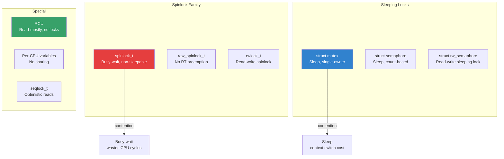
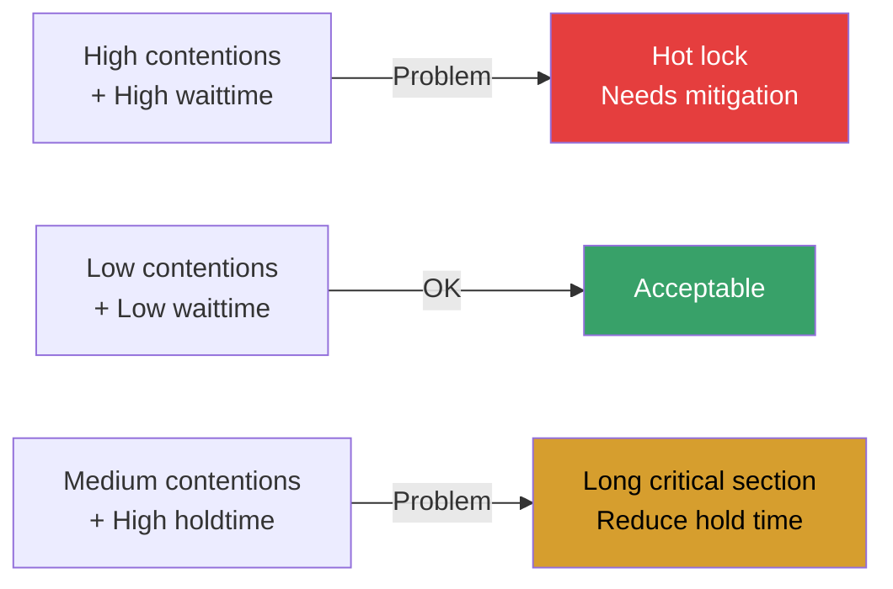
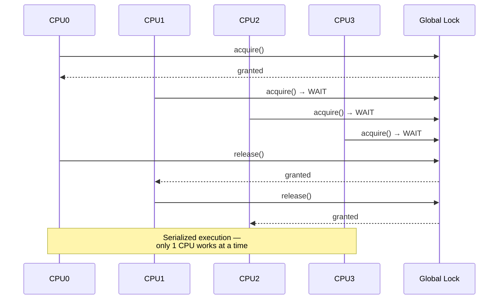
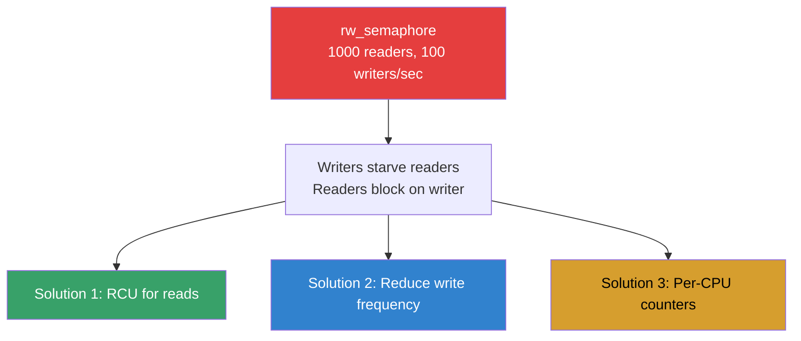
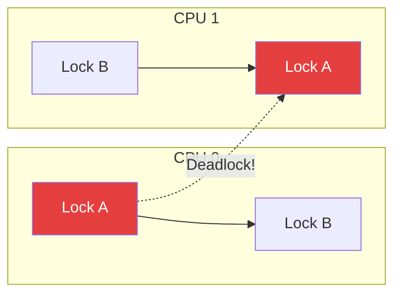
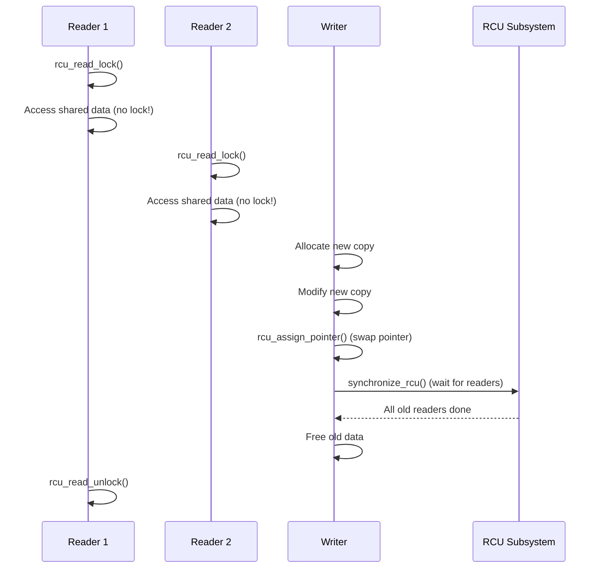
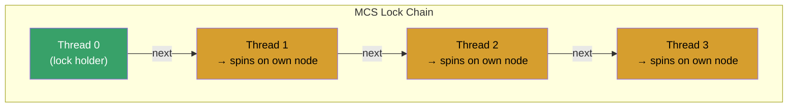
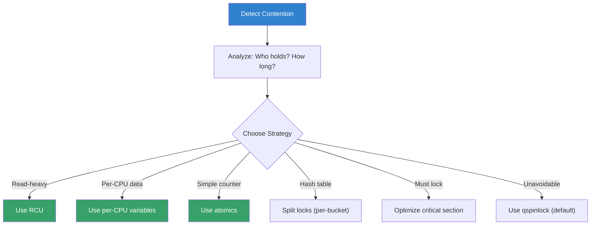

# Lock Contention: Detection, Analysis, and Mitigation

## Introduction

Lock contention occurs when multiple threads or CPUs compete for the same lock, forcing some to wait while others hold it. In the Linux kernel, lock contention is one of the most significant performance bottlenecks, especially on multi-core and NUMA systems. As core counts increase, the cost of contention grows non-linearly — a lock that works fine on 4 cores can become a severe bottleneck on 128 cores.

Understanding lock contention is critical because:
- It causes **latency spikes** — waiting threads are stalled
- It reduces **throughput** — CPUs idle while waiting
- It limits **scalability** — adding cores makes contention worse
- It's **hard to detect** from user space — symptoms look like general slowness

## How Locks Work in the Kernel

### Lock Types and Their Contention Characteristics



### The Cost of Contention

| Lock Type | Uncontended Cost | Contended Cost (2 CPUs) | Contended Cost (128 CPUs) |
|-----------|-----------------|------------------------|--------------------------|
| spinlock | ~10 ns | ~100 ns | ~10 μs |
| mutex | ~50 ns | ~1 μs | ~100 μs |
| rwlock (read) | ~15 ns | ~200 ns | ~50 μs |

The key insight: **contention cost grows super-linearly** with the number of competing CPUs due to cache-line bouncing.

## Detecting Lock Contention

### lockstat: Kernel Lock Statistics

`lockstat` is the kernel's built-in lock contention tracking facility.

```bash
# Enable lockstat (kernel config)
# CONFIG_LOCK_STAT=y

# Check if lockstat is available
ls /proc/lock_stat

# Enable lockstat collection
echo 1 > /proc/sys/kernel/lock_stat

# Read lock statistics
cat /proc/lock_stat

# Disable when done
echo 0 > /proc/sys/kernel/lock_stat
```

### Reading /proc/lock_stat

```
lock_stat version 0.4
-------------------------------------------------------------------------------------------------------------------------------------------------------------------------------------------------------------------------------
                              class name    con-bounces    contentions   waittime-min   waittime-max waittime-total    acq-bounces   acquisitions   holdtime-min   holdtime-max holdtime-total
-------------------------------------------------------------------------------------------------------------------------------------------------------------------------------------------------------------------------------

&rq->__lock:                    5234            5123          0.12         145.33        12453.21         123456        1234567          0.05          12.34        5432.10
-------------------------------------------------------------------------------------------------------------------------------------------------------------------------------------------------------------------------------
```

**Key columns:**
- **con-bounces** — number of times a lock was contended
- **contentions** — total contention events
- **waittime-min/max/total** — time spent waiting for the lock
- **acq-bounces** — cache-line bounces during acquisition
- **holdtime-min/max/total** — time the lock was held

### Interpreting Contention Metrics



### Using perf for Lock Profiling

```bash
# Record lock contention events
sudo perf lock record -a -- sleep 10

# Report lock contention
sudo perf lock report

# Sort by contention count
sudo perf lock report --sort=contention

# Sort by wait time
sudo perf lock report --sort=wait_total

# Show lock contention with call stacks
sudo perf lock report -k caller

# Trace lock events in real-time
sudo perf lock contention
```

### Example perf lock report

```
                Name    acquired  contended  avg wait (ns)  total wait (ns)   max wait (ns)

  &rq->__lock          1234567      5432         125000        679000000         15000000
  &mm->mmap_lock         98765      2345         500000       1172500000         45000000
  &sb->s_type            45678        56          25000         1400000          250000
```

### Using ftrace for Lock Tracing

```bash
# Enable lock tracing
echo 1 > /sys/kernel/debug/tracing/events/lock/enable

# Trace lock acquisition/contention
cat /sys/kernel/debug/tracing/trace_pipe

# Specific lock class tracing
echo 'lock_class == &rq->__lock' > \
    /sys/kernel/debug/tracing/events/lock/contention_begin/filter

# Trace with stack traces
echo 1 > /sys/kernel/debug/tracing/options/stacktrace
```

### Using BPF for Lock Analysis

```c
// lock_contention.bt — bpftrace script
#include <linux/ptrace.h>

kprobe:mutex_lock {
    @start[tid] = nsecs;
}

kretprobe:mutex_lock /@start[tid]/ {
    $dur = nsecs - @start[tid];
    @wait_us = hist($dur / 1000);
    delete(@start[tid]);
}

// Profile which locks are most contended
kprobe:mutex_lock_slowpath {
    @contention[func, kstack(5)] = count();
}
```

```bash
# Run the script
sudo bpftrace lock_contention.bt

# Or use bcc's lockstat tool
sudo /usr/share/bcc/tools/lockstat
```

### Lock Contention Heatmap

```bash
# Using perf to generate contention heatmaps
sudo perf lock record -a -- sleep 30
sudo perf lock report --threads --sort=wait_total

# Visualize with flame graphs for lock holders
sudo perf record -g -e lock:contention_begin -e lock:contention_end \
    -a -- sleep 10
sudo perf script | stackcollapse-perf.pl | flamegraph.pl > lock_flame.svg
```

## Common Lock Contention Patterns

### Pattern 1: Global Lock on Hot Path



**Solution: Per-CPU or per-node data structures**

```c
/* Before: Global lock */
static DEFINE_SPINLOCK(global_lock);
static struct stats global_stats;

/* After: Per-CPU variables */
DEFINE_PER_CPU(struct stats, local_stats);

void update_stats(int value)
{
    struct stats *s = this_cpu_ptr(&local_stats);
    /* No lock needed — each CPU has its own copy */
    s->count++;
    s->total += value;
}
```

### Pattern 2: Reader-Writer Lock with Too Many Writers



### Pattern 3: Lock Ordering Issues



**Solution: Consistent lock ordering (use lockdep)**

```bash
# Enable lockdep (kernel config)
# CONFIG_PROVE_LOCKING=y
# CONFIG_DEBUG_LOCK_ALLOC=y

# Check lockdep output
dmesg | grep -i "lockdep\|deadlock\|inconsistent"
```

## Mitigation Strategies

### Strategy 1: Lock-Free Alternatives

```c
/* Replace spinlock with atomic operations */
static atomic_t counter = ATOMIC_INIT(0);

void increment(void)
{
    atomic_inc(&counter);  /* No lock, no contention */
}

/* Compare-and-swap for more complex operations */
void push(struct list_head *new, struct list_head *head)
{
    struct list_head *old;
    do {
        old = READ_ONCE(head->next);
        new->next = old;
    } while (cmpxchg(&head->next, old, new) != old);
}
```

### Strategy 2: Per-CPU Data

```c
/* Per-CPU statistics — zero contention */
DEFINE_PER_CPU(unsigned long, page_alloc_count);

void count_allocation(void)
{
    this_cpu_inc(page_alloc_count);
}

unsigned long get_total_count(void)
{
    unsigned long total = 0;
    int cpu;
    for_each_possible_cpu(cpu)
        total += per_cpu(page_alloc_count, cpu);
    return total;
}
```

### Strategy 3: RCU (Read-Copy-Update)



```c
/* RCU-protected linked list */
struct my_data {
    int value;
    struct rcu_head rcu;
    struct list_head list;
};

/* Reader — no locks! */
void reader(void)
{
    struct my_data *p;
    rcu_read_lock();
    list_for_each_entry_rcu(p, &my_list, list) {
        process(p->value);
    }
    rcu_read_unlock();
}

/* Writer — copy, modify, publish */
void writer(int new_value)
{
    struct my_data *old, *new;

    new = kmalloc(sizeof(*new), GFP_KERNEL);
    new->value = new_value;

    spin_lock(&my_lock);
    old = list_first_or_null_rcu(&my_list, struct my_data, list);
    if (old) {
        list_replace_rcu(&old->list, &new->list);
    }
    spin_unlock(&my_lock);

    synchronize_rcu();  /* Wait for all readers to finish */
    kfree(old);
}
```

### Strategy 4: Lock Splitting

```c
/* Before: Single global lock */
static DEFINE_SPINLOCK(global_lock);
static struct hash_table ht;  /* All buckets protected by one lock */

/* After: Per-bucket locks */
static struct {
    spinlock_t lock;
    struct hlist_head head;
} hash_buckets[NR_BUCKETS];

void hash_insert(int key, void *data)
{
    int bucket = key % NR_BUCKETS;
    spin_lock(&hash_buckets[bucket].lock);  /* Only lock one bucket */
    hlist_add_head(data, &hash_buckets[bucket].head);
    spin_unlock(&hash_buckets[bucket].lock);
}
```

### Strategy 5: Lock-Free Read Path with seqlock

```c
/* seqlock: readers never block, writers use a lock */
static seqlock_t my_seqlock;
static struct data shared_data;

/* Reader (lock-free, may retry) */
void reader(void)
{
    unsigned int seq;
    struct data local;

    do {
        seq = read_seqbegin(&my_seqlock);
        local = shared_data;  /* Copy while writer may be modifying */
    } while (read_seqretry(&my_seqlock, seq));

    use(local);
}

/* Writer (exclusive access) */
void writer(struct data new_data)
{
    write_seqlock(&my_seqlock);
    shared_data = new_data;
    write_sequnlock(&my_seqlock);
}
```

### Strategy 6: MCS Locks (Queue-Based Spinlocks)



The Linux kernel uses **qspinlock** (queued spinlock), which combines MCS with a fast-path optimization:

```c
/* Kernel's qspinlock — each waiter spins on its own memory location */
void queued_spin_lock_slowpath(struct qspinlock *lock, u32 val)
{
    struct mcs_spinlock *node = this_cpu_ptr(&qnodes[0]);
    /* ... enqueue and spin on local node ... */
}
```

### Strategy 7: Critical Section Optimization

```c
/* Bad: Long critical section */
spin_lock(&lock);
for_each_possible_cpu(cpu) {     /* O(N) while holding lock */
    total += per_cpu(stats, cpu);
}
spin_unlock(&lock);

/* Better: Collect data outside lock */
for_each_possible_cpu(cpu) {
    local_total += per_cpu(stats, cpu);  /* No lock */
}
spin_lock(&lock);
global_total += local_total;             /* Minimal lock time */
spin_unlock(&lock);
```

## Real-World Contention Cases

### Case 1: mmap_lock Contention

The `mmap_lock` (formerly `mmap_sem`) is one of the most contended locks in the kernel:

```bash
# Check mmap_lock contention
sudo perf lock record -e lock:contention_begin --filter 'lock_class==mmap_lock' -a -- sleep 5
sudo perf lock report
```

**Mitigations:**
- Use `per-VMA locks` (Linux 6.1+)
- Reduce `mmap`/`munmap` calls
- Use `MAP_POPULATE` for frequently accessed regions

### Case 2: dcache_lock / inode->i_lock

```bash
# Profile dentry cache contention
sudo perf lock record -a -- sleep 10
sudo perf lock report --sort=contention | head -20
```

**Mitigations:**
- Use RCU for dentry lookups (already done in modern kernels)
- Reduce filesystem metadata operations
- Use `noatime` mount option

### Case 3: Network Socket Lock Contention

```c
/* High-traffic web server — socket lock contention */
// Before: all sockets on one lock
// After: SO_REUSEPORT — each CPU gets its own socket
setsockopt(fd, SOL_SOCKET, SO_REUSEPORT, &opt, sizeof(opt));
```

## Monitoring Tools Summary

| Tool | Type | Overhead | Use Case |
|------|------|----------|----------|
| `lockstat` (/proc/lock_stat) | Counters | Low | Production lock profiling |
| `perf lock` | Sampling | Medium | Detailed contention analysis |
| `bpftrace` | Custom probes | Low | Flexible ad-hoc analysis |
| `lockdep` | Static analysis | High | Deadlock detection (dev) |
| `ftrace` lock events | Tracing | Medium | Real-time lock monitoring |
| `BCC lockstat` | BPF tool | Low | Easy lock contention profiling |

## Troubleshooting Checklist

```bash
# 1. Check if lockstat is enabled
cat /proc/lock_stat | head -5

# 2. Find the most contended locks
cat /proc/lock_stat | sort -t: -k2 -rn | head -20

# 3. Get detailed contention stacks
sudo perf lock record -a -- sleep 10
sudo perf lock report -k caller

# 4. Check for lockdep warnings
dmesg | grep -i "lockdep\|deadlock\|inconsistent lock"

# 5. Profile lock holders
sudo perf record -g -e lock:contention_begin -a -- sleep 10
sudo perf report

# 6. Monitor in real-time
sudo perf lock contention --max-stack 8
```

## Best Practices Summary



## Further Reading

- [Linux kernel locking documentation](https://www.kernel.org/doc/html/latest/locking/)
- [LWN: Locking](https://lwn.net/Articles/844224/)
- [perf-lock(1) man page](https://man7.org/linux/man-pages/man1/perf-lock.1.html)
- [LWN: MCS locks and qspinlocks](https://lwn.net/Articles/590243/)
- [Brendan Gregg: Lock Analysis](https://www.brendangregg.com/FlameGraphs/cpuflamegraphs.html#Lock)
- [LWN: RCU part 1](https://lwn.net/Articles/262464/)

## See Also

- [Spinlocks](./spinlocks.md) — basic spinlock implementation
- [Mutexes](./mutexes.md) — sleeping locks
- [RCU](./rcu.md) — read-copy-update synchronization
- [Per-CPU Variables](./per-cpu.md) — per-CPU data to avoid contention
- [Atomic Operations](./atomic-ops.md) — lock-free primitives
- [Lockdep](./lockdep.md) — lock dependency validator
- [Lock Ordering](./lock-ordering.md) — preventing deadlocks
