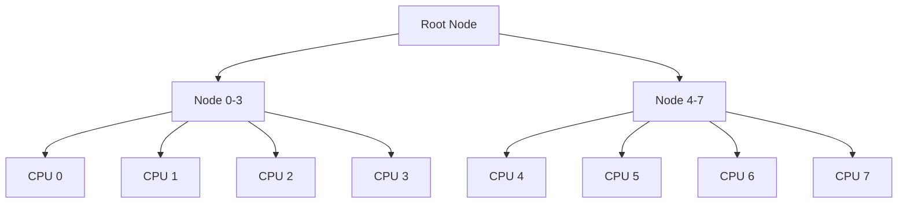

# Lock-Free Synchronization

## Overview

Lock-free data structures allow concurrent access without traditional mutual exclusion locks (mutexes, spinlocks). The Linux kernel extensively uses lock-free techniques to achieve high performance, reduce latency, and avoid problems like priority inversion and deadlock.

Key lock-free mechanisms in the kernel include **RCU** (Read-Copy-Update), **seqlocks**, **atomic operations**, and **hazard pointers**.

> **See also:** [Spinlocks](./spinlocks.md), [Mutexes](./mutexes.md), [Memory Barriers](./memory-barriers.md)

---

## RCU (Read-Copy-Update)

### Concept

RCU is a synchronization mechanism optimized for **read-heavy** workloads. Readers access shared data with zero overhead (no locks, no atomics, no memory barriers on the read side). Writers create a copy of the data, modify the copy, then atomically swap pointers.

```
Reader path:                    Writer path:
  rcu_read_lock()                 old = rcu_dereference(ptr)
  p = rcu_dereference(ptr)        new = kmalloc(...)
  use(*p)                         *new = *old
  rcu_read_unlock()               modify(new)
                                  rcu_assign_pointer(ptr, new)
                                  synchronize_rcu()  // wait for readers
                                  kfree(old)
```

### Grace Period

The **grace period** is the time between publishing new data and being sure all pre-existing readers have finished. `synchronize_rcu()` blocks until the grace period ends.

### Read-Side Critical Section

```c
rcu_read_lock();          /* Disable preemption (CONFIG_PREEMPT_RCU) */
p = rcu_dereference(ptr); /* Safe pointer read with proper ordering */
/* Use p — must not block or sleep */
rcu_read_unlock();        /* Re-enable preemption */
```

**Rules inside `rcu_read_lock()`:**
- No blocking (`mutex_lock`, `kmalloc(GFP_KERNEL)`, `sleep`)
- No calling `synchronize_rcu()` (deadlock risk)
- Preemption is disabled (non-`PREEMPT_RCU` kernels)

### Writer Side

```c
struct my_data *new, *old;

new = kmalloc(sizeof(*new), GFP_KERNEL);
*new = *old;                    /* Copy */
new->field = new_value;         /* Modify */

rcu_assign_pointer(global_ptr, new);  /* Publish with ordering */

synchronize_rcu();              /* Wait for all readers */
kfree(old);                     /* Safe to free old data */
```

### RCU Variants

| Variant                  | Context          | Blocks? |
|--------------------------|------------------|---------|
| `synchronize_rcu()`      | Process context  | Yes     |
| `call_rcu()`             | Any context      | No (async) |
| `synchronize_rcu_expedited()` | Process context | Yes (faster) |
| `kfree_rcu()`            | Any context      | No (async free) |

### RCU List API

```c
/* Add to RCU-protected list */
struct my_node *node = kmalloc(sizeof(*node), GFP_KERNEL);
node->data = value;
rcu_read_lock();
list_add_rcu(&node->list, &my_list);
rcu_read_unlock();

/* Delete from RCU-protected list */
list_del_rcu(&node->list);
synchronize_rcu();
kfree(node);

/* Traverse RCU-protected list */
rcu_read_lock();
list_for_each_entry_rcu(pos, &my_list, list) {
    /* Safe to read pos->data */
}
rcu_read_unlock();
```

### RCU Usage Examples in the Kernel

- **Routing tables** — High read rate, rare updates
- **Module list** — `list_for_each_entry_rcu()`
- **Filesystem dcache** — Path lookups
- **PID hash table** — Process lookup by PID
- **Network connection tracking** — Conntrack table
- **`struct net` namespace lookups** — Network namespace references
- **`pid_namespace` process tables** — PID-to-task mapping
- **SELinux policy** — Security policy lookups

### RCU Implementation Variants

The kernel supports multiple RCU implementations, selected via Kconfig:

| Config | Description | Use Case |
|--------|-------------|----------|
| `CONFIG_TREE_RCU` (default) | Hierarchical tree-based RCU | SMP systems, most common |
| `CONFIG_TINY_RCU` | Minimal single-CPU RCU | UP systems, embedded |
| `CONFIG_PREEMPT_RCU` | Preemptible read-side critical sections | `PREEMPT` kernels |
| `CONFIG_TASKS_RCU` | Grace periods based on voluntary context switches | Tracing, BPF |
| `CONFIG_TASKS_TRACE_RCU` | Grace periods for tracing readers | ftrace, BPF tracing |

#### Tree RCU Hierarchy

Tree RCU organizes CPUs into a tree structure to efficiently detect grace periods without a global counter:



Each node tracks whether its child CPUs have passed through a quiescent state. When all CPUs in a leaf have reported, the leaf propagates upward. When the root sees all children reported, the grace period ends. This reduces the overhead from O(N) global checks to O(log N) tree traversals.

#### Sleepable RCU (SRCU)

SRCU allows readers to sleep inside the critical section:

```c
#include <linux/srcu.h>

DEFINE_STATIC_SRCU(my_srcu);

/* Reader — can sleep! */
int idx = srcu_read_lock(&my_srcu);
/* ... may sleep, allocate with GFP_KERNEL, etc. ... */
srcu_read_unlock(&my_srcu, idx);

/* Writer */
synchronize_srcu(&my_srcu);  /* Wait for all readers */
```

**Trade-off**: SRCU has higher per-reader overhead than regular RCU (it uses per-CPU counters rather than preemption disabling), but it supports sleeping readers.

#### Tasks RCU

Tasks RCU uses voluntary context switches as quiescent states rather than context switches in `rcu_read_lock()` critical sections. This is used primarily for tracing and BPF:

```c
/* Wait for all tasks to pass through a voluntary context switch */
synchronize_rcu_tasks();
```

#### RCU Callback Offloading

On large systems, RCU callbacks (`call_rcu()`) can consume significant CPU time. The kernel supports offloading callback processing to dedicated kthreads:

```bash
# Offload RCU callbacks to kthreads on CPUs 2-7
$ echo 2-7 > /sys/module/rcupdate/parameters/rcu_nocbs
```

This is important for real-time and latency-sensitive workloads where RCU callback processing can cause unexpected latency spikes.

---

## Seqlocks

### Concept

A **seqlock** (sequence lock) allows readers to detect if a write occurred during their read. Writers increment a counter before and after modifying data. Readers check the counter—if it changed or is odd, they retry.

This is ideal for data that is **rarely written but frequently read**, and where readers can tolerate retrying.

### Implementation

```c
#include <linux/seqlock.h>

seqlock_t my_lock = __SEQLOCK_UNLOCKED(my_lock);

/* Writer */
write_seqlock(&my_lock);
/* Modify shared data */
shared_x = new_x;
shared_y = new_y;
write_sequnlock(&my_lock);

/* Reader */
unsigned int seq;
do {
    seq = read_seqbegin(&my_lock);
    x = shared_x;
    y = shared_y;
} while (read_seqretry(&my_lock, seq));
/* x and y are now consistent */
```

### Characteristics

| Property         | Seqlock                     | Spinlock                |
|------------------|-----------------------------|-------------------------|
| Reader overhead  | Near-zero (no lock acquire) | Atomic operations       |
| Writer overhead  | Light (counter increment)   | Lock acquire/release    |
| Reader fairness  | May starve under writes     | FIFO queued             |
| Data consistency | Eventually consistent       | Always consistent       |
| Reader blocking  | Never                       | Blocks on contention    |

### Use Cases in the Kernel

- **jiffies** — Timekeeping counter
- **`xtime`** — Wall clock time
- **`struct path`** mount point data
- **Network statistics** — Per-CPU counters with seqlock snapshot
- **`struct rq` runqueue clock** — Scheduler timestamp reads
- **VFS inode size** — File size reads during `stat()`

### Seqlock Performance Characteristics

Seqlocks are optimal when:
- Writers are infrequent (less than 1% of accesses)
- Read-side data is simple (a few words)
- Readers can tolerate retrying

**Read-side cost**: On x86, `read_seqbegin()` is a single `READ_ONCE()` plus a compiler barrier — essentially free. The retry loop adds a comparison per iteration. In the common case (no concurrent writer), the read completes in a few nanoseconds.

**Writer-side cost**: `write_seqlock()` is a single atomic increment plus a write barrier. On x86, this is roughly 5-10 nanoseconds. On ARM64, it involves a `DMB ISHST` barrier.

**Starvation risk**: Under heavy write load, readers can starve indefinitely. The kernel does not provide a fairness mechanism for seqlock readers. If writes are frequent, use a `rwlock` or RCU instead.

### Sequence Counters (seqcount_t)

A lighter variant without the lock component:

```c
seqcount_t my_seq = SEQCNT_ZERO(my_seq);

/* Writer */
write_seqcount_begin(&my_seq);
/* modify data */
write_seqcount_end(&my_seq);

/* Reader */
unsigned int seq;
do {
    seq = read_seqcount_begin(&my_seq);
    /* read data */
} while (read_seqcount_retry(&my_seq, seq));
```

---

## Atomic Operations

### Types

The kernel provides several categories of atomic operations:

#### Atomic Integers (`atomic_t`)

```c
#include <linux/atomic.h>

atomic_t counter = ATOMIC_INIT(0);

atomic_inc(&counter);           /* counter++ */
atomic_dec(&counter);           /* counter-- */
atomic_add(5, &counter);        /* counter += 5 */
int val = atomic_read(&counter); /* read value */
atomic_set(&counter, 10);       /* set value */

/* Conditional operations */
int old = atomic_cmpxchg(&counter, expected, new);
int old = atomic_xchg(&counter, new);
```

#### Atomic 64-bit (`atomic64_t`)

```c
atomic64_t big_counter = ATOMIC64_INIT(0);
atomic64_inc(&big_counter);
s64 val = atomic64_read(&big_counter);
```

#### Atomic Bit Operations

```c
unsigned long flags = 0;

set_bit(3, &flags);             /* Set bit 3 */
clear_bit(3, &flags);           /* Clear bit 3 */
change_bit(3, &flags);          /* Toggle bit 3 */
test_bit(3, &flags);            /* Read bit 3 */

/* Test-and-set atomically */
int was_set = test_and_set_bit(3, &flags);
```

### Memory Ordering Variants

| Variant Suffix       | Ordering Guarantee              |
|---------------------|---------------------------------|
| (none)              | Full barrier (smp_mb())         |
| `_relaxed`          | No ordering guarantee           |
| `_acquire`          | Subsequent reads/writes ordered |
| `_release`          | Prior reads/writes ordered      |
| `_return`           | Returns the old value           |

```c
/* Fully ordered */
atomic_inc(&counter);

/* Relaxed — fastest, use when ordering doesn't matter */
atomic_inc_return_relaxed(&counter);

/* Acquire-release pair for lock-free handoff */
atomic_set_release(&flag, 1);     /* Writer */
val = atomic_read_acquire(&flag); /* Reader */
```

### LL/SC vs. CAS

- **x86** uses `CMPXCHG` (Compare-And-Swap)
- **ARM** uses `LDXR`/`STXR` (Load-Linked/Store-Conditional)
- **RISC-V** uses `LR`/`SC`

The kernel abstracts these differences through `atomic_cmpxchg()`.

---

## Hazard Pointers

### Concept

Hazard pointers solve the **safe memory reclamation** problem in lock-free data structures. Before accessing a shared object, a thread publishes a **hazard pointer** to it. Reclaimers check all hazard pointers before freeing memory.

```
Thread 1:                    Thread 2:
  hp = &node                   want to free node
  publish(hp)                  check all hazard pointers
  use(node)                    node is in hp list
  clear(hp)                    defer freeing
```

### Kernel Implementation

While RCU handles most safe reclamation in the Linux kernel, hazard pointers are used in specific cases through the **HP (Hazard Pointer) API** (introduced in kernel 6.x):

```c
#include <linux/hazptr.h>

DEFINE_HAZPTR_HEAD(my_head, my_hazptr_ops);

/* Reader: protect a pointer */
struct my_node *node;
hazptr_guard_t guard;
node = hazptr_dereference(&my_head, &guard, &global_ptr);
if (node) {
    /* Safe to use node */
    hazptr_guard_fini(&guard);
}

/* Retire a node for deferred reclamation */
hazptr_retire(&my_head, node);
```

### When to Use Hazard Pointers vs. RCU

| Criterion              | RCU                         | Hazard Pointers             |
|------------------------|-----------------------------|-----------------------------|
| Reader scalability     | Excellent                   | Good                        |
| Memory overhead        | Grace period accumulation   | Bounded                     |
| Latency guarantee      | Unbounded (grace period)    | Bounded                     |
| Complexity             | Lower                       | Higher                      |
| Kernel maturity        | Decades of use              | Newer addition              |

---

## ABA Problem

### What Is It?

The ABA problem occurs when a lock-free algorithm reads a value A, then another thread changes it to B and back to A. The original thread's CAS succeeds, but the underlying state may have changed in ways the algorithm didn't expect.

```
Thread 1:                    Thread 2:
  read ptr → A                 read ptr → A
  (preempted)                  ptr → B (modify)
                               ptr → A (restore)
  CAS(ptr, A, new) succeeds
  but linked list structure
  has changed!
```

### Solutions in the Kernel

#### 1. RCU
RCU naturally prevents ABA for pointer-based structures because the grace period ensures old memory isn't reused while readers hold references.

#### 2. Tagged Pointers
Add a monotonically increasing counter to the pointer (using spare bits):

```c
/* 64-bit pointer with 16-bit tag in upper bits */
struct tagged_ptr {
    void *ptr;
    unsigned long tag;  /* Increment on every update */
};

/* CAS checks both pointer AND tag */
bool try_update(struct tagged_ptr *tp, void *expected,
                void *new_ptr) {
    unsigned long old_val = pack(tp->ptr, tp->tag);
    unsigned long new_val = pack(new_ptr, tp->tag + 1);
    return cmpxchg((unsigned long *)tp, old_val, new_val) ==
           old_val;
}
```

#### 3. Epoch-Based Reclamation
Similar to RCU but with explicit epoch counters:

```c
/* Enter critical section */
epoch_enter();
/* Access shared data */
/* ... */
epoch_exit();
/* Retire objects — only freed when no thread is in an older epoch */
epoch_retire(old_object);
```

---

## Lock-Free Patterns in the Kernel

### Lock-Free Queue: llist

The kernel `llist` provides a lock-free singly-linked list (LIFO — stack behavior) with multi-producer, single-consumer semantics:

```c
#include <linux/llist.h>

struct my_item {
    struct llist_node node;
    int data;
};

DEFINE_LLIST_HEAD(my_list);

/* Producer (any CPU, lock-free) */
void producer(struct my_item *item)
{
    llist_add(&item->node, &my_list);  /* Atomic push */
}

/* Consumer (single consumer only) */
void consumer(void)
{
    struct llist_node *entry;
    struct llist_node *tmp;

    /* llist_del_all atomically takes the entire list */
    llist_for_each_safe(entry, tmp, llist_del_all(&my_list)) {
        struct my_item *item = llist_entry(entry, struct my_item, node);
        process(item);
    }
}
```

**Key property**: `llist_add()` uses `cmpxchg` to push items onto the head. `llist_del_all()` atomically replaces the head with NULL and returns the old list. This avoids all locking on the producer side.

**Real-world use**: The IPI (Inter-Processor Interrupt) mechanism uses `llist` to batch cross-CPU function calls. Each CPU has its own `llist`, and the IPI handler drains the list:

```c
/* kernel/smp.c */
static DEFINE_PER_CPU_SHARED_ALIGNED(struct llist_head, call_single_queue);

void generic_smp_call_function_interrupt(void)
{
    struct llist_head *head = this_cpu_ptr(&call_single_queue);
    struct llist_node *entry;

    entry = llist_del_all(head);
    if (entry) {
        entry = llist_reverse_order(entry);
        llist_for_each_entry(entry, ...) {
            /* Execute queued function calls */
        }
    }
}
```

### Per-CPU Variables

The simplest lock-free technique: give each CPU its own copy.

```c
#include <linux/percpu.h>

DEFINE_PER_CPU(unsigned long, my_counter);

/* No locks needed — each CPU accesses its own copy */
this_cpu_inc(my_counter);

/* Read all CPUs' values (may be slightly stale) */
unsigned long total = 0;
for_each_possible_cpu(cpu) {
    total += per_cpu(my_counter, cpu);
}
```

### Atomic Linked Lists (Llist)

```c
#include <linux/llist.h>

DEFINE_LLIST_HEAD(my_list);

/* Add (lock-free, multiple producers) */
struct llist_node *node = ...;
llist_add(node, &my_list);

/* Delete all (single consumer) */
struct llist_node *first = llist_del_all(&my_list);
/* Process first->next chain */
```

### cmpxchg Double-Word

For atomically updating a pointer + counter pair:

```c
struct pair {
    void *ptr;
    unsigned long counter;
};

/* Atomically update both */
struct pair old = { .ptr = p, .counter = cnt };
struct pair new = { .ptr = new_p, .counter = cnt + 1 };
cmpxchg_double(&pair->ptr, &pair->counter,
                old.ptr, old.counter,
                new.ptr, new.counter);
```

---

## Performance Considerations

### Read-Side Cost Comparison

| Mechanism     | Read-Side Cost             | Best For               |
|---------------|---------------------------|------------------------|
| RCU           | Near-zero (preempt off)   | Read-mostly data       |
| Seqlock       | Zero lock + retry loop    | Rare writes, simple data|
| Hazard Ptr    | Atomic store + fence      | Bounded reclamation    |
| Atomic ops    | Single atomic instruction | Counters, flags        |
| Spinlock      | Atomic CAS + cache bounce | Moderate contention    |
| RW lock       | Atomic op for read lock   | Moderate read ratio    |

### Guidelines

1. **Read-mostly, rare updates?** → Use RCU
2. **Simple scalar data (counters)?** → Use `atomic_t`
3. **Frequent reads, rare writes, simple data?** → Use seqlock
4. **Per-CPU counters?** → Use `percpu` variables
5. **Lock-free stack/queue?** → Use `llist` or `lockfree_stack`

---

## Debugging Lock-Free Code

### Common Pitfalls

- **Missing memory barriers** — Use `smp_rmb()`, `smp_wmb()`, or the `_acquire`/`_release` variants
- **Data races under RCU** — Always use `rcu_dereference()` for reading, `rcu_assign_pointer()` for publishing
- **ABA problems** — Use tagged pointers or RCU
- **Memory leaks** — Ensure all retired objects are eventually freed

### Kernel Tools

```bash
# KCSAN (Kernel Concurrency Sanitizer) detects data races
CONFIG_KCSAN=y

# Lockdep detects potential deadlocks
CONFIG_PROVE_LOCKING=y

# KASAN detects use-after-free
CONFIG_KASAN=y
```

> **See also:** [Lockdep](./lockdep.md), [KCSAN](../debugging/kcsan.md)

---

## Further Reading

- [Linux kernel source: `include/linux/rcupdate.h`](https://elixir.bootlin.com/linux/latest/source/include/linux/rcupdate.h)
- [Linux kernel source: `include/linux/seqlock.h`](https://elixir.bootlin.com/linux/latest/source/include/linux/seqlock.h)
- [Linux kernel source: `include/linux/atomic.h`](https://elixir.bootlin.com/linux/latest/source/include/linux/atomic.h)
- [LWN: What is RCU, Fundamentally?](https://lwn.net/Articles/262464/)
- [LWN: What is RCU? Part 2: Usage](https://lwn.net/Articles/263130/)
- [LWN: Lock-free data structures](https://lwn.net/Articles/270055/)
- **Is Parallel Programming Hard, And, If So, What Can You Do About It?** — Paul E. McKenney
- [kernel.org: RCU Concepts](https://www.kernel.org/doc/html/latest/RCU/whatisRCU.html)
- [Memory Barriers: A Hardware View for Software Hackers](https://www.kernel.org/doc/html/latest/memory-barriers.txt)

> **Related topics:** [Memory Barriers](./memory-barriers.md), [Per-CPU Variables](./percpu.md), [Spinlocks](./spinlocks.md), [RCU](./rcu.md)
