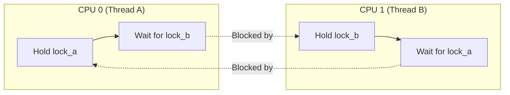
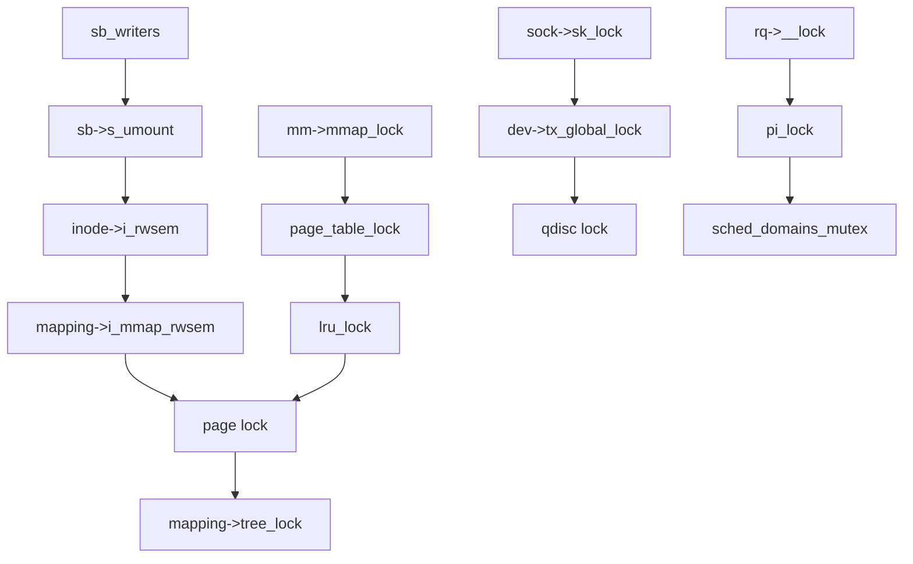
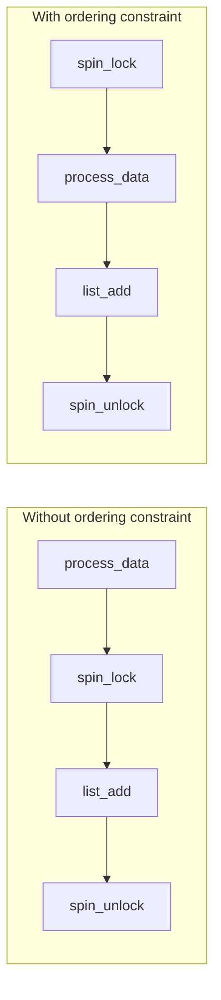

# Lock Ordering

## Introduction

Lock ordering is the discipline of acquiring multiple locks in a consistent, predefined order across all code paths in the kernel. It is the primary defense against **ABBA deadlocks** — the most common class of deadlock where two CPUs each hold one lock and wait for the other.

The Linux kernel is a massive concurrent program with thousands of locks. Without a disciplined ordering scheme, deadlocks would be inevitable. This chapter covers the theory and practice of lock ordering, the ABBA deadlock pattern, nesting rules, and the annotations that help lockdep enforce ordering at runtime.

## The ABBA Deadlock

### The Problem

When two CPUs acquire two locks in different orders, a deadlock can occur:

```c
/* Thread A (CPU 0) */
spin_lock(&lock_a);     /* Acquires A */
spin_lock(&lock_b);     /* Blocks: B held by Thread B */

/* Thread B (CPU 1) */
spin_lock(&lock_b);     /* Acquires B */
spin_lock(&lock_a);     /* Blocks: A held by Thread A */
```



Neither thread can make progress — this is a **deadlock**.

### The Solution: Consistent Ordering

Define a global ordering: **always acquire lock_a before lock_b**. If all code paths follow this rule, the deadlock cannot occur:

```c
/* Thread A (correct) */
spin_lock(&lock_a);
spin_lock(&lock_b);     /* OK: A before B matches the ordering */

/* Thread B (correct) */
spin_lock(&lock_a);     /* Acquire A first, even though we need B */
spin_lock(&lock_b);
```

## Lock Ordering Rules

### Rule 1: Establish a Global Hierarchy

Assign each lock a position in a global ordering. When acquiring multiple locks, always acquire them in increasing order:

```c
/*
 * Lock ordering:
 *   1. sb_lock (superblock lock)
 *   2. inode_lock (inode lock)
 *   3. page_lock (page lock)
 *   4. mapping->tree_lock (address space lock)
 */

/* CORRECT: acquiring in order */
spin_lock(&sb_lock);
mutex_lock(&inode_lock);
spin_lock(&page_lock);

/* WRONG: out of order — potential deadlock */
spin_lock(&page_lock);
spin_lock(&sb_lock);  /* Violates ordering: page_lock > sb_lock */
```

### Rule 2: Document the Ordering

Every lock in the kernel should have a documented position in the ordering. This is often done with comments:

```c
/*
 * Ordering:
 *   dentry->d_lock
 *   inode->i_lock
 *   inode->i_mutex
 *   sb->s_lock
 */
```

For large subsystems, the ordering documentation is maintained in a central location:

```c
/*
 * Lock Ordering for the VFS:
 *
 *   sb_writers (superblock write holders)
 *     sb->s_umount (superblock unmount)
 *       inode->i_rwsem (inode read/write semaphore)
 *         inode->i_mutex (inode mutex)
 *           mapping->i_mmap_rwsem
 *             page lock (per-page)
 *               mapping->tree_lock (xarray lock)
 */
```

### Rule 3: Never Acquire a "Higher" Lock While Holding a "Lower" Lock

```c
/* If lock_a has order 5 and lock_b has order 10: */

/* CORRECT: lower → higher */
spin_lock(&lock_a);  /* order 5 */
spin_lock(&lock_b);  /* order 10 */

/* WRONG: higher → lower */
spin_lock(&lock_b);  /* order 10 */
spin_lock(&lock_a);  /* order 5 — DEADLOCK RISK */
```

### Rule 4: Use Lock Nesting for Required Combinations

When you need both locks but the natural ordering doesn't match your code structure, restructure to acquire locks in the correct order:

```c
/* You need both inode->i_mutex and page lock, but the ordering
 * requires inode->i_mutex first */

/* CORRECT */
mutex_lock(&inode->i_mutex);
spin_lock(&mapping->tree_lock);
/* ... */
spin_unlock(&mapping->tree_lock);
mutex_unlock(&inode->i_mutex);
```

### Rule 5: Use Subclasses for Same-Class Nesting

When you need to acquire multiple instances of the same lock class (e.g., locking two inodes), use lockdep subclasses to distinguish the nesting level:

```c
/* Lock two inodes in parent-first order */
mutex_lock_nested(&parent->i_mutex, I_MUTEX_PARENT);
mutex_lock_nested(&child->i_mutex, I_MUTEX_CHILD);
/* ... */
mutex_unlock(&child->i_mutex);
mutex_unlock(&parent->i_mutex);
```

Without the `_nested` suffix, lockdep would warn about a recursive lock acquisition. The subclass tells lockdep that this is intentional nesting of the same lock class.

## Lock Classes

The kernel uses **lock classes** to track ordering relationships. Multiple lock instances can share the same class if they have the same ordering constraints:

```c
/* All inodes share the same lock class for i_mutex */
struct inode {
    struct mutex i_mutex;  /* Same class for all inodes */
};

/* But inode->i_mutex and sb->s_lock are different classes */
```

Lockdep tracks ordering between classes, not individual lock instances. This prevents false positives when two locks of the same class are acquired in different orders (which is fine — they're the same type and the same task can't hold two instances simultaneously in a conflicting way).

### Lockdep Annotations

```c
/* Define a lock class explicitly */
spin_lock_init(&my_lock);
lockdep_set_class(&my_lock, &my_lock_class);

/* Or for spinlocks with static initialization */
DEFINE_SPINLOCK(my_lock);

/* Subclass: allows multiple instances of the same class
 * to be nested (e.g., multiple inode locks) */
mutex_lock_nested(&inode->i_mutex, I_MUTEX_PARENT);
mutex_lock_nested(&child_inode->i_mutex, I_MUTEX_CHILD);
```

## Common Lock Ordering in Linux

### VFS (Virtual File System) Ordering

The VFS layer has one of the most complex lock ordering hierarchies in the kernel:

```
1. sb_writers (superblock write holders)
2. sb->s_umount (superblock unmount)
3. inode->i_rwsem (inode read/write semaphore)
4. inode->i_mutex (inode mutex — legacy name)
5. mapping->i_mmap_rwsem
6. page lock (per-page)
7. mapping->tree_lock (xarray lock)
```

**Real-world example**: When creating a file, the kernel acquires `sb->s_umount` (to prevent unmount), then `inode->i_rwsem` (to protect the directory), then the page lock (to modify directory entries). If any of these were acquired out of order, deadlock could occur.

### Memory Management Ordering

The memory management subsystem has its own lock hierarchy:

```
1. mm->mmap_lock (mmap semaphore — protects VMA tree)
2. mm->page_table_lock (page table spinlock)
3. lru_lock (per-zone LRU lock)
4. page lock
5. mapping->tree_lock (xarray lock)
```

**Key constraint**: `mmap_lock` must always be acquired before `page_table_lock`. This is because page fault handling needs both — it reads the VMA tree (under `mmap_lock`) then modifies page tables (under `page_table_lock`).

### Networking Ordering

```
1. sock->sk_lock (socket lock)
2. net->packet.sklist_lock
3. dev->tx_global_lock
4. qdisc lock
5. netfilter hooks
```

The socket lock (`sk_lock`) is the highest-level lock in networking. It protects the socket's send/receive buffers and state. Lower-level locks (device TX locks, qdisc locks) are acquired while holding `sk_lock`.

### Block I/O Ordering

```
1. q->sysfs_lock (queue sysfs)
2. q->queue_lock (queue lock)
3. bio->bi_lock
4. page lock
```

### Scheduler Ordering

```
1. rq->__lock (runqueue lock)
2. pi_lock (per-task priority inheritance lock)
3. sched_domains_mutex
4. cgroup_lock
```

The runqueue lock is the most contended lock in the scheduler. It must be acquired before `pi_lock` to prevent priority inversion deadlocks.

### Lock Ordering Diagram



## Practical Examples

### Example 1: Transfer Between Two Lists

When you need to move an item between two lists protected by different locks:

```c
/* WRONG: potential ABBA deadlock */
spin_lock(&list_a_lock);
spin_lock(&list_b_lock);  /* If another thread does list_b → list_a, DEADLOCK */
list_move(&entry->list, &list_b);
spin_unlock(&list_b_lock);
spin_unlock(&list_a_lock);

/* CORRECT: always acquire in same order */
if (&list_a_lock < &list_b_lock) {
    spin_lock(&list_a_lock);
    spin_lock(&list_b_lock);
} else {
    spin_lock(&list_b_lock);
    spin_lock(&list_a_lock);
}
list_move(&entry->list, &list_b);
spin_unlock(&list_b_lock);
spin_unlock(&list_a_lock);

/* BETTER: use a dedicated ordering or double-locked helper */
spin_lock(&list_a_lock);
spin_lock(&list_b_lock);  /* Safe because ordering is enforced by convention */
```

### Example 2: Lock Ordering with trylock

When the natural ordering doesn't match your code, use `trylock` to avoid blocking:

```c
/* You need lock_b but already hold lock_a (wrong order) */
spin_lock(&lock_a);

if (spin_trylock(&lock_b)) {
    /* Got both locks */
    /* ... */
    spin_unlock(&lock_b);
} else {
    /* Can't get lock_b without violating ordering */
    spin_unlock(&lock_a);

    /* Acquire in correct order */
    spin_lock(&lock_b);
    spin_lock(&lock_a);
    /* ... */
    spin_unlock(&lock_a);
    spin_unlock(&lock_b);
}
```

### Example 3: Hierarchical Locking (Tree Structures)

When locking a tree, always lock from root to leaf:

```c
void lock_tree_path(struct tree_node *leaf)
{
    struct tree_node *node;
    struct tree_node *path[MAX_DEPTH];
    int depth = 0;

    /* Build path from leaf to root */
    for (node = leaf; node; node = node->parent)
        path[depth++] = node;

    /* Lock from root to leaf */
    while (--depth >= 0)
        mutex_lock(&path[depth]->lock);
}
```

## The trylock Escape Hatch

When you cannot determine the ordering at compile time, `trylock` provides a deadlock-free way to attempt acquisition:

```c
/* Lock-free attempt pattern */
retry:
    spin_lock(&known_lock);

    if (!spin_trylock(&unknown_order_lock)) {
        spin_unlock(&known_lock);
        /* Maybe yield or back off */
        cpu_relax();
        goto retry;
    }

    /* Got both locks */
    /* ... */
    spin_unlock(&unknown_order_lock);
    spin_unlock(&known_lock);
```

**Warning**: This pattern can livelock if both sides retry indefinitely. Use it sparingly and consider if a better ordering exists.

## Lock Ordering and Performance

Lock ordering constraints can sometimes force you to acquire locks earlier than necessary, increasing hold times:

```c
/* Ideal: acquire lock only when needed */
process_data(data);
spin_lock(&lock);
list_add(&data->list, &my_list);
spin_unlock(&lock);

/* Required by ordering: acquire earlier */
spin_lock(&lock);        /* Acquired earlier than needed */
process_data(data);      /* Hold time increased */
list_add(&data->list, &my_list);
spin_unlock(&lock);
```

To mitigate this:
1. **Restructure code** to match the ordering naturally
2. **Split locks** into finer-grained locks with compatible ordering
3. **Use lock-free approaches** (RCU, atomics) where possible
4. **Use trylock** to avoid blocking when the ordering is ambiguous

### Lock Ordering Overhead Analysis



The ordering constraint increases lock hold time by the duration of `process_data()`. If `process_data()` takes 1µs and the lock is contended by 8 CPUs, this adds 8µs of cumulative wait time.

### Mitigation Strategies

| Strategy | Trade-off |
|----------|----------|
| Restructure code | Best solution, but may require significant refactoring |
| Split locks | Reduces contention but adds complexity |
| Lock-free (RCU) | Eliminates lock hold time entirely, but limited to read-mostly patterns |
| Trylock + retry | Avoids blocking but may livelock under high contention |
| Per-CPU locks | Eliminates cross-CPU contention but complicates global reads |

## Debugging Ordering Violations

### Lockdep (Runtime)

Lockdep automatically detects ordering violations at runtime. See [Lockdep](lockdep.md).

Lockdep works by:
1. Tracking the order in which locks are acquired
2. Building a directed graph of lock dependencies
3. Detecting cycles in the graph (which indicate potential deadlocks)
4. Warning immediately when a cycle is created (not when deadlock actually occurs)

```
=============================================
WARNING: possible circular locking dependency detected
6.x.x #1 Not tainted
---------------------------------------------
touch/1234 is trying to acquire lock:
 ffff888012345678 (&mm->mmap_lock){++++}-{3:3}, at: do_page_fault+0x.../0x...

but task is already holding lock:
 ffff888087654321 (&sb->s_umount){++++}-{3:3}, at: iterate_supers+0x.../0x...

which lock already depends on the new lock.

the existing dependency chain (new -> existing) is:
 -> &mm->mmap_lock {++++} ...
 -> &sb->s_umount {++++} ...

Possible unsafe locking scenario:

        CPU0                    CPU1
        ----                    ----
   lock(&sb->s_umount);
                                lock(&mm->mmap_lock);
                                lock(&sb->s_umount);
   lock(&mm->mmap_lock);

 *** DEADLOCK ***
```

### Manual Documentation

Maintain a lock ordering document for your subsystem:

```c
/*
 * Lock Ordering for my_subsystem:
 *
 *   1. subsystem_mutex (global subsystem lock)
 *   2. device->dev_lock (per-device lock)
 *   3. queue->q_lock (per-queue lock)
 *   4. buffer->buf_lock (per-buffer lock)
 *
 * Rules:
 *   - Never acquire a higher-numbered lock while holding a lower one
 *   - If you need both device->dev_lock and queue->q_lock,
 *     always acquire device->dev_lock first
 */
```

### Sparse Annotations

The `sparse` static checker can identify some lock ordering issues, though it's less capable than lockdep:

```c
/* __acquires() and __releases() annotations */
void __acquires(rcu) rcu_read_lock(void);
void __releases(rcu) rcu_read_unlock(void);
```

### Lockdep Subclass Annotations

When the same lock class must be acquired multiple times (e.g., locking parent and child inodes), use subclasses:

```c
/* Define custom lock classes */
enum my_lock_class {
    LOCK_CLASS_NORMAL = 0,
    LOCK_CLASS_PARENT = 1,
    LOCK_CLASS_CHILD = 2,
};

/* Acquire with explicit subclass */
mutex_lock_nested(&parent->lock, LOCK_CLASS_PARENT);
mutex_lock_nested(&child->lock, LOCK_CLASS_CHILD);
```

Lockdep uses the subclass to distinguish different nesting patterns. Without it, acquiring two locks of the same class would trigger a false positive warning.

### Lockdep Coverage Report

Lockdep tracks which lock ordering relationships have been exercised:

```bash
# View lockdep coverage
$ cat /proc/lock_stat
# Shows all lock classes and their ordering relationships

# Check for untested orderings
$ sudo grep -A5 'INIT' /proc/lock_stat
```

## Advanced: Lock Inversion

Lock inversion is a subtle form of ordering violation where the ordering depends on runtime values:

```c
/* Thread A: lock(parent) then lock(child) */
mutex_lock(&parent->lock);
mutex_lock(&child->lock);  /* child is child of parent */

/* Thread B: lock(some_node) then lock(parent) */
mutex_lock(&some_node->lock);
mutex_lock(&parent->lock);
/* If some_node == child, this is an inversion! */
```

Lockdep detects this by tracking the ordering graph. The solution is to use **lockdep subclasses** to distinguish between different nesting levels:

```c
mutex_lock_nested(&parent->lock, SINGLE_DEPTH_NESTING);
mutex_lock_nested(&child->lock, DOUBLE_DEPTH_NESTING);
```

## Lock Statistics (lockstat)

The kernel provides **lock statistics** (`lockstat`) to diagnose lock contention and hold times at runtime. This is invaluable for identifying performance bottlenecks caused by locks.

### How lockstat Works

Lockdep already hooks into lock acquisition functions and maps lock instances to lock classes. Lockstat builds on these hooks to collect timing and contention data:

```
 __acquire
 |
 lock _____
 | \
 | __contended
 | |
 | <wait>
 | _______/
|/ 
|
 __acquired
|
 .
 <hold>
 .
|
 __release
|
 unlock
```

### Statistics Collected

Per lock class, lockstat tracks:

| Metric | Description |
|--------|-------------|
| **con-bounces** | Number of contentions involving cross-CPU data |
| **contentions** | Number of acquisitions that had to wait |
| **wait time (min/max/total/avg)** | Time spent waiting for the lock (µs) |
| **acq-bounces** | Number of acquisitions involving cross-CPU data |
| **acquisitions** | Number of times the lock was taken |
| **hold time (min/max/total/avg)** | Time the lock was held (µs) |

It also tracks **4 contention points per class** — call sites that had to wait on lock acquisition.

### Configuration and Usage

```bash
# Enable lockstat (requires CONFIG_LOCK_STAT)
$ echo 1 > /proc/sys/kernel/lock_stat

# View lock statistics
$ cat /proc/lock_stat
# lock_stat version 0.4
# class name     con-bounces  contentions  waittime-min  waittime-max  ...
# &mm->mmap_sem-W:    46         84         0.26        939.10       ...
# &mm->mmap_sem-R:    37        100         1.31     299502.61       ...

# View top contending locks
$ grep : /proc/lock_stat | head
# clockevents_lock: 2926159 2947636 0.15 46882.81 ...
# &mapping->i_mmap_mutex: 203896 203899 3.36 645530.05 ...

# Clear statistics
$ echo 0 > /proc/lock_stat

# Disable collection
$ echo 0 > /proc/sys/kernel/lock_stat
```

### Interpreting lockstat Output

The output has two parts separated by a dashed line: **acquisition statistics** (top) and **contention points** (bottom). The contention points show both the code trying to acquire the lock and the code holding it:

```
&mm->mmap_sem-W: 46 84 0.26 939.10 16371.53 194.90 47291 2922365 ...
---------------
&mm->mmap_sem 1 [<ffffffff811502a7>] khugepaged_scan_mm_slot+0x57/0x280
&mm->mmap_sem 96 [<ffffffff815351c4>] __do_page_fault+0x1d4/0x510
```

- Line 1: Wait statistics for `mmap_sem` (write mode) — 84 contentions, avg wait 194.90µs
- Lines 3-6: Code locations where contention occurred (the acquirers)
- Lines 8-11: Code locations that were holding the lock during contention

### Nested Lock Subclasses

For locks acquired multiple times in nested fashion, lockstat shows separate entries with `/N` suffixes:

```
&rq->lock:   13128 13128 0.43 190.53 ...   # Base class
&rq->lock/1:  1526 11488 0.33 388.73 ...   # Subclass 1 (nested)
```

## References

- [The Linux Kernel Documentation](https://docs.kernel.org/)
- [GNU Project Documentation](https://www.gnu.org/doc/doc.html)
- [GNU Manuals](https://www.gnu.org/manual/manual.html)
- [Free Software Directory](https://directory.fsf.org/wiki/Main_Page)
- [Planet GNU](https://planet.gnu.org/)
- [Free Software Books](https://www.gnu.org/doc/other-free-books.html)

- [Linux Kernel Documentation: Lock ordering](https://www.kernel.org/doc/html/latest/locking/lockdep-design.html)
- [Jonathan Corbet: "Locking patterns"](https://lwn.net/Articles/185667/)
- [Paul McKenney: "Lockdep: the Linux lock validator"](https://lwn.net/Articles/185500/)
- [Robert Love: "Linux Kernel Development" — Chapter 10: Kernel Synchronization](https://www.oreilly.com/library/view/linux-kernel-development/9780768696974/)
- [Kernel documentation: Lock Statistics](https://docs.kernel.org/locking/lockstat.html)

## Related Topics

- [Synchronization Overview](overview.md) — When and why locks are needed
- [Lockdep](lockdep.md) — Runtime lock dependency validator
- [Spinlocks](spinlocks.md) — Busy-wait locks
- [Mutexes](mutexes.md) — Sleeping locks
- [RCU](rcu.md) — Lock-free read-side synchronization
