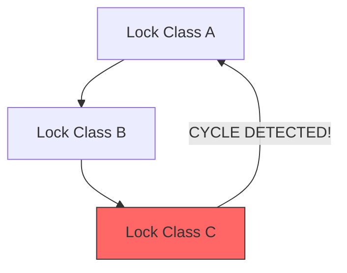

# Lockdep: Runtime Lock Dependency Validator

## Introduction

Lockdep (lock dependency validator) is one of the most sophisticated debugging tools in the Linux kernel. It is a **runtime validator** that detects potential deadlocks by tracking the ordering relationships between locks. Unlike static analysis tools, lockdep instruments every lock acquisition and release at runtime, building a dependency graph that reveals ordering violations even when the specific interleaving that would cause a deadlock hasn't occurred yet.

Lockdep was created by Ingo Molnár and first merged in Linux 2.6.18. It has prevented countless deadlocks in the kernel and is an essential tool for kernel developers working with concurrent code.

## How Lockdep Works

### The Core Idea

Lockdep doesn't wait for deadlocks to happen. Instead, it builds a **lock dependency graph** at runtime. Every time a task acquires lock B while already holding lock A, lockdep records the dependency "A → B" (A must be acquired before B). If at any point it detects a cycle in this graph (e.g., A → B → C → A), it reports a potential deadlock — even if the specific code paths that would trigger it haven't executed simultaneously.

### Lock Classes

Lockdep operates on **lock classes**, not individual lock instances. A lock class represents a "type" of lock — all locks created at the same code location with the same call site belong to the same class. This is essential because the kernel has thousands of lock instances (one per inode, one per task, etc.), and tracking individual instances would be impractical.

```c
/* All inodes share the same lock class for i_mutex */
struct inode {
    struct mutex i_mutex;  /* All instances: same class */
};

/* But inode->i_mutex and sb->s_lock are different classes */
```

### Dependency Graph



When lockdep detects a cycle, it reports the full chain of dependencies.

## Enabling Lockdep

### Kernel Configuration

```
CONFIG_PROVE_LOCKING=y      # Lockdep runtime validation
CONFIG_DEBUG_LOCK_ALLOC=y   # Lock allocation debugging
CONFIG_LOCKDEP=y            # Lock dependency validator
CONFIG_DEBUG_LOCKDEP=y      # Extra lockdep debugging
CONFIG_LOCK_STAT=y          # Lock contention statistics
```

These options significantly increase kernel size and runtime overhead — do NOT enable in production kernels.

### Boot-Time Verification

After booting a lockdep-enabled kernel, check:

```bash
$ dmesg | grep -i lockdep
[    0.000000] Lock dependency validator: Copyright (c) 2006 Red Hat, Inc., Ingo Molnar
[    0.000000] ... MAX_LOCKDEP_ENTRIES: 8192
[    0.000000] ... MAX_LOCKDEP_CHAINS: 16384
[    0.000000] ... MAX_LOCKDEP_KEYS: 8192
[    0.000000] ... MAX_LOCKDEP_TRACEPOINTS: 16384
```

## Lockdep Output

When lockdep detects a problem, it prints a detailed report. Here's an example of an ABBA deadlock detection:

```
======================================================
WARNING: possible circular locking dependency detected
5.15.0 #1 Not tainted
------------------------------------------------------
test_program/1234 is trying to acquire lock:
ffff888012345678 (&lock_a){+.+.}-{3:3}, at: function_b+0x23/0x45

but task is already holding lock:
ffff88809abcdef0 (&lock_b){+.+.}-{3:3}, at: function_a+0x12/0x34

which lock already depends on the new lock.

the existing dependency chain (in reverse order) is:

-> #1 (&lock_b){+.+.}-{3:3}:
       lock_acquire+0x123/0x456
       __mutex_lock+0x78/0xabc
       mutex_lock_nested+0x34/0x56
       function_b+0x23/0x45

-> #0 (&lock_a){+.+.}-{3:3}:
       lock_acquire+0x123/0x456
       __mutex_lock+0x78/0xabc
       mutex_lock_nested+0x34/0x56
       function_a+0x12/0x34

other info that might help us debug this:

Possible unsafe locking scenario:

       CPU0                    CPU1
       ----                    ----
  lock(&lock_b);
                               lock(&lock_a);
                               lock(&lock_b);
  lock(&lock_a);

 *** DEADLOCK ***

2 locks held by test_program/1234:
 #0: ffff88809abcdef0 (&lock_b){+.+.}-{3:3}, at: function_a+0x12/0x34
 #1: ffff888012345678 (&lock_a){+.+.}-{3:3}, at: function_b+0x23/0x45
```

### Reading the Output

The key elements of a lockdep report:

1. **"possible circular locking dependency detected"** — The headline
2. **The dependency chain**: Shows the ordering violation (lock_a → lock_b vs lock_b → lock_a)
3. **"Possible unsafe locking scenario"**: Shows the interleaving that would cause deadlock
4. **"locks held"**: Shows which locks the current task holds
5. **Stack traces**: Show exactly where each lock was acquired

### Lock State Annotations

The `{+.+.}-{3:3}` notation encodes lock state:

```
First character: lock is being acquired
  .  = spinlock
  -  = read-lock
  +  = write-lock
  ?  = unknown

Second set: lock is held
  Same notation

Numbers: lock class index
```

## Lockdep Annotations

### Nested Locks (Subclasses)

When acquiring multiple locks of the same class (e.g., multiple inode locks), use subclasses to prevent false positives:

```c
/* Correct: using nested subclasses */
mutex_lock_nested(&parent->i_mutex, I_MUTEX_PARENT);
mutex_lock_nested(&child->i_mutex, I_MUTEX_CHILD);

/* Without subclass, lockdep would warn about same-class nesting */
```

The subclass tells lockdep "this is expected nesting of the same lock class" and allows up to 8 levels of nesting.

### Cross-Release Annotations

For cases where locks are acquired and released in different contexts:

```c
/* Acquire in one context */
lock_acquire(&my_lock.dep_map, subclass, 0, 1, 1, NULL, _RET_IP_);

/* Release in different context */
lock_release(&my_lock.dep_map, _RET_IP_);
```

### Conditional Lock Annotations

For locks that may or may not be held:

```c
/* Tell lockdep that this lock is optional */
lock_acquire(&my_lock.dep_map, 0, 1, 0, 1, NULL, _RET_IP_);

/* Or use lock_contended/lock_acquired for fine-grained tracking */
```

### RCU Annotations

Lockdep tracks RCU read-side critical sections:

```c
rcu_read_lock();
/* lockdep records: RCU read-side dependency */
rcu_dereference(ptr);
rcu_read_unlock();
```

### Wait/Completion Annotations

```c
/* Annotate completion variable */
init_completion(&my_completion);

/* lockdep tracks dependencies through completions */
wait_for_completion(&my_completion);
complete(&my_completion);
```

## Lock Classes

### Static Lock Classes

Most locks get their class from the call site of `spin_lock_init()` or `mutex_init()`:

```c
void my_init(void)
{
    spin_lock_init(&my_lock);
    /* Lock class is determined by the call site address */
}
```

### Explicit Lock Classes

For dynamic structures where multiple instances should share a class:

```c
static struct lock_class_key my_key;

void my_init(struct my_struct *s)
{
    spin_lock_init(&s->lock);
    lockdep_set_class(&s->lock, &my_key);
}
```

### Named Lock Classes

For better debugging output:

```c
static struct lock_class_key my_key;

lockdep_set_class_and_name(&my_lock, &my_key, "my_lock_class");
/* Now lockdep reports will show "my_lock_class" instead of an address */
```

## Lockdep and Different Lock Types

### Spinlocks

```c
spin_lock(&my_lock);
/* lockdep: acquires spinlock class, tracks ordering */
spin_unlock(&my_lock);
```

### Mutexes

```c
mutex_lock(&my_mutex);
/* lockdep: acquires mutex class, tracks ordering, checks for sleeping */
mutex_unlock(&my_mutex);
```

### RCU

```c
rcu_read_lock();
/* lockdep: marks RCU read-side */
rcu_read_unlock();
```

### rwlocks and rwsems

```c
read_lock(&my_rwlock);
/* lockdep: tracks read-side dependency */
read_unlock(&my_rwlock);

write_lock(&my_rwlock);
/* lockdep: tracks write-side dependency (different from read-side) */
write_unlock(&my_rwlock);
```

### seqlocks

The spinlock portion of seqlock is tracked by lockdep. The read-side is lockless and invisible.

## False Positives and Limitations

### False Positive Scenarios

Lockdep can report false positives in certain situations:

1. **Same class, different instances**: Lockdep treats all locks of the same class as potentially conflicting. If two different instances of the same class are never held simultaneously, lockdep may still warn.

2. **Interrupt context warnings**: If a lock is used in both process and interrupt context, lockdep may warn about potential deadlocks that cannot actually occur due to specific CPU affinity.

3. **Conditional locking**: If the ordering violation only occurs under specific conditions that lockdep cannot track, it may warn unnecessarily.

### Handling False Positives

```c
/* Use subclass to differentiate instances */
mutex_lock_nested(&lock1, SINGLE_DEPTH_NESTING);
mutex_lock_nested(&lock2, DOUBLE_DEPTH_NESTING);

/* Or use a separate lock class */
lockdep_set_class(&lock1, &class1);
lockdep_set_class(&lock2, &class2);
```

### Limitations

- **Runtime only**: Lockdep only validates orderings that actually occur at runtime. If an ordering violation path exists but is never executed, lockdep won't detect it.
- **Performance**: Lockdep adds significant overhead (10-100x slower lock operations). Not suitable for production.
- **Memory**: Lockdep has fixed-size hash tables. On systems with many lock classes, it can run out of space.
- **Single-threaded validation**: Lockdep validates that orderings are consistent globally, but doesn't actually run multiple threads simultaneously to trigger deadlocks.

## Lock Statistics

### /proc/lock_stat

With `CONFIG_LOCK_STAT=y`, the kernel tracks lock contention:

```bash
$ sudo cat /proc/lock_stat
lock_name    <hold time>                <contention>            <wait time>
             min    max    total  cnt   min  max  total  cnt    min  max  total  cnt
my_lock:     0.12   45.6   1234.5  789  1.2  34.5  678.9  45    0.5  23.4  123.4  45
```

Interpreting the columns:

- **hold time**: How long the lock was held (nanoseconds)
- **contention**: How many times the lock was contended
- **wait time**: How long tasks waited for the lock

### Interpreting Lock Statistics

```bash
# Sort by contention count
$ sudo cat /proc/lock_stat | sort -t: -k4 -n -r | head -10

# Find the most contended locks
$ sudo cat /proc/lock_stat | awk -F: '{print $1, $4}' | sort -k2 -n -r | head
```

High contention numbers indicate locks that may benefit from:
1. Finer-grained locking
2. Lock-free alternatives (RCU, atomics)
3. Lock splitting
4. Reducing critical section length

## Debugging with Lockdep

### Tracing Lock Acquisitions

```bash
# Enable lockdep trace events
$ echo 1 > /sys/kernel/debug/tracing/events/lock/enable

# Watch lock acquisitions
$ cat /sys/kernel/debug/tracing/trace_pipe
  test-1234  [000] d..1  1234.567: lock_acquire: ... &my_lock
  test-1234  [000] d..1  1234.568: lock_release: ... &my_lock
```

### Self-Test

```bash
# Run lockdep self-tests (on boot with CONFIG_DEBUG_LOCKING_API_SELFTESTS=y)
$ sudo dmesg | grep "Locking API"
```

### Triggering Lockdep on Demand

```c
/* In your code, add a lockdep assertion */
lockdep_assert_held(&my_lock);

/* Check if a lock is held */
if (lockdep_is_held(&my_lock)) {
    /* Lock is held — safe to access protected data */
}

/* Warn if lockdep is not enabled */
lockdep_assert_held_write(&my_rwsem);
```

## Lockdep Validation Rules

Lockdep enforces several classes of validation rules beyond simple cycle detection:

### Single-Lock State Rules

For any single lock class, the following states are mutually exclusive:

- **hardirq-safe** vs **hardirq-unsafe** — if a lock is ever acquired in hardirq context, it must never be acquired with hardirqs enabled (and vice versa)
- **softirq-safe** vs **softirq-unsafe** — same rule for softirq context

A softirq-unsafe lock is automatically treated as hardirq-unsafe as well. When a lock class changes state, lockdep retroactively validates that no conflicting usage exists in its history.

### Multi-Lock Dependency Rules

- **No lock recursion** — the same lock class must not be acquired twice
- **No lock inversion** — if dependency A → B exists, acquiring B while holding A is forbidden
- **IRQ context mixing** — `<hardirq-safe> → <hardirq-unsafe>` dependency is forbidden
- **Softirq context mixing** — `<softirq-safe> → <softirq-unsafe>` dependency is forbidden

### Lock State Annotation Characters

The `{+.+.}` notation in lockdep reports encodes IRQ context:

| Character | Meaning |
|-----------|--------|
| `.` | Acquired with IRQs disabled, not in IRQ context |
| `-` | Acquired in IRQ context |
| `+` | Acquired with IRQs enabled |
| `?` | Acquired in IRQ context with IRQs enabled (impossible) |

Bit positions from left to right: hardirq-context write-lock, read-lock, softirq-context write-lock, read-lock.

### Dependency Graph Search

Each lock class maintains a list of forward dependencies (locks that must be acquired after it). Lockdep performs a **breadth-first search** from each newly added dependency to detect cycles. The BFS distance is recorded so that reports can show the shortest dependency chain.

```c
/* kernel/locking/lockdep.c — cycle detection */
static int check_noncircular(struct lock_class *prev,
                              struct lock_class *next,
                              struct lock_list **chain_out)
{
    /* BFS from next to prev; if prev is reachable, cycle exists */
    return check_path(prev, &next->locks_after, chain_out);
}
```

### Chain Key Hashing

Each lock chain (the set of currently held locks) is hashed to a **chain key** for fast repeated-chain detection:

```c
#define MAX_LOCKDEP_CHAINS 16384
static struct lock_chain lock_chains[MAX_LOCKDEP_CHAINS];
```

When a chain key matches an existing entry, lockdep skips the full validation — the chain has already been checked.

## Lockdep Internals

### Lock Classes Hash Table

Lockdep uses a hash table to track lock classes:

```c
#define MAX_LOCKDEP_KEYS 8192

static struct lock_class lock_classes[MAX_LOCKDEP_KEYS];
static int nr_lock_classes;
```

### Dependency Graph

Each lock class maintains a list of dependencies (locks that must be acquired before it):

```c
struct lock_list {
    struct list_head entry;
    struct lock_class *class;
    unsigned int distance;  /* BFS distance from source */
};
```

Lockdep performs a BFS (breadth-first search) from each newly added dependency to detect cycles.

### Chain Key

Each lock chain (sequence of held locks) is hashed to detect repeated chains:

```c
#define MAX_LOCKDEP_CHAINS 16384

static struct lock_chain lock_chains[MAX_LOCKDEP_CHAINS];
```

## Best Practices

1. **Always run lockdep during development** — It catches deadlocks before they happen in production.
2. **Use `lockdep_set_class()`** for dynamic lock instances that need separate classes.
3. **Annotate nested locks** with `mutex_lock_nested()` or `spin_lock_nested()`.
4. **Review lockdep warnings carefully** — Most are real bugs, but some are false positives.
5. **Don't suppress warnings** without understanding the dependency chain.
6. **Document lock ordering** alongside lockdep annotations.
7. **Run lockdep with your test suite** — Coverage of lock ordering paths is as important as code coverage.

## Enabling Lockdep in Practice

### Development Kernel Config

```
# .config fragment for maximum lock debugging
CONFIG_PROVE_LOCKING=y
CONFIG_DEBUG_LOCK_ALLOC=y
CONFIG_LOCKDEP=y
CONFIG_DEBUG_LOCKDEP=y
CONFIG_LOCK_STAT=y
CONFIG_DEBUG_ATOMIC_SLEEP=y
CONFIG_DEBUG_SPINLOCKS=y
CONFIG_DEBUG_MUTEXES=y
CONFIG_DEBUG_RT_MUTEXES=y
CONFIG_DEBUG_WW_MUTEX_SLOWPATH=y
CONFIG_DEBUG_LOCKING_API_SELFTESTS=y
```

### Runtime Control

```bash
# Enable/disable lockdep at runtime (if CONFIG_LOCKDEP=y)
$ echo 0 > /proc/sys/kernel/lock_stat

# Lock statistics reset
$ echo 0 > /proc/lock_stat
```

## Lockdep State Tracking Details

Lockdep tracks lock usage across different IRQ contexts and maintains a detailed state machine for each lock class. The state annotation format in lockdep reports encodes this information compactly.

### State Categories

Lockdep divides lock usage into categories based on IRQ context:

- **hardirq-safe**: Lock was ever acquired in hardirq context
- **hardirq-unsafe**: Lock was ever acquired with hardirqs enabled
- **softirq-safe**: Lock was ever acquired in softirq context
- **softirq-unsafe**: Lock was ever acquired with softirqs enabled

The following states must be mutually exclusive for any lock class:

```
<hardirq-safe> or <hardirq-unsafe>
<softirq-safe> or <softirq-unsafe>
```

A softirq-unsafe lock is automatically hardirq-unsafe as well.

### State Annotation Characters

The `{+.+.}` notation in lockdep reports encodes IRQ state:

| Character | Meaning |
|-----------|--------|
| `.` | Acquired with IRQs disabled, not in IRQ context |
| `-` | Acquired in IRQ context |
| `+` | Acquired with IRQs enabled |
| `?` | Acquired in IRQ context with IRQs enabled (impossible state) |

For a given lock, bit positions from left to right indicate:
1. hardirq context (write-lock)
2. hardirq context (read-lock)
3. softirq context (write-lock)
4. softirq context (read-lock)

### Multi-Lock Dependency Rules

In addition to single-lock state rules, lockdep enforces multi-lock dependencies:

- **No lock recursion**: The same lock class must not be acquired twice
- **No lock inversion**: If L1 → L2 exists, L2 → L1 is forbidden
- **IRQ context mixing**: `<hardirq-safe> → <hardirq-unsafe>` is forbidden
- **Softirq context mixing**: `<softirq-safe> → <softirq-unsafe>` is forbidden

When a lock class changes state, lockdep retroactively checks:
- If a new hardirq-safe lock was previously used with hardirq-unsafe locks
- If a new softirq-safe lock was previously used with softirq-unsafe locks
- If a new hardirq-unsafe lock was previously used by hardirq-safe locks
- If a new softirq-unsafe lock was previously used by softirq-safe locks

### Nested Lock Annotations

When acquiring multiple instances of the same lock class, use subclasses to prevent false positives:

```c
/* Use lockdep_set_class() for dynamic structures */
lockdep_set_class(&inode1->i_mutex, &inode1_lock_class);
lockdep_set_class(&inode2->i_mutex, &inode2_lock_class);

/* Or use nested annotations */
mutex_lock_nested(&child->i_mutex, I_MUTEX_PARENT);
```

The subclass mechanism allows up to 8 nesting levels (MAX_LOCKDEP_SUBCLASSES).

### Recursive Read Lock Detection

Lockdep handles recursive read locks specially. A read-lock can be acquired multiple times without deadlock, but lockdep must still detect potential deadlocks between read and write locks.

For rwlocks, lockdep tracks:
- Read-side dependencies separately from write-side
- Recursive read locks are allowed (no false positives)
- But read → write ordering violations are still detected

## References

- [The Linux Kernel Documentation](https://docs.kernel.org/)
- [GNU Project Documentation](https://www.gnu.org/doc/doc.html)
- [Kernel documentation: Runtime locking correctness validator](https://docs.kernel.org/locking/lockdep-design.html)
- [GNU Manuals](https://www.gnu.org/manual/manual.html)
- [Free Software Directory](https://directory.fsf.org/wiki/Main_Page)
- [Planet GNU](https://planet.gnu.org/)
- [Free Software Books](https://www.gnu.org/doc/other-free-books.html)

- [Kernel documentation: Runtime locking correctness validator](https://docs.kernel.org/locking/lockdep-design.html)
- [Kernel documentation: Lockdep](https://docs.kernel.org/locking/lockdep.html)
- [Kernel documentation: Lockdep design](https://docs.kernel.org/locking/lockdep-design.html)
- [Ingo Molnár: "Runtime lock dependency validator" (original patch)](https://lwn.net/Articles/185500/)
- [LWN: "Lockdep: the Linux lock validator"](https://lwn.net/Articles/185500/)
- [Linux Kernel Source: kernel/locking/lockdep.c](https://git.kernel.org/pub/scm/linux/kernel/git/torvalds/linux.git/tree/kernel/locking/lockdep.c)
- [Ingo Molnár: Lockdep tutorial](https://www.kernel.org/doc/html/latest/locking/lockdep-design.html)
- [LWN: "A new lock validator"](https://lwn.net/Articles/185667/)

## Related Topics

- [Synchronization Overview](overview.md) — When and why locks are needed
- [Lock Ordering](lock-ordering.md) — Preventing deadlocks through consistent ordering
- [Spinlocks](spinlocks.md) — Busy-wait locks tracked by lockdep
- [Mutexes](mutexes.md) — Sleeping locks tracked by lockdep
- [RCU](rcu.md) — Lockdep tracks RCU read-side dependencies
- [Atomic Operations](atomic-ops.md) — Lock-free primitives
