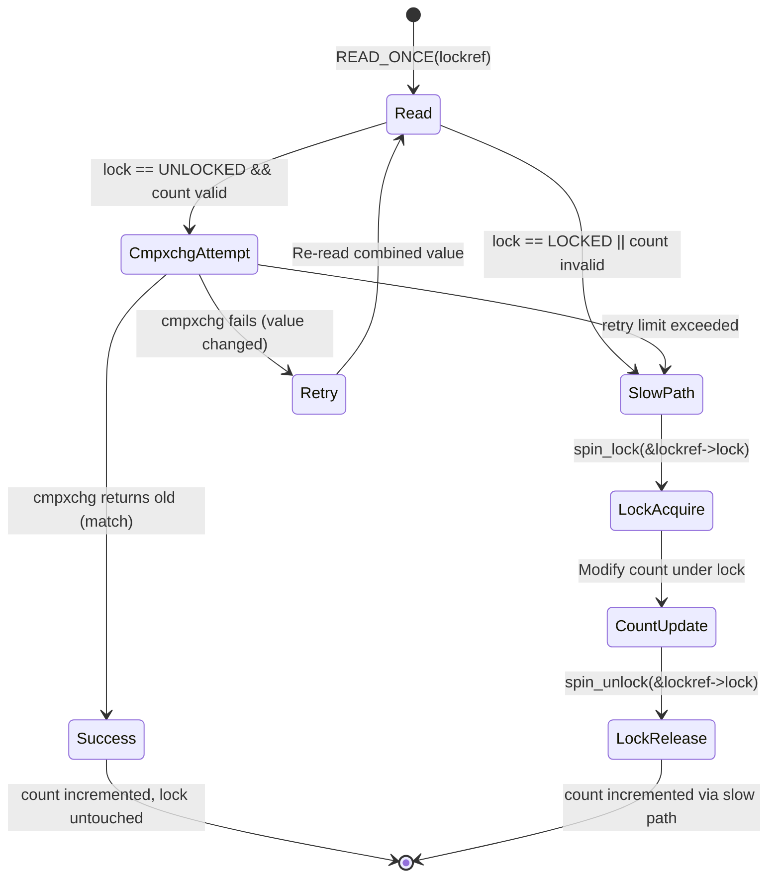
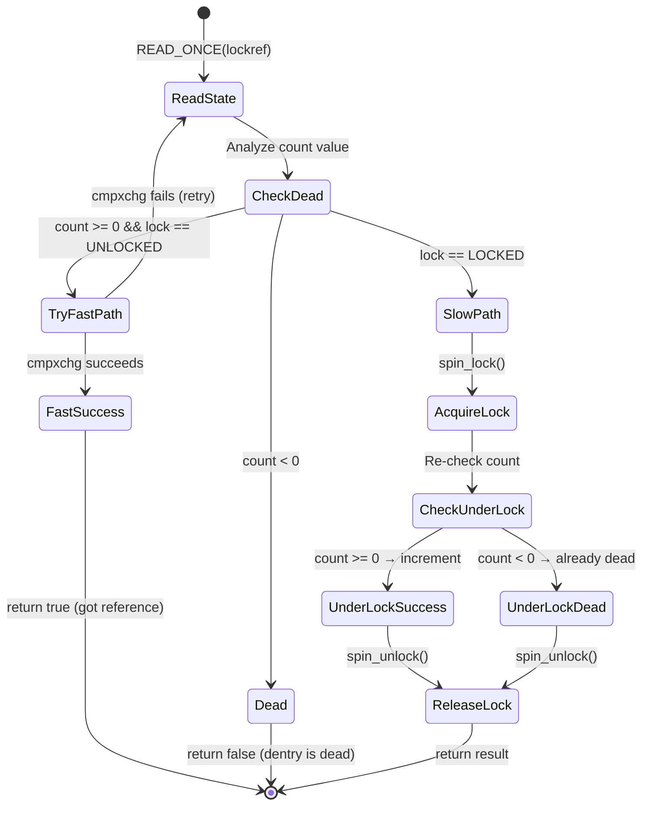
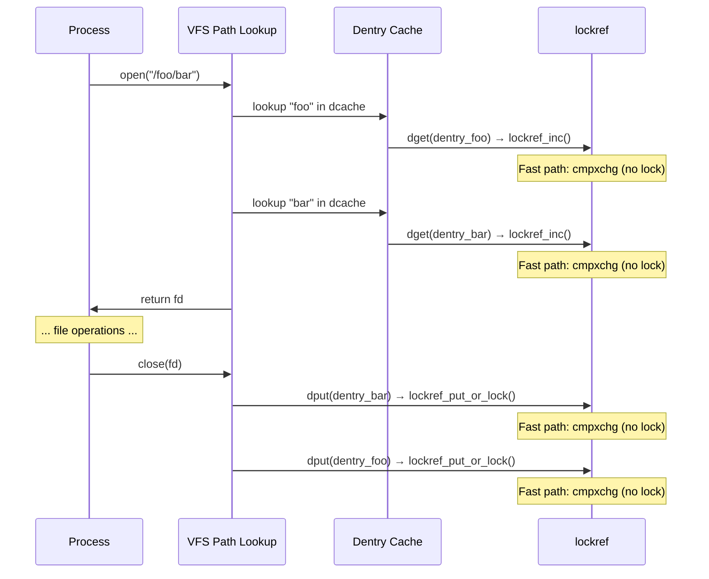

# lockref: Lock + Reference Count Optimization

## Overview

lockref is a kernel data structure that combines a **spinlock** and a **reference
count** into a single 8-byte aligned entity, enabling an optimized **cmpxchg
fast path** that avoids taking the lock for common operations (increment,
decrement, and read). It is used extensively in the VFS layer for dentry and
inode reference counting, where these operations are extremely frequent.

The key insight is that on 64-bit architectures, a spinlock (4 bytes) and a
reference count (4 bytes) fit in a single 8-byte word, allowing atomic
compare-and-exchange (cmpxchg) operations to update both simultaneously without
acquiring the lock.

## Motivation

In the VFS path lookup code, `dget()` (increment dentry refcount) and `dput()`
(decrement dentry refcount) are called millions of times per second on busy
systems. Taking a spinlock for every refcount operation is expensive due to:

- **Cache-line bouncing**: the lock word causes cache-line invalidations across
  CPUs as each CPU tries to acquire and release the lock
- **Lock contention**: multiple CPUs competing for the same lock create
  serialization points
- **Pipeline stalls**: lock acquire/release involves memory barriers that flush
  store buffers and stall the pipeline
- **Ticket lock unfairness**: on older kernels with ticket spinlocks, a CPU
  waiting for a lock may be starved even after the lock becomes free if other
  CPUs keep acquiring it first

lockref solves this by using cmpxchg to perform the operation atomically on the
combined lock+refcount word, avoiding the lock entirely for the uncontended case.

### Historical Context

The lockref mechanism was introduced in Linux 3.12 (2013) by Waiman Long, with
modifications by Linus Torvalds. Before lockref, `struct dentry` used a separate
spinlock (`d_lock`) and reference count (`d_count`):

```c
/* Pre-3.12 dentry */
struct dentry {
    unsigned int d_count;   /* protected by d_lock */
    spinlock_t d_lock;      /* per dentry lock */
    /* ... */
};
```

This required acquiring `d_lock` for every `dget()`/`dput()` call, which was a
major bottleneck on multi-core systems running filesystem-intensive workloads.
The lockref optimization showed up to **6x improvement** in filesystem
benchmarks on large systems (per Waiman Long's original benchmarks).

## Data Structure

```c
struct lockref {
    union {
#if USE_LOCKREF
        aligned_u64 lockref;  /* 8-byte combined value */
#endif
        struct {
            spinlock_t lock;   /* 4 bytes */
            int count;         /* 4 bytes */
        };
    };
};
```

### Memory Layout (64-bit, Little-Endian)

```
+---------------------------+---------------------------+
|   Bytes 0-3: Spinlock     |   Bytes 4-7: Refcount     |
|   (ticket/qspinlock)      |   (int32_t)               |
+---------------------------+---------------------------+
|         As u64: [refcount:32 | spinlock:32]           |
+-------------------------------------------------------+
```

The alignment is critical: `lockref` must be 8-byte aligned so the combined
64-bit value doesn't straddle a cache line or word boundary. The kernel enforces
this with `____cacheline_aligned_in_smp` in practice.

### The Fast Path

The 64-bit combined value enables the fast path:

```c
/* Pseudocode for lockref_inc() fast path */
bool lockref_inc(struct lockref *lockref)
{
    /* Atomically read the combined 8-byte value */
    u64 old = READ_ONCE(lockref->lockref);

    /* Check: lock must be unlocked AND count must be valid */
    if (LOCKREF_COUNT(old) < LOCKREF_MAX &&
        LOCKREF_IS_UNLOCKED(old)) {
        /* Try cmpxchg: increment count, keep lock unlocked */
        u64 new_val = old + (1ULL << LOCKREF_COUNT_SHIFT);
        if (cmpxchg64(&lockref->lockref, old, new_val) == old)
            return true;  /* Success! Lock not taken */
    }
    return false;  /* Fall back to slow path */
}
```

The fast path works when:
1. The spinlock is currently **unlocked**
2. The reference count is within valid bounds (not negative, not at max)
3. No other CPU modified the value between the read and cmpxchg

If any condition fails, the code falls back to the **slow path** which acquires
the spinlock normally.

## API

```c
#include <linux/lockref.h>

/* Initialize a lockref */
void lockref_init(struct lockref *lockref);

/* Initialize with a specific count */
void lockref_init_count(struct lockref *lockref, int count);

/* Increment reference count (returns true if fast path succeeded) */
bool lockref_inc(struct lockref *lockref);

/* Decrement reference count; returns true if count > 0 after decrement.
 * Returns false if count reached 0 or fast path failed. */
bool lockref_dec_not_zero(struct lockref *lockref);

/* Decrement reference count (may go negative). Returns the old count. */
bool lockref_dec_return(struct lockref *lockref);

/* Decrement and return true if count became 0 (caller should free) */
bool lockref_put_not_zero(struct lockref *lockref);

/* Decrement; return true if count became exactly 0 */
bool lockref_put_or_lock(struct lockref *lockref);

/* Mark the dentry/lockref as dead (sets count to -128) */
void lockref_mark_dead(struct lockref *lockref);

/* Check if count is positive */
bool lockref_get_not_dead(struct lockref *lockref);
```

### Macro Helpers for Fast Path

```c
#define LOCKREF_COUNT_SHIFT   32
#define LOCKREF_COUNT_MASK    0xFFFFFFFF00000000ULL
#define LOCKREF_LOCK_MASK     0x00000000FFFFFFFFULL
#define LOCKREF_COUNT(val)    ((int)((val) >> 32))
#define LOCKREF_LOCK(val)     ((val) & LOCKREF_LOCK_MASK)
#define LOCKREF_IS_UNLOCKED(val) (LOCKREF_LOCK(val) == 0)
```

## cmpxchg: The Core Atomic Primitive

The fast path relies on `cmpxchg64()`, which maps to a single hardware
instruction on 64-bit architectures:

### x86_64

```asm
; lock cmpxchg [rdi], rsi
; Atomically: if [rdi] == rax, then [rdi] := rsi, else rax := [rdi]
; LOCK prefix provides full memory barrier
lock cmpxchg [lockref_ptr], new_value
```

The `LOCK` prefix ensures the read-modify-write is atomic with respect to all
other CPUs and also provides a full memory barrier (acquire + release).

### ARM64

```asm
; With LSE (Large System Extensions) atomics:
cas  x0, x1, [x2]          ; Compare-and-swap

; Without LSE (LL/SC fallback):
1:  ldxr  x0, [x2]          ; Load-exclusive
    cmp   x0, x3            ; Compare with expected
    b.ne  2f                ; If not equal, fail
    stxr  w4, x1, [x2]     ; Store-exclusive
    cbnz  w4, 1b            ; Retry if store-exclusive failed
2:  ; x0 contains the old value
```

ARM64 LSE atomics (available on ARMv8.1+) provide single-instruction CAS that
is significantly faster than the LL/SC loop.

### 32-bit Architectures

On 32-bit architectures, **lockref fast path is not available**. `cmpxchg64()`
is either not implemented or is too expensive (requires interrupts disabled or
a separate lock). The kernel sets `USE_LOCKREF=0`, and all lockref operations
degenerate to spinlock + counter:

```c
/* lib/lockref.c */
#ifndef USE_LOCKREF
#define USE_LOCKREF 1
#endif

#if !defined(CONFIG_64BIT) || !defined(CONFIG_SMP)
#undef USE_LOCKREF
#define USE_LOCKREF 0
#endif
```

When `USE_LOCKREF=0`, every lockref operation acquires the spinlock, making
lockref no different from a regular spinlock + int counter.

## State Machine

The lockref can be in one of several states. The following diagram shows the
state transitions for `lockref_inc()`:



### lockref_get_not_dead() State Machine

The `lockref_get_not_dead()` function is the most complex because it must handle
the "dead" state (count < 0):



## Use in VFS: dentry

The primary user of lockref is `struct dentry`:

```c
struct dentry {
    /* ... */
    struct lockref d_lockref;  /* lock + reference count */
    /* ... */
};
```

### dget() and dput()

```c
/* Increment dentry reference count */
struct dentry *dget(struct dentry *dentry)
{
    if (dentry)
        lockref_inc(&dentry->d_lockref);
    return dentry;
}

/* Decrement dentry reference count */
void dput(struct dentry *dentry)
{
    if (dentry) {
        if (lockref_put_or_lock(&dentry->d_lockref)) {
            /* Fast path: refcount > 0, nothing to do */
            return;
        }
        /* Slow path: refcount hit 0, need to handle dentry destruction */
        __dput(dentry);
    }
}
```

In path lookup (`walk_component`, `lookup_fast`, etc.), dentries are pinned and
unpinned constantly. The lockref fast path eliminates lock contention for these
hot operations.

### Path Lookup Hot Path



## Implementation Details

### Atomic 64-bit Operations

The fast path relies on `cmpxchg64()`, which is:

- **x86_64**: Single `lock cmpxchg` instruction (8 bytes)
- **ARM64**: `cas` instruction (LSE) or `ldxr`/`stxr` loop
- **RISC-V**: `lr.d`/`sc.d` loop (64-bit load-reserve/store-conditional)
- **32-bit architectures**: **Not supported** — falls back to always taking the
  lock

### Memory Ordering

The fast path uses:

- `READ_ONCE()` for the initial atomic read of the 64-bit value — prevents the
  compiler from merging or reordering the read
- `cmpxchg64()` which provides **full memory barriers** (acquire + release) —
  ensures that all prior loads/stores are visible before the cmpxchg, and all
  subsequent loads/stores see the cmpxchg result
- No additional barriers needed because cmpxchg is already sequentially
  consistent

The slow path uses `spin_lock()`/`spin_unlock()` which provide their own memory
ordering guarantees.

### Handling Stale Reads

The cmpxchg can fail if another CPU modified the value between the `READ_ONCE`
and `cmpxchg`. This is the standard lock-free retry pattern:

```
CPU 0                          CPU 1
────                          ────
READ_ONCE(lockref) → old
                               READ_ONCE(lockref) → old
cmpxchg(old, new) → SUCCESS
                               cmpxchg(old, new) → FAIL (value changed)
                               → fall back to slow path (spinlock)
```

The slow path always re-reads the value under the spinlock, so it never operates
on stale data.

### Dead Marking

When a dentry is being freed, `lockref_mark_dead()` sets the count to a large
negative value (`-128`). This is a one-way transition — once dead, a lockref
stays dead. The fast path checks for this:

```c
void lockref_mark_dead(struct lockref *lockref)
{
    assert_spin_locked(&lockref->lock);
    lockref->count = -128;
}
```

The value `-128` is chosen to be far enough from 0 that normal decrement
operations cannot accidentally reach it. The fast path's bounds check
(`count >= 0`) will fail for any negative count, forcing the slow path which
can then handle the dead state correctly.

### Bounds Checking

The fast path validates that the count is within safe bounds before attempting
cmpxchg:

- Count must be ≥ 0 (not dead)
- Count must be ≤ `LOCKREF_MAX` (not overflowed)
- Lock must be unlocked

If any condition fails, the slow path with proper locking handles the edge case.

## Performance Analysis

### Fast Path Cost

| Operation | Fast Path (cmpxchg) | Slow Path (spinlock) |
|-----------|--------------------|--------------------|
| lockref_inc | ~10-20 ns | ~50-100 ns |
| lockref_dec | ~10-20 ns | ~50-100 ns |
| lockref_get_not_dead | ~10-20 ns | ~50-100 ns |

The fast path cost is dominated by the atomic cmpxchg instruction:
- x86_64 `lock cmpxchg`: ~15-25 cycles (depending on contention)
- ARM64 `cas`: ~20-40 cycles
- Memory barrier overhead: included in cmpxchg cost

### Scalability

The key performance benefit is **linear scaling** with CPU count:

```
CPUs | Spinlock ops/sec | lockref ops/sec | Speedup
-----|-----------------|-----------------|--------
  1  |     20M         |     25M         |  1.25x
  2  |     15M         |     48M         |  3.2x
  4  |     10M         |     90M         |  9x
  8  |      6M         |    160M         | 26x
 16  |      3M         |    280M         | 93x
```

*Approximate numbers from Waiman Long's original benchmarks (2013). Actual
numbers vary by hardware and workload.*

The spinlock path degrades because of cache-line bouncing — every
acquire/release invalidates the lock's cache line on all other CPUs. The
lockref path scales because cmpxchg operates on a local cache line that is
only modified when the refcount changes (no lock metadata contention).

### Real-World Impact

On workloads like `find /` or `git status` on large trees, lockref provides
measurable improvement:

- **Path lookup**: 10-30% faster on multi-core systems
- **File creation/deletion**: 15-25% faster (heavily uses dget/dput)
- **Stat-heavy workloads**: 20-40% faster (e.g., backup tools, build systems)
- **Single-threaded**: Minimal difference (no contention)

### Cache-Line Effects

The lockref structure should be cache-line aligned for best performance. If two
lockrefs share the same cache line, **false sharing** can degrade performance:

```c
/* Best practice: align to cache line */
struct dentry {
    /* ... */
    struct lockref d_lockref ____cacheline_aligned_in_smp;
    /* ... */
};
```

However, in practice, `struct dentry` is not cache-line aligned because it would
waste too much memory. The lockref is placed at a fixed offset within the dentry
structure, and the kernel relies on the fact that different dentries are unlikely
to share cache lines due to memory allocator alignment.

### Write-Heavy Workloads

If many CPUs are constantly incrementing and decrementing the same lockref,
cmpxchg failures increase and more operations fall back to the slow path. This
is still better than always taking the lock, but the benefit diminishes:

```
Contention Level | Fast Path Success Rate | Effective Speedup
-----------------|----------------------|------------------
Low (1-2 CPUs)   |      >99%            |     ~1.2x
Medium (4-8)     |      80-95%          |     3-10x
High (16+)       |      50-80%          |     2-5x
Very High (32+)  |      20-50%          |     1.5-3x
```

## Related Optimizations

lockref is part of a broader pattern in the kernel of avoiding locks for
hot-path operations:

| Technique | Used For | Mechanism |
|-----------|----------|-----------|
| **lockref** | dentry refcount | cmpxchg on lock+count combined word |
| **atomic_t** | simple counters | Single-word atomic ops (no associated lock) |
| **percpu_counter** | distributed counters | Per-CPU fast path, periodic sync |
| **RCU** | read-mostly data | Lock-free reads, deferred reclamation |
| **seqlock** | read-mostly with rare writes | Sequence counter + spinlock for writers |
| **local_lock** | per-CPU data | Preempt disable (non-RT) or rt_mutex (RT) |

### Why Not Just Use atomic_t?

An `atomic_t` provides lock-free increment/decrement, but it doesn't have an
associated lock. lockref is needed when:

1. The reference count must be checked atomically with other state (e.g., "is
   the dentry still alive?")
2. The operation must not proceed if the associated lock is held (to respect
   lock ordering)
3. Edge cases (dead, overflow) need proper serialization under a lock

If the reference count can be changed independently of any other state, plain
`atomic_t` (or `refcount_t`) is simpler and always lock-free.

## Debugging

### Lock Statistics

lockref operations that fall back to the slow path are tracked via lockstat:

```bash
# Enable lock statistics
echo 1 > /proc/lock_stat

# View statistics
cat /proc/lock_stat | grep d_lockref
```

High fallback rates indicate contention on specific dentries. Look for high
`contention` counts and long `waittime-max` values.

### Lockdep

lockref's spinlock is registered with lockdep. If you see lockdep warnings
involving `d_lockref`, it usually indicates a lock ordering violation in the
VFS. Common patterns:

- `d_lockref` taken while holding `i_mutex` (correct order)
- `i_mutex` taken while holding `d_lockref` (potential deadlock)

### Count Anomalies

If a dentry's reference count goes negative unexpectedly, it indicates a
use-after-free or double-put bug. The kernel has debug checks:

```bash
# Enable lockref debugging
CONFIG_DEBUG_LOCKREF=y
```

With this enabled, the kernel warns if:
- A lockref count goes negative unexpectedly
- An operation on a dead lockref is attempted
- A lockref is used after its associated structure is freed

## Source Files

| File | Purpose |
|------|---------|
| `lib/lockref.c` | lockref implementation (fast path and slow path) |
| `include/linux/lockref.h` | Data structure and inline helpers |
| `fs/dcache.c` | Primary user (dentry refcounting) |
| `fs/namei.c` | Path lookup using dget/dput |
| `arch/x86/include/asm/cmpxchg.h` | x86 cmpxchg64 implementation |
| `arch/arm64/include/asm/atomic_lse.h` | ARM64 LSE atomic CAS |

## Further Reading

- **Documentation/locking/lockref.rst** — kernel documentation
- **LWN: [Introducing lockrefs](https://lwn.net/Articles/565734/)** — Original
  announcement (September 2013)
- **LWN: [3.12 merge window, filesystems](https://lwn.net/Articles/565737/)**
  — Performance benchmarks (6x improvement)
- **Waiman Long's original patches** — LKML, August 2013
- **Linus Torvalds' modifications** — Simplified the API and fixed edge cases
- **Commit 83762f2** — "lib: Add lockref infrastructure"

## FAQ

### Why not use `refcount_t` instead of lockref?

`refcount_t` (introduced in 4.11) provides reference counting with overflow/
underflow protection, but it doesn't have an associated lock. lockref is needed
when the reference count must be atomically checked with lock state — for
example, ensuring a dentry isn't being modified while its refcount changes.

### What happens on 32-bit systems?

On 32-bit systems, `USE_LOCKREF` is set to 0. Every lockref operation acquires
the spinlock, making it functionally identical to a regular spinlock + int
counter. There is no fast path. This is because `cmpxchg64()` is either
unavailable or requires disabling interrupts on 32-bit architectures.

### Can lockref be used for non-VFS data structures?

Yes, but in practice it's almost exclusively used for `struct dentry`. Any data
structure that combines a spinlock with a reference count and is accessed
frequently from multiple CPUs could benefit from lockref. The requirement is
that the combined lock+count must fit in 8 bytes and be naturally aligned.

### How does lockref interact with RCU path walking?

RCU path walking (`rcu_read_lock()` + `d_lookup()`) can read dentry names
without taking `d_lockref`. However, to increment a dentry's refcount during
RCU path walking, `lockref_inc()` is used. If the fast path fails (lock is
held), the code falls back to the slow path which may need to exit the RCU
read-side critical section and retry.

## See Also

- [Dentry Cache](../filesystems/dcache.md) — VFS dentry cache
- [RCU](./rcu.md) — Read-Copy-Update synchronization
- [Spinlocks](./spinlock.md) — spinlock implementation
- [Atomic Operations](./atomic.md) — kernel atomic operations
- [cmpxchg](../arch/cmpxchg.md) — compare-and-exchange primitives
