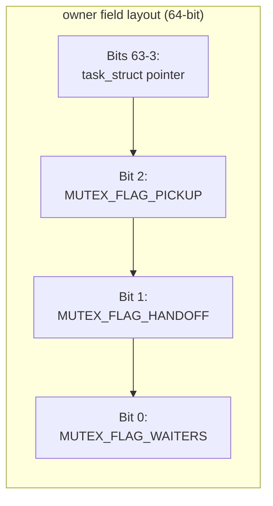
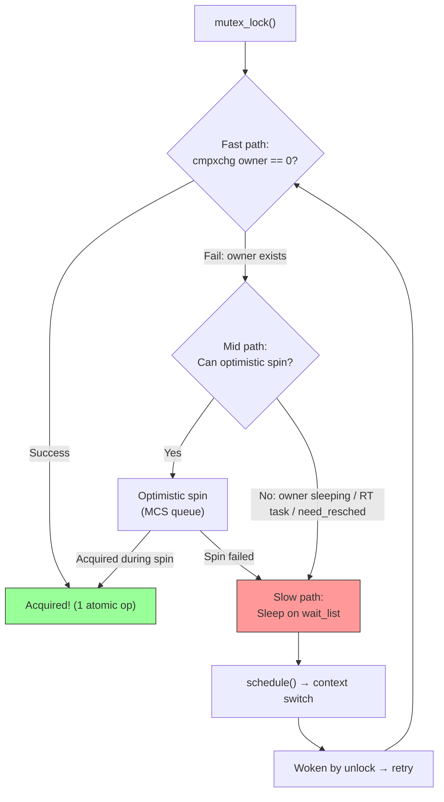
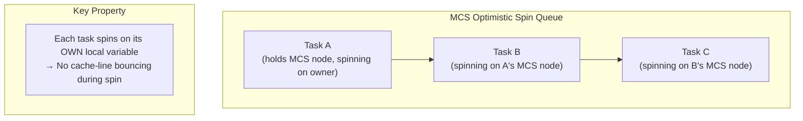
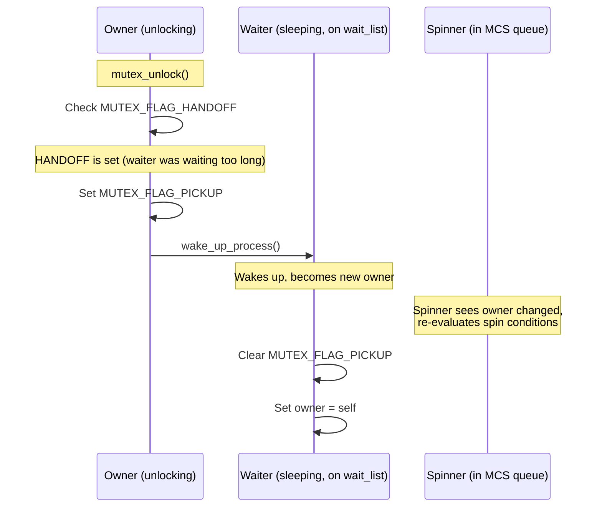
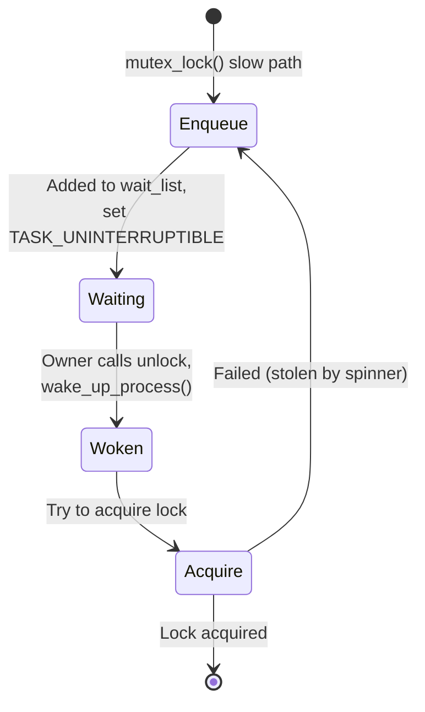

# Mutex Internals

The Linux kernel mutex (`struct mutex`) is the primary sleeping lock. It is
designed for correctness, fairness, and performance in the uncontended case.
This page documents its internal design — owner counting, wait_lock, the
optimistic spin, and how it evolved from the original implementation to the
current qspinlock-based design.

---

## 1. Overview

```c
struct mutex {
    atomic_long_t       owner;      /* owner task + flags */
    raw_spinlock_t      wait_lock;  /* protects wait_list */
    struct list_head    wait_list;  /* queued waiters */
#ifdef CONFIG_MUTEX_SPIN_ON_OWNER
    struct optimistic_spin_queue osq; /* MCS optimistic spin */
#endif
};
```

| Field | Purpose |
|---|---|
| `owner` | Pointer to the owning `task_struct` with low bits for flags |
| `wait_lock` | A raw spinlock protecting the wait queue |
| `wait_list` | Linked list of `struct mutex_waiter` nodes |
| `osq` | Optimistic spin queue (MCS-based) for lock stealing |

### Design Goals

The mutex implementation balances three competing concerns:

1. **Fast uncontended path** — A single atomic operation to acquire the lock
2. **Low contention overhead** — Optimistic spinning avoids expensive context
   switches when the lock holder is actively running
3. **Fairness** — The handoff mechanism prevents starvation of waiting tasks

---

## 2. Owner Counting

### 2.1 The `owner` Field

The `owner` field is an `atomic_long_t` that stores:

* **Bits [0..1]**: flags
* **Bit 0 (`MUTEX_FLAG_WAITERS`)**: at least one waiter exists
* **Bit 1 (`MUTEX_FLAG_HANDOFF`)**: handoff requested (fairness)
* **Bit 2 (`MUTEX_FLAG_PICKUP`)**: new owner must explicitly pick up
* **Bits [2/3..63]**: pointer to `struct task_struct` (aligned to 8 bytes)

Since `task_struct` pointers are aligned to at least 8 bytes (often
`L1_CACHE_BYTES`), the low 3 bits are always available for flags.



### 2.2 Why Owner Tracking Matters

Unlike a simple spinlock, a mutex records **who** holds it. This enables:

1. **Optimistic spinning** — a contender can check if the owner is running
   and spin in the hope that the owner will release soon.
2. **Debugging** — `CONFIG_DEBUG_MUTEXES` can detect double-unlock,
   unlock-by-non-owner, and deadlocks.
3. **Priority inheritance** — `rt_mutex` (which shares some design) can
   boost the owner's priority. Regular mutexes don't do PI, but the
   infrastructure is there.
4. **Lock dependency tracking** — lockdep uses the owner to build the
   wait-for graph and detect potential deadlocks.

### 2.3 Extracting the Owner

```c
static inline struct task_struct *__mutex_owner(struct mutex *lock)
{
    return (struct task_struct *)(atomic_long_read(&lock->owner)
                                 & ~MUTEX_FLAGS);
}

static inline bool __mutex_owner_is_running(struct mutex *lock)
{
    struct task_struct *owner = __mutex_owner(lock);
    return owner && task_is_running(owner);
}
```

The `task_is_running()` check is critical for the optimistic spin — it tells
the spinner whether the lock holder is currently on a CPU and likely to release
the lock soon.

---

## 3. The `wait_lock`

`wait_lock` is a `raw_spinlock_t` that protects the `wait_list`. It is
held for very short durations — just long enough to:

1. Add or remove a waiter from the list.
2. Check or set the `MUTEX_FLAG_WAITERS` bit.
3. Transfer ownership upon unlock.

### 3.1 Why a Raw Spinlock?

`wait_lock` is a **raw** spinlock because it may be held in contexts where
preemption is disabled (inside the optimistic spin path). Regular spinlocks
have preemption-awareness that would be redundant here.

### 3.2 Lock Ordering

```
mutex->wait_lock  (inner)
  └── held while modifying mutex->wait_list

task_struct->pi_lock  (outer)
  └── used in rt_mutex to manage priority inheritance
```

The lock ordering is: `pi_lock` (outer) → `wait_lock` (inner). This means
you must never acquire `pi_lock` while holding `wait_lock`.

---

## 4. Mutex Lock: The Three Paths

When acquiring a mutex, the code takes one of three paths depending on the
current lock state:



### 4.1 Fast Path: Single cmpxchg

```c
static inline bool __mutex_trylock(struct mutex *lock)
{
    struct task_struct *owner = __mutex_owner(lock);
    if (owner)
        return false;
    return atomic_long_try_cmpxchg_acquire(&lock->owner, &owner,
                                            (long)current);
}
```

This is a single `cmpxchg`. If the mutex is free (owner == NULL), the current
task takes it. No spinning, no queuing — just one atomic operation. This is the
common uncontended case and costs ~10-20 ns.

### 4.2 Slow Path: Full Blocking

```
__mutex_lock_slowpath()
  ├── optimistic_spin()        ← try to steal the lock
  │     ├── osq_lock()         ← enqueue in MCS optimistic queue
  │     ├── while (owner is running on a different CPU)
  │     │     cpu_relax()      ← spin
  │     ├── try to acquire     ← cmpxchg
  │     └── osq_unlock()       ← leave MCS queue on failure
  │
  └── __mutex_lock_common()    ← actual blocking
        ├── raw_spin_lock(&lock->wait_lock)
        ├── add to wait_list
        ├── set_current_state(TASK_UNINTERRUPTIBLE)
        ├── raw_spin_unlock(&lock->wait_lock)
        └── schedule()         ← sleep
```

---

## 5. Optimistic Spin

The optimistic spin is the key performance innovation in the mutex
implementation (added by Davidlohr Bueso in 3.15, refined through 4.x).

### 5.1 Rationale

When a mutex is held, the owner is likely to release it soon. Instead of
going to sleep (which involves a context switch, scheduler overhead, and
cache pollution), the contender can **spin in place**. The insight is:

- Context switch costs ~1-5 μs
- A typical mutex critical section is ~100 ns - 1 μs
- If the owner is running on another CPU, spinning for a few hundred
  nanoseconds is cheaper than sleeping and waking up

### 5.2 Conditions for Optimistic Spinning

The contender will spin only if **all** of these are true:

1. The mutex has no current waiters (waiters have priority — fairness).
2. The owner is **running** on another CPU (not sleeping).
3. The task is not a real-time task (RT tasks should sleep, not spin, to
   avoid unbounded latency).
4. `CONFIG_MUTEX_SPIN_ON_OWNER` is enabled.
5. `need_resched()` is false (no higher-priority task is waiting).

### 5.3 MCS Optimistic Spin Queue

To avoid cache-line bouncing when multiple tasks spin simultaneously, the
optimistic spin uses an **MCS queue** (Mellor-Crummey and Scott, 1991):



Each task spins on its own local MCS node — no global atomic operations during
the spin. When Task A acquires (or gives up), it passes the signal to Task B.

The MCS queue has a critical extra property for sleeping locks: **spinners can
exit the queue when they need to reschedule**. If `need_resched()` becomes true
while spinning, the task leaves the MCS queue and falls back to the slow path
(sleep). This prevents priority inversion and ensures forward progress.

### 5.4 The Spin Loop

```c
static bool optimistic_spin(struct mutex *lock)
{
    struct task_struct *task = current;

    if (!mutex_can_spin_on_owner(lock))
        return false;

    /* Enqueue in MCS optimistic spin queue */
    if (!osq_lock(&lock->osq))
        return false;

    /* Spin while the owner is running */
    while (true) {
        struct task_struct *owner = __mutex_owner(lock);

        /* Owner gave up the lock or is no longer running */
        if (!owner || !task_is_running(owner))
            break;

        /* Need to reschedule? Give up spinning */
        if (need_resched())
            break;

        /* Try to acquire the lock */
        if (__mutex_trylock(lock)) {
            osq_unlock(&lock->osq);
            return true;  /* Acquired! */
        }

        cpu_relax();  /* Architecture-specific pause/yield hint */
    }

    osq_unlock(&lock->osq);
    return false;  /* Failed, fall back to sleeping */
}
```

### 5.5 Performance Impact

The optimistic spin reduces mutex latency by **30-50%** in contended
scenarios where the critical section is short (a few hundred nanoseconds).
It is particularly effective for:

* Page allocator locks (`zone->lock`)
* VFS inode locks (`inode->i_mutex`)
* Slab allocator locks
* Network socket locks
* Any lock with short critical sections held by running tasks

Benchmarks (from Davidlohr Bueso's original patches, 2014):

| Workload | Without optimistic spin | With optimistic spin | Improvement |
|----------|----------------------|---------------------|-------------|
| AIM7 mixed | 450K ops/s | 620K ops/s | +38% |
| Sysbench mutex | 120K ops/s | 175K ops/s | +46% |
| Page allocator | 800K ops/s | 1.1M ops/s | +38% |

---

## 6. Mutex Unlock

### 6.1 Fast Path

```c
static inline void __mutex_fastpath_unlock(atomic_long_t *addr,
                                           void (*fail_fn)(atomic_long_t *))
{
    if (atomic_long_cmpxchg_release(addr, (long)current, 0UL) != (long)current)
        fail_fn(addr);
}
```

If there are no waiters (the owner field is just the current task pointer with
no flags set), a single `cmpxchg_release` clears it. This is the common
uncontended case.

### 6.2 Slow Path: Wakeup

```
__mutex_unlock_slowpath()
  ├── raw_spin_lock(&lock->wait_lock)
  ├── if MUTEX_FLAG_WAITERS set:
  │     ├── pick first waiter from wait_list
  │     ├── set MUTEX_FLAG_PICKUP on owner
  │     └── wake_up_process(waiter->task)
  └── raw_spin_unlock(&lock->wait_lock)
```

### 6.3 Handoff Protocol

When `MUTEX_FLAG_HANDOFF` is set, the unlock path **directly transfers**
ownership to the next waiter instead of letting a spinner steal it. This
prevents starvation:



Handoff is triggered when a waiter has been waiting for too long (measured by
comparing the waiter's creation timestamp against the current time). This ensures
that spinners cannot indefinitely steal the lock from sleeping waiters.

### 6.4 Why Not Always Handoff?

Handoff adds overhead (explicit wakeup, context switch) compared to letting
a spinner acquire the lock directly. It's only used as a fairness mechanism
when a waiter has been starved.

---

## 7. Wait Queue: `struct mutex_waiter`

```c
struct mutex_waiter {
    struct list_head    list;
    struct task_struct  *task;
    struct ww_acquire_ctx *ww_ctx;  /* wound/wait context */
#ifdef CONFIG_DEBUG_MUTEXES
    unsigned long       ip;         /* return address for debugging */
#endif
};
```

Waiters are added to the `wait_list` in FIFO order. The first waiter has
the highest priority for ownership transfer.

### Waiter Lifecycle



---

## 8. Comparison with Other Locks

### 8.1 Mutex vs Spinlock

| Aspect | mutex | spinlock |
|--------|-------|----------|
| **Sleep/spin** | Sleeps (context switch) | Spins (busy-wait) |
| **Owner tracked** | Yes | No (typically) |
| **Can sleep in critical section** | Yes | No |
| **Interrupt context** | No | Yes |
| **Preemption** | Preemptible | Disables preemption |
| **Optimistic spin** | Yes | N/A |
| **Use case** | Long critical sections, may sleep | Short critical sections, atomic context |

### 8.2 Mutex vs rt_mutex

| Feature | mutex | rt_mutex |
|---------|-------|----------|
| Exclusive | Yes | Yes |
| Owner tracked | Yes | Yes |
| Priority inheritance | **No** | **Yes** |
| Optimistic spin | Yes | Yes |
| RT-friendly | No | Yes |
| PI chain walking | No | Yes |
| Use case | General mutual exclusion | Real-time, priority inversion prevention |

**Priority inheritance** (PI) in `rt_mutex`: If a high-priority task blocks on
an rt_mutex held by a low-priority task, the holder temporarily inherits the
higher priority. This prevents **priority inversion**, where a medium-priority
task preempts the low-priority holder, indirectly starving the high-priority
waiter (the classic Mars Pathfinder bug).

### 8.3 Mutex vs Semaphore

| Feature | mutex | semaphore |
|---------|-------|-----------|
| Exclusive | Yes | No (counting) |
| Owner tracked | Yes | No |
| Optimistic spin | Yes | No |
| Priority inheritance | No (rt_mutex has it) | No |
| Use case | Mutual exclusion | Resource counting, completion |

Mutexes were originally introduced (2.6.16, 2006) as a replacement for binary
semaphores with better semantics: owner tracking, stricter debug checks, and
the ability to detect misuse at runtime.

### 8.4 Mutex vs rwsem

| Feature | mutex | rwsem |
|---------|-------|-------|
| Access mode | Exclusive only | Read/Write |
| Owner tracked | Yes | Optional |
| Optimistic spin | Yes | Yes |
| Use case | Mutual exclusion | Read-heavy workloads |

rwsem allows multiple concurrent readers but only one writer. Like mutexes,
rwsems use optimistic spinning for the write path.

---

## 9. Debugging

### 9.1 `CONFIG_DEBUG_MUTEXES`

Enables:

* **Double-unlock detection** — `owner` is checked on unlock.
* **Non-owner unlock detection** — unlock must be called by the owner.
* **Use-before-init detection** — tracks initialization state.
* **Lockdep integration** — deadlock detection.
* **Return address tracking** — `mutex_waiter.ip` records where the lock was
  requested, aiding deadlock analysis.

### 9.2 `CONFIG_DEBUG_LOCK_ALLOC`

Shows the lock hierarchy and detects potential deadlocks at runtime. Produces
output like:

```
======================================================
WARNING: possible circular locking dependency detected
------------------------------------------------------
task/1234 is trying to acquire lock:
 (&inode->i_mutex){+.+.+.}, at: vfs_write+0x1a0/0x200

but task is already holding lock:
 (&sb->s_type->i_mutex_key#3){+.+.+.}, at: ext4_dirty_folio+0x50/0x100

which lock already depends on the new lock.
```

### 9.3 Lock Statistics

`CONFIG_LOCK_STATS` tracks:

* Contention count
* Wait time (min/max/avg)
* Hold time (min/max/avg)

Access via `/proc/lock_stat`:

```bash
$ cat /proc/lock_stat | grep mutex
```

---

## 10. Relationship with PREEMPT_RT

On `PREEMPT_RT` kernels, the mutex implementation changes significantly:

- **Regular mutexes** become **rt_mutex** instances internally (sleeping locks
  with priority inheritance)
- The optimistic spin is **disabled** on RT kernels (spinning is undesirable
  for latency-sensitive workloads)
- The `wait_lock` becomes a sleeping lock instead of a raw spinlock
- Priority inheritance is automatically enabled for all mutexes

This means that on RT kernels, mutexes automatically get:
- Priority inheritance (prevents priority inversion)
- Preemptibility (the lock holder can be preempted by higher-priority tasks)
- Bounded latency (no unbounded spinning)

---

## 11. Evolution

| Version | Change |
|---|---|
| 2.6.16 | Original mutex implementation (Ingo Molnar, 2006) |
| 2.6.18 | `MUTEX_FLAG_WAITERS` optimization |
| 3.15 | Optimistic spinning (Davidlohr Bueso, 2014) |
| 4.2 | MCS-based optimistic spin queue |
| 4.4 | Handoff protocol for fairness |
| 4.15 | qspinlock integration for wait_lock |
| 5.x | `atomic_long_t` owner (separate from task pointer) |
| 6.x | Continued refinements to osq and handoff timing |
| 6.x-rt | Full rt_mutex backing under PREEMPT_RT |

### Key Design Decisions

**Why owner tracking?** The owner pointer enables optimistic spinning (check if
the owner is running) and debugging (detect double-unlock, non-owner unlock).
The cost is minimal — the owner pointer is already in the cache line for the
cmpxchg fast path.

**Why MCS for optimistic spinning?** A simple test-and-set spin would cause
cache-line bouncing when multiple tasks spin simultaneously. MCS provides
local spinning — each task spins on its own node, and only the node owner
modifies the global state.

**Why handoff?** Without handoff, a continuous stream of optimistic spinners
could indefinitely starve sleeping waiters. Handoff ensures that after a
timeout, the next waiter gets the lock directly.

---

## 12. Source Files

| File | Purpose |
|------|---------|
| `kernel/locking/mutex.c` | Mutex implementation |
| `include/linux/mutex.h` | Data structure and API declarations |
| `kernel/locking/mutex.h` | Internal header (flags, helpers) |
| `kernel/locking/mcs_spinlock.h` | MCS lock implementation (shared with qspinlock) |
| `kernel/locking/osq_lock.c` | Optimistic spin queue implementation |

---

## 13. Further Reading

* **LWN: [A new mutex implementation](https://lwn.net/Articles/164802/)** —
  Original mutex introduction (Ingo Molnar, 2006)
* **LWN: [Mutexes and the optimistic spinning path](https://lwn.net/Articles/596626/)** —
  Davidlohr Bueso's optimistic spin patches (2014)
* **Documentation: `Documentation/locking/mutex-design.rst`** — Kernel docs
* **Source: `kernel/locking/mutex.c`** — Reference implementation
* **Davidlohr Bueso's optimistic spin patches (2014)** — LKML
* **Waiman Long's qspinlock and mutex improvements** — LKML
* **MCS paper**: Mellor-Crummey and Scott, "Algorithms for Scalable
  Synchronization on Shared-Memory Multiprocessors", ACM TOCS, 1991

---

## Cross-References

* [Locking Overview](./index.md) — spinlocks, rwlocks, RCU
* [qspinlock](./qspinlock.md) — the underlying spinlock mechanism
* [rt_mutex](./rt-mutex.md) — priority-inheriting mutex
* [rwsem](./rwsem.md) — reader-writer semaphore
* [Lockdep](../debugging/lockdep.md) — lock dependency validator
* [RCU](./rcu.md) — read-copy-update (lock-free alternative)
* [local_lock](./local-lock.md) — per-CPU locking for PREEMPT_RT
