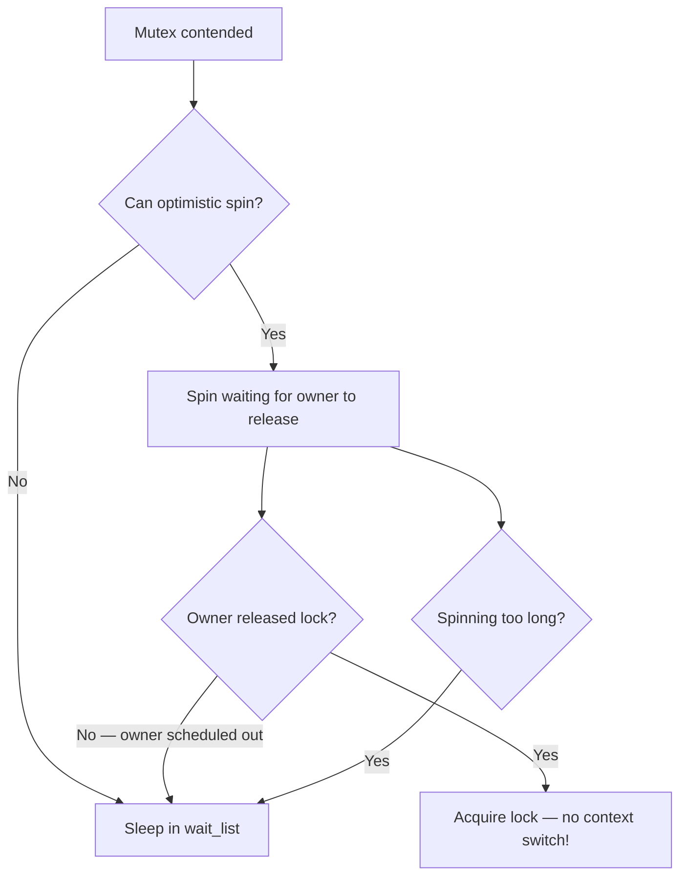
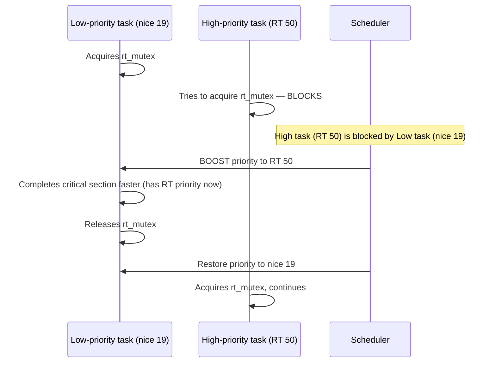

# Mutexes

## Introduction

A mutex (mutual exclusion) is a sleeping lock — when a CPU cannot acquire a mutex, it puts itself to sleep and yields the CPU to other tasks. This makes mutexes ideal for protecting longer critical sections where the lock hold time is measured in microseconds or more, and where the overhead of a context switch is acceptable compared to wasted CPU cycles from spinning.

Mutexes can **only** be used in process context (they sleep), which makes them unsuitable for interrupt handlers. For interrupt-safe locking, see [Spinlocks](spinlocks.md).

## Mutex API

### Declaration and Initialization

```c
/* Static initialization */
DEFINE_MUTEX(my_mutex);

/* Dynamic initialization */
struct mutex my_mutex;
mutex_init(&my_mutex);
```

### Lock and Unlock

```c
mutex_lock(&my_mutex);
/* Critical section — can sleep, call GFP_KERNEL alloc, etc. */
mutex_unlock(&my_mutex);
```

### Trylock (Non-blocking)

```c
if (mutex_trylock(&my_mutex)) {
    /* Got the lock */
    /* ... critical section ... */
    mutex_unlock(&my_mutex);
} else {
    /* Lock is held by someone else — handle contended case */
}
```

### Killable and Interruptible Variants

The standard `mutex_lock()` is uninterruptible — the process will wait until the lock is available, and cannot be killed by signals. For code that should respond to fatal signals:

```c
/* Can be interrupted by fatal signals (SIGKILL) */
if (mutex_lock_interruptible(&my_mutex)) {
    /* Got fatal signal while waiting — return -ERESTARTSYS */
    return -ERESTARTSYS;
}
/* ... critical section ... */
mutex_unlock(&my_mutex);

/* Can be interrupted by any signal */
if (mutex_lock_killable(&my_mutex)) {
    return -ERESTARTSYS;
}
```

**Rule**: Use `mutex_lock_interruptible()` or `mutex_lock_killable()` in any code path that can receive signals (system calls from user space). Use plain `mutex_lock()` only in kernel-internal paths where signals should not interrupt.

### Complete Example

```c
#include <linux/mutex.h>
#include <linux/slab.h>

struct device_config {
    struct mutex config_lock;
    int mode;
    int speed;
    /* ... */
};

static struct device_config *alloc_config(void)
{
    struct device_config *cfg;

    cfg = kzalloc(sizeof(*cfg), GFP_KERNEL);
    if (!cfg)
        return NULL;

    mutex_init(&cfg->config_lock);
    return cfg;
}

static int set_mode(struct device_config *cfg, int new_mode)
{
    int ret = 0;

    mutex_lock(&cfg->config_lock);

    if (cfg->mode == new_mode)
        goto out;

    /* Validate — may involve I/O, sleeping operations */
    ret = validate_mode(new_mode);
    if (ret)
        goto out;

    /* Apply new mode — hardware access that may sleep */
    ret = apply_mode(cfg, new_mode);
    if (!ret)
        cfg->mode = new_mode;

out:
    mutex_unlock(&cfg->config_lock);
    return ret;
}
```

## Mutex Data Structure

```c
struct mutex {
    atomic_long_t       owner;       /* Owner task + flags */
    raw_spinlock_t      wait_lock;   /* Protects wait_list */
    struct list_head    wait_list;   /* List of waiting tasks */
#ifdef CONFIG_DEBUG_MUTEXES
    void                *magic;
#endif
#ifdef CONFIG_DEBUG_LOCK_ALLOC
    struct lockdep_map  dep_map;
#endif
};
```

The `owner` field contains a pointer to the `task_struct` of the lock holder, with flag bits in the low bits. This enables:
- **Owner tracking**: The kernel knows which task holds the mutex
- **Priority inheritance**: The kernel can boost the priority of the lock holder
- **Debug assertions**: `mutex_is_locked()` and `mutex_is_owner()` checks

## Mutex Locking Internals

### Fast Path (Uncontended)

The uncontended case is extremely fast — a single atomic `cmpxchg`:

```c
static inline void mutex_lock(struct mutex *lock)
{
    might_sleep();  /* Debug check: warn if called in atomic context */

    if (!mutex_trylock_fast(lock))
        mutex_lock_slow(lock);
}

static __always_inline bool mutex_trylock_fast(struct mutex *lock)
{
    unsigned long curr = (unsigned long)current;

    if (!atomic_long_cmpxchg_acquire(&lock->owner, 0UL, curr))
        return true;  /* Lock acquired */
    return false;     /* Contended */
}
```

### Slow Path (Contended)

When the fast path fails, the task enters the slow path:

```mermaid
graph TD
    A[mutex_lock called] --> B{Fast path: atomic cmpxchg}
    B -->|Success| C[Lock acquired]
    B -->|Fail: contended| D[mutex_lock_slow]
    D --> E[spin_lock(&wait_lock)]
    E --> F[Add to wait_list]
    F --> G[Set task state to TASK_UNINTERRUPTIBLE]
    G --> H[spin_unlock(&wait_lock)]
    H --> I[schedule — sleep]
    I --> J[Woken up]
    J --> K{Acquired lock?}
    K -->|Yes| C
    K -->|No — spurious| D
```

### Unlock

```c
static __always_inline void mutex_unlock(struct mutex *lock)
{
#ifndef CONFIG_DEBUG_LOCK_ALLOC
    if (__mutex_unlock_fast(lock))
        return;
#endif
    __mutex_unlock_slow(lock);
}
```

The fast path is another `cmpxchg` — if there are no waiters, just clear the owner. If there are waiters, wake the first one:

```c
static noinline void __sched __mutex_unlock_slow(struct mutex *lock)
{
    unsigned long owner = atomic_long_read(&lock->owner);
    struct mutex_waiter *waiter;

    raw_spin_lock(&lock->wait_lock);
    waiter = list_first_entry(&lock->wait_list,
                              struct mutex_waiter, list);
    /* Transfer ownership to the next waiter */
    list_del_init(&waiter->list);
    atomic_long_set(&lock->owner, (unsigned long)waiter->task);
    wake_up_process(waiter->task);
    raw_spin_unlock(&lock->wait_lock);
}
```

## Optimistic Spinning

The mutex subsystem includes an **optimistic spinning** optimization. Instead of immediately going to sleep when the mutex is contended, the waiting task spins for a short time, hoping the lock holder will release it soon:



**Conditions for optimistic spinning:**

1. No other task is already waiting in the wait_list (first waiter only)
2. The mutex owner is currently running on a CPU (not sleeping)
3. The `MUTEX_SPIN_ON_OWNER` flag is set

This optimization is highly effective for short critical sections — it avoids the expensive context switch overhead when the lock is about to be released.

## rt_mutex (Priority-Inheriting Mutex)

The `rt_mutex` is a mutex with **priority inheritance** — if a high-priority task is blocked waiting for a mutex held by a low-priority task, the kernel temporarily boosts the lock holder's priority to match the waiter. RT-mutexes with priority inheritance are used to support PI-futexes, which enable `pthread_mutex_t` priority inheritance attributes (`PTHREAD_PRIO_INHERIT`).

```c
struct rt_mutex my_rt_mutex;
rt_mutex_init(&my_rt_mutex);

rt_mutex_lock(&my_rt_mutex);
/* Critical section */
rt_mutex_unlock(&my_rt_mutex);
```

### Priority Inheritance



Priority inheritance prevents **priority inversion**, where a medium-priority task preempts the low-priority lock holder, indirectly starving the high-priority waiter (the Mars Pathfinder incident of 1997 is the classic example).

### RT-Mutex Waiter Tree (from Kernel Docs)

From the official kernel documentation at `docs.kernel.org/locking/rt-mutex.html`:

The enqueueing of waiters into the rtmutex waiter tree is done in **priority order**. For same priorities, FIFO order is chosen. For each rtmutex, only the **top priority waiter** is enqueued into the owner's priority waiters tree. This tree too queues in priority order.

Whenever the top priority waiter of a task changes (e.g., it timed out or got a signal), the priority of the owner task is readjusted. The priority enqueueing is handled by `pi_waiters`.

### RT-Mutex State Tracking

The state of the rt-mutex is tracked via the `owner` field:

| `lock->owner` | bit 0 | State |
|----------------|-------|-------|
| NULL | 0 | Lock is free (fast acquire possible) |
| NULL | 1 | Lock is free, has waiters; top waiter is grabbing lock |
| task pointer | 0 | Lock is held (fast release possible) |
| task pointer | 1 | Lock is held and has waiters |

The fast atomic compare-exchange-based acquire and release is only possible when bit 0 of `lock->owner` is 0.

### RT-Mutex Fast Path

RT-mutexes are optimized for fastpath operations and have **no internal locking overhead** when locking an uncontended mutex or unlocking a mutex without waiters. The optimized fastpath operations require `cmpxchg` support. If `cmpxchg` is not available, the rt-mutex internal spinlock is used as a fallback.

### Priority Propagation

If the temporarily boosted owner blocks on another rt-mutex itself, it **propagates** the priority boosting to the owner of the other rt-mutex. The priority boosting is immediately removed once the rt-mutex has been unlocked. This chain of priority propagation ensures that a high-priority task blocked through multiple levels of lock dependencies will eventually boost all intermediate lock holders.

### rt_mutex API

```c
DEFINE_RT_MUTEX(my_rt_mutex);

rt_mutex_lock(&my_rt_mutex);
rt_mutex_unlock(&my_rt_mutex);

int rt_mutex_trylock(struct rt_mutex *lock);
void rt_mutex_unlock(struct rt_mutex *lock);

/* Timed lock */
int rt_mutex_timed_lock(struct rt_mutex *lock, struct hrtimer_sleeper *timeout);
```

## Mutex vs Semaphore

The Linux kernel has both mutexes and semaphores (`struct semaphore`). They have different purposes:

| Feature | mutex | semaphore |
|---------|-------|-----------|
| Binary only | Yes (0 or 1 holder) | Can be counting (N holders) |
| Owner tracking | Yes | No |
| Priority inheritance | Yes (rt_mutex) | No |
| Unlock from different context | Must unlock from same task | Any context can unlock |
| trylock | Yes | Yes (`down_trylock`) |
| Performance | Faster (optimized fast path) | Slower |
| Use case | Mutual exclusion | Synchronization (completion-style) |

**Rule**: Always prefer mutexes over semaphores for mutual exclusion. Semaphores should be used only for synchronization patterns where counting is needed (e.g., limiting concurrent access to a resource with N slots).

```c
/* Semaphore for limiting concurrent access (e.g., max 5 DMA channels) */
DEFINE_SEMAPHORE(dma_sem, 5);  /* Counting semaphore */

down(&dma_sem);       /* Acquire — blocks if all 5 slots used */
/* Use DMA channel */
up(&dma_sem);         /* Release */
```

## Mutex vs Spinlock

| Feature | mutex | spinlock |
|---------|-------|----------|
| Waiting | Sleep (context switch) | Busy-wait (spin) |
| Context | Process only | Any (atomic, interrupt) |
| Critical section length | Can be longer | Must be very short |
| Interrupt safe | No | Yes (with irqsave) |
| Memory allocation | Can use GFP_KERNEL | Must use GFP_ATOMIC |
| Overhead per acquire | Higher (if contended) | Lower |
| Owner tracking | Yes | No (except debug) |
| PREEMPT_RT | Same behavior | Becomes rt_mutex |

**Rule of thumb**: Use mutexes unless you're in interrupt context, or the critical section is extremely short (a few instructions).

## Advanced: Mutex Types (debug)

The kernel has several mutex debug sub-types:

```c
/* In include/linux/mutex.h */
enum mutex_waiter_type {
    MUTEX_WAITER_NORMAL,     /* Normal mutex wait */
    MUTEX_WAITER_RT,         /* RT mutex wait */
};
```

## Using Mutexes Safely

### Do: Clean Up on Error Paths

```c
int my_function(void)
{
    mutex_lock(&my_mutex);

    ret = do_something();
    if (ret)
        goto out_unlock;

    ret = do_something_else();
    if (ret)
        goto out_unlock;

    ret = 0;
out_unlock:
    mutex_unlock(&my_mutex);
    return ret;
}
```

### Don't: Forget to Unlock

```c
/* BAD: Lock not released on error path */
int my_function(void)
{
    mutex_lock(&my_mutex);
    ret = do_something();
    if (ret)
        return ret;  /* BUG: mutex still held! */
    mutex_unlock(&my_mutex);
    return 0;
}
```

### Don't: Use in Interrupt Context

```c
/* BAD: Mutex in interrupt handler */
irqreturn_t my_handler(int irq, void *data)
{
    mutex_lock(&my_mutex);  /* SLEEPING IN INTERRUPT CONTEXT! */
    /* ... */
    mutex_unlock(&my_mutex);
    return IRQ_HANDLED;
}
```

### Do: Use mutex_lock_interruptible for User-Facing Code

```c
long my_ioctl(struct file *file, unsigned int cmd, unsigned long arg)
{
    struct my_device *dev = file->private_data;

    if (mutex_lock_interruptible(&dev->lock))
        return -ERESTARTSYS;

    /* Process ioctl */
    mutex_unlock(&dev->lock);
    return 0;
}
```

## Debugging Mutex Issues

### CONFIG_DEBUG_MUTEXES

```
CONFIG_DEBUG_MUTEXES=y
```

Enables runtime checks for:
- Unlocking a mutex not held by the current task
- Double-locking
- Using a destroyed mutex

### CONFIG_DEBUG_LOCK_ALLOC (lockdep)

```
CONFIG_PROVE_LOCKING=y
```

Enables lockdep validation of mutex lock ordering. See [Lockdep](lockdep.md).

### CONFIG_DEBUG_WAIT_SLEEP

Warns when a task holding a mutex enters the scheduler:

```
CONFIG_DEBUG_ATOMIC_SLEEP=y
```

### Lock Statistics

```bash
$ sudo cat /proc/lock_stat
```

## References

- [The Linux Kernel Documentation](https://docs.kernel.org/)
- [GNU Project Documentation](https://www.gnu.org/doc/doc.html)
- [GNU Manuals](https://www.gnu.org/manual/manual.html)
- [Free Software Directory](https://directory.fsf.org/wiki/Main_Page)
- [Planet GNU](https://planet.gnu.org/)
- [Free Software Books](https://www.gnu.org/doc/other-free-books.html)

- [Kernel documentation: RT-mutex subsystem with PI support](https://docs.kernel.org/locking/rt-mutex.html)
- [Kernel documentation: RT-mutex implementation design](https://docs.kernel.org/locking/rt-mutex-design.html)
- [Kernel documentation: Generic Mutex Subsystem](https://docs.kernel.org/locking/mutex-design.html)
- [Davidlohr Bueso: "Mutex: the sleeping lock"](https://lwn.net/Articles/575460/)
- [Thomas Gleixner: rt_mutex implementation](https://git.kernel.org/pub/scm/linux/kernel/git/torvalds/linux.git/tree/kernel/locking/rtmutex.c)
- [Wikipedia: Priority Inversion](https://en.wikipedia.org/wiki/Priority_inversion)
- [Mars Pathfinder priority inversion bug](https://en.wikipedia.org/wiki/Mars_Pathfinder#S.2FR_overload_and_priority_inversion)

## Related Topics

- [Synchronization Overview](overview.md) — When and why locks are needed
- [Spinlocks](spinlocks.md) — Busy-wait locks for atomic context
- [RCU](rcu.md) — Lock-free read-side synchronization
- [Lock Ordering](lock-ordering.md) — Preventing deadlocks
- [Lockdep](lockdep.md) — Runtime deadlock detection
- [Seqlocks](seqlocks.md) — Optimistic reader-writer synchronization
