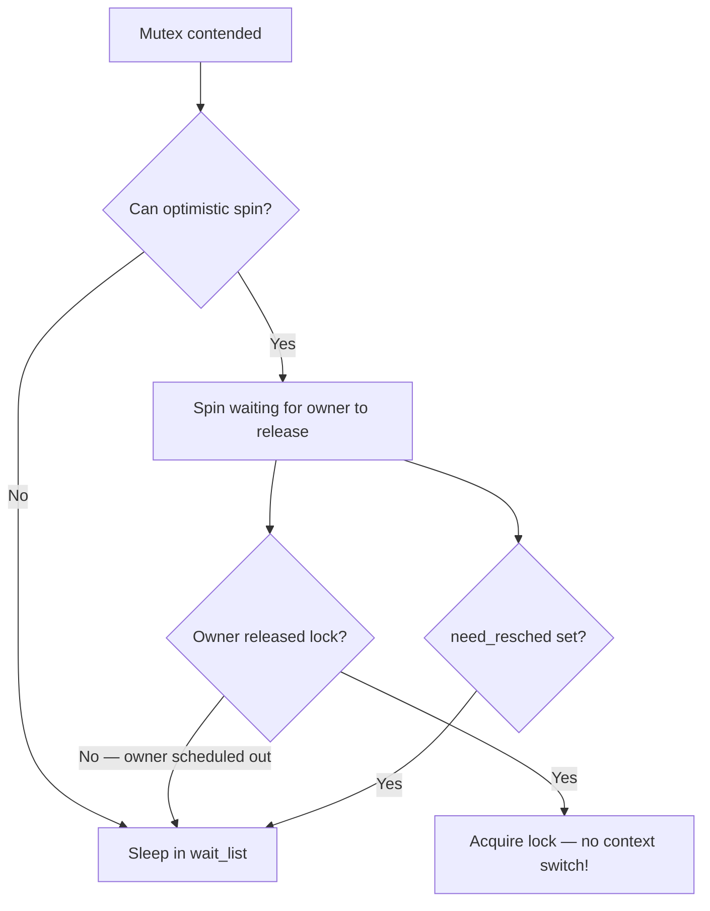
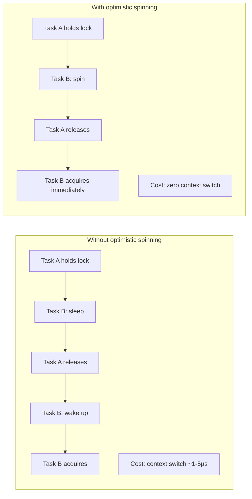

# Mutexes

## Introduction

A mutex (mutual exclusion) is a sleeping lock — when a CPU cannot acquire a mutex, it puts itself to sleep and yields the CPU to other tasks. This makes mutexes ideal for protecting longer critical sections where the lock hold time is measured in microseconds or more, and where the overhead of a context switch is acceptable compared to wasted CPU cycles from spinning.

Mutexes can **only** be used in process context (they sleep), which makes them unsuitable for interrupt handlers. For interrupt-safe locking, see [Spinlocks](spinlocks.md).

## Mutex API

### Declaration and Initialization

```c
/* Static initialization */
DEFINE_MUTEX(my_mutex);

/* Dynamic initialization */
struct mutex my_mutex;
mutex_init(&my_mutex);
```

### Lock and Unlock

```c
mutex_lock(&my_mutex);
/* Critical section — can sleep, call GFP_KERNEL alloc, etc. */
mutex_unlock(&my_mutex);
```

### Trylock (Non-blocking)

```c
if (mutex_trylock(&my_mutex)) {
    /* Got the lock */
    /* ... critical section ... */
    mutex_unlock(&my_mutex);
} else {
    /* Lock is held by someone else — handle contended case */
}
```

### Killable and Interruptible Variants

The standard `mutex_lock()` is uninterruptible — the process will wait until the lock is available, and cannot be killed by signals. For code that should respond to fatal signals:

```c
/* Can be interrupted by fatal signals (SIGKILL) */
if (mutex_lock_interruptible(&my_mutex)) {
    /* Got fatal signal while waiting — return -ERESTARTSYS */
    return -ERESTARTSYS;
}
/* ... critical section ... */
mutex_unlock(&my_mutex);

/* Can be interrupted by any signal */
if (mutex_lock_killable(&my_mutex)) {
    return -ERESTARTSYS;
}
```

**Rule**: Use `mutex_lock_interruptible()` or `mutex_lock_killable()` in any code path that can receive signals (system calls from user space). Use plain `mutex_lock()` only in kernel-internal paths where signals should not interrupt.

### Complete Example

```c
#include <linux/mutex.h>
#include <linux/slab.h>

struct device_config {
    struct mutex config_lock;
    int mode;
    int speed;
    /* ... */
};

static struct device_config *alloc_config(void)
{
    struct device_config *cfg;

    cfg = kzalloc(sizeof(*cfg), GFP_KERNEL);
    if (!cfg)
        return NULL;

    mutex_init(&cfg->config_lock);
    return cfg;
}

static int set_mode(struct device_config *cfg, int new_mode)
{
    int ret = 0;

    mutex_lock(&cfg->config_lock);

    if (cfg->mode == new_mode)
        goto out;

    /* Validate — may involve I/O, sleeping operations */
    ret = validate_mode(new_mode);
    if (ret)
        goto out;

    /* Apply new mode — hardware access that may sleep */
    ret = apply_mode(cfg, new_mode);
    if (!ret)
        cfg->mode = new_mode;

out:
    mutex_unlock(&cfg->config_lock);
    return ret;
}
```

## Mutex Data Structure

```c
struct mutex {
    atomic_long_t       owner;       /* Owner task + flags */
    raw_spinlock_t      wait_lock;   /* Protects wait_list */
    struct list_head    wait_list;   /* List of waiting tasks */
#ifdef CONFIG_DEBUG_MUTEXES
    void                *magic;
#endif
#ifdef CONFIG_DEBUG_LOCK_ALLOC
    struct lockdep_map  dep_map;
#endif
};
```

The `owner` field contains a pointer to the `task_struct` of the lock holder, with flag bits in the low bits. This enables:
- **Owner tracking**: The kernel knows which task holds the mutex
- **Priority inheritance**: The kernel can boost the priority of the lock holder
- **Debug assertions**: `mutex_is_locked()` and `mutex_is_owner()` checks

## Mutex Locking Internals

### Fast Path (Uncontended)

The uncontended case is extremely fast — a single atomic `cmpxchg`:

```c
static inline void mutex_lock(struct mutex *lock)
{
    might_sleep();  /* Debug check: warn if called in atomic context */

    if (!mutex_trylock_fast(lock))
        mutex_lock_slow(lock);
}

static __always_inline bool mutex_trylock_fast(struct mutex *lock)
{
    unsigned long curr = (unsigned long)current;

    if (!atomic_long_cmpxchg_acquire(&lock->owner, 0UL, curr))
        return true;  /* Lock acquired */
    return false;     /* Contended */
}
```

### Slow Path (Contended)

When the fast path fails, the task enters the slow path:

```mermaid
graph TD
    A[mutex_lock called] --> B{Fast path: atomic cmpxchg}
    B -->|Success| C[Lock acquired]
    B -->|Fail: contended| D[mutex_lock_slow]
    D --> E[spin_lock(&wait_lock)]
    E --> F[Add to wait_list]
    F --> G[Set task state to TASK_UNINTERRUPTIBLE]
    G --> H[spin_unlock(&wait_lock)]
    H --> I[schedule — sleep]
    I --> J[Woken up]
    J --> K{Acquired lock?}
    K -->|Yes| C
    K -->|No — spurious| D
```

### Unlock

```c
static __always_inline void mutex_unlock(struct mutex *lock)
{
#ifndef CONFIG_DEBUG_LOCK_ALLOC
    if (__mutex_unlock_fast(lock))
        return;
#endif
    __mutex_unlock_slow(lock);
}
```

The fast path is another `cmpxchg` — if there are no waiters, just clear the owner. If there are waiters, wake the first one:

```c
static noinline void __sched __mutex_unlock_slow(struct mutex *lock)
{
    unsigned long owner = atomic_long_read(&lock->owner);
    struct mutex_waiter *waiter;

    raw_spin_lock(&lock->wait_lock);
    waiter = list_first_entry(&lock->wait_list,
                              struct mutex_waiter, list);
    /* Transfer ownership to the next waiter */
    list_del_init(&waiter->list);
    atomic_long_set(&lock->owner, (unsigned long)waiter->task);
    wake_up_process(waiter->task);
    raw_spin_unlock(&lock->wait_lock);
}
```

## Optimistic Spinning

The mutex subsystem includes an **optimistic spinning** optimization (enabled by `CONFIG_MUTEX_SPIN_ON_OWNER=y`). Instead of immediately going to sleep when the mutex is contended, the waiting task spins for a short time, hoping the lock holder will release it soon.

This is the **midpath** in the mutex acquisition strategy (between the fastpath `cmpxchg` and the slowpath that sleeps on a wait-queue). From the kernel documentation at `docs.kernel.org/locking/mutex-design.html`:

> *"If the lock owner is running, it is likely to release the lock soon."*



**Conditions for optimistic spinning:**

1. No other task is already waiting in the wait_list (first waiter only)
2. The mutex owner is currently running on a CPU (not sleeping)
3. No higher-priority task is ready to run (`!need_resched`)
4. The `MUTEX_SPIN_ON_OWNER` flag is set

### MCS Lock for Fair Spinning

When multiple tasks are optimistic spinning, they use an **MCS lock** (Mellor-Crummey and Scott) to queue up fairly. The MCS lock is a custom spinlock where each CPU spins on a **local variable** rather than a shared atomic, avoiding expensive cacheline bouncing:

```c
/* Optimistic spinning queue (osq) — per-CPU nodes */
struct optimistic_spin_queue {
    struct optimistic_spin_node *nodes[NR_CPUS];
};

struct optimistic_spin_node {
    struct optimistic_spin_node *next, *prev;
    int locked;     /* 1 = lock acquired */
    int cpu;        /* CPU this node represents */
};
```

Key properties of the MCS-based optimistic spinning:
- **Fair**: Tasks acquire in FIFO order
- **Local spinning**: Each CPU spins on its own `locked` variable (cache-line local)
- **Preemption-aware**: A spinner can exit the MCS queue if it needs to reschedule, avoiding the case where a task that needs to reschedule continues spinning only to go directly to slowpath

This is the same MCS lock used for qspinlock in the kernel, adapted for mutex optimistic spinning.

### Performance Impact

Optimistic spinning is highly effective for **short critical sections** where the lock holder releases quickly. It avoids the expensive context switch overhead (~1-5 µs) when the lock is about to be released. The technique is also used for **rw-semaphores**.



## rt_mutex: Deep Dive into Priority Inheritance

The `rt_mutex` is a mutex with **priority inheritance** — if a high-priority task is blocked waiting for a mutex held by a low-priority task, the kernel temporarily boosts the lock holder's priority to match the waiter. RT-mutexes with priority inheritance are used to support PI-futexes, which enable `pthread_mutex_t` priority inheritance attributes (`PTHREAD_PRIO_INHERIT`).

```c
struct rt_mutex my_rt_mutex;
rt_mutex_init(&my_rt_mutex);

rt_mutex_lock(&my_rt_mutex);
/* Critical section */
rt_mutex_unlock(&my_rt_mutex);
```

### Unbounded Priority Inversion — The Problem PI Solves

Priority inversion occurs when a lower-priority process executes while a higher-priority process wants to run. The dangerous variant is **unbounded priority inversion**, where the high-priority process is blocked for an indeterminate time:

```
Classic scenario (processes A, B, C — A highest, C lowest):

  A tries to grab lock L1 (owned by C) → A blocks
  C runs to release the lock
  BUT: B preempts C (B has higher priority than C)
  B runs indefinitely → A is starved

  This is UNBOUNDED priority inversion:
  A (high priority) is blocked by B (medium priority)
  through C (low priority) — no guarantee of progress.
```

The Mars Pathfinder mission (1997) famously suffered from this bug in its VxWorks operating system.

### How Priority Inheritance Works

When A blocks on a lock owned by C:
1. C **inherits A's priority** temporarily
2. B cannot preempt C (C now has A's high priority)
3. C completes its critical section and releases the lock
4. C's priority is **restored** to its original value
5. A acquires the lock and continues

### The PI Chain

Priority inheritance can propagate through multiple locks. If the boosted owner blocks on another rt-mutex, the priority boost **chains** to the next owner:

```
Task A (prio 99) blocks on Mutex1 (owned by Task B, prio 50)
  → Task B boosted to prio 99
  Task B blocks on Mutex2 (owned by Task C, prio 10)
    → Task C boosted to prio 99
    Task C releases Mutex2 → Task B resumes
  Task B releases Mutex1 → Task A resumes
```

This chain of locks and tasks is called the **PI chain**. The kernel traverses this chain to ensure all intermediate lock holders receive the priority boost.

### RT-Mutex Waiter Tree

From the kernel documentation at `docs.kernel.org/locking/rt-mutex-design.html`:

Each rt-mutex maintains a **waiter tree** (red-black tree) ordered by task priority:

- Waiters are enqueued in **priority order** (FIFO for same priority)
- Only the **top priority waiter** is enqueued into the owner's `pi_waiters` tree
- When the top waiter changes (timeout, signal, etc.), the owner's priority is readjusted

The owner task maintains its own **PI tree** (`pi_waiters`) that contains the highest-priority waiter for each lock it holds. The kernel uses this to determine the effective priority of the owner.

### RT-Mutex State Encoding

The `owner` field uses bit-packing for efficient state tracking:

| `lock->owner` | bit 0 | State |
|----------------|-------|-------|
| NULL | 0 | Lock is free (fast acquire possible) |
| NULL | 1 | Lock is free, has waiters; top waiter is grabbing lock |
| task pointer | 0 | Lock is held (fast release possible) |
| task pointer | 1 | Lock is held and has waiters |

Fast atomic `cmpxchg`-based acquire/release is only possible when bit 0 is 0.

### PI Chain Walk Algorithm

From `docs.kernel.org/locking/rt-mutex-design.html`, the PI chain walk proceeds as follows:

1. **Task blocks on mutex** → add task as waiter to mutex's waiter tree
2. **Check if owner's priority needs boosting** → if waiter's priority > owner's priority, boost owner
3. **If owner is blocked on another rt-mutex** → propagate boost up the chain (go to step 1 for the next mutex)
4. **Priority adjustments cascade** → each level of the chain is updated

The chain walk uses **raw spinlocks** (`pi_lock`) to protect the PI data structures. The algorithm limits chain depth to prevent excessive overhead.

### cmpxchg Optimization

RT-mutexes use `cmpxchg` tricks for fast-path operations:

- **Fast acquire**: If `lock->owner == NULL`, atomically set to `current` — no locking needed
- **Fast release**: If `lock->owner == current` and bit 0 is 0, atomically clear — no locking needed
- **Fallback**: If `cmpxchg` is not available on the architecture, the internal `wait_lock` spinlock is used

### RT-Mutex API

```c
DEFINE_RT_MUTEX(my_rt_mutex);

rt_mutex_lock(&my_rt_mutex);
rt_mutex_unlock(&my_rt_mutex);

int rt_mutex_trylock(struct rt_mutex *lock);
void rt_mutex_unlock(struct rt_mutex *lock);

/* Timed lock */
int rt_mutex_timed_lock(struct rt_mutex *lock, struct hrtimer_sleeper *timeout);

/* Destroy */
void rt_mutex_destroy(struct rt_mutex *lock);
```

### PI-Futexes

RT-mutexes enable **PI-futexes**, which allow userspace `pthread_mutex_t` with `PTHREAD_PRIO_INHERIT` to work correctly. When a userspace thread blocks on a PI futex:

1. The kernel creates an rt-mutex waiter
2. Priority inheritance propagates through the kernel's PI chain
3. The lock holder's priority is boosted in the scheduler
4. This prevents unbounded priority inversion for real-time userspace applications

## Mutex vs Semaphore

The Linux kernel has both mutexes and semaphores (`struct semaphore`). They have different purposes:

| Feature | mutex | semaphore |
|---------|-------|-----------|
| Binary only | Yes (0 or 1 holder) | Can be counting (N holders) |
| Owner tracking | Yes | No |
| Priority inheritance | Yes (rt_mutex) | No |
| Unlock from different context | Must unlock from same task | Any context can unlock |
| trylock | Yes | Yes (`down_trylock`) |
| Performance | Faster (optimized fast path) | Slower |
| Use case | Mutual exclusion | Synchronization (completion-style) |

**Rule**: Always prefer mutexes over semaphores for mutual exclusion. Semaphores should be used only for synchronization patterns where counting is needed (e.g., limiting concurrent access to a resource with N slots).

```c
/* Semaphore for limiting concurrent access (e.g., max 5 DMA channels) */
DEFINE_SEMAPHORE(dma_sem, 5);  /* Counting semaphore */

down(&dma_sem);       /* Acquire — blocks if all 5 slots used */
/* Use DMA channel */
up(&dma_sem);         /* Release */
```

## Mutex vs Spinlock

| Feature | mutex | spinlock |
|---------|-------|----------|
| Waiting | Sleep (context switch) | Busy-wait (spin) |
| Context | Process only | Any (atomic, interrupt) |
| Critical section length | Can be longer | Must be very short |
| Interrupt safe | No | Yes (with irqsave) |
| Memory allocation | Can use GFP_KERNEL | Must use GFP_ATOMIC |
| Overhead per acquire | Higher (if contended) | Lower |
| Owner tracking | Yes | No (except debug) |
| PREEMPT_RT | Same behavior | Becomes rt_mutex |

**Rule of thumb**: Use mutexes unless you're in interrupt context, or the critical section is extremely short (a few instructions).

## Advanced: Mutex Types (debug)

The kernel has several mutex debug sub-types:

```c
/* In include/linux/mutex.h */
enum mutex_waiter_type {
    MUTEX_WAITER_NORMAL,     /* Normal mutex wait */
    MUTEX_WAITER_RT,         /* RT mutex wait */
};
```

## Using Mutexes Safely

### Do: Clean Up on Error Paths

```c
int my_function(void)
{
    mutex_lock(&my_mutex);

    ret = do_something();
    if (ret)
        goto out_unlock;

    ret = do_something_else();
    if (ret)
        goto out_unlock;

    ret = 0;
out_unlock:
    mutex_unlock(&my_mutex);
    return ret;
}
```

### Don't: Forget to Unlock

```c
/* BAD: Lock not released on error path */
int my_function(void)
{
    mutex_lock(&my_mutex);
    ret = do_something();
    if (ret)
        return ret;  /* BUG: mutex still held! */
    mutex_unlock(&my_mutex);
    return 0;
}
```

### Don't: Use in Interrupt Context

```c
/* BAD: Mutex in interrupt handler */
irqreturn_t my_handler(int irq, void *data)
{
    mutex_lock(&my_mutex);  /* SLEEPING IN INTERRUPT CONTEXT! */
    /* ... */
    mutex_unlock(&my_mutex);
    return IRQ_HANDLED;
}
```

### Do: Use mutex_lock_interruptible for User-Facing Code

```c
long my_ioctl(struct file *file, unsigned int cmd, unsigned long arg)
{
    struct my_device *dev = file->private_data;

    if (mutex_lock_interruptible(&dev->lock))
        return -ERESTARTSYS;

    /* Process ioctl */
    mutex_unlock(&dev->lock);
    return 0;
}
```

## Debugging Mutex Issues

### CONFIG_DEBUG_MUTEXES

```
CONFIG_DEBUG_MUTEXES=y
```

Enables runtime checks for:
- Unlocking a mutex not held by the current task
- Double-locking
- Using a destroyed mutex

### CONFIG_DEBUG_LOCK_ALLOC (lockdep)

```
CONFIG_PROVE_LOCKING=y
```

Enables lockdep validation of mutex lock ordering. See [Lockdep](lockdep.md).

### CONFIG_DEBUG_WAIT_SLEEP

Warns when a task holding a mutex enters the scheduler:

```
CONFIG_DEBUG_ATOMIC_SLEEP=y
```

### Lock Statistics

```bash
$ sudo cat /proc/lock_stat
```

## Robust Futexes

From the [kernel robust futexes documentation](https://docs.kernel.org/locking/robust-futexes.html), robust futexes solve the problem of a process dying while holding a futex-based lock. Without robust futexes, if a process crashes (e.g., `kill -9` or SEGFAULT) while holding a `pthread_mutex_t` shared with another process, the lock is permanently stuck — the kernel destroys the task but cannot clean up the lock (since there may be no in-kernel futex queue), and userspace has no chance to clean up because it crashed. A system reboot was historically required to release such locks.

### The Problem

Normal futexes are lightweight locks that in the non-contended case operate entirely in userspace (atomic `cmpxchg`). The kernel only becomes involved when there is contention (via `FUTEX_WAIT` / `FUTEX_WAKE`). The kernel has no persistent record of which futexes a process holds. If the process dies:
- **Userspace** cannot clean up (it crashed).
- **Kernel** cannot clean up (it doesn't know about the lock).

### The Solution: Per-Thread Robust List

The solution uses a **per-thread private list of robust locks** maintained by glibc in userspace, registered with the kernel via `sys_set_robust_list()`. At `do_exit()` time, the kernel walks this list and marks owned locks with `FUTEX_OWNER_DIED`, waking one waiter.

**Key syscalls:**

```c
/* Register the robust futex list (once per thread lifetime) */
asmlinkage long sys_set_robust_list(struct robust_list_head __user *head, size_t len);

/* Query the registered list pointer */
asmlinkage long sys_get_robust_list(int pid, struct robust_list_head __user **head_ptr, size_t __user *len_ptr);
```

**How it works:**

1. glibc registers the robust list with the kernel once per thread (fast — pointer stored in `current->futex.robust_list`).
2. glibc maintains a linked list of `pthread_mutex_t` locks held by the thread.
3. A `list_op_pending` field protects the window between acquiring a lock and adding it to the list.
4. At `do_exit()`, the kernel checks if a list is registered and, if non-empty, walks it carefully (not trusting userspace pointers), setting `FUTEX_OWNER_DIED` on owned locks and waking waiters.
5. The remaining cleanup is done in userspace — the new owner sees the `FUTEX_OWNER_DIED` bit and can decide whether to recover the protected data.

**Futex word encoding:**

```c
#define FUTEX_OWNER_DIED  0x40000000  /* Owner exited while holding lock */
#define FUTEX_WAITERS     0x80000000  /* Waiters are pending */
/* Remaining bits = TID of the owner */
```

### Advantages Over VMA-Based Approach

The earlier approach attached robust futexes to VMAs and scanned all VMAs at exit time. The per-thread list approach is superior:

| Aspect | VMA-based (old) | Per-thread list (current) |
|--------|----------------|--------------------------|
| Exit overhead | Scan every VMA per thread | Check one pointer (NULL or not) |
| Scalability | `pthread_exit` takes ~1ms with thousands of VMAs | Nearly zero cost if no list |
| Per-lock syscalls | `FUTEX_REGISTER` / `FUTEX_DEREGISTER` per lock | None (glibc manages list) |
| Kernel memory | Per-lock kernel allocation | None |
| VM changes | Required | None |

### Performance

Benchmarked with 1 million held locks (2 GHz CPU):
- Contended mutexes (`FUTEX_WAIT` set): **130 ms**
- Uncontended mutexes: **30 ms**

In practice, a process holds a handful of locks at most, making this effectively instantaneous.

### Architecture Support

Architectures must implement `futex_atomic_cmpxchg_inatomic()` to support robust futexes. The syscall is wired up for x86, x86_64, and most other architectures.

### Userspace Usage

Robust mutexes are used transparently via glibc's `pthread_mutex_t` with `PTHREAD_MUTEX_ROBUST`:

```c
pthread_mutexattr_t attr;
pthread_mutexattr_init(&attr);
pthread_mutexattr_setrobust(&attr, PTHREAD_MUTEX_ROBUST);
pthread_mutex_init(&mutex, &attr);

/* After owner dies, next lock returns EOWNERDEAD */
int ret = pthread_mutex_lock(&mutex);
if (ret == EOWNERDEAD) {
    /* Previous owner died — recover data, then mark consistent */
    pthread_mutex_consistent(&mutex);
}
```

## References

- [The Linux Kernel Documentation](https://docs.kernel.org/)
- [GNU Project Documentation](https://www.gnu.org/doc/doc.html)
- [GNU Manuals](https://www.gnu.org/manual/manual.html)
- [Free Software Directory](https://directory.fsf.org/wiki/Main_Page)
- [Planet GNU](https://planet.gnu.org/)
- [Free Software Books](https://www.gnu.org/doc/other-free-books.html)

- [Kernel documentation: RT-mutex subsystem with PI support](https://docs.kernel.org/locking/rt-mutex.html)
- [Kernel documentation: RT-mutex implementation design](https://docs.kernel.org/locking/rt-mutex-design.html) — PI chain walk algorithm, waiter trees, cmpxchg tricks
- [Kernel documentation: Generic Mutex Subsystem](https://docs.kernel.org/locking/mutex-design.html)
- [Kernel documentation: Optimistic spinning and MCS lock](https://docs.kernel.org/locking/mutex-design.html#implementation)
- [Davidlohr Bueso: "Mutex: the sleeping lock"](https://lwn.net/Articles/575460/)
- [Thomas Gleixner: rt_mutex implementation](https://git.kernel.org/pub/scm/linux/kernel/git/torvalds/linux.git/tree/kernel/locking/rtmutex.c)
- [Wikipedia: Priority Inversion](https://en.wikipedia.org/wiki/Priority_inversion)
- [Mars Pathfinder priority inversion bug](https://en.wikipedia.org/wiki/Mars_Pathfinder#S.2FR_overload_and_priority_inversion)

## Related Topics

- [Synchronization Overview](overview.md) — When and why locks are needed
- [Spinlocks](spinlocks.md) — Busy-wait locks for atomic context
- [RCU](rcu.md) — Lock-free read-side synchronization
- [Lock Ordering](lock-ordering.md) — Preventing deadlocks
- [Lockdep](lockdep.md) — Runtime deadlock detection
- [Seqlocks](seqlocks.md) — Optimistic reader-writer synchronization
