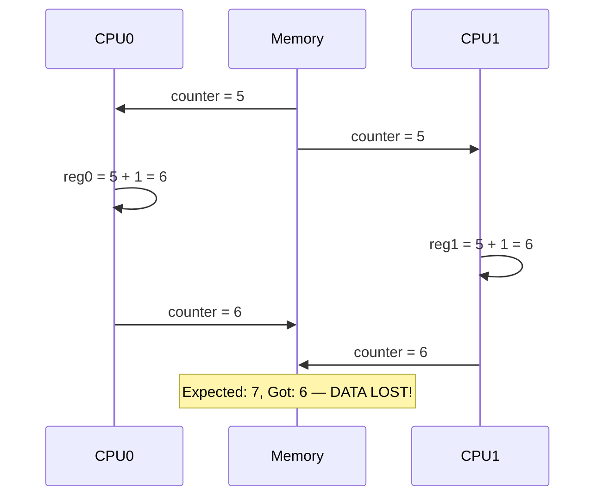
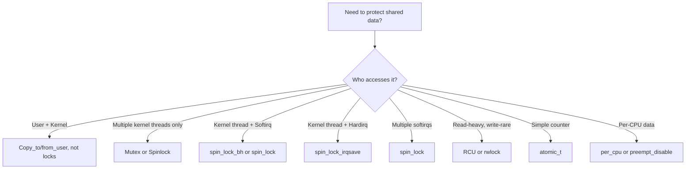
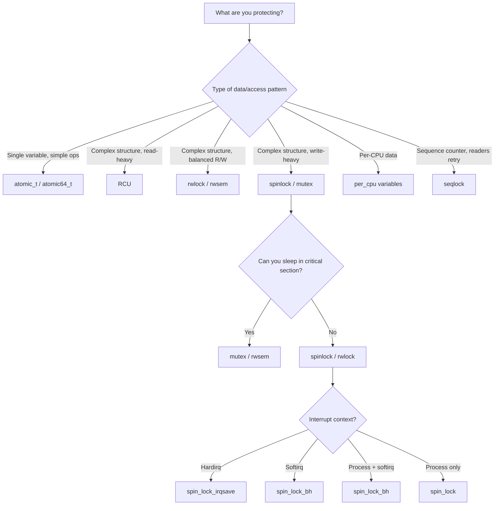
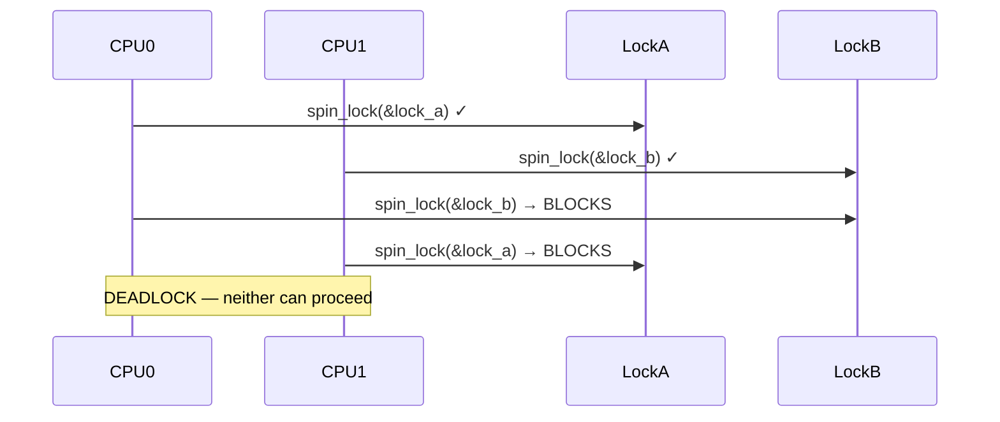

# Synchronization Overview

## Introduction

Synchronization is the art of coordinating concurrent access to shared resources. In the Linux kernel, where dozens of CPUs may simultaneously execute kernel code, where hardware interrupts can preempt any instruction, and where kernel threads compete for the same data structures, synchronization is not optional — it is the foundation upon which all correct kernel code is built.

This chapter provides an overview of why synchronization is needed, the types of race conditions that can occur, and the synchronization primitives available in the Linux kernel.

## Why Synchronization Is Needed

### The Problem: Concurrent Access

Consider a simple counter increment:

```c
counter++;  /* Looks atomic, but it's not */
```

On most architectures, `counter++` compiles to three operations:

1. **Load** the value from memory into a register
2. **Increment** the register
3. **Store** the register back to memory

If two CPUs execute this simultaneously, the following interleaving can occur:



This is a **race condition**: the outcome depends on the timing of concurrent operations, and the result is incorrect.

### Types of Race Conditions

#### 1. Data Race

Two or more contexts access the same memory location concurrently, at least one is a write, and no synchronization is used:

```c
/* BAD: Data race on list_head */
if (!list_empty(&my_list)) {
    entry = list_first_entry(&my_list, struct my_entry, list);
    list_del(&entry->list);  /* Another CPU might be doing the same thing */
    process(entry);
}
```

#### 2. Time-of-Check to Time-of-Use (TOCTOU)

A condition is checked, and then acted upon, but the condition may have changed between the check and the action:

```c
/* BAD: TOCTOU race */
if (file->f_pos < file->f_inode->i_size) {
    /* Between this check and the read, another process might truncate the file */
    bytes = read_from_inode(file, buf, count);
}
```

#### 3. Lost Wakeups

A process goes to sleep waiting for a condition, but the wakeup signal is sent before the process has actually gone to sleep:

```c
/* BAD: Lost wakeup */
/* Thread A (producer): */
data_ready = 1;
wake_up(&wait_queue);

/* Thread B (consumer): */
if (!data_ready)          /* Checks condition */
    wait_event(...);      /* Goes to sleep — but wakeup already happened! */
```

#### 4. Memory Ordering Issues

Modern CPUs reorder memory operations for performance. Even on a single CPU, stores to different addresses may be observed in a different order by other CPUs:

```c
/* CPU 0 */
data = 42;
ready = 1;

/* CPU 1 */
while (!ready)
    cpu_relax();
printk("%d\n", data);  /* May print 0! The CPU may reorder the stores */
```

See [Atomic Operations](atomic-ops.md) and memory barriers for details.

## When Is Synchronization Needed?

Synchronization is needed whenever shared mutable state is accessed from multiple execution contexts. The contexts that can preempt each other in the Linux kernel include:

| Context | Can Preempt | Can Be Preempted By |
|---------|-------------|---------------------|
| User-space process | — | Kernel, interrupts |
| Kernel thread | — | Interrupts, other kernel threads, preemption |
| System call (process context) | — | Interrupts, preemption |
| Softirq | Everything except hardirq | Hardirq, NMI |
| Hardirq | Everything | NMI |
| NMI | Nothing | Nothing |

### Quick Decision Guide



## Synchronization Primitives Overview

The Linux kernel provides a rich set of synchronization primitives, each optimized for different scenarios:

### Atomic Operations

Simple operations on single variables without locks:

- `atomic_t`, `atomic64_t` — atomic integer operations
- `atomic_cmpxchg()` — compare-and-swap
- `atomic_xchg()` — atomic exchange

See [Atomic Operations](atomic-ops.md).

### Spinlocks

Busy-wait locks for short critical sections in atomic context:

- `spin_lock()` / `spin_unlock()` — basic spinlock
- `spin_lock_irqsave()` / `spin_unlock_irqrestore()` — disables interrupts
- `raw_spin_lock()` — always spins, even with PREEMPT_RT

See [Spinlocks](spinlocks.md).

### Mutexes

Sleeping locks for longer critical sections in process context:

- `mutex_lock()` / `mutex_unlock()` — basic mutex
- `mutex_trylock()` — non-blocking acquire
- `rt_mutex` — priority-inheriting mutex

See [Mutexes](mutexes.md).

### RCU (Read-Copy-Update)

Lock-free read-side access with deferred reclamation:

- `rcu_read_lock()` / `rcu_read_unlock()` — read-side critical section
- `synchronize_rcu()` — wait for grace period
- `call_rcu()` — deferred callback after grace period
- `rcu_dereference()` — safely read RCU-protected pointer
- `rcu_assign_pointer()` — safely publish RCU-protected pointer

See [RCU](rcu.md).

### Seqlocks

Reader-writer synchronization where readers never block but may need to retry:

- `write_seqlock()` / `write_sequnlock()`
- `read_seqbegin()` / `read_seqretry()`

See [Seqlocks](seqlocks.md).

### Reader-Writer Locks

Allow multiple concurrent readers or a single writer:

- `read_lock()` / `write_lock()` — rwlock
- `read_lock_irqsave()` / `write_lock_irqsave()`
- `rwsem` — reader-writer semaphore (sleeping)

### Completion Variables

Signal that a specific event has occurred:

```c
DECLARE_COMPLETION(done);
wait_for_completion(&done);     /* Sleep until complete */
complete(&done);                /* Wake up waiter */
```

### Per-CPU Variables

Eliminate sharing entirely by giving each CPU its own copy:

```c
DEFINE_PER_CPU(unsigned long, my_counter);

this_cpu_inc(my_counter);       /* Increment local CPU's counter */
/* No locking needed — each CPU has its own copy */
```

## Choosing the Right Primitive



## Deadlocks

A deadlock occurs when two or more contexts are each waiting for a resource held by the other, and neither can proceed.

### ABBA Deadlock

The classic deadlock pattern:

```c
/* CPU 0 */
spin_lock(&lock_a);
spin_lock(&lock_b);  /* Blocks: CPU 1 holds lock_b */
/* ... */
spin_unlock(&lock_b);
spin_unlock(&lock_a);

/* CPU 1 */
spin_lock(&lock_b);
spin_lock(&lock_a);  /* Blocks: CPU 0 holds lock_a */
/* ... */
spin_unlock(&lock_a);
spin_unlock(&lock_b);
```



**Solution**: Always acquire locks in the same global order. If the order is always A→B, the deadlock cannot occur.

See [Lock Ordering](lock-ordering.md) and [Lockdep](lockdep.md) for tools and techniques to prevent deadlocks.

### Self-Deadlock

A CPU tries to acquire a lock it already holds (non-recursive):

```c
spin_lock(&my_lock);
spin_lock(&my_lock);  /* DEADLOCK: spins forever */
```

**Solution**: Use recursive locks where supported, or restructure code to avoid re-entry.

### Sleep-in-Atomic Deadlock

Sleeping while holding a spinlock:

```c
spin_lock(&my_lock);
kmalloc(size, GFP_KERNEL);  /* May sleep! → deadlock if another context tries to acquire my_lock */
spin_unlock(&my_lock);
```

**Solution**: Use `GFP_ATOMIC` inside spinlock-held regions, or restructure to allocate before locking.

## Lock Contention

Even without deadlocks, excessive lock contention can severely degrade performance:

```bash
# Monitor lock contention with perf
$ sudo perf lock record -- sleep 5
$ sudo perf lock report
                Name   acquired  contended  total wait (ns)   max wait (ns)
              &rq->lock   123456       1234        5678901234       1234567
              &sb->s_umount  45678       2345        9012345678       2345678
```

**Reducing contention:**

1. **Finer-grained locking**: Split one big lock into many small locks
2. **Lock-free algorithms**: Use RCU, atomics, or per-CPU data
3. **Lock elision**: Optimistic execution without locking (hardware transactional memory)
4. **Lock batching**: Process multiple items under one lock acquisition
5. **Per-CPU data**: Eliminate sharing entirely

## Memory Barriers

Even with proper locking, memory ordering issues can arise on weakly-ordered architectures (ARM, POWER). The kernel provides explicit memory barriers:

```c
/* Full memory barrier — all loads and stores before are visible after */
mb();
smp_mb();

/* Write barrier — all stores before are visible after */
wmb();
smp_wmb();

/* Read barrier — all loads before are visible after */
rmb();
smp_rmb();

/* Compiler barrier — prevents compiler reordering */
barrier();
```

On x86 (which is strongly ordered), `smp_mb()`, `smp_wmb()`, and `smp_rmb()` are typically compiler barriers only. On ARM, they emit actual memory barrier instructions (`DMB`, `DSB`).

See [Atomic Operations](atomic-ops.md) for more on memory barriers.

## Preemption and Synchronization

The kernel's preemption model affects which synchronization primitives are needed:

| Config | Behavior |
|--------|----------|
| `PREEMPT_NONE` | No kernel preemption (server default) |
| `PREEMPT_VOLUNTARY` | Explicit preemption points |
| `PREEMPT_FULL` | Preempt anywhere except spinlock-held regions |
| `PREEMPT_RT` (PREEMPT_RT patch) | Spinlocks become sleeping locks, most code is preemptible |

With `PREEMPT_RT`, the synchronization landscape changes significantly:
- `raw_spinlock_t` remains a true spinlock
- `spinlock_t` becomes a sleeping lock (rt_mutex)
- Most interrupt handlers become threaded
- Softirqs run in kernel threads

## Synchronization Debugging Tools

The kernel provides several powerful debugging tools:

| Tool | Purpose |
|------|---------|
| **Lockdep** | Runtime lock dependency validator — detects potential deadlocks |
| **KASAN** | Detects data races (with KCSAN) |
| **KCSAN** | Kernel Concurrency Sanitizer — detects data races |
| **Lock_stat** | Lock contention statistics |
| **ftrace** | Trace lock acquisitions, contentions, and hold times |
| **perf lock** | Lock profiling with perf |

See [Lockdep](lockdep.md) for the most important of these.

## Lock Torture Testing

The kernel provides `locktorture`, a built-in module for stress-testing locking primitives.
From the [kernel documentation](https://docs.kernel.org/locking/locktorture.html):

### CONFIG_LOCK_TORTURE_TEST

The `CONFIG_LOCK_TORTURE_TEST` config option provides a kernel module that runs torture
tests on core kernel locking primitives. The test creates kernel threads that acquire locks
and hold them for configurable durations, simulating different critical region behaviors.
Contention is controlled by adjusting hold time and thread count.

### Supported Lock Types

The `torture_type` module parameter selects which primitive to test:

| Value | Primitive |
|-------|-----------|
| `lock_busted` | Simulates a buggy lock (for testing the test) |
| `spin_lock` | `spin_lock()` / `spin_unlock()` pairs |
| `spin_lock_irq` | `spin_lock_irq()` / `spin_unlock_irq()` pairs |
| `rw_lock` | Read/write lock pairs |
| `rw_lock_irq` | Read/write lock with IRQ disable |
| `mutex_lock` | `mutex_lock()` / `mutex_unlock()` pairs |
| `rtmutex_lock` | RT-mutex pairs (requires `CONFIG_RT_MUTEXES=y`) |
| `rwsem_lock` | Read/write semaphore pairs |

### Key Module Parameters

| Parameter | Description | Default |
|-----------|-------------|---------|
| `nwriters_stress` | Number of writer (exclusive) threads | 2 × online CPUs |
| `nreaders_stress` | Number of reader (shared) threads | Same as writers |
| `torture_type` | Lock type to test | `spin_lock` |
| `shutdown_secs` | Seconds before auto-shutdown (0 = disabled) | 0 |
| `stat_interval` | Seconds between stats printk (0 = on unload only) | 60 |
| `stutter` | Seconds to run before pausing (same duration) | 5 |
| `onoff_interval` | Seconds between CPU hotplug operations | 0 |
| `verbose` | Enable verbose debug output | 1 |

### Usage Example

```bash
# Load and test spinlocks for 1 hour
modprobe locktorture torture_type=spin_lock
sleep 3600
rmmod locktorture
dmesg | grep torture:

# Test mutexes with 8 writer threads
modprobe locktorture torture_type=mutex_lock nwriters_stress=8
sleep 600
rmmod locktorture
dmesg | grep torture:
```

### Statistics Output

```
spin_lock-torture: Writes: Total: 93746064 Max/Min: 0/0 Fail: 0
                   (A)           (B)              (C)     (D)  (E)
```

- **(A)**: Lock type being tortured
- **(B)**: Number of writer lock acquisitions
- **(C)**: Min/max times threads failed to acquire the lock
- **(D)**: Number of acquisition failures
- **(E)**: Error flag — should only be positive if there's a bug in the lock implementation

The `rmmod` command forces a final verdict: `SUCCESS`, `FAILURE`, or `RCU_HOTPLUG`
(indicates CPU-hotplug problems were detected even if locking was fine).

## References

- [The Linux Kernel Documentation](https://docs.kernel.org/)
- [GNU Project Documentation](https://www.gnu.org/doc/doc.html)
- [GNU Manuals](https://www.gnu.org/manual/manual.html)
- [Free Software Directory](https://directory.fsf.org/wiki/Main_Page)
- [Planet GNU](https://planet.gnu.org/)
- [Free Software Books](https://www.gnu.org/doc/other-free-books.html)

- [Linux Kernel Documentation: Kernel locking](https://www.kernel.org/doc/html/latest/locking/index.html)
- [Understanding the Linux Kernel, 3rd Edition — Chapter 5: Kernel Synchronization](https://www.oreilly.com/library/view/understanding-the-linux/0596005652/)
- [Linux Device Drivers, 3rd Edition — Chapter 5: Concurrency and Race Conditions](https://lwn.net/Kernel/LDD3/)
- [Linux Kernel Source: Documentation/locking/lockdep-design.rst](https://git.kernel.org/pub/scm/linux/kernel/git/torvalds/linux.git/tree/Documentation/locking/lockdep-design.rst)
- [Paul McKenney: "Is Parallel Programming Still Hard?"](https://kernel.dk/ols2009.pdf)

## Related Topics

- [Spinlocks](spinlocks.md) — Busy-wait locks for atomic context
- [Mutexes](mutexes.md) — Sleeping locks for process context
- [RCU](rcu.md) — Lock-free read-side synchronization
- [Atomic Operations](atomic-ops.md) — Lock-free primitives and memory barriers
- [Seqlocks](seqlocks.md) — Optimistic reader-writer synchronization
- [Lock Ordering](lock-ordering.md) — Preventing deadlocks through consistent ordering
- [Lockdep](lockdep.md) — Runtime deadlock detection
