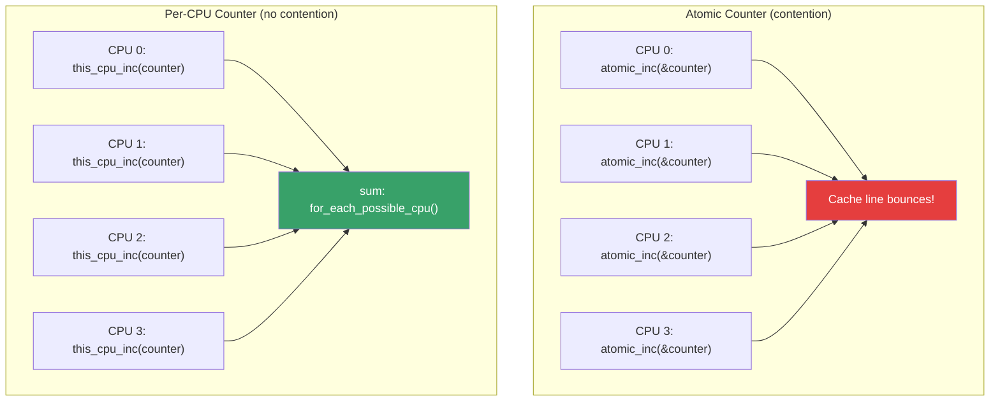
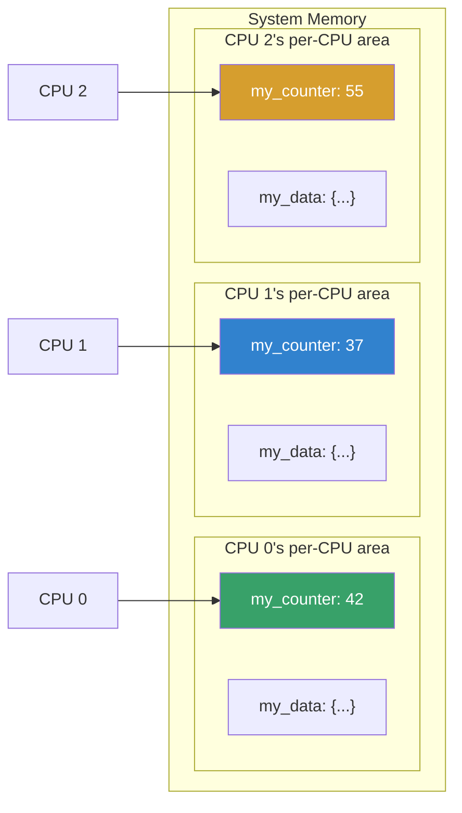

# Per-CPU Variables

## Introduction

Per-CPU variables are one of the most powerful and widely used synchronization avoidance techniques in the Linux kernel. Instead of sharing data between CPUs and protecting it with locks, each CPU gets its **own private copy** of the variable. This eliminates cache-line bouncing, lock contention, and false sharing—resulting in dramatically better performance on multi-core systems.

The concept is straightforward: if you have a counter that all CPUs increment frequently, rather than using an atomic operation (which forces cache-line transfers between cores), give each CPU its own counter and sum them when you need the total.

Per-CPU variables are used extensively throughout the kernel for:
- Network statistics (`/proc/net/snmp`)
- Process scheduling counters
- Slab allocator caches
- RCU (Read-Copy-Update) tracking
- Interrupt handler state
- Kernel profiling (`perf_event`)

## Declaring Per-CPU Variables

### Compile-Time Declaration

```c
#include <linux/percpu.h>

/* Define a per-CPU variable */
DEFINE_PER_CPU(int, my_counter);

/* With a specific alignment */
DEFINE_PER_CPU_ALIGNED(long, my_aligned_var);

/* Read-mostly per-CPU data */
DEFINE_PER_CPU_READ_MOSTLY(struct my_data, cached_data);

/* Static (file-local) per-CPU variable */
static DEFINE_PER_CPU(unsigned long, local_stat);
```

### Dynamic Allocation

```c
/* Allocate per-CPU memory at runtime */
int __percpu *dynamic_counter;

dynamic_counter = alloc_percpu(int);
if (!dynamic_counter)
    return -ENOMEM;

/* Use it */
this_cpu_inc(*dynamic_counter);

/* Free when done */
free_percpu(dynamic_counter);
```

### Per-CPU Variables in Structures

```c
struct my_device {
    int id;
    char name[32];
    struct percpu_counter rx_packets;  /* Per-CPU counter */
    int __percpu *local_buffer;        /* Per-CPU pointer */
};

/* Initialize */
dev->rx_packets = alloc_percpu_counter();
dev->local_buffer = alloc_percpu(int);
```

## Accessing Per-CPU Variables

### Basic Access Macros

```c
/* Get the current CPU's value */
int val = get_cpu_var(my_counter);  /* Disables preemption */
put_cpu_var(my_counter);            /* Re-enables preemption */

/* Alternative (explicit preemption control) */
int val;
preempt_disable();
val = per_cpu(my_counter, smp_processor_id());
preempt_enable();
```

### The `this_cpu_*` Family (Preferred)

The `this_cpu_*` macros are the modern, preferred way to access per-CPU variables. They disable preemption internally and generate optimized single-instruction code on many architectures:

```c
/* Read current CPU's value */
int val = this_cpu_read(my_counter);

/* Write to current CPU's value */
this_cpu_write(my_counter, 42);

/* Atomic operations (preemption-safe, no explicit locking needed) */
this_cpu_inc(my_counter);           /* ++ */
this_cpu_dec(my_counter);           /* -- */
this_cpu_add(my_counter, 10);       /* += 10 */
this_cpu_sub(my_counter, 5);        /* -= 5 */

/* Conditional operations */
this_cpu_cmpxchg(my_counter, old, new);  /* Compare and swap */
this_cpu_xchg(my_counter, new);          /* Exchange */

/* Bit operations */
this_cpu_or(flags, MASK);
this_cpu_and(flags, ~MASK);
```

### `this_cpu_ptr` — Getting the Pointer

```c
/* Get pointer to current CPU's data */
int *ptr = this_cpu_ptr(&my_counter);
*ptr += 1;

/* Common pattern: per-CPU structures */
struct my_stats {
    unsigned long packets;
    unsigned long bytes;
    unsigned long errors;
};
DEFINE_PER_CPU(struct my_stats, net_stats);

/* Increment stats */
struct my_stats *stats = this_cpu_ptr(&net_stats);
stats->packets++;
stats->bytes += len;
```

## Preemption Considerations

### The Preemption Problem

Per-CPU access is safe only when the task is guaranteed not to be migrated to another CPU during the access. The kernel provides several levels of protection:

```c
/* LEVEL 1: get_cpu_var / put_cpu_var
 * Disables preemption for the duration
 * Cannot sleep between get and put!
 */
get_cpu_var(my_counter)++;
put_cpu_var(my_counter);

/* LEVEL 2: preempt_disable / preempt_enable
 * More explicit, same effect
 */
preempt_disable();
this_cpu_inc(my_counter);
preempt_enable();

/* LEVEL 3: this_cpu_* macros
 * Internally handle preemption for single operations
 * Best for simple read-modify-write
 */
this_cpu_inc(my_counter);  /* Preemption-safe */

/* LEVEL 4: Disabling preemption + migration
 * For operations that access multiple CPUs' data
 */
get_online_cpus();       /* Prevent CPU hotplug */
for_each_online_cpu(cpu) {
    total += per_cpu(my_counter, cpu);
}
put_online_cpus();
```

### What Can Go Wrong

```c
/* WRONG: Sleeping while holding per-CPU access */
preempt_disable();
mutex_lock(&some_mutex);  /* BUG: cannot sleep with preempt disabled! */
this_cpu_inc(my_counter);
mutex_unlock(&some_mutex);
preempt_enable();

/* WRONG: Accessing another CPU's data without protection */
/* This is technically safe but semantically wrong */
val = per_cpu(my_counter, 5);  /* CPU 5's value — might be stale */

/* WRONG: Long critical section with preemption disabled */
preempt_disable();
/* ... lots of work ... */    /* BAD: other tasks on this CPU are starved */
preempt_enable();

/* RIGHT: Minimize the disabled section */
preempt_disable();
val = this_cpu_read(my_counter);
preempt_enable();
/* Process val with preemption enabled */
preempt_disable();
this_cpu_write(my_counter, new_val);
preempt_enable();
```

## Per-CPU Counter Patterns

### Simple Counter with Global Sum

```c
DEFINE_PER_CPU(unsigned long, event_count);

/* Called frequently (lock-free, fast) */
void record_event(void) {
    this_cpu_inc(event_count);
}

/* Called rarely (expensive but that's OK) */
unsigned long get_total_events(void) {
    unsigned long total = 0;
    int cpu;
    
    for_each_possible_cpu(cpu)
        total += per_cpu(event_count, cpu);
    
    return total;
}
```

### Using `percpu_counter` (Kernel Helper)

The kernel provides `struct percpu_counter` with batched updates for better performance:

```c
#include <linux/percpu_counter.h>

static DEFINE_PERCPU_COUNTER(my_counter);

/* Increment (may batch, not immediately visible globally) */
percpu_counter_inc(&my_counter);
percpu_counter_dec(&my_counter);
percpu_counter_add(&my_counter, 100);

/* Get approximate count (fast, no locking) */
s64 approx = percpu_counter_read(&my_counter);

/* Get exact count (slower, sums all CPUs) */
s64 exact = percpu_counter_sum(&my_counter);

/* Check if above/below threshold */
if (percpu_counter_compare(&my_counter, limit) > 0) {
    /* Counter exceeds limit */
}

/* Initialize with batch size */
percpu_counter_init(&my_counter, 0, GFP_KERNEL);
percpu_counter_destroy(&my_counter);
```

### Batched Per-CPU Counters

```c
/*
 * percpu_counter uses a "batch" mechanism:
 * Each CPU maintains a local count
 * When the local count exceeds the batch threshold,
 * it's flushed to the global count (with a spinlock)
 * This reduces lock contention significantly
 */

/* Default batch size: max(32, num_online_cpus * 2) */
/* For a 128-core machine, batch = 256 */

/* Custom batch size */
percpu_counter_init(&my_counter, 0, GFP_KERNEL);
my_counter.count = 0;
my_counter.batch = 1024;  /* Larger batch = less locking */
```

## Per-CPU Variables vs Atomics



### Performance Comparison

```c
/* Benchmark: atomic vs per-cpu increment (1M operations) */

/* Atomic approach: ~15-80ns per operation (scales poorly) */
for (i = 0; i < 1000000; i++)
    atomic_inc(&shared_counter);

/* Per-CPU approach: ~5-10ns per operation (scales linearly) */
for (i = 0; i < 1000000; i++)
    this_cpu_inc(percpu_counter);

/* Per-CPU sum: ~1μs per CPU (negligible for infrequent reads) */
for_each_possible_cpu(cpu)
    total += per_cpu(percpu_counter, cpu);
```

| Aspect | Atomic | Per-CPU |
|--------|--------|---------|
| Increment cost | ~15-80ns (cache bounce) | ~5-10ns (local cache) |
| Scaling | Poor (contention) | Excellent (no sharing) |
| Read cost | ~5ns (single value) | ~1μs * num_cpus (sum all) |
| Memory usage | 4-8 bytes | 4-8 bytes × num_cpus |
| Best for | Rare increments, frequent reads | Frequent increments, rare reads |

## Real-World Usage: Network Statistics

```c
/* From net/core/dev.c — network device statistics */
DEFINE_PER_CPU(struct pcpu_sw_netstats, pcpu_stats);

/* In the packet receive path (called millions of times per second) */
void dev_sw_netstats_rx_add(struct net_device *dev, unsigned int len) {
    struct pcpu_sw_netstats *stats = this_cpu_ptr(&dev->pcpu_stats);
    
    u64_stats_update_begin(&stats->syncp);
    stats->rx_packets++;
    stats->rx_bytes += len;
    u64_stats_update_end(&stats->syncp);
}

/* Reading stats (ethtool, /proc/net/dev) */
void dev_get_stats(struct net_device *dev) {
    struct rtnl_link_stats64 *stats = &dev->stats64;
    int cpu;
    
    for_each_possible_cpu(cpu) {
        struct pcpu_sw_netstats *pstats;
        unsigned int start;
        
        pstats = per_cpu_ptr(dev->pcpu_stats, cpu);
        do {
            start = u64_stats_fetch_begin(&pstats->syncp);
            stats->rx_packets += pstats->rx_packets;
            stats->rx_bytes += pstats->rx_bytes;
        } while (u64_stats_fetch_retry(&pstats->syncp, start));
    }
}
```

### Sequence Counter Protection

When reading another CPU's per-CPU data, use sequence counters to detect concurrent updates:

```c
/* u64_stats_update_begin/end for writers (this CPU only) */
u64_stats_update_begin(&stats->syncp);
stats->value += delta;
u64_stats_update_end(&stats->syncp);

/* u64_stats_fetch_begin/retry for readers (any CPU) */
unsigned int seq;
do {
    seq = u64_stats_fetch_begin(&stats->syncp);
    val = stats->value;
} while (u64_stats_fetch_retry(&stats->syncp, seq));
```

## Memory Layout and Cache Effects

### Cache Line Alignment

```c
/* Per-CPU data is naturally aligned to avoid false sharing */
/* Each CPU's copy is on a separate cache line */

/* Explicit alignment for performance-critical data */
struct __aligned(64) pcpu_hot_data {   /* 64 bytes = cache line */
    unsigned long events;
    unsigned long resched;
    struct task_struct *current_task;
};
DEFINE_PER_CPU_ALIGNED(struct pcpu_hot_data, hot_data);
```

### Visualizing Per-CPU Memory Layout



## CPU Hotplug Considerations

```c
/* When a CPU goes offline, its per-CPU data persists */
/* When it comes back online, the data is still there */

/* If you need to initialize per-CPU data on hotplug: */
static int my_cpu_online(unsigned int cpu) {
    struct my_data *data = per_cpu_ptr(&my_percpu_data, cpu);
    data->initialized = true;
    data->count = 0;
    return 0;
}

static int my_cpu_offline(unsigned int cpu) {
    struct my_data *data = per_cpu_ptr(&my_percpu_data, cpu);
    /* Flush or migrate data before CPU goes away */
    migrate_data_to_another_cpu(data);
    return 0;
}

static struct cpuhp_step my_hp_states[] = {
    [CPUHP_AP_ONLINE] = {
        .name = "my:online",
        .startup = my_cpu_online,
        .teardown = my_cpu_offline,
    },
};

/* Register */
cpuhp_setup_state(CPUHP_AP_ONLINE, "my:online",
                   my_cpu_online, my_cpu_offline);
```

## Common Pitfalls

```c
/* PITFALL 1: Accessing per-CPU data with preemption enabled */
int val = per_cpu(my_var, smp_processor_id());
/* BUG: might be migrated between smp_processor_id() and per_cpu() */
/* FIX: use this_cpu_read(my_var) or get_cpu_var/put_cpu_var */

/* PITFALL 2: Allocating per-CPU memory in atomic context */
ptr = alloc_percpu(struct big_struct);  /* May sleep! */
/* FIX: pass GFP_ATOMIC if in interrupt context */

/* PITFALL 3: Iterating CPUs without considering hotplug */
for (cpu = 0; cpu < nr_cpu_ids; cpu++)
    total += per_cpu(count, cpu);
/* OK for most cases, but for_each_possible_cpu() is safer */

/* PITFALL 4: False sharing with adjacent variables */
struct __aligned(64) bad_layout {
    int cpu0_counter;    /* Cache line 0 */
    int cpu1_counter;    /* Same cache line! FALSE SHARING! */
};

struct __aligned(64) good_layout {
    int __percpu *counter;  /* Each CPU's copy on its own line */
};
```

## References

- [Per-CPU variables documentation](https://www.kernel.org/doc/Documentation/percpu-rw-semaphore.txt)
- [LWN: Per-CPU variables](https://lwn.net/Articles/225960/) — Detailed explanation
- [percpu.h source](https://git.kernel.org/pub/scm/linux/kernel/git/torvalds/linux.git/tree/include/linux/percpu.h) — Kernel header
- [percpu_counter API](https://www.kernel.org/doc/Documentation/core-api/percpu-refcount.rst)
- [What every programmer should know about memory](https://people.freebsd.org/~lstewart/articles/cpumemory.pdf) — Ulrich Drepper's classic paper

## Related Topics

- [Read-Write Locks](./rwlocks.md) — Alternative synchronization
- [Semaphores](./semaphores.md) — Counting synchronization
- [Completion Variables](./completions.md) — Signaling primitive
