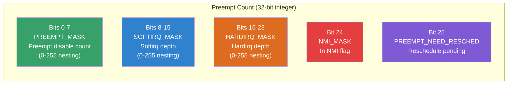
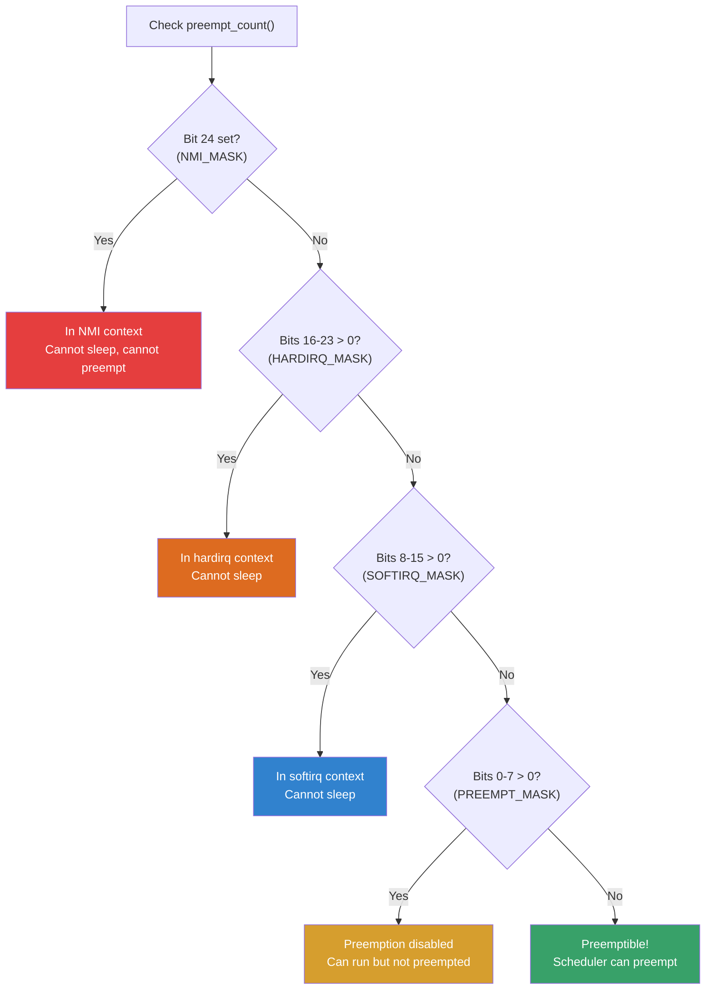
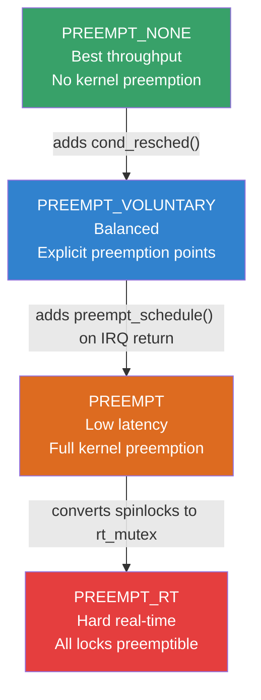
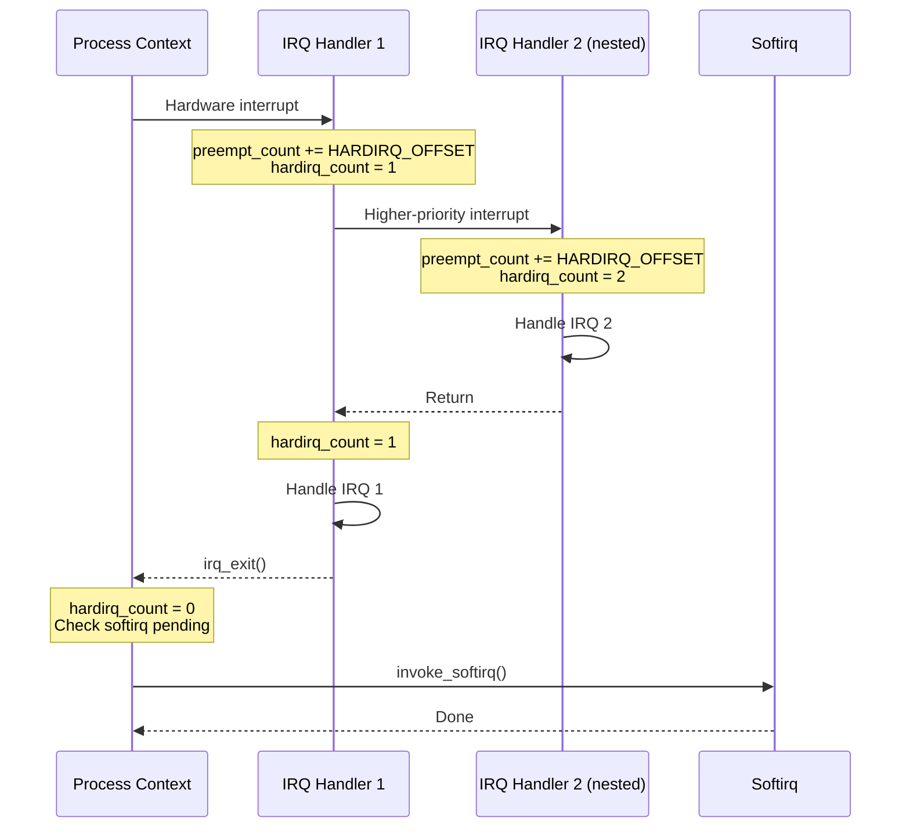
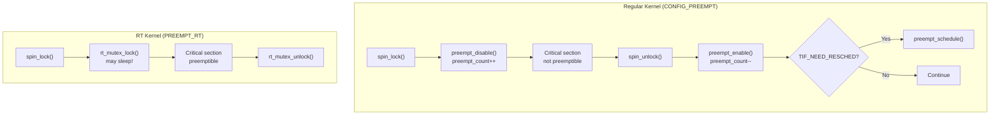

# Preempt Count

## Overview

The preempt count is a per-CPU variable that tracks whether the current context is allowed to be preempted by a higher-priority task. It is the fundamental mechanism behind Linux's preemption model, controlling when the scheduler can interrupt a running task. The preempt count is a composite counter that encodes multiple context levels — normal preemption disable, softirq context, hardirq context, and NMI context — into a single integer.

Understanding the preempt count is essential for kernel developers working on synchronization primitives, interrupt handlers, and any code that must not be preempted.

## The Preempt Count Variable

Each CPU maintains a preempt count in its per-CPU area:

```c
/* include/asm-generic/preempt.h */
DECLARE_PER_CPU(int, __preempt_count);

static __always_inline int preempt_count(void)
{
    return __this_cpu_read_4(__preempt_count);
}
```

The preempt count is a **bitmask-style** composite value. Different bit ranges track different context levels:

```
Bits 0-7:   PREEMPT_MASK    — Normal preemption disable count
Bits 8-15:  SOFTIRQ_MASK    — Softirq context depth
Bits 16-23: HARDIRQ_MASK    — Hardirq (interrupt) context depth
Bit  24:    NMI_MASK        — NMI context flag
Bit  25:    PREEMPT_NEED_RESCHED — Pending reschedule
```

### Bit Layout Diagram



### Mask Constants

```c
/* include/linux/preempt.h */
#define PREEMPT_MASK    0x000000ff
#define SOFTIRQ_MASK    0x0000ff00
#define HARDIRQ_MASK    0x00ff0000
#define NMI_MASK        0x01000000
#define PREEMPT_BITS    8
#define SOFTIRQ_BITS    8
#define HARDIRQ_BITS    8
#define NMI_BITS        1

/* Offsets for each field */
#define PREEMPT_OFFSET  (1UL << PREEMPT_BITS)
#define SOFTIRQ_OFFSET  (1UL << SOFTIRQ_BITS)
#define HARDIRQ_OFFSET  (1UL << HARDIRQ_BITS)
#define NMI_OFFSET      (1UL << NMI_BITS)
```

### Checking Context

```c
/* Is preemption disabled? */
static __always_inline bool preemptible(void)
{
    return preempt_count() == 0 && !irqs_disabled();
}

/* Are we in interrupt context? */
#define in_interrupt()  (preempt_count() & (HARDIRQ_MASK | SOFTIRQ_MASK | NMI_MASK))

/* Are we in a hardirq? */
#define in_irq()        (preempt_count() & HARDIRQ_MASK)

/* Are we in a softirq? */
#define in_softirq()    (preempt_count() & SOFTIRQ_MASK)

/* Are we in NMI? */
#define in_nmi()        (preempt_count() & NMI_MASK)
```

### Context Decision Flowchart



## preempt_disable() and preempt_enable()

These are the primary APIs for controlling preemption in process context:

```c
/* include/linux/preempt.h */
#define preempt_disable() \
do { \
    preempt_count_inc(); \
    barrier(); \
} while (0)

#define preempt_enable() \
do { \
    barrier(); \
    preempt_count_dec(); \
    preempt_check_resched(); \
} while (0)
```

### How preempt_disable Works

1. Increments the preempt count (bits 0-7)
2. The `barrier()` prevents compiler reordering across the disable/enable boundary
3. While preempt count > 0, `preempt_schedule()` will not be called on return to kernel

### How preempt_enable Works

1. The `barrier()` ensures all protected work is complete before re-enabling
2. Decrements the preempt count
3. Calls `preempt_check_resched()` which checks if rescheduling is needed

### preempt_check_resched

```c
/* include/linux/preempt.h */
#define preempt_check_resched() \
do { \
    if (unlikely(test_thread_flag(TIF_NEED_RESCHED))) \
        preempt_schedule(); \
} while (0)
```

If `TIF_NEED_RESCHED` is set (another task needs the CPU), `preempt_schedule()` is called to perform the context switch immediately.

### Nesting

preempt_disable/enable can be nested:

```c
preempt_disable();  /* preempt_count = 1 */
preempt_disable();  /* preempt_count = 2 */
// Critical section — cannot be preempted
preempt_enable();   /* preempt_count = 1, still disabled */
preempt_enable();   /* preempt_count = 0, reschedule if needed */
```

The count ensures preemption is only re-enabled when the outermost `preempt_enable()` is reached.

### preempt_disable Notrace

For tracing code, a variant exists that doesn't appear in traces:

```c
preempt_disable_notrace();   /* Like preempt_disable, invisible to ftrace */
preempt_enable_notrace();    /* Like preempt_enable, invisible to ftrace */
```

Used in tracing infrastructure to avoid infinite recursion.

## preempt_schedule()

`preempt_schedule()` is the function called when the kernel needs to preempt the current task:

```c
/* kernel/sched/core.c */
asmlinkage __visible void __sched notrace preempt_schedule(void)
{
    if (likely(!preemptible()))  /* preempt_count > 0 or IRQs disabled */
        return;

    preempt_schedule_common();
}
```

### Key Behavior

- Only runs if preemption is actually enabled (preempt_count == 0, IRQs not disabled)
- Saves the current task's state
- Calls the scheduler to pick the next task
- Performs context switch
- Returns when the current task is scheduled again

### preempt_schedule_notrace

A variant that disables tracing during the preemption:

```c
asmlinkage __visible void __sched notrace preempt_schedule_notrace(void)
{
    if (likely(!preemptible()))
        return;

    // Disable tracing, call scheduler, re-enable tracing
}
```

Used in tracing code to avoid infinite recursion (tracing code preempting itself).

### preempt_schedule_irq

Called from the return-to-kernel path of interrupt handlers:

```c
/* kernel/sched/core.c */
asmlinkage __visible void __sched preempt_schedule_irq(void)
{
    /* Only if CONFIG_PREEMPT is enabled */
    if (likely(!preemptible()))
        return;

    /* Disable IRQs, call scheduler, restore IRQs */
    local_irq_disable();
    preempt_schedule_common();
    local_irq_enable();
}
```

## Preemption Models

Linux supports multiple preemption levels, configured at build time:

### CONFIG_PREEMPT_NONE

- No forced preemption in kernel mode
- Tasks run until they voluntarily yield, block, or return to userspace
- Lowest scheduling latency variance (best throughput)
- Default for server distributions
- Preempt count still tracks context but `preempt_schedule()` is rarely called

### CONFIG_PREEMPT_VOLUNTARY

- Adds explicit preemption points (`might_resched()`, `cond_resched()`)
- Checked in long-running kernel code paths
- Moderate latency improvement
- Good balance of throughput and latency

### CONFIG_PREEMPT

- Any code running in process context can be preempted (except when preempt_disable is active)
- Lowest scheduling latency
- Used for real-time and desktop kernels
- `preempt_schedule()` is called on every return from interrupt and syscall

### CONFIG_PREEMPT_RT (PREEMPT_RT)

- All spinlocks become preemptible (converted to rt_mutex)
- All interrupt handlers run as threads
- Maximum real-time determinism
- Requires RT-patched kernel
- Softirqs run in threads, enabling full preemption

### Preemption Model Comparison



### Performance Characteristics

| Model | Worst-case latency | Throughput | Use case |
|-------|-------------------|------------|----------|
| PREEMPT_NONE | ~10ms | Best | Servers, batch processing |
| PREEMPT_VOLUNTARY | ~1ms | Good | Desktop, interactive |
| PREEMPT | ~100µs | Moderate | Real-time, low-latency audio |
| PREEMPT_RT | ~50µs | Lower | Industrial control, hard RT |

## Softirq Context

When the kernel is executing a softirq, the preempt count has `SOFTIRQ_MASK` bits set:

### Entering Softirq

```c
/* kernel/softirq.c */
asmlinkage __visible void __softirq_entry __do_softirq(void)
{
    // Set softirq context
    __local_bh_disable_ip(_RET_IP_, SOFTIRQ_OFFSET);

    // Process pending softirqs
    while ((softirq_bit = ffs(pending))) {
        // Call the softirq handler
        h->action(h);
    }

    // Clear softirq context
    __local_bh_enable();
}
```

### softirq_count()

```c
#define softirq_count() (preempt_count() & SOFTIRQ_MASK)
#define in_softirq()    (softirq_count())
```

### local_bh_disable/enable

These disable bottom halves (softirqs) by incrementing the softirq portion of the preempt count:

```c
static inline void local_bh_disable(void)
{
    __local_bh_disable_ip(_THIS_IP_, SOFTIRQ_DISABLE_OFFSET);
}

static __always_inline void __local_bh_disable_ip(unsigned long ip, unsigned int cnt)
{
    preempt_count_add(cnt);
    barrier();
}
```

The `SOFTIRQ_DISABLE_OFFSET` (0x00ffff00) adds to the softirq bits, preventing softirq processing on this CPU.

### Why Softirq Context Matters

- Softirqs run with preemption disabled (`in_softirq()` returns true)
- Softirqs cannot sleep
- Process context code can check `in_softirq()` to know if it's safe to sleep
- `GFP_KERNEL` allocations in softirq context will cause warnings

### softirq Context Example

```c
/* Safe pattern for code that may run in softirq context */
void *my_alloc(size_t size)
{
    /* Use GFP_ATOMIC in interrupt/softirq context */
    if (in_softirq())
        return kmalloc(size, GFP_ATOMIC);
    else
        return kmalloc(size, GFP_KERNEL);
}
```

## Hardirq Context

Hardware interrupt handlers set the hardirq bits in the preempt count:

```c
#define hardirq_count() (preempt_count() & HARDIRQ_MASK)
#define in_irq()        (hardirq_count())
```

### Entering Hardirq

```c
/* arch/x86/kernel/irq.c */
__visible void __irq_entry do_IRQ(struct pt_regs *regs)
{
    // Increment hardirq count
    irq_enter();

    // Handle the interrupt
    handle_irq(desc, regs);

    // Decrement hardirq count
    irq_exit();
}
```

### irq_enter/irq_exit

```c
#define irq_enter() \
    preempt_count_add(HARDIRQ_OFFSET)

#define irq_exit() \
    preempt_count_sub(HARDIRQ_OFFSET); \
    if (!in_interrupt() && local_softirq_pending()) \
        invoke_softirq();  /* Process softirqs if bottom of interrupt stack */
```

`irq_exit()` checks if softirqs are pending and, if we're returning from the last nested interrupt, invokes softirq processing.

### IRQ Nesting



## NMI Context

Non-Maskable Interrupts set the NMI bit:

```c
#define nmi_count() (preempt_count() & NMI_MASK)
#define in_nmi()    (nmi_count())
```

NMIs have the highest priority and can interrupt any other context including hardirq handlers. The NMI watchdog and perf use NMI context.

### NMI Limitations

- Cannot acquire spinlocks (may deadlock with interrupted code)
- Cannot access most per-CPU data safely
- Limited stack space
- Must be extremely careful with locking

```c
/* NMI-safe code must use special locking */
void nmi_handler(void)
{
    /* Cannot use regular spin_lock() */
    /* Use raw_spin_lock() or lock-free techniques */
    /* Access per-CPU data via this_cpu_ptr() only if sure
       we're not interrupting another per-CPU access */
}
```

## Preempt Count and Scheduling

The scheduler uses the preempt count to determine if preemption is safe:

```c
/* kernel/sched/core.c */
static __always_inline bool need_resched(void)
{
    return unlikely(tif_need_resched());
}

asmlinkage __visible void __sched notrace preempt_schedule(void)
{
    if (likely(!preemptible()))
        return;
    preempt_schedule_common();
}
```

A task can only be preempted when:
1. `preempt_count() == 0` (not in any disabled/nested context)
2. IRQs are not disabled (`!irqs_disabled()`)
3. `TIF_NEED_RESCHED` is set

### When TIF_NEED_RESCHED Is Set

The scheduler sets this flag when:
- A higher-priority task becomes runnable (e.g., wakes up from sleep)
- The current task's time slice expires (for SCHED_RR / EEVDF)
- A SCHED_FIFO task yields
- Load balancing moves a task to this CPU

```c
/* kernel/sched/core.c */
static void check_preempt_wakeup(struct rq *rq, struct task_struct *p, int wake_flags)
{
    struct task_struct *curr = rq->curr;

    if (p->prio < curr->prio)  /* Higher priority task */
        resched_curr(rq);      /* Set TIF_NEED_RESCHED */
}

void resched_curr(struct rq *rq)
{
    struct task_struct *curr = rq->curr;

    if (test_tsk_need_resched(curr))
        return;  /* Already set */

    set_tsk_need_resched(curr);  /* Set TIF_NEED_RESCHED */
    set_preempt_need_resched();   /* Also in preempt count */
}
```

## Debugging Preemption Issues

### Preemption Debugging Options

```bash
# Kernel config options for debugging
CONFIG_DEBUG_PREEMPT=y       # Warn on incorrect preempt_disable/enable usage
CONFIG_PREEMPT_TRACER=y      # Trace preemption events
CONFIG_SCHED_TRACER=y        # Trace scheduling events
```

### Common Bugs

#### 1. Sleeping with Preemption Disabled

```c
preempt_disable();
kmalloc(size, GFP_KERNEL);  // BUG: GFP_KERNEL can sleep!
preempt_enable();
```

**Detection**: `CONFIG_DEBUG_ATOMIC_SLEEP` will warn.

#### 2. Unbalanced preempt_disable/enable

```c
preempt_disable();
preempt_disable();
preempt_enable();
preempt_enable();
preempt_enable();  // BUG: extra enable, preempt_count underflows
```

**Detection**: `CONFIG_DEBUG_PREEMPT` will warn.

#### 3. Preemption in Interrupt Context

```c
irqreturn_t my_handler(int irq, void *dev_id)
{
    mutex_lock(&my_mutex);  // BUG: cannot sleep in interrupt!
    // ...
    mutex_unlock(&my_mutex);
    return IRQ_HANDLED;
}
```

**Detection**: `CONFIG_DEBUG_ATOMIC_SLEEP` will warn on sleep in interrupt.

#### 4. Missing preempt_enable

```c
void my_function(void)
{
    preempt_disable();
    /* ... do work ... */
    if (error)
        return;  // BUG: forgot preempt_enable()!
    preempt_enable();
}
```

**Detection**: Lockdep may detect the imbalance; `CONFIG_DEBUG_PREEMPT` checks for negative counts.

### Tracing Preemption

```bash
# Enable preemption tracer
echo preemptoff > /sys/kernel/debug/tracing/current_tracer

# Or latency format
echo preemptirqsoff > /sys/kernel/debug/tracing/current_tracer

# Set threshold for reporting
echo 100 > /sys/kernel/debug/tracing/tracing_thresh  # 100µs

# View trace
cat /sys/kernel/debug/tracing/trace

# Example output:
#           <...>-1234  [001] d..1  1234.567890: preempt_disable: caller=spin_lock+0x1a/0x30
#           <...>-1234  [001] d..2  1234.567891: preempt_enable: caller=spin_unlock+0x1e/0x40
# Latency: 1µs
```

### Checking Preempt Count Programmatically

```c
/* In kernel code */
printk("preempt_count = %d\n", preempt_count());
printk("in_irq = %d, in_softirq = %d, in_nmi = %d\n",
       in_irq(), in_softirq(), in_nmi());
printk("preemptible = %d\n", preemptible());
```

```bash
# From userspace, check a task's preemption state
cat /proc/<pid>/status | grep voluntary
# voluntary_ctxt_switches: 12345
# nonvoluntary_ctxt_switches: 678

# The nonvoluntary count reflects preemption events
```

## Performance Implications

- `preempt_disable/enable` is extremely cheap (single memory increment/decrement)
- Preemption itself (context switch) has overhead: TLB flush, cache pollution, ~2-5µs
- Excessive preemption can hurt throughput due to context switch overhead
- Too little preemption can hurt latency (tasks waiting for long kernel paths)
- The chosen preemption model represents a fundamental throughput/latency tradeoff

### Measuring Preemption Latency

```bash
# Use cyclictest to measure worst-case preemption latency
sudo cyclictest -m -p 80 -i 1000 -l 10000

# Output:
# T: 0 (12345) P:80 I:1000 C:  10000 Min:      1 Act:    3 Avg:    2 Max:      15
# Min/Act/Avg/Max latency in microseconds

# Compare preemption models:
# PREEMPT_NONE:   Max: 5000-10000µs
# PREEMPT:        Max: 50-200µs
# PREEMPT_RT:     Max: 10-50µs
```

## Relationship to spin_lock/spin_unlock

Spinlocks disable preemption on non-RT kernels:

```c
/* include/linux/spinlock_api_smp.h */
static inline unsigned long _spin_lock_irqsave(spinlock_t *lock)
{
    unsigned long flags;
    local_irq_save(flags);
    preempt_disable();
    spin_acquire(&lock->dep_map, 0, 0, _RET_IP_);
    // ...
    return flags;
}
```

On `PREEMPT_RT`, spinlocks are converted to sleeping locks (rt_mutex), and preemption is not disabled. This is the key difference enabling real-time behavior.

### spin_lock and preempt_count Interaction



## Further Reading

- **Kernel documentation**: `Documentation/locking/preempt-locking.rst`
- **Kernel documentation**: `Documentation/preempt-locking.rst`
- **LWN article**: ["Anatomy of a preemptive kernel"](https://lwn.net/Articles/97328/)
- **LWN article**: ["A preemptive kernel"](https://lwn.net/Articles/23634/)
- **Robert Love's book**: "Linux Kernel Development" — Chapter on Process Scheduling
- **Source**: `include/linux/preempt.h` — preempt_disable/enable definitions
- **Source**: `kernel/sched/core.c` — preempt_schedule implementation
- **Source**: `kernel/softirq.c` — softirq context handling
- **Source**: `kernel/irq/handle.c` — irq_enter/irq_exit definitions
- **Related**: [Spinlocks](../sync/spinlock.md) — locks that disable preemption
- **Related**: [RCU](../sync/rcu.md) — read-copy-update and preemption
- **Related**: [IRQ Handling](../irq/irq-handling.md) — interrupt context
