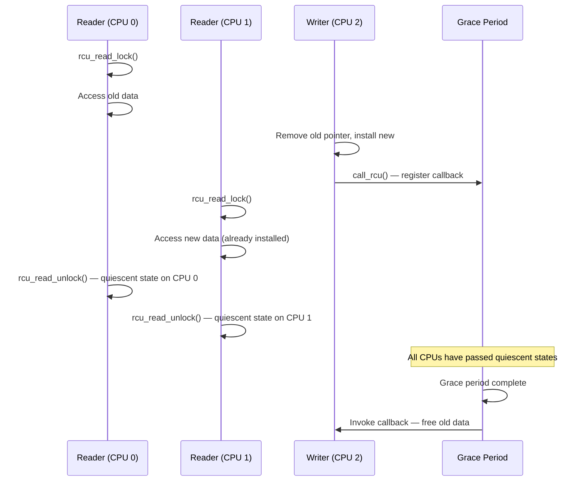
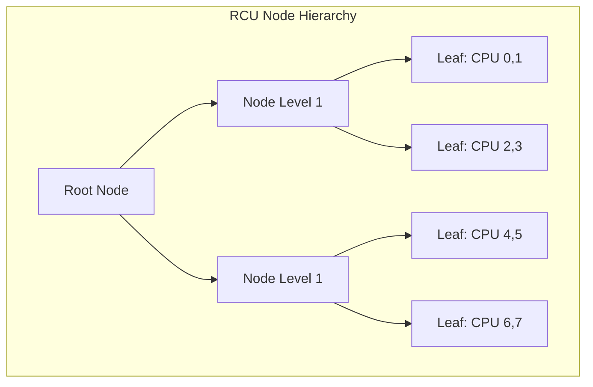
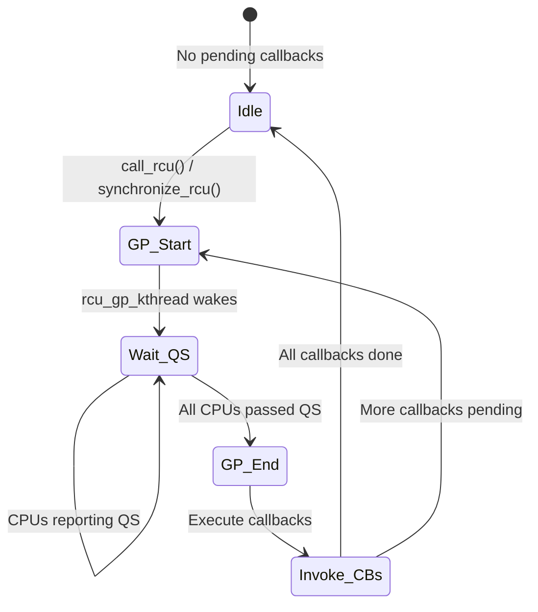

# RCU (Read-Copy-Update)

## Introduction

RCU (Read-Copy-Update) is one of the most innovative synchronization mechanisms in the Linux kernel. It provides **lock-free read-side access** to shared data structures, with the cost of synchronization deferred to the update (write) side. RCU is optimized for the common case: many readers and infrequent writers.

RCU achieves this by exploiting a simple insight: if you never modify data in place, readers don't need locks. Instead, writers create a new copy of the data, modify it, and atomically swap the pointer. The old version is kept alive until all readers that might still be referencing it have finished — this waiting period is called a **grace period**.

RCU is used extensively in the Linux kernel — networking (routing tables, netfilter rules), filesystems (dentry cache, mount tables), process management (`task_struct`), and the scheduler. It is arguably the most complex synchronization mechanism in the kernel, but also one of the most effective.

## Core Concepts

### Read-Side Critical Sections

RCU read-side critical sections are delimited by `rcu_read_lock()` and `rcu_read_unlock()`:

```c
rcu_read_lock();
/* Read-side critical section — no sleeping! */
ptr = rcu_dereference(global_ptr);
do_something(ptr);
rcu_read_unlock();
```

**Key properties:**

- `rcu_read_lock()` / `rcu_read_unlock()` are essentially free — they disable and re-enable preemption (or are even no-ops in some configurations)
- They do **not** acquire any lock — multiple readers can execute concurrently
- They **cannot sleep** (but can be preempted in `PREEMPT_RCU` mode)
- They are **nestable** (but avoid excessive nesting for clarity)

### Grace Periods

A **grace period** is a time interval during which every CPU in the system has passed through a quiescent state — a point where it is not inside an RCU read-side critical section. Once a grace period completes, it is safe to free any data that was removed from a shared structure before the grace period started.



### Quiescent States

A quiescent state for a CPU is any point where the CPU is **not** in an RCU read-side critical section. Specific quiescent states include:

- Returning to user space from a system call
- Executing the idle loop
- Context switching (in `PREEMPT_RCU` mode)
- Entering a CPU offline state

The RCU subsystem detects quiescent states through periodic callbacks and context-switch hooks.

## RCU API Reference

### Read-Side

```c
/* Enter/exit RCU read-side critical section */
rcu_read_lock();
rcu_read_unlock();

/* Non-preemptible variant (used in softirq/irq context) */
rcu_read_lock_bh();
rcu_read_unlock_bh();

/* For sched-RCU (preemption disabled) */
rcu_read_lock_sched();
rcu_read_unlock_sched();
```

### Dereferencing RCU-Protected Pointers

```c
/* Safely read an RCU-protected pointer */
ptr = rcu_dereference(global_ptr);

/* For assignments (publish side) */
rcu_assign_pointer(global_ptr, new_ptr);
```

`rcu_dereference()` is critical — it ensures the CPU reads the pointer first, then reads the data it points to (prevents the compiler and CPU from reordering the loads). On weakly-ordered architectures, it includes a memory barrier.

`rcu_assign_pointer()` is the write-side counterpart — it ensures the new data is fully initialized before the pointer is published to readers.

### Update-Side: Synchronous Waiting

```c
/* Wait for a grace period to complete (blocking) */
synchronize_rcu();
```

`synchronize_rcu()` blocks the calling task until all currently-executing RCU read-side critical sections have completed. This is the simplest way to ensure safe reclamation.

**Note**: `synchronize_rcu()` can sleep. Do not call it from interrupt context.

### Update-Side: Asynchronous Callbacks

```c
/* Register a callback to be invoked after a grace period */
void call_rcu(struct rcu_head *head, rcu_callback_t func);

struct rcu_head {
    struct rcu_head *next;
    rcu_callback_t func;
};

/* Example */
struct my_data {
    struct rcu_head rcu;
    int value;
};

static void my_rcu_callback(struct rcu_head *head)
{
    struct my_data *old = container_of(head, struct my_data, rcu);
    kfree(old);
}

void update_data(struct my_data *new_data)
{
    struct my_data *old;

    old = rcu_dereference_protected(global_data,
                                     lock_is_held(&update_lock));
    rcu_assign_pointer(global_data, new_data);
    call_rcu(&old->rcu, my_rcu_callback);  /* Free after grace period */
}
```

`call_rcu()` is non-blocking — it queues the callback and returns immediately. The callback is invoked after the next grace period completes.

### Update-Side: kfree_rcu (Simplified)

For the common case of "free this structure after a grace period":

```c
/* Shortcut: no callback needed */
kfree_rcu(old_data, rcu);

/* Where 'rcu' is a struct rcu_head field in the structure */
```

## Complete RCU Example: Linked List

```c
#include <linux/module.h>
#include <linux/rculist.h>
#include <linux/slab.h>

struct my_entry {
    struct rcu_head rcu;
    struct list_head list;
    int key;
    int value;
};

LIST_HEAD(my_list);
DEFINE_MUTEX(list_mutex);

/* Reader — no locks needed (beyond RCU read-side) */
int lookup_value(int key)
{
    struct my_entry *entry;
    int result = -ENOENT;

    rcu_read_lock();
    list_for_each_entry_rcu(entry, &my_list, list) {
        if (entry->key == key) {
            result = entry->value;
            break;
        }
    }
    rcu_read_unlock();

    return result;
}

/* Writer — must hold the mutex */
int add_entry(int key, int value)
{
    struct my_entry *entry;

    entry = kmalloc(sizeof(*entry), GFP_KERNEL);
    if (!entry)
        return -ENOMEM;

    entry->key = key;
    entry->value = value;

    mutex_lock(&list_mutex);
    list_add_rcu(&entry->list, &my_list);
    mutex_unlock(&list_mutex);

    return 0;
}

/* Writer — remove and free */
int remove_entry(int key)
{
    struct my_entry *entry;
    bool found = false;

    mutex_lock(&list_mutex);
    list_for_each_entry(entry, &my_list, list) {
        if (entry->key == key) {
            list_del_rcu(&entry->list);
            found = true;
            break;
        }
    }
    mutex_unlock(&list_mutex);

    if (found)
        kfree_rcu(entry, rcu);

    return found ? 0 : -ENOENT;
}
```

### Key rculist Functions

```c
/* Add to list (write-side, with lock held) */
list_add_rcu(new, head);
list_add_tail_rcu(new, head);

/* Delete from list (write-side, with lock held) */
list_del_rcu(entry);

/* Iterate (read-side, under rcu_read_lock) */
list_for_each_entry_rcu(pos, head, member);

/* Replace entry (write-side, with lock held) */
list_replace_rcu(old, new);
```

## RCU Variants

### Tree RCU (rcutree)

The default RCU implementation in Linux is **Tree RCU** (`CONFIG_TREE_RCU`). It uses a tree-structured hierarchy to efficiently detect grace periods across large numbers of CPUs:



Each node tracks which of its children have reported a quiescent state. When all leaves under the root have reported, the grace period is complete. This O(log N) structure is far more scalable than the old global flag approach.

Tree RCU uses a tree of `rcu_node` structures. Each leaf node covers a small group of CPUs (typically 16-64 depending on `CONFIG_RCU_FANOUT`). The tree depth is `O(log N)` where N is the number of CPUs. Grace period detection proceeds bottom-up:

```c
/* kernel/rcu/tree.h */
struct rcu_node {
    raw_spin_lock_t lock;
    unsigned long gp_seq;           /* Grace period sequence number */
    unsigned long qsmask;           /* Bitmask of CPUs that haven't reported QS */
    unsigned long qsmaskinit;       /* Initial mask (all online CPUs) */
    struct rcu_node *parent;        /* Parent node in tree */
    /* ... */
};

struct rcu_data {
    unsigned long gp_seq;           /* Last seen grace period number */
    bool cpu_no_qs;                 /* CPU hasn't been in quiescent state */
    struct rcu_node *mynode;        /* Leaf node this CPU belongs to */
    /* ... */
};
```

Grace period detection flow:
1. `rcu_gp_kthread` starts a new grace period (increments global `gp_seq`)
2. Each CPU reports quiescent states via `rcu_note_context_switch()` or `rcu_idle_enter()`
3. When a CPU reports QS, its bit is cleared in the leaf `rcu_node->qsmask`
4. When all bits in a leaf are cleared, the leaf reports to its parent
5. When all bits in the root are cleared, the grace period is complete
6. Callbacks registered before the grace period are now safe to invoke

### Classic RCU vs Preemptible RCU

| Variant | Config | Quiescent State | Preemptible? |
|---------|--------|-----------------|-------------|
| Classic RCU | `CONFIG_TREE_RCU` | Context switch, idle, user-space | No (rcu_read_lock disables preemption) |
| Preemptible RCU | `CONFIG_TREE_PREEMPT_RCU` | Context switch, idle | Yes (read-side can be preempted) |
| Tasks RCU | `CONFIG_TASKS_RCU` | Context switch | Yes |

With `PREEMPT_RCU`, readers can be preempted, and the grace period must track individual tasks rather than just CPU quiescent states.

### Sleepable RCU (SRCU)

Standard RCU read-side critical sections cannot sleep. **SRCU** provides a variant that allows sleeping:

```c
/* SRCU read-side */
int idx;
idx = srcu_read_lock(&my_srcu);
/* Can sleep here! */
msleep(100);
process_data();
srcu_read_unlock(&my_srcu, idx);

/* SRCU synchronize */
synchronize_srcu(&my_srcu);

/* SRCU callback */
call_srcu(&my_srcu, &head, callback);
```

SRCU domains are independent — a grace period in one SRCU domain does not affect another. This provides more isolation but at the cost of higher overhead per grace period.

### Tasks RCU

Tasks RCU (`CONFIG_TASKS_RCU`) considers voluntary context switches as quiescent states. It is used for tasks tracing (trampolines, etc.) and does not require that readers use any RCU API.

### Tasks Trace RCU

Tasks Trace RCU (`CONFIG_TASKS_TRACE_RCU`) is used by BPF programs. It waits for all tasks to pass through a context switch.

### RCU Flavor Summary

| Flavor | Read-Side API | Quiescent State | Can Sleep? | Use Case |
|--------|--------------|-----------------|------------|----------|
| Classic RCU | `rcu_read_lock()` | Context switch, idle, user-space | No | General read-mostly data |
| Preemptible RCU | `rcu_read_lock()` | Context switch, idle | Yes (preempted) | PREEMPT kernels |
| SRCU | `srcu_read_lock()` | `synchronize_srcu()` | Yes | Sleepable read-side |
| Tasks RCU | (none) | Voluntary context switch | N/A | Trampolines, BPF |
| Tasks Trace RCU | (none) | Context switch | N/A | BPF tracing |

## Memory Ordering with RCU

RCU provides specific memory ordering guarantees:

### Publish/Subscribe Pattern

```c
/* Writer: publish new structure */
new->field1 = value1;
new->field2 = value2;
smp_wmb();              /* Ensure fields are visible before pointer */
rcu_assign_pointer(global_ptr, new);  /* Includes smp_wmb() */

/* Reader: subscribe and read */
rcu_read_lock();
p = rcu_dereference(global_ptr);     /* Includes smp_read_barrier_depends() */
if (p) {
    /* Guaranteed to see field1 and field2 as set by the writer */
    do_something(p->field1, p->field2);
}
rcu_read_unlock();
```

The key guarantee: if a reader sees the new pointer via `rcu_dereference()`, it will also see all the writes that happened before `rcu_assign_pointer()` on the writer side.

### Memory Barriers

```c
/* rcu_assign_pointer includes a store-release barrier */
rcu_assign_pointer(gp, p);
/* Equivalent to:
 *   smp_store_release(&gp, p);
 */

/* rcu_dereference includes a data-dependency barrier */
p = rcu_dereference(gp);
/* Equivalent to (on weakly-ordered archs):
 *   p = READ_ONCE(gp);
 *   smp_read_barrier_depends();  // only needed on Alpha
 */
```

## Grace Period Detection

### Quiescent State Reporting

Each CPU periodically reports quiescent states to the RCU subsystem:

```c
/* Called from scheduler (context switch) */
rcu_note_context_switch(int cpu);

/* Called from idle loop */
rcu_idle_enter();
rcu_idle_exit();

/* Called when entering/leaving user space */
rcu_user_enter();
rcu_user_exit();
```

### The rcu_gp_kthread

The `rcu_gp_kthread` kernel thread manages grace periods:

```bash
$ ps -eo pid,comm | grep rcu
   10 rcu_preempt
   11 rcu_sched
   12 rcu_bh
```

It wakes up when a grace period is requested, waits for all CPUs to report quiescent states, then invokes callbacks registered with `call_rcu()`.

### Expedited Grace Periods

Standard grace periods rely on CPUs passing through quiescent states naturally (context switches, idle entry, user-space entry). **Expedited grace periods** force quiescent states by sending IPIs to all CPUs:

```c
/* Force all CPUs through a quiescent state (fast but disruptive) */
synchronize_rcu_expedited();

/* Global flag to make all grace periods expedited */
rcu_expedite_gp();
rcu_unexpedite_gp();

/* Or boot with rcu_expedited on kernel command line */
```

Expedited grace periods complete in microseconds rather than milliseconds, but at the cost of interrupting every CPU. They are useful for latency-sensitive teardown paths (e.g., module unload, filesystem unmount).

**Performance trade-off:**

| Type | Typical Latency | CPU Disruption | Use Case |
|------|----------------|----------------|----------|
| Normal GP | 4–20 ms | None (natural QS) | General RCU usage |
| Expedited GP | 10–100 µs | IPI to all CPUs | Module unload, unmount |

### RCU Grace Period State Machine



### Callback Offloading

To reduce the overhead of invoking RCU callbacks on each CPU, the kernel supports **callback offloading**. This moves callback invocation to per-CPU rcuo kthreads, reducing jitter on the originating CPU:

```bash
# Enable callback offloading for all CPUs
# Boot parameter: rcu_nocbs=0-15
# Or per-CPU:
for cpu in /sys/devices/system/cpu/cpu*/rcu; do
    echo 1 > $cpu 2>/dev/null
done

# Check offloading status
ps -eo pid,comm | grep rcuo
# rcuop/0, rcuop/1, ...
```

Callback offloading is critical for real-time and low-latency workloads where RCU callback invocation on the target CPU would cause unacceptable jitter.

### RCU Priority Boosting

When a reader holds an RCU read-side lock for too long, grace periods are delayed. The kernel can **priority-boost** the offending task to expedite the grace period:

```c
/* CONFIG_RCU_BOOST=y enables priority boosting */
/* Boosted tasks run at a higher RT priority */
/* Controlled by /sys/module/rcupdate/parameters/rcu_kick_kthreads */
```

This is particularly important for `PREEMPT_RCU` configurations where readers can be preempted.

## RCU Performance Characteristics

### Read Side

| Operation | Overhead |
|-----------|----------|
| `rcu_read_lock()` | Near-zero (preempt_disable) |
| `rcu_dereference()` | One compiler barrier (x86), one memory barrier (ARM) |
| `rcu_read_unlock()` | Near-zero (preempt_enable) |

RCU read-side is essentially free — no atomic operations, no memory barriers (on x86), no cache-line bouncing. This is why RCU scales perfectly with the number of readers.

### Update Side

| Operation | Overhead |
|-----------|----------|
| `call_rcu()` | Queue callback (fast, non-blocking) |
| `synchronize_rcu()` | Wait for grace period (milliseconds) |
| `kfree_rcu()` | Queue callback (fast, non-blocking) |

Grace periods typically take a few milliseconds, but can take longer under heavy load.

## RCU Debugging

### CONFIG_RCU_TRACE

```bash
# RCU trace events
$ sudo cat /sys/kernel/debug/tracing/events/rcu/enable
$ echo 1 > /sys/kernel/debug/tracing/events/rcu/enable

$ cat /sys/kernel/debug/tracing/trace_pipe
  rcu_preempt-10 [000] d..1  1234.567: rcu_grace_period: rcu_preempt 1234 1234 g 0 cp 0
```

### RCU Stall Detection

If a grace period takes too long (default 21 seconds), the kernel detects an **RCU stall** and prints diagnostic information:

```
INFO: rcu_preempt detected stall on CPU
    2-...!: (1 GPs behind) idle=xxx softirq=xxx fqs=xxx
    (detected by 0, t=21003 jiffies, g=1234, c=1233, q=456)
```

Common causes of RCU stalls:
- Bug: RCU read-side critical section is too long (e.g., infinite loop under `rcu_read_lock()`)
- Hardware: CPU stuck in a tight loop with interrupts disabled
- Heavy load: Too many RCU callbacks queued

### /sys/kernel/debug/rcu

```bash
$ sudo ls /sys/kernel/debug/rcu/
rcu_preempt/    rcu_sched/     rcu_bh/

$ sudo cat /sys/kernel/debug/rcu/rcu_preempt/rcudata
CPU  0:  0  0  0  0  0  0  0  0  0  0  0  0  0  0  0  0
```

### RCU sysfs and Kernel Parameters

```bash
# Kernel boot parameters for RCU tuning
# rcupdate.rcu_self_test=1        — Run RCU self-tests at boot
# rcupdate.rcu_cpu_stall_timeout=21 — Stall detection timeout (seconds)
# rcu_nocbs=0-15                   — Offload callbacks to rcuo kthreads
# rcu_expedited=1                  — Make all GPs expedited
# rcu_normal=1                     — Never expedite (opposite of rcu_expedited)

# Runtime sysctl controls
sysctl kernel.rcu_task_stall_timeout  # Tasks RCU stall timeout
sysctl kernel.rcu_expedited           # Global expedited flag
sysctl kernel.rcu_normal              # Global normal-only flag

# Per-flavor RCU stall timeout
sysctl kernel.rcu_cpu_stall_timeout   # Default: 21 seconds
```

### RCU Diagnostic Tools

```bash
# Trace RCU grace periods
trace-cmd record -e rcu -e rcu_utilization
trace-cmd report | grep rcu

# Monitor RCU callback queues
cat /sys/kernel/debug/rcu/rcu_preempt/rcudata
# Shows per-CPU: qlen (queued), qlen_last_fqs (at last FQS),
#                 qovl (overflow), blimit (batch limit)

# RCU stall warnings in dmesg
dmesg | grep -i "rcu.*stall"

# Check RCU callback processing rate
perf stat -e 'rcu:rcu_utilization' -a sleep 5
```

## When to Use RCU

**Ideal for:**
- Read-mostly data structures (routing tables, configuration caches)
- Pointer-based data structures (linked lists, trees, hash tables)
- Scenarios with many concurrent readers and infrequent updates

**Not ideal for:**
- Write-heavy data structures (use spinlocks or mutexes)
- Simple counters (use `atomic_t` or per-CPU variables)
- Data that must be atomically updated with other data (use locks)

## RCU in Practice: Common Patterns

### Hash Table with RCU

RCU is commonly used to protect hash tables where lookups vastly outnumber insertions/deletions:

```c
#include <linux/hashtable.h>
#include <linux/rculist.h>

DEFINE_HASHTABLE(my_ht, 10);  /* 1024 buckets */
DEFINE_MUTEX(ht_mutex);

struct ht_entry {
    struct hlist_node node;\    struct rcu_head rcu;
    int key;
    int value;
};

/* Reader — lock-free lookup */
int ht_lookup(int key)
{
    struct ht_entry *entry;
    int result = -ENOENT;

    rcu_read_lock();
    hash_for_each_possible_rcu(my_ht, entry, node, key) {
        if (entry->key == key) {
            result = entry->value;
            break;
        }
    }
    rcu_read_unlock();
    return result;
}

/* Writer — requires mutex */
void ht_insert(int key, int value)
{
    struct ht_entry *entry = kmalloc(sizeof(*entry), GFP_KERNEL);
    entry->key = key;
    entry->value = value;
    mutex_lock(&ht_mutex);
    hash_add_rcu(my_ht, &entry->node, key);
    mutex_unlock(&ht_mutex);
}
```

### RCU-Protected Pointer Replacement (In-Place Update)

For simple cases where only one pointer needs updating:

```c
static struct config __rcu *global_config;

/* Reader */
void read_config(void)
{
    struct config *cfg;

    rcu_read_lock();
    cfg = rcu_dereference(global_config);
    if (cfg)
        pr_info("value = %d\n", cfg->value);
    rcu_read_unlock();
}

/* Writer */
void update_config(int new_value)
{
    struct config *old, *new;

    new = kmalloc(sizeof(*new), GFP_KERNEL);
    new->value = new_value;

    old = rcu_dereference_protected(global_config,
                                     lock_is_held(&config_mutex));
    rcu_assign_pointer(global_config, new);
    synchronize_rcu();  /* Wait for old readers */
    kfree(old);
}
```

## References

- [The Linux Kernel Documentation](https://docs.kernel.org/)
- [GNU Project Documentation](https://www.gnu.org/doc/doc.html)
- [GNU Manuals](https://www.gnu.org/manual/manual.html)
- [Free Software Directory](https://directory.fsf.org/wiki/Main_Page)
- [Planet GNU](https://planet.gnu.org/)
- [Free Software Books](https://www.gnu.org/doc/other-free-books.html)

- [Linux Kernel Documentation: RCU](https://www.kernel.org/doc/html/latest/RCU/index.html)
- [Paul E. McKenney: "RCU Usage In the Linux Kernel: 18 Years Later"](https://lwn.net/Articles/777216/)
- [Paul E. McKenney: "What is RCU, Fundamentally?"](https://lwn.net/Articles/262464/)
- [Paul E. McKenney: "RCU part 3: the RCU API"](https://lwn.net/Articles/263130/)
- [Paul McKenney's RCU papers](https://www2.rdrop.com/users/paulmck/RCU/)
- [LWN: "Sleepable RCU"](https://lwn.net/Articles/202847/)
- [LWN: "The design of preemptible RCU"](https://lwn.net/Articles/253651/)

## Related Topics

- [Synchronization Overview](overview.md) — When and why locks are needed
- [Spinlocks](spinlocks.md) — Busy-wait locks
- [Mutexes](mutexes.md) — Sleeping locks
- [Atomic Operations](atomic-ops.md) — Memory barriers used by RCU
- [Seqlocks](seqlocks.md) — Another reader-optimized synchronization
- [Lockdep](lockdep.md) — RCU has its own lockdep annotations
