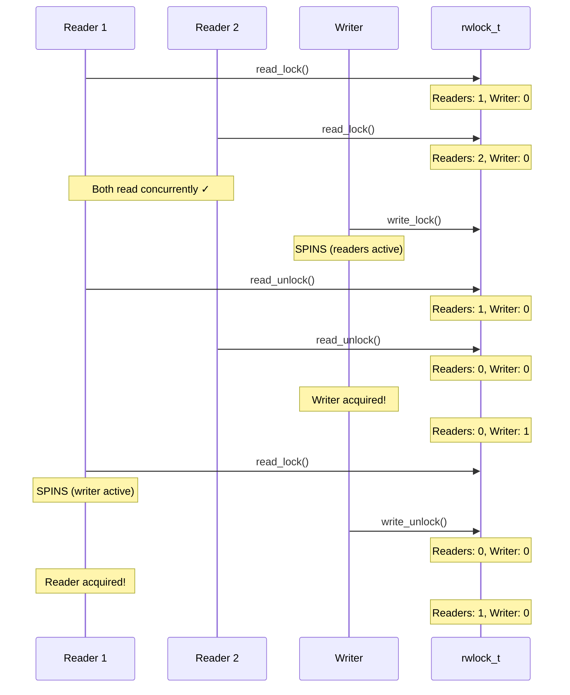
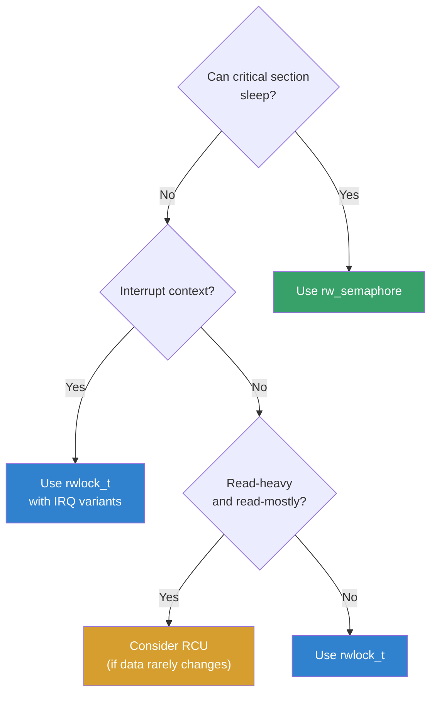

# Read-Write Locks

## Introduction

Read-write locks are synchronization primitives that allow **multiple concurrent readers** but only **one exclusive writer**. They are based on the observation that most data structures are read far more often than written, and allowing parallel reads significantly improves throughput on multi-core systems.

The Linux kernel provides two main read-write lock implementations:
- **`rwlock_t`**: Spin-based read-write locks (atomic operations, no sleeping)
- **`rw_semaphore`** (`struct rw_semaphore`): Sleeping read-write locks (tasks can block)

Additionally, the kernel offers **RCU (Read-Copy-Update)** as a lock-free alternative for read-heavy workloads, though RCU is a separate topic.

## rwlock_t — Spin-Based Read-Write Locks

`rwlock_t` is the spin-based variant. It disables preemption on the local CPU while held (like a regular `spinlock_t`), so critical sections must not sleep. It is implemented using an `arch_rwlock_t` containing a single `unsigned int` counter.

### Internal Representation

```c
/* include/linux/rwlock_types.h */
typedef struct {
    arch_rwlock_t raw_lock;
#ifdef CONFIG_DEBUG_LOCK_ALLOC
    struct lockdep_map dep_map;
#endif
} rwlock_t;

/* The raw lock is a simple 32-bit counter */
/* Unlocked state: 0x01000000 (RW_LOCK_BIAS) */
/* Each reader adds 1, writer subtracts RW_LOCK_BIAS */
/* This means up to 2^24 (~16M) concurrent readers */
```

### Count Encoding Detail

```c
/* How the 32-bit counter encodes lock state: */
/*
 * Bit layout (unlocked = 0x01000000):
 *   Bits [31:24] = 0x01 (bias marker)
 *   Bits [23:0]  = 0 (no readers)
 *
 * After read_lock() by 3 readers:
 *   0x01000003 = bias + 3 readers
 *
 * After write_lock():
 *   0x00000000 = bias - bias = 0
 *
 * write_trylock() uses atomic_sub_and_test(RW_LOCK_BIAS, &lock)
 * read_lock() uses atomic_dec_return() and checks sign
 */
```

### Declaration and Initialization

```c
#include <linux/rwlock.h>

/* Static initialization */
rwlock_t my_rwlock = __RW_LOCK_UNLOCKED(my_rwlock);

/* Dynamic initialization */
rwlock_t my_rwlock;
rwlock_init(&my_rwlock);
```

### Reader Operations

```c
/* Acquire read lock (spins until available) */
read_lock(&my_rwlock);
/* ... critical section (read-only, no sleeping) ... */
read_unlock(&my_rwlock);

/* Try to acquire (non-blocking) */
if (read_trylock(&my_rwlock)) {
    /* Got the lock */
    /* ... read ... */
    read_unlock(&my_rwlock);
} else {
    /* Lock held by writer, handle contention */
}

/* IRQ-safe variants */
read_lock_irq(&my_rwlock);           /* Disables IRQs */
read_unlock_irq(&my_rwlock);

read_lock_irqsave(&my_rwlock, flags); /* Saves and disables IRQs */
read_unlock_irqrestore(&my_rwlock, flags);

read_lock_bh(&my_rwlock);            /* Disables bottom halves */
read_unlock_bh(&my_rwlock);
```

### Writer Operations

```c
/* Acquire write lock (exclusive, spins until available) */
write_lock(&my_rwlock);
/* ... critical section (read-write, no sleeping) ... */
write_unlock(&my_rwlock);

/* Try to acquire (non-blocking) */
if (write_trylock(&my_rwlock)) {
    /* Got exclusive access */
    /* ... modify ... */
    write_unlock(&my_rwlock);
} else {
    /* Lock held by readers or another writer */
}

/* IRQ-safe variants */
write_lock_irq(&my_rwlock);
write_unlock_irq(&my_rwlock);

write_lock_irqsave(&my_rwlock, flags);
write_unlock_irqrestore(&my_rwlock, flags);

write_lock_bh(&my_rwlock);
write_unlock_bh(&my_rwlock);
```

### rwlock_t Usage Example

```c
#include <linux/module.h>
#include <linux/rwlock.h>
#include <linux/kthread.h>

static rwlock_t config_lock;
static int config_value = 0;

/* Reader thread — runs frequently */
static int reader_thread(void *data) {
    int id = (int)(long)data;
    int val;
    
    while (!kthread_should_stop()) {
        read_lock(&config_lock);
        val = config_value;
        read_unlock(&config_lock);
        
        pr_info("Reader %d: value = %d\n", id, val);
        msleep(100);
    }
    return 0;
}

/* Writer thread — runs rarely */
static int writer_thread(void *data) {
    while (!kthread_should_stop()) {
        write_lock(&config_lock);
        config_value++;
        pr_info("Writer: value now = %d\n", config_value);
        write_unlock(&config_lock);
        
        msleep(1000);  /* Write much less often than reads */
    }
    return 0;
}
```

## rw_semaphore — Sleeping Read-Write Locks

`struct rw_semaphore` is the sleeping variant. Tasks that can't acquire the lock are put to sleep (rather than spinning), making it suitable for critical sections that may take longer or need to sleep.

### Declaration and Initialization

```c
#include <linux/rwsem.h>

/* Static initialization */
static DECLARE_RWSEM(my_rwsem);

/* Dynamic initialization */
struct rw_semaphore my_rwsem;
init_rwsem(&my_rwsem);
```

### Reader Operations

```c
/* Acquire read lock (may sleep) */
down_read(&my_rwsem);
/* ... critical section (can sleep, can't write) ... */
up_read(&my_rwsem);

/* Non-interruptible (default — always sleeps until acquired) */
down_read(&my_rwsem);

/* Interruptible (returns -EINTR if signal received) */
if (down_read_interruptible(&my_rwsem)) {
    /* Interrupted by signal */
    return -ERESTARTSYS;
}

/* Killable (interruptible only by fatal signals) */
if (down_read_killable(&my_rwsem)) {
    /* Killed */
    return -EINTR;
}

/* Trylock (non-blocking) */
if (down_read_trylock(&my_rwsem)) {
    /* Got it */
    up_read(&my_rwsem);
} else {
    /* Contended */
}
```

### Writer Operations

```c
/* Acquire write lock (exclusive, may sleep) */
down_write(&my_rwsem);
/* ... critical section (read-write, can sleep) ... */
up_write(&my_rwsem);

/* Variants */
down_write_interruptible(&my_rwsem);
down_write_killable(&my_rwsem);
down_write_trylock(&my_rwsem);
```

### rw_semaphore Usage Example

```c
#include <linux/fs.h>
#include <linux/rwsem.h>

struct my_inode {
    struct rw_semaphore sem;
    char data[4096];
    size_t size;
};

/* Read operation */
ssize_t my_read(struct file *filp, char __user *buf,
                size_t count, loff_t *pos) {
    struct my_inode *inode = filp->private_data;
    ssize_t ret;
    
    down_read(&inode->sem);
    
    if (*pos >= inode->size) {
        ret = 0;  /* EOF */
        goto out;
    }
    
    count = min(count, inode->size - (size_t)*pos);
    if (copy_to_user(buf, inode->data + *pos, count)) {
        ret = -EFAULT;
        goto out;
    }
    
    *pos += count;
    ret = count;
    
out:
    up_read(&inode->sem);
    return ret;
}

/* Write operation */
ssize_t my_write(struct file *filp, const char __user *buf,
                 size_t count, loff_t *pos) {
    struct my_inode *inode = filp->private_data;
    ssize_t ret;
    
    down_write(&inode->sem);
    
    count = min(count, sizeof(inode->data) - (size_t)*pos);
    if (copy_from_user(inode->data + *pos, buf, count)) {
        ret = -EFAULT;
        goto out;
    }
    
    *pos += count;
    inode->size = max(inode->size, (size_t)*pos);
    ret = count;
    
out:
    up_write(&inode->sem);
    return ret;
}
```

## Read-Write Lock Behavior

### Concurrent Access Pattern



### Writer Starvation Prevention

The Linux rw_semaphore implementation uses a **writer-preference** policy (since Linux 3.16) to prevent writer starvation:

```c
/* In older kernels, readers could starve writers.
 * Modern rwsem uses optimistic spinning (like mutex)
 * and writer-preference queuing.
 */

/* rw_semaphore internals (simplified): */
struct rw_semaphore {
    atomic_long_t count;     /* Reader count + writer flag */
    struct list_head wait_list;
    raw_spinlock_t wait_lock;
    struct optimistic_spin_queue osq;  /* Optimistic spinning */
    struct task_struct *owner;         /* Current writer */
};
```

## rwlock_t vs rw_semaphore

| Feature | rwlock_t | rw_semaphore |
|---------|----------|-------------|
| Sleeping in critical section | **No** | **Yes** |
| Preemption | Disabled while held | Not disabled |
| Interrupt context | Yes | No |
| Trylock | Yes | Yes |
| IRQ-safe variants | Yes | No |
| Fairness | Writer-preference | Writer-preference (since 3.16) |
| Optimistic spinning | No | Yes (since 3.16) |
| Use case | Short atomic sections | Long sections, may sleep |

### Decision Guide



## Implementation Details

### rwlock_t Count Encoding

```c
/* rwlock_t uses a 32-bit counter:
 * Bits 0-29: Reader count (up to ~1 billion concurrent readers)
 * Bit 30:    Write-locked flag
 * Bit 31:    Write-pending flag (writer waiting)
 */

#define RW_LOCK_BIAS      0x01000000
#define RW_LOCK_BIAS_STR  "0x01000000"

/* Lock state: */
/* 0x01000000 = unlocked (bias value) */
/* 0x01000001 = 1 reader */
/* 0x00000000 = write-locked */
/* 0x00000001 = write-locked + 1 reader waiting */
```

### Optimistic Spinning (rw_semaphore)

Since Linux 3.16, rw_semaphore supports optimistic spinning, similar to mutex:

```c
/* When a writer can't acquire the rwsem:
 * 1. Instead of immediately sleeping, spin on the CPU
 * 2. If the owner is running on another CPU, keep spinning
 *    (the owner might release it soon)
 * 3. Only sleep if spinning doesn't help
 *
 * This significantly reduces latency for short critical sections.
 * Controlled by /proc/sys/kernel/sched_rwsem_spin_on_owner
 */
```

### Lock Deprecation Hierarchy

```bash
# The kernel prefers this ordering (best to worst for read-mostly):
# 1. RCU          — No locking at all for readers
# 2. rw_semaphore — Sleeping, optimistic spinning
# 3. rwlock_t     — Spin-based, no sleeping

# Use RCU when:
# - Reads dominate (99%+)
# - Read side cannot block
# - Data structure supports lock-free traversal
```

## Advanced: Lock Ordering with rw_semaphore

```c
/* Multiple rw_semaphores: always acquire in same order to prevent deadlock */

static DECLARE_RWSEM(fs_sem);      /* Filesystem level */
static DECLARE_RWSEM(inode_sem);   /* Inode level */

/* CORRECT: consistent ordering */
void correct_operation(void) {
    down_read(&fs_sem);       /* Outer lock first */
    down_read(&inode_sem);    /* Inner lock second */
    /* ... */
    up_read(&inode_sem);
    up_read(&fs_sem);
}

/* WRONG: inconsistent ordering → potential deadlock */
void wrong_operation_a(void) {
    down_read(&fs_sem);
    down_read(&inode_sem);    /* Order: fs → inode */
    /* ... */
}

void wrong_operation_b(void) {
    down_read(&inode_sem);
    down_read(&fs_sem);       /* Order: inode → fs — DEADLOCK! */
    /* ... */
}
```

### Nested Read Locking

```c
/* rw_semaphore allows recursive read locks by the same task */
down_read(&sem);
down_read(&sem);    /* OK — increments reader count */
up_read(&sem);
up_read(&sem);      /* Must match! */

/* But recursive WRITE locks will deadlock! */
down_write(&sem);
down_write(&sem);   /* DEADLOCK — writer already held by us! */
```

## Performance Tuning

### Lock Statistics with /proc/lock_stat

When `CONFIG_LOCK_STAT=y`, the kernel tracks detailed contention statistics for every lock:

```bash
# Enable lock statistics collection
# (requires CONFIG_LOCK_STAT=y in kernel config)
cat /proc/lock_stat

# Output format:
#                               con-bounces       contentions   waittime-min   waittime-max   waittime-total   waittime-avg
#                               acq-bounces       acquisitions   holdtime-min   holdtime-max   holdtime-total   holdtime-avg
#
# lock_stat version: 0.5
# -------------------------------------------------------------------------------------------------------------------------------------
# &sb->s_type->i_mutex_key: &sb->s_type->i_mutex_key  {INIT}
#   -fs/inode.c:
#                              0          0           0          0           0           0           0          0
#                              1234       5678       12345      98765    1234567       2345        1234
```

**Key columns:**
- **con-bounces**: Number of times a lock was contended (someone had to wait)
- **contentions**: Total contention events
- **waittime-avg**: Average wait time in nanoseconds
- **holdtime-avg**: Average hold time in nanoseconds

### Lock Contention Profiling with perf

```bash
# Record lock contention events
perf lock record -- sleep 10

# Show lock contention report
perf lock report
# Output:
#  Name        con  acquisitions  wait total  wait max  wait min
#  &rwsem->count  45      12345    1234567 ns  56789 ns  1234 ns

# Trace specific lock types
perf lock contention --type rwlock_irq -- sleep 5
perf lock contention --type rwsem -- sleep 5

# Call-graph based contention analysis
perf lock record -g -- sleep 10
perf lock report --sort acquired,contended
```

### Reducing rwlock Contention

```bash
# Strategy 1: Use RCU instead (if reads >> writes)
# RCU has zero read-side contention

# Strategy 2: Per-CPU read-side data with rwlock only for writes
# Each CPU has its own read data, writer updates all per-CPU copies

# Strategy 3: Split rwlock into finer-grained locks
# Instead of one global rwlock, use per-bucket rwlocks

# Strategy 4: Use percpu_rw_semaphore for read-heavy paths
# Eliminates cache-line bouncing on reads
```

## Percpu Read-Write Semaphores

The kernel provides a specialized read-write semaphore optimized for read-heavy workloads: `struct percpu_rw_semaphore`. Unlike traditional rw_semaphores, percpu rw semaphores use **per-CPU counters** and **RCU** to eliminate cache-line bouncing during concurrent reads.

### The Problem with Traditional rw_semaphore

When multiple cores take a traditional rw_semaphore for reading, the cache line containing the semaphore's counter bounces between L1 caches, causing significant performance degradation on many-core systems.

### How Percpu rw_semaphore Works

- **Read path**: Uses per-CPU counters (no atomic instructions, no cache-line bouncing). Each CPU increments its own local counter. The read lock/unlock path uses RCU.
- **Write path**: Very expensive — calls `synchronize_rcu()`, which can take hundreds of milliseconds. The writer must wait for all CPUs to pass through a quiescent state.

### API

```c
#include <linux/percpu-rwsem.h>

/* Declaration and initialization */
struct percpu_rw_semaphore my_sem;
percpu_init_rwsem(&my_sem);   /* Returns 0 on success, -ENOMEM on failure */

/* Read lock (very fast — per-CPU, no atomics) */
percpu_down_read(&my_sem);
/* ... read-side critical section ... */
percpu_up_read(&my_sem);

/* Write lock (very slow — calls synchronize_rcu()) */
percpu_down_write(&my_sem);
/* ... write-side critical section ... */
percpu_up_write(&my_sem);

/* Cleanup */
percpu_free_rwsem(&my_sem);   /* Must free to avoid memory leak */
```

### When to Use

| Scenario | Use percpu_rw_semaphore? |
|----------|------------------------|
| Reads dominate (99%+), writes are rare | **Yes** — read path has zero contention |
| Writes are frequent | **No** — write path is extremely expensive |
| Read-side must be very fast | **Yes** — no atomic instructions in read path |
| Need IRQ-safe locking | **No** — use rwlock_t instead |

### Comparison with Other rw Locks

| Lock Type | Read Cost | Write Cost | Cache Behavior |
|-----------|-----------|------------|----------------|
| `rwlock_t` | Atomic inc/dec | Atomic exchange | Cache-line bouncing on reads |
| `rw_semaphore` | Atomic inc/dec + optimistic spin | Atomic exchange + RCU-like wait | Cache-line bouncing on reads |
| `percpu_rw_semaphore` | Per-CPU counter (no atomics) | `synchronize_rcu()` (100ms+) | **No bouncing** on reads |
| RCU | No locking at all | Grace period wait | **No bouncing** on reads |

The idea of using RCU for optimized rw-locks was introduced by Eric Dumazet, and the implementation was written by Mikulas Patocka.

## Lockdep Annotations for Read-Write Locks

The kernel's lock validator (lockdep) tracks read-write lock ordering to detect potential deadlocks:

```c
/* lockdep automatically classifies rwlocks into:
 * - read-lock class (multiple readers OK)
 * - write-lock class (exclusive)
 *
 * If a reader holds lock A and tries to acquire lock B,
 * but a writer holds lock B and tries to acquire lock A,
 * lockdep reports a potential deadlock.
 */

/* Explicit lockdep annotation for subclasses */
lock_acquire_shared(&rwsem->dep_map, 0, 1, NULL, _RET_IP_);
lock_release(&rwsem->dep_map, _RET_IP_);

/* Lockdep splat example:
 * =============================================
 * WARNING: possible recursive locking detected
 * 5.15.0 #1 Not tainted
 * ---------------------------------------------
 * writer/1234 is trying to acquire lock:
 *  ffff888100123456 (&rwsem){++++}-{3:3}, at: my_func+0x42/0x100
 * but task is already holding lock:
 *  ffff888100654321 (&rwsem){++++}-{3:3}, at: other_func+0x30/0x80
 */
```

## Debugging Read-Write Locks

### Common Issues

```bash
# 1. Writer starvation (old kernels, pre-3.16)
# Symptoms: writer blocked for seconds while readers keep coming
# Fix: upgrade kernel, or switch to writer-biased design

# 2. Recursive write deadlock
# down_write() twice from same task = deadlock
# Debug: lockdep will detect this

# 3. Read-write lock ordering violations
# If read-lock A then write-lock B is done by one path,
# but write-lock B then read-lock A by another, deadlock
# Debug: lockdep reports this

# 4. Interrupt context misuse
# Using rw_semaphore in interrupt context = BUG
# Using rwlock_t in interrupt context = OK (but use _irq variants)
```

### Runtime Lock Debugging

```bash
# Enable lock debugging at boot
# CONFIG_PROVE_LOCKING=y
# CONFIG_DEBUG_LOCK_ALLOC=y
# CONFIG_LOCK_STAT=y

# View current lock dependencies
ls /proc/lockdep
ls /proc/lockdep_stats

# Check for lock ordering issues
dmesg | grep -i "lock.*dep\|deadlock\|possible"

# Lock dependency graph (if CONFIG_LOCKDEP=y)
cat /proc/lockdep_stats
# lock-classes:              1234
# direct dependencies:       5678
# indirect dependencies:     9012
# all direct dependencies:   3456
# chain lookups:             7890
```

## Kernel Use Cases for rw_semaphores

### VFS inode rw_semaphore

The VFS `i_rwsem` (inode read-write semaphore) protects file data during read/write operations:

```c
/* fs/inode.c — simplified */
/* Reading a file: */
down_read(&inode->i_rwsem);
ret = file->f_op->read(file, buf, count, pos);
up_read(&inode->i_rwsem);

/* Writing a file: */
down_write(&inode->i_rwsem);
ret = file->f_op->write(file, buf, count, pos);
up_write(&inode->i_rwsem);
```

### Memory Map rw_semaphore

The `mm->mmap_sem` (now `mmap_lock` since 5.8) protects a process's virtual memory areas:

```c
/* mm/mmap.c — simplified */
/* Page fault path: */
down_read(&mm->mmap_lock);
/* ... find VMA, handle fault ... */
up_read(&mm->mmap_lock);

/* mmap() path: */
down_write(&mm->mmap_lock);
/* ... create/modify VMAs ... */
up_write(&mm->mmap_lock);
```

## References

- [The Linux Kernel Documentation](https://docs.kernel.org/)
- [GNU Project Documentation](https://www.gnu.org/doc/doc.html)
- [GNU Manuals](https://www.gnu.org/manual/manual.html)
- [Free Software Directory](https://directory.fsf.org/wiki/Main_Page)
- [Planet GNU](https://planet.gnu.org/)
- [Free Software Books](https://www.gnu.org/doc/other-free-books.html)

- [Percpu rw semaphores — docs.kernel.org](https://docs.kernel.org/locking/percpu-rw-semaphore.html) — Official kernel documentation for percpu rw semaphores
- [rwlock API](https://www.kernel.org/doc/Documentation/locking/locktypes.txt) — Kernel lock types overview
- [rw_semaphore internals](https://www.kernel.org/doc/Documentation/locking/rwsem-design.txt) — Design document
- [LWN: Scaling rw_semaphores](https://lwn.net/Articles/565734/) — Optimistic spinning
- [rwlock.h source](https://git.kernel.org/pub/scm/linux/kernel/git/torvalds/linux.git/tree/include/linux/rwlock.h)
- [rwsem.h source](https://git.kernel.org/pub/scm/linux/kernel/git/torvalds/linux.git/tree/include/linux/rwsem.h)

## Related Topics

- [Semaphores](./semaphores.md) — Counting/binary semaphores
- [Completion Variables](./completions.md) — Signaling primitive
- [Per-CPU Variables](./per-cpu.md) — Lock-free per-CPU data
