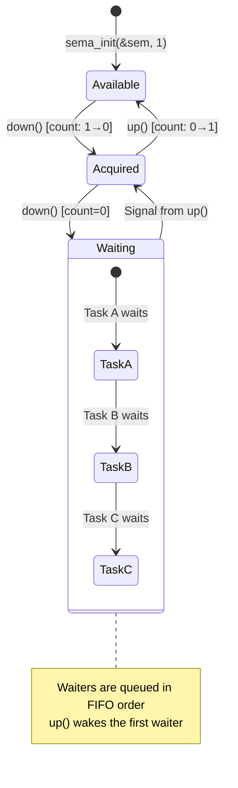
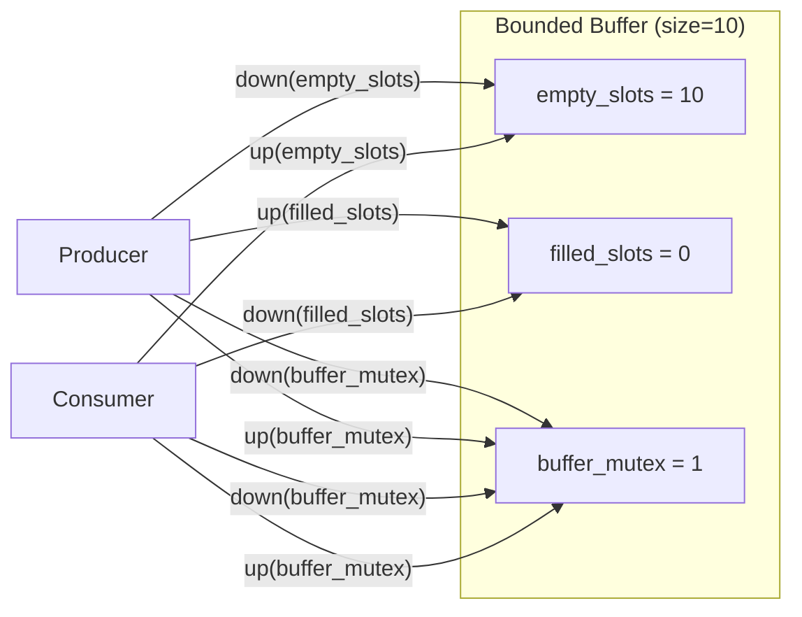
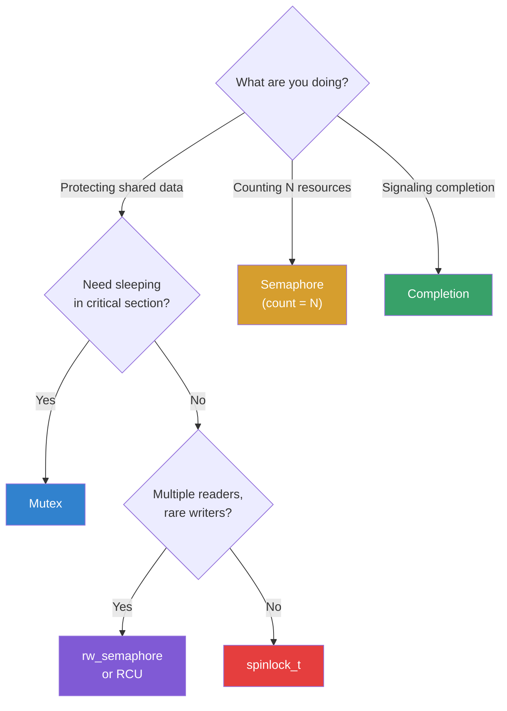

# Semaphores

## Introduction

Semaphores are one of the oldest and most fundamental synchronization primitives in computing, invented by Edsger Dijkstra in 1965. In the Linux kernel, a semaphore is a counting synchronization mechanism that controls access to a shared resource by maintaining a counter. The two operations—`down()` (wait/P) and `up()` (signal/V)—are atomic and form the basis for mutual exclusion and resource counting.

While the kernel has evolved to prefer **mutexes** for mutual exclusion (they're simpler, faster, and have better debugging), semaphores remain important for:
- Counting resources (e.g., a pool of N buffers)
- Situations where the same task might acquire the lock multiple times
- Reader-writer scenarios (via rw_semaphore, covered in [Read-Write Locks](./rwlocks.md))
- Completion signaling (see [Completion Variables](./completions.md))

## The `semaphore` Structure

```c
#include <linux/semaphore.h>

struct semaphore {
    raw_spinlock_t      lock;       /* Protects the count */
    unsigned int        count;      /* Available resources */
    struct list_head    wait_list;  /* Sleeping waiters */
};
```

The `count` field represents the number of available resources:
- `count = 0`: No resources available (but no one waiting)
- `count > 0`: Resources available
- Waiters are queued in `wait_list` when count is 0

## Declaring and Initializing

### Static Declaration

```c
/* Binary semaphore (1 resource, like a mutex) */
static DECLARE_SEM(my_sem);

/* Counting semaphore (N resources) */
static struct semaphore pool_sem;
/* Initialize to 5 (5 resources available) */
```

### Dynamic Initialization

```c
struct semaphore my_sem;

/* Initialize with count 1 (binary semaphore) */
sema_init(&my_sem, 1);

/* Initialize with count N (counting semaphore) */
sema_init(&my_sem, 5);  /* 5 resources available */

/* Legacy: init_MUTEX (deprecated, use sema_init with 1) */
/* init_MUTEX(&my_sem); */
```

## The `down()` Family — Acquiring (P Operation)

### `down()` — Uninterruptible

```c
/* Blocks until the semaphore is available.
 * Cannot be interrupted by signals.
 * Returns when the semaphore is acquired.
 */
void down(struct semaphore *sem);

/* Usage */
down(&my_sem);
/* Critical section — resource is held */
up(&my_sem);
```

**Warning**: `down()` cannot be interrupted. If the task is killed while waiting, it stays in `TASK_UNINTERRUPTIBLE` until the semaphore is released. Prefer `down_interruptible()` in most cases.

### `down_interruptible()` — Interruptible (Preferred)

```c
/* Blocks until available, but can be interrupted by signals.
 * Returns 0 on success, -EINTR if interrupted.
 */
int down_interruptible(struct semaphore *sem);

/* Usage */
if (down_interruptible(&my_sem)) {
    /* Interrupted by signal — abort */
    return -ERESTARTSYS;
}
/* Critical section */
up(&my_sem);
```

### `down_killable()` — Fatal Signals Only

```c
/* Like down_interruptible(), but only fatal signals can interrupt.
 * Useful when the operation must complete unless the process is killed.
 */
int down_killable(struct semaphore *sem);

if (down_killable(&my_sem)) {
    /* Killed by fatal signal */
    return -EINTR;
}
up(&my_sem);
```

### `down_trylock()` — Non-blocking

```c
/* Attempts to acquire without blocking.
 * Returns 0 if acquired, 1 if not (semaphore busy).
 */
int down_trylock(struct semaphore *sem);

if (down_trylock(&my_sem) == 0) {
    /* Acquired */
    /* ... use resource ... */
    up(&my_sem);
} else {
    /* Busy — do something else or return error */
    return -EBUSY;
}
```

### `down_timeout()` — With Timeout

```c
/* Waits up to 'jiffies' timeout.
 * Returns 0 if acquired, -ETIME if timed out.
 */
int down_timeout(struct semaphore *sem, long jiffies);

if (down_timeout(&my_sem, msecs_to_jiffies(5000)) == 0) {
    /* Acquired within 5 seconds */
    up(&my_sem);
} else {
    /* Timed out */
    pr_err("Could not acquire semaphore within 5s\n");
}
```

## The `up()` Family — Releasing (V Operation)

```c
/* Release the semaphore, waking one waiter if any */
void up(struct semaphore *sem);

/* up() is always non-blocking and cannot fail */
```

## Semaphore Lifecycle Diagram



## Usage Patterns

### Pattern 1: Mutual Exclusion (Binary Semaphore)

```c
static DECLARE_SEM(mtx);

void critical_section(void) {
    if (down_interruptible(&mtx))
        return;
    
    /* Only one thread here at a time */
    shared_resource++;
    
    up(&mtx);
}
```

### Pattern 2: Resource Pool (Counting Semaphore)

```c
/* Limit concurrent DMA channels to 4 */
static DECLARE_SEM(dma_slots);  /* Inited to 4 */

int start_dma_transfer(void) {
    /* Acquire a DMA slot (blocks if all 4 are in use) */
    if (down_interruptible(&dma_slots))
        return -ERESTARTSYS;
    
    /* Now we have one of 4 DMA channels */
    configure_dma();
    start_transfer();
    
    return 0;  /* Caller must call release_dma_slot() later */
}

void release_dma_slot(void) {
    stop_transfer();
    up(&dma_slots);  /* Return the slot */
}
```

### Pattern 3: Producer-Consumer Bounded Buffer

```c
#define BUFFER_SIZE 10

static DECLARE_SEM(empty_slots);  /* Initialized to BUFFER_SIZE */
static DECLARE_SEM(filled_slots); /* Initialized to 0 */
static DECLARE_SEM(buffer_mutex); /* Initialized to 1 */

static int buffer[BUFFER_SIZE];
static int in = 0, out = 0;

/* Producer */
void produce(int item) {
    down(&empty_slots);      /* Wait for empty slot */
    down(&buffer_mutex);     /* Exclusive access to buffer */
    
    buffer[in] = item;
    in = (in + 1) % BUFFER_SIZE;
    
    up(&buffer_mutex);
    up(&filled_slots);       /* Signal: one more filled slot */
}

/* Consumer */
int consume(void) {
    int item;
    
    down(&filled_slots);     /* Wait for filled slot */
    down(&buffer_mutex);     /* Exclusive access to buffer */
    
    item = buffer[out];
    out = (out + 1) % BUFFER_SIZE;
    
    up(&buffer_mutex);
    up(&empty_slots);        /* Signal: one more empty slot */
    
    return item;
}
```



## Semaphore vs Mutex vs Completion

Choosing the right primitive is critical. Here's a detailed comparison:

| Feature | Semaphore | Mutex | Completion |
|---------|-----------|-------|------------|
| **Purpose** | Count resources, synchronize | Mutual exclusion | Signal "done" |
| **Ownership** | None (any task can `up()`) | Yes (only owner can unlock) | None |
| **Counting** | Yes (0 to N) | No (binary only) | No (signaled or not) |
| **Recursive locking** | Yes (but can deadlock on binary) | No (configurable in userspace) | N/A |
| **Sleepable CS** | Yes | Yes | N/A |
| **Priority inversion** | No protection | Priority inheritance | No protection |
| **Performance** | Good | Better (optimized) | Best (purpose-built) |
| **Use when** | Resource counting | Critical section | Wait for event |

### Decision Tree



### When to Use Each

```c
/* USE SEMAPHORE when counting resources: */
static DECLARE_SEM(connection_pool);  /* 10 DB connections */
down(&connection_pool);    /* Get a connection */
use_connection();
up(&connection_pool);      /* Return it */

/* USE MUTEX when protecting data: */
static DEFINE_MUTEX(data_lock);
mutex_lock(&data_lock);
shared_data->field = value;   /* Exclusive access */
mutex_unlock(&data_lock);

/* USE COMPLETION when waiting for an event: */
static DECLARE_COMPLETION(work_done);
submit_work(work);
wait_for_completion(&work_done);  /* Wait for signal */

/* DON'T use semaphore for mutual exclusion (use mutex instead): */
/* BAD: sema_init(&sem, 1); ... down(&sem); / up(&sem); */
/* GOOD: mutex_init(&m); ... mutex_lock(&m); / mutex_unlock(&m); */
```

## Implementation Details

### The `down()` Implementation

```c
/* Simplified from kernel/locking/semaphore.c */
void down(struct semaphore *sem) {
    unsigned long flags;
    raw_spin_lock_irqsave(&sem->lock, flags);
    
    if (sem->count > 0) {
        /* Fast path: resource available */
        sem->count--;
    } else {
        /* Slow path: must wait */
        __down(sem);  /* Adds to wait_list, sleeps */
    }
    
    raw_spin_unlock_irqrestore(&sem->lock, flags);
}
```

### The `up()` Implementation

```c
void up(struct semaphore *sem) {
    unsigned long flags;
    raw_spin_lock_irqsave(&sem->lock, flags);
    
    if (list_empty(&sem->wait_list)) {
        /* No waiters — just increment count */
        sem->count++;
    } else {
        /* Wake first waiter */
        __up(sem);  /* Removes from wait_list, wakes task */
    }
    
    raw_spin_unlock_irqrestore(&sem->lock, flags);
}
```

### Wait List Ordering

```c
/* Waiters are woken in FIFO order (fairness) */
/* This prevents starvation of long-waiting tasks */

struct semaphore_waiter {
    struct list_head list;
    struct task_struct *task;
    bool up;  /* Set to true when woken */
};
```

## Reader-Writer Semaphore (Brief)

The `rw_semaphore` variant allows multiple concurrent readers:

```c
static DECLARE_RWSEM(my_rwsem);

/* Multiple readers */
down_read(&my_rwsem);     /* Concurrent with other readers */
/* ... read ... */
up_read(&my_rwsem);

/* Exclusive writer */
down_write(&my_rwsem);    /* Exclusive — blocks readers and writers */
/* ... write ... */
up_write(&my_rwsem);
```

See [Read-Write Locks](./rwlocks.md) for comprehensive coverage.

## Kernel Configuration and Tuning

```bash
# Semaphore statistics (CONFIG_DEBUG_SEMAPHORE=y)
# Check contention
cat /proc/lock_stat | grep semaphore

# Lock dependency checking (CONFIG_PROVE_LOCKING)
# Warns about potential deadlocks at runtime
# Enabled via lockdep boot parameter or CONFIG_LOCKDEP

# Debug semaphore usage
# dmesg | grep -i semaphore
# [semaphore] WARNING: up() called on uninitialized semaphore
```

## Common Mistakes

### Mistake 1: Semaphore as Mutex (No Ownership)

```c
/* BUG: Task A acquires, Task B releases */
down(&sem);  /* Task A */
/* ... */
up(&sem);    /* Task B (different task!) */

/* This is "valid" with semaphores but usually a bug.
 * Use mutex for mutual exclusion — it enforces ownership.
 */
```

### Mistake 2: Double Down (Deadlock with Binary)

```c
static DECLARE_SEM(sem);  /* count = 1 */

down(&sem);  /* count = 0 */
down(&sem);  /* Deadlock! Count is 0, waiting for up() that never comes */
/* With counting semaphore (count >= 2), this works but may be wrong */
```

### Mistake 3: Forgetting to Release

```c
int buggy_function(void) {
    down_interruptible(&sem);
    
    if (error_condition)
        return -EINVAL;  /* BUG: forgot up(&sem)! */
    
    up(&sem);
    return 0;
}

/* FIXED: always release on all paths */
int fixed_function(void) {
    int ret = 0;
    
    if (down_interruptible(&sem))
        return -ERESTARTSYS;
    
    if (error_condition) {
        ret = -EINVAL;
        goto out;
    }
    
    /* ... */
    
out:
    up(&sem);
    return ret;
}
```

## References

- [Linux kernel semaphore implementation](https://git.kernel.org/pub/scm/linux/kernel/git/torvalds/linux.git/tree/kernel/locking/semaphore.c) — Source code
- [semaphore.h](https://git.kernel.org/pub/scm/linux/kernel/git/torvalds/linux.git/tree/include/linux/semaphore.h) — Header
- [Mutual exclusion (mutex) vs semaphore](https://www.kernel.org/doc/Documentation/locking/mutex-design.txt) — Why mutex is preferred
- [Dijkstra's original paper](https://www.cs.utexas.edu/users/EWD/transcriptions/EWD01xx/EWD123.html) — The original semaphores concept
- [The Little Book of Semaphores](https://greenteapress.com/wp/semaphores/) — Allen Downey's free book

## Related Topics

- [Read-Write Locks](./rwlocks.md) — Reader-writer synchronization
- [Completion Variables](./completions.md) — Signaling primitive
- [Per-CPU Variables](./per-cpu.md) — Lock-free per-CPU data
