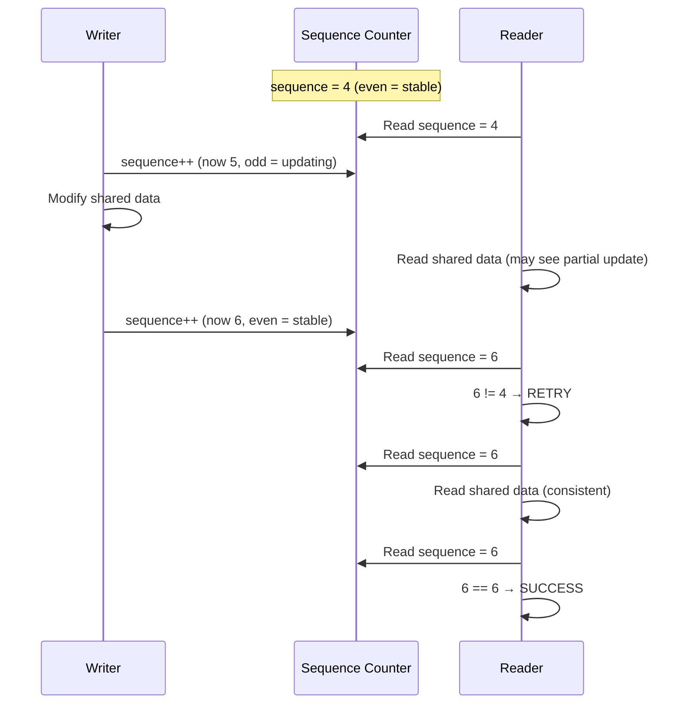

# Seqlocks

## Introduction

Seqlocks (sequence locks) are a synchronization mechanism optimized for **read-mostly data** where readers must never block and can tolerate retrying. They were introduced in Linux 2.6 for the timekeeping subsystem and have since been adopted for networking statistics, VMA operations, and other read-heavy paths.

The key idea: a writer increments a **sequence counter** before and after modifying shared data. A reader reads the sequence counter, reads the data, then checks if the counter changed. If it did, a writer intervened, and the reader retries. This means readers never block — they may waste CPU cycles retrying, but they never sleep or spin on a lock.

## How Seqlocks Work

### Data Structure

```c
typedef struct {
    unsigned sequence;
    spinlock_t lock;
} seqlock_t;
```

The `sequence` counter is always even when no writer is active and odd when a writer holds the lock.

### Protocol



## API Reference

### Writer Side

```c
seqlock_t my_seqlock;

/* Initialize */
seqlock_init(&my_seqlock);
/* Or static: DEFINE_SEQLOCK(my_seqlock); */

/* Lock for writing — increments sequence to odd */
write_seqlock(&my_seqlock);
/* Modify shared data */
write_sequnlock(&my_seqlock);  /* Increments sequence to even */

/* With interrupt safety */
write_seqlock_irq(&my_seqlock);
write_sequnlock_irq(&my_seqlock);

write_seqlock_irqsave(&my_seqlock, flags);
write_sequnlock_irqrestore(&my_seqlock, flags);

/* With bottom-half safety */
write_seqlock_bh(&my_seqlock);
write_sequnlock_bh(&my_seqlock);

/* Try to lock for writing */
if (write_tryseqlock(&my_seqlock)) {
    /* Got lock */
    write_sequnlock(&my_seqlock);
}
```

### Reader Side

```c
unsigned int seq;
do {
    seq = read_seqbegin(&my_seqlock);
    /* Read shared data — NO locking, NO sleeping */
    val1 = shared_data.field1;
    val2 = shared_data.field2;
} while (read_seqretry(&my_seqlock, seq));
/* At this point, val1 and val2 are consistent */

/* With interrupt safety */
do {
    seq = read_seqbegin(&my_seqlock);
    /* ... */
} while (read_seqretry(&my_seqlock, seq));
```

**Critical constraint**: The reader's critical section must not modify any shared state, must not sleep, and must not have side effects that would be problematic if repeated.

## Complete Example: Statistics Counter

```c
#include <linux/seqlock.h>
#include <linux/jiffies.h>

struct net_stats {
    unsigned long rx_packets;
    unsigned long tx_packets;
    unsigned long rx_bytes;
    unsigned long tx_bytes;
    unsigned long errors;
};

struct my_netdev {
    seqlock_t stats_lock;
    struct net_stats stats;
};

static void my_netdev_init(struct my_netdev *dev)
{
    seqlock_init(&dev->stats_lock);
    memset(&dev->stats, 0, sizeof(dev->stats));
}

/* Called from interrupt context when packet received */
static void update_rx_stats(struct my_netdev *dev, unsigned int bytes)
{
    /* Writer: single fast seqlock update */
    write_seqlock(&dev->stats_lock);
    dev->stats.rx_packets++;
    dev->stats.rx_bytes += bytes;
    write_sequnlock(&dev->stats_lock);
}

/* Called from process context (ethtool, /proc) */
static void get_stats(struct my_netdev *dev, struct net_stats *out)
{
    unsigned int seq;

    /* Reader: retry loop ensures consistency */
    do {
        seq = read_seqbegin(&dev->stats_lock);
        *out = dev->stats;  /* Structure copy — may see partial state */
    } while (read_seqretry(&dev->stats_lock, seq));
}
```

## seqcount_t: Lower-Level Primitive

`seqlock_t` is built on top of `seqcount_t`, which is the bare sequence counter without the spinlock:

```c
typedef struct {
    unsigned sequence;
} seqcount_t;

DEFINE_SEQCOUNT(my_seqcount);

/* Writer must serialize externally */
write_seqcount_begin(&my_seqcount);
/* Modify data */
write_seqcount_end(&my_seqcount);

/* Reader */
do {
    seq = read_seqcount_begin(&my_seqcount);
    /* Read data */
} while (read_seqcount_retry(&my_seqcount, seq));
```

`seqcount_t` is useful when you already have external serialization (e.g., a per-CPU lock) and just need the retry mechanism for readers.

## Use Cases in the Linux Kernel

### Timekeeping

The primary original use case. The kernel's timekeeping data (jiffies, wall time, monotonic clock) is updated by the timer interrupt but read millions of times per second from user space:

```c
/* In kernel/time/timekeeping.c */
struct timekeeper {
    seqcount_t seq;
    /* ... timekeeping state ... */
};

/* Reader: get current time */
void ktime_get_ts64(struct timespec64 *ts)
{
    struct timekeeper *tk = &tk_core.timekeeper;
    unsigned int seq;

    do {
        seq = read_seqcount_begin(&tk->seq);
        /* Read time values */
        *ts = tk_xtime(tk);
    } while (read_seqcount_retry(&tk->seq, seq));
}
```

### VMA (Virtual Memory Area) Operations

Memory-mapped regions use seqlocks for concurrent reads:

```c
/* In mm/memory.c or include/linux/mm.h */
struct vm_area_struct {
    /* ... */
    seqcount_t vm_sequence;  /* Per-VMA seqlock */
};
```

### Network Statistics

As shown in the example above, network device statistics use seqlocks for lock-free reads from `/proc/net/dev` and `ethtool -S`.

### d_path and Mount Pathname Resolution

```c
/* In fs/dcache.c */
struct mount {
    /* ... */
    seqcount_t mnt_seqcount;
};
```

## Seqlock vs RCU

Both seqlocks and RCU optimize for read-heavy workloads, but they have different properties:

| Property | Seqlock | RCU |
|----------|---------|-----|
| Reader blocks? | No (retries) | No |
| Reader can sleep? | No | No (SRCU: yes) |
| Writer blocks reader? | Briefly (reader retries) | Never |
| Reader sees stale data? | Yes, temporarily | Yes, until grace period |
| Reader-side cost | Very low | Near-zero |
| Memory ordering | Strong (retry detects changes) | Weaker (grace period) |
| Overhead on writer | Low (sequence increment) | Grace period management |
| Use case | Read-mostly, small data | Read-mostly, pointer-based structures |

**Use seqlocks when:**
- The data being read is small and fits in a few cache lines
- Readers can tolerate retrying (low write frequency)
- You need consistent snapshots of multiple values

**Use RCU when:**
- The data structure is large (linked lists, trees, hash tables)
- Pointer-based indirection is natural
- You need zero reader-side overhead

## Seqlock vs rwlock

| Property | Seqlock | rwlock |
|----------|---------|--------|
| Reader blocks writer? | No | Yes |
| Writer blocks reader? | Reader retries | Yes (reader waits) |
| Reader can starve writer? | No (writer priority) | Possible |
| Fairness | Writer-biased | Can be unfair either way |
| Reader-side atomic ops? | None (just reads) | Yes (atomic increment) |
| Cache-line bouncing (readers) | None | Yes (shared counter) |

Seqlocks are ideal when writes are rare and readers must never be blocked.

## The write_seqcount_barrier

For cases where you need a barrier without the full seqlock overhead:

```c
/* Writer: ensure all prior stores are visible before sequence update */
write_seqcount_begin(&seqcount);
smp_wmb();  /* All prior stores to data visible before sequence becomes odd */
/* ... modify data ... */
smp_wmb();  /* All stores to data visible before sequence becomes even */
write_seqcount_end(&seqcount);
```

## Lock Ordering with Seqlocks

Seqlocks interact with lockdep. The spinlock inside `seqlock_t` is tracked by lockdep, but the read-side is lockless and thus invisible to lockdep. This can mask ordering issues:

```c
/* Writer holds the seqlock spinlock — tracked by lockdep */
write_seqlock(&my_seqlock);
/* But also holds other locks? Lockdep doesn't know about read_seqbegin */
```

If your writer acquires other locks inside the seqlock critical section, you should annotate them for lockdep.

## Reader-Side Constraints

Because readers may execute their critical section multiple times (due to retries), the read-side code must be:

1. **Idempotent**: No side effects that cause problems if repeated
2. **Non-sleeping**: No calls to `schedule()`, `mutex_lock()`, etc.
3. **Side-effect free**: No writes to shared state
4. **Bounded**: The read-side critical section should be short

```c
/* BAD: Side effect in reader */
do {
    seq = read_seqbegin(&my_seqlock);
    counter++;  /* BUG: this may increment multiple times! */
} while (read_seqretry(&my_seqlock, seq));

/* GOOD: Read-only */
do {
    seq = read_seqbegin(&my_seqlock);
    local_copy = shared_data;
} while (read_seqretry(&my_seqlock, seq));
```

## Performance Characteristics

### Reader Overhead

The reader does:
1. Read the sequence counter (one memory load)
2. Read the shared data
3. Read the sequence counter again (one memory load)
4. Compare the two reads

If no writer intervened, this is just 2 extra loads — essentially free. Even with retries, the cost is proportional to the write rate.

### Writer Overhead

The writer does:
1. Acquire the spinlock (may contend)
2. Increment sequence counter (one atomic store)
3. Modify data
4. Increment sequence counter (one atomic store)
5. Release spinlock

The spinlock ensures only one writer at a time, but writers don't need to wait for readers.

### When Readers Retry

Readers retry only when a writer is actively modifying the data. The retry probability is approximately:

```
P(retry) ≈ (write_duration × write_frequency) / read_frequency
```

For typical read-mostly workloads (e.g., timekeeping: billions of reads per second, a few writes per second), the retry probability is negligible.

## Advanced: seqcount_latch_t

The **latch** variant provides two copies of the data. Writers update the inactive copy and then flip the latch. Readers always get a consistent copy without retrying:

```c
seqcount_latch_t latch;

/* Writer */
raw_write_seqcount_latch(&latch);
/* Update data[latch->sequence & 1] */
raw_write_seqcount_latch_end(&latch);

/* Reader — always gets a consistent copy */
do {
    seq = raw_read_seqcount_latch(&latch);
    /* Read data[seq & 1] */
} while (read_seqcount_latch_retry(&latch, seq));
```

This is used in the timekeeping subsystem where even the rare retry is too expensive.

## Debugging Seqlocks

### Detecting Read-Side Violations

```c
/* CONFIG_DEBUG_LOCK_ALLOC tracks seqlock_t's internal spinlock */
/* But the read-side is invisible to lockdep */

/* Manual check: ensure read-side doesn't acquire other locks */
```

### Lock Statistics

The spinlock portion of `seqlock_t` is tracked by lockstat:

```bash
$ sudo cat /proc/lock_stat | grep seqlock
```

## Seqlock Internals (from docs.kernel.org)

The kernel documentation at `docs.kernel.org/locking/seqlock.html` provides the authoritative reference for sequence counters and sequential locks. Key details from the official documentation:

### Sequence Counters (seqcount_t)

This is the raw counting mechanism without writer protection. Write side critical sections must be serialized by an external lock. If the write serialization primitive doesn't implicitly disable preemption, preemption must be explicitly disabled before entering the write side section.

### Sequence Counters with Associated Locks (seqcount_LOCKNAME_t)

These variants associate the lock used for writer serialization at initialization time, enabling lockdep to validate that write side critical sections are properly serialized. The lock association is a NOOP if lockdep is disabled (no storage or runtime overhead). Available variants:

- `seqcount_spinlock_t`
- `seqcount_raw_spinlock_t`
- `seqcount_rwlock_t`
- `seqcount_mutex_t`
- `seqcount_ww_mutex_t`

### Latch Sequence Counters (seqcount_latch_t)

A multiversion concurrency control mechanism where the embedded seqcount_t counter even/odd value switches between two copies of protected data. This allows the read path to safely interrupt its own write side critical section. Use when write side sections cannot be protected from interruption by readers (typically when the read side can be invoked from NMI handlers).

### Three Categories of Seqlock Readers

The documentation defines three types of readers for `seqlock_t`:

1. **Normal sequence readers**: Never block a writer, must retry if a writer is in progress. Writers do not wait for sequence readers.
2. **Locking readers** (`read_seqlock_excl`): Wait if a writer or another locking reader is in progress. Exclusive — only one locking reader can acquire it.
3. **Conditional lockless/locking readers** (`read_seqbegin_or_lock`): Try lockless first (even marker), fall back to locking read (odd marker) to avoid reader starvation during write spikes.

### Key Constraint

The documentation emphasizes: **this mechanism cannot be used if the protected data contains pointers**, as the writer can invalidate a pointer that the reader is following.

## References

- [The Linux Kernel Documentation](https://docs.kernel.org/)
- [GNU Project Documentation](https://www.gnu.org/doc/doc.html)
- [GNU Manuals](https://www.gnu.org/manual/manual.html)
- [Free Software Directory](https://directory.fsf.org/wiki/Main_Page)
- [Planet GNU](https://planet.gnu.org/)
- [Free Software Books](https://www.gnu.org/doc/other-free-books.html)

- [Linux Kernel Documentation: seqlock](https://www.kernel.org/doc/html/latest/locking/seqlock.html)
- [Stephen Hemminger: "Seqlocks in Linux"](https://lwn.net/Articles/22805/)
- [Linux Kernel Source: include/linux/seqlock.h](https://git.kernel.org/pub/scm/linux/kernel/git/torvalds/linux.git/tree/include/linux/seqlock.h)
- [LWN: "Sequence counters and latch counters"](https://lwn.net/Articles/633627/)
- [Sequence counters and sequential locks](https://docs.kernel.org/locking/seqlock.html) — Official kernel seqlock documentation

## Related Topics

- [Synchronization Overview](overview.md) — When and why locks are needed
- [RCU](rcu.md) — Another reader-optimized synchronization mechanism
- [Spinlocks](spinlocks.md) — Used internally by seqlock_t
- [Atomic Operations](atomic-ops.md) — Memory barriers and atomic operations
- [Lockdep](lockdep.md) — Debugging lock ordering issues
