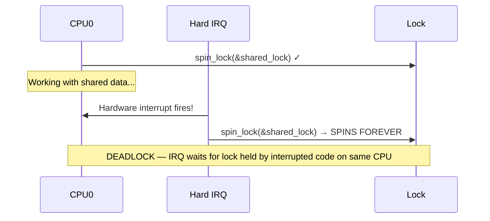
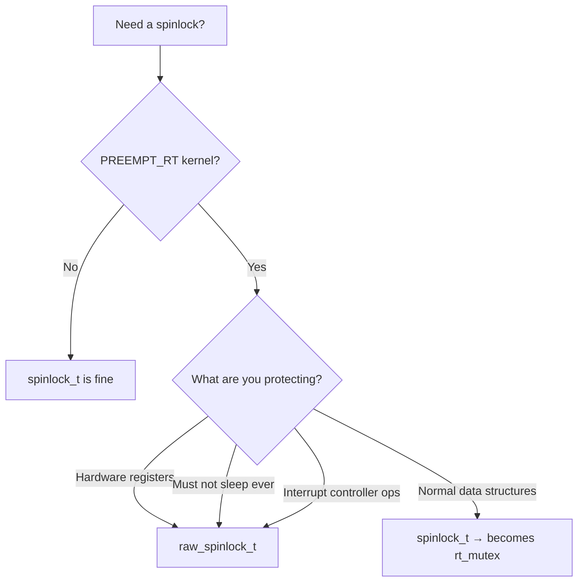
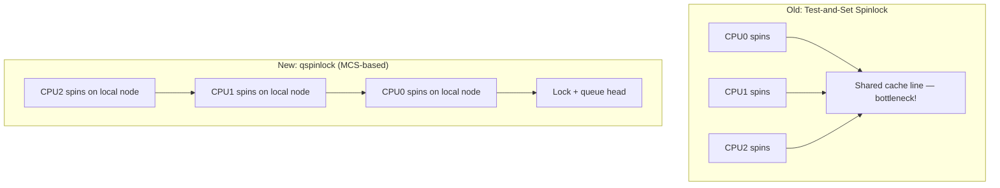

# Spinlocks

## Introduction

Spinlocks are the most fundamental synchronization primitive in the Linux kernel. When a CPU cannot acquire a spinlock, it **spins** — executing a tight busy-wait loop until the lock becomes available. This makes spinlocks ideal for protecting very short critical sections where the overhead of sleeping (context switch) would exceed the time spent spinning.

Spinlocks are the **only** locking mechanism available in interrupt context, where sleeping is forbidden. They are also the building block for most other kernel synchronization primitives.

## Basic Spinlock API

### Declaration and Initialization

```c
/* Static initialization */
DEFINE_SPINLOCK(my_lock);

/* Dynamic initialization */
spinlock_t my_lock;
spin_init(&my_lock);
```

### Lock and Unlock

```c
spin_lock(&my_lock);
/* Critical section — interrupts are still enabled on this CPU */
spin_unlock(&my_lock);
```

### Trylock (Non-blocking)

```c
if (spin_trylock(&my_lock)) {
    /* Got the lock */
    /* ... critical section ... */
    spin_unlock(&my_lock);
} else {
    /* Lock was contended — handle differently */
}
```

### Complete Basic Example

```c
#include <linux/spinlock.h>
#include <linux/list.h>

DEFINE_SPINLOCK(my_list_lock);
LIST_HEAD(my_list);

void add_entry(struct my_entry *entry)
{
    spin_lock(&my_list_lock);
    list_add_tail(&entry->list, &my_list);
    spin_unlock(&my_list_lock);
}

struct my_entry *find_entry(int key)
{
    struct my_entry *entry;

    spin_lock(&my_list_lock);
    list_for_each_entry(entry, &my_list, list) {
        if (entry->key == key) {
            spin_unlock(&my_list_lock);
            return entry;
        }
    }
    spin_unlock(&my_list_lock);
    return NULL;
}
```

## Spinlocks and Interrupts

The basic `spin_lock()` does **not** disable interrupts. This is fine when the critical section is only accessed from process context or softirq context. But if a hardirq handler can also access the same data, you need to disable interrupts while holding the lock.

### The Deadlock Scenario

```c
/* CPU 0: process context */
spin_lock(&shared_lock);
/* ... accessing shared data ... */

/* At this moment, a hardware interrupt fires on CPU 0 */
/* The interrupt handler tries to acquire the same lock: */
/*   spin_lock(&shared_lock);  → DEADLOCK: spins forever */
```



### spin_lock_irqsave / spin_unlock_irqrestore

Disables interrupts on the local CPU and saves the previous interrupt state:

```c
unsigned long flags;

spin_lock_irqsave(&shared_lock, flags);
/* Critical section — interrupts disabled on this CPU */
spin_unlock_irqrestore(&shared_lock, flags);
```

**`flags` is critical**: It preserves the previous interrupt state. If interrupts were already disabled when you called `spin_lock_irqsave()`, `spin_unlock_irqrestore()` will leave them disabled.

### spin_lock_irq / spin_unlock_irq

Unconditionally enables interrupts on unlock — use only when you **know** interrupts were enabled before:

```c
/* Only safe when you KNOW interrupts were enabled */
spin_lock_irq(&shared_lock);
/* ... */
spin_unlock_irq(&shared_lock);
```

**Warning**: `spin_unlock_irq()` always enables interrupts, even if they were disabled before. This can cause subtle bugs. Prefer `spin_lock_irqsave()` / `spin_unlock_irqrestore()` in almost all cases.

### spin_lock_bh / spin_unlock_bh

Disables softirq processing (bottom halves) on the local CPU:

```c
spin_lock_bh(&shared_lock);
/* Critical section — softirqs disabled on this CPU */
spin_unlock_bh(&shared_lock);
```

Use this when the data is shared between process context and softirq context (but not hardirq context). It disables softirq processing without disabling hardware interrupts, which is less disruptive than `spin_lock_irqsave()`.

### Decision Table

| Context Sharing | Lock Variant |
|----------------|--------------|
| Process ↔ Process | `spin_lock()` |
| Process ↔ Softirq | `spin_lock_bh()` |
| Process ↔ Hardirq | `spin_lock_irqsave()` |
| Softirq ↔ Softirq | `spin_lock()` |
| Softirq ↔ Hardirq | `spin_lock_irqsave()` |
| Hardirq ↔ Hardirq | `spin_lock()` (on same CPU, use irqsave for clarity) |

## raw_spinlock vs spinlock

The Linux kernel distinguishes between two types of spinlocks:

### spinlock_t

On non-`PREEMPT_RT` kernels, `spinlock_t` is a regular spinlock. On `PREEMPT_RT` kernels, `spinlock_t` is converted to an **rt_mutex** (a sleeping lock), which allows preemption even in critical sections.

### raw_spinlock_t

`raw_spinlock_t` is **always** a true spinlock, even on `PREEMPT_RT` kernels. Use it for:

- Code that **must** not sleep (hardware register access, interrupt controller operations)
- Low-level kernel code that runs before the scheduler is initialized
- Performance-critical paths where spinning is intentional

```c
/* Always a true spinlock, even on PREEMPT_RT */
DEFINE_RAW_SPINLOCK(hw_lock);
raw_spin_lock(&hw_lock);
/* Access hardware registers */
raw_spin_unlock(&hw_lock);
```

**Rule of thumb**: Use `spinlock_t` unless you have a specific reason to use `raw_spinlock_t`. The `PREEMPT_RT` conversion to sleeping locks improves real-time latency for most code.

### When to Use Which



## Spinlock Implementation

### The Lock Word

A spinlock is typically a single 32-bit or 8-bit value:

```c
typedef struct spinlock {
    union {
        struct raw_spinlock rlock;
#ifdef CONFIG_DEBUG_LOCK_ALLOC
# define LOCK_PADDING  { }
        struct {
            u8 __padding[LOCK_PADDING_SIZE];
            struct lockdep_map dep_map;
        };
#endif
    };
} spinlock_t;
```

### The Spinning Loop

On x86, the uncontended lock path is extremely fast (a single `LOCK XCHG` instruction):

```c
static inline void arch_spin_lock(arch_spinlock_t *lock)
{
    asm volatile(
        "1: lock; decb %0\n"        /* Atomic decrement */
        "   jns 3f\n"               /* If result >= 0, we got the lock */
        "2: rep; nop\n"             /* Spin with PAUSE instruction */
        "   cmpb $0, %0\n"          /* Check lock value */
        "   jle 2b\n"               /* Still locked — keep spinning */
        "   jmp 1b\n"               /* Try again */
        "3:\n"
        : "+m" (lock->slock) : : "memory", "cc");
}
```

The `rep; nop` (or `PAUSE` instruction on modern CPUs) serves two purposes:
1. Reduces power consumption during spinning
2. Signals to the CPU that this is a spin-wait loop, improving pipeline performance

### MCS-based Spinlocks (qspinlock)

On modern kernels (4.2+), the kernel uses an **MCS-based queued spinlock** (`qspinlock`). Instead of all CPUs spinning on the same cache line (causing cache-line bouncing), each CPU spins on its own local node:



The qspinlock uses only 4 bytes (same as a regular spinlock) and achieves O(1) lock transfer time regardless of the number of waiters.

## Recursive Spinlocks

**Linux kernel spinlocks are NOT recursive.** If a CPU attempts to acquire a spinlock it already holds, it deadlocks immediately:

```c
spin_lock(&my_lock);
spin_lock(&my_lock);  /* DEADLOCK — spins forever */
```

This is by design. Recursive locks hide design flaws and make lock ordering harder to reason about. If you need re-entrant locking, restructure your code:

```c
/* Instead of recursive locks, use a helper function */
static void __my_func(struct my_data *data)
{
    /* Assumes lock is already held */
    /* ... work ... */
}

void my_func(struct my_data *data)
{
    spin_lock(&my_lock);
    __my_func(data);
    spin_unlock(&my_lock);
}

void my_other_func(struct my_data *data)
{
    spin_lock(&my_lock);
    __my_func(data);  /* Calls the lock-free version */
    spin_unlock(&my_lock);
}
```

## Spinlock Constraints and Best Practices

### Keep Critical Sections Short

Spinlocks disable preemption (and possibly interrupts). Long critical sections cause latency problems:

```c
/* BAD: Long critical section */
spin_lock(&my_lock);
process_large_buffer(data);  /* Takes milliseconds — BAD */
spin_unlock(&my_lock);

/* GOOD: Short critical section */
process_large_buffer(data);  /* Process first */
spin_lock(&my_lock);
list_add(&data->list, &my_list);  /* Only protect the list operation */
spin_unlock(&my_lock);
```

### Don't Sleep While Holding a Spinlock

```c
/* BAD: Sleeping while holding spinlock */
spin_lock(&my_lock);
kmalloc(size, GFP_KERNEL);   /* May sleep! */
mutex_lock(&other_lock);     /* WILL sleep! */
spin_unlock(&my_lock);
```

Sleeping while holding a spinlock causes:
- Potential deadlocks (another CPU holding the mutex tries to get the spinlock)
- `might_sleep()` warnings with `CONFIG_DEBUG_ATOMIC_SLEEP`
- On `PREEMPT_RT`, `spinlock_t` is actually a sleeping lock, so this works — but `raw_spinlock_t` still forbids it

### Don't Call Functions That Might Sleep

Even indirect calls can sleep:

```c
/* BAD: Hidden sleep */
spin_lock(&my_lock);
copy_to_user(buf, data, len);  /* May fault and sleep! */
spin_unlock(&my_lock);
```

### Don't Call printk While Holding a Spinlock

`printk()` can acquire locks internally and may try to sleep on console output:

```c
/* BAD */
spin_lock(&my_lock);
printk(KERN_INFO "data = %d\n", data);  /* May cause issues */
spin_unlock(&my_lock);

/* GOOD: Use deferred printing or store the value */
spin_lock(&my_lock);
val = data;
spin_unlock(&my_lock);
printk(KERN_INFO "data = %d\n", val);
```

### Use the Correct Variant for Interrupt Context

If your data is accessed from hardirq handlers, you **must** use `spin_lock_irqsave()`:

```c
/* WRONG: hardirq can interrupt and deadlock */
spin_lock(&shared_lock);
/* ... access data also accessed by hardirq handler ... */
spin_unlock(&shared_lock);

/* CORRECT: disable interrupts */
spin_lock_irqsave(&shared_lock, flags);
/* ... access data ... */
spin_unlock_irqrestore(&shared_lock, flags);
```

## Spinlock Statistics

With `CONFIG_LOCK_STAT`, you can monitor spinlock contention:

```bash
# View lock statistics
$ sudo cat /proc/lock_stat
lock_name    <hold time>           <contention>         <wait time>
             min  max  total  cnt   min  max  total  cnt  min  max  total  cnt
rq_lock:     0.12 45.6 12345.6  789  1.2  34.5  678.9  45   0.5  23.4  123.4  45
```

```bash
# Record and view with perf
$ sudo perf lock record -- sleep 10
$ sudo perf lock report --sort acquired,contended
```

## Spinlock vs Mutex Comparison

| Property | spinlock_t | mutex |
|----------|-----------|-------|
| Waiting | Busy-wait (spin) | Sleep (schedule away) |
| Context | Any (atomic, interrupt) | Process only |
| Critical section length | Very short | Can be longer |
| Interrupt safety | Use irqsave variant | Cannot use in interrupt |
| PREEMPT_RT behavior | Becomes rt_mutex | Remains rt_mutex |
| Recursive | No (deadlock) | No (deadlock, but configurable) |
| Owner tracking | No (debug builds only) | Yes |
| Overhead | Minimal | Higher (context switch) |

## Debugging Spinlock Issues

### CONFIG_DEBUG_SPINLOCKS

Enable spinlock debugging:

```
CONFIG_DEBUG_SPINLOCKS=y
CONFIG_DEBUG_LOCK_ALLOC=y
CONFIG_PROVE_LOCKING=y  (lockdep)
```

This enables checks for:
- Double-lock on the same CPU
- Unlocking a lock not held by the current CPU
- Using a lock in the wrong context

### CONFIG_DEBUG_ATOMIC_SLEEP

Catches sleeping while holding a spinlock:

```
CONFIG_DEBUG_ATOMIC_SLEEP=y
```

Produces a stack trace when a process attempts to sleep while holding a spinlock or in other atomic contexts.

### might_sleep() Annotations

```c
/* Mark a function as potentially sleeping */
might_sleep();  /* Warns if called with spinlock held */
might_sleep_if(condition);
```

## Raw Spinlock Example: Hardware Register Access

```c
#include <linux/spinlock.h>

struct my_hw_device {
    raw_spinlock_t reg_lock;
    void __iomem *regs;
};

static void my_device_write_reg(struct my_hw_device *dev,
                                 u32 reg, u32 val)
{
    unsigned long flags;

    raw_spin_lock_irqsave(&dev->reg_lock, flags);
    iowrite32(val, dev->regs + reg);
    raw_spin_unlock_irqrestore(&dev->reg_lock, flags);
}

static u32 my_device_read_reg(struct my_hw_device *dev, u32 reg)
{
    unsigned long flags;
    u32 val;

    raw_spin_lock_irqsave(&dev->reg_lock, flags);
    val = ioread32(dev->regs + reg);
    raw_spin_unlock_irqrestore(&dev->reg_lock, flags);

    return val;
}
```

## References

- [Linux Kernel Documentation: spinlocks](https://www.kernel.org/doc/html/latest/locking/spinlocks.html)
- [Linux Kernel Source: kernel/locking/spinlock.c](https://git.kernel.org/pub/scm/linux/kernel/git/torvalds/linux.git/tree/kernel/locking)
- [qspinlock: MCS-based queued spinlock — Waiman Long's patches](https://lwn.net/Articles/590243/)
- [PREEMPT_RT and spinlocks](https://wiki.linuxfoundation.org/realtime/documentation/technical_details/start)
- [Understanding the Linux Kernel, 3rd Edition — Chapter 5: Spinlocks](https://www.oreilly.com/library/view/understanding-the-linux/0596005652/)

## Related Topics

- [Synchronization Overview](overview.md) — When and why locks are needed
- [Mutexes](mutexes.md) — Sleeping locks for process context
- [Lock Ordering](lock-ordering.md) — Preventing deadlocks
- [Lockdep](lockdep.md) — Runtime lock dependency validator
- [Atomic Operations](atomic-ops.md) — Lock-free primitives
- [Interrupt Handlers](../interrupts/handlers.md) — Interrupt context constraints
