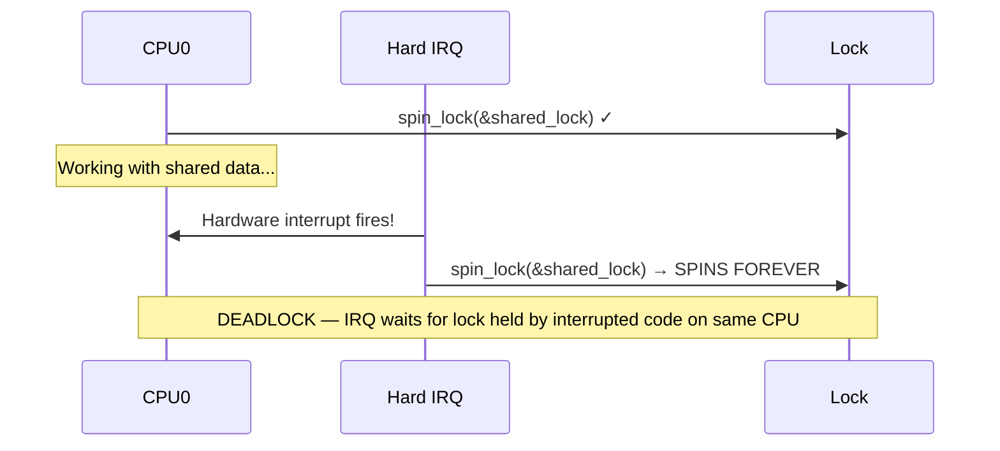
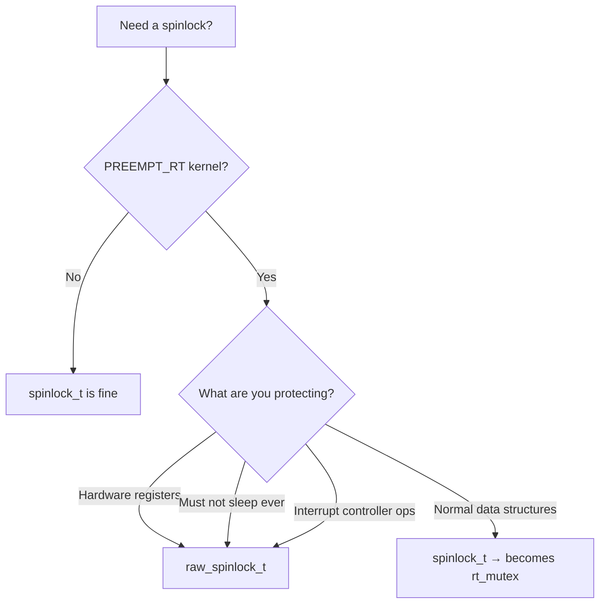
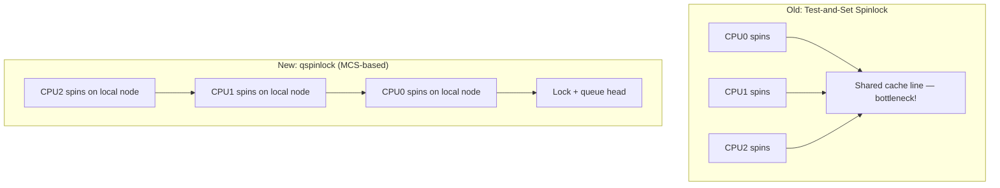
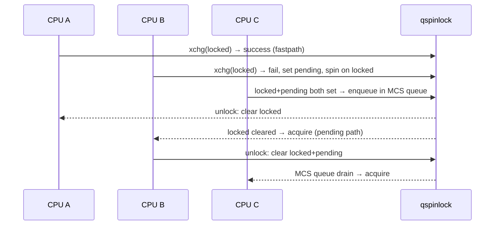

# Spinlocks

## Introduction

Spinlocks are the most fundamental synchronization primitive in the Linux kernel. When a CPU cannot acquire a spinlock, it **spins** — executing a tight busy-wait loop until the lock becomes available. This makes spinlocks ideal for protecting very short critical sections where the overhead of sleeping (context switch) would exceed the time spent spinning.

Spinlocks are the **only** locking mechanism available in interrupt context, where sleeping is forbidden. They are also the building block for most other kernel synchronization primitives.

## Basic Spinlock API

### Declaration and Initialization

```c
/* Static initialization */
DEFINE_SPINLOCK(my_lock);

/* Dynamic initialization */
spinlock_t my_lock;
spin_init(&my_lock);
```

### Lock and Unlock

```c
spin_lock(&my_lock);
/* Critical section — interrupts are still enabled on this CPU */
spin_unlock(&my_lock);
```

### Trylock (Non-blocking)

```c
if (spin_trylock(&my_lock)) {
    /* Got the lock */
    /* ... critical section ... */
    spin_unlock(&my_lock);
} else {
    /* Lock was contended — handle differently */
}
```

### Complete Basic Example

```c
#include <linux/spinlock.h>
#include <linux/list.h>

DEFINE_SPINLOCK(my_list_lock);
LIST_HEAD(my_list);

void add_entry(struct my_entry *entry)
{
    spin_lock(&my_list_lock);
    list_add_tail(&entry->list, &my_list);
    spin_unlock(&my_list_lock);
}

struct my_entry *find_entry(int key)
{
    struct my_entry *entry;

    spin_lock(&my_list_lock);
    list_for_each_entry(entry, &my_list, list) {
        if (entry->key == key) {
            spin_unlock(&my_list_lock);
            return entry;
        }
    }
    spin_unlock(&my_list_lock);
    return NULL;
}
```

## Spinlocks and Interrupts

The basic `spin_lock()` does **not** disable interrupts. This is fine when the critical section is only accessed from process context or softirq context. But if a hardirq handler can also access the same data, you need to disable interrupts while holding the lock.

### The Deadlock Scenario

```c
/* CPU 0: process context */
spin_lock(&shared_lock);
/* ... accessing shared data ... */

/* At this moment, a hardware interrupt fires on CPU 0 */
/* The interrupt handler tries to acquire the same lock: */
/*   spin_lock(&shared_lock);  → DEADLOCK: spins forever */
```



### spin_lock_irqsave / spin_unlock_irqrestore

Disables interrupts on the local CPU and saves the previous interrupt state:

```c
unsigned long flags;

spin_lock_irqsave(&shared_lock, flags);
/* Critical section — interrupts disabled on this CPU */
spin_unlock_irqrestore(&shared_lock, flags);
```

**`flags` is critical**: It preserves the previous interrupt state. If interrupts were already disabled when you called `spin_lock_irqsave()`, `spin_unlock_irqrestore()` will leave them disabled.

### spin_lock_irq / spin_unlock_irq

Unconditionally enables interrupts on unlock — use only when you **know** interrupts were enabled before:

```c
/* Only safe when you KNOW interrupts were enabled */
spin_lock_irq(&shared_lock);
/* ... */
spin_unlock_irq(&shared_lock);
```

**Warning**: `spin_unlock_irq()` always enables interrupts, even if they were disabled before. This can cause subtle bugs. Prefer `spin_lock_irqsave()` / `spin_unlock_irqrestore()` in almost all cases.

### spin_lock_bh / spin_unlock_bh

Disables softirq processing (bottom halves) on the local CPU:

```c
spin_lock_bh(&shared_lock);
/* Critical section — softirqs disabled on this CPU */
spin_unlock_bh(&shared_lock);
```

Use this when the data is shared between process context and softirq context (but not hardirq context). It disables softirq processing without disabling hardware interrupts, which is less disruptive than `spin_lock_irqsave()`.

### Decision Table

| Context Sharing | Lock Variant |
|----------------|--------------|
| Process ↔ Process | `spin_lock()` |
| Process ↔ Softirq | `spin_lock_bh()` |
| Process ↔ Hardirq | `spin_lock_irqsave()` |
| Softirq ↔ Softirq | `spin_lock()` |
| Softirq ↔ Hardirq | `spin_lock_irqsave()` |
| Hardirq ↔ Hardirq | `spin_lock()` (on same CPU, use irqsave for clarity) |

## raw_spinlock vs spinlock

The Linux kernel distinguishes between two types of spinlocks:

### spinlock_t

On non-`PREEMPT_RT` kernels, `spinlock_t` is a regular spinlock. On `PREEMPT_RT` kernels, `spinlock_t` is converted to an **rt_mutex** (a sleeping lock), which allows preemption even in critical sections.

### raw_spinlock_t

`raw_spinlock_t` is **always** a true spinlock, even on `PREEMPT_RT` kernels. Use it for:

- Code that **must** not sleep (hardware register access, interrupt controller operations)
- Low-level kernel code that runs before the scheduler is initialized
- Performance-critical paths where spinning is intentional

```c
/* Always a true spinlock, even on PREEMPT_RT */
DEFINE_RAW_SPINLOCK(hw_lock);
raw_spin_lock(&hw_lock);
/* Access hardware registers */
raw_spin_unlock(&hw_lock);
```

**Rule of thumb**: Use `spinlock_t` unless you have a specific reason to use `raw_spinlock_t`. The `PREEMPT_RT` conversion to sleeping locks improves real-time latency for most code.

### When to Use Which



## Spinlock Implementation

### The Lock Word

A spinlock is typically a single 32-bit or 8-bit value:

```c
typedef struct spinlock {
    union {
        struct raw_spinlock rlock;
#ifdef CONFIG_DEBUG_LOCK_ALLOC
# define LOCK_PADDING  { }
        struct {
            u8 __padding[LOCK_PADDING_SIZE];
            struct lockdep_map dep_map;
        };
#endif
    };
} spinlock_t;
```

### The Spinning Loop

On x86, the uncontended lock path is extremely fast (a single `LOCK XCHG` instruction):

```c
static inline void arch_spin_lock(arch_spinlock_t *lock)
{
    asm volatile(
        "1: lock; decb %0\n"        /* Atomic decrement */
        "   jns 3f\n"               /* If result >= 0, we got the lock */
        "2: rep; nop\n"             /* Spin with PAUSE instruction */
        "   cmpb $0, %0\n"          /* Check lock value */
        "   jle 2b\n"               /* Still locked — keep spinning */
        "   jmp 1b\n"               /* Try again */
        "3:\n"
        : "+m" (lock->slock) : : "memory", "cc");
}
```

The `rep; nop` (or `PAUSE` instruction on modern CPUs) serves two purposes:
1. Reduces power consumption during spinning
2. Signals to the CPU that this is a spin-wait loop, improving pipeline performance

### MCS-based Spinlocks (qspinlock)

On modern kernels (4.2+), the kernel uses an **MCS-based queued spinlock** (`qspinlock`). Instead of all CPUs spinning on the same cache line (causing cache-line bouncing), each CPU spins on its own local node:



The qspinlock uses only 4 bytes (same as a regular spinlock) and achieves O(1) lock transfer time regardless of the number of waiters.

## Recursive Spinlocks

**Linux kernel spinlocks are NOT recursive.** If a CPU attempts to acquire a spinlock it already holds, it deadlocks immediately:

```c
spin_lock(&my_lock);
spin_lock(&my_lock);  /* DEADLOCK — spins forever */
```

This is by design. Recursive locks hide design flaws and make lock ordering harder to reason about. If you need re-entrant locking, restructure your code:

```c
/* Instead of recursive locks, use a helper function */
static void __my_func(struct my_data *data)
{
    /* Assumes lock is already held */
    /* ... work ... */
}

void my_func(struct my_data *data)
{
    spin_lock(&my_lock);
    __my_func(data);
    spin_unlock(&my_lock);
}

void my_other_func(struct my_data *data)
{
    spin_lock(&my_lock);
    __my_func(data);  /* Calls the lock-free version */
    spin_unlock(&my_lock);
}
```

## Spinlock Constraints and Best Practices

### Keep Critical Sections Short

Spinlocks disable preemption (and possibly interrupts). Long critical sections cause latency problems:

```c
/* BAD: Long critical section */
spin_lock(&my_lock);
process_large_buffer(data);  /* Takes milliseconds — BAD */
spin_unlock(&my_lock);

/* GOOD: Short critical section */
process_large_buffer(data);  /* Process first */
spin_lock(&my_lock);
list_add(&data->list, &my_list);  /* Only protect the list operation */
spin_unlock(&my_lock);
```

### Don't Sleep While Holding a Spinlock

```c
/* BAD: Sleeping while holding spinlock */
spin_lock(&my_lock);
kmalloc(size, GFP_KERNEL);   /* May sleep! */
mutex_lock(&other_lock);     /* WILL sleep! */
spin_unlock(&my_lock);
```

Sleeping while holding a spinlock causes:
- Potential deadlocks (another CPU holding the mutex tries to get the spinlock)
- `might_sleep()` warnings with `CONFIG_DEBUG_ATOMIC_SLEEP`
- On `PREEMPT_RT`, `spinlock_t` is actually a sleeping lock, so this works — but `raw_spinlock_t` still forbids it

### Don't Call Functions That Might Sleep

Even indirect calls can sleep:

```c
/* BAD: Hidden sleep */
spin_lock(&my_lock);
copy_to_user(buf, data, len);  /* May fault and sleep! */
spin_unlock(&my_lock);
```

### Don't Call printk While Holding a Spinlock

`printk()` can acquire locks internally and may try to sleep on console output:

```c
/* BAD */
spin_lock(&my_lock);
printk(KERN_INFO "data = %d\n", data);  /* May cause issues */
spin_unlock(&my_lock);

/* GOOD: Use deferred printing or store the value */
spin_lock(&my_lock);
val = data;
spin_unlock(&my_lock);
printk(KERN_INFO "data = %d\n", val);
```

### Use the Correct Variant for Interrupt Context

If your data is accessed from hardirq handlers, you **must** use `spin_lock_irqsave()`:

```c
/* WRONG: hardirq can interrupt and deadlock */
spin_lock(&shared_lock);
/* ... access data also accessed by hardirq handler ... */
spin_unlock(&shared_lock);

/* CORRECT: disable interrupts */
spin_lock_irqsave(&shared_lock, flags);
/* ... access data ... */
spin_unlock_irqrestore(&shared_lock, flags);
```

## Spinlock Statistics

With `CONFIG_LOCK_STAT`, you can monitor spinlock contention:

```bash
# View lock statistics
$ sudo cat /proc/lock_stat
lock_name    <hold time>           <contention>         <wait time>
             min  max  total  cnt   min  max  total  cnt  min  max  total  cnt
rq_lock:     0.12 45.6 12345.6  789  1.2  34.5  678.9  45   0.5  23.4  123.4  45
```

```bash
# Record and view with perf
$ sudo perf lock record -- sleep 10
$ sudo perf lock report --sort acquired,contended
```

## Spinlock vs Mutex Comparison

| Property | spinlock_t | mutex |
|----------|-----------|-------|
| Waiting | Busy-wait (spin) | Sleep (schedule away) |
| Context | Any (atomic, interrupt) | Process only |
| Critical section length | Very short | Can be longer |
| Interrupt safety | Use irqsave variant | Cannot use in interrupt |
| PREEMPT_RT behavior | Becomes rt_mutex | Remains rt_mutex |
| Recursive | No (deadlock) | No (deadlock, but configurable) |
| Owner tracking | No (debug builds only) | Yes |
| Overhead | Minimal | Higher (context switch) |

## Debugging Spinlock Issues

### CONFIG_DEBUG_SPINLOCKS

Enable spinlock debugging:

```
CONFIG_DEBUG_SPINLOCKS=y
CONFIG_DEBUG_LOCK_ALLOC=y
CONFIG_PROVE_LOCKING=y  (lockdep)
```

This enables checks for:
- Double-lock on the same CPU
- Unlocking a lock not held by the current CPU
- Using a lock in the wrong context

### CONFIG_DEBUG_ATOMIC_SLEEP

Catches sleeping while holding a spinlock:

```
CONFIG_DEBUG_ATOMIC_SLEEP=y
```

Produces a stack trace when a process attempts to sleep while holding a spinlock or in other atomic contexts.

### might_sleep() Annotations

```c
/* Mark a function as potentially sleeping */
might_sleep();  /* Warns if called with spinlock held */
might_sleep_if(condition);
```

## Raw Spinlock Example: Hardware Register Access

```c
#include <linux/spinlock.h>

struct my_hw_device {
    raw_spinlock_t reg_lock;
    void __iomem *regs;
};

static void my_device_write_reg(struct my_hw_device *dev,
                                 u32 reg, u32 val)
{
    unsigned long flags;

    raw_spin_lock_irqsave(&dev->reg_lock, flags);
    iowrite32(val, dev->regs + reg);
    raw_spin_unlock_irqrestore(&dev->reg_lock, flags);
}

static u32 my_device_read_reg(struct my_hw_device *dev, u32 reg)
{
    unsigned long flags;
    u32 val;

    raw_spin_lock_irqsave(&dev->reg_lock, flags);
    val = ioread32(dev->regs + reg);
    raw_spin_unlock_irqrestore(&dev->reg_lock, flags);

    return val;
}
```

## PREEMPT_RT Lock Semantics

The `PREEMPT_RT` patch fundamentally changes how many lock types behave. Understanding these changes is critical for writing correct code on both RT and non-RT kernels.

### Lock Categories

The kernel divides locks into three categories:

| Category | Lock Types | Behavior on PREEMPT_RT |
|----------|-----------|----------------------|
| **Sleeping locks** | `mutex`, `rt_mutex`, `semaphore`, `rw_semaphore`, `ww_mutex` | Unchanged — always sleeping |
| **CPU local locks** | `local_lock` | Becomes a per-CPU `spinlock_t` (real lock) |
| **Spinning locks** | `raw_spinlock_t`, bit spinlocks | Unchanged — always spinning |
| **Hybrid** | `spinlock_t`, `rwlock_t` | **Becomes sleeping lock** (rt_mutex-based) |

### spinlock_t on PREEMPT_RT

On a `PREEMPT_RT` kernel, `spinlock_t` is mapped to an `rt_mutex`:

- **Preemption is NOT disabled** — the critical section runs in preemptible task context.
- **`_irq` / `_irqsave` suffixes** do NOT affect the CPU's interrupt state — interrupts remain enabled.
- **`_bh()` suffix** still disables softirq handlers, but uses a per-CPU lock instead of disabling preemption.
- **Migration is disabled** — pointers to per-CPU variables remain valid even if the task is preempted.
- **Task state is preserved** across lock acquisition — if the task blocks, its state is saved and restored on lock wakeup.

### Task State Preservation Detail

When a task blocks on a `spinlock_t` under PREEMPT_RT:

```text
1. task->state = TASK_INTERRUPTIBLE
2. lock() → block()
3. task->saved_state = task->state  (save INTERRUPTIBLE)
4. task->state = TASK_UNINTERRUPTIBLE  (for lock wakeup)
5. schedule()
6. Lock available → lock wakeup restores: task->state = task->saved_state
```

Non-lock wakeups (e.g., signal) set `saved_state = TASK_RUNNING` instead of waking the task directly, ensuring the task stays blocked until the lock is acquired.

### rw_semaphore on PREEMPT_RT

`rw_semaphore` is mapped to an rt_mutex-based implementation with asymmetric priority inheritance:

- **Writers** can receive priority inheritance from readers (preempted low-priority writer gets boosted).
- **Readers** cannot receive priority inheritance from writers (a preempted low-priority reader can starve high-priority writers).

### rwlock_t on PREEMPT_RT

Same changes as `spinlock_t` plus the same asymmetric PI behavior as `rw_semaphore`.

### local_lock on PREEMPT_RT

`local_lock` maps to a per-CPU `spinlock_t`, which becomes a real sleeping lock. This means:

- `local_lock_irq(&lock); raw_spin_lock(&lock);` works on non-RT but **breaks on PREEMPT_RT** because `local_lock` now takes a sleeping lock, and `raw_spin_lock` is a true spinning lock (sleeping inside spinning = deadlock).
- Use `local_lock_nested_bh()` for per-CPU variables accessed in softirq context — on RT, it serializes access instead of relying on implicit context protection.

### When to Use raw_spinlock_t

Use `raw_spinlock_t` (always spinning, even on RT) only for:

- Hardware register access
- Low-level interrupt handling
- Critical core code where disabling preemption/interrupts is required
- Tiny critical sections where rt_mutex overhead is unwarranted

**Rule of thumb**: Use `spinlock_t` by default. Only use `raw_spinlock_t` when you have a specific reason.

## qspinlock Internals

The kernel's queued spinlock (qspinlock) is an MCS-based lock that eliminates cache-line bouncing under contention. Understanding its internals is important for lock optimization.

### qspinlock Structure

A qspinlock is a 32-bit word with three fields packed together:

```c
/* kernel/locking/qspinlock.c */
struct qspinlock {
    union {
        atomic_t val;
        struct {
            u8 locked;      /* Lock byte: 0 = unlocked, 1 = locked */
            u8 pending;     /* Pending byte: 1 = waiter spinning on lock word */
            struct {
                u16 locked_pending; /* locked + pending combined */
                u16 tail;           /* Tail of MCS queue (node index + CPU #) */
            };
        };
    };
};
```

### Lock Acquisition Path

The qspinlock uses a three-stage fastpath:

1. **Uncontended fastpath**: Single atomic `xchg()` on the lock byte. If the lock was free, acquired in ~10 ns.
2. **Pending bit fastpath**: If lock is held but no queue exists, set the pending bit and spin on the lock byte directly. Avoids MCS node allocation.
3. **MCS queue**: If both lock and pending are set, allocate a per-CPU MCS node, enqueue, and spin on the local node's locked flag.



### Per-CPU MCS Nodes

Each CPU has a small array of MCS nodes (typically 4) allocated in the per-CPU data area. The nodes are used to form the queue without any dynamic allocation:

```c
/* kernel/locking/mcs_spinlock.h */
struct mcs_spinlock {
    struct mcs_spinlock *next;
    int locked;       /* 1 = lock acquired by this node's CPU */
    int pending;      /* Used by pvqspinlock */
};
```

### pvqspinlock (ParaVirtualized)

For virtualized environments, `pvqspinlock` adds paravirtualization awareness:
- When a vCPU is preempted while holding a lock, other spinning vCPUs waste CPU time
- `pvqspinlock` allows a spinning vCPU to kick the lock holder's vCPU to schedule
- Uses `__pv_queued_spin_steal_lock()` to allow a halted vCPU's lock to be stolen

```bash
# Check if pvqspinlock is active
dmesg | grep -i pvqspinlock
# kvm: pvqspinlock: enabled
```

### Lock Handoff

When a lock is heavily contended (> 100 spins), the qspinlock may enter "handoff" mode where the current holder directly passes ownership to the next waiter, preventing starvation and reducing unnecessary spinning.

## References

- [The Linux Kernel Documentation](https://docs.kernel.org/)
- [GNU Project Documentation](https://www.gnu.org/doc/doc.html)
- [GNU Manuals](https://www.gnu.org/manual/manual.html)
- [Free Software Directory](https://directory.fsf.org/wiki/Main_Page)
- [Planet GNU](https://planet.gnu.org/)
- [Free Software Books](https://www.gnu.org/doc/other-free-books.html)

- [Linux Kernel Documentation: spinlocks](https://www.kernel.org/doc/html/latest/locking/spinlocks.html)
- [Linux Kernel Source: kernel/locking/spinlock.c](https://git.kernel.org/pub/scm/linux/kernel/git/torvalds/linux.git/tree/kernel/locking)
- [Lock types and their rules (kernel docs)](https://docs.kernel.org/locking/locktypes.html)
- [Locking lessons (kernel docs)](https://docs.kernel.org/locking/spinlocks.html) — Linus's spinlock lessons
- [qspinlock: MCS-based queued spinlock — Waiman Long's patches](https://lwn.net/Articles/590243/)
- [PREEMPT_RT and spinlocks](https://wiki.linuxfoundation.org/realtime/documentation/technical_details/start)
- [Understanding the Linux Kernel, 3rd Edition — Chapter 5: Spinlocks](https://www.oreilly.com/library/view/understanding-the-linux/0596005652/)

## Related Topics

- [Synchronization Overview](overview.md) — When and why locks are needed
- [Mutexes](mutexes.md) — Sleeping locks for process context
- [Lock Ordering](lock-ordering.md) — Preventing deadlocks
- [Lockdep](lockdep.md) — Runtime lock dependency validator
- [Atomic Operations](atomic-ops.md) — Lock-free primitives
- [Interrupt Handlers](../interrupts/handlers.md) — Interrupt context constraints
