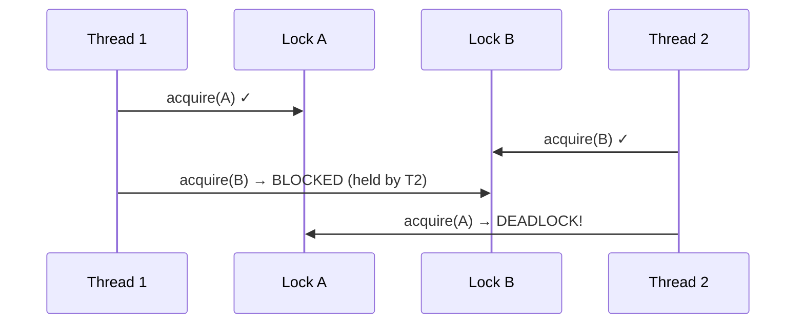
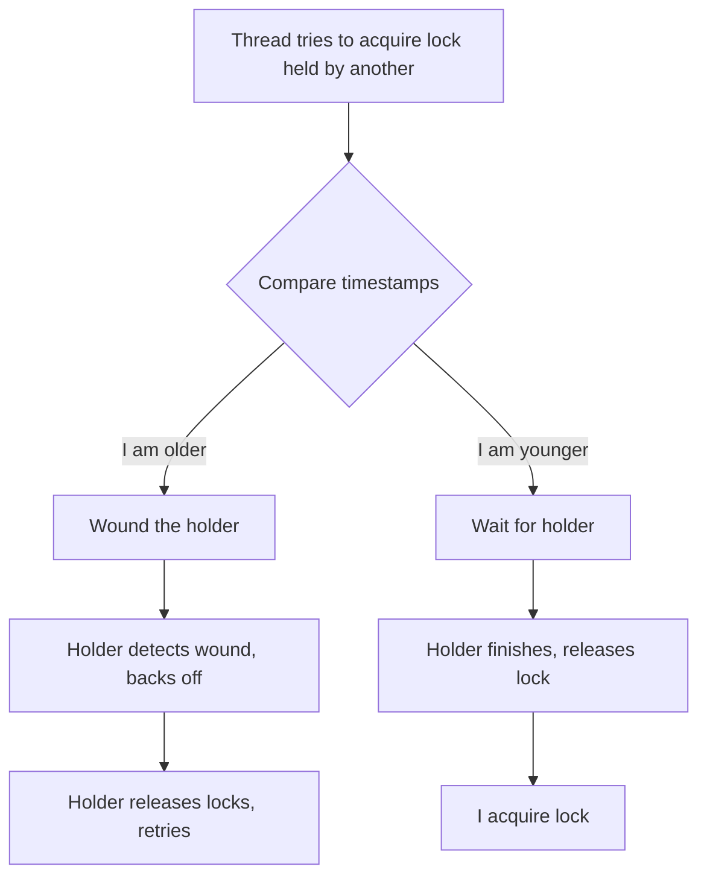
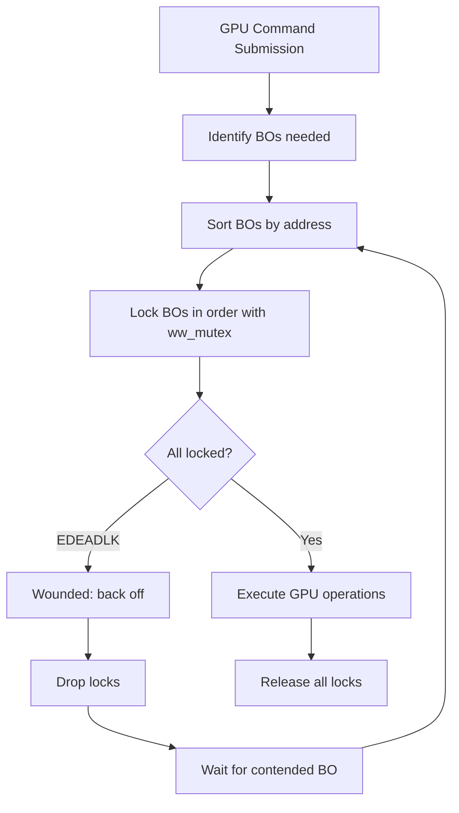

# Wound/Wait Mutexes (ww_mutex)

## Introduction

Wound/Wait mutexes (`ww_mutex`) are a specialized locking mechanism in the Linux kernel
designed to handle **multi-lock acquisition** scenarios without deadlocks. Unlike
traditional mutexes, which can deadlock when multiple threads acquire locks in different
orders, ww_mutexes use a priority-based protocol where older transactions either
**wound** (force rollback of) younger holders or **wait** for them, depending on
the protocol variant. This mechanism is critical for GPU drivers and other subsystems
where multiple resources must be locked simultaneously.

## The Deadlock Problem

Consider two threads trying to acquire two locks:



Traditional solutions (lock ordering) don't work when the set of locks needed
is dynamic and determined at runtime, as in GPU memory management where buffer
objects (BOs) are locked based on user-space requests.

## Wound/Wait Protocol

The protocol assigns a **wound context** (a monotonically increasing ticket number)
to each transaction. Two variants exist:

### Wound-Wait (Default)

- **Older thread wounds younger**: The older thread signals the younger to back off.
  The younger holder detects the wound and releases its locks, then retries.
- **Older thread waits for older**: If the holder is older, the requester waits.

### Wait-Wound

- **Older thread waits for younger**: The older thread waits, knowing the younger
  will finish quickly.
- **Younger thread backs off**: If the requester is younger, it backs off immediately
  and retries.

Linux uses the **Wound-Wait** variant by default.



## Data Structures

### ww_acquire_ctx

The acquisition context tracks the state of a multi-lock transaction:

```c
struct ww_acquire_ctx {
    struct ww_class *ww_class;  /* Class (per subsystem) */
    unsigned long stamp;         /* Unique ticket/timestamp */
    unsigned int acquired;       /* Number of locks acquired */
    unsigned int done_acquire;   /* Set when all locks acquired */
    unsigned int contending;     /* Set if we were wounded */
    struct task_struct *task;    /* Owning task */
    struct ww_class *ww_class;
    /* ... internal fields ... */
};
```

### ww_mutex

Each ww_mutex wraps a standard mutex with wound/wait metadata:

```c
struct ww_mutex {
    struct mutex base;            /* Underlying mutex */
    struct ww_acquire_ctx *ctx;   /* Current owner's context */
    struct ww_class *ww_class;    /* Associated class */
};
```

### ww_class

The class groups related ww_mutexes and provides the protocol configuration:

```c
struct ww_class {
    atomic_long_t stamp;          /* Global ticket counter */
    struct lock_class_key acquire_key;
    struct lock_class_key mutex_key;
    const char *name;
    struct lock_class_key acquire_name;
};
```

## API Usage

### Initialization

```c
/* Define a ww_class (typically one per subsystem) */
static DEFINE_WW_CLASS(my_ww_class);

/* Initialize a ww_mutex */
struct ww_mutex my_lock;
ww_mutex_init(&my_lock, &my_ww_class);
```

### Acquisition Pattern

The standard pattern acquires all locks within a single `ww_acquire_ctx`,
with a retry loop for handling wounds:

```c
int lock_multiple_bos(struct my_object **objs, int count)
{
    struct ww_acquire_ctx ctx;
    struct my_object *contended = NULL;
    int ret, i;

retry:
    /* Begin acquisition context */
    ww_acquire_init(&ctx, &my_ww_class);

    /* Acquire all locks */
    for (i = 0; i < count; i++) {
        if (objs[i] == contended) {
            contended = NULL;
            continue;  /* Skip the contended one, it's already unlocked */
        }

        ret = ww_mutex_lock(&objs[i]->lock, &ctx);
        if (ret == -EDEADLK) {
            /* We were wounded - back off */
            contended = objs[i];

            /* Drop all locks acquired so far */
            for (int j = i - 1; j >= 0; j--)
                ww_mutex_unlock(&objs[j]->lock);

            /* Wait for the contended lock to be released */
            ww_mutex_lock_slow(&contended->lock, &ctx);
            ww_mutex_unlock(&contended->lock);

            /* Restart the entire acquisition */
            goto retry;
        }
    }

    /* All locks acquired - do work */
    ww_acquire_fini(&ctx);
    return 0;
}
```

### The "Slow" Path

`ww_mutex_lock_slow()` is the key function for the wound-wait protocol. It waits
for the contended lock but also participates in the wound protocol:

```c
/* Wait for contended lock (slow path) */
ret = ww_mutex_lock_slow(&contended_lock, &ctx);
if (ret == -EDEADLK) {
    /* Still deadlocked - must retry */
    goto retry;
}
```

## GPU Driver Use Case

The primary users of ww_mutexes are GPU drivers. The TTM (Translation Table Manager)
memory manager uses ww_mutexes to lock buffer objects:



### Real-World Example: amdgpu

```c
/* drivers/gpu/drm/amd/amdgpu/amdgpu_cs.c (simplified) */
int amdgpu_cs_ioctl(struct drm_device *dev, void *data,
                    struct drm_file *filp)
{
    struct amdgpu_cs_parser parser;
    struct ww_acquire_ctx ticket;
    int r;

    /* Parse the command submission and gather BO list */
    r = amdgpu_cs_parser_init(&parser, data, filp);
    if (r)
        return r;

    /* Lock all BOs with ww_mutex */
    r = ttm_eu_reserve_buffers(&ticket, &parser->validated, true);
    if (r)
        goto error;

    /* Execute the command submission */
    r = amdgpu_cs_ib_fill(parser.adev, &parser);

    /* Unlock all BOs */
    ttm_eu_backoff_reservation(&ticket, &parser->validated);

    return r;
}
```

### TTM Reserve/Backoff

The TTM library provides helpers built on ww_mutex:

```c
/* Reserve all buffer objects in the list */
int ttm_eu_reserve_buffers(struct ww_acquire_ctx *ticket,
                           struct list_head *list,
                           bool intr)
{
    struct ttm_validate_buffer *entry;
    int ret;

retry:
    ww_acquire_init(ticket, &reservation_ww_class);

    list_for_each_entry(entry, list, head) {
        struct dma_resv *resv = entry->bo->base.resv;

        ret = dma_resv_lock(resv, ticket);
        if (ret == -EDEADLK) {
            /* Back off all and wait for contended */
            ttm_eu_backoff_reservation_reverse(ticket, list, entry);
            dma_resv_lock_slow(resv, ticket);
            goto retry;
        }
    }

    ww_acquire_fini(ticket);
    return 0;
}
```

## Implementation Details

### Wound Detection

When a thread attempts to acquire a lock held by another:

```c
/* kernel/locking/mutex.c - simplified wound logic */
static int __ww_mutex_lock_check_stamp(struct ww_mutex *lock,
                                        struct ww_acquire_ctx *ctx)
{
    struct ww_acquire_ctx *hold_ctx = READ_ONCE(lock->ctx);

    if (!hold_ctx)
        return 0;  /* Lock is not held by a ww context */

    /* If holder is older (lower stamp), we must wait */
    if (__ww_stamp_after(hold_ctx->stamp, ctx->stamp))
        return 0;  /* Wait */

    /* We are older - wound the holder */
    if (!hold_ctx->contending) {
        hold_ctx->contending = 1;
        /* Wake the holder if it's sleeping */
    }

    return -EDEADLK;  /* Back off signal */
}
```

### Stamp Ordering

The stamp is a monotonically increasing counter using `atomic_long_inc_return()`:

```c
/* Include/linux/ww_mutex.h */
static inline void ww_acquire_init(struct ww_acquire_ctx *ctx,
                                    struct ww_class *ww_class)
{
    ctx->ww_class = ww_class;
    ctx->stamp = atomic_long_inc_return(&ww_class->stamp);
    ctx->acquired = 0;
    ctx->done_acquire = 0;
    ctx->contending = 0;
    ctx->task = current;
}
```

### Lock Ordering Within ww_mutex

To avoid unnecessary wounds, locks in a batch should be sorted by address
before acquisition:

```c
/* Sort by address to minimize contention */
sort(objs, count, sizeof(*objs), cmp_bo_addr, NULL);

/* Then acquire in sorted order */
for (i = 0; i < count; i++) {
    ret = ww_mutex_lock(&objs[i]->lock, &ctx);
    if (ret == -EDEADLK) { /* handle wound */ }
}
```

## Performance Considerations

| Scenario | Traditional mutexes | ww_mutex |
|----------|-------------------|----------|
| Single lock | Fast (no overhead) | Slightly slower (context tracking) |
| Multiple locks, no contention | Fast if ordered | Slightly slower (context setup) |
| Multiple locks, contention | Deadlock risk | Graceful backoff |
| GPU buffer objects | Requires global lock | Fine-grained locking |

### Overhead Sources

1. **Stamp allocation**: Atomic increment per transaction
2. **Context tracking**: Extra fields in mutex and context
3. **Wound propagation**: Must check and signal holders
4. **Retry cost**: Wounded transactions restart their lock acquisition

## Comparison with Other Deadlock Avoidance

| Method | Approach | Limitation |
|--------|----------|-----------|
| Lock ordering | Static order | Requires known order; not dynamic |
| trylock + backoff | Non-blocking attempt | Starvation risk |
| Lockdep | Detection only (debug) | No runtime avoidance |
| ww_mutex | Priority-based preemption | Transaction restart cost |

## Debugging

### Lockdep Integration

ww_mutexes integrate with lockdep for deadlock detection during development:

```bash
# Enable lockdep in kernel config
CONFIG_LOCKDEP=y
CONFIG_DEBUG_LOCK_ALLOC=y
```

### Common Pitfalls

```c
/* WRONG: Mixing lock types */
ww_mutex_lock(&ww_lock, &ctx);
mutex_lock(&regular_lock);  /* Not tracked by ww context! */

/* WRONG: Holding locks across ww_acquire_fini */
ww_mutex_lock(&lock, &ctx);
ww_acquire_fini(&ctx);
/* Lock still held but context is gone - broken protocol! */

/* CORRECT: All locks released before fini */
ww_mutex_lock(&lock, &ctx);
do_work();
ww_mutex_unlock(&lock);
ww_acquire_fini(&ctx);
```

## Cross-References

- [Mutexes](mutexes.md) - Standard kernel mutexes
- [Spinlocks](spinlocks.md) - Busy-wait synchronization primitives
- [Lock Ordering](lock-ordering.md) - Lock ordering strategies
- [Lockdep](lockdep.md) - Lock dependency validator
- [RCU](rcu.md) - Read-Copy-Update synchronization
- [Block I/O Layer](../block/overview.md) - Block subsystem (uses similar patterns)
- [PCI Subsystem](../drivers/pci.md) - PCI locking patterns

## Further Reading

- [Wound/Wait mutexes documentation](https://www.kernel.org/doc/html/latest/locking/ww-mutex-design.html)
- [Original ww_mutex patch series (lore.kernel.org)](https://lore.kernel.org/lkml/?q=ww_mutex)
- [TTM reservation API](https://docs.kernel.org/gpu/drm-mm.html#the-reservation-object)
- [Maarten Lankhorst's ww_mutex talk](https://www.x.org/wiki/Events/XDC2014/XDC2014LankhorstWwMutexes/)
- [DMA Resv / Reservations (LWN.net)](https://lwn.net/Articles/783208/)
- [DRM GPU memory management](https://www.kernel.org/doc/html/latest/gpu/drm-mm.html)
