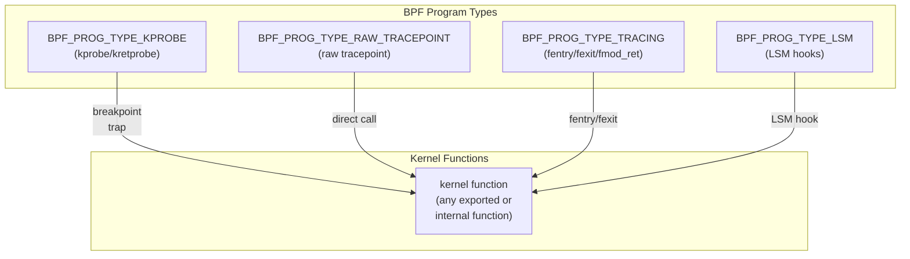

# Advanced Kprobes and Uprobes

## Introduction

The basic kprobes page covers registration, kretprobes, and the ftrace-based event
interface. This page dives into advanced topics: BPF integration with kprobes and
uprobes, filter predicates for selective tracing, kprobe multiplexing for efficient
multi-point tracing, and uprobe techniques for userspace function instrumentation.

These capabilities make kprobes/uprobes the foundation of modern Linux dynamic
tracing, powering tools like bpftrace, BCC, and custom eBPF programs.

## BPF Integration with Kprobes

### BPF Program Types for Kprobes

eBPF programs can attach to kprobes through several program types:



| Program Type | Mechanism | Overhead | Sleepable | CO-RE |
|-------------|-----------|----------|-----------|-------|
| `KPROBE` | Breakpoint trap | High | No | Yes |
| `RAW_TRACEPOINT` | Direct tracepoint | Low | No | Yes |
| `TRACING (fentry)` | Function entry | Low | No | Yes |
| `TRACING (fexit)` | Function exit | Low | No | Yes |
| `TRACING (fmod_ret)` | Modify return | Low | Yes | Yes |
| `LSM` | LSM hook | Low | Yes | Yes |

### fentry/fexit Programs

fentry and fexit are the modern replacement for kprobe/kretprobe BPF programs.
They use BTF for direct argument access and have lower overhead.

```c
// fentry — runs at function entry
SEC("fentry/do_nanosleep")
int BPF_PROG(trace_nanosleep_entry, struct hrtimer_sleeper *rqtp) {
    __u32 pid = bpf_get_current_pid_tgid() >> 32;
    
    // Direct access to function arguments via BTF
    __u64 ns = rqtp->timer._softexpires;
    
    bpf_printk("fentry: pid=%d sleep_ns=%llu", pid, ns);
    return 0;
}

// fexit — runs at function return, can access return value
SEC("fexit/do_nanosleep")
int BPF_PROG(trace_nanosleep_exit, struct hrtimer_sleeper *rqtp, int ret) {
    __u32 pid = bpf_get_current_pid_tgid() >> 32;
    
    // ret is the function return value
    bpf_printk("fexit: pid=%d ret=%d", pid, ret);
    return 0;
}
```

### fentry vs kprobe Comparison

```c
// kprobe — requires manual argument extraction
SEC("kprobe/do_nanosleep")
int trace_kprobe(struct pt_regs *ctx) {
    // Must use PT_REGS_PARM macros
    struct hrtimer_sleeper *rqtp = (struct hrtimer_sleeper *)PT_REGS_PARM1(ctx);
    __u64 ns;
    
    // Must use bpf_probe_read for dereferencing
    bpf_probe_read(&ns, sizeof(ns), &rqtp->timer._softexpires);
    return 0;
}

// fentry — direct BTF-based access (cleaner, faster)
SEC("fentry/do_nanosleep")
int trace_fentry(struct hrtimer_sleeper *rqtp) {
    // Direct dereference — no bpf_probe_read needed
    __u64 ns = rqtp->timer._softexpires;
    return 0;
}
```

**fentry advantages:**
- Direct argument access (no `PT_REGS_PARM` macros)
- No `bpf_probe_read` needed for kernel memory
- BTF-aware type checking
- Lower overhead (fentry patching vs breakpoint trap)
- Supports fexit for return value access

### fmod_ret — Modifying Return Values

fmod_ret programs can change the return value of a kernel function:

```c
// Intercept and modify the return value of a function
SEC("fmod_ret/security_file_open")
int BPF_PROG(block_open, struct file *file) {
    char comm[16];
    bpf_get_current_comm(comm, sizeof(comm));
    
    // Block opens from a specific process
    if (comm[0] == 'b' && comm[1] == 'a' && comm[2] == 'd') {
        return -EACCES;  // Return error
    }
    return 0;  // Allow (return original value)
}
```

**fmod_ret restrictions:**
- Only for functions declared as `ALLOW_ERROR_INJECTION`
- Return value must be a valid error code for the function
- Used primarily for security and fault injection

### LSM BPF Programs

LSM (Linux Security Module) BPF programs attach to LSM hooks:

```c
SEC("lsm/file_open")
int BPF_PROG(restrict_open, struct file *file, int ret) {
    // ret is the return value from previous LSM hooks
    
    if (ret != 0)
        return ret;  // Already denied
    
    char comm[16];
    bpf_get_current_comm(comm, sizeof(comm));
    
    // Check if process is allowed to open files
    __u32 pid = bpf_get_current_pid_tgid() >> 32;
    __u32 *allowed = bpf_map_lookup_elem(&allowlist, &pid);
    
    if (!allowed)
        return -EACCES;
    
    return 0;  // Allow
}
```

### Sleepable BPF Programs

Some BPF program types can sleep (useful for operations that may block):

```c
// Sleepable fmod_ret
SEC("fmod_ret/bpf_fentry_test_sleep")
int BPF_PROG(test_sleep_mod_ret, int a) {
    // Can call sleepable helpers
    // bpf_ringbuf_reserve (with BPF_RB_NO_WAKEUP)
    // bpf_timer_* helpers
    return 0;
}

// Sleepable LSM
SEC("lsm/bpf")
int BPF_PROG(test_lsm_sleep) {
    // Can sleep
    return 0;
}
```

## Filter Predicates

### BPF-Based Filtering

BPF programs can implement sophisticated filtering logic that's impossible with
ftrace's simple filter syntax:

```c
// Filter by multiple criteria
SEC("kprobe/tcp_sendmsg")
int trace_tcp_sendmsg(struct pt_regs *ctx) {
    __u32 pid = bpf_get_current_pid_tgid() >> 32;
    
    // Filter by PID
    __u32 *target = bpf_map_lookup_elem(&target_pids, &pid);
    if (!target)
        return 0;
    
    // Filter by network namespace
    struct task_struct *task = (struct task_struct *)bpf_get_current_task();
    struct net *net;
    bpf_probe_read(&net, sizeof(net), &task->nsproxy->net_ns);
    __u32 netns_id;
    bpf_probe_read(&netns_id, sizeof(netns_id), &net->ns.inum);
    
    __u32 *target_netns = bpf_map_lookup_elem(&target_netns_map, &netns_id);
    if (!target_netns)
        return 0;
    
    // Filter by socket state
    struct sock *sk = (struct sock *)PT_REGS_PARM1(ctx);
    __u8 state;
    bpf_probe_read(&state, sizeof(state), &sk->__sk_common.skc_state);
    
    if (state != TCP_ESTABLISHED)
        return 0;
    
    // All filters passed — trace the event
    // ...
    return 0;
}
```

### Ftrace Filter Predicates

ftrace supports filter predicates on event fields. These work with kprobe events
created through the ftrace interface:

```bash
# Create kprobe event
echo 'p:myprobe do_sys_openat2 dfd=%di:long pathname=+0(%si):string flags=%dx:long' \
    > /sys/kernel/tracing/kprobe_events

# Add filter predicate
echo 'dfd >= 0 && (flags & 0x03) == 0' \
    > /sys/kernel/tracing/events/kprobes/myprobe/filter

# String filter
echo 'pathname ~ "/etc/*"' \
    > /sys/kernel/tracing/events/kprobes/myprobe/filter

# Complex filter
echo '(dfd == -100 || dfd >= 0) && flags & 0x40' \
    > /sys/kernel/tracing/events/kprobes/myprobe/filter
```

### BPF-Based Conditional Tracing

```c
// Map-driven filter configuration (change at runtime)
struct {
    __uint(type, BPF_MAP_TYPE_HASH);
    __uint(max_entries, 256);
    __type(key, __u32);       // filter criterion
    __type(value, __u8);      // enabled/disabled
} filter_config SEC(".maps");

SEC("kprobe/vfs_read")
int trace_vfs_read(struct pt_regs *ctx) {
    __u32 pid = bpf_get_current_pid_tgid() >> 32;
    
    // Check if this PID is in the filter
    __u8 *enabled = bpf_map_lookup_elem(&filter_config, &pid);
    if (!enabled || *enabled == 0)
        return 0;
    
    // Trace only filtered PIDs
    // ...
    return 0;
}

// Userspace can update the filter map dynamically
// bpftool map update id <map_id> key 0x01 0x00 0x00 0x00 value 0x01
```

### Rate Limiting

```c
// Rate-limit kprobe output to avoid flooding
struct {
    __uint(type, BPF_MAP_TYPE_HASH);
    __uint(max_entries, 10240);
    __type(key, __u32);
    __type(value, __u64);     // last timestamp
} rate_limit SEC(".maps");

#define RATE_LIMIT_NS 1000000000  // 1 second

SEC("kprobe/tcp_retransmit_skb")
int trace_retransmit(struct pt_regs *ctx) {
    __u32 pid = bpf_get_current_pid_tgid() >> 32;
    __u64 now = bpf_ktime_get_ns();
    __u64 *last = bpf_map_lookup_elem(&rate_limit, &pid);
    
    if (last && (now - *last) < RATE_LIMIT_NS)
        return 0;  // Rate limited
    
    bpf_map_update_elem(&rate_limit, &pid, &now, BPF_ANY);
    
    // Trace the event
    // ...
    return 0;
}
```

## Kprobe Multiplexing

### The Problem

When tracing many kernel functions simultaneously, registering individual kprobes
for each function is expensive. Kprobe multiplexing shares a single kprobe handler
across multiple probe points.

### Ftrace-Based Multiplexing

ftrace can trace many functions with a single tracer configuration:

```bash
# Trace multiple functions through ftrace
cd /sys/kernel/tracing

# Set multiple functions for kprobe events
echo 'p:netprobe tcp_sendmsg' > kprobe_events
echo 'p:netprobe tcp_recvmsg' >> kprobe_events   # ERROR: duplicate name

# Use different names
echo 'p:net_tx tcp_sendmsg' > kprobe_events
echo 'p:net_rx tcp_recvmsg' >> kprobe_events
echo 'p:net_tcp tcp_connect' >> kprobe_events
echo 'p:net_tcp tcp_close' >> kprobe_events

# Enable all kprobe events at once
echo 1 > events/kprobes/enable

# Or selectively
echo 1 > events/kprobes/net_tx/enable
echo 1 > events/kprobes/net_rx/enable
```

### BPF-Based Multiplexing

```c
// Single BPF program attached to multiple kprobes using perf_event
// Use bpf_program__attach_kprobe() for each function

// In libbpf:
// for each function_name in function_list:
//     bpf_program__attach_kprobe(prog, false, function_name)

// Shared handler identifies the probe point
SEC("kprobe")
int trace_shared(struct pt_regs *ctx) {
    __u64 ip = PT_REGS_IP(ctx);
    
    // Identify which function we're in using the IP
    // (requires userspace to maintain a map of IPs to function names)
    __u32 *func_id = bpf_map_lookup_elem(&ip_to_func, &ip);
    if (!func_id)
        return 0;
    
    // Route to function-specific logic
    switch (*func_id) {
    case 0:  // tcp_sendmsg
        // ...
        break;
    case 1:  // tcp_recvmsg
        // ...
        break;
    // ...
    }
    return 0;
}
```

### Wildcard Kprobe Attachment

```bash
# Attach kprobes to all functions matching a pattern
# Using perf:
perf probe -a 'tcp_*'

# Using bpftrace:
bpftrace -e 'kprobe:tcp_* { printf("%s %s\n", comm, kstack); }'

# Using trace-cmd:
trace-cmd record -p function -l 'tcp_*'

# List all available functions matching pattern
cat /sys/kernel/tracing/available_filter_functions | grep '^tcp_' | head -20
```

### Kprobe Optimized vs Non-Optimized

```bash
# Check optimized kprobe status
cat /sys/kernel/debug/kprobes/list
# ffffffffa0001234  k  vfs_read+0x0  [ftrace]
# ffffffffa0001235  k  tcp_sendmsg+0x0  [ftrace]
# ffffffffa0001236  k  do_nanosleep+0x0  [ftrace]

# Optimized kprobes (marked with 'o'):
# ffffffffa0001234  k  vfs_read+0x0  [OPTIMIZED]

# Force unoptimized kprobes (for debugging)
echo 0 > /sys/kernel/debug/kprobes/optimized

# Check kprobe statistics
cat /sys/kernel/debug/kprobes/profile
# kprobe_hit_count: 123456
# kprobe_miss_count: 0
```

## Advanced Uprobes

### Uprobe Basics

Uprobes (user probes) instrument userspace functions. They work by replacing the
target instruction with a breakpoint, similar to kprobes.

```bash
# Create uprobe event (via ftrace)
echo 'p:myuprobe /usr/lib/libc.so.6:0x12345' > /sys/kernel/tracing/uprobe_events

# With argument extraction
echo 'p:myuprobe /usr/lib/libc.so.6:write fd=%di:u64 buf=%si:x64 count=%dx:u64' \
    > /sys/kernel/tracing/uprobe_events

# Enable
echo 1 > /sys/kernel/tracing/events/uprobes/myuprobe/enable
```

### Uprobe with BPF

```c
// Attach BPF program to uprobe
SEC("uprobe//usr/lib/libc.so.6:write")
int trace_write(struct pt_regs *ctx) {
    // Arguments follow calling convention
    int fd = (int)PT_REGS_PARM1(ctx);
    const void *buf = (const void *)PT_REGS_PARM2(ctx);
    size_t count = (size_t)PT_REGS_PARM3(ctx);
    
    // Read buffer contents
    char data[64];
    bpf_probe_read_user(data, sizeof(data), buf);
    
    bpf_printk("write: fd=%d count=%zu", fd, count);
    return 0;
}

// uretprobe — trace return value
SEC("uretprobe//usr/lib/libc.so.6:write")
int trace_write_ret(struct pt_regs *ctx) {
    ssize_t ret = (ssize_t)PT_REGS_RC(ctx);
    bpf_printk("write returned: %zd", ret);
    return 0;
}
```

### Uprobe with bpftrace

```bash
# Trace all malloc calls in a specific binary
bpftrace -e 'uprobe:/usr/bin/myapp:malloc { printf("malloc(%zu)\n", arg0); }'

# Trace with return value
bpftrace -e '
uprobe:/usr/lib/libc.so.6:malloc { @size[tid] = arg0; }
uretprobe:/usr/lib/libc.so.6:malloc { printf("malloc(%zu) = %p\n", @size[tid], retval); }
'

# Trace C++ mangled function names
bpftrace -e 'uprobe:/usr/bin/myapp:_ZN6MyClass9myMethodEv { printf("called!\n"); }'

# Find mangled names
nm -C /usr/bin/myapp | grep myMethod
```

### Uprobe with Offset Calculation

When tracing position-independent executables (PIE) or shared libraries, you need
to calculate the probe offset:

```bash
# For shared libraries, use the function's offset in the file
# 1. Find function address in the binary
nm -D /usr/lib/libc.so.6 | grep write$
# 00000000000f7d60 T write

# 2. Use the offset directly
echo 'p:myuprobe /usr/lib/libc.so.6:0xf7d60' > /sys/kernel/tracing/uprobe_events

# For PIE executables, calculate offset relative to file
# address_in_memory - base_address + file_offset

# Using bpftrace (handles this automatically):
bpftrace -e 'uprobe:/usr/bin/myapp:main { printf("main called\n"); }'
```

### Uprobe for Go/Rust Programs

```bash
# Go programs have different calling conventions
# Use bpftrace which handles Go's ABI

# Trace a Go function
bpftrace -e 'uprobe:/usr/bin/myapp:main.myFunction { printf("called\n"); }'

# Rust programs (if not stripped)
bpftrace -e 'uprobe:/usr/bin/myapp:myapp::my_function { printf("called\n"); }'

# Find available functions
nm /usr/bin/myapp | grep -i function_name
objdump -t /usr/bin/myapp | grep function_name
```

### Uprobe Filtering by Process

```c
// Filter uprobe by PID
SEC("uprobe//usr/lib/libc.so.6:write")
int trace_write(struct pt_regs *ctx) {
    __u32 pid = bpf_get_current_pid_tgid() >> 32;
    
    // Only trace specific PIDs
    __u32 *target = bpf_map_lookup_elem(&target_pids, &pid);
    if (!target)
        return 0;
    
    // Trace
    // ...
    return 0;
}
```

### Uprobe for Library Interposition

```c
// Intercept library calls without LD_PRELOAD
SEC("uprobe//usr/lib/libc.so.6:connect")
int trace_connect(struct pt_regs *ctx) {
    int sockfd = (int)PT_REGS_PARM1(ctx);
    struct sockaddr *addr = (struct sockaddr *)PT_REGS_PARM2(ctx);
    socklen_t addrlen = (socklen_t)PT_REGS_PARM3(ctx);
    
    // Read the address
    __u16 family;
    bpf_probe_read_user(&family, sizeof(family), &addr->sa_family);
    
    if (family == AF_INET) {
        struct sockaddr_in *sin = (struct sockaddr_in *)addr;
        __u32 ip;
        __u16 port;
        bpf_probe_read_user(&ip, sizeof(ip), &sin->sin_addr.s_addr);
        bpf_probe_read_user(&port, sizeof(port), &sin->sin_port);
        bpf_printk("connect: %x:%d", ip, ntohs(port));
    }
    
    return 0;
}
```

## Kprobe Lifecycle and Management

### Registration and Unregistration

```c
// Kernel module kprobe registration
#include <linux/kprobes.h>

static struct kprobe kp = {
    .symbol_name = "do_sys_open",
};

static int handler_pre(struct kprobe *p, struct pt_regs *regs) {
    // Access arguments via regs
    // PT_REGS_PARM1(regs), PT_REGS_PARM2(regs), etc.
    return 0;
}

static int __init kprobe_init(void) {
    kp.pre_handler = handler_pre;
    return register_kprobe(&kp);
}

static void __exit kprobe_exit(void) {
    unregister_kprobe(&kp);
}
```

### Batch Kprobe Registration

```c
// Register multiple kprobes efficiently
static struct kprobe kps[] = {
    { .symbol_name = "tcp_sendmsg" },
    { .symbol_name = "tcp_recvmsg" },
    { .symbol_name = "tcp_connect" },
    { .symbol_name = "tcp_close" },
};

static int __init multi_kprobe_init(void) {
    int ret;
    
    ret = register_kprobes(kps, ARRAY_SIZE(kps));
    if (ret < 0) {
        pr_err("register_kprobes failed, returned %d\n", ret);
        return ret;
    }
    
    pr_info("Planted %zu kprobes\n", ARRAY_SIZE(kps));
    return 0;
}
```

### Kprobe Blacklisting

Some functions cannot be probed because they are used by the kprobe infrastructure
itself or would cause recursion:

```bash
# List blacklisted functions
cat /sys/kernel/debug/kprobes/blacklist
# ffffffff81000000  ffffffff81000100  kprobes
# ffffffff81001000  ffffffff81001100  kprobes

# Functions in the kprobe infrastructure are blacklisted automatically
# Functions with __kprobes annotation are also blacklisted
```

## Integration with perf and ftrace

### Kprobes via perf

```bash
# Add kprobe event via perf
perf probe -a do_sys_open

# Add with arguments
perf probe -a 'do_sys_open dfd=%di flags=%dx'

# Add kretprobe via perf
perf probe -r do_sys_open
perf probe -a 'do_sys_open%ret ret=$retval'

# Record kprobe events
perf record -e probe:do_sys_open -- sleep 5
perf script

# List all perf kprobe events
perf probe -l

# Remove perf kprobe events
perf probe -d probe:do_sys_open
```

### Kprobes via trace-cmd

```bash
# Record kprobe events
trace-cmd record -e kprobes:myprobe sleep 5
trace-cmd report

# Record with kretprobe
trace-cmd record -e kprobes:myretprobe sleep 5

# Record with function graph and kprobes
trace-cmd record -p function_graph -g tcp_sendmsg -e kprobes:myprobe sleep 5
```

### Kprobes + BPF via libbpf

```c
// Attach kprobe using libbpf skeleton
#include "my_prog.skel.h"

int main() {
    struct my_prog *skel;
    
    skel = my_prog__open();
    my_prog__load(skel);
    
    // Attach to specific function
    skel->links.trace_tcp = bpf_program__attach_kprobe(
        skel->progs.trace_tcp, false, "tcp_sendmsg");
    
    // Attach kretprobe
    skel->links.trace_tcp_ret = bpf_program__attach_kprobe(
        skel->progs.trace_tcp_ret, true, "tcp_sendmsg");
    
    // Attach to uprobe
    skel->links.trace_malloc = bpf_program__attach_uprobe(
        skel->progs.trace_malloc, false, -1,
        "/usr/lib/libc.so.6", 0x12345);
    
    // Poll events
    // ...
    
    my_prog__destroy(skel);
    return 0;
}
```

## Practical Recipes

### Recipe: Trace All TCP Connection Attempts

```c
SEC("kprobe/tcp_connect")
int trace_tcp_connect(struct pt_regs *ctx) {
    struct sock *sk = (struct sock *)PT_REGS_PARM1(ctx);
    
    __u32 dst_ip;
    __u16 dst_port;
    
    bpf_probe_read(&dst_ip, sizeof(dst_ip),
                   &sk->__sk_common.skc_daddr);
    bpf_probe_read(&dst_port, sizeof(dst_port),
                   &sk->__sk_common.skc_dport);
    
    bpf_printk("TCP connect: %x:%d", dst_ip, ntohs(dst_port));
    return 0;
}
```

### Recipe: Trace Memory Allocation Failures

```c
SEC("kretprobe/__alloc_pages")
int trace_alloc_fail(struct pt_regs *ctx) {
    struct page *ret = (struct page *)PT_REGS_RC(ctx);
    
    if (!ret) {
        __u32 pid = bpf_get_current_pid_tgid() >> 32;
        bpf_printk("alloc_pages failed: pid=%d", pid);
        print_stack(ctx);
    }
    return 0;
}
```

### Recipe: Trace VFS Operations with Latency

```c
struct {
    __uint(type, BPF_MAP_TYPE_HASH);
    __uint(max_entries, 10240);
    __type(key, __u32);
    __type(value, __u64);
} start_ts SEC(".maps");

SEC("kprobe/vfs_read")
int trace_vfs_read_entry(struct pt_regs *ctx) {
    __u32 pid = bpf_get_current_pid_tgid() >> 32;
    __u64 ts = bpf_ktime_get_ns();
    bpf_map_update_elem(&start_ts, &pid, &ts, BPF_ANY);
    return 0;
}

SEC("kretprobe/vfs_read")
int trace_vfs_read_return(struct pt_regs *ctx) {
    __u32 pid = bpf_get_current_pid_tgid() >> 32;
    __u64 *tsp = bpf_map_lookup_elem(&start_ts, &pid);
    if (!tsp)
        return 0;
    
    __u64 delta = bpf_ktime_get_ns() - *tsp;
    bpf_map_delete_elem(&start_ts, &pid);
    
    ssize_t ret = (ssize_t)PT_REGS_RC(ctx);
    bpf_printk("vfs_read: pid=%d latency=%llu ns ret=%zd",
               pid, delta, ret);
    return 0;
}
```

## Performance and Limitations

### Overhead

| Probe Type | Overhead per Hit | Notes |
|-----------|------------------|-------|
| kprobe (breakpoint) | ~1-5 μs | Trap overhead |
| kprobe (optimized) | ~0.1-0.5 μs | Jump patching |
| kretprobe | ~2-10 μs | Entry + return |
| fentry BPF | ~0.05-0.2 μs | Direct patching |
| fexit BPF | ~0.05-0.2 μs | Direct patching |
| uprobe | ~5-20 μs | Trap + context switch |
| uretprobe | ~10-40 μs | Entry + return |

### Limitations

- Cannot probe `__kprobes` annotated functions
- Cannot probe `noinline` functions used by kprobe infrastructure
- Some functions are blacklisted (kprobe recursion prevention)
- uprobes require the target binary to not be stripped
- uprobes cannot probe optimized compiler output (inlined functions)
- fmod_ret only works with functions marked `ALLOW_ERROR_INJECTION`
- Sleepable BPF programs have additional restrictions

## Summary

| Feature | Description | Key Benefit |
|---------|-------------|-------------|
| fentry/fexit | Modern BPF-based function tracing | Lower overhead than kprobes |
| fmod_ret | Modify function return values | Security, fault injection |
| LSM BPF | Security hook instrumentation | Policy enforcement |
| Filter predicates | Complex filtering in BPF | Selective tracing |
| Multiplexing | Single handler for many probes | Efficient multi-point tracing |
| Uprobes | Userspace function tracing | Library/binary instrumentation |
| Rate limiting | BPF-based rate control | Prevent event flooding |

Advanced kprobes and uprobes, combined with BPF, provide the most flexible dynamic
tracing capabilities in Linux. The fentry/fexit mechanism is the modern preferred
approach, offering lower overhead and cleaner code than traditional kprobes.
