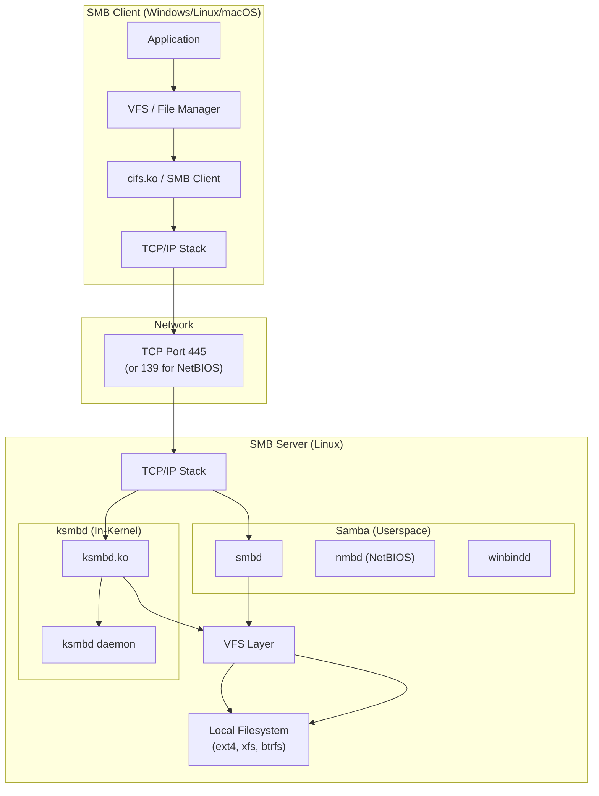
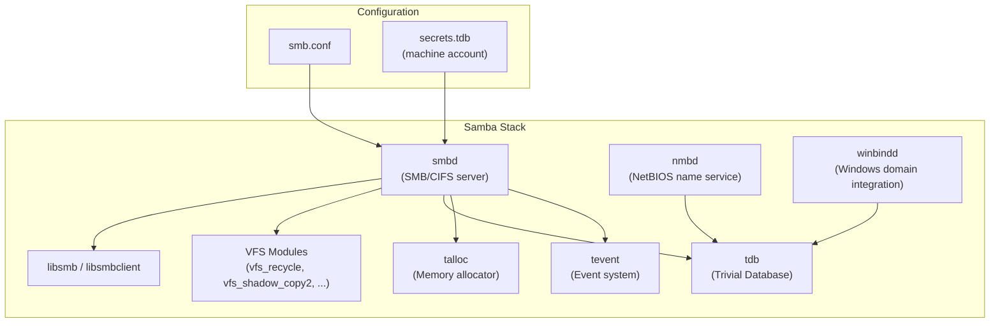
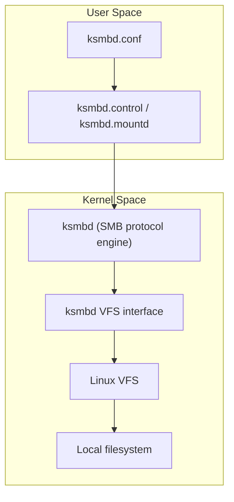

# CIFS/SMB Network Filesystem

## Introduction

**SMB (Server Message Block)** is the dominant network file-sharing protocol in enterprise environments, originally developed by IBM in 1984 and later popularized by Microsoft Windows. **CIFS (Common Internet File System)** is a specific dialect of SMB (SMB 1.0) introduced with Windows 95, though the terms are often used interchangeably. Modern implementations use SMB 2.x and 3.x dialects which are dramatically more efficient than the original CIFS.

Linux has two primary SMB server implementations:

- **Samba**: The long-standing, feature-rich userspace implementation (since 1992)
- **ksmbd**: A high-performance in-kernel SMB server (merged in Linux 5.15, 2021)

Both allow Linux systems to share files with Windows, macOS, and other Linux clients over standard networks.

## SMB Protocol Versions

| Dialect | Year | Key Features |
|---------|:----:|-------------|
| **CIFS (SMB 1.0)** | 1996 | Original Windows sharing; insecure, chatty, no encryption |
| **SMB 2.0** | 2006 | Reduced commands (from 100+ to 19), compounding, async I/O |
| **SMB 2.1** | 2010 | Leasing, large MTU support |
| **SMB 3.0** | 2012 | Multichannel, encryption, RDMA (SMB Direct), cluster support |
| **SMB 3.0.2** | 2014 | Performance improvements, durable handles v2 |
| **SMB 3.1.1** | 2015 | Pre-authentication integrity, AES-128-CCM encryption, negotiation contexts |
| **SMB over QUIC** | 2022 | SMB 3.1.1 over QUIC/UDP (Windows Server 2022+) |

> **Warning**: SMB 1.0/CIFS is deprecated and insecure. It is vulnerable to attacks like WannaCry/EternalBlue. Always disable SMB 1.0 and use SMB 3.0+ with encryption.

## Architecture Overview



### Samba Architecture



### ksmbd Architecture

ksmbd is an in-kernel SMB server that offers significantly lower latency and higher throughput than Samba by avoiding userspace/kernel context switches:



**ksmbd vs Samba comparison:**

| Feature | ksmbd | Samba |
|---------|:-----:|:-----:|
| Runs in | Kernel space | User space |
| Performance | Very high | Good |
| CPU overhead | Low | Moderate |
| AD Domain Controller | No | Yes |
| SMB1 support | No | Yes (deprecated) |
| VFS modules | Limited | Extensive |
| Clustering (CTDB) | No | Yes |
| Maturity | Since kernel 5.15 | Since 1992 |
| Best for | Simple file sharing | Full enterprise features |

## Configuration: Samba Server

### Installing Samba

```bash
# Debian/Ubuntu
sudo apt install samba samba-common-bin

# RHEL/CentOS/Fedora
sudo dnf install samba samba-common

# Enable and start services
sudo systemctl enable smb nmb
sudo systemctl start smb nmb

# Check version
smbd --version
```

### Basic Share Configuration

```bash
# Edit /etc/samba/smb.conf
sudo cp /etc/samba/smb.conf /etc/samba/smb.conf.backup

cat > /tmp/smb-share.conf << 'EOF'
[global]
    workgroup = WORKGROUP
    server string = Linux File Server
    server role = standalone server

    # Security
    security = user
    map to guest = never
    smb encrypt = desired

    # Performance
    socket options = TCP_NODELAY IPTOS_LOWDELAY
    read raw = yes
    write raw = yes
    use sendfile = yes
    aio read size = 16384
    aio write size = 16384
    min receivefile size = 16384

    # Logging
    log file = /var/log/samba/log.%m
    max log size = 1000
    log level = 1

    # Disable SMB1
    server min protocol = SMB2
    client min protocol = SMB2

[shared]
    path = /srv/samba/shared
    browseable = yes
    read only = no
    valid users = @smbusers
    create mask = 0664
    directory mask = 0775
    force group = smbusers

[homes]
    comment = Home Directories
    browseable = no
    read only = no
    valid users = %S
    create mask = 0700
    directory mask = 0700

[public]
    path = /srv/samba/public
    browseable = yes
    read only = no
    guest ok = yes
    guest only = yes
    force user = nobody
    create mask = 0666
    directory mask = 0777

[readonly-data]
    path = /srv/samba/data
    browseable = yes
    read only = yes
    valid users = @smbusers
    veto files = /*.exe/*.bat/*.cmd/
    hide unreadable = yes
EOF

sudo mv /tmp/smb-share.conf /etc/samba/smb.conf

# Create directories
sudo mkdir -p /srv/samba/{shared,public,data}
sudo chown root:smbusers /srv/samba/shared
sudo chmod 2775 /srv/samba/shared

# Create Samba users
sudo groupadd smbusers
sudo useradd -M -G smbusers smbuser1
sudo smbpasswd -a smbuser1
sudo smbpasswd -e smbuser1

# Validate configuration
testparm

# Restart Samba
sudo systemctl restart smb nmb
```

### Samba with Active Directory

```bash
# Install AD domain join packages
sudo apt install samba adcli krb5-user winbind libnss-winbind libpam-winbind

# Join domain
sudo net ads join -U administrator

# Configure winbind in smb.conf
# [global]
#     security = ads
#     realm = EXAMPLE.COM
#     workgroup = EXAMPLE
#     winbind use default domain = yes
#     idmap config * : backend = tdb
#     idmap config * : range = 10000-19999
#     idmap config EXAMPLE : backend = rid
#     idmap config EXAMPLE : range = 20000-99999

# Enable winbind
sudo systemctl enable winbind
sudo systemctl start winbind

# Test domain connectivity
wbinfo -t    # Trust check
wbinfo -u    # List domain users
wbinfo -g    # List domain groups
```

### Samba VFS Modules

```bash
# Enable recycle bin (vfs_recycle)
# In smb.conf:
# [shared]
#     vfs objects = recycle
#     recycle:repository = .recycle/%U
#     recycle:keeptree = yes
#     recycle:versions = yes
#     recycle:maxsize = 0

# Enable shadow copies (VSS)
# [shared]
#     vfs objects = shadow_copy2
#     shadow:format = @GMT-%Y.%m.%d-%H.%M.%S
#     shadow:sort = desc
#     shadow:localtime = yes

# Enable Btrfs snapshots as shadow copies
# [shared]
#     vfs objects = btrfs
#     btrfs: manipulate_snapshots = yes
```

## Configuration: ksmbd (In-Kernel Server)

### Installing ksmbd

```bash
# Kernel module (available in kernel 5.15+)
modprobe ksmbd

# Install userspace tools
# Debian/Ubuntu
sudo apt install ksmbd-tools

# RHEL/Fedora (may need to build from source)
# From: https://github.com/cifsd-team/ksmbd-tools

# Verify module loaded
lsmod | grep ksmbd
```

### Basic ksmbd Configuration

```bash
# /etc/ksmbd/ksmbd.conf
cat > /tmp/ksmbd.conf << 'EOF'
[global]
    netbios name = LINUXSERVER
    server string = ksmbd Server
    workgroup = WORKGROUP
    # Performance tuning
    max connections = 128
    max open files = 10000

[shared]
    path = /srv/ksmbd/shared
    browseable = yes
    read only = no
    guest ok = no
    valid users = ksmbuser1

[public]
    path = /srv/ksmbd/public
    browseable = yes
    read only = no
    guest ok = yes

[homes]
    path = /home/%U
    browseable = no
    read only = no
    valid users = %U
EOF

sudo mkdir -p /etc/ksmbd
sudo mv /tmp/ksmbd.conf /etc/ksmbd/ksmbd.conf

# Create directories
sudo mkdir -p /srv/ksmbd/{shared,public}

# Add ksmbd users
sudo useradd -M -s /sbin/nologin ksmbuser1
sudo smbpasswd -a ksmbuser1

# Or use ksmbd.adduser
sudo ksmbd.adduser -a ksmbuser1

# Manage shares
sudo ksmbd.share add shared /srv/ksmbd/shared
sudo ksmbd.share modify shared "valid users" = ksmbuser1

# Start ksmbd
sudo ksmbd.mountd

# Or use systemd
sudo systemctl enable ksmbd
sudo systemctl start ksmbd
```

## Configuration: SMB Client (Linux)

### Mounting SMB Shares

```bash
# Install SMB client tools
sudo apt install cifs-utils    # Debian/Ubuntu
sudo dnf install cifs-utils    # RHEL/Fedora

# Basic mount
sudo mount -t cifs //server/share /mnt/smb -o username=user1,password=secret

# Better: use credentials file
cat > /etc/samba/creds << 'EOF'
username=user1
password=secret
domain=WORKGROUP
EOF
chmod 600 /etc/samba/creds

sudo mount -t cifs //server/share /mnt/smb -o credentials=/etc/samba/creds

# With specific SMB version
sudo mount -t cifs //server/share /mnt/smb \
    -o credentials=/etc/samba/creds,vers=3.0

# With encryption
sudo mount -t cifs //server/share /mnt/smb \
    -o credentials=/etc/samba/creds,vers=3.0,seal

# Persistent mount in /etc/fstab
# //server/share  /mnt/smb  cifs  credentials=/etc/samba/creds,vers=3.0,_netdev  0 0
```

### SMB Client Tools

```bash
# List shares on a server
smbclient -L //server -U user1

# Connect to a share interactively
smbclient //server/share -U user1

# smbclient commands:
# ls, cd, get, put, mget, mput, mkdir, rmdir
# !command  — run local shell command

# Copy files
smbclient //server/share -U user1 -c "put localfile.txt remotefile.txt"
smbclient //server/share -U user1 -c "get remotefile.txt localfile.txt"

# List available SMB servers on network
nmblookup -S '*'

# Find SMB servers
avahi-browse -ar _smb._tcp
```

### smbstatus

```bash
# Show connected users and shares
sudo smbstatus

# Samba version 4.x output:
# PID     Username      Group         Machine            Protocol Version
# 12345   user1         users         192.168.1.100      SMB3_11
#
# Service      pid     Machine       Connected at
# shared       12345   192.168.1.100  Mon Jul 22 10:30:00 2024
#
# Locked files:
# Pid          User          Type            Size
# 12345        user1         DENY_DOS        0
```

## SMB Multichannel

SMB 3.0+ Multichannel allows multiple TCP connections per session for increased throughput:

```bash
# Enable multichannel in Samba smb.conf
# [global]
#     server multi channel support = yes
#     aio read size = 1
#     aio write size = 1

# Client: verify multichannel is active
# Mount with SMB 3.0+
sudo mount -t cifs //server/share /mnt/smb -o vers=3.0

# Check connected channels (Windows client)
# Get-SmbMultichannelConnection

# Linux client: check via network interfaces
ip link show | grep -i "state UP"
```

## SMB Direct (RDMA)

SMB 3.0+ supports RDMA transport (SMB Direct) for ultra-low latency:

```bash
# Server: ksmbd supports SMB Direct
# Requires RDMA-capable NIC and ksmbd compiled with RDMA support

# Verify RDMA support
modprobe ksmbd
dmesg | grep -i ksmbd | grep -i rdma

# Client: Windows supports SMB Direct natively
# Linux cifs.ko: SMB Direct support is available in newer kernels
# Check: modinfo cifs | grep -i rdma
```

## Performance Tuning

### Server-Side (Samba)

```bash
# /etc/samba/smb.conf — [global] section

# Disable SMB1
server min protocol = SMB2
client min protocol = SMB2

# Enable sendfile for zero-copy
use sendfile = yes

# Async I/O
aio read size = 16384
aio write size = 16384

# Socket tuning
socket options = TCP_NODELAY IPTOS_LOWDELAY SO_RCVBUF=131072 SO_SNDBUF=131072

# Increase max connections
max connections = 0    # unlimited

# Change notify (reduce polling overhead)
change notify = yes
kernel change notify = yes

# Logging (reduce overhead in production)
log level = 0    # Minimal logging
```

### Server-Side (ksmbd)

```bash
# ksmbd.conf — [global] section
max connections = 512
max open files = 65536

# ksmbd benefits from kernel-level optimizations
# Ensure kernel has CONFIG_SMB_SERVER=m enabled
```

### Client-Side

```bash
# Mount with performance options
sudo mount -t cifs //server/share /mnt/smb \
    -o vers=3.0,credentials=/etc/samba/creds,\
rsize=1048576,wsize=1048576,cache=strict,\
mfsymlinks,noperm

# rsize/wsize: Read/write buffer sizes (up to 1MB with SMB3)
# cache=strict: Client-side caching for performance
# mfsymlinks: Support for Unix symlinks

# Increase async readahead
echo 256 | sudo tee /proc/fs/cifs/cifsFYI
```

### Network-Level

```bash
# Use Jumbo Frames
sudo ip link set enp1s0f0 mtu 9000

# Dedicated VLAN for file sharing
sudo ip link add link enp1s0f0 name enp1s0f0.50 type vlan id 50
sudo ip addr add 10.0.50.1/24 dev enp1s0f0.50

# TCP tuning
echo "net.core.rmem_max = 16777216" | sudo tee -a /etc/sysctl.d/smb.conf
echo "net.core.wmem_max = 16777216" | sudo tee -a /etc/sysctl.d/smb.conf
sudo sysctl -p /etc/sysctl.d/smb.conf
```

## Monitoring

```bash
# Samba connected clients
sudo smbstatus

# Active sessions with details
sudo smbstatus -v

# Open files
sudo smbstatus -L

# Samba statistics
sudo smbstatus -p

# ksmbd statistics
cat /sys/module/ksmbd/version 2>/dev/null
dmesg | grep -i ksmbd

# Monitor SMB traffic
sudo tcpdump -i enp1s0f0 port 445 -w smb_capture.pcap

# Analyze SMB traffic with tshark
tshark -r smb_capture.pcap -Y "smb2.cmd == 5"  # Read requests
tshark -r smb_capture.pcap -Y "smb2.cmd == 6"  # Write requests

# File system performance from client
dd if=/dev/zero of=/mnt/smb/testfile bs=1M count=1024 conv=fdatasync
dd if=/mnt/smb/testfile of=/dev/null bs=1M
```

## Troubleshooting

### Common Issues

**Connection refused:**
```bash
# Check Samba is running
sudo systemctl status smb

# Check port 445 is listening
ss -tlnp | grep 445

# Check firewall
sudo iptables -L -n | grep 445
sudo ufw allow samba

# Test from client
smbclient -L //server -U user1 -d 3    # Debug level 3
```

**Permission denied:**
```bash
# Check Samba user exists
sudo pdbedit -L -v

# Check filesystem permissions
ls -la /srv/samba/shared/

# Check SELinux context (RHEL)
sudo semanage fcontext -a -t samba_share_t "/srv/samba/shared(/.*)?"
sudo restorecon -Rv /srv/samba/shared

# Check AppArmor (Ubuntu)
sudo aa-status | grep samba
```

**Slow performance:**
```bash
# Verify SMB version (not SMB1)
smbstatus    # Check Protocol Version column

# Check for SMB1 usage
sudo smbstatus | grep NT1

# Verify no SMB1 on network
tshark -r capture.pcap -Y "smb.cmd == 0x72"  # SMB1 negotiate

# Check network path MTU
ping -M do -s 8972 server
```

**Name resolution fails:**
```bash
# Check NetBIOS name resolution
nmblookup servername

# Check DNS resolution
nslookup servername

# Add to /etc/hosts if needed
echo "192.168.1.10 server" | sudo tee -a /etc/hosts

# Use IP directly
smbclient //192.168.1.10/share -U user1
```

## Security Best Practices

1. **Disable SMB 1** — `server min protocol = SMB2` (SMB1 is vulnerable to EternalBlue)
2. **Enable SMB encryption** — `smb encrypt = required` for sensitive shares
3. **Use strong passwords** for Samba users (separate from system passwords)
4. **Restrict access** with `hosts allow` and `hosts deny`
5. **Use firewall rules** to limit SMB access to trusted networks
6. **Enable audit logging** for compliance: `vfs objects = full_audit`
7. **Keep Samba updated** — security patches are regularly released
8. **Use Active Directory** for centralized authentication in enterprise environments

```bash
# Example: Restrict access by IP
# [shared]
#     hosts allow = 192.168.1.0/24 10.0.0.0/8
#     hosts deny = 0.0.0.0/0
```

## References

- Samba project: <https://www.samba.org/>
- ksmbd project: <https://github.com/cifsd-team/ksmbd-tools>
- SMB/CIFS protocol specification: Microsoft MS-SMB2
- Samba smb.conf documentation: `man smb.conf`
- cifs-utils documentation: `man mount.cifs`
- ksmbd kernel documentation: `Documentation/filesystems/cifs/` in Linux source
- ksmbd In-Kernel SMB Server (LWN): <https://lwn.net/Articles/871866/>
- Samba wiki: <https://wiki.samba.org/>
- Red Hat Samba documentation: <https://docs.redhat.com/en/documentation/red_hat_enterprise_linux/9/html/managing_file_systems/>
