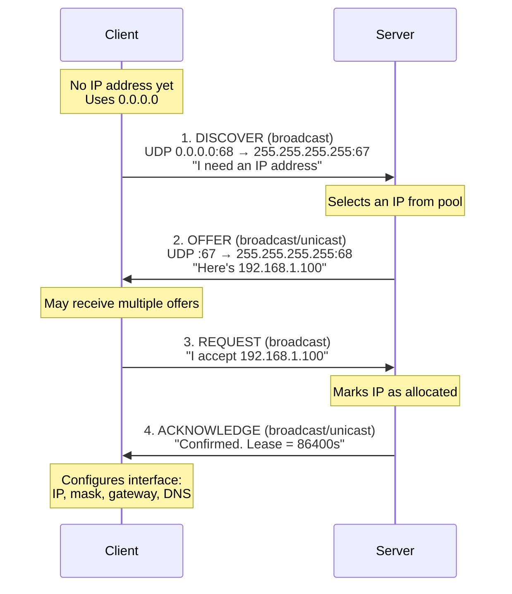
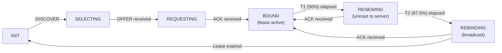
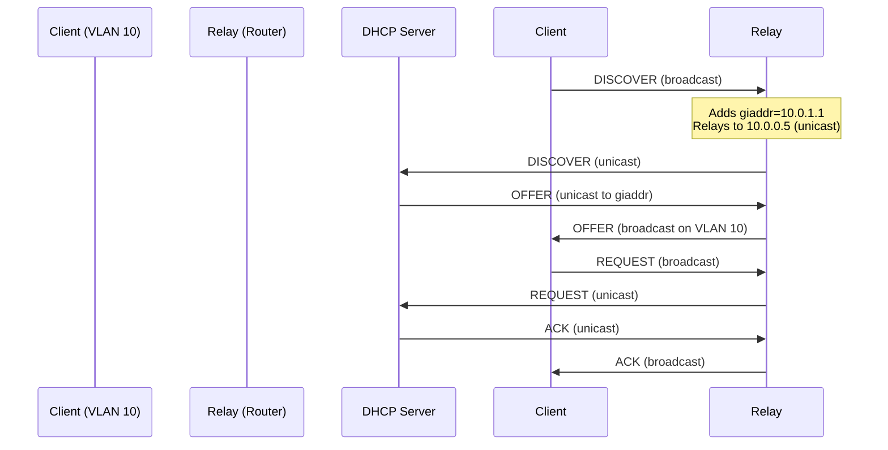
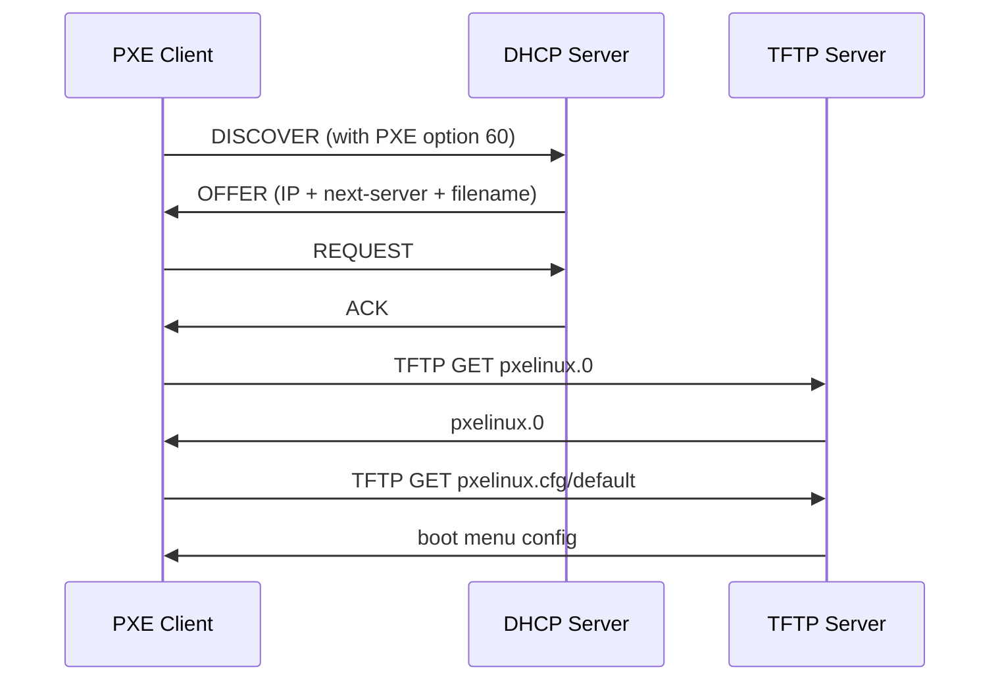

# DHCP

## Introduction

The **Dynamic Host Configuration Protocol (DHCP)** automates the assignment of IP addresses, subnet masks, default gateways, DNS servers, and other network parameters to hosts. Defined in RFC 2131 (DHCPv4) and RFC 8415 (DHCPv6), DHCP eliminates manual IP configuration and is essential for networks of any size — from home Wi-Fi to enterprise campuses with thousands of devices. This chapter covers the DHCP protocol mechanics, Linux DHCP clients and servers, lease management, and modern alternatives like systemd-networkd.

## The DORA Process

DHCPv4 uses a four-step process known as **DORA**: Discover, Offer, Request, Acknowledge.



**Packet details:**

| Step | Source | Destination | UDP Ports | Key Fields |
|------|--------|-------------|-----------|------------|
| DISCOVER | 0.0.0.0 | 255.255.255.255 | 68 → 67 | Client MAC, hostname, requested params |
| OFFER | Server IP | 255.255.255.255 | 67 → 68 | Offered IP, subnet, gateway, lease time |
| REQUEST | 0.0.0.0 | 255.255.255.255 | 68 → 67 | Selected IP, server identifier |
| ACK | Server IP | 255.255.255.255 | 67 → 68 | Final configuration, lease duration |

**Why broadcast for REQUEST?** If multiple DHCP servers sent OFFERs, the broadcast REQUEST tells all servers which offer was accepted. Non-selected servers return their offered IP to the pool.

## DHCP Lease Lifecycle



- **T1 (Renewal Timer)**: 50% of lease time — client unicasts RENEW to the original server
- **T2 (Rebinding Timer)**: 87.5% of lease time — client broadcasts REBIND to any server
- **Lease Expiry**: Client must stop using the address and start over

```bash
# View current DHCP leases on a Linux client
$ cat /var/lib/dhcp/dhclient.leases
lease {
  interface "eth0";
  fixed-address 192.168.1.100;
  option subnet-mask 255.255.255.0;
  option routers 192.168.1.1;
  option domain-name-servers 8.8.8.8, 8.8.4.4;
  option dhcp-lease-time 86400;
  option dhcp-message-type 5;
  option dhcp-server-identifier 192.168.1.1;
  renew 4 2024/01/15 12:00:00;
  rebind 4 2024/01/15 21:00:00;
  expire 5 2024/01/16 00:00:00;
}
```

## DHCP Options

DHCP uses **options** (TLV — Type-Length-Value) to convey configuration parameters beyond the basic IP address.

**Common DHCP options:**

| Option | Name | Description | Example |
|--------|------|-------------|---------|
| 1 | Subnet Mask | Network mask | 255.255.255.0 |
| 3 | Router | Default gateway | 192.168.1.1 |
| 6 | DNS Server | Name servers | 8.8.8.8, 8.8.4.4 |
| 12 | Hostname | Client hostname | "webserver01" |
| 15 | Domain Name | Search domain | "example.com" |
| 42 | NTP Server | Time servers | 0.pool.ntp.org |
| 43 | Vendor-Specific | Vendor options | — |
| 51 | IP Lease Time | Lease duration (seconds) | 86400 |
| 53 | Message Type | DHCP message type | 1=Discover, 2=Offer... |
| 54 | Server Identifier | DHCP server IP | 192.168.1.1 |
| 60 | Vendor Class ID | Client vendor | "MSFT 5.0" |
| 61 | Client Identifier | Client ID (usually MAC) | 01:aa:bb:cc:dd:ee:ff |
| 66 | TFTP Server | Boot server | 10.0.0.5 |
| 67 | Bootfile Name | Boot filename | "pxelinux.0" |
| 81 | FQDN | Client FQDN | "host.example.com" |
| 119 | Domain Search | DNS search list | "example.com,corp.local" |
| 121 | Classless Static Route | CIDR routes | 10.0.0.0/8 via 192.168.1.1 |

**Requesting specific options with dhclient:**

```bash
# /etc/dhclient.conf
# Request specific options
request subnet-mask, routers, domain-name-servers, domain-name,
        ntp-servers, interface-mtu;

# Send custom option (vendor class)
send vendor-class-identifier "MyLinuxHost";

# Set a specific hostname
send host-name "webserver01";

# Override the default lease time request
request dhcp-lease-time 3600;

# Use a specific client identifier
interface "eth0" {
    send dhcp-client-identifier 01:aa:bb:cc:dd:ee:ff;
}
```

## Linux DHCP Clients

### dhclient (ISC DHCP Client)

The traditional ISC DHCP client, widely used on older distributions.

```bash
# Obtain a lease on eth0
$ dhclient eth0

# Release the current lease
$ dhclient -r eth0

# Request a specific address (hint, not guaranteed)
$ dhclient -s 192.168.1.50 eth0

# Use a custom config file
$ dhclient -cf /etc/dhclient-custom.conf eth0

# Run in foreground with verbose output
$ dhclient -v -d eth0
Listening on LPF/eth0/00:1a:2b:3c:4d:5e
Sending on   LPF/eth0/00:1a:2b:3c:4d:5e
Sending on   Socket/fallback
DHCPDISCOVER on eth0 to 255.255.255.255 port 67 interval 3
DHCPOFFER from 192.168.1.1
DHCPREQUEST on eth0 to 255.255.255.255 port 67
DHCPACK from 192.168.1.1
bound to 192.168.1.100 -- renewal in 43200 seconds.
```

### NetworkManager

Modern desktop/server distributions default to NetworkManager:

```bash
# Check connection status
$ nmcli device status
DEVICE  TYPE      STATE      CONNECTION
eth0    ethernet  connected  Wired connection 1
wlan0   wifi      disconnected  --

# View DHCP-assigned details
$ nmcli device show eth0
IP4.ADDRESS[1]:         192.168.1.100/24
IP4.GATEWAY:            192.168.1.1
IP4.DNS[1]:             8.8.8.8
IP4.DNS[2]:             8.8.4.4
DHCP4.OPTION[1]:        dhcp_server_identifier = 192.168.1.1
DHCP4.OPTION[2]:        expiry = 1705123200
DHCP4.OPTION[3]:        ip_address = 192.168.1.100

# Force DHCP renewal
$ nmcli con down "Wired connection 1" && nmcli con up "Wired connection 1"

# Set DHCP with custom hostname
$ nmcli con mod "Wired connection 1" \
    ipv4.method auto \
    dhcp-hostname "myserver" \
    dhcp-send-hostname yes
```

### systemd-networkd

Lightweight, server-oriented network manager:

```ini
# /etc/systemd/network/20-dhcp.network
[Match]
Name=eth0

[Network]
DHCP=ipv4
DNSSEC=no

[DHCPv4]
UseDNS=yes
UseNTP=yes
UseHostname=yes
SendHostname=yes
Hostname=myserver
UseDomains=yes
RouteMetric=100
```

```bash
# Enable and start
$ systemctl enable --now systemd-networkd

# Check DHCP lease
$ networkctl status eth0
● 2: eth0
     Link File: /usr/lib/systemd/network/99-default.link
  Network File: /etc/systemd/network/20-dhcp.network
         State: routable (configured)
  Address: 192.168.1.100/24
  Gateway: 192.168.1.1
  DNS: 8.8.8.8
       8.8.4.4

# View lease information
$ networkctl status eth0 --no-pager | grep -A20 "DHCPv4"
    DHCPv4 Client ID: 01:00:1a:2b:3c:4d:5e
    DHCPv4 Address: 192.168.1.100
    DHCPv4 Lease Duration: 1d
    DHCPv4 T1: 12h
    DHCPv4 T2: 21h
```

## ISC DHCP Server

### Installation and Basic Configuration

```bash
# Install on Debian/Ubuntu
$ apt install isc-dhcp-server

# Install on RHEL/CentOS
$ dnf install dhcp-server

# Configure the listening interface
# /etc/default/isc-dhcp-server (Debian)
INTERFACESv4="eth0"
INTERFACESv6=""
```

### Basic Subnet Configuration

```
# /etc/dhcp/dhcpd.conf

# Global options
option domain-name "example.com";
option domain-name-servers 8.8.8.8, 8.8.4.4;
default-lease-time 86400;
max-lease-time 172800;
authoritative;

# Subnet declaration
subnet 192.168.1.0 netmask 255.255.255.0 {
    range 192.168.1.100 192.168.1.200;
    option routers 192.168.1.1;
    option broadcast-address 192.168.1.255;
    option ntp-servers 0.pool.ntp.org;
}

# Static reservation (DHCP reservation by MAC)
host webserver {
    hardware ethernet aa:bb:cc:dd:ee:ff;
    fixed-address 192.168.1.10;
    option host-name "webserver";
}

# PXE boot configuration
class "pxeclients" {
    match if substring(option vendor-class-identifier, 0, 9) = "PXEClient";
    next-server 192.168.1.5;
    filename "pxelinux.0";
}
```

### Advanced Configuration

```
# Multiple subnets with shared physical network
shared-network "floor1" {
    subnet 192.168.1.0 netmask 255.255.255.0 {
        range 192.168.1.100 192.168.1.200;
        option routers 192.168.1.1;
    }
    subnet 10.0.1.0 netmask 255.255.255.0 {
        range 10.0.1.100 10.0.1.200;
        option routers 10.0.1.1;
    }
}

# VLAN-aware configuration (DHCP relay)
subnet 172.16.0.0 netmask 255.255.0.0 {
    # Relay agent adds option 82
    if exists agent.circuit-id {
        # VLAN-specific pool
        pool {
            range 172.16.1.100 172.16.1.200;
            allow members of "vlan10";
        }
    }
}

# Class-based allocation
class "virtual-machines" {
    match if option vendor-class-identifier = "virtio";
    option domain-name-servers 10.0.0.53;
}
```

### Server Management

```bash
# Start the DHCP server
$ systemctl start isc-dhcp-server
$ systemctl enable isc-dhcp-server

# Validate configuration
$ dhcpd -t -cf /etc/dhcp/dhcpd.conf
Internet Systems Consortium DHCP Server
Configuration file errors checked -- no errors found

# View active leases
$ cat /var/lib/dhcp/dhcpd.leases
lease 192.168.1.100 {
  starts 4 2024/01/15 00:00:00;
  ends 5 2024/01/16 00:00:00;
  cltt 4 2024/01/15 00:00:00;
  binding state active;
  hardware ethernet aa:bb:cc:dd:ee:ff;
  uid "\001aa\273\314\335\356\377";
  client-hostname "laptop01";
}

# View DHCP server logs
$ journalctl -u isc-dhcp-server -f
Jan 15 10:00:00 dhcpd[1234]: DHCPREQUEST for 192.168.1.100 from aa:bb:cc:dd:ee:ff
Jan 15 10:00:00 dhcpd[1234]: DHCPACK on 192.168.1.100 to aa:bb:cc:dd:ee:ff via eth0
```

## DHCP Relay Agent

When the DHCP server is on a different subnet, a **relay agent** forwards DHCP messages:

```bash
# Install relay agent
$ apt install isc-dhcp-relay

# Configure: /etc/default/isc-dhcp-relay
SERVERS="10.0.0.5"
INTERFACES="eth0 eth1 eth2"
OPTIONS=""

# Or using ip helper-address on a Cisco router:
# interface Vlan10
#   ip helper-address 10.0.0.5
```



## DHCP Snooping and Security

DHCP snooping is a Layer 2 security feature (on managed switches) that prevents rogue DHCP servers:

**Attack scenario**: Attacker connects a rogue DHCP server that offers malicious DNS/gateway, enabling MITM attacks.

**Linux-based mitigation:**

```bash
# Monitor for rogue DHCP servers using dhcpdump
$ dhcpdump -i eth0

# Use nftables to block unauthorized DHCP servers
$ nft add rule ip filter INPUT iifname "eth0" udp sport 67 \
    ip saddr != 192.168.1.1 drop

# Firewall rule to only allow known DHCP server
$ iptables -A INPUT -i eth0 -p udp --dport 67 -s 192.168.1.1 -j ACCEPT
$ iptables -A INPUT -i eth0 -p udp --dport 67 -j DROP
```

## DHCP vs Static vs Alternatives

| Method | Pros | Cons | Use Case |
|--------|------|------|----------|
| **DHCP** | Automatic, scalable, centralized | Slight delay at boot, dependency on server | End-user devices, VMs, IoT |
| **Static** | Always the same, no server needed | Manual management, error-prone | Servers, routers, infrastructure |
| **SLAAC** | No server needed (IPv6) | No DNS info by default, limited control | IPv6 hosts |
| **DHCPv6** | Full control, centralized (IPv6) | Not supported by all clients (Android) | Enterprise IPv6 |
| **mDNS** | Zero-configuration | Local link only | Small/home networks |

## Debugging DHCP Issues

```bash
# Capture DHCP traffic with tcpdump
$ tcpdump -i eth0 -n port 67 or port 68 -v
10:00:00.000000 IP (tos 0x0, ttl 128, id 0, offset 0, flags [none],
    proto UDP (17), length 328)
    0.0.0.0.68 > 255.255.255.255.67: BOOTP/DHCP, Request from 00:1a:2b:3c:4d:5e,
    length 300, xid 0x12345678, Flags [none]
      Client-IP 0.0.0.0
      Client-Ethernet-Address 00:1a:2b:3c:4d:5e
      DHCP-Message Option 53, length 1: Discover

# Trace the full DHCP exchange
$ tcpdump -i eth0 -n port 67 or port 68 -e -vv

# Test DHCP without modifying the system
$ dhclient -nw -v eth0   # Don't configure, just test

# Check if port 68 is in use
$ ss -ulnp | grep :68
UNCONN  0  0  0.0.0.0:68  0.0.0.0:*  users:(("dhclient",pid=1234,fd=6))

# On the server: check if requests arrive
$ tcpdump -i eth0 -n port 67 or port 68 -v

# Verify server configuration
$ dhcpd -t -cf /etc/dhcp/dhcpd.conf
```

## Kea DHCP Server (Modern Alternative)

Kea is the modern replacement for ISC DHCP, developed by ISC (the same organization). It uses JSON configuration and supports REST API management.

```bash
# Install Kea
apt install kea-dhcp4-server kea-dhcp6-server  # Debian/Ubuntu

# Basic configuration: /etc/kea/kea-dhcp4.conf
{
    "Dhcp4": {
        "interfaces-config": {
            "interfaces": ["eth0"]
        },
        "lease-database": {
            "type": "memfile",
            "persist": true,
            "name": "/var/lib/kea/kea-leases4.csv"
        },
        "subnet4": [{
            "subnet": "192.168.1.0/24",
            "pools": [{ "pool": "192.168.1.100 - 192.168.1.200" }],
            "option-data": [
                { "name": "routers", "data": "192.168.1.1" },
                { "name": "domain-name-servers", "data": "8.8.8.8, 8.8.4.4" }
            ],
            "reservations": [{
                "hw-address": "aa:bb:cc:dd:ee:ff",
                "ip-address": "192.168.1.10",
                "hostname": "webserver"
            }]
        }]
    }
}

# Start Kea
systemctl enable --now kea-dhcp4-server

# Kea supports a REST API for lease management
# Enable in config:
# "control-socket": { "socket-type": "unix", "socket-name": "/tmp/kea4-ctrl-socket" }

# Query leases via REST
socat - UNIX-CONNECT:/tmp/kea4-ctrl-socket <<< '{"command": "lease4-get-all"}'
```

### Kea vs ISC DHCP

| Feature | ISC DHCP | Kea |
|---------|----------|-----|
| Configuration | Custom format | JSON |
| API | None | REST (control socket) |
| Lease storage | Flat file | memfile, MySQL, PostgreSQL, Cassandra |
| HA | Manual failover | Built-in HA (hot standby) |
| Performance | ~1000 leases/sec | ~10,000+ leases/sec |
| Status | End of life (EOL 2022) | Actively maintained |

## DHCP High Availability

### Kea HA Configuration

```json
{
    "Dhcp4": {
        "hooks-libraries": [{
            "library": "/usr/lib/kea/hooks/libdhcp_ha.so",
            "parameters": {
                "high-availability": [{
                    "this-server-name": "server1",
                    "mode": "hot-standby",
                    "peers": [{
                        "name": "server1",
                        "url": "http://192.168.1.1:8000/",
                        "role": "primary"
                    }, {
                        "name": "server2",
                        "url": "http://192.168.1.2:8000/",
                        "role": "standby"
                    }]
                }]
            }
        }]
    }
}
```

### ISC DHCP Failover (Legacy)

```
# Primary server: /etc/dhcp/dhcpd.conf
failover peer "dhcp-failover" {
    primary;
    address 192.168.1.1;
    port 647;
    peer address 192.168.1.2;
    peer port 847;
    max-response-delay 60;
    max-unacked-updates 10;
    load balance max seconds 3;
    mclt 3600;
    split 128;
}

subnet 192.168.1.0 netmask 255.255.255.0 {
    pool {
        failover peer "dhcp-failover";
        range 192.168.1.100 192.168.1.200;
    }
    option routers 192.168.1.1;
}

# Secondary server: /etc/dhcp/dhcpd.conf
failover peer "dhcp-failover" {
    secondary;
    address 192.168.1.2;
    port 847;
    peer address 192.168.1.1;
    peer port 647;
    max-response-delay 60;
    max-unacked-updates 10;
    load balance max seconds 3;
}
```

## DHCP for PXE Boot

PXE (Preboot Execution Environment) uses DHCP to network-boot machines:



```bash
# DHCP server config for PXE
# /etc/dhcp/dhcpd.conf
class "pxeclients" {
    match if substring(option vendor-class-identifier, 0, 9) = "PXEClient";
    next-server 192.168.1.5;
    filename "pxelinux.0";
}

# For UEFI PXE boot
class "uefi-clients" {
    match if option architecture = 00:07;  # EFI x86-64
    next-server 192.168.1.5;
    filename "grubx64.efi";
}

class "bios-clients" {
    match if option architecture = 00:00;  # BIOS
    next-server 192.168.1.5;
    filename "pxelinux.0";
}
```

## DHCP Option 82 (Relay Agent Information)

DHCP relay agents can insert Option 82 to identify the client's physical location:

```
# Option 82 sub-options:
# Circuit ID (sub-option 1): switch port identifier
# Remote ID (sub-option 2): switch MAC address

# ISC DHCP server: use Option 82 for policy
class "vlan10-ports" {
    match if option agent.circuit-id = 0a:01;  # VLAN 10, port 1
    option domain-name-servers 10.0.10.53;
    pool {
        range 172.16.10.100 172.16.10.200;
    }
}
```

## DHCPv4-over-DHCPv6 (RFC 7341)

For dual-stack networks that want to use DHCPv6 transport for DHCPv4 configuration:

```bash
# This mechanism allows DHCPv4 messages to be
# encapsulated inside DHCPv6 messages
# Useful when only IPv6 transport is available

# Requires dhclient with DHCPv4-over-DHCPv6 support
dhclient -4 -6 -cf /etc/dhclient-dual.conf eth0
```

## DHCP Rate Limiting and Protection

```bash
# Limit DHCP requests per port on managed switches
# (Cisco example)
# interface GigabitEthernet0/1
#   ip dhcp relay information trusted
#   ip dhcp limit address 5

# Linux: rate limit DHCP with iptables
iptables -A INPUT -p udp --dport 67 -m limit --limit 100/sec --limit-burst 200 -j ACCEPT
iptables -A INPUT -p udp --dport 67 -j DROP

# Monitor DHCP traffic
watch -n 1 'ss -ulnp | grep :67'

# Block rogue DHCP servers
iptables -A INPUT -i eth0 -p udp --sport 67 \
  -s ! 192.168.1.1 -j DROP
```

## Further Reading

- [The Linux Kernel Documentation](https://docs.kernel.org/)
- [LWN.net - Linux and free software news](https://lwn.net/)
- [GNU Project Documentation](https://www.gnu.org/doc/doc.html)
- [GNU Manuals](https://www.gnu.org/manual/manual.html)
- [Free Software Directory](https://directory.fsf.org/wiki/Main_Page)
- [Planet GNU](https://planet.gnu.org/)
- [Free Software Books](https://www.gnu.org/doc/other-free-books.html)

- [RFC 2131 — Dynamic Host Configuration Protocol](https://www.rfc-editor.org/rfc/rfc2131)
- [RFC 8415 — DHCPv6](https://www.rfc-editor.org/rfc/rfc8415)
- [RFC 2132 — DHCP Options and BOOTP Vendor Extensions](https://www.rfc-editor.org/rfc/rfc2132)
- [ISC DHCP Server Documentation](https://kb.isc.org/docs/isc-dhcp-44-manual-pages)
- [systemd-networkd DHCP Configuration](https://www.freedesktop.org/software/systemd/man/systemd.network.html)
- [dhclient.conf man page](https://man7.org/linux/man-pages/man5/dhclient.conf.5.html)

## Related Topics

- [IP Addressing and Subnetting](./ip-addressing.md) — Address ranges and subnet design
- [DNS](./dns.md) — DHCP often provides DNS server addresses
- [IPv6](./ipv6.md) — DHCPv6 and SLAAC
- [Network Troubleshooting](./troubleshooting.md) — Debugging DHCP failures
- [Packet Capture](./packet-capture.md) — Analyzing DHCP packets
- [OSI Model](./osi-model.md) — DHCP operates at the application layer
