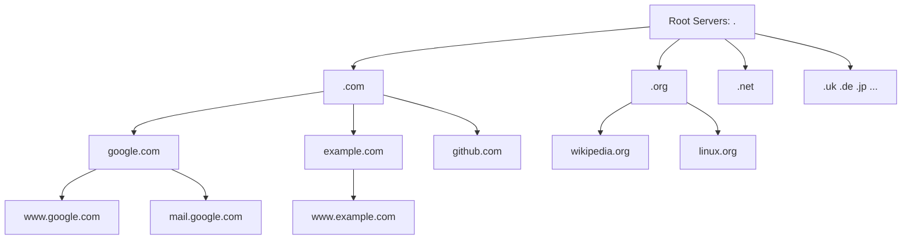
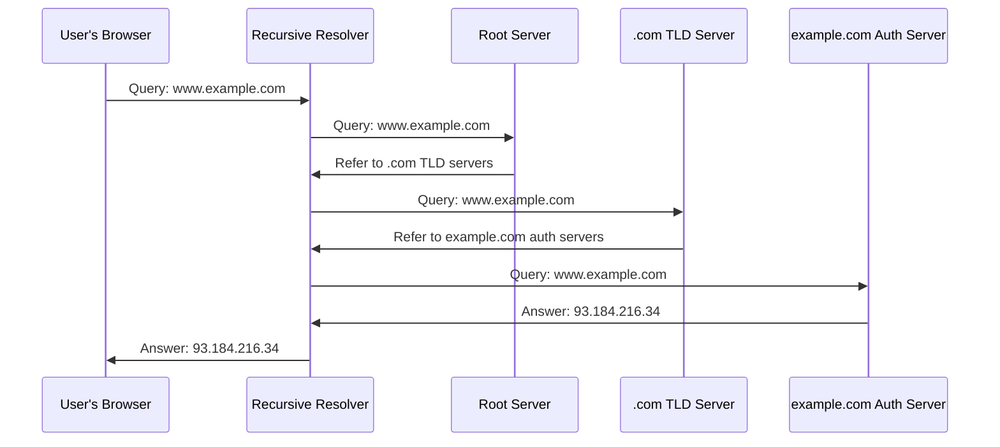
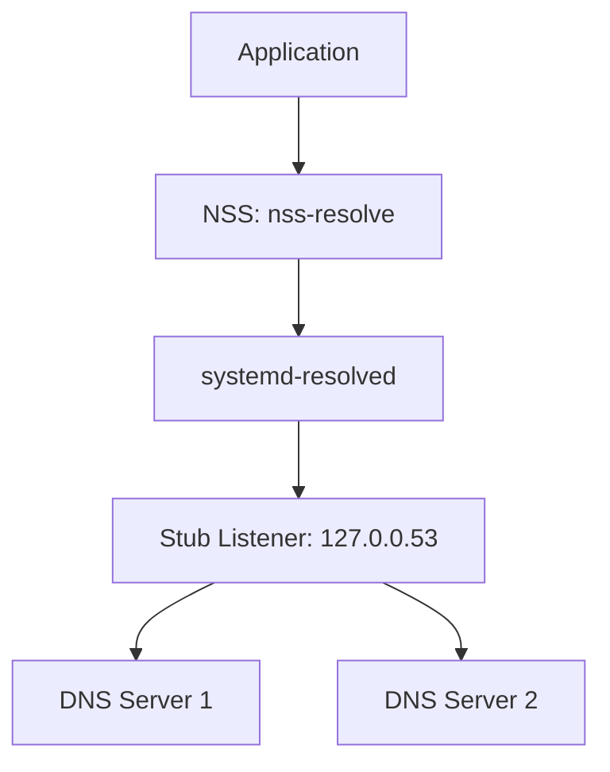
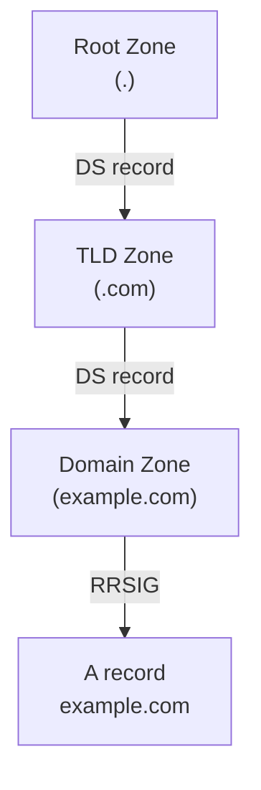
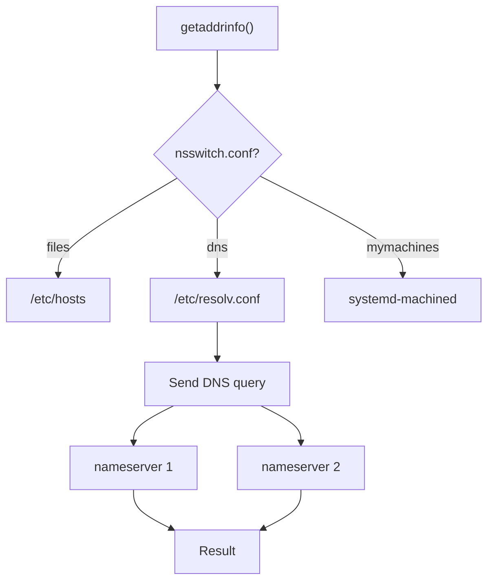

# DNS: Domain Name System

## Introduction

The Domain Name System (DNS) is a hierarchical, decentralized naming system that translates human-readable domain names (like `example.com`) into IP addresses (like `93.184.216.34`). DNS is one of the most critical services on the internet — virtually every network communication begins with a DNS lookup.

This chapter covers DNS architecture, record types, resolvers, configuration files, and troubleshooting techniques.

## DNS Architecture

### Hierarchical Structure

DNS uses a tree-like hierarchy:



### DNS Resolution Process



### DNS Components

| Component | Description |
|-----------|-------------|
| **Stub Resolver** | Client library on user's machine |
| **Recursive Resolver** | Server that performs full resolution |
| **Root Server** | Top of DNS hierarchy (13 root servers) |
| **TLD Server** | Manages top-level domains (.com, .org, etc.) |
| **Authoritative Server** | Holds actual DNS records for a domain |

## DNS Record Types

### A Record (IPv4 Address)

Maps a domain name to an IPv4 address:

```bash
# Query A record
$ dig example.com A
;; ANSWER SECTION:
example.com.        86400   IN  A   93.184.216.34
```

### AAAA Record (IPv6 Address)

Maps a domain name to an IPv6 address:

```bash
# Query AAAA record
$ dig example.com AAAA
;; ANSWER SECTION:
example.com.        86400   IN  AAAA    2606:2800:220:1:248:1893:25c8:1946
```

### CNAME Record (Canonical Name)

Creates an alias from one domain to another:

```bash
# Query CNAME record
$ dig www.example.com CNAME
;; ANSWER SECTION:
www.example.com.    86400   IN  CNAME   example.com.
```

### MX Record (Mail Exchange)

Specifies mail servers for a domain:

```bash
# Query MX record
$ dig example.com MX
;; ANSWER SECTION:
example.com.        86400   IN  MX  10 mail.example.com.
example.com.        86400   IN  MX  20 mail2.example.com.
```

### NS Record (Name Server)

Specifies authoritative name servers:

```bash
# Query NS record
$ dig example.com NS
;; ANSWER SECTION:
example.com.        86400   IN  NS  a.iana-servers.net.
example.com.        86400   IN  NS  b.iana-servers.net.
```

### TXT Record (Text)

Stores arbitrary text data, often used for verification and security:

```bash
# Query TXT record
$ dig example.com TXT
;; ANSWER SECTION:
example.com.        86400   IN  TXT "v=spf1 -all"
```

**Common TXT record uses:**
- **SPF**: Sender Policy Framework for email authentication
- **DKIM**: DomainKeys Identified Mail
- **DMARC**: Domain-based Message Authentication
- **Domain verification**: Google, Microsoft, etc.

### SOA Record (Start of Authority)

Contains administrative information about a DNS zone:

```bash
# Query SOA record
$ dig example.com SOA
;; ANSWER SECTION:
example.com.    86400   IN  SOA dns1.example.com. hostmaster.example.com. (
                2024010101  ; Serial
                3600        ; Refresh
                900         ; Retry
                604800      ; Expire
                86400       ; Minimum TTL
            )
```

### SRV Record (Service)

Specifies the location of servers for specific services:

```bash
# Query SRV record
$ dig _sip._tcp.example.com SRV
;; ANSWER SECTION:
_sip._tcp.example.com. 86400 IN SRV 10 60 5060 sip.example.com.
```

### PTR Record (Pointer)

Reverse DNS lookup — maps IP address to domain name:

```bash
# Reverse DNS lookup
$ dig -x 93.184.216.34
;; ANSWER SECTION:
34.216.184.93.in-addr.arpa. 86400 IN PTR example.com.
```

### Complete Record Types Reference

| Type | Description | Example |
|------|-------------|---------|
| A | IPv4 address | `example.com. IN A 93.184.216.34` |
| AAAA | IPv6 address | `example.com. IN AAAA 2606:2800:...` |
| CNAME | Canonical name | `www.example.com. IN CNAME example.com.` |
| MX | Mail exchange | `example.com. IN MX 10 mail.example.com.` |
| NS | Name server | `example.com. IN NS ns1.example.com.` |
| TXT | Text data | `example.com. IN TXT "v=spf1 -all"` |
| SOA | Start of authority | Zone administrative data |
| SRV | Service location | `_sip._tcp.example.com. IN SRV ...` |
| PTR | Reverse lookup | `34.216.184.93.in-addr.arpa. IN PTR ...` |
| CAA | Certificate authority | `example.com. IN CAA 0 issue "letsencrypt.org"` |

## DNS Resolution on Linux

### Stub Resolver

The stub resolver is a library on the client machine that sends queries to a recursive resolver:

```bash
# View resolver configuration
$ cat /etc/resolv.conf
# Generated by NetworkManager
nameserver 8.8.8.8
nameserver 8.8.4.4
search example.com
```

### /etc/resolv.conf Options

```bash
# /etc/resolv.conf options
nameserver 8.8.8.8        # Primary DNS server
nameserver 8.8.4.4        # Secondary DNS server
search example.com local  # Search domains
options timeout:2         # Query timeout (seconds)
options attempts:3        # Number of retries
options rotate            # Round-robin between nameservers
options ndots:1           # Minimum dots for absolute lookup
```

### Name Service Switch (NSS)

The `/etc/nsswitch.conf` file controls how name resolution is performed:

```bash
# /etc/nsswitch.conf
hosts: files dns myhostname
```

Resolution order:
1. **files**: Check `/etc/hosts` first
2. **dns**: Query DNS servers
3. **myhostname**: Systemd's hostname resolution

### /etc/hosts

Static hostname-to-IP mappings:

```bash
# /etc/hosts
127.0.0.1       localhost
127.0.1.1       myhost.example.com myhost
192.168.1.100   server1.example.com server1
```

## systemd-resolved

Modern Linux systems often use `systemd-resolved` for DNS resolution:

### Architecture



### Configuration

```bash
# Check systemd-resolved status
$ resolvectl status
Global
         Protocols: LLMNR=resolve -mDNS -DNSOverTLS DNSSEC=no/unsupported
  resolv.conf mode: stub

Link 2 (eth0)
    Current Scopes: DNS LLMNR/IPv4 LLMNR/IPv6
         Protocols: +DefaultRoute +LLMNR -mDNS -DNSOverTLS DNSSEC=no/unsupported
Current DNS Server: 8.8.8.8
       DNS Servers: 8.8.8.8 8.8.4.4

# Query using resolvectl
$ resolvectl query example.com
example.com: 93.184.216.34                  -- information: example.com

# Flush DNS cache
$ resolvectl flush-caches

# View statistics
$ resolvectl statistics
```

### Configuration File

```bash
# /etc/systemd/resolved.conf
[Resolve]
DNS=8.8.8.8 8.8.4.4
FallbackDNS=1.1.1.1
Domains=example.com
DNSSEC=allow-downgrade
DNSOverTLS=opportunistic
Cache=yes
```

### Link-Specific Configuration

```bash
# /etc/systemd/network/10-eth0.network
[Network]
DNS=8.8.8.8
DNS=8.8.4.4
Domains=example.com
```

## DNS Query Tools

### dig (Domain Information Groper)

```bash
# Basic query
$ dig example.com
;; ANSWER SECTION:
example.com.        86400   IN  A   93.184.216.34

# Query specific record type
$ dig example.com MX

# Query specific DNS server
$ dig @8.8.8.8 example.com

# Short output
$ dig +short example.com
93.184.216.34

# Trace full resolution path
$ dig +trace example.com

# Reverse lookup
$ dig -x 93.184.216.34

# Query with no recursion (authoritative only)
$ dig +norecurse @a.iana-servers.net example.com

# Show query and answer sections
$ dig +noall +answer example.com

# TCP query (instead of UDP)
$ dig +tcp example.com

# DNSSEC validation
$ dig +dnssec example.com
```

### nslookup

```bash
# Basic query
$ nslookup example.com
Server:         8.8.8.8
Address:        8.8.8.8#53

Non-authoritative answer:
Name:   example.com
Address: 93.184.216.34

# Query specific record type
$ nslookup -type=MX example.com

# Query specific server
$ nslookup example.com 8.8.8.8
```

### host

```bash
# Basic lookup
$ host example.com
example.com has address 93.184.216.34
example.com has IPv6 address 2606:2800:220:1:248:1893:25c8:1946

# Reverse lookup
$ host 93.184.216.34

# MX lookup
$ host -t MX example.com
```

### getent

```bash
# Use system resolver
$ getent hosts example.com
93.184.216.34   example.com
```

## DNS Caching

### Local Caching

```bash
# Check if systemd-resolved has cached entries
$ resolvectl statistics
DNSSEC supported by current servers: no

Transactions              
  Current Transactions: 0
  Total Transactions: 1234
    Positive:  1000
    Negative:  200
    Failure:   34

Cache                     
  Current Cache Size: 56
  Cache Hits: 800
  Cache Misses: 434

# Flush cache
$ resolvectl flush-caches
```

### DNS Cache with dnsmasq

```bash
# Install dnsmasq
$ sudo apt install dnsmasq

# Configure /etc/dnsmasq.conf
listen-address=127.0.0.1
cache-size=1000
no-resolv
server=8.8.8.8
server=8.8.4.4

# Start dnsmasq
$ sudo systemctl start dnsmasq

# Use local cache
$ echo "nameserver 127.0.0.1" | sudo tee /etc/resolv.conf
```

## DNS Security

### DNSSEC

DNSSEC adds cryptographic signatures to DNS records:

```bash
# Query with DNSSEC
$ dig +dnssec example.com
;; ANSWER SECTION:
example.com.        86400   IN  A   93.184.216.34
example.com.        86400   IN  RRSIG A 13 2 86400 (
                20240101000000 20231221000000
                12345 example.com.
                abc123... )

# Verify DNSSEC chain
$ dig +dnssec +multi example.com DNSKEY
```

### DNS over HTTPS (DoH)

```bash
# Using curl with DoH
$ curl --doh-url https://dns.google/dns-query https://example.com

# Configure systemd-resolved for DNSOverTLS
# /etc/systemd/resolved.conf
[Resolve]
DNSOverTLS=opportunistic
```

### DNS over TLS (DoT)

```bash
# Using drill with TLS
$ drill -T example.com

# Configure systemd-resolved
# /etc/systemd/resolved.conf
[Resolve]
DNS=1.1.1.1#cloudflare-dns.com
DNSOverTLS=yes
```

## DNS Server Configuration

### BIND Configuration

```bash
# /etc/bind/named.conf
options {
    directory "/var/cache/bind";
    forwarders {
        8.8.8.8;
        8.8.4.4;
    };
    dnssec-validation auto;
    listen-on { any; };
};

zone "example.com" {
    type master;
    file "/etc/bind/zones/example.com.db";
};
```

### Zone File

```bash
; /etc/bind/zones/example.com.db
$TTL 86400
@   IN  SOA ns1.example.com. admin.example.com. (
        2024010101  ; Serial
        3600        ; Refresh
        900         ; Retry
        604800      ; Expire
        86400       ; Minimum TTL
    )

    IN  NS  ns1.example.com.
    IN  NS  ns2.example.com.

    IN  A   93.184.216.34
    IN  MX  10 mail.example.com.

ns1 IN  A   192.168.1.1
ns2 IN  A   192.168.1.2
www IN  CNAME   example.com.
mail IN A   192.168.1.10
```

## Troubleshooting DNS

### Common Issues

#### DNS Resolution Failure

```bash
# Check resolver configuration
$ cat /etc/resolv.conf

# Test with different DNS server
$ dig @8.8.8.8 example.com

# Check connectivity to DNS server
$ ping 8.8.8.8

# Trace resolution path
$ dig +trace example.com
```

#### Slow DNS Resolution

```bash
# Check response time
$ time dig example.com

# Check if caching is working
$ resolvectl statistics

# Test multiple DNS servers
$ dig @8.8.8.8 example.com
$ dig @1.1.1.1 example.com
$ dig @8.8.4.4 example.com
```

#### DNS Cache Issues

```bash
# Flush local cache
$ resolvectl flush-caches

# Flush system cache (if using nscd)
$ sudo systemctl restart nscd

# Check TTL values
$ dig +nocmd +noall +answer +ttlid example.com
```

### Diagnostic Commands

```bash
# Full DNS diagnostic
$ dig +trace +nodnssec example.com

# Check DNS server reachability
$ dig @8.8.8.8 . NS +short

# Verify reverse DNS
$ dig -x $(dig +short example.com)

# Check for DNS hijacking
$ dig +short example.com @8.8.8.8
$ dig +short example.com @1.1.1.1

# Monitor DNS queries in real-time
$ sudo tcpdump -i eth0 port 53

# Using drill (ldns-utils)
$ drill example.com @8.8.8.8
```

## DNS Performance Tuning

### Reduce Lookup Latency

```bash
# Use local caching resolver
$ sudo apt install dnsmasq
$ echo "nameserver 127.0.0.1" | sudo tee /etc/resolv.conf

# Optimize /etc/resolv.conf
options timeout:1
options attempts:2
options rotate
```

### Parallel Resolution

```bash
# Configure multiple nameservers
nameserver 8.8.8.8
nameserver 1.1.1.1
nameserver 8.8.4.4
options rotate
```

## DNS Protocol Internals

### Message Format

DNS messages have a fixed header followed by four sections:

```
+--+--+--+--+--+--+--+--+--+--+--+--+--+--+--+--+
|                      ID                           |
+--+--+--+--+--+--+--+--+--+--+--+--+--+--+--+--+
|QR|   Opcode  |AA|TC|RD|RA|   Z    |   RCODE     |
+--+--+--+--+--+--+--+--+--+--+--+--+--+--+--+--+
|                    QDCOUNT                        |
+--+--+--+--+--+--+--+--+--+--+--+--+--+--+--+--+
|                    ANCOUNT                        |
+--+--+--+--+--+--+--+--+--+--+--+--+--+--+--+--+
|                    NSCOUNT                        |
+--+--+--+--+--+--+--+--+--+--+--+--+--+--+--+--+
|                    ARCOUNT                        |
+--+--+--+--+--+--+--+--+--+--+--+--+--+--+--+--+
```

| Flag | Meaning |
|------|---------|
| QR | 0=query, 1=response |
| AA | Authoritative answer |
| TC | Truncated (use TCP) |
| RD | Recursion desired |
| RA | Recursion available |
| RCODE | Response code (0=NOERROR, 2=SERVFAIL, 3=NXDOMAIN) |

### EDNS0 (Extension Mechanisms)

EDNS0 extends DNS with larger UDP payloads and additional features:

```bash
# Query with EDNS0 (default buffer size 4096)
$ dig +edns=0 example.com

# Check EDNS0 support
$ dig +edns +dnssec example.com

# Set custom UDP buffer size
$ dig +bufsize=8192 example.com
```

### DNS over TCP

When responses exceed 512 bytes (or 4096 with EDNS0), DNS falls back to TCP:

```bash
# Force TCP query
$ dig +tcp example.com

# TCP is also used for:
# - Zone transfers (AXFR/IXFR)
# - DNSSEC responses (large signatures)
# - DNS-over-TLS (port 853)
# - DNS-over-HTTPS (port 443)
```

## DNSSEC Deep Dive

### DNSSEC Chain of Trust

DNSSEC creates a chain of trust from the root zone to individual domains:



Each zone signs its records with a private key and publishes:
* **DNSKEY**: Public key for verification
* **RRSIG**: Signature over record sets
* **DS**: Delegation Signer (hash of child's DNSKEY)

### DNSSEC Validation

```bash
# Query with DNSSEC validation
$ dig +dnssec example.com
;; ANSWER SECTION:
example.com.        86400   IN  A   93.184.216.34
example.com.        86400   IN  RRSIG A 13 2 86400 (
                20240101000000 20231221000000
                12345 example.com.
                abc123signature... )

# Verify the chain
$ dig +dnssec +multi example.com DNSKEY

# Check DS record at parent
$ dig +dnssec example.com DS
```

### Configuring systemd-resolved for DNSSEC

```bash
# /etc/systemd/resolved.conf
[Resolve]
DNSSEC=yes
# Options: yes, no, allow-downgrade

# Check DNSSEC status
$ resolvectl status | grep DNSSEC
# DNSSEC supported by current servers: yes
```

## Modern DNS Protocols

### DNS-over-TLS (DoT)

DoT encrypts DNS queries using TLS on port 853:

```bash
# Configure systemd-resolved for DoT
# /etc/systemd/resolved.conf
[Resolve]
DNS=1.1.1.1#cloudflare-dns.com
DNS=8.8.8.8#dns.google
DNSOverTLS=yes

# Test DoT manually
$ openssl s_client -connect 1.1.1.1:853 -servername cloudflare-dns.com

# Using drill with TLS
$ drill -T example.com @1.1.1.1
```

### DNS-over-HTTPS (DoH)

DoH sends DNS queries as HTTPS requests on port 443:

```bash
# curl with DoH
$ curl --doh-url https://cloudflare-dns.com/dns-query https://example.com

# Using Firefox (built-in DoH)
# about:config -> network.trr.mode = 2 (DoH first, fall back to DNS)

# DoH endpoint discovery
$ curl -s -H 'Accept: application/dns-json'     'https://cloudflare-dns.com/dns-query?name=example.com&type=A'
```

### DoT vs DoH Comparison

| Feature | DoT | DoH |
|---------|-----|-----|
| Port | 853 | 443 |
| Protocol | TLS | HTTPS/2 |
| Firewall bypass | Hard (port 853 blocked) | Easy (port 443 indistinguishable) |
| Caching | Server-side | Browser/server-side |
| Overhead | Low | Slightly higher |
| Privacy | Good | Better (mixes with web traffic) |

## DNS Resolver Internals

### glibc Stub Resolver

The glibc resolver is configured via `/etc/resolv.conf` and uses the
following resolution order:



### getaddrinfo() in Detail

```c
#include <netdb.h>
#include <stdio.h>

struct addrinfo hints = {
    .ai_family = AF_UNSPEC,      // IPv4 or IPv6
    .ai_socktype = SOCK_STREAM,  // TCP
    .ai_flags = AI_ADDRCONFIG,   // Only query for configured families
};

struct addrinfo *result;
int ret = getaddrinfo("example.com", "443", &hints, &result);

if (ret == 0) {
    for (struct addrinfo *rp = result; rp; rp = rp->ai_next) {
        char host[NI_MAXHOST];
        getnameinfo(rp->ai_addr, rp->ai_addrlen,
                    host, sizeof(host), NULL, 0, NI_NUMERICHOST);
        printf("Address: %s
", host);
    }
    freeaddrinfo(result);
}
```

### DNS TTL and Caching

```bash
# Check TTL of a record
$ dig +nocmd +noall +answer +ttlid example.com
example.com.        86400   IN  A   93.184.216.34

# Common TTL values
# 300 (5 min)  - CDN records, dynamic content
# 3600 (1 hr)  - Standard records
# 86400 (24h)  - Stable records, NS records
# 604800 (7d)  - Root hints, rarely changing

# Flush systemd-resolved cache
$ resolvectl flush-caches

# Flush nscd cache
$ sudo systemctl restart nscd
```

## References

- [The Linux Kernel Documentation](https://docs.kernel.org/)
- [LWN.net - Linux and free software news](https://lwn.net/)
- [GNU Project Documentation](https://www.gnu.org/doc/doc.html)
- [GNU Manuals](https://www.gnu.org/manual/manual.html)
- [Free Software Directory](https://directory.fsf.org/wiki/Main_Page)
- [Planet GNU](https://planet.gnu.org/)
- [Free Software Books](https://www.gnu.org/doc/other-free-books.html)

1. **RFC 1034** — Domain Names: Concepts and Facilities
2. **RFC 1035** — Domain Names: Implementation and Specification
3. **RFC 4033-4035** — DNS Security (DNSSEC)
4. **RFC 8484** — DNS Queries over HTTPS (DoH)
5. **RFC 7858** — DNS over TLS (DoT)
6. **IANA DNS Parameters** — [www.iana.org/assignments/dns-parameters/](https://www.iana.org/assignments/dns-parameters/)
7. **BIND 9 Administrator Reference Manual** — [bind9.readthedocs.io](https://bind9.readthedocs.io/)

## Related Topics

- [Network Fundamentals](fundamentals.md) — OSI model and network basics
- [TCP/IP Suite](tcpip-suite.md) — TCP/IP protocol details
- [SSH](ssh.md) — Secure Shell
- [TLS](tls.md) — Transport Layer Security
