# Network Fundamentals

## Introduction

Understanding networking fundamentals is essential for anyone working with Linux systems. This chapter covers the OSI model, the TCP/IP model, encapsulation, and how data flows through the network stack. These concepts form the foundation for understanding how applications communicate across networks.

## The OSI Model

The Open Systems Interconnection (OSI) model is a conceptual framework that standardizes network communication into seven layers. Developed by the International Organization for Standardization (ISO), it provides a common language for describing network functions.

### The Seven Layers

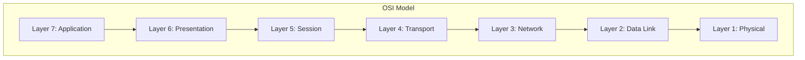

| Layer | Name | PDU | Protocols/Technologies | Devices |
|-------|------|-----|----------------------|---------|
| 7 | Application | Data | HTTP, FTP, SMTP, DNS, SSH | Application gateways |
| 6 | Presentation | Data | SSL/TLS, JPEG, ASCII, MPEG | — |
| 5 | Session | Data | NetBIOS, RPC, PPTP | — |
| 4 | Transport | Segment/Datagram | TCP, UDP, SCTP | — |
| 3 | Network | Packet | IP, ICMP, ARP, OSPF | Routers, L3 switches |
| 2 | Data Link | Frame | Ethernet, Wi-Fi, PPP | Switches, bridges |
| 1 | Physical | Bit | Cables, radio, fiber | Hubs, repeaters |

### Layer Details

#### Layer 1 — Physical

The Physical layer deals with the raw transmission of bits over a physical medium:

- **Copper cables**: Cat5e, Cat6, Cat6a (Ethernet)
- **Fiber optic**: Single-mode, multi-mode
- **Wireless**: Radio frequencies (2.4 GHz, 5 GHz, 6 GHz)
- **Signaling**: Voltage levels, light pulses, radio waves

#### Layer 2 — Data Link

The Data Link layer provides node-to-node data transfer and handles error detection:

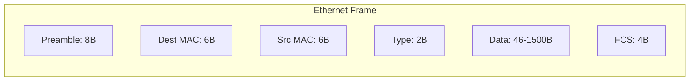

**Key concepts:**
- **MAC addresses**: 48-bit hardware addresses (e.g., `00:11:22:33:44:55`)
- **VLAN tagging**: IEEE 802.1Q for network segmentation
- **ARP**: Address Resolution Protocol maps IP to MAC addresses
- **Switching**: MAC address learning and forwarding

#### Layer 3 — Network

The Network layer handles logical addressing and routing:

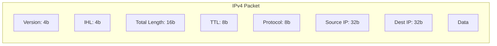

**Key concepts:**
- **IP addresses**: Logical addresses (IPv4: 32-bit, IPv6: 128-bit)
- **Subnetting**: Dividing networks into smaller subnets
- **Routing**: Determining the best path to a destination
- **ICMP**: Error reporting and diagnostics

#### Layer 4 — Transport

The Transport layer provides end-to-end communication:

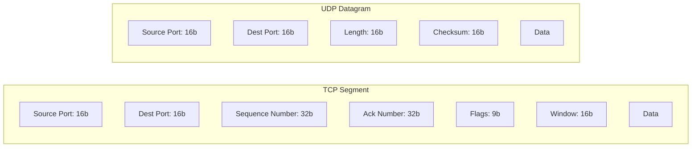

**TCP vs UDP:**

| Feature | TCP | UDP |
|---------|-----|-----|
| Connection | Connection-oriented | Connectionless |
| Reliability | Guaranteed delivery | Best effort |
| Ordering | Ordered | Unordered |
| Flow control | Yes | No |
| Overhead | Higher | Lower |
| Use cases | Web, email, file transfer | DNS, video, gaming |

#### Layer 5-7 — Session, Presentation, Application

These upper layers handle application-specific communication:

- **Layer 5 (Session)**: Manages sessions between applications
- **Layer 6 (Presentation)**: Data encryption, compression, encoding
- **Layer 7 (Application)**: User-facing protocols (HTTP, SSH, DNS)

## The TCP/IP Model

The TCP/IP model is a simplified four-layer model used in practice:

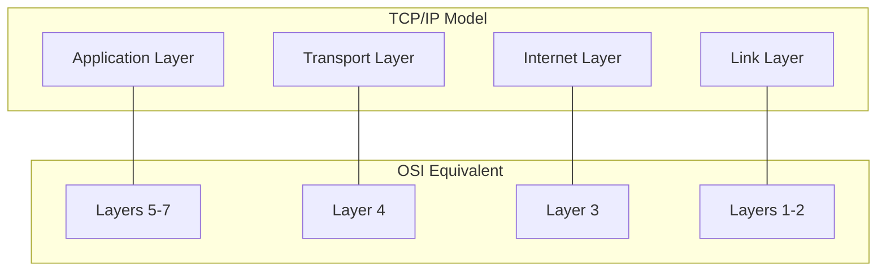

### Comparison with OSI

| TCP/IP Layer | OSI Layers | Protocols |
|--------------|------------|-----------|
| Application | 5, 6, 7 | HTTP, SSH, DNS, FTP, SMTP |
| Transport | 4 | TCP, UDP |
| Internet | 3 | IP, ICMP, ARP |
| Link | 1, 2 | Ethernet, Wi-Fi, PPP |

## Encapsulation

Encapsulation is the process of wrapping data with protocol headers as it moves down the stack:

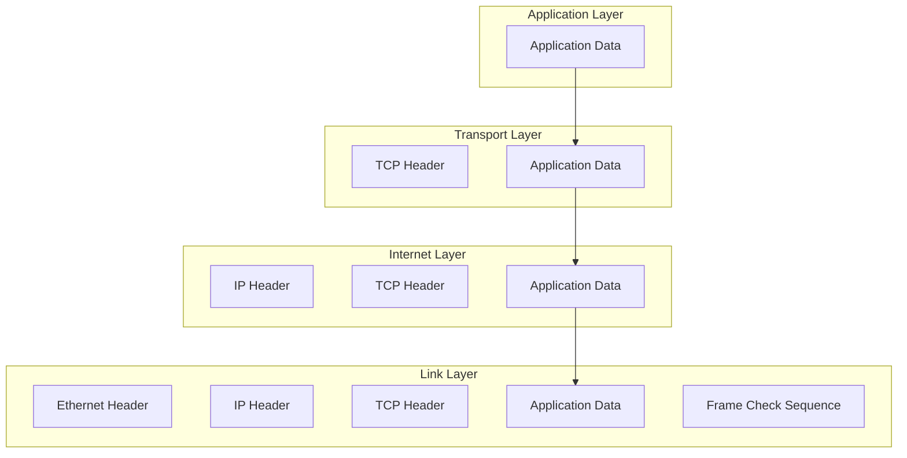
### Encapsulation Example

Sending an HTTP request:

```┌─────────────────────────────────────────────────────────────┐
│ Ethernet Header                                              │
│  Dest MAC: 00:11:22:33:44:55                                │
│  Src MAC:  AA:BB:CC:DD:EE:FF                                │
│  Type: 0x0800 (IPv4)                                         │
├─────────────────────────────────────────────────────────────┤
│ IP Header                                                    │
│  Version: 4  IHL: 5  TTL: 64                                │
│  Protocol: 6 (TCP)                                           │
│  Src IP: 192.168.1.10                                        │
│  Dst IP: 93.184.216.34                                       │
├─────────────────────────────────────────────────────────────┤
│ TCP Header                                                   │
│  Src Port: 54321  Dst Port: 80                               │
│  Seq: 12345678  Ack: 0                                       │
│  Flags: SYN                                                  │
├─────────────────────────────────────────────────────────────┤
│ HTTP Data                                                    │
│  GET / HTTP/1.1\r\n                                          │
│  Host: example.com\r\n                                       │
│  \r\n                                                        │
└─────────────────────────────────────────────────────────────┘
```

## Data Flow Through the Network Stack

### Sending Data

When an application sends data:

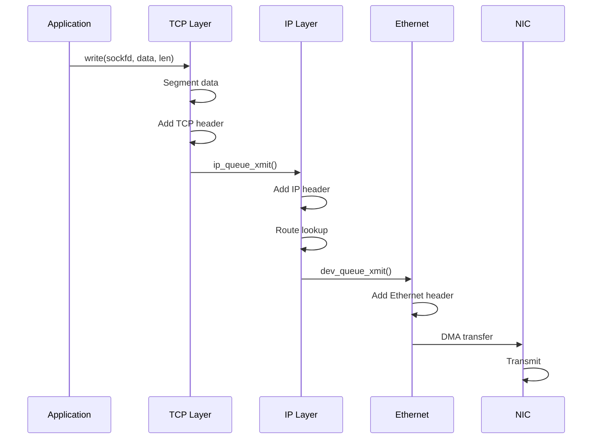

### Receiving Data

When data arrives at the NIC:

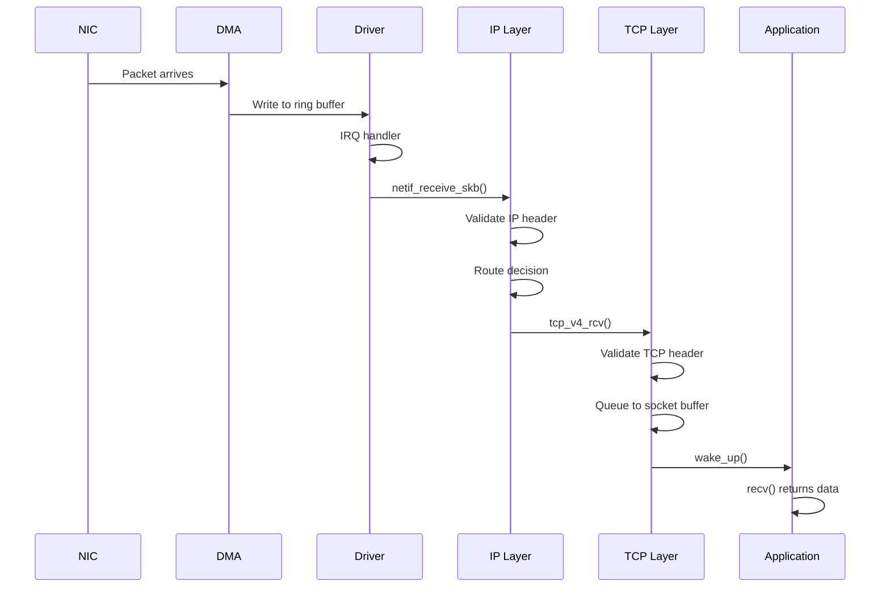

## IP Addressing

### IPv4 Address Classes

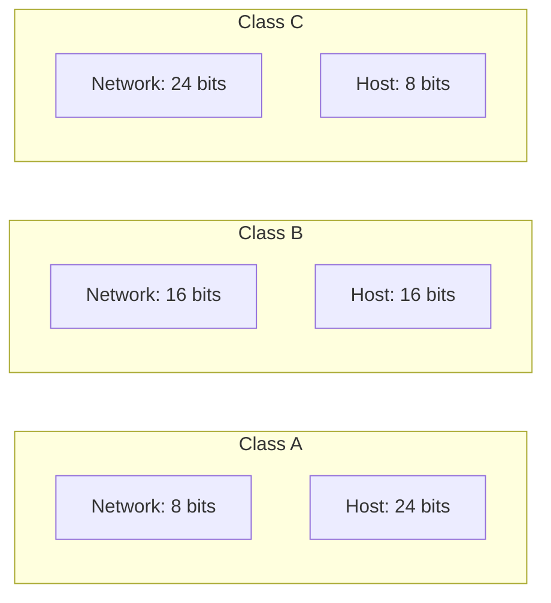
| Class | Range | Default Mask | Networks | Hosts/Network |
|-------|-------|--------------|----------|---------------|
| A | 0-127 | /8 | 126 | 16,777,214 |
| B | 128-191 | /16 | 16,384 | 65,534 |
| C | 192-223 | /24 | 2,097,152 | 254 |

### Private Address Spaces

```10.0.0.0/8       — 10.0.0.0 to 10.255.255.255    (Class A)
172.16.0.0/12    — 172.16.0.0 to 172.31.255.255   (Class B)
192.168.0.0/16   — 192.168.0.0 to 192.168.255.255 (Class C)
```

### Subnetting

Subnetting divides a network into smaller subnets:

```
Network: 192.168.1.0/24
Subnet mask: 255.255.255.0

Subnet 1: 192.168.1.0/26   (hosts: 192.168.1.1 - 192.168.1.62)
Subnet 2: 192.168.1.64/26  (hosts: 192.168.1.65 - 192.168.1.126)
Subnet 3: 192.168.1.128/26 (hosts: 192.168.1.129 - 192.168.1.190)
Subnet 4: 192.168.1.192/26 (hosts: 192.168.1.193 - 192.168.1.254)
```

### CIDR Notation

CIDR (Classless Inter-Domain Routing) uses a prefix length:

```bash
# CIDR notation
$ ip addr show eth0
2: eth0: <BROADCAST,MULTICAST,UP,LOWER_UP> mtu 1500
    inet 192.168.1.10/24 brd 192.168.1.255 scope global eth0

# Calculate network
$ ipcalc 192.168.1.10/24
Address:   192.168.1.10
Netmask:   255.255.255.0 = 24
Network:   192.168.1.0/24
Broadcast: 192.168.1.255
HostMin:   192.168.1.1
HostMax:   192.168.1.254
Hosts/Net: 254
```

## MAC Addresses

MAC (Media Access Control) addresses are 48-bit hardware identifiers:

```
Format: AA:BB:CC:DD:EE:FF
        |---------|---------|
        OUI       Device ID
        (3 bytes) (3 bytes)
```

**Special MAC addresses:**
- `FF:FF:FF:FF:FF:FF` — Broadcast
- `01:00:5E:xx:xx:xx` — Multicast (IPv4)
- `33:33:xx:xx:xx:xx` — Multicast (IPv6)

## ARP (Address Resolution Protocol)

ARP resolves IP addresses to MAC addresses:

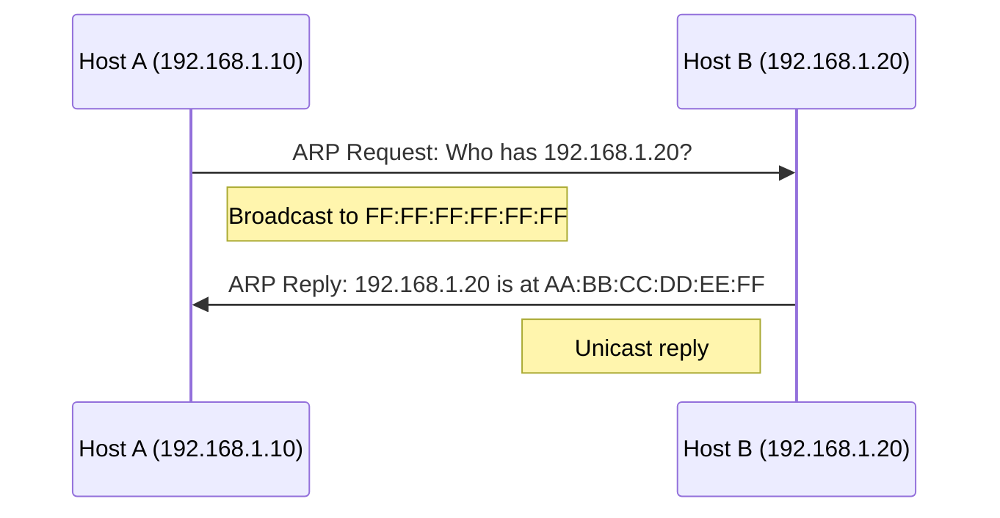
### ARP Cache

```bash
# View ARP cache
$ ip neigh show
192.168.1.1 dev eth0 lladdr 00:11:22:33:44:55 REACHABLE
192.168.1.20 dev eth0 lladdr AA:BB:CC:DD:EE:FF STALE

# Flush ARP cache
$ ip neigh flush all

# Add static ARP entry
$ ip neigh add 192.168.1.100 lladdr 00:11:22:33:44:55 dev eth0
```

## Routing

### Routing Table

```bash
# View routing table
$ ip route show
default via 192.168.1.1 dev eth0
192.168.1.0/24 dev eth0 proto kernel scope link src 192.168.1.10

# Add a route
$ ip route add 10.0.0.0/8 via 192.168.1.1

# Delete a route
$ ip route del 10.0.0.0/8

# View route for specific destination
$ ip route get 8.8.8.8
8.8.8.8 via 192.168.1.1 dev eth0 src 192.168.1.10 uid 1000
```

### Routing Process

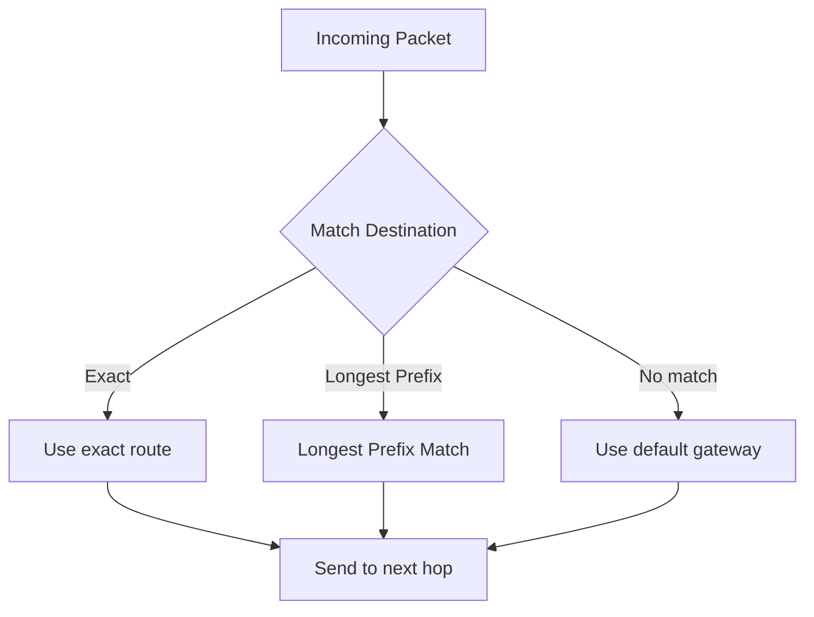
## ICMP (Internet Control Message Protocol)

ICMP is used for error reporting and diagnostics:

| Type | Code | Description |
|------|------|-------------|
| 0 | 0 | Echo Reply (ping response) |
| 3 | 0 | Destination Unreachable — Network |
| 3 | 1 | Destination Unreachable — Host |
| 3 | 3 | Destination Unreachable — Port |
| 8 | 0 | Echo Request (ping) |
| 11 | 0 | Time Exceeded — TTL expired |

### Ping

```bash
# Basic ping
$ ping -c 4 8.8.8.8
PING 8.8.8.8 (8.8.8.8) 56(84) bytes of data.
64 bytes from 8.8.8.8: icmp_seq=1 ttl=117 time=5.43 ms
64 bytes from 8.8.8.8: icmp_seq=2 ttl=117 time=5.21 ms
64 bytes from 8.8.8.8: icmp_seq=3 ttl=117 time=5.67 ms
64 bytes from 8.8.8.8: icmp_seq=4 ttl=117 time=5.34 ms

--- 8.8.8.8 ping statistics ---
4 packets transmitted, 4 received, 0% packet loss, time 3005ms
rtt min/avg/max/mdev = 5.210/5.412/5.670/0.189 ms
```

### Traceroute

```bash
# Traceroute
$ traceroute 8.8.8.8
traceroute to 8.8.8.8 (8.8.8.8), 30 hops max, 60 byte packets
 1  192.168.1.1 (192.168.1.1)  1.234 ms  1.123 ms  1.098 ms
 2  10.0.0.1 (10.0.0.1)  5.432 ms  5.321 ms  5.234 ms
 3  * * *
 4  8.8.8.8 (8.8.8.8)  10.123 ms  10.098 ms  10.076 ms
```

## Network Diagnostic Tools

### tcpdump

```bash
# Capture all traffic on interface
$ sudo tcpdump -i eth0

# Capture specific host
$ sudo tcpdump -i eth0 host 192.168.1.100

# Capture specific port
$ sudo tcpdump -i eth0 port 80

# Capture TCP SYN packets
$ sudo tcpdump -i eth0 'tcp[tcpflags] & tcp-syn != 0'

# Write to file
$ sudo tcpdump -i eth0 -w capture.pcap

# Read from file
$ tcpdump -r capture.pcap
```

### ss (Socket Statistics)

```bash
# Show all TCP sockets
$ ss -t

# Show listening sockets
$ ss -tln

# Show sockets with process info
$ ss -tunap

# Show socket memory usage
$ ss -t -m

# Filter by state
$ ss -t state established
```

### netstat

```bash
# Show all listening ports
$ netstat -tln

# Show routing table
$ netstat -rn

# Show interface statistics
$ netstat -i
```

## Network Namespaces

Linux network namespaces provide isolated network environments:

```bash
# Create a network namespace
$ sudo ip netns add mynet

# List namespaces
$ sudo ip netns list

# Run command in namespace
$ sudo ip netns exec mynet ip addr show

# Create veth pair
$ sudo ip link add veth0 type veth peer name veth1

# Move interface to namespace
$ sudo ip link set veth1 netns mynet

# Configure interface in namespace
$ sudo ip netns exec mynet ip addr add 10.0.0.2/24 dev veth1
$ sudo ip netns exec mynet ip link set veth1 up
```

## VLANs

VLANs (Virtual LANs) segment networks at Layer 2:

```bash
# Create VLAN interface
$ sudo ip link add link eth0 name eth0.100 type vlan id 100

# Configure VLAN
$ sudo ip addr add 192.168.100.1/24 dev eth0.100
$ sudo ip link set eth0.100 up

# Show VLAN info
$ cat /proc/net/vlan/config
Name VID:  Flags:  Device:
eth0.100 100  0x1    eth0
```

## Wireless Networking

### Wi-Fi Basics

```bash
# List wireless interfaces
$ iwconfig

# Scan for networks
$ sudo iwlist wlan0 scan

# Connect to network
$ sudo iwconfig wlan0 essid "MyNetwork"

# Using NetworkManager
$ nmcli device wifi list
$ nmcli device wifi connect "MyNetwork" password "mypassword"
```

## References

- [The Linux Kernel Documentation](https://docs.kernel.org/)
- [LWN.net - Linux and free software news](https://lwn.net/)
- [GNU Project Documentation](https://www.gnu.org/doc/doc.html)
- [GNU Manuals](https://www.gnu.org/manual/manual.html)
- [Free Software Directory](https://directory.fsf.org/wiki/Main_Page)
- [Planet GNU](https://planet.gnu.org/)
- [Free Software Books](https://www.gnu.org/doc/other-free-books.html)

1. **RFC 791** — Internet Protocol
2. **RFC 793** — Transmission Control Protocol
3. **RFC 768** — User Datagram Protocol
4. **RFC 792** — Internet Control Message Protocol
5. **RFC 826** — Ethernet Address Resolution Protocol
6. *Computer Networking: A Top-Down Approach* by James Kurose and Keith Ross
7. *TCP/IP Illustrated, Volume 1* by W. Richard Stevens

## Related Topics

- [TCP/IP Suite](tcpip-suite.md) — Deep dive into TCP/IP protocols
- [DNS](dns.md) — Domain Name System
- [SSH](ssh.md) — Secure Shell
- [TLS](tls.md) — Transport Layer Security
- [Kernel Networking Overview](../kernel/networking/overview.md) — How the kernel handles networking
