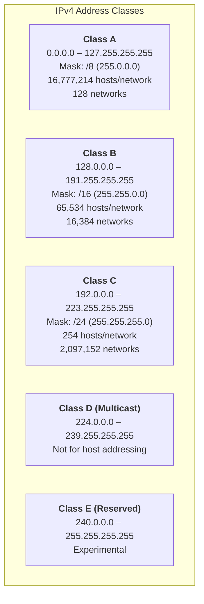
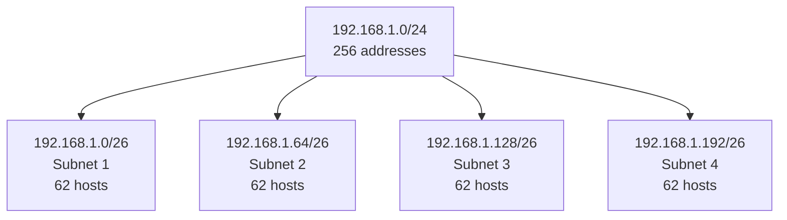
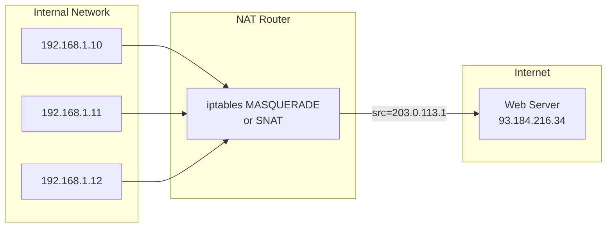

# IP Addressing and Subnetting

## Introduction

IP addressing is the backbone of network communication. Every device on an IP network requires a unique address to send and receive data. This chapter covers IPv4 addressing in depth — from the original classful system to modern CIDR-based allocation, subnetting techniques, NAT, and private address ranges. Understanding IP addressing is essential for Linux system administrators who configure interfaces, design networks, and troubleshoot connectivity.

## IPv4 Address Structure

An IPv4 address is a **32-bit number**, typically written as four octets in dotted-decimal notation:

```
192.168.1.50
│   │   │  │
│   │   │  └── 4th octet (8 bits)
│   │   └───── 3rd octet (8 bits)
│   └───────── 2nd octet (8 bits)
└───────────── 1st octet (8 bits)

Binary: 11000000.10101000.00000001.00110010
```

Each address has two parts:
- **Network portion**: Identifies the network
- **Host portion**: Identifies a specific device on that network

The **subnet mask** determines where the network portion ends and the host portion begins.

## Classful Addressing (Historical)

The original Internet addressing scheme divided IPv4 into five classes:



| Class | First Octet Range | Default Mask | Network Bits | Host Bits | Max Hosts |
|-------|-------------------|-------------|--------------|-----------|-----------|
| A | 0–127 | /8 | 8 | 24 | 16,777,214 |
| B | 128–191 | /16 | 16 | 16 | 65,534 |
| C | 192–223 | /24 | 24 | 8 | 254 |
| D | 224–239 | N/A | Multicast | — | — |
| E | 240–255 | N/A | Reserved | — | — |

**Determining the class from the first octet:**

```bash
# First octet in binary determines the class:
# 0xxxxxxx = Class A   (0–127)
# 10xxxxxx = Class B   (128–191)
# 110xxxxx = Class C   (192–223)
# 1110xxxx = Class D   (224–239)
# 1111xxxx = Class E   (240–255)

# Example: 172.16.5.1
# 172 = 10101100 → starts with 10 → Class B
```

Classful addressing is **obsolete** (superseded by CIDR in 1993), but understanding it is important because:
- Many certification exams still test it
- Subnet mask conventions derive from it
- Historical context explains why certain ranges are "private"

## CIDR — Classless Inter-Domain Routing

**CIDR** (defined in RFC 4632) replaced classful addressing by allowing **variable-length subnet masks (VLSM)**. An address is written as `prefix/prefix_length`:

```
192.168.1.0/24
              └── 24 bits for network, 8 bits for host
```

**CIDR advantages:**
- Flexible allocation (not limited to /8, /16, or /24)
- Route aggregation (supernetting) reduces routing table size
- Efficient address utilization

### CIDR Notation Quick Reference

| CIDR | Subnet Mask | Total IPs | Usable Hosts | Wildcard Mask |
|------|-------------|-----------|--------------|---------------|
| /8 | 255.0.0.0 | 16,777,216 | 16,777,214 | 0.255.255.255 |
| /16 | 255.255.0.0 | 65,536 | 65,534 | 0.0.255.255 |
| /24 | 255.255.255.0 | 256 | 254 | 0.0.0.255 |
| /25 | 255.255.255.128 | 128 | 126 | 0.0.0.127 |
| /26 | 255.255.255.192 | 64 | 62 | 0.0.0.63 |
| /27 | 255.255.255.224 | 32 | 30 | 0.0.0.31 |
| /28 | 255.255.255.240 | 16 | 14 | 0.0.0.15 |
| /29 | 255.255.255.248 | 8 | 6 | 0.0.0.7 |
| /30 | 255.255.255.252 | 4 | 2 | 0.0.0.3 |
| /31 | 255.255.255.254 | 2 | 2 (P2P) | 0.0.0.1 |
| /32 | 255.255.255.255 | 1 | 1 (host) | 0.0.0.0 |

**Formula:**
- Total addresses = 2^(32 - prefix_length)
- Usable hosts = Total - 2 (network address + broadcast), except /31 and /32

## Subnetting

Subnetting divides a large network into smaller, more manageable subnetworks. It improves security, reduces broadcast domains, and organizes hosts logically.

### Subnetting Example

**Task**: Divide `192.168.1.0/24` into 4 equal subnets.



**Calculation:**

```
Original: 192.168.1.0/24
Need 4 subnets → borrow 2 bits (2^2 = 4)
New prefix: /24 + 2 = /26
Host bits: 32 - 26 = 6 → 2^6 - 2 = 62 hosts per subnet

Subnet 1: 192.168.1.0/26    (range: .0   – .63,   usable: .1   – .62)
Subnet 2: 192.168.1.64/26   (range: .64  – .127,  usable: .65  – .126)
Subnet 3: 192.168.1.128/26  (range: .128 – .191,  usable: .129 – .190)
Subnet 4: 192.168.1.192/26  (range: .192 – .255,  usable: .193 – .254)
```

**Binary breakdown:**

```
Original /24:  11000000.10101000.00000001 | 00000000
                                       ^^^^^^-- host bits

Subnetted /26: 11000000.10101000.00000001 | SS | HHHHHH
                                         ^^    ^^^^^^
                                    subnet bits  host bits

Subnet 1 (SS=00): 192.168.1.0/26
Subnet 2 (SS=01): 192.168.1.64/26
Subnet 3 (SS=10): 192.168.1.128/26
Subnet 4 (SS=11): 192.168.1.192/26
```

### Subnetting Practice Problem

**Task**: You need subnets for 5 departments with 50, 25, 12, 10, and 5 hosts. Starting from `10.0.0.0/24`.

```
Step 1: Sort by size (largest first)
  - Dept A: 50 hosts → need ≥ 52 addresses → /26 (62 hosts) ✓
  - Dept B: 25 hosts → need ≥ 27 addresses → /27 (30 hosts) ✓
  - Dept C: 12 hosts → need ≥ 14 addresses → /28 (14 hosts) ✓
  - Dept D: 10 hosts → need ≥ 12 addresses → /28 (14 hosts) ✓
  - Dept E:  5 hosts → need ≥  7 addresses → /29 (6 hosts) ✓

Step 2: Allocate sequentially
  10.0.0.0/26   → Dept A (50 hosts, range .0–.63)
  10.0.0.64/27  → Dept B (25 hosts, range .64–.95)
  10.0.0.96/28  → Dept C (12 hosts, range .96–.111)
  10.0.0.112/28 → Dept D (10 hosts, range .112–.127)
  10.0.0.128/29 → Dept E ( 5 hosts, range .128–.135)
  10.0.0.136/29 → (unused, available for expansion)
```

## Private Address Ranges (RFC 1918)

Not all IP addresses are routable on the public Internet. **RFC 1918** reserves three ranges for private use:

| Range | CIDR | Class | Addresses |
|-------|------|-------|-----------|
| 10.0.0.0 – 10.255.255.255 | 10.0.0.0/8 | A | 16,777,216 |
| 172.16.0.0 – 172.31.255.255 | 172.16.0.0/12 | B | 1,048,576 |
| 192.168.0.0 – 192.168.255.255 | 192.168.0.0/16 | C | 65,536 |

**Other special-use addresses (RFC 6890):**

| Range | Purpose |
|-------|---------|
| 127.0.0.0/8 | Loopback (127.0.0.1 = localhost) |
| 169.254.0.0/16 | Link-local (APIPA) |
| 224.0.0.0/4 | Multicast |
| 255.255.255.255/32 | Limited broadcast |

**Linux configuration:**

```bash
# Assign a private address
$ ip addr add 10.0.1.50/24 dev eth0

# Check which private range an address falls in
$ ipcalc 172.20.5.100/12
Address:   172.20.5.100        10101100.0001 0100.00000101.01100100
Netmask:   255.240.0.0 = 12    11111111.1111 0000.00000000.00000000
Wildcard:  0.15.255.255        00000000.0000 1111.11111111.11111111
Network:   172.16.0.0/12       10101100.0001 0000.00000000.00000000
HostMin:   172.16.0.1          10101100.0001 0000.00000000.00000001
HostMax:   172.31.255.254      10101100.0001 1111.11111111.11111110
Broadcast: 172.31.255.255      10101100.0001 1111.11111111.11111111
Hosts/Net: 1048574
```

## NAT — Network Address Translation

**NAT** translates private (RFC 1918) addresses to public addresses and vice versa, allowing multiple internal devices to share a single public IP.

### Types of NAT



| NAT Type | Description | Linux Implementation |
|----------|-------------|---------------------|
| **SNAT** | Source NAT — rewrite source IP on outbound | `iptables -t nat -A POSTROUTING -j SNAT --to-source 203.0.113.1` |
| **DNAT** | Destination NAT — rewrite destination IP on inbound (port forwarding) | `iptables -t nat -A PREROUTING -j DNAT --to-destination 192.168.1.10:80` |
| **MASQUERADE** | Dynamic SNAT for interfaces with changing IPs (e.g., DHCP) | `iptables -t nat -A POSTROUTING -o eth0 -j MASQUERADE` |
| **PAT** | Port Address Translation — many-to-one with port multiplexing | Handled by conntrack + MASQUERADE |

**Setting up NAT on Linux:**

```bash
# Enable IP forwarding
$ echo 1 > /proc/sys/net/ipv4/ip_forward
# Or permanently:
$ sysctl -w net.ipv4.ip_forward=1

# Configure MASQUERADE for outbound traffic
$ iptables -t nat -A POSTROUTING -s 192.168.1.0/24 -o eth0 -j MASQUERADE

# Port forwarding: redirect port 8080 on public IP to internal web server
$ iptables -t nat -A PREROUTING -i eth0 -p tcp --dport 8080 \
    -j DNAT --to-destination 192.168.1.10:80
$ iptables -A FORWARD -p tcp -d 192.168.1.10 --dport 80 -j ACCEPT

# View active NAT translations
$ conntrack -L
tcp  6 431999 ESTABLISHED src=192.168.1.10 dst=93.184.216.34 sport=49152 \
    dport=443 src=93.184.216.34 dst=203.0.113.1 sport=443 dport=49152 \
    [ASSURED] mark=0 use=1
```

## VLSM — Variable Length Subnet Masking

VLSM allows different subnet sizes within the same network, enabling efficient address allocation.

**Example — Enterprise network with VLSM:**

```
Given: 10.10.0.0/16

Allocate:
  WAN link 1:    10.10.0.0/30    (2 usable hosts — point-to-point)
  WAN link 2:    10.10.0.4/30    (2 usable hosts)
  Data center:   10.10.1.0/24    (254 hosts)
  Office LAN:    10.10.2.0/23    (510 hosts)
  DMZ:           10.10.4.0/24    (254 hosts)
  Management:    10.10.5.0/28    (14 hosts)
  Loopbacks:     10.10.255.0/24  (router loopback addresses)
```

## Binary Math for Subnetting

Understanding binary arithmetic is essential for subnet calculations.

**AND operation** — find the network address:

```
IP Address:    192.168.1.130 = 11000000.10101000.00000001.10000010
Subnet Mask:   255.255.255.192 = 11111111.11111111.11111111.11000000
─────────────────────────────────────────────────────────────────────
AND Result:    192.168.1.128 = 11000000.10101000.00000001.10000000
                                                (network address)
```

**Find broadcast address** — set all host bits to 1:

```
Network:       192.168.1.128 = 11000000.10101000.00000001.10000000
Host bits all 1:               11000000.10101000.00000001.10111111
Broadcast:     192.168.1.191
```

**Quick mental math tricks:**

```bash
# For /26 (mask = 255.255.255.192):
# Block size = 256 - 192 = 64
# Subnets start at: .0, .64, .128, .192
# 130 falls in .128 subnet (128–191)

# For /28 (mask = 255.255.255.240):
# Block size = 256 - 240 = 16
# Subnets start at: .0, .16, .32, .48, .64, ...
```

## Linux Network Configuration

### Using `ip` commands

```bash
# View all addresses
$ ip addr show
1: lo: <LOOPBACK,UP,LOWER_UP> mtu 65536
    inet 127.0.0.1/8 scope host lo
2: eth0: <BROADCAST,MULTICAST,UP,LOWER_UP> mtu 1500
    inet 192.168.1.50/24 brd 192.168.1.255 scope global eth0

# Add an address
$ ip addr add 10.0.0.1/24 dev eth0

# Add a secondary address
$ ip addr add 10.0.1.1/24 dev eth0 label eth0:1

# Remove an address
$ ip addr del 10.0.0.1/24 dev eth0

# Calculate subnet info with ipcalc
$ ipcalc 192.168.1.50/24
Address:   192.168.1.50
Network:   192.168.1.0/24
Netmask:   255.255.255.0
Broadcast: 192.168.1.255
HostMin:   192.168.1.1
HostMax:   192.168.1.254
Hosts/Net: 254
```

### Using `nmcli` (NetworkManager)

```bash
# Configure a static IP
$ nmcli con mod "Wired connection 1" \
    ipv4.addresses 192.168.1.50/24 \
    ipv4.gateway 192.168.1.1 \
    ipv4.dns "8.8.8.8,8.8.4.4" \
    ipv4.method manual

$ nmcli con up "Wired connection 1"
```

### Using systemd-networkd

```ini
# /etc/systemd/network/10-eth0.network
[Match]
Name=eth0

[Network]
Address=192.168.1.50/24
Gateway=192.168.1.1
DNS=8.8.8.8
DNS=8.8.4.4
```

## Common Subnetting Scenarios

### Scenario 1: Point-to-Point Links

Use `/31` subnets (RFC 3021) for point-to-point links to save addresses:

```bash
# Two routers connected directly
Router A: 10.0.0.0/31
Router B: 10.0.0.1/31

# Linux configuration
$ ip addr add 10.0.0.0/31 dev eth1
```

### Scenario 2: Cloud VPC Subnetting

```
VPC CIDR: 10.0.0.0/16

Public subnets (internet-facing):
  10.0.1.0/24  → AZ-a (web servers)
  10.0.2.0/24  → AZ-b (web servers)

Private subnets (internal):
  10.0.10.0/24 → AZ-a (application servers)
  10.0.11.0/24 → AZ-b (application servers)
  10.0.20.0/24 → AZ-a (databases)
  10.0.21.0/24 → AZ-b (databases)
```

## Further Reading

- [RFC 1918 — Address Allocation for Private Internets](https://www.rfc-editor.org/rfc/rfc1918)
- [RFC 4632 — Classless Inter-Domain Routing (CIDR)](https://www.rfc-editor.org/rfc/rfc4632)
- [RFC 3021 — Using /31 Subnets on Point-to-Point Links](https://www.rfc-editor.org/rfc/rfc3021)
- [RFC 6890 — Special-Purpose IP Address Registries](https://www.rfc-editor.org/rfc/rfc6890)
- [IP Calculator — Online Tool](http://jodies.de/ipcalc)
- [Linux `ip-address` man page](https://man7.org/linux/man-pages/man8/ip-address.8.html)

## Related Topics

- [IPv6](./ipv6.md) — The next generation of IP addressing
- [DHCP](./dhcp.md) — Automatic IP address assignment
- [NAT and Firewalls](../security/) — Network security at the IP layer
- [OSI Model](./osi-model.md) — Where IP addressing fits in the networking stack
- [Network Troubleshooting](./troubleshooting.md) — Debugging IP connectivity issues
- [Routing Protocols](./routing-protocols.md) — How routers share IP prefix information
