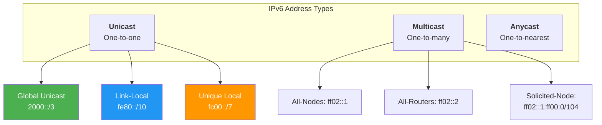
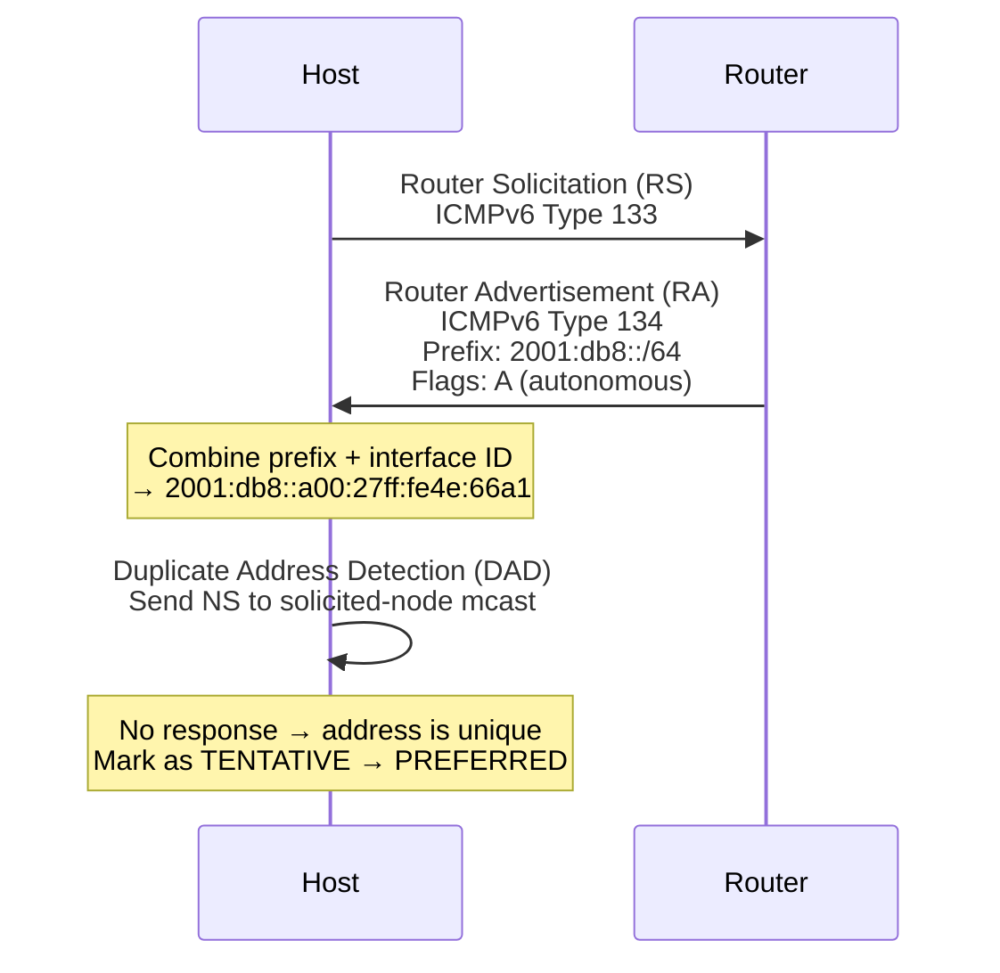
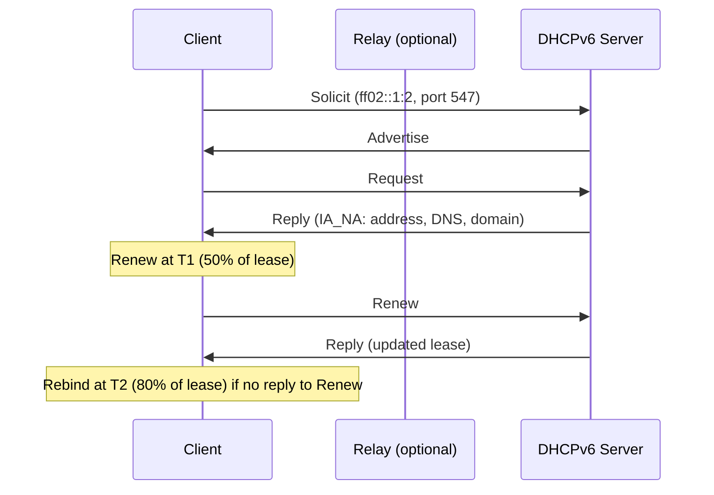
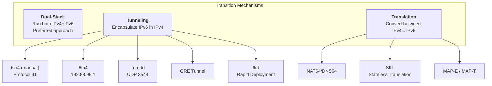

# IPv6

## Introduction

IPv6 (Internet Protocol version 6), defined in RFC 8200, is the successor to IPv4. Designed to solve the IPv4 address exhaustion problem, IPv6 provides a 128-bit address space (3.4×10³⁸ addresses), simplified header format, built-in security (IPsec), and autoconfiguration capabilities. As of 2024, approximately 40–45% of Internet traffic uses IPv6, and adoption continues to grow. Linux has had robust IPv6 support since kernel 2.2, and modern distributions enable it by default.

## IPv6 Address Format

An IPv6 address is **128 bits**, written as eight groups of four hexadecimal digits separated by colons:

```
2001:0db8:0000:0000:0000:0000:0000:0001
│         │    │    │    │    │    │    │
│         └────┴────┴────┴────┴────┴────┘── Interface ID (64 bits)
└────────────────────────────────────────── Global Routing Prefix + Subnet (64 bits)
```

### Abbreviation Rules

**Rule 1 — Leading zeros**: Omit leading zeros in each group:
```
2001:0db8:0000:0000:0000:0000:0000:0001
  →  2001:db8:0:0:0:0:0:1
```

**Rule 2 — Double colon**: Replace consecutive all-zero groups with `::` (only once):
```
2001:db8:0:0:0:0:0:1
  →  2001:db8::1
```

**Common addresses:**

| Full | Abbreviated | Description |
|------|-------------|-------------|
| `0000:0000:0000:0000:0000:0000:0000:0001` | `::1` | Loopback |
| `0000:0000:0000:0000:0000:0000:0000:0000` | `::` | Unspecified |
| `fe80:0000:0000:0000:0000:0000:0000:0001` | `fe80::1` | Link-local |
| `2001:0db8:0000:0000:0000:0000:0000:0000` | `2001:db8::` | Documentation prefix |

## IPv6 Address Types



### Global Unicast Addresses (GUA)

GUA addresses (`2000::/3`) are globally routable and equivalent to public IPv4 addresses. They use a **/64 prefix** for the network and a **/64 interface identifier**.

```
|<------ 48 bits ------>|<- 16 ->|<-------- 64 bits -------->|
   Global Routing Prefix  Subnet ID    Interface Identifier
       (ISP assigned)    (admin)    (SLAAC, DHCPv6, or static)

Example: 2001:db8:abcd:0001::1/64
         ├── Global prefix: 2001:db8:abcd
         ├── Subnet:        0001
         └── Interface ID:  ::1
```

### Link-Local Addresses (LLA)

Link-local addresses (`fe80::/10`) are **automatically configured** on every IPv6-enabled interface. They are only valid on the local link (not routed) and are used for:
- Neighbor Discovery Protocol (NDP)
- Routing protocol adjacencies
- Default gateway identification

```bash
# Every IPv6 interface automatically gets a link-local address
$ ip -6 addr show dev eth0
2: eth0: <BROADCAST,MULTICAST,UP,LOWER_UP>
    inet6 fe80::a00:27ff:fe4e:66a1/64 scope link
       valid_lft forever preferred_lft forever
```

**Link-local scope qualifier**: Because link-local addresses are only valid on a specific interface, they require a **zone ID** (scope ID):

```bash
# The %interface suffix specifies which link
$ ping6 fe80::1%eth0
$ ssh fe80::a00:27ff:fe4e:66a1%eth0

# In URLs:
# http://[fe80::1%25eth0]:8080/
```

### Unique Local Addresses (ULA)

ULA addresses (`fc00::/7`) are the IPv6 equivalent of RFC 1918 private addresses. They are not globally routable but provide unique addressing within an organization.

```
Prefix: fd00::/8 (fc00::/8 is undefined; fd is used in practice)
40-bit global ID (randomly generated) + 16-bit subnet + 64-bit interface ID

Example: fd12:3456:789a:0001::1/64
```

**Generating a ULA prefix:**

```bash
# Generate a random ULA prefix
$ python3 -c "
import random
prefix = 'fd{:02x}:{:04x}:{:04x}'.format(
    random.randint(0,255),
    random.randint(0,65535),
    random.randint(0,65535))
print(f'{prefix}::/48')"
fd7a:115c:a1e0:ab12::/48
```

### Multicast Addresses

IPv6 multicast replaces IPv4's broadcast. Key multicast addresses:

| Address | Scope | Description |
|---------|-------|-------------|
| `ff02::1` | Link-local | All nodes |
| `ff02::2` | Link-local | All routers |
| `ff02::5` | Link-local | OSPF routers |
| `ff02::6` | Link-local | OSPF designated routers |
| `ff02::9` | Link-local | RIPng routers |
| `ff02::fb` | Link-local | mDNS |
| `ff02::1:ff00:0/104` | Link-local | Solicited-node (for NDP) |

```bash
# View multicast group memberships
$ ip -6 maddr show
2: eth0
    inet6 ff02::1
    inet6 ff02::1:ff4e:66a1
    inet6 ff02::fb
```

### Solicited-Node Multicast Address

Every unicast address (GUA and LLA) has an associated **solicited-node multicast address** used by NDP (Neighbor Discovery Protocol) for efficient address resolution:

```
Unicast:     2001:db8::1
Solicited:   ff02::1:ff00:1  (ff02::1:ff + last 24 bits of unicast)
```

## SLAAC — Stateless Address Autoconfiguration

**SLAAC** (RFC 4862) allows hosts to automatically configure their IPv6 addresses without a DHCP server. The router advertises the network prefix, and the host generates its own interface identifier.



**Interface Identifier Generation:**

1. **EUI-64 (traditional)**: Derive from MAC address
   - MAC: `00:1a:2b:3c:4d:5e` → Insert `fffe` → Flip 7th bit → `021a:2bff:fe3c:4d5e`
2. **Privacy Extensions (RFC 4941)**: Random addresses that change periodically (default on most Linux distros)
3. **Stable Privacy (RFC 7217)**: Deterministic but not based on MAC

```bash
# Check how addresses are generated
$ sysctl net.ipv6.conf.eth0.addr_gen_mode
net.ipv6.conf.eth0.addr_gen_mode = 0
# 0 = EUI-64, 1 = stable-privacy, 2 = random (privacy extensions)

# Enable privacy extensions
$ sysctl -w net.ipv6.conf.eth0.use_tempaddr=2
# 0 = disabled, 1 = enabled (prefer temp), 2 = enabled (prefer temp for new connections)

# View temporary addresses
$ ip -6 addr show dev eth0 temporary
2: eth0: <BROADCAST,MULTICAST,UP,LOWER_UP>
    inet6 2001:db8::5a23:abcd:1234:5678/64 scope global temporary dynamic
       valid_lft 604799sec preferred_lft 86399sec
```

## DHCPv6

While SLAAC provides addresses, **DHCPv6** (RFC 8415) provides additional configuration like DNS servers, domain names, and other options. There are two modes:

| Mode | Description | Address Assignment |
|------|-------------|-------------------|
| **Stateless DHCPv6** | SLAAC for addresses + DHCPv6 for other config | SLAAC + DHCPv6 options |
| **Stateful DHCPv6** | DHCPv6 server assigns addresses | Full DHCPv6 (like DHCPv4) |



**Key differences from DHCPv4:**

| Feature | DHCPv4 | DHCPv6 |
|---------|--------|--------|
| Transport | UDP 67/68 | UDP 546/547 |
| Address for client | Broadcast (0.0.0.0 → 255.255.255.255) | Multicast (ff02::1:2, link-local) |
| Relay | DHCP Relay Agent (giaddr) | DHCPv6 Relay Agent (interface-id) |
| DUID | N/A | DHCP Unique Identifier (client ID) |
| IA (Identity Association) | N/A | IA_NA (addresses), IA_PD (prefix delegation) |

**Linux DHCPv6 client:**

```bash
# Using dhclient
$ dhclient -6 -P eth0   # Prefix delegation
$ dhclient -6 eth0      # Address assignment

# Using systemd-networkd
# /etc/systemd/network/10-eth0.network
[Match]
Name=eth0

[Network]
DHCP=yes

[DHCPv6]
UseDNS=yes
UseNTP=yes

# Using NetworkManager
$ nmcli con mod "Wired" ipv6.method dhcp
$ nmcli con up "Wired"
```

## Dual-Stack

**Dual-stack** means running IPv4 and IPv6 simultaneously on the same interfaces. This is the most common deployment model during the transition from IPv4 to IPv6.

```bash
# A dual-stack interface has both IPv4 and IPv6 addresses
$ ip addr show eth0
2: eth0: <BROADCAST,MULTICAST,UP,LOWER_UP> mtu 1500
    inet 192.168.1.50/24 brd 192.168.1.255 scope global eth0
    inet6 2001:db8::50/64 scope global dynamic
    inet6 fe80::a00:27ff:fe4e:66a1/64 scope link

# Both stacks route independently
$ ip -4 route show
default via 192.168.1.1 dev eth0

$ ip -6 route show
default via fe80::1 dev eth0 proto ra metric 100
2001:db8::/64 dev eth0 proto ra metric 100
```

**Application behavior with dual-stack:**

```bash
# curl prefers IPv6 if available (Happy Eyeballs algorithm)
$ curl -v https://example.com/
* Trying 2606:2800:220:1:248:1893:25c8:1946:443...
* Connected to example.com (2606:2800:220:1:248:1893:25c8:1946) port 443

# Force IPv4 or IPv6
$ curl -4 https://example.com/   # IPv4 only
$ curl -6 https://example.com/   # IPv6 only
```

## IPv6 Transition Mechanisms

For networks that cannot deploy native IPv6, several transition mechanisms exist:



### 6in4 Tunnel (Manual)

```bash
# Create a 6in4 tunnel
$ ip tunnel add tun6in4 mode sit remote 203.0.113.1 local 198.51.100.1
$ ip link set tun6in4 up
$ ip addr add 2001:db8::1/64 dev tun6in4
$ ip route add ::/0 dev tun6in4

# Or with /etc/network/interfaces (Debian):
# iface tun6in4 inet6 v4tunnel
#     address 2001:db8::1
#     netmask 64
#     endpoint 203.0.113.1
#     up ip route add default dev tun6in4
```

### WireGuard as IPv6 Tunnel

```bash
# WireGuard supports IPv6 natively
# /etc/wireguard/wg0.conf
[Interface]
PrivateKey = <key>
Address = fd00::1/64, 2001:db8:vpn::1/64
ListenPort = 51820

[Peer]
PublicKey = <peer-key>
AllowedIPs = ::/0   # Route all IPv6 through tunnel
Endpoint = 203.0.113.1:51820
```

### NAT64/DNS64

NAT64 allows IPv6-only clients to reach IPv4 servers:

```bash
# Using Tayga (userspace NAT64)
$ tayga --ipv4-addr 192.168.255.1 --ipv6-addr 2001:db8:64::1 \
    --prefix 2001:db8:64:ffff::/96 --dynamic-pool 192.168.255.0/24

# DNS64 synthesizes AAAA records from A records
# Bind9 configuration:
# dns64 2001:db8:64:ffff::/96 { clients { any; }; };
```

## IPv6 in the Linux Kernel

```bash
# View IPv6 kernel parameters
$ sysctl -a | grep net.ipv6.conf.eth0
net.ipv6.conf.eth0.accept_ra = 1          # Accept Router Advertisements
net.ipv6.conf.eth0.autoconf = 1           # Enable SLAAC
net.ipv6.conf.eth0.disable_ipv6 = 0       # IPv6 enabled
net.ipv6.conf.eth0.forwarding = 0         # Not forwarding
net.ipv6.conf.eth0.hop_limit = 64         # Default hop limit
net.ipv6.conf.eth0.mtu = 1500
net.ipv6.conf.eth0.use_tempaddr = 2       # Privacy extensions

# Disable IPv6 system-wide (not recommended)
$ sysctl -w net.ipv6.conf.all.disable_ipv6=1
$ sysctl -w net.ipv6.conf.default.disable_ipv6=1

# IPv6 neighbor cache (like ARP for IPv4)
$ ip -6 neigh show
2001:db8::1 dev eth0 lladdr aa:bb:cc:dd:ee:ff router REACHABLE
fe80::1 dev eth0 lladdr aa:bb:cc:dd:ee:ff router STALE
```

## IPv6 Security Considerations

- **No NAT by default**: IPv6 end-to-end connectivity means hosts are directly addressable — firewall rules are essential
- **Router Advertisement Guard (RA Guard)**: Prevent rogue RAs on switches
- **DHCPv6 Guard**: Prevent rogue DHCPv6 servers
- **Source Address Validation**: BCP 38 / ingress filtering

```bash
# ip6tables firewall rules
$ ip6tables -A INPUT -i eth0 -p ipv6-icmp --icmpv6-type neighbour-solicitation -j ACCEPT
$ ip6tables -A INPUT -i eth0 -p ipv6-icmp --icmpv6-type neighbour-advertisement -j ACCEPT
$ ip6tables -A INPUT -i eth0 -p ipv6-icmp --icmpv6-type router-advertisement -j ACCEPT
$ ip6tables -A INPUT -i eth0 -p tcp --dport 22 -j ACCEPT
$ ip6tables -A INPUT -i eth0 -j DROP
```

## Troubleshooting IPv6

```bash
# Test IPv6 connectivity
$ ping6 2001:4860:4860::8888   # Google DNS
$ traceroute6 2001:4860:4860::8888

# Check if a domain has AAAA records
$ dig example.com AAAA +short
2606:2800:220:1:248:1893:25c8:1946

# Test IPv6 HTTP
$ curl -6 -v https://example.com/

# View IPv6 routing table
$ ip -6 route show
$ ip -6 route get 2001:4860:4860::8888

# View NDP cache
$ ip -6 neigh show
$ ndisc6 2001:db8::1 eth0   # Send NDP queries

# Check RA messages
$ rdisc6 eth0
```

## Further Reading

- [The Linux Kernel Documentation](https://docs.kernel.org/)
- [LWN.net - Linux and free software news](https://lwn.net/)
- [GNU Project Documentation](https://www.gnu.org/doc/doc.html)
- [GNU Manuals](https://www.gnu.org/manual/manual.html)
- [Free Software Directory](https://directory.fsf.org/wiki/Main_Page)
- [Planet GNU](https://planet.gnu.org/)
- [Free Software Books](https://www.gnu.org/doc/other-free-books.html)

- [RFC 8200 — Internet Protocol, Version 6 (IPv6)](https://www.rfc-editor.org/rfc/rfc8200)
- [RFC 4862 — IPv6 Stateless Address Autoconfiguration](https://www.rfc-editor.org/rfc/rfc4862)
- [RFC 8415 — Dynamic Host Configuration Protocol for IPv6](https://www.rfc-editor.org/rfc/rfc8415)
- [RFC 4941 — Privacy Extensions for SLAAC](https://www.rfc-editor.org/rfc/rfc4941)
- [RFC 7217 — Stable Privacy Addresses](https://www.rfc-editor.org/rfc/rfc7217)
- [Linux IPv6 HOWTO](https://www.tldp.org/HOWTO/Linux+IPv6-HOWTO/)
- [IPv6.com — Practical Deployment](https://www.ipv6.com/)

## Related Topics

- [IP Addressing and Subnetting](./ip-addressing.md) — IPv4 addressing fundamentals
- [DHCP](./dhcp.md) — Dynamic host configuration
- [DNS](./dns.md) — AAAA records and IPv6 name resolution
- [VPN](./vpn.md) — IPv6 in tunnel configurations
- [OSI Model](./osi-model.md) — Network layer context
- [Network Troubleshooting](./troubleshooting.md) — Debugging IPv6 connectivity
